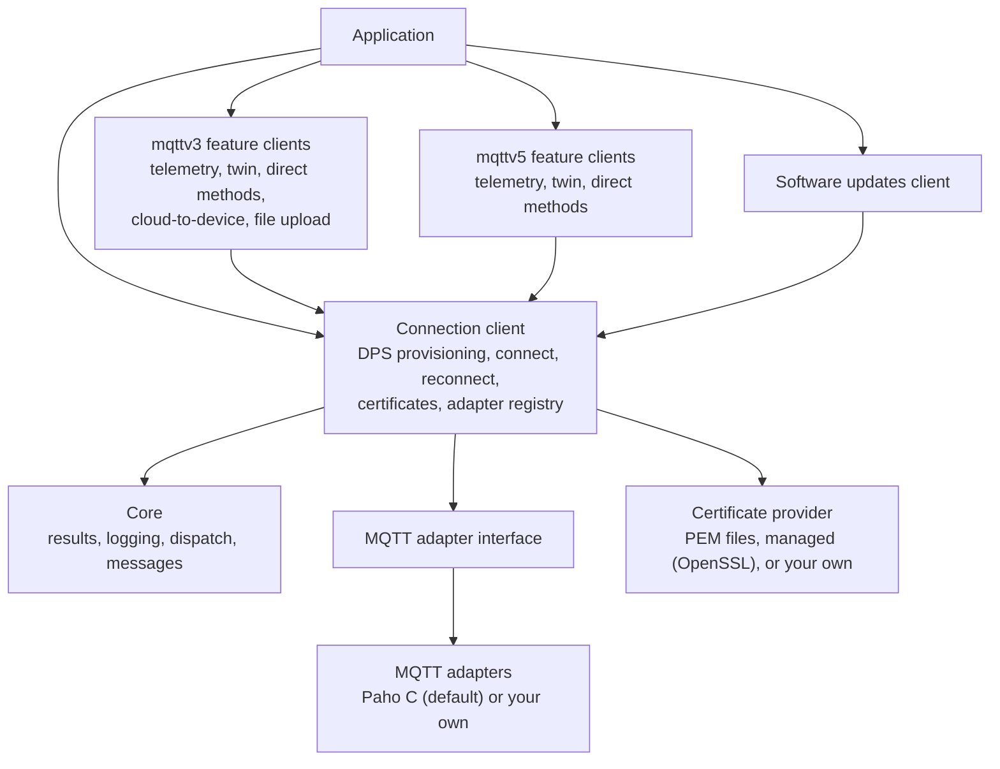

<!-- Copyright (c) Microsoft. All rights reserved.
     Licensed under the MIT license. See LICENSE file in the project root for full license information. -->

# Architecture

A C99 device SDK for Azure IoT Hub and the Azure IoT Hub Device Provisioning Service (DPS),
built for constrained and embedded devices.

- **Single-threaded API.** The connection and feature clients start no threads, and callbacks fire
  synchronously on the thread that called into the SDK. The Paho adapter runs Paho's own I/O
  threads internally and hands their events over to that thread. Callbacks are dispatched mostly
  from `az_iot_connection_client_do_work()`, but a feature client's own entry points can dispatch
  them too (for example `az_iot_su_client_do_work()` and `az_iot_su_client_resume()`).
- **No dynamic allocation in the connection and feature clients.** Buffers are caller-provided or
  live in caller-allocated structs. The reference PEM certificate provider is the exception: it
  reads the certificate, key and CA files into heap buffers once, at init.
- **Pluggable MQTT.** Any MQTT client library can be used through a small adapter interface.
  Eclipse Paho C is the default.
- **Built on [azure-sdk-for-c](https://github.com/Azure/azure-sdk-for-c)** for spans, JSON,
  logging, and the IoT Hub and DPS MQTT topic formats. It is fetched at a pinned tag
  (`AZ_SDK_C_TAG`).

## Layers

| Layer | Headers | Role |
| --- | --- | --- |
| Connection client | `az_iot_connection_client.h`, `az_iot_retry_policy.h` | One per device. Provisions through DPS, connects to the assigned hub, reconnects, and owns the MQTT session. |
| Feature clients | `mqttv3/*.h`, `mqttv5/*.h` | Protocol features. Each binds to a connection client, which delivers its messages. Some also need their own pump: call `az_iot_mqttv5_twin_client_do_work()` to expire unanswered requests. |
| Software updates client | `az_iot_su.h` | Checks for, verifies, downloads, installs and reports device updates. Pumped by `az_iot_su_client_do_work()`. |
| Certificate provider | `az_iot_certificate_provider.h` | Supplies TLS credentials and, optionally, handles CSRs and issued certificates. |
| MQTT adapter interface | `az_iot_mqtt_iface.h` | The contract an MQTT client library implements. |

`az_iot.h` includes the public headers.

## Hub generations: mqttv3 and mqttv5

A device is assigned by DPS to an IoT Hub that speaks one of two protocol generations:

| Generation | MQTT | Feature clients |
| --- | --- | --- |
| mqttv3 | 3.1.1 | `az_iot_mqttv3_*` |
| mqttv5 | 5 | `az_iot_mqttv5_*` |

DPS always uses MQTT 3.1.1. The DPS assignment carries a `connectionProfile`: `"mqttV5"` selects
mqttv5; `"classic"`, absent or `null` selects mqttv3. The SDK picks the MQTT version from it, and
the application reads the result with `az_iot_connection_client_get_hub_profile()`.

Rules:

- A connection serves one generation at a time. Attaching a feature client of the other
  generation fails with `AZ_IOT_ERR_CONNECTION_PROFILE_MISMATCH`.
- An unrecognised profile fails the connection with `AZ_IOT_ERR_CONNECTION_PROFILE_UNSUPPORTED`.
  The SDK does not guess.
- If a re-provisioning assigns the other generation, the connection faults with
  `AZ_IOT_ERR_CONNECTION_PROFILE_MISMATCH`. Rebuild the feature clients for the new profile, then
  `close()` and `open()`.

The samples under [`samples/unified`](../samples/unified) handle both generations;
[`samples/mqttv5`](../samples/mqttv5) targets mqttv5 only.

### Feature availability

| Feature | mqttv3 | mqttv5 |
| --- | --- | --- |
| Telemetry | Yes | Yes |
| Device twin | Yes | Yes |
| Direct methods | Yes | Yes |
| Cloud-to-device messages | Yes | No |
| File upload | Yes | No |
| Certificate renewal over the hub | Yes | No |
| Software updates | Yes, over DPS | Yes, over DPS |

## MQTT adapters

The connection client keeps a registry of adapter factories. Each factory declares the MQTT version
it speaks. For every session the client picks a factory for the required version and creates a
fresh adapter instance, so a device provisioned onto an mqttv5 hub uses a 3.1.1 adapter for DPS and
a 5 adapter for the hub.

The Paho C adapter (`az_iot_adapter_paho.h`) registers both versions. So does the az_mqtt adapter
(`az_iot_adapter_az_mqtt.h`, built with `AZ_IOT_WITH_AZ_MQTT=ON`): it connects and receives inside
`process_loop()` and writes sends when called, with no thread of its own, over the bundled
[deps/az_mqtt](../deps/az_mqtt/VENDORED.md) client. To use another MQTT library, see
[Bring your own MQTT client](how_to_byo_mqtt_client.md).

## Library boundaries

These are enforced in CI by [`eng/check-layering.sh`](../eng/check-layering.sh):

1. mqttv3 and mqttv5 sources and public headers never reference each other.
2. The core, including the connection client, never references `mqttv3_` or `mqttv5_` symbols.
   It publishes the resolved generation as data.
3. Each generation's public headers expose only constructs that generation supports.

## Further reading

- [Connecting a device](connecting.md): connection states, provisioning, reconnection, proxies,
  certificates.
- [Client configuration](client-configuration.md): build options, compile-time limits, run-time
  settings.
- [Struct versioning](struct_versioning.md): compatibility guarantees.
- [Bring your own MQTT client](how_to_byo_mqtt_client.md).
- [Samples](../samples/README.md).
