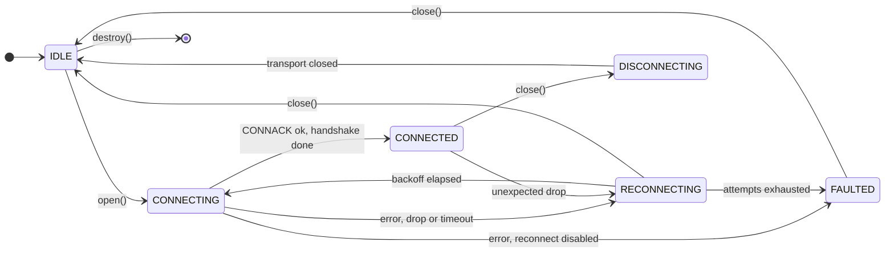
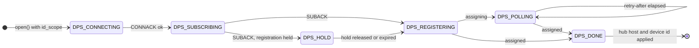
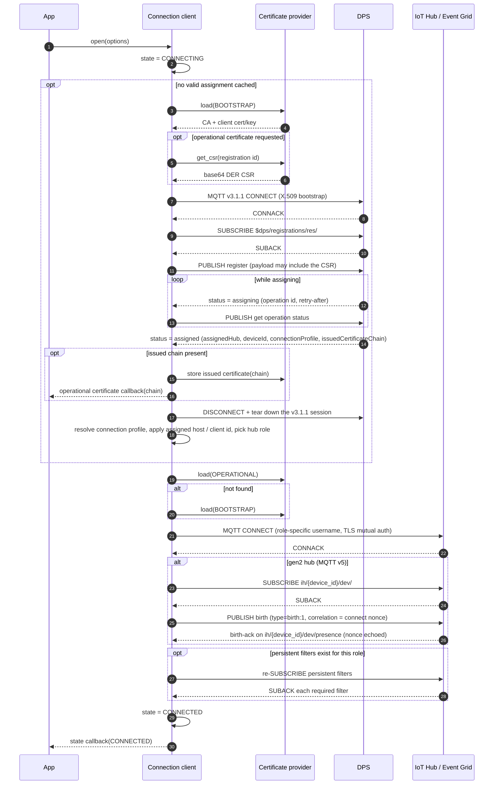
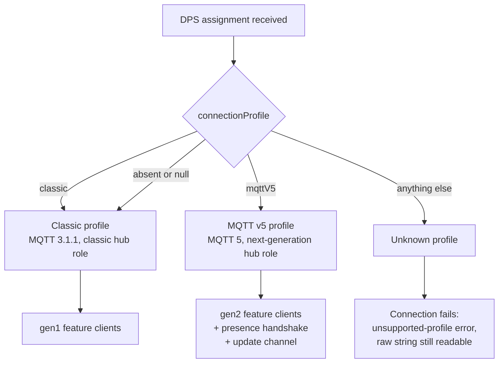
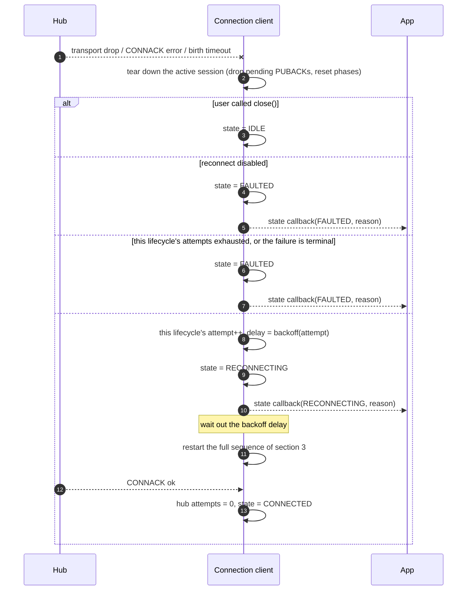
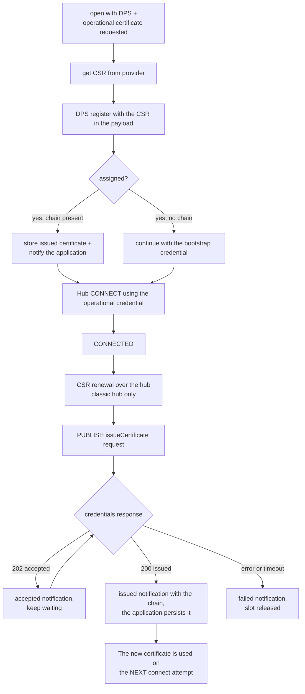
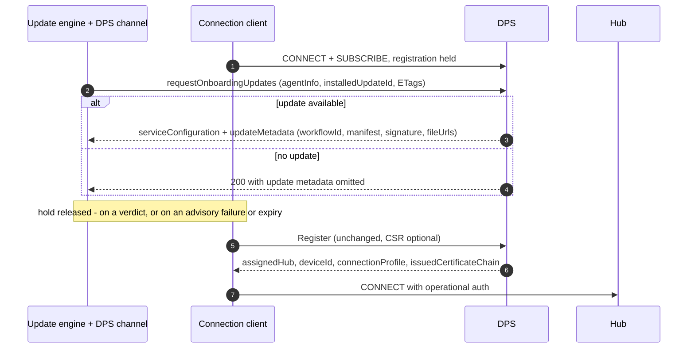
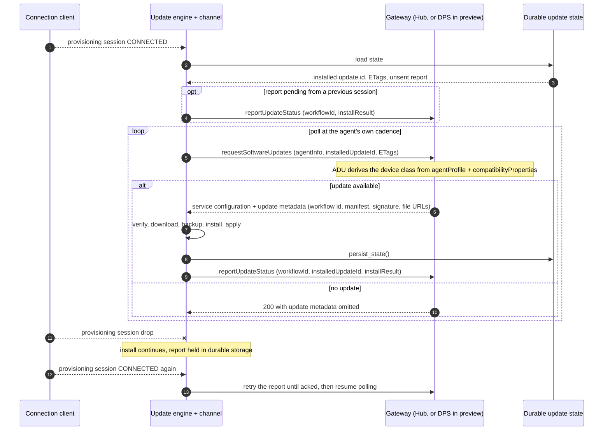
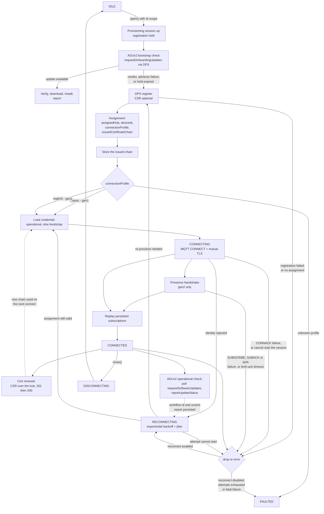

# Connection and Reconnection Lifecycle

Language-neutral reference for the device connection lifecycle in this repository. It defines the
contract that **every** client in this SDK family must honour — the C99 client under
[c/](../../c) and the .NET client under [dotnet/](../../dotnet) today — covering connection states,
provisioning, connection-profile selection, reconnection, certificate onboarding and renewal, and
device update (ADU).

This document owns the *behaviour*. It deliberately names no types, functions or files: each client
maps the concepts onto its own idioms, and those mappings are collected in
[§11](#11-language-mapping).

Related documents:

- [design.md](design.md) — layering and adapter model (C).
- [eng/certificate-management.md](eng/certificate-management.md) — CSR / operational certificate design.
- [eng/client-separation.md](eng/client-separation.md) — connection profile (§2) and the ADU channel split (§8).
- [eng/connection-state-and-error-propagation.md](eng/connection-state-and-error-propagation.md) — observer registry and status codes.
- [dps-integration.md](dps-integration.md), [devnotes.md](devnotes.md) — DPS contract and the running requirements log.
- [eng/aduv2-spec.md](eng/aduv2-spec.md) — the ADUv2 device contract, and the source for [§7](#7-device-update-onboarding-and-renewal).
  It owns the request/response shapes, error codes and trust model, which are deliberately not restated
  here. [eng/adu-client-design.md](eng/adu-client-design.md) covers the shared verify/download/install
  engine, which is unchanged from ADUv1.

---

## 1. Vocabulary

| Term | Meaning |
| --- | --- |
| **State** | User-visible connection lifecycle value, reported to the application through a callback, event or observable property. |
| **Connection profile** | What the device is connected to, as declared by DPS: `classic` or `mqttV5`. Reported, never caller-selected. |
| **Generation** | The feature-client family selected by the profile: `gen1` (classic) or `gen2` (mqttV5). |
| **Role** | Which endpoint and protocol the current MQTT session targets: DPS (v3.1.1), classic hub (v3.1.1), or next-generation hub (v5). |
| **Phase** | Internal sub-step inside a state — DPS phases and presence (birth) phases. Not user-visible. |
| **Provisioning** | Obtaining a hub assignment from DPS. |
| **Onboarding** | Everything that happens against the DPS gateway under *onboarding auth*: the bootstrap update check, the CSR, and registration itself. |
| **Renewal** | The recurring, post-provisioning counterpart under *operational auth*: certificate re-issuance and the periodic update check. |
| **Bootstrap credential** | Initial device identity, used to reach DPS. |
| **Operational credential** | Certificate issued to the device in response to a CSR. |
| **Update channel** | The transport-carrying abstraction for update delivery and reporting, which keeps the update engine transport-independent. |

---

## 2. Top-level state machine

`FAULTED` is settled, not a dead end. The SDK never leaves it on its own — no internal retry runs
from there — but `close()` is legal from it and returns the client to `IDLE`, from which `open()`
starts a fresh attempt with the configuration and the attached feature clients intact. `open()`
itself remains `IDLE`-only.

State is reported **per lifecycle**. A device that provisions runs two: the provisioning session and
the hub session. Each has its own state from the diagram above, and every state event says which
one it is about. The provisioning lifecycle reports `CONNECTED` once its response subscription is
confirmed — the point at which the session is usable — and `DISCONNECTING` then `IDLE` when it is
released. An application that only cares whether it can use hub features watches the hub
lifecycle alone.

Within the provisioning lifecycle, progress is tracked as a phase:

`DPS_HOLD` exists so a feature can use the provisioning session **before** the device registers —
the bootstrap update check of [§7.1](#71-onboarding--bootstrap-update-before-provisioning) is the
one that does. The hold is bounded (60 s by default): when it expires the device registers
regardless, so a feature can delay provisioning but never prevent it.

Every failure in a DPS phase is handled by the same backoff path as a hub failure, and a retry
restarts provisioning from `DPS_CONNECTING` — a rejected registration included. What does *not*
retry is an assignment the client cannot use: an unrecognised connection profile, or one that
contradicts the generation the attached feature clients require. See
[§5.3](#53-what-triggers-a-reconnect) for the split.

---

## 3. Full connect sequence

Key ordering guarantees that every client must honour:

1. `CONNECTED` is announced **after** the birth handshake (gen2) and **after** every required
  persistent subscription has been SUBACKed, so a feature client never observes `CONNECTED` while
  its topic filters are missing. gen2 feature delivery uses the single
  `ih/{device_id}/dev/#` presence wildcard; Classic feature filters and application custom topics
  use the persistent-subscription registry.

2. The provisioning session is released after registration **unless a feature still holds it**, in
   which case it stays up alongside the hub session and is pumped with it. Device update over the
   provisioning gateway is such a feature. With no holder the session is torn down before the hub
   session is created. DPS always uses MQTT 3.1.1, even when the hub session uses v5.
3. The operational certificate is preferred over the bootstrap certificate on every connect attempt,
   including reconnects.
4. **The bootstrap update check runs inside `open()`, ahead of registration.** The connection opens
   the provisioning session and, while a feature holds registration (`DPS_HOLD`), the update check
   runs on it. The check is **advisory**: if it fails or the hold expires, the device registers
   anyway. See [§7](#7-device-update-onboarding-and-renewal).
5. The DPS assignment is the single delivery point for everything the device learns about its
   placement: hub, device id, connection profile and issued certificate chain.
6. **A device with no hub declares it.** In provisioning-only mode the client keeps the provisioning
   session up, never registers and never connects to a hub: it settles with the provisioning
   lifecycle `CONNECTED` and the hub lifecycle `IDLE`, and every operation runs over the
   provisioning session. It is declared rather than inferred, because a hubless enrolment and a
   misconfigured one fail registration identically; inferring success would hide the
   misconfiguration. It cannot be combined with a request for an operational certificate, which is
   issued *by* a registration.

### 3.1 Egress: transport and proxy

Both connects above — the DPS bootstrap connect and the hub connect — use the same egress
configuration, because a device that needs a proxy or WebSockets to reach the hub needs them to
reach DPS first.

| Option | Effect |
| --- | --- |
| `transport` | `TCP` (default) or `WEBSOCKET`. WebSockets carries MQTT inside a WebSocket on 443, for a network that passes only HTTP(S) ports. |
| `websocket_path` | Defaults to `/$iothub/websocket`, which is what the hub and DPS expect. |
| `proxy` | Host, port and optional Basic credentials of an HTTP proxy. The connection is made with HTTP `CONNECT`, for both transports. |
| `port` | `0` derives the port from the transport: 8883 for TCP, 443 for WebSockets. An explicit value always wins. |

Two rules:

- **The proxy is a transport detail only.** TLS is negotiated with the broker *inside* the tunnel,
  so the proxy sees ciphertext, and chain and hostname validation are unchanged. The MQTT session,
  the identity and the reconnection policy are all unaffected.
- **A transport implementation that cannot honour the request must refuse it** with a distinct
  unsupported error.
  Connecting directly when a proxy was configured would bypass the egress control the caller
  selected, and connecting over TCP when WebSockets were selected would be blocked by the firewall
  the caller was working around; either would fail later and for the wrong reason.

- **A transport implementation may have its own environment-driven fallback.** Where one does,
  leaving the proxy setting unset can silently pick up an ambient proxy from the environment.
  Set it explicitly to be independent of that.

### 3.2 Session terms per role

Every CONNECT also carries the terms of the session it is opening, and the three roles do not want
the same thing.

| Role | MQTT | Clean start | Session expiry | Will |
| --- | --- | --- | --- | --- |
| Provisioning | 3.1.1 | clean, not overridable | n/a | never |
| Classic hub | 3.1.1 | resume by default | n/a | caller-supplied, if set |
| gen2 hub | 5 | resume by default | caller-supplied, default 1 h | caller-supplied, if set |

Rules every client must implement:

- **Provisioning always connects clean, and a caller cannot override it.** The provisioning service
  does not implement session persistence at all — it treats every session as non-persistent whatever
  the flag says — so honouring a request to resume would promise something the service does not do.
  This is a property of the *service*, not of how long the session lives, so it is unaffected by any
  change to when that session is torn down.
- **Both hub roles resume by default**, and both honour a caller's explicit choice. Resuming keeps
  the broker's subscription state and its in-flight QoS 1 redelivery across a transient drop.
  Connecting clean does not lose a server-side C2D queue — that is delivered once the device
  re-subscribes — but it does discard the subscription and any in-flight delivery, so resuming is
  the cheaper default.
- **On gen2 this is an efficiency choice, not a correctness one.** Every feature protocol is correct
  even if each connect started a fresh session; what resuming buys is redelivery and a saved
  re-subscribe. Both halves are required together — a session asked to expire the instant the
  connection closes is gone before any reconnect could resume it — which is why an expiry is set
  rather than left at zero.
- **Session expiry and the DISCONNECT reason code are MQTT 5 only.** A v3.1.1 CONNECT has no field
  to carry an expiry, and 3.1.1 has no DISCONNECT reason code.
- **The Will slot belongs to the application.** MQTT 5 allows exactly one Will per CONNECT, and
  device presence is derived from broker-emitted connection lifecycle events rather than from a
  device-authored will message, so taking the slot would deny the application its own
  "device went away" signal. A Will is never put on a provisioning session, whatever its lifetime:
  nothing consumes a will published there.
- **Whether the broker resumed the session is a diagnostic, not a trigger.** It is reported on both
  MQTT versions, and no feature client tears down state because of it. On Classic it is the only
  place the application learns whether the broker resumed it.

Session expiry is an operational tuning knob: a long expiry suits a rarely-connected, low-traffic
device, a shorter one an always-connected device under heavy traffic whose disconnected-session
queue would otherwise fill.

---

## 4. Connection profile selection

The profile is what DPS says the device landed on. It is **reported, never selected** — there is no
caller-facing knob, and falling back from one profile to another is application logic, not SDK
behaviour. See [eng/client-separation.md §2](eng/client-separation.md) for the full rationale.

| Wire value | Profile | MQTT | Generation |
| --- | --- | --- | --- |
| `"classic"`, absent, or `null` | classic | 3.1.1 | gen1 |
| `"mqttV5"` | MQTT v5 | 5 | gen2 |
| anything else | unknown | — | connection fails |

Rules every client must implement:

- `connectionProfile` is a `readOnly` **string** on the DPS registration result, delivered alongside
  `assignedHub`, `deviceId` and `issuedCertificateChain`. There is no numeric hub version on the wire.
- It is an **extensible union**, so the raw string must be preserved verbatim and not collapsed into a
  closed enum. A value newer than the SDK still has to be loggable. A client with bounded storage may
  cap the stored length, but must then report that the value was truncated and treat it as
  unrecognised — a truncated profile is never matched against a known one.
- An unrecognised profile **fails the connection** with a dedicated unsupported-profile error. The SDK
  will not guess which MQTT version to speak.
- The profile is readable only once `CONNECTED`; before that, querying it fails with a not-connected
  error.
- **A feature client may be created before or after `open()`.** It declares the generation it needs
  when it attaches. Two feature clients of different generations on one connection is refused
  immediately, at the second attach. A single generation declared before the assignment arrives is
  held until the assignment resolves, and refused then if the service assigned the other one.
- **A generation the attached feature clients cannot serve is terminal, not retried.**
  Re-provisioning would return the same profile while the same feature clients still require the
  other one, so an immediate retry cannot succeed. The application owns the recovery: destroy the
  feature clients, rebuild them for the profile the event carries, then close and reopen the
  connection. The connection client itself does not have to be destroyed.

> **Blocked on the DPS api-version.** `connectionProfile` is new in DPS `2026-11-02-preview`, and
> raising the requested api-version is a prerequisite for this entire section.

---

## 5. Reconnection

### 5.1 Backoff policy

The shape is the same in both clients — exponential growth, capped, jittered, reset on every
successful CONNACK — but the parameters and their defaults are **not** currently aligned:

| Property | C | .NET |
| --- | --- | --- |
| Growth | `initial_delay << (attempt - 1)`, shift clamped at 30 | `2^(baseExponent + attempt)` ms, exponent clamped at 32 |
| First delay (default) | 1 s | 128 ms (base exponent 6) |
| Cap (default) | 30 s | 60 s as configured by the connection client; 30 min for the bare policy default |
| Max attempts (default) | unlimited | unlimited |
| Jitter (default) | ±20 % of the computed delay | 95–105 % of the computed delay, skipped below 50 ms |
| What the cap bounds | the backoff only — a jittered delay may exceed it by up to the jitter fraction | the backoff only |
| Disable reconnect | zero initial delay | a no-retry policy |
| Policy is caller-replaceable | no — parameters only | yes — the policy itself is an interface |

Both clients also cap a single connect attempt with a timeout and treat the expiry as a failed
attempt.

**The cap bounds the backoff, not the delay.** Jitter varies around the capped backoff, so an
individual delay may exceed the cap by up to the jitter fraction. That is deliberate: clamping the
jittered result to the same cap folds the whole upper half of the distribution onto one value, so
once the ladder reaches the cap roughly half of all retries fire on exactly it — reintroducing, at
steady state, the synchronised fleet that jitter exists to prevent. A client must not clamp the
jittered result to the cap.

### 5.2 One retry ladder per lifecycle

A device that provisions runs two lifecycles ([§10](#10-connection-topology)), and each keeps its
**own** attempt counter and its own share of the attempt budget. A maximum-attempts setting is a
budget for **each** ladder, not one shared between them.

This is what stops one lifecycle's bad day from spending the other's: a device may exhaust its whole
hub budget and still get a full set of provisioning attempts, and a registration that follows an
exhausted hub ladder starts again at the initial delay instead of inheriting the hub's capped
backoff.

Which ladder a retry climbs is the lifecycle of the **next attempt**, which is not always the
lifecycle of the failure: a hub CONNACK that refuses the device's identity is a hub failure whose
retry is a provisioning attempt.

| Event | Effect |
| --- | --- |
| Registration succeeds | both ladders reset |
| Hub CONNACK succeeds (birth-ack on gen2) | the hub ladder resets; the provisioning ladder is untouched |
| The consecutive-hub-failure threshold is crossed | the provisioning ladder resets, so its first attempt waits the initial delay |
| `open()` / `close()` | both ladders reset |

> **Divergence to close.** Aligning the defaults, and deciding whether C should also accept a
> caller-supplied policy object, is open work. Applications must not depend on the current numbers
> being the same across languages.

### 5.3 What triggers a reconnect

- CONNACK with a non-success status.
- Unexpected transport disconnect or adapter error while `CONNECTING` or `CONNECTED`.
- Failure to establish the hub session on a reconnect attempt — a failed attempt re-arms the backoff
  rather than faulting, so the attempt counter and the retry policy govern how long this continues.
- Any failure in the gen2 presence handshake, not only its timeout: the presence SUBSCRIBE failing to
  be issued, a presence SUBACK carrying a failure status, and the birth PUBLISH failing all abandon
  the handshake and reconnect.
- A gen2 presence handshake step that does not complete in time. Every step is bounded — the
  subscription acknowledgement and the birth-ack each have their own 60 s deadline.

- **A rejected registration**, a registration that completes with no assignment, or a failure of the
  provisioning session itself. This is the **most** transient failure a device meets, not the least:
  the enrolment may not have been created yet, the provisioning service may not have a hub linked
  yet, or the service may simply have been unavailable. A device on its first boot, running slightly
  ahead of its own enrolment, must not end terminally. Where the service supplies a `retry-after`,
  it is a **floor** on the policy's delay — the longer of the two wins, and the policy's cap does not
  bound it: the cap bounds how long the client waits of its own accord, not how long the service
  asked to be left alone.

One case is deliberately **not** on that list, because retrying it cannot succeed:

- **An assignment the client cannot use is terminal.** A connection profile the client does not
  recognise, or one that contradicts the generation the attached feature clients require, fails the
  connection rather than reconnecting or guessing a protocol
  ([§4](#4-connection-profile-selection)). Re-registering returns the same answer.

One case reconnects but not to the same place: a CONNACK rejecting the device's **identity** marks
the client for re-provisioning, so the retry goes back through
DPS for a fresh assignment instead of presenting the same rejected credential to the same hub.

A user-initiated `close()` never triggers a reconnect: the intent to close is recorded and checked
before any backoff is scheduled. Where no retry policy is in effect, every trigger above faults
instead of reconnecting — reconnection is a policy, and its absence is not an error path of its own.

Some failures are **fatal** and must not be retried, because retrying cannot succeed — protocol
errors, malformed packets, authorization failures, session-taken-over, invalid topic filters and
server-moved among them. A fatal failure goes straight to `FAULTED` and is reported to the
application. [§9](#9-connection-failure-taxonomy) classifies every failure this document knows about
as terminal, retryable, contained or benign, and is the authority for which is which.

### 5.4 What is preserved across a reconnect

| Item | Preserved | Behaviour |
| --- | --- | --- |
| Persistent subscriptions | Yes | Re-issued on reconnect. Every required filter must be SUBACKed before `CONNECTED`; a missing SUBACK expires on the configured deadline and retries as a transient failure. |
| Assigned hub host / device id | Yes | Cached after the first DPS assignment. |
| Connection profile | Yes | Re-resolved from the new assignment. A change of generation is terminal and the application rebuilds its feature clients ([§4](#4-connection-profile-selection)). |
| Operational certificate | Yes | Owned by the certificate provider, reloaded on each attempt. |
| Update workflow state | Yes | Owned by the update engine and persisted, so an install survives a reconnect and a reboot. |
| Reconnect attempt counter | Reset on success | Incremented per failed attempt. |
| In-flight QoS 1 PUBACKs | No | Packet ids belong to the destroyed session; callers must re-send. |
| Twin GET/PATCH, method responses, telemetry in flight | No | Feature clients must re-issue. |
| Classic desired-property patches sent while disconnected | No | The hub does not queue them, and the client does not fetch the twin on reconnect. The application re-reads the twin if it needs the current desired state. |
| Update status report not yet acked | Yes | Held in durable storage and retried until acked; idempotent on the workflow id. |
| Presence (birth) phase | No | Restarted with a freshly generated nonce. |
| Provisioning phase | No | Provisioning is **not** re-run on an ordinary reconnect: once the device has an assignment, a reconnect re-establishes the *hub* session using the cached hub and device id. It is re-run only when something has invalidated the assignment — an identity refused at CONNACK, the consecutive-hub-failure threshold being crossed, or an assignment the client rejected. When it does re-run, it restarts from the beginning. |
| In-flight CSR operation | Yes | Survives the drop, and a response on the next session completes it. It fails with a timeout only at its own deadline, or ends when the application cancels it. |

### 5.5 Does the retry policy cover the *first* attempt?

Partly, and the split is deliberate.

| Failure | Retried under the policy? | Why |
| --- | --- | --- |
| The connect call cannot be issued at all — no transport for the required protocol version, credential material the transport cannot use, a missing or invalid option | **No.** The `open()` call itself returns the error and the client stays `IDLE`. | These are configuration and programming errors ([§9.4.8](#948-phase-8--framework-resource-and-programming-errors)). A retry reproduces them, and the caller is still on the stack to be told. |
| The attempt is issued and then fails — refused socket, TLS failure, CONNACK refusal, handshake timeout | **Yes**, exactly as on any later attempt. | The failure is a property of the moment or of the endpoint, not of the call. |

**The rule: a failure that `open()` can report synchronously is reported, never retried; a failure
that arrives after `open()` has returned goes through the policy.** An application therefore always
learns about a misconfiguration from the return value of the call it made, and never has to
discover it by watching for a state event that may be many backoff intervals away.

Two consequences worth stating, because both have bitten people:

- **A test that calls `open()` and asserts on its return value will not see a transient network
  failure** — that one is retried and surfaces as a state event. Tests should wait for `CONNECTED`
  or for a settled failure, not treat a successful `open()` as a connection.
- **Making the first attempt opt-out of the policy is not recommended.** It splits one behaviour
  across two configuration surfaces and makes the first failure of a device's life behave
  differently from every later one, for no gain the synchronous return value does not already
  provide.

---

## 6. Certificate management: onboarding and renewal

Two distinct issuance paths exist; both end with the certificate provider owning the operational
credential, and neither forces an immediate reconnect.

Renewal topics (classic hub), identical in both clients:

| Direction | Topic |
| --- | --- |
| Publish | `$iothub/credentials/POST/issueCertificate/?$rid={request_id}` |
| Subscribe | `$iothub/credentials/res/#` |
| Response | `$iothub/credentials/res/{status}/{request_id}` |

Rules that apply to every client:

- Only one CSR operation may be in flight; a further request must fail fast with a *busy* result.
- The issued chain is delivered leaf-first as base64 DER. Where the client hands it over in a callback
  it is only valid for the duration of that callback, so the application must copy or persist it.
- A successful renewal does **not** tear down the live session. The new credential takes effect on the
  next connect, whether that is a reconnect or an explicit reopen.
- At connect time the provider is asked for the operational credential first and falls back to the
  bootstrap credential when it is absent or uninitialized.
- CSR-based DPS enrollment requires the `2025-07-01-preview` DPS api-version.
- Renewal over a gen2 hub is not yet a supported service feature; a client that is asked for it must
  fail with an explicit unsupported error rather than silently doing nothing.

---

## 7. Device update: onboarding and renewal

What survives from ADUv1 is everything that has nothing to do with transport. Update support is
re-layered into a transport-independent **update engine** — manifest parsing, signature and root-key
verification, integrity hashing, the download/backup/install/apply state machine, and reboot/resume
persistence — plus an **update channel** abstraction carrying delivery and reporting.

ADUv2 is a **device-initiated pull protocol**, and its device-facing delivery moved **off** a
dedicated update HTTPS endpoint. The agent calls an updating operation on a gateway it already talks
to, reusing the credential it already has; the gateway is an authenticated pass-through. The device
never talks to the update service directly, needs no update-specific credential, and there is no twin,
no subscription and no unsolicited offer.

| Phase | Gateway | Operation (on the wire) | Spec working name |
| --- | --- | --- | --- |
| First-time / bootstrap (**before** provisioning) | DPS | `requestOnboardingUpdates` | `GetOnboardingDeviceUpdate` |
| Regular / operational (**after** provisioning) | DPS *(Ignite '26 interim)*, IoT Hub *(post-Ignite)* | `requestSoftwareUpdates` | `GetDeviceUpdate` |
| Reporting, either phase | same gateway as the fetch | `reportUpdateStatus` | `ReportDeviceUpdateStatus` |

All three are POSTs under the device's own registration on the gateway's device endpoint; see
[eng/aduv2-spec.md](eng/aduv2-spec.md) for the exact URL, headers and payloads, and for which parts
of the contract are measured rather than drafted.

The device selects onboarding vs regular **by which operation it calls**; the gateway does not infer
or validate the choice.

> **The hub-side updating API is not available in the first release.** In preview, DPS fronts both the
> bootstrap and the operational flow, using the existing DPS device credential (X.509 in phase 1). The
> operational path moves to IoT Hub afterwards **with no device-contract change** — same request and
> response, a different gateway. Treat the gateway as a channel parameter, not a constant.

### 7.1 Onboarding — bootstrap update, before provisioning

The critical ordering fact for this document: **the bootstrap update check happens before the device
registers.** It runs inside `open()`: the connection opens the provisioning session and holds
registration while the update client performs the check on it.

The check is **advisory and must never block provisioning.** If it errors, times out, the hold
expires, or the account is not linked, the device proceeds to register anyway.

- **Registration is held for the check, not for the install.** A check that finds an update releases
  the hold like any other verdict; the install, its report and any re-check run afterwards on the
  provisioning session the update client still holds. A bootstrap deployment can chain, so the agent
  re-checks after installing.
- Bootstrap progress is stored **in the bootstrap update job**, not on the device's own attributes —
  the device resource does not exist yet.
- Trust comes from the **root-key package** whose download URL is returned by the same call. Account
  scoping (an account id bound into the manifest signature) is **deferred**: DPS returns no account id,
  so the device verifies provenance but not account scoping. Base signature validation stays required.
- File URLs are **not** covered by the signed manifest; payloads are downloaded straight from blob
  storage and integrity comes from the per-file hashes inside the manifest.
- Bootstrap orchestration is entirely the agent's responsibility in the first release. DPS does **not**
  enforce that a device is on a given update version before provisioning it.

### 7.2 Renewal — operational update check, after `CONNECTED`

`installResult` carries the outcome, its failure origin and the hex
`extendedResultCodes` list. In-progress reports omit `stepResults`; terminal
reports include complete per-step outcomes when steps are available — see
[eng/aduv2-spec.md](eng/aduv2-spec.md) for the field-level shape.

### 7.3 Rules every client must implement

- **Poll, never wait.** The agent owns the cadence. A missed poll is not an error and there is no offer
  to lose, which is why a reconnect needs no replay of update subscriptions — there are none.
- **The workflow id is the correlation key.** It arrives in the update metadata and is echoed on the
  report. Reporting is **idempotent on the workflow id alone**; a conflicting terminal result for the
  same id is rejected as a conflict.
- **The device is the sole retrier.** The gateway fails fast with one attempt per hop. The agent
  honours `Retry-After` on throttling and retries `reportUpdateStatus` until it is acked — a
  report is a durable write and must not be lost.
- **Drive behaviour from the machine-readable error code, never the HTTP status.** A stale
  `agentInfoEtag` means resend the full `agentInfo`; a stale `serviceConfigEtag` means re-ask without
  it; an unlinked update account means "no update service configured", which is not a failure.
- **"No update" is a success.** It is a 200 with the update metadata omitted, not an error.
- **Update follows the provisioning lifecycle, not the hub one.** In preview its gateway is DPS, so it
  works whatever the hub state, and on a device with no hub at all. It never opens, closes or
  reconnects the **hub** session. It does hold the provisioning session: it holds registration for
  the advisory bootstrap check of [§7.1](#71-onboarding--bootstrap-update-before-provisioning), and it
  asks for a provisioning session to be opened when it needs one after the device has provisioned.
  A connection that has settled in `FAULTED` opens nothing until the application closes it.
- **Compatibility properties are opaque key/value pairs** (1–5) reported by the agent alongside an
  opaque agent profile; the service combines them into a device class. The agent assigns them no
  meaning.
- **The gateway is a channel parameter.** Bootstrap always uses DPS; operational uses DPS in preview and
  IoT Hub afterwards, with no device-contract change. This SDK plans to expose the operational channel
  as a gen2 feature client ([eng/client-separation.md](eng/client-separation.md) §8), but the service
  contract binds update delivery to the updating operations, not to a connection profile.

---

## 8. Combined reference diagram

One picture of the whole device lifecycle: connection and reconnection, connection-profile selection,
certificate management (onboarding + renewal) and device update (onboarding + renewal). Dotted edges
are deferred effects — they do not happen inline.

Reading it as four overlapping concerns:

| Concern | Onboarding (DPS gateway, onboarding auth) | Renewal (post-`CONNECTED`, operational auth) |
| --- | --- | --- |
| **Certificates** | CSR in the registration, issued chain in the assignment | CSR over the hub; new chain applies on the next connect |
| **Device update** | `requestOnboardingUpdates` loop **before** registration, advisory | Polled `requestSoftwareUpdates` / `reportUpdateStatus` (DPS in preview, Hub afterwards) |
| **Connection profile** | Declared in the assignment; selects MQTT version and generation | Re-resolved on every reconnect that goes through DPS |
| **Connection** | Provisioning lifecycle, with registration held for the bootstrap check | Backoff-driven reconnect replays the whole path |

The two onboarding concerns are **not** symmetric, and that asymmetry is the thing to remember: the
CSR travels *inside* registration, while the bootstrap update check happens *before* it, with
registration held for it.

---

## 9. Connection failure taxonomy

Every way the connection can fail, what each failure *is*, and what any client in this SDK family must
do about it. It is deliberately exhaustive rather than short: a cell that cannot be filled is a gap in
the design, and finding those is half the point of the table.

This section is language-neutral, like the rest of this document. It names no result codes, no
functions and no libraries — only what happens on the wire or in the host, and the behaviour the
contract requires.

### 9.1 Failure classes

A failure is described by **two independent axes**. They are not alternatives: every failure has a
value on each, and the rows in [§9.4](#94-the-taxonomy) give both.

**Axis 1 — retryability. What is worth doing about it.**

| Value | Definition | Required client behaviour |
| --- | --- | --- |
| **Terminal** | Deterministic. The same attempt, repeated, produces the same answer. | Stop. Report the reason. Do not schedule a backoff. |
| **Identity terminal** | Deterministic *for this credential or this identity*, and nothing else. A different assignment may well succeed. | Do not retry the same credential against the same endpoint. Re-provisioning for a fresh assignment — not retrying — is the recovery. |
| **Retryable** | Transient. The same attempt may succeed later. | Retry under the policy of [§5](#5-reconnection). Exhausting the policy is what turns it into a fault, not the failure itself. |

**Axis 2 — containment. What it takes down.**

| Value | Definition | Required client behaviour |
| --- | --- | --- |
| **Contained** | Scoped to one operation, one subscription or one feature. The connection itself is healthy. | Fail that operation and tell whoever asked for it. Do not tear down the session. Do not schedule a reconnect. |
| **Uncontained** | A property of the session. | Apply the retryability axis to the connection: fault it, or reconnect it. |

**Benign** is the third possibility and sits outside both axes: the event is expected and absorbed by
design. It must not surface to the application as a failure, and must not be logged at error
severity. `0x10 No matching subscribers` is the canonical example.

Why two axes and not one list: *contained and terminal* and *contained and retryable* are both real
and common. A publish refused with `0x87 Not authorized` is contained **and** terminal — resending it
cannot help, and the connection is fine. A publish refused with `0x97 Quota exceeded` is contained
**and** retryable. Collapsing the two into one enum forces a choice between telling the caller "do
not retry this" and telling it "the connection survived", when it needs both.

Three rules govern the boundaries:

- **The class is a property of the failure, not of the code path.** The same trigger reached from a
  first connect and from a reconnect has the same class.
- **An unrecognised code is Retryable, and keeps its value.** A client that does not know a code must
  neither guess its meaning nor collapse it into a known one. It preserves the numeric value for
  logging and takes the conservative branch: retry rather than abandon a credential that may be good.
- **Identity terminal is distinguished because it changes *where* the next attempt goes**, not only
  whether there is one. That is the only reason it is a separate value rather than a note on
  Terminal.

### 9.2 Failure phases

A failure is classified by the phase it occurs in, because the same underlying fault means different
things at different points in the sequence of [§3](#3-full-connect-sequence).

These are **not** the phases of [§1](#1-vocabulary) — those are internal sub-steps of a state. The
nine below are a classification axis for this section only, and two of them (DPS provisioning,
presence handshake) happen to line up with them.

| # | Phase | Spans |
| --- | --- | --- |
| 1 | Host, network and OS | Name resolution, address selection, socket setup, the host clock |
| 2 | TLS | From `ClientHello` to a usable encrypted channel |
| 3 | CONNECT / CONNACK | The MQTT session handshake |
| 4 | DPS provisioning | The whole DPS exchange, on the provisioning lifecycle |
| 5 | Presence handshake (gen2) | The `dev/#` subscription and the birth exchange |
| 6 | Subscription gate | Persistent feature subscriptions, before `CONNECTED` is announced |
| 7 | Steady state | Everything after `CONNECTED` |
| 8 | Framework, resource and programming errors | Bounds, tables, configuration, threading |
| 9 | Teardown | `close()` and destruction |

### 9.3 MQTT code reference

Every code is written as **value + spec name**, so that a reader who is not an MQTT expert can act on
a row without opening the specification. Values are verified against the OASIS standards:
MQTT 3.1.1 §3.2.2.3 (CONNACK) and §3.9.3 (SUBACK); MQTT 5.0 §3.2.2.2 (CONNACK), §3.9.3 (SUBACK),
§3.4.2.1 (PUBACK), §3.11.3 (UNSUBACK) and §3.14.2.1 (DISCONNECT).

> **Granted QoS below the requested QoS is a success, not a refusal.** In both protocol versions a
> subscription acknowledgement below `0x80` is a *grant*: the server has accepted the filter and is
> telling the client the maximum QoS it will deliver at. Only a value **`>= 0x80` is a refusal.**
> This SDK never requests QoS 2, so a downgrade does not arise in practice — the rule is pinned here
> so that a future client cannot read a granted QoS 0 against a requested QoS 1 as a failure.

#### 9.3.1 MQTT 3.1.1 CONNACK return codes (§3.2.2.3)

| Value | Spec name | Class | Required client behaviour |
| --- | --- | --- | --- |
| `0` | Connection Accepted | Benign | Proceed. |
| `1` | Connection Refused, unacceptable protocol version | **Terminal** | The server will not speak the version offered. Nothing about the device changes between attempts, so a retry cannot succeed. Fault and report. |
| `2` | Connection Refused, identifier rejected | **Identity terminal** | The client identifier is malformed or not permitted. The device re-provisions for a fresh assignment. |
| `3` | Connection Refused, Server unavailable | Retryable | The canonical transient refusal. |
| `4` | Connection Refused, bad user name or password | **Identity terminal** | Same handling as `2`. |
| `5` | Connection Refused, not authorized | **Identity terminal** | Same handling as `2`. Also what a server returns when it does not recognise the requested service api-version. |
| `6`–`255` | Reserved | Retryable | Unrecognised. Preserve the value, take the conservative branch. |

#### 9.3.2 MQTT 3.1.1 SUBACK return codes (§3.9.3)

| Value | Spec name | Class | Required client behaviour |
| --- | --- | --- | --- |
| `0x00` | Success – Maximum QoS 0 | Benign | Granted. |
| `0x01` | Success – Maximum QoS 1 | Benign | Granted. |
| `0x02` | Success – Maximum QoS 2 | Benign | Granted. |
| `0x80` | Failure | **Terminal** | The **only** failure value in this version, and it carries no reason: 3.1.1 has no reason codes. A client cannot tell "not authorized" from "invalid filter" here, so it must not pretend to. See [§9.4.6](#946-phase-6--subscription-gate) for how the scope of the refusal decides what happens to the connection. |

#### 9.3.3 MQTT 5.0 CONNACK reason codes (§3.2.2.2)

| Value | Spec name | Class | Required client behaviour |
| --- | --- | --- | --- |
| `0x00` | Success | Benign | Proceed. |
| `0x80` | Unspecified error | Retryable | The server declined to say why. A bounded retry is the only safe reading. |
| `0x81` | Malformed Packet | **Terminal** | The client emitted an invalid packet. A defect; retrying re-sends the same bytes. |
| `0x82` | Protocol Error | **Terminal** | As `0x81`. |
| `0x83` | Implementation specific error | Retryable | Server-defined and opaque. |
| `0x84` | Unsupported Protocol Version | **Terminal** | The v5 spelling of 3.1.1's `1`. |
| `0x85` | Client Identifier not valid | **Identity terminal** | Re-provision for a fresh assignment. |
| `0x86` | Bad User Name or Password | **Identity terminal** | The v5 spelling of 3.1.1's `4`. Handled identically to it, so that the re-provisioning trigger does not depend on which protocol version the endpoint speaks. |
| `0x87` | Not authorized | **Identity terminal** | The v5 spelling of 3.1.1's `5`. |
| `0x88` | Server unavailable | Retryable | The v5 spelling of 3.1.1's `3`. |
| `0x89` | Server busy | Retryable | Back off; this is exactly what backoff is for. |
| `0x8A` | Banned | **Terminal** | An administrative decision. Retrying is precisely what the server is refusing. |
| `0x8C` | Bad authentication method | **Identity terminal** | The enhanced-authentication method offered is not supported. Grouped with the identity refusals: what the device presented is not acceptable. |
| `0x90` | Topic Name invalid | **Terminal** | Refers to the **Will topic** in the CONNECT packet, not to any subscription. This SDK sends no Will, so it does not arise; a client that adds one must not retry. |
| `0x95` | Packet too large | **Terminal** | The CONNECT exceeded the server's maximum packet size. Deterministic for a given configuration. |
| `0x97` | Quota exceeded | Retryable | A quota, unlike a ban, is expected to refill. |
| `0x99` | Payload format invalid | **Terminal** | Refers to the **Will payload**. Same note as `0x90`. |
| `0x9A` | Retain not supported | **Terminal** | The CONNECT set the Will Retain flag against a server that does not support retention. Same note as `0x90`. |
| `0x9B` | QoS not supported | **Terminal** | The Will QoS exceeds the server's maximum QoS. Same note as `0x90`. |
| `0x9C` | Use another server | **Terminal at this endpoint** | A redirection, not a failure of the device. Retrying the same host repeats the redirection forever. Follow the Server Reference property, or re-provision. |
| `0x9D` | Server moved | **Terminal at this endpoint** | As `0x9C`, permanently. |
| `0x9F` | Connection rate exceeded | Retryable | Back off. The jitter of [§5.1](#51-backoff-policy) exists for exactly this: it stops a fleet from re-converging on the same instant. |
| other | Unrecognised | Retryable | Preserve the value. |

> `0x8B Server shutting down`, `0x8D Keep Alive timeout` and `0x8E Session taken over` are **not**
> CONNACK codes — they can only arrive on a server DISCONNECT ([§9.3.7](#937-mqtt-50-server-disconnect-reason-codes-31421)). A
> client that treats one reason-code table as universal will misread them.

#### 9.3.4 MQTT 5.0 SUBACK reason codes (§3.9.3)

The code decides **retryability**. **Containment** is decided by the filter, not by the code: a
refusal on a filter the session cannot function without is uncontained, and one on a filter only its
owner needs is contained. See [§9.4.6](#946-phase-6--subscription-gate).

| Value | Spec name | Class | Required client behaviour |
| --- | --- | --- | --- |
| `0x00` | Granted QoS 0 | Benign | Granted. |
| `0x01` | Granted QoS 1 | Benign | Granted. |
| `0x02` | Granted QoS 2 | Benign | Granted. |
| `0x80` | Unspecified error | Retryable | No reason given. |
| `0x83` | Implementation specific error | Retryable | Server-defined. |
| `0x87` | Not authorized | **Terminal** | The device may not subscribe here. Re-subscribing changes nothing. |
| `0x8F` | Topic Filter invalid | **Terminal** | The filter is malformed or not permitted by the server's syntax. A defect in the filter the client built. |
| `0x91` | Packet Identifier in use | **Terminal** | A client-side bug: two in-flight operations reused an identifier. |
| `0x97` | Quota exceeded | Retryable | The subscription quota is full. |
| `0x9E` | Shared Subscriptions not supported | **Terminal** | This SDK subscribes to no shared filters, so it does not arise. |
| `0xA1` | Subscription Identifiers not supported | **Terminal** | Only arises if the SUBSCRIBE carried a Subscription Identifier property. |
| `0xA2` | Wildcard Subscriptions not supported | **Terminal** | Relevant: the gen2 presence filter is a wildcard (`dev/#`). A server refusing wildcards cannot carry the presence handshake at all. |

#### 9.3.5 MQTT 5.0 PUBACK reason codes (§3.4.2.1)

Contained by construction: a PUBACK settles **one** publish. None of these tears down the session.

| Value | Spec name | Class | Required client behaviour |
| --- | --- | --- | --- |
| `0x00` | Success | Benign | Delivered. |
| `0x10` | No matching subscribers | **Benign** | A success, not a failure: the message was accepted and no one was listening. Must not be reported as an error. |
| `0x80` | Unspecified error | **Contained** · **Retryable** | Re-publish under the caller's own policy. |
| `0x83` | Implementation specific error | **Contained** · **Retryable** | Server-defined. |
| `0x87` | Not authorized | **Contained** · **Terminal** | The device may not publish to that topic. Re-publishing changes nothing. |
| `0x90` | Topic Name invalid | **Contained** · **Terminal** | A defect in the topic the client built. |
| `0x91` | Packet Identifier in use | Contained, **terminal** | A client-side bug: identifiers were reused while in flight. |
| `0x97` | Quota exceeded | **Contained** · **Retryable** | Back off before re-publishing. |
| `0x99` | Payload format invalid | **Contained** · **Terminal** | The payload contradicts the declared Payload Format Indicator or Content Type. |

#### 9.3.6 MQTT 5.0 UNSUBACK reason codes (§3.11.3)

| Value | Spec name | Class | Required client behaviour |
| --- | --- | --- | --- |
| `0x00` | Success | Benign | Removed. |
| `0x11` | No subscription existed | **Benign** | Idempotent removal. Unsubscribing a filter that is already gone is the intended outcome, not an error. |
| `0x80` | Unspecified error | **Contained** · **Retryable** | The filter may still be live. Do not update the client's own view of it optimistically; retry the unsubscribe under the caller's policy. |
| `0x83` | Implementation specific error | **Contained** · **Retryable** | As `0x80`. |
| `0x87` | Not authorized | Contained, **terminal** | Retrying changes nothing. |
| `0x8F` | Topic Filter invalid | Contained, **terminal** | A defect in the filter. |
| `0x91` | Packet Identifier in use | Contained, **terminal** | A client-side bug. |

#### 9.3.7 MQTT 5.0 server DISCONNECT reason codes (§3.14.2.1)

A server DISCONNECT ends the session unilaterally. The reason code is the **only** signal that
separates "come back in a moment" from "coming back is the wrong move", which is why it must be
carried up rather than flattened into a generic disconnect.

| Value | Spec name | Class | Required client behaviour |
| --- | --- | --- | --- |
| `0x00` | Normal disconnection | Benign | An orderly server-side close. Reconnect under policy. |
| `0x80` | Unspecified error | Retryable | No reason given. |
| `0x81` | Malformed Packet | **Terminal** | The client sent invalid bytes. A defect. |
| `0x82` | Protocol Error | **Terminal** | As `0x81`. |
| `0x83` | Implementation specific error | Retryable | Server-defined. |
| `0x87` | Not authorized | **Identity terminal** | Authorization was revoked mid-session. Re-provision for a fresh assignment. |
| `0x89` | Server busy | Retryable | Back off. |
| `0x8B` | Server shutting down | Retryable | Planned server-side maintenance. Reconnecting is the correct response, after a backoff. |
| `0x8D` | Keep Alive timeout | Retryable | The client failed to keep the session alive. Reconnect, and review the keep-alive interval and the pump cadence — this recurring means the device is starving its own network loop. |
| `0x8E` | Session taken over | **Terminal** | A second connection presented the same client identifier and won. Reconnecting starts a fight for the session in which both devices flap indefinitely. Must be reported distinctly, not silently retried. |
| `0x8F` | Topic Filter invalid | **Terminal** | A filter the client holds is not acceptable. Reconnecting re-issues it. |
| `0x90` | Topic Name invalid | **Terminal** | As `0x8F`, for a published topic. |
| `0x93` | Receive Maximum exceeded | **Terminal** (defect) | The client exceeded the server's in-flight limit — it ignored the Receive Maximum from CONNACK. A client bug; reconnecting reproduces it. |
| `0x94` | Topic Alias invalid | **Terminal** (defect) | As `0x93`, for topic aliases. |
| `0x95` | Packet too large | **Terminal** | A packet exceeded the server's maximum size. Deterministic for a given payload. |
| `0x96` | Message rate too high | Retryable | Slow down; back off before reconnecting. |
| `0x97` | Quota exceeded | Retryable | The quota is expected to refill. |
| `0x98` | Administrative action | **Terminal** | An operator ended the session deliberately. |
| `0x99` | Payload format invalid | **Terminal** | As `0x95`, for payload encoding. |
| `0x9A` | Retain not supported | **Terminal** | The client published with the RETAIN flag against a server that does not support it. |
| `0x9B` | QoS not supported | **Terminal** | The client used a QoS above the server maximum advertised in CONNACK. |
| `0x9C` | Use another server | **Terminal at this endpoint** | Follow the Server Reference, or re-provision. Not a device failure. |
| `0x9D` | Server moved | **Terminal at this endpoint** | As `0x9C`, permanently. |
| `0x9E` | Shared Subscriptions not supported | **Terminal** | Does not arise in this SDK. |
| `0x9F` | Connection rate exceeded | Retryable | Back off with jitter. |
| `0xA0` | Maximum connect time | Retryable | The server caps session lifetime. Reconnecting is the intended response and this is close to routine. |
| `0xA1` | Subscription Identifiers not supported | **Terminal** | Does not arise in this SDK. |
| `0xA2` | Wildcard Subscriptions not supported | **Terminal** | Relevant to the gen2 presence filter, as in [§9.3.4](#934-mqtt-50-suback-reason-codes-393). |
| other | Unrecognised | Retryable | Preserve the value. |

### 9.4 The taxonomy

Column meanings: **Phase** is the sub-step within the phase named by the heading; **Trigger** is what
happens on the wire or in the host; **Class** gives both axes of [§9.1](#91-failure-classes) — a bare
retryability value means uncontained, and `Contained · X` gives the pair; **Required client
behaviour** is normative; **Application observes** is what the contract guarantees the caller sees.

A redirection is written **Terminal at this endpoint**: the same shape as *identity terminal*, but
keyed on the endpoint rather than the credential. Retrying the same host repeats the redirection
forever; the recovery is to follow the server reference, or to re-provision.

#### 9.4.1 Phase 1 — host, network and OS

| Phase | Trigger | Class | Required client behaviour | Application observes |
| --- | --- | --- | --- | --- |
| Name resolution | The endpoint hostname does not resolve — no record, or no reachable resolver | Retryable | Fail the attempt and reconnect under policy. This says nothing about the device's identity, so it must never trigger re-provisioning. | `RECONNECTING` with a connection-failure reason, or `FAULTED` if no policy is in effect |
| Address selection | The name resolves to several addresses and the first is unusable — commonly an `AAAA` record on a host with no IPv6 route, or the reverse | Retryable | Try every resolved address before declaring the attempt failed. Failing on the first address makes a dual-stack network look like an outage. | As above, but only after all addresses have been tried |
| Socket connect | Connection refused — the host is reachable and nothing is listening on the MQTT port | Retryable | Reconnect under policy. | As above |
| Socket connect | Network or host unreachable — no route | Retryable | Reconnect under policy. | As above |
| Socket connect | Connect timed out — no response within the OS or the client's own connect deadline | Retryable | Treat a connect-deadline expiry as an ordinary failed attempt, so the attempt counter and the backoff govern it. | As above |
| Established session | Connection reset by peer, or a write to a half-closed socket | Retryable | Tear down the session and reconnect. Drop in-flight acknowledgements; their packet identifiers belong to the destroyed session ([§5.4](#54-what-is-preserved-across-a-reconnect)). | `RECONNECTING`; in-flight operations fail |
| Session bytes | A captive portal or transparent proxy accepts the connection and returns non-MQTT bytes | Retryable | Fail the attempt. The bytes must never be parsed as a CONNACK — a portal's HTTP response can decode as a well-formed but meaningless packet. Deterministic in practice, but indistinguishable from a transient fault, so retry is correct. | As above |
| Host clock | The system clock is skewed far enough that the server certificate is outside its validity window | **Terminal** | Report it as a clock problem where the transport can tell, distinctly from a genuinely expired certificate. Retrying cannot help until the clock is corrected. | `FAULTED` with a TLS reason |
| Host clock | The clock steps backwards during a session, e.g. the first time synchronisation completes | **Benign** | Every internal deadline — connect timeout, birth-ack, backoff, polling — must be measured on a **monotonic** clock, so a wall-clock step cannot fire a timeout early or stall one indefinitely. | Nothing |

#### 9.4.2 Phase 2 — TLS

The two client-certificate rows are the ones most often conflated. They are different failures at
different layers with different recoveries, and a client that reports them identically leaves the
operator unable to tell a trust-store problem from an enrolment problem.

| Phase | Trigger | Class | Required client behaviour | Application observes |
| --- | --- | --- | --- | --- |
| Handshake | Handshake fails with no more specific reason available from the stack | Retryable | Reconnect under policy. Log whatever the stack gave, verbatim. | `RECONNECTING` with a TLS reason |
| Handshake | Server certificate expired, or not yet valid | **Terminal** | Fault. Nothing on the device changes between attempts. Distinguish from the clock-skew row of [§9.4.1](#941-phase-1--host-network-and-os) where possible. | `FAULTED` |
| Handshake | Server certificate chains to a CA the device does not trust | **Terminal** | Fault. The trust store must be fixed. | `FAULTED` |
| Handshake | Server certificate hostname mismatch — no subject alternative name covers the endpoint | **Terminal** | Fault. Never fall back to skipping verification. | `FAULTED` |
| Handshake | Server certificate revoked | **Terminal** | Fault. | `FAULTED` |
| Handshake | **Client certificate rejected during the handshake.** The server aborts with a TLS alert. No MQTT session ever exists and there is no CONNACK to read. | **Identity terminal** | Re-provision if the credential can be reissued; otherwise fault. The distinguishing evidence is that the failure carries a TLS alert, not a CONNACK code. | `FAULTED` with a TLS reason |
| CONNACK | **Client certificate accepted by TLS, identity refused at CONNACK** (`rc=5 Connection Refused, not authorized` / `0x87 Not authorized`). The TLS session succeeded; the broker's authorization layer refused it. | **Identity terminal** | Re-provision through DPS. This is the row that drives re-provisioning — the one above cannot, because no MQTT layer was reached. | `RECONNECTING` through DPS, or `FAULTED` |
| Handshake | Protocol-version mismatch — the server requires a TLS version the client will not offer, or vice versa | **Terminal** | Fault. Deterministic for a given build. | `FAULTED` |
| Handshake | No cipher suite in common | **Terminal** | Fault. As above. | `FAULTED` |
| Handshake | The stack surfaces a specific TLS alert — `unknown_ca`, `bad_certificate`, `certificate_expired`, `handshake_failure` | Per alert; most are **Terminal** | Surface the alert. On a constrained device it is frequently the only diagnostic that exists, and flattening it to "TLS failed" destroys the entire signal. | Reason text carrying the alert |

#### 9.4.3 Phase 3 — CONNECT / CONNACK

Per-code classes are in [§9.3.1](#931-mqtt-311-connack-return-codes-3223) and
[§9.3.3](#933-mqtt-50-connack-reason-codes-3222); the rows here group them by what the client does.

| Phase | Trigger | Class | Required client behaviour | Application observes |
| --- | --- | --- | --- | --- |
| CONNACK | Accepted — `0 Connection Accepted` / `0x00 Success` | Benign | Continue the sequence of [§3](#3-full-connect-sequence). Reset the reconnect attempt counter. | Progress toward `CONNECTED` |
| CONNACK | Identity refused — `rc=2 identifier rejected`, `rc=4 bad user name or password`, `rc=5 not authorized`; `0x85 Client Identifier not valid`, `0x86 Bad User Name or Password`, `0x87 Not authorized`, `0x8C Bad authentication method` | **Identity terminal** | The broker refused *who the device claims to be*. The device marks itself for re-provisioning so the next attempt goes back through DPS ([§5.3](#53-what-triggers-a-reconnect)). Never re-present the same rejected credential to the same endpoint. | `RECONNECTING` via DPS, or `FAULTED` |
| CONNACK | Deterministic protocol refusal — `rc=1 unacceptable protocol version`; `0x81 Malformed Packet`, `0x82 Protocol Error`, `0x84 Unsupported Protocol Version`, `0x95 Packet too large` | **Terminal** | Fault immediately. Retrying re-sends byte-for-byte the same CONNECT and gets byte-for-byte the same refusal. | `FAULTED` |
| CONNACK | Transient server refusal — `rc=3 Connection Refused, Server unavailable`; `0x88 Server unavailable`, `0x89 Server busy`, `0x97 Quota exceeded`, `0x9F Connection rate exceeded` | Retryable | Reconnect under policy, with jitter. | `RECONNECTING` |
| CONNACK | Redirection — `0x9C Use another server`, `0x9D Server moved` | **Terminal at this endpoint** | Do not retry the same host: the answer is a property of the host, and the policy will simply exhaust itself against it. Follow the Server Reference property, or re-provision. | `FAULTED`, or `RECONNECTING` via DPS |
| CONNACK | Administrative refusal — `0x8A Banned` | **Terminal** | Fault. Retrying is exactly what the server is refusing. | `FAULTED` |
| CONNACK | Will-related refusal — `0x90 Topic Name invalid`, `0x99 Payload format invalid`, `0x9A Retain not supported`, `0x9B QoS not supported` | **Terminal** | Cannot arise in this SDK: no client here sends a Will. Pinned so that a client that adds one classifies it correctly rather than retrying a deterministic refusal. | `FAULTED` |
| CONNACK | Server declines to give a reason — `0x80 Unspecified error`, `0x83 Implementation specific error` | Retryable | Retry under policy. Deliberately conservative: abandoning a credential on an unexplained refusal risks discarding a good one. | `RECONNECTING` |
| CONNACK | A code the client does not recognise, including 3.1.1's reserved `6`–`255` range | Retryable | Preserve the numeric value in the reason and log it. Retry. Never map an unknown code onto a known one. | `RECONNECTING`, reason carries the raw value |
| CONNECT | No CONNACK arrives within the connect deadline | Retryable | Treat the deadline expiry as a failed attempt: tear down, count it, back off. | `RECONNECTING` |
| CONNECT | A CONNACK arrives after `close()` was called | **Benign** | Discard it. The close intent wins and must be recorded before any backoff or state change is scheduled. Acting on a late CONNACK publishes into a socket that is already being torn down. | Nothing; the session settles to `IDLE` |

#### 9.4.4 Phase 4 — DPS provisioning

Provisioning failures **are** reconnect triggers, on the provisioning ladder
([§5.2](#52-one-retry-ladder-per-lifecycle)). The intuition that a device which cannot be provisioned
has nowhere to reconnect *to* is wrong in the common case: it usually means the service is not ready
for this device *yet*. What is terminal is an assignment the client cannot use, not a missing one.

| Phase | Trigger | Class | Required client behaviour | Application observes |
| --- | --- | --- | --- | --- |
| Registering | The service returns a failed or disabled registration status | Retryable | Retry on the provisioning ladder. An enrolment that does not exist yet, or a hub not yet linked to it, presents exactly like one that never will, and only the retry tells them apart. Honour any service-supplied `retry-after` as a floor on the delay. | `RECONNECTING`, then `FAULTED` if the policy is exhausted |
| Registering | Registration completes but carries no assignment | Retryable | As above: most often the service is not ready for this device yet. | `RECONNECTING` |
| Registering | The assignment payload is unparsable or is missing required fields | Retryable | Retry, but report it as a protocol failure, distinctly from a rejected registration — the two have different owners. | `RECONNECTING` |
| Subscribing | The subscription for registration responses is refused | Per the refusal code ([§9.3.4](#934-mqtt-50-suback-reason-codes-393)) | The assignment is delivered on that filter and can never arrive without it, so the registration cannot proceed. A deterministic refusal is terminal; a transient one retries on the provisioning ladder. | `FAULTED`, or `RECONNECTING` |
| Polling | The service answers `assigning` with a retry-after interval | **Benign** | Honour the service-supplied delay exactly. Do not add the reconnect backoff on top of it, and do not poll earlier. This is the normal path, not an error path. | Still `CONNECTING`; no state change |
| Assignment | `connectionProfile` carries a value the client does not recognise | **Terminal** | Fail the connection with a dedicated unsupported-profile reason and keep the raw string readable. The SDK will not guess which MQTT version to speak ([§4](#4-connection-profile-selection)). Terminal **even with a policy configured**: re-registering returns the same profile. | `FAULTED`, raw profile string still readable |
| Assignment | The assigned generation contradicts what the attached feature clients require | **Terminal** | Fail the connection. Terminal for the same reason as the row above, and the recovery is the application's: rebuild the feature clients for the assigned generation, then close and reopen ([§4](#4-connection-profile-selection)). | `FAULTED` |
| Assignment | The issued certificate chain is requested but absent, or there is nowhere to store it | Retryable | Do not continue: connecting with the bootstrap credential would silently never obtain an operational one. | `RECONNECTING`, then `FAULTED` if the policy is exhausted |
| Hub CONNACK | The hub refuses the device's identity | Retryable **through re-provisioning** | Mark for re-provisioning; the next attempt runs DPS for a fresh assignment rather than re-presenting the rejected credential. Clear the mark before the attempt, so a failure there degrades to an ordinary retry instead of looping through provisioning forever. | `RECONNECTING`; the next connect goes via DPS |
| Any DPS phase | Transport drop or transient session failure during the exchange | Retryable | Reconnect under policy; the retry restarts provisioning from the beginning ([§2](#2-top-level-state-machine)). | `RECONNECTING` |

#### 9.4.5 Phase 5 — presence handshake (gen2)

| Phase | Trigger | Class | Required client behaviour | Application observes |
| --- | --- | --- | --- | --- |
| Subscribing | The presence subscription is refused with a deterministic code — `0x87 Not authorized`, `0x8F Topic Filter invalid`, `0xA2 Wildcard Subscriptions not supported` | **Terminal** | Fault. The presence filter is fixed by the protocol, so a broker that refuses it will refuse it again; reconnecting re-issues the same filter and leaves the device cycling without ever saying why. The refusal classification of [§9.3.4](#934-mqtt-50-suback-reason-codes-393) decides this, not the policy. | `FAULTED` with a subscription-refused reason |
| Subscribing | The presence subscription is refused with a transient code — `0x80`, `0x83`, `0x97` | Retryable | Abandon the handshake and reconnect under the policy. | `RECONNECTING` |
| Birth | The birth publish cannot be issued | Retryable | Clear the handshake phase and reconnect. | `RECONNECTING` |
| Birth | No birth acknowledgement within the handshake deadline (60 s per step) | Retryable | Clear the phase and reconnect. | `RECONNECTING` with a timeout reason |
| Birth | A birth acknowledgement arrives **before** its own subscription is acknowledged | **Contained** | Do not complete the handshake on it. The handshake advances only from its own phase; anything else routes as an ordinary inbound message. Accepting it would announce `CONNECTED` on a session whose presence filter is not yet live. | Nothing |
| Birth | A birth acknowledgement arrives carrying a correlation value from an **earlier** attempt | **Benign** | Discard it. The correlation value is regenerated per attempt precisely so a stale acknowledgement cannot complete a new handshake. | Nothing |
| Birth | A birth acknowledgement arrives after `close()` | **Benign** | Discard it, exactly as for a late CONNACK. | Nothing |

#### 9.4.6 Phase 6 — subscription gate

`CONNECTED` is announced only after persistent subscriptions have been re-issued
([§3](#3-full-connect-sequence)). That makes a refused subscription a *connect* failure, and raises
the question every refusal must answer: **does this refusal invalidate the session, or only the
feature that asked for it?**

| Phase | Trigger | Class | Required client behaviour | Application observes |
| --- | --- | --- | --- | --- |
| SUBACK | Granted, at the requested QoS | Benign | Proceed. | Progress toward `CONNECTED` |
| SUBACK | Granted at a QoS **below** the one requested | **Benign** | A success. The server has accepted the filter and capped delivery quality. Only `>= 0x80` is a refusal. Does not arise here — this SDK never requests QoS 2 — and is pinned so a future client cannot misread it. | Progress toward `CONNECTED` |
| SUBACK | Refused, and the filter is one the **session** cannot function without | **Terminal** or Retryable per code | Fail the connect. A session that cannot receive its control-plane traffic is not connected in any useful sense, and announcing `CONNECTED` on it is worse than failing. | `FAULTED`, or `RECONNECTING` for a retryable code |
| SUBACK | Refused, and the refusal affects only the **requesting feature** | **Contained** | Keep the connection. Fail only that feature's registration and tell it. Every other feature continues. | Connection stays up; that feature reports a subscription failure |
| SUBSCRIBE | The subscribe call fails synchronously in the transport, before any acknowledgement | Retryable | Treat as a failed connect attempt and reconnect. | `RECONNECTING` |
| SUBACK | No acknowledgement arrives within the gate deadline | Retryable | Do not wait indefinitely and do not announce `CONNECTED`. Expire the gate and reconnect. | `RECONNECTING` with a timeout reason |
| Registry | The persistent-subscription registry is full when a feature registers a filter | **Contained** · **Terminal** | Reject the registration with a distinct capacity reason. The connection is unaffected. This is a build-configuration limit, so it is deterministic: the same application will hit it every run. | The feature's registration call fails |

#### 9.4.7 Phase 7 — steady state

| Phase | Trigger | Class | Required client behaviour | Application observes |
| --- | --- | --- | --- | --- |
| PUBACK | `0x00 Success` | Benign | Complete the publish successfully. | Acknowledgement callback |
| PUBACK | `0x10 No matching subscribers` | **Benign** | A **success**. The broker accepted the message and no one was subscribed. Reporting it as a failure makes ordinary telemetry look broken. | Acknowledgement callback, success |
| PUBACK | Deterministic refusal — `0x87 Not authorized`, `0x90 Topic Name invalid`, `0x91 Packet Identifier in use`, `0x99 Payload format invalid` | **Contained** · **Terminal** | Fail that one publish with the code preserved. The connection survives. Do not re-publish: the same bytes get the same answer. | Acknowledgement callback with a failure |
| PUBACK | Transient refusal — `0x80 Unspecified error`, `0x83 Implementation specific error`, `0x97 Quota exceeded` | **Contained** · **Retryable** | Fail that publish and let the caller re-send after a delay. Still no reconnect. | Acknowledgement callback with a failure |
| DISCONNECT | Server DISCONNECT with a transient reason — `0x8B Server shutting down`, `0x89 Server busy`, `0x96 Message rate too high`, `0x97 Quota exceeded`, `0xA0 Maximum connect time` | Retryable | Reconnect under policy. | `RECONNECTING` |
| DISCONNECT | Server DISCONNECT with `0x8E Session taken over` | **Terminal** | Fault and report it distinctly. Another connection holds the client identifier; reconnecting starts a flap in which both devices repeatedly evict each other. This is the single most valuable reason code to carry up intact. | `FAULTED` with a distinguishable reason |
| DISCONNECT | Server DISCONNECT with `0x8D Keep Alive timeout` | Retryable | Reconnect. Recurring, this means the device is not servicing its own network loop often enough, or the keep-alive is shorter than the pump cadence — a configuration finding, not a network one. | `RECONNECTING` |
| DISCONNECT | Server DISCONNECT with `0x9C Use another server` / `0x9D Server moved` | **Terminal at this endpoint** | As for the CONNACK equivalents: re-provision or follow the Server Reference. Never retry the same host. | `FAULTED`, or `RECONNECTING` via DPS |
| DISCONNECT | Server DISCONNECT with `0x87 Not authorized` or `0x98 Administrative action` | **Terminal** | Authorization was revoked, or an operator ended the session. Re-provision for a fresh assignment. | `FAULTED` |
| Keep-alive | The local keep-alive expires — no traffic and no ping response within the interval | Retryable | Tear down and reconnect. | `RECONNECTING` |
| Inbound | A message arrives matching no registered handler | **Benign** | Drop it silently. Brokers rely on this for filters that outlive their subscriber, and treating it as an error turns a normal race into a fault. | Nothing |
| Service response | A feature response carries a service status of `400 Bad Request` | **Contained** · **Terminal** | Fail that operation with a distinct invalid-argument reason. Re-sending the identical request will fail identically. | That operation's callback fails |
| Service response | A feature response carries `404 Not Found` | **Contained** · **Terminal** | Fail that operation with a distinct not-found reason. | That operation's callback fails |
| Service response | A feature response carries `429 Too Many Requests` | **Contained** · **Retryable** | Back off and retry the operation. Must be reported distinctly from a **local** capacity failure: "the service is throttling me" and "I have too many requests in flight locally" demand opposite responses, and one reason code for both is unactionable. | That operation's callback fails with a throttling reason |
| Service response | A feature response carries a `5xx` status, or one the client does not recognise | **Contained** · **Retryable** | Fail the operation, preserve the status. | That operation's callback fails |

#### 9.4.8 Phase 8 — framework, resource and programming errors

These are the failures with no counterpart on the wire. Most are deterministic, and the ones that are
not silent are the ones worth having.

| Phase | Trigger | Class | Required client behaviour | Application observes |
| --- | --- | --- | --- | --- |
| Any | Allocation failure, where the client allocates at all | **Terminal** | Fail the call with a distinct out-of-memory reason. A client targeting constrained devices should prefer caller-provided storage so this cannot arise on the connect path. | The failing call returns |
| Publish / subscribe | A topic, filter or payload exceeds a build-time bound | **Terminal**, and a programming or configuration error | Reject the call before touching the transport, with a distinct capacity reason. Never truncate: a truncated topic is a valid-looking topic pointing somewhere else. | The failing call returns |
| Publish | The pending-acknowledgement table is full | **Contained** | Reject the new operation so the caller can apply backpressure. The connection is healthy. The reason must be distinguishable from service-side throttling. | The publish call returns a capacity failure |
| Feature operation | A feature's own correlation table is full — pending requests, in-flight invocations | **Contained** | Reject the new operation with a capacity reason. **Never drop silently**: a silently dropped invocation is indistinguishable from the service having stopped delivering, and that is the most expensive class of bug this table exists to prevent. | The operation is rejected, or the invocation is refused visibly |
| Connect | No transport implementation is registered for the protocol version the resolved profile requires | **Terminal** | Fail the connect with a distinct unsupported reason. Deterministic: it is a wiring error in the application. | The open call returns; state returns to idle |
| Init | Invalid or missing configuration — empty identity scope, absent credentials, undersized caller-provided buffers | **Terminal** | Validate at `init` and at `open`, and return an error. | The init or open call returns |
| Init | Invalid configuration that is **not** caught locally and reaches a dependency's precondition handler | **Terminal**, and a defect in this SDK | Must not happen. A precondition handler may abort the process or spin, so a misconfigured device hangs inside the open call instead of receiving an error. Every value handed to a dependency must be validated first. | Undefined — process abort or hang |
| Threading | The transport delivers a callback on a thread other than the one running the pump | **Terminal**, and a defect in the transport implementation | The SDK is a single-threaded pump; every inbound callback must fire on the thread that drives it. A transport with its own I/O thread must queue events and drain the queue inside the pump. Violating this corrupts state with no error at the point of corruption. | Undefined — corruption, not a reported failure |
| Registry | A handler or factory registry is full | **Contained** · **Terminal** | Reject the registration with a distinct capacity reason. | The registration call returns |

#### 9.4.9 Phase 9 — teardown

| Phase | Trigger | Class | Required client behaviour | Application observes |
| --- | --- | --- | --- | --- |
| `close()` while idle | Close on a connection that is not open | **Benign** | Idempotent no-op, success. | Nothing |
| `close()` while connecting | Close before the handshake completes | **Benign** | Record the close intent immediately. Every later event from that attempt — CONNACK, SUBACK, birth acknowledgement — is discarded, and the session settles to idle. | `IDLE` once the transport settles |
| `close()` while connected | Close on a live session | **Benign** | Move to disconnecting and close the transport. Never reconnect afterwards: the intent is checked before any backoff is scheduled. | `DISCONNECTING`, then `IDLE` |
| `close()` while reconnecting | Close during a backoff wait | **Benign** | Cancel the pending attempt and reset the attempt counter. There is no transport to close. | `IDLE` immediately |
| `close()` while faulted | Close after a fault | **Benign** | Succeed. Reopening from `FAULTED` is a supported transition ([§2](#2-top-level-state-machine)). | `IDLE` |
| `destroy()` with operations in flight | Destruction while acknowledgements, requests or a certificate operation are outstanding | **Benign, by design** | Abandon them **without** invoking their callbacks. On a dropped session a callback is useful; on destruction the context it closes over may already be gone, and calling into it turns cleanup into a use-after-free. This is a deliberate asymmetry with session teardown, and it is why an application must not rely on a callback to learn that it destroyed the client. | Nothing — no callbacks fire |

---

## 10. Connection topology

What a device is allowed to connect to, and what has to be true for that set to change.

### 10.1 Provisioning is the advertised path

**The device connects through DPS.** It learns its hub, its device id and its connection profile —
and, when it sent a CSR, its operational certificate — from one assignment
([§3](#3-full-connect-sequence)), and it re-learns
them on every reconnect that goes back through DPS. That is what makes a device re-homeable: a
service-side reassignment reaches it without a firmware change.

This is a contract, not a preference: samples and documentation present the provisioned path and
no other.

### 10.2 What a Classic sunset would cost

The generation is *learned*, not compiled in — which is the property that makes a sunset cheap. The
profile selects the generation; the feature clients declare which generation they need; a mismatch
is a clean error rather than a wire failure. On a sunset the service simply stops reporting
`classic`, and every provisioned device follows with no SDK change.

It is cheap only where the feature exists on both sides:

| Feature | gen1 (classic) | gen2 |
| --- | --- | --- |
| Telemetry | yes | yes |
| Cloud-to-device | yes | yes |
| Direct methods | yes | yes |
| Twin | yes | yes |
| **File upload** | **yes** | **absent** |
| Device update | via the provisioning channel, profile-agnostic | hub channel not implemented |

**File upload is the real blocker.** There is no gen2 file-upload client, so "the sunset costs only
sample changes" is false today for any device that uploads files: those devices lose the feature,
not just their sample. That is a work item, not a documentation note.

Device update is the second, and it is deliberate rather than accidental: update rides the
provisioning session precisely so it works on a device that has no hub yet, which is why a hub
channel is a later addition. The acceptance criterion for that addition is that **it must not
require a change to the connection client** — the core decides whether a provisioning session is
needed, and which channel to use is the update client's decision, expressed by which channel it
constructs.

### 10.3 One binary, two generations

An application that must serve both generations from one build cannot pin a generation up front,
because it does not know which one it will be assigned. That is the one case where a client waits
for `CONNECTED`, reads the reported profile, and only then builds the matching feature clients —
the exception to the attach-before-`open()` pattern of [§4](#4-connection-profile-selection), not
a requirement. A client whose feature clients serve either generation, as .NET's unified clients
do, does not need it at all. The pattern becomes obsolete on a sunset, which is the correct outcome
— worth knowing now so its lifetime is understood rather than discovered.

---

## 11. Language mapping

How the vocabulary of this document maps onto each client. Concept names in the left column are the
normative ones; the language columns are informative and follow the code.

| Concept | C | .NET |
| --- | --- | --- |
| Connection client | `az_iot_connection_client` | `Unified.Connection.ConnectionClient` (dispatches by profile) and `Gen2.Connection.ConnectionClient` |
| Open / close | `az_iot_connection_client_open()` / `_close()` | `ConnectAsync()` / `ProvisionAndConnectAsync()` / `DisconnectAsync()` |
| State value | `az_iot_connection_state` (`IDLE`…`FAULTED`), delivered on `az_iot_connection_state_event` | none — `ConnectingAsync` / `ConnectedAsync` / `DisconnectedAsync` events, plus `ConnectionFaultedEventArgs` |
| Session maintenance and reconnect | `connection_client.c` + `reconnect.c` | `MqttConnectionManager` |
| Retry policy | `az_iot_reconnection_policy` (initial delay, max delay, max attempts, jitter %) | `IRetryPolicy`, default `ExponentialBackoffRetryPolicy`, `NoRetry` to disable |
| Connection profile | `az_iot_connection_profile`, read with `az_iot_connection_client_get_hub_profile()` | `ConnectionProfile` enum on `DeviceRegistrationResult`, carried on `ConnectionContext` |
| Provisioning settings | id scope + global endpoint in the connection options | `ProvisioningSettings` |
| Registration result | DPS assignment struct | `DeviceRegistrationResult` |
| Credentials | `az_iot_certificate_provider` (`BOOTSTRAP` / `OPERATIONAL`) | `X509AuthenticationProvider` + `ConnectionContext.IssuedClientCertificates` |
| CSR request / response | `az_iot_connection_client_send_csr()` and its callbacks | `SendCertificateSigningRequestAsync()` returning a `CertificateSigningOperation`; `ProvisioningSettings.CertificateSigningRequest` for the registration-borne one |
| MQTT abstraction | adapter vtable (`how_to_byo_mqtt_client.md`) | `IMqttClient`, default backed by MQTTnet |
| Update engine / channel | the ADU client plus the `az_iot_adu_channel` vtable; the provisioning channel is implemented, the hub channel is not | not present |
| Failure classification | `az_iot_result`, plus the CONNACK and SUBACK mappers | `ErrorRetryability` { `Terminal`, `IdentityTerminal`, `Retryable` } and `IsContained` on `DeviceException` |
| Egress: WebSockets and proxy | `transport`, `websocket_path`, `proxy` in the connection options | `MqttNetClientOptions` |
