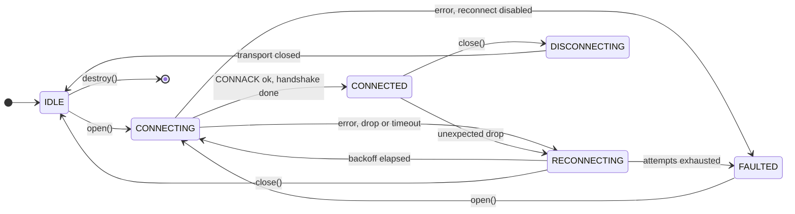
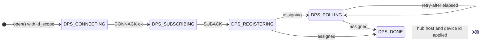
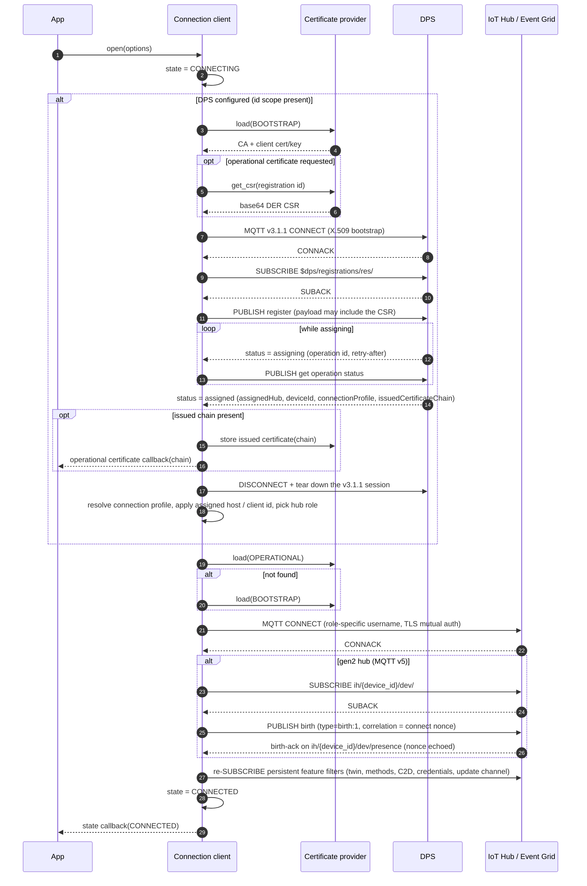
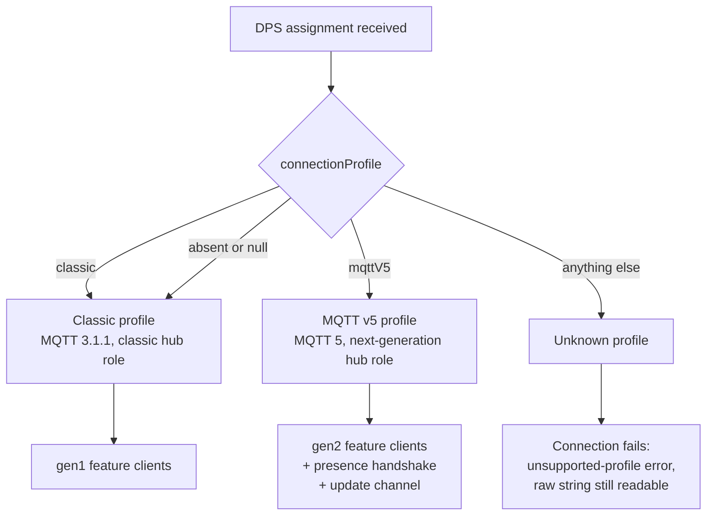
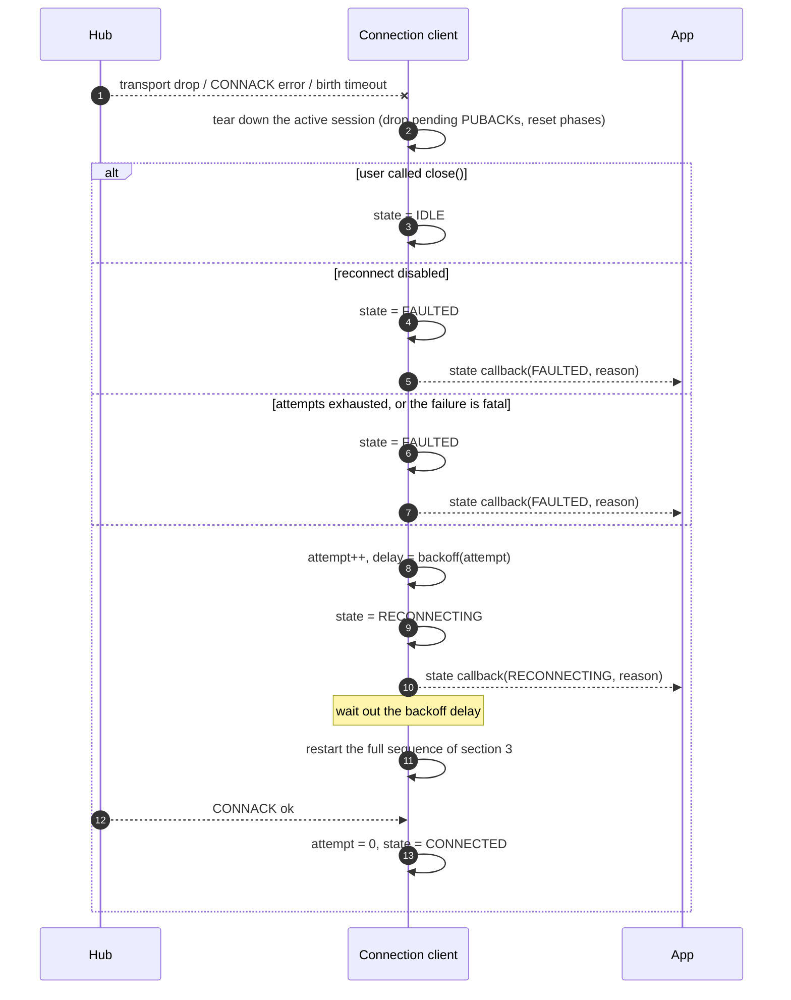
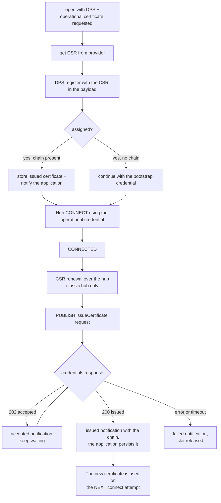
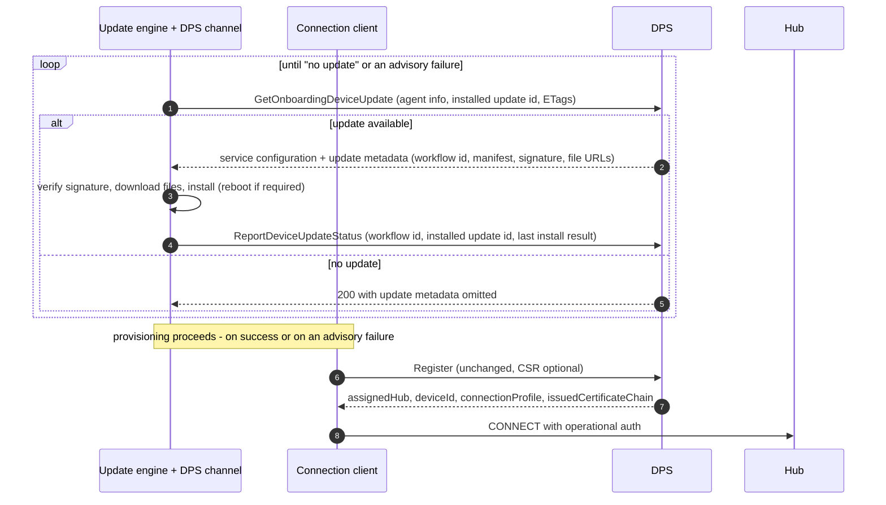
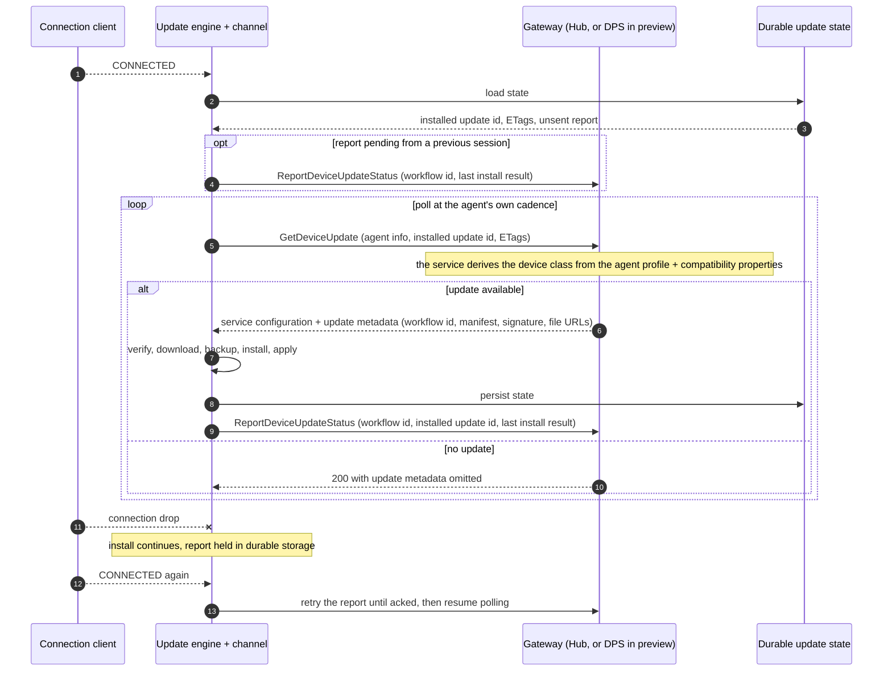
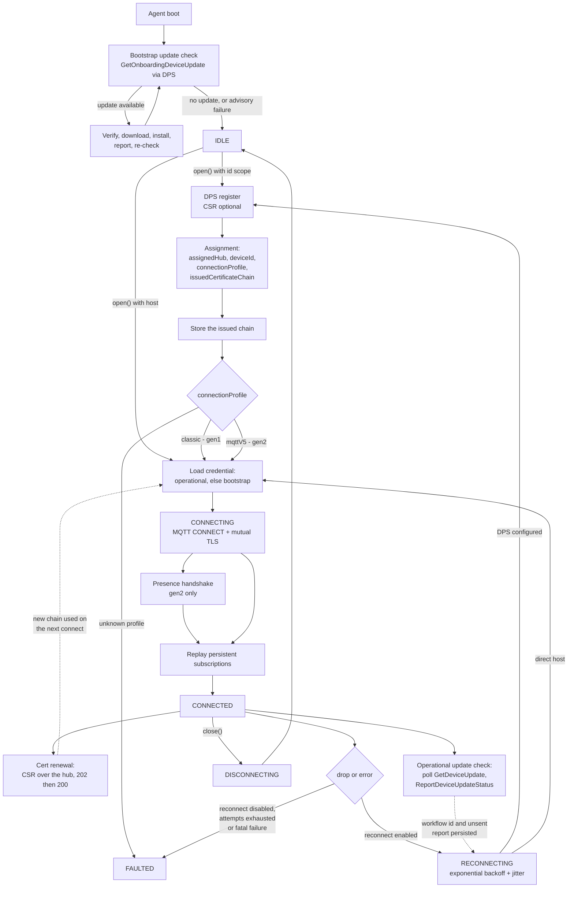

# Connection and Reconnection Lifecycle

Language-neutral reference for the device connection lifecycle in this repository. It defines the
contract that **every** client in this SDK family must honour — the C99 client under
[c/](../../c) and the .NET client under [dotnet/](../../dotnet) today — covering connection states,
provisioning, connection-profile selection, reconnection, certificate onboarding and renewal, and
device update (ADU).

This document owns the *behaviour*. It deliberately names no types, functions or files: each client
maps the concepts onto its own idioms, and those mappings are collected in
[§10](#10-language-mapping).

Language-specific detail:

- **C** — [eng/connection-c.md](eng/connection-c.md): enum names, headers, source locations, exact
  defaults.
- **.NET** — no separate design doc yet; the mapping table in [§10](#10-language-mapping) is the
  current record.

Related documents:

- [design.md](design.md) — layering and adapter model (C).
- [eng/certificate-management.md](eng/certificate-management.md) — CSR / operational certificate design.
- [eng/client-separation.md](eng/client-separation.md) — connection profile (§2) and the ADU channel split (§8).
- [eng/connection-state-and-error-propagation.md](eng/connection-state-and-error-propagation.md) — observer registry and status codes.
- [dps-integration.md](dps-integration.md), [devnotes.md](devnotes.md) — DPS contract and the running requirements log.
- [eng/aduv2-spec.md](eng/aduv2-spec.md) — the ADUv2 device contract, and the source for [§7](#7-device-update-onboarding-and-renewal).
  It owns the request/response shapes, error codes and trust model, which are deliberately not restated
  here. [eng/adu-client-design.md](eng/adu-client-design.md) covers the shared verify/download/install
  engine, which is unchanged from ADUv1.

### Status legend

This document describes the target lifecycle. Coverage differs per client, so each section carries a
status line using these marks:

| Mark | Meaning |
| --- | --- |
| **implemented** | Present in that client's code today. |
| **partial** | Present, but with a known gap called out in the section. |
| **planned** | Designed and agreed, not yet in code. |
| **none** | Not implemented and not started in that client. |

---

## 1. Vocabulary

| Term | Meaning |
| --- | --- |
| **State** | User-visible connection lifecycle value, reported to the application through a callback, event or observable property. |
| **Connection profile** | What the device is connected to, as declared by DPS: `classic` or `mqttV5`. Reported, never caller-selected. |
| **Generation** | The feature-client family selected by the profile: `gen1` (classic) or `gen2` (mqttV5). |
| **Role** | Which endpoint and protocol the current MQTT session targets: DPS (v3.1.1), classic hub (v3.1.1), or next-generation hub (v5). |
| **Phase** | Internal sub-step inside a state — DPS phases and presence (birth) phases. Not user-visible. |
| **Provisioning** | Obtaining a hub assignment from DPS. |
| **Onboarding** | Everything that happens against the DPS gateway under *onboarding auth*: the bootstrap update check, the CSR, and registration itself. |
| **Renewal** | The recurring, post-provisioning counterpart under *operational auth*: certificate re-issuance and the periodic update check. |
| **Bootstrap credential** | Initial device identity, used to reach DPS. |
| **Operational credential** | Certificate issued to the device in response to a CSR. |
| **Update channel** | The transport-carrying abstraction for update delivery and reporting, which keeps the update engine transport-independent. |

---

## 2. Top-level state machine

**C:** implemented · **.NET:** partial — the same lifecycle is driven internally, but it is surfaced
as connect/disconnect events rather than as a single user-visible state value; see
[§10](#10-language-mapping).

When DPS is configured the whole provisioning exchange happens **inside** the `CONNECTING` state, so
the application never sees an intermediate `CONNECTED` for the DPS session. DPS progress is tracked
separately as a phase:

Any failure or drop in a DPS phase is handled by the same backoff path as a hub failure, and a retry
restarts provisioning from `DPS_CONNECTING`.

---

## 3. Full connect sequence

**C:** implemented · **.NET:** implemented (CSR-in-registration excepted, see below)

Key ordering guarantees that every client must honour:

1. `CONNECTED` is announced **after** the birth handshake (gen2) and **after** persistent
   subscriptions have been re-issued, so a feature client never observes `CONNECTED` while its topic
   filters are missing.

   > **Client status.** The .NET client honours this: the connect call does not complete, and feature
   > traffic is latched, until the subscriptions (classic) or the presence flow (gen2) have completed.
   > The C client does **not** yet: it transitions to `CONNECTED` first and only then issues the
   > subscribes, discarding the result, so a request published from inside the callback can reach the
   > wire ahead of its own SUBSCRIBE. Treat the guarantee as the *intended* contract; see
   > [eng/connection-c.md §3](eng/connection-c.md) for the tracking detail and the fix phase. The
   > gen2 birth handshake *is* correctly gated in both clients — it waits for its own SUBACK before
   > publishing birth — which is the shape the feature subscriptions are being moved to.

2. The DPS session is fully torn down before the hub session is created — they are never concurrent,
   and DPS always uses MQTT 3.1.1 even when the hub session uses v5.
3. The operational certificate is preferred over the bootstrap certificate on every connect attempt,
   including reconnects.
4. **The bootstrap update check runs before `open()`, not inside it.** The agent drives the onboarding
   update call against the DPS gateway until the service reports no update, and only then does the
   connection client register. The check is **advisory**: if it fails, the device proceeds to register
   anyway. See [§7](#7-device-update-onboarding-and-renewal).
5. The DPS assignment is the single delivery point for everything the device learns about its
   placement: hub, device id, connection profile and issued certificate chain.

> **CSR in registration is C-only today.** The .NET client always registers with an empty CSR field,
> so it can only obtain an operational certificate through the post-connect renewal path of
> [§6](#6-certificate-management-onboarding-and-renewal).

---

## 4. Connection profile selection

**C:** planned · **.NET:** partial — the branch exists and drives protocol and feature selection, but
it is a locally-set boolean rather than the DPS-declared string.

The profile is what DPS says the device landed on. It is **reported, never selected** — there is no
caller-facing knob, and falling back from one profile to another is application logic, not SDK
behaviour. See [eng/client-separation.md §2](eng/client-separation.md) for the full rationale.

| Wire value | Profile | MQTT | Generation |
| --- | --- | --- | --- |
| `"classic"`, absent, or `null` | classic | 3.1.1 | gen1 |
| `"mqttV5"` | MQTT v5 | 5 | gen2 |
| anything else | unknown | — | connection fails |

Rules every client must implement:

- `connectionProfile` is a `readOnly` **string** on the DPS registration result, delivered alongside
  `assignedHub`, `deviceId` and `issuedCertificateChain`. There is no numeric hub version on the wire.
- It is an **extensible union**, so the raw string must be preserved verbatim and not collapsed into a
  closed enum. A value newer than the SDK still has to be loggable.
- An unrecognised profile **fails the connection** with a dedicated unsupported-profile error. The SDK
  will not guess which MQTT version to speak.
- The profile is readable only once `CONNECTED`; before that, querying it fails with a not-connected
  error.
- A feature client from the wrong generation is refused with a generation-mismatch error. Because of
  this, feature clients must be created **after** the connection is open.

> **Blocked on the DPS api-version, in both clients.** `connectionProfile` is new in DPS
> `2026-11-02-preview`; both clients still request `2019-03-31`, so the field never arrives today.
> Raising it is a prerequisite for this entire section. Until then the .NET client carries a
> locally-set boolean placeholder in the registration result, and the C client has no profile at all.
>
> **Open:** whether a reconnect can change the generation. If DPS can reassign a device mid-life,
> every feature client the application holds becomes invalid at that moment and it must be told.

---

## 5. Reconnection

**C:** implemented · **.NET:** implemented

### 5.1 Backoff policy

The shape is the same in both clients — exponential growth, capped, jittered, reset on every
successful CONNACK — but the parameters and their defaults are **not** currently aligned:

| Property | C | .NET |
| --- | --- | --- |
| Growth | `initial_delay << (attempt - 1)`, shift clamped at 30 | `2^(baseExponent + attempt)` ms, exponent clamped at 32 |
| First delay (default) | 1 s | 128 ms (base exponent 6) |
| Cap (default) | 30 s | 60 s as configured by the connection client; 30 min for the bare policy default |
| Max attempts (default) | unlimited | unlimited |
| Jitter (default) | ±20 % of the computed delay | 95–105 % of the computed delay, skipped below 50 ms |
| Disable reconnect | zero initial delay | a no-retry policy |
| Policy is caller-replaceable | no — parameters only | yes — the policy itself is an interface |

Both clients also cap a single connect attempt with a timeout and treat the expiry as a failed
attempt.

> **Divergence to close.** Aligning the defaults, and deciding whether C should also accept a
> caller-supplied policy object, is open work. Applications must not depend on the current numbers
> being the same across languages.

### 5.2 What triggers a reconnect

- CONNACK with a non-success status.
- Unexpected transport disconnect or adapter error while `CONNECTING` or `CONNECTED`.
- Any failure during a DPS phase (a reconnect restarts provisioning from the beginning).
- gen2 birth-ack timeout (60 s per handshake step, in both clients).

A user-initiated `close()` never triggers a reconnect: the intent to close is recorded and checked
before any backoff is scheduled.

Some failures are **fatal** and must not be retried, because retrying cannot succeed — protocol
errors, malformed packets, authorization failures, session-taken-over, invalid topic filters and
server-moved among them. A fatal failure goes straight to `FAULTED` and is reported to the
application. This classification is implemented in the .NET client and is the intended behaviour for
the C client.

### 5.3 What is preserved across a reconnect

| Item | Preserved | Behaviour |
| --- | --- | --- |
| Persistent subscriptions | Yes | Re-issued on reconnect. Intended to complete before `CONNECTED` is announced; see the caveat in [§3](#3-full-connect-sequence). |
| Assigned hub host / device id | Yes | Cached after the first DPS assignment. |
| Connection profile | Yes | Re-resolved from the new assignment; a change invalidates held feature clients (open question, [§4](#4-connection-profile-selection)). |
| Operational certificate | Yes | Owned by the certificate provider, reloaded on each attempt. |
| Update workflow state | Yes | Owned by the update engine and persisted, so an install survives a reconnect and a reboot. |
| Reconnect attempt counter | Reset on success | Incremented per failed attempt. |
| In-flight QoS 1 PUBACKs | No | Packet ids belong to the destroyed session; callers must re-send. |
| Twin GET/PATCH, method responses, telemetry in flight | No | Feature clients must re-issue. |
| Update status report not yet acked | Yes | Held in durable storage and retried until acked; idempotent on the workflow id. |
| Presence (birth) phase | No | Restarted with a freshly generated nonce. |
| DPS phase | No | Restarted from `CONNECTING` if DPS is configured. |
| In-flight CSR operation | No | Abandoned; the caller is notified with a failure or timeout result. |

---

## 6. Certificate management: onboarding and renewal

**C:** implemented · **.NET:** partial — renewal is implemented for the classic hub only; the CSR is
not yet sent during registration, and renewal is not available on a gen2 hub.

Two distinct issuance paths exist; both end with the certificate provider owning the operational
credential, and neither forces an immediate reconnect.

Renewal topics (classic hub), identical in both clients:

| Direction | Topic |
| --- | --- |
| Publish | `$iothub/credentials/POST/issueCertificate/?$rid={request_id}` |
| Subscribe | `$iothub/credentials/res/#` |
| Response | `$iothub/credentials/res/{status}/{request_id}` |

Rules that apply to every client:

- Only one CSR operation per request id may be in flight; a duplicate fails fast with a *busy* result.
- The issued chain is delivered leaf-first as base64 DER. Where the client hands it over in a callback
  it is only valid for the duration of that callback, so the application must copy or persist it.
- A successful renewal does **not** tear down the live session. The new credential takes effect on the
  next connect, whether that is a reconnect or an explicit reopen.
- At connect time the provider is asked for the operational credential first and falls back to the
  bootstrap credential when it is absent or uninitialized.
- CSR-based DPS enrollment requires the `2025-07-01-preview` DPS api-version.
- Renewal over a gen2 hub is not yet a supported service feature; a client that is asked for it must
  fail with an explicit unsupported error rather than silently doing nothing.

---

## 7. Device update: onboarding and renewal

**C:** planned (the ADUv1 engine internals are implemented and reused; the ADUv1 twin-based public API
is being removed) · **.NET:** none — no update support exists in the .NET client today, and this
section is the contract it will have to meet when it is added.

What survives from ADUv1 is everything that has nothing to do with transport. Update support is
re-layered into a transport-independent **update engine** — manifest parsing, signature and root-key
verification, integrity hashing, the download/backup/install/apply state machine, and reboot/resume
persistence — plus an **update channel** abstraction carrying delivery and reporting.

ADUv2 is a **device-initiated pull protocol**, and its device-facing delivery moved **off** a
dedicated update HTTPS endpoint. The agent calls an updating operation on a gateway it already talks
to, reusing the credential it already has; the gateway is an authenticated pass-through. The device
never talks to the update service directly, needs no update-specific credential, and there is no twin,
no subscription and no unsolicited offer.

| Phase | Gateway | Operation (working name) |
| --- | --- | --- |
| First-time / bootstrap (**before** provisioning) | DPS | `GetOnboardingDeviceUpdate` |
| Regular / operational (**after** provisioning) | DPS *(interim)*, IoT Hub *(later)* | `GetDeviceUpdate` |
| Reporting, either phase | same gateway as the fetch | `ReportDeviceUpdateStatus` |

The device selects onboarding vs regular **by which operation it calls**; the gateway does not infer
or validate the choice.

> **The hub-side updating API is not available in the first release.** In preview, DPS fronts both the
> bootstrap and the operational flow, using the existing DPS device credential (X.509 in phase 1). The
> operational path moves to IoT Hub afterwards **with no device-contract change** — same request and
> response, a different gateway. Treat the gateway as a channel parameter, not a constant.

### 7.1 Onboarding — bootstrap update, before provisioning

The critical ordering fact for this document: **the bootstrap update check happens before the device
registers.** The agent, not the connection client, drives it. On the happy path `open()` waits until
the check reports no update, so several updates can chain before provisioning.

The check is **advisory and must never block provisioning.** If it errors, times out, or the account
is not linked, the device proceeds to register anyway.

- The loop is genuine: after installing a bootstrap update the agent re-checks, because a bootstrap
  deployment can chain.
- Bootstrap progress is stored **in the bootstrap update job**, not on the device's own attributes —
  the device resource does not exist yet.
- Trust comes from the **root-key package** whose download URL is returned by the same call. Account
  scoping (an account id bound into the manifest signature) is **deferred**: DPS returns no account id,
  so the device verifies provenance but not account scoping. Base signature validation stays required.
- File URLs are **not** covered by the signed manifest; payloads are downloaded straight from blob
  storage and integrity comes from the per-file hashes inside the manifest.
- Bootstrap orchestration is entirely the agent's responsibility in the first release. DPS does **not**
  enforce that a device is on a given update version before provisioning it.

### 7.2 Renewal — operational update check, after `CONNECTED`

The last install result carries the terminal outcome, its failure origin, the list of extended result
codes and a per-step result map — see [eng/aduv2-spec.md](eng/aduv2-spec.md) for the field-level shape.

### 7.3 Rules every client must implement

- **Poll, never wait.** The agent owns the cadence. A missed poll is not an error and there is no offer
  to lose, which is why a reconnect needs no replay of update subscriptions — there are none.
- **The workflow id is the correlation key.** It arrives in the update metadata and is echoed on the
  report. Reporting is **idempotent on the workflow id alone**; a conflicting terminal result for the
  same id is rejected as a conflict.
- **The device is the sole retrier.** The gateway fails fast with one attempt per hop. The agent honours
  `Retry-After` on throttling and retries the status report until it is acked — a report is a durable
  write and must not be lost.
- **Drive behaviour from the machine-readable error code, never the HTTP status.** A stale agent-info
  ETag means resend the full agent info; a stale service-config ETag means re-ask without it; an
  unlinked update account means "no update service configured", which is not a failure.
- **"No update" is a success.** It is a 200 with the update metadata omitted, not an error.
- **Update never drives the connection.** It does not open, close, or force a reconnect. It does
  sequence ahead of the *first* `open()`, via the advisory bootstrap check in
  [§7.1](#71-onboarding--bootstrap-update-before-provisioning).
- **Compatibility properties are opaque key/value pairs** (1–5) reported by the agent alongside an
  opaque agent profile; the service combines them into a device class. The agent assigns them no
  meaning.
- **The gateway is a channel parameter.** Bootstrap always uses DPS; operational uses DPS in preview and
  IoT Hub afterwards, with no device-contract change. This SDK plans to expose the operational channel
  as a gen2 feature client ([eng/client-separation.md](eng/client-separation.md) §8), but the service
  contract binds update delivery to the updating operations, not to a connection profile.

---

## 8. Combined reference diagram

One picture of the whole device lifecycle: connection and reconnection, connection-profile selection,
certificate management (onboarding + renewal) and device update (onboarding + renewal). Dotted edges
are deferred effects — they do not happen inline.

Reading it as four overlapping concerns:

| Concern | Onboarding (DPS gateway, onboarding auth) | Renewal (post-`CONNECTED`, operational auth) |
| --- | --- | --- |
| **Certificates** | CSR in the registration, issued chain in the assignment | CSR over the hub; the new chain applies on the next connect |
| **Device update** | `GetOnboardingDeviceUpdate` loop **before** registration, advisory | Polled `GetDeviceUpdate` / `ReportDeviceUpdateStatus` (DPS in preview, Hub afterwards) |
| **Connection profile** | Declared in the assignment; selects MQTT version and generation | Re-resolved on every reconnect that goes through DPS |
| **Connection** | DPS phases inside `CONNECTING` | Backoff-driven reconnect replays the whole path |

The two onboarding concerns are **not** symmetric, and that asymmetry is the thing to remember: the
CSR travels *inside* registration, while the bootstrap update check happens *before* it and must
complete first.

---

## 9. Cross-client status summary

| Area | C | .NET |
| --- | --- | --- |
| Top-level states ([§2](#2-top-level-state-machine)) | implemented, user-visible state value | partial — internal lifecycle, surfaced as events, no single state value |
| DPS provisioning inside connect ([§3](#3-full-connect-sequence)) | implemented | implemented |
| CSR carried in the registration ([§3](#3-full-connect-sequence)) | implemented | planned — the field is always sent empty |
| Subscriptions established before `CONNECTED` ([§3](#3-full-connect-sequence)) | partial — not gated on SUBACK | implemented — connect completes, and feature traffic is latched, on readiness |
| gen2 birth handshake, 60 s timeout ([§3](#3-full-connect-sequence)) | implemented | implemented |
| Connection profile from DPS ([§4](#4-connection-profile-selection)) | planned — blocked on the api-version | partial — local boolean placeholder, blocked on the api-version |
| Exponential backoff with jitter ([§5](#5-reconnection)) | implemented, fixed policy | implemented, caller-replaceable policy |
| Fatal-failure classification ([§5.2](#52-what-triggers-a-reconnect)) | planned | implemented |
| Certificate renewal over the hub ([§6](#6-certificate-management-onboarding-and-renewal)) | implemented (classic) | implemented (classic); explicit unsupported error on gen2 |
| Device update ([§7](#7-device-update-onboarding-and-renewal)) | planned — engine internals implemented and reused | none |

---

## 10. Language mapping

How the vocabulary of this document maps onto each client. Concept names in the left column are the
normative ones; the language columns are informative and follow the code.

| Concept | C | .NET |
| --- | --- | --- |
| Connection client | `az_iot_connection_client` | `Unified.Connection.ConnectionClient` (dispatches by profile) and `Gen2.Connection.ConnectionClient` |
| Open / close | `az_iot_connection_client_open()` / `_close()` | `ConnectAsync()` / `ProvisionAndConnectAsync()` / `DisconnectAsync()` |
| State value | `az_iot_connection_state` (`IDLE`…`FAULTED`) | none — `ConnectingAsync` / `ConnectedAsync` / `DisconnectedAsync` events, plus an internal presence-complete signal |
| Session maintenance and reconnect | `connection_client.c` + `reconnect.c` | `MqttConnectionManager` |
| Retry policy | `az_iot_reconnection_policy` (initial delay, max delay, max attempts, jitter %) | `IRetryPolicy`, default `ExponentialBackoffRetryPolicy`, `NoRetry` to disable |
| Connection profile | `az_iot_connection_profile` / `az_iot_hub_profile` (planned) | `ConnectionContext.IsGen2Hub` (placeholder boolean) |
| Provisioning settings | id scope + global endpoint in the connection options | `ProvisioningSettings` |
| Registration result | DPS assignment struct | `DeviceRegistrationResult` |
| Credentials | `az_iot_certificate_provider` (`BOOTSTRAP` / `OPERATIONAL`) | `X509AuthenticationProvider` + `ConnectionContext.IssuedClientCertificates` |
| CSR request / response | `az_iot_connection_client_send_csr()` and its callbacks | `SendCertificateSigningRequestAsync()` returning a `CertificateSigningOperation` |
| MQTT abstraction | adapter vtable (`how_to_byo_mqtt_client.md`) | `IMqttClient`, default backed by MQTTnet |
| Update engine / channel | `adu_core` + `az_iot_adu_channel` (planned) | not present |

For the C-side detail behind this table — headers, source files, exact enum spellings and defaults —
see [eng/connection-c.md](eng/connection-c.md).
