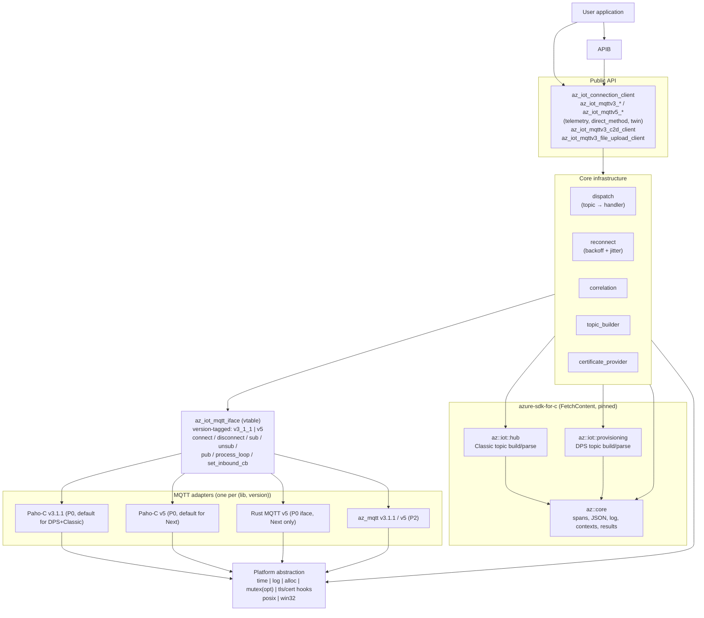
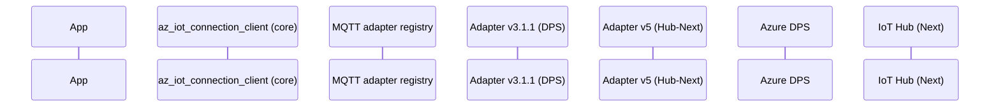
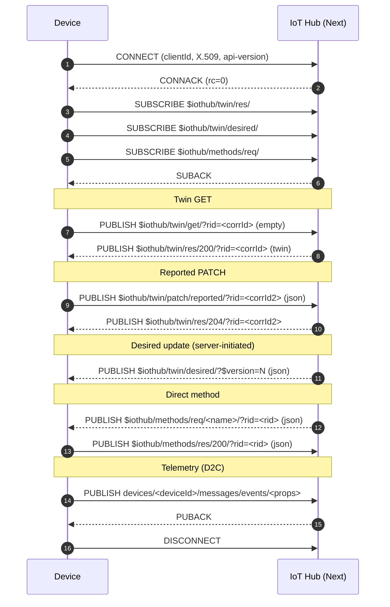
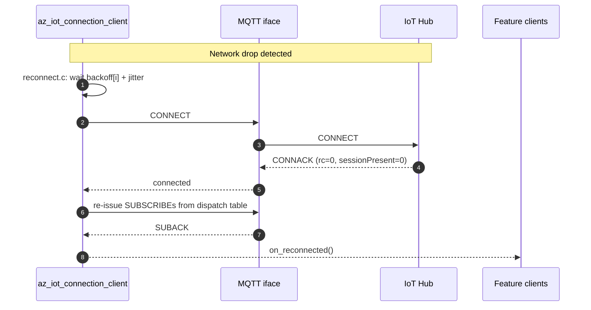

<!-- Copyright (c) Microsoft. All rights reserved.
     Licensed under the MIT license. See LICENSE file in the project root for full license information. -->

# azure-iot-sdk — Design

C99 client SDK for IoTHub-Next (AEG), with selectable Classic-vs-Next protocol behavior, current Azure DPS support, X.509 auth (P0), and a pluggable MQTT abstraction with Paho-C as the default adapter.

The public surface is a single low-level, single-threaded, callback-based API with a `do_work()` pump. Embedded-friendly, no internal threads, no hidden allocations on the hot path.

> **In flight: the feature clients are being split by hub generation.**
> Telemetry is already split; the remaining feature clients still branch
> internally on a runtime Classic-vs-Next switch.
> [eng/client-separation.md](eng/client-separation.md) specifies the target:
> per-generation feature clients (`az_iot_mqttv3_*` / `az_iot_mqttv5_*`) over the
> **same single connection client**, which keeps DPS internal and reports the
> resolved generation through `az_iot_connection_client_get_hub_profile()`.
> Where the two documents disagree, the separation document is the intended end
> state and this one is the status quo.

### MQTT version constraint

DPS and IoTHub-Classic speak **MQTT v3.1.1 only**. IoTHub-Next speaks **MQTT v5 only**. Even when a single underlying library can do both versions, the SDK treats each version as a **distinct adapter instance** with its own configuration, lifecycle, and (when needed) its own underlying client object. The MQTT abstraction below makes this explicit so that:

- A device that provisions via DPS and lands on Classic uses one v3.1.1 adapter end-to-end.
- A device that provisions via DPS and lands on Next uses a v3.1.1 adapter for DPS, then **swaps to a v5 adapter** for the Hub session.
- Adapter authors can ship a v3.1.1-only or v5-only implementation, or one binary that registers two factories — the core does not care.

## 1. Solution layers



### Layer responsibilities

| Layer | Owns |
|---|---|
| Public API | Public opaque handles, lifecycle, feature client surfaces |
| `connection_client` | TLS/cert config, CONNECT/CONNACK/DISCONNECT, sub/unsub, pub, dispatch table, reconnect, DPS, cert mgmt hooks |
| Feature clients | Topic templates, payload schemas, request/response correlation, error mapping |
| `az_iot_mqtt_iface` | vtable contract for MQTT adapters; each instance is tagged with the MQTT version it speaks (`v3_1_1` or `v5`) |
| Adapters | Paho-C v3.1.1 (DPS + Classic), Paho-C v5 (Next), Rust MQTT v5 (Next, FFI shell P0), az_mqtt (P2) |
| `azure-sdk-for-c` | Pinned third-party dependency. `az::core` provides spans / JSON / logging / contexts. `az::iot::hub` and `az::iot::provisioning` provide the IoTHub-Classic and DPS MQTT topic helpers we'd otherwise have to reimplement. **IoTHub-Next is NOT covered by this dependency** — we own the Next wire protocol in this repo. |
| Platform | time / log / alloc / mutex / tls + cert hooks per OS |

### Why depend on azure-sdk-for-c

- `az::core` is a battle-tested, non-allocating set of primitives (spans, JSON reader/writer, contexts, result codes, logging) that exactly fits a C99 SDK. Reimplementing it would duplicate maintained code.
- `az::iot::hub` already encodes the Classic MQTT topic templates (telemetry, twin, methods, C2D, properties) and the parsers for inbound messages. We feed its outputs straight into our `az_iot_mqtt_iface` adapter instead of re-deriving topic strings.
- `az::iot::provisioning` does the same for the DPS protocol exchange. DPS only ever speaks v3.1.1, which matches our adapter constraint exactly.
- The dependency is **MQTT-stack-agnostic** — it never opens a socket. That preserves our pluggable adapter design.
- Fetched via CMake `FetchContent` at a pinned tag (`AZ_SDK_C_TAG`, default `1.5.0`). No git submodules.

### MQTT adapter registry

The ConnectionClient does not hold a single MQTT adapter — it holds an **adapter registry** keyed by `az_iot_mqtt_version`:

- DPS requires a v3.1.1 adapter.
- Hub-Classic requires a v3.1.1 adapter.
- Hub-Next requires a v5 adapter.

Adapters are registered at init via `az_iot_connection_client_register_mqtt_factory()`. Each factory advertises the MQTT version it supports. The SDK internally determines which version is needed for each Azure service. The default build links the Paho-C adapter, which registers both a v3.1.1 factory and a v5 factory backed by the same Paho library but with separate client objects per session.

When DPS returns the assignment, the ConnectionClient:

1. Tears down the v3.1.1 adapter instance used for DPS.
2. Looks up the factory for the required MQTT version (v3.1.1 for Classic, v5 for Next).
3. Instantiates a fresh adapter and runs the Hub session on it.

This keeps adapter authors free to ship version-specific code paths and avoids smuggling v5 features through a v3.1.1-shaped surface (or vice versa).

## 2. End-to-end flow (DPS → Hub → feature traffic)

Note the explicit two-adapter dance: a v3.1.1 adapter for DPS, then a fresh adapter selected from the registry based on the assigned hub version (v3.1.1 for Classic, v5 for Next).



For a Classic assignment, step "get_factory(role=HUB_CLASSIC, version=v3_1_1)" returns a v3.1.1 adapter and the Hub session uses that instead of `M5`.

### Threading contract

Every user callback fires from inside `az_iot_connection_client_do_work()`. The application owns the thread that calls it.

## 3. Protocol exchange

Topic strings below are illustrative until the IoTHub-Next protocol contract is finalized. Each
`az_iot_mqttv3_*` / `az_iot_mqttv5_*` feature client owns the templates for its own generation; there is
no runtime Classic-vs-Next switch left to consult.



### Reconnect path (owned by ConnectionClient)



## 4. Open design questions (tracked)

1. DPS → device handoff: how the device learns whether the assigned hub is Classic or Next. Currently assumed to be carried in the DPS assignment payload (`version_hint`). Revisit once Auth design discussion closes.
2. Reconnect policy defaults (initial delay, max delay, max attempts, jitter %); all user-overridable via `az_iot_reconnection_policy`, with `az_iot_reconnection_policy_get_default()`, `az_iot_reconnection_policy_get_retry_disabled()` and `az_iot_reconnection_policy_get_fixed_interval()` naming the usual shapes.
3. Whether cert management is mandatory on Next. Current assumption: optional surface, mandatory pluggable hook (`az_iot_certificate_provider`).
4. Adapter sharing across roles: should a single adapter object be reusable across the DPS→Hub transition (when both are v3.1.1, i.e., DPS→Classic)? Current assumption: **no** — always destroy and recreate to keep the lifecycle uniform and reconnect logic simple. Revisit if the extra TLS handshake hurts cold-start latency.

5. **Test proxy: separate the protocol layer.** The conformance test proxy
   (`c/tests/conformance/az_iot_test_proxy.c`) decodes MQTT itself. It should not know any
   protocol: it should reassemble an opaque PDU, hand it to a codec, and act on what the
   codec reports back. This is recorded rather than done because with exactly one protocol
   implemented there is nothing to falsify the seam — the right shape only becomes knowable
   when a second protocol needs it, and guessing now would bake MQTT's assumptions into an
   interface that claims to be neutral.

   **Where the coupling actually is.** Measured, not estimated: of ~2400 lines, ~404 (16%)
   are protocol-aware, and they are already clustered rather than smeared through the pump.

   | unit | lines | protocol knowledge |
   | --- | --- | --- |
   | `proxy_frame_size` | 32 | fixed header + remaining-length varint |
   | `proxy_packet_id` | 38 | where the packet id sits, per packet type |
   | `proxy_apply_rules` | 95 | reads the type nibble (`pkt[0] >> 4`) to match rules |
   | `proxy_ingest` | 90 | drives the framer; otherwise protocol-neutral |
   | `proxy_frame_count` | 43 | the same framing again, count-only, for the synthetic path |
   | `proxy_send_synthetic` + `proxy_pump_synthetic` | 106 | builds and sends canned CONNACK/DISCONNECT |

   The public header leaks the same knowledge through 16 `AZ_IOT_TEST_PROXY_PKT_*`
   constants and the `on_packet` / `echo_packet_id` / `packet_id_offset` rule fields.

   **The seam.** The proxy only ever asks a byte stream three questions, and those three
   questions *are* the interface:

   - where does this PDU end?
   - what kind of PDU is it? (an opaque tag the core only compares for equality)
   - what bytes correlate a response to a request, and where would they be patched into an
     injected reply?

   None of the names below exist in the repo. They are a sketch of the shape those three
   questions imply, not an API anyone can call today:

   ```c
   typedef struct az_iot_test_proxy_pdu
   {
     uint8_t kind;               /* codec-defined; 0 reserved for "match any" */
     const uint8_t* correlation; /* what a reply must echo, or NULL */
     size_t correlation_len;
     size_t correlation_offset;  /* where to patch it into an injected PDU */
   } az_iot_test_proxy_pdu;

   typedef struct az_iot_test_proxy_protocol
   {
     /* 1 = a complete PDU of *total bytes, 0 = need more, -1 = malformed. */
     int (*frame)(void* ctx, const uint8_t* buf, size_t have, size_t* total);
     /* Optional. Fills the metadata rules match on; NULL means "bytes only". */
     int (*describe)(void* ctx, const uint8_t* pdu, size_t len, az_iot_test_proxy_pdu* out);
     void* ctx;
   } az_iot_test_proxy_protocol;
   ```

   A `set_protocol()` entry point would select one, and an MQTT implementation would ship as
   the default so that existing tests stayed unaffected. Rules would keep working unchanged,
   because `on_packet` would become an opaque `kind` and the packet-id echo would generalise
   to a correlation token of arbitrary length.

   **Encoding is already out.** `az_iot_test_mqtt_server` builds the packets a broker sends,
   so neither the proxy nor the tests assemble bytes. That settles a question this note
   originally got wrong: it claimed the synthetic-broker path -- the mode
   `az_iot_test_proxy_set_synthetic_connack()` switches on, where the proxy answers the
   client itself rather than forwarding -- "constructs MQTT packets", and would therefore
   need a codec that builds PDUs as well as parsing them. It does not: it sends bytes handed
   to it. Its only protocol knowledge is the framing used to spot a complete CONNECT, which
   is the same `frame()` the sketch above already covers.

   So the split is smaller than it first looked: one function's worth of framing behind the
   vtable, and the type/correlation extraction, with encoding already living somewhere it
   can stay.

   **Cost and trigger.** Roughly half a day: the mechanical work is small and 27 conformance
   cases pin the behaviour, so the risk is regression rather than design. Do it when the
   second protocol arrives, or when someone needs the proxy in front of a non-MQTT endpoint —
   whichever comes first. Nothing in the current structure blocks the split; it is a pure
   refactor with no behaviour change, which is exactly why it can wait without accruing
   interest. What should *not* happen in the meantime is new protocol knowledge leaking into
   the pump or the egress scheduler: those are protocol-neutral today and should stay that
   way.