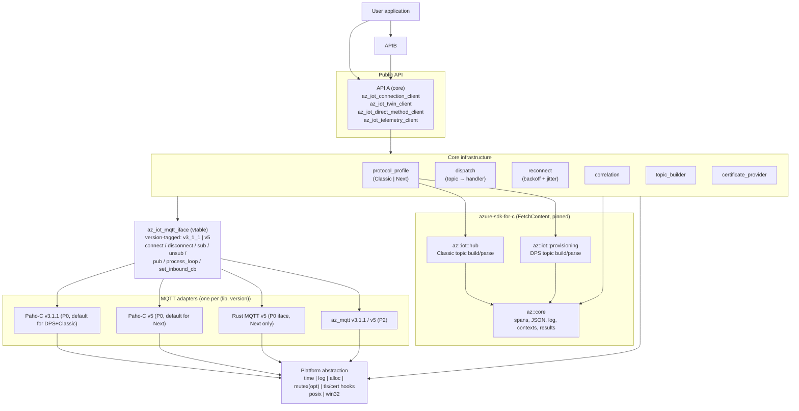
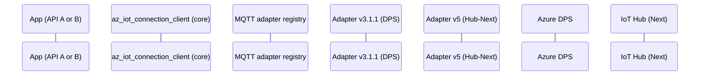
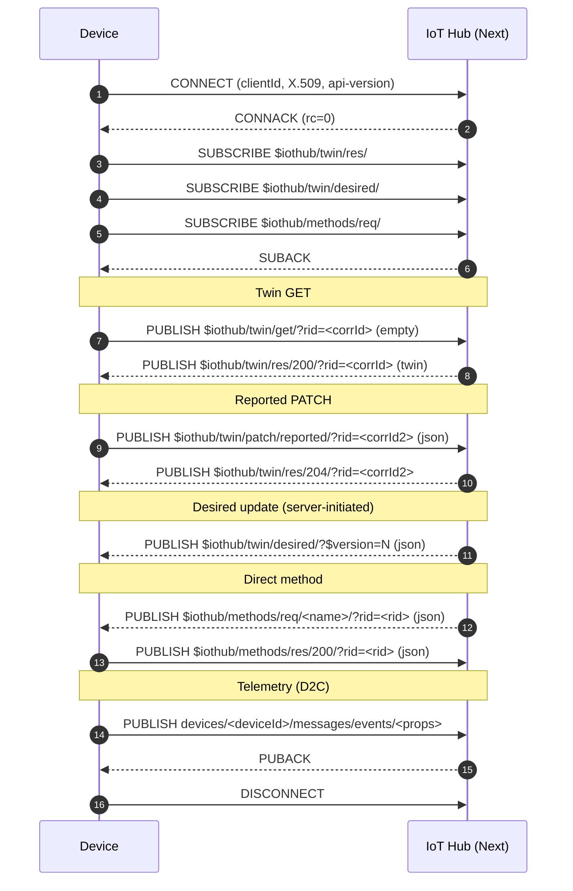
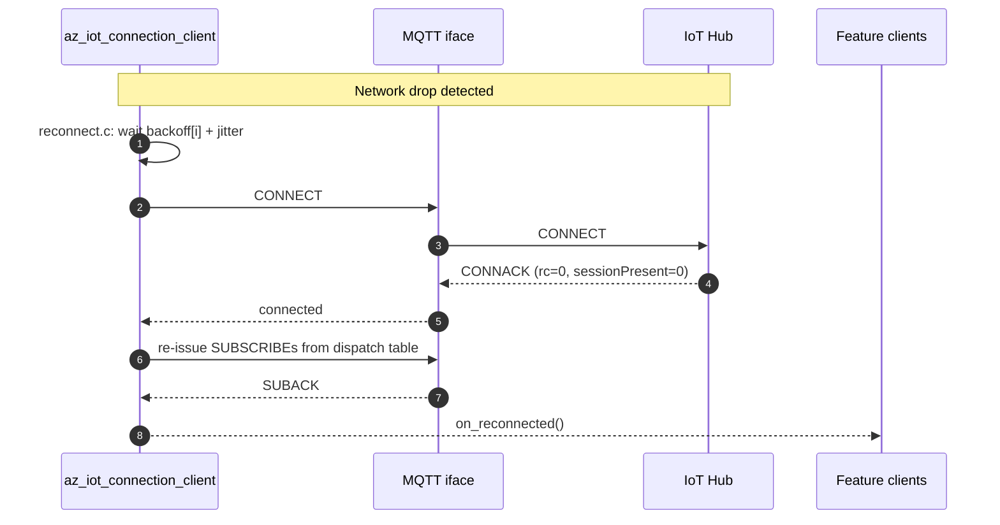

<!-- Copyright (c) Microsoft. All rights reserved.
     Licensed under the MIT license. See LICENSE file in the project root for full license information. -->

# azure-iot-sdk — Design

C99 client SDK for IoTHub-Next (AEG), with selectable Classic-vs-Next protocol behavior, current Azure DPS support, X.509 auth (P0), and a pluggable MQTT abstraction with Paho-C as the default adapter.

The public surface is split into two layered APIs:

- **API A (core)** — low-level, single-threaded, callback-based with a `do_work()` pump. Embedded-friendly, no internal threads, no hidden allocations on the hot path.
<!-- API B (easy) removed in remove-easy-api branch -->

### MQTT version constraint

DPS and IoTHub-Classic speak **MQTT v3.1.1 only**. IoTHub-Next speaks **MQTT v5 only**. Even when a single underlying library can do both versions, the SDK treats each version as a **distinct adapter instance** with its own configuration, lifecycle, and (when needed) its own underlying client object. The MQTT abstraction below makes this explicit so that:

- A device that provisions via DPS and lands on Classic uses one v3.1.1 adapter end-to-end.
- A device that provisions via DPS and lands on Next uses a v3.1.1 adapter for DPS, then **swaps to a v5 adapter** for the Hub session.
- Adapter authors can ship a v3.1.1-only or v5-only implementation, or one binary that registers two factories — the core does not care.

## 1. Solution layers

### Layer responsibilities

| Layer | Owns |
|---|---|
| API B | Sync wrappers, internal worker thread, defaulted callback plumbing |
| API A | Public opaque handles, lifecycle, feature client surfaces |
| `connection_client` | TLS/cert config, CONNECT/CONNACK/DISCONNECT, sub/unsub, pub, dispatch table, reconnect, DPS, cert mgmt hooks |
| Feature clients | Topic templates, payload schemas, request/response correlation, error mapping |
| `protocol_profile` | Classic-vs-Next switch tables (topics, response timeouts, error codes). Classic + DPS rows delegate to `az::iot::hub` and `az::iot::provisioning` for topic build/parse. |
| `az_iot_mqtt_iface` | vtable contract for MQTT adapters; each instance is tagged with the MQTT version it speaks (`v3_1_1` or `v5`) |
| Adapters | Paho-C v3.1.1 (DPS + Classic), Paho-C v5 (Next), Rust MQTT v5 (Next, FFI shell P0), az_mqtt (P2) |
| `azure-sdk-for-c` | Pinned third-party dependency. `az::core` provides spans / JSON / logging / contexts. `az::iot::hub` and `az::iot::provisioning` provide the IoTHub-Classic and DPS MQTT topic helpers we'd otherwise have to reimplement. **IoTHub-Next is NOT covered by this dependency** — we own the Next protocol profile in this repo. |
| Platform | time / log / alloc / mutex / tls + cert hooks per OS |

### Why depend on azure-sdk-for-c

- `az::core` is a battle-tested, non-allocating set of primitives (spans, JSON reader/writer, contexts, result codes, logging) that exactly fits a C99 SDK. Reimplementing it would duplicate maintained code.
- `az::iot::hub` already encodes the Classic MQTT topic templates (telemetry, twin, methods, C2D, properties) and the parsers for inbound messages. We feed its outputs straight into our `az_iot_mqtt_iface` adapter instead of re-deriving topic strings.
- `az::iot::provisioning` does the same for the DPS protocol exchange. DPS only ever speaks v3.1.1, which matches our adapter constraint exactly.
- The dependency is **MQTT-stack-agnostic** — it never opens a socket. That preserves our pluggable adapter design.
- Fetched via CMake `FetchContent` at a pinned tag (`AZ_SDK_C_TAG`, default `1.5.0`). No git submodules.

### MQTT adapter registry

The ConnectionClient does not hold a single MQTT adapter — it holds an **adapter registry** keyed by `az_iot_mqtt_version`:

- DPS requires a v3.1.1 adapter.
- Hub-Classic requires a v3.1.1 adapter.
- Hub-Next requires a v5 adapter.

Adapters are registered at init via `az_iot_connection_client_register_mqtt_factory()`. Each factory advertises the MQTT version it supports. The SDK internally determines which version is needed for each Azure service. The default build links the Paho-C adapter, which registers both a v3.1.1 factory and a v5 factory backed by the same Paho library but with separate client objects per session.

When DPS returns the assignment, the ConnectionClient:

1. Tears down the v3.1.1 adapter instance used for DPS.
2. Looks up the factory for the required MQTT version (v3.1.1 for Classic, v5 for Next).
3. Instantiates a fresh adapter and runs the Hub session on it.

This keeps adapter authors free to ship version-specific code paths and avoids smuggling v5 features through a v3.1.1-shaped surface (or vice versa).

## 2. End-to-end flow (DPS → Hub → feature traffic)

Note the explicit two-adapter dance: a v3.1.1 adapter for DPS, then a fresh adapter selected from the registry based on the assigned hub version (v3.1.1 for Classic, v5 for Next).

For a Classic assignment, step "get_factory(role=HUB_CLASSIC, version=v3_1_1)" returns a v3.1.1 adapter and the Hub session uses that instead of `M5`.

### Threading contract

- **API A:** every user callback fires from inside `az_iot_connection_client_do_work()`. The application owns the thread that calls it.
- **API B:** the easy worker thread pumps `do_work()` and forwards user callbacks. The worker thread never holds user-visible locks while invoking callbacks.

## 3. Protocol exchange

Topic strings below are illustrative until the IoTHub-Next protocol contract is finalized. `protocol_profile` owns the actual templates and chooses Classic vs Next at runtime.

### Reconnect path (owned by ConnectionClient)

## 4. Open design questions (tracked)

1. DPS → device handoff: how the device learns whether the assigned hub is Classic or Next. Currently assumed to be carried in the DPS assignment payload (`version_hint`). Revisit once Auth design discussion closes.
2. Reconnect policy defaults (initial delay, max delay, max attempts, jitter %); all user-overridable via `az_iot_reconnect_policy`.
3. Whether cert management is mandatory on Next. Current assumption: optional surface, mandatory pluggable hook (`az_iot_certificate_provider`).
4. Adapter sharing across roles: should a single adapter object be reusable across the DPS→Hub transition (when both are v3.1.1, i.e., DPS→Classic)? Current assumption: **no** — always destroy and recreate to keep the lifecycle uniform and reconnect logic simple. Revisit if the extra TLS handshake hurts cold-start latency.
