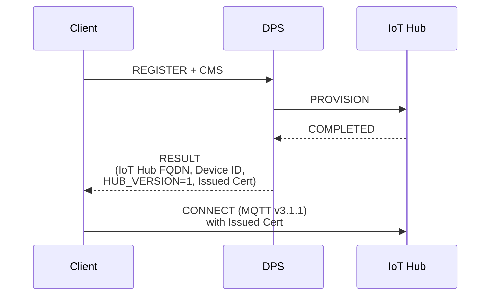
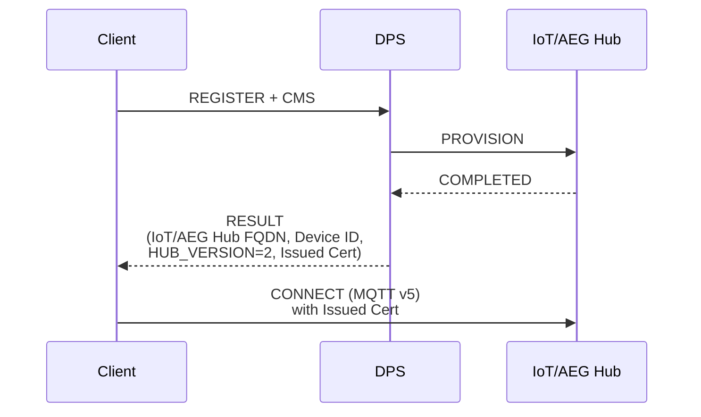

<!-- Copyright (c) Microsoft. All rights reserved.
     Licensed under the MIT license. See LICENSE file in the project root for full license information. -->

# Client Design for Supporting Integration with Device Provisioning Service 

## Abstract

This document tries bridge many needs regarding the clients for working with the new Azure IoT/AEG Hub, and yet providing an easy transition for customer from Azure IoT Hub (Classic).

> **Update (08/10/2026).** Everything below still holds: DPS remains a phase
> *inside* `az_iot_connection_client`, there is no separate provisioning client,
> and the two-adapter dance is unchanged. The one addition from
> [eng/client-separation.md](eng/client-separation.md) is that the connection
> profile DPS returns is no longer consumed purely privately — it is published to
> the application as `az_iot_hub_profile.connection_profile` via
> `az_iot_connection_client_get_hub_profile()`, so the application can pick the
> matching per-generation feature clients.

## Proposed Design

Azure IoT Hub (Classic) and Device Provisioning Service support MQTTv3.1.1.
The new Azure IoT/AEG Hub supports MQTTv5.

Key new feature: the DPS will return a new flag in the provisioning result that signals which version of IoT Hub the client must connect to (Classic Hub vs IoT/AEG Hub).

This would be the proposed design for the client to work with all these components:

### Scenario 1: Provisioning to Azure IoT Hub (Classic)



### Scenario 2: Provisioning to Azure IoT/AEG Hub



- The DPS service team must come with the considerations for how to route between hub_version=1 and hub_version=2. Likely at first only selected customers would have access to IoT/AEG Hub pools, so DPS must allow linking to those at the enrollment group-level.

- Adding a new `hub_version` (e.g.) field on the device registration result should be back-compatible with existing Azure IoT SDKs.

- The new client libraries shall have knowledge about MQTT-version capability of each hub version, and select the proper MQTT client (based on MQTT version supported) to connect to the provisioned hub.

- Abstracting it further to inform the MQTT version on the registation result is not a good design, since there will be [for the time being] just two versions of hub, and each have different MQTT-based protocol exchanges; so, for the client, knowing in separate just the MQTT version supported by the hub is not enough to communicate with it and exercise its messaging features (telemetry, c2d, direct methods, twin). 

## Custom registration payload

DPS lets a device send an arbitrary JSON object with its registration request.
The service forwards it to a custom-allocation policy (webhook / Function), and
it is also how a device declares an IoT Plug and Play model id at provisioning
time. The service may return a payload of its own in the registration result.

### Sending one

Set `opts.dps_registration_payload` to the JSON, and give the SDK somewhere to
build the request body — it never allocates and declares no payload buffer of
its own:

```c
static const char k_payload[] = "{\"modelId\":\"dtmi:com:example:Thermostat;1\"}";
AZ_IOT_DPS_REGISTRATION_BODY_STORAGE(body_buf, 256);

copts.dps_registration_payload
    = az_span_create((uint8_t*)k_payload, (int32_t)(sizeof(k_payload) - 1));
copts.dps_registration_body_buffer = az_span_create(body_buf, sizeof(body_buf));
```

Both options live at the END of `az_iot_connection_client_options`, not inside
the nested `dps` struct, for the reason `dps_hold_timeout_ms` gives there:
callers use positional aggregate initializers, and brace elision splices the
nested struct into the same positional sequence, so a member added anywhere but
the end would shift every member after it. See
[struct_versioning.md](struct_versioning.md).

The payload is caller-supplied JSON and the SDK does not interpret it — but it
does validate it, in `az_iot_connection_client_open()`, as exactly one
well-formed JSON **object** and nothing else, rejecting anything else with
`AZ_IOT_ERR_INVALID_ARG`. `payload` is an object on both directions of the DPS
contract, and the alternative is emitting a body the service refuses at
provisioning time, on a device in the field, with no clue as to why.

`opts.model_id` is NOT announced here. It feeds the Classic MQTT username only,
and injecting it into the payload would have to merge with — or silently
override — a `modelId` the caller's payload already carries. Put the model id in
the payload when provisioning should see it, as above.

### The body on the wire

The register PUBLISH carries one JSON object holding only the members that
registration actually needs. The registration id is not one of them: it travels
in the DPS username and topic.

| configured | register body |
|---|---|
| neither | *(empty)* |
| payload only | `{"payload":<json>}` |
| `dps.request_operational_certificate` only | `{"csr":"<base64 DER>"}` |
| both | `{"csr":"<base64 DER>","payload":<json>}` |

`payload` is the member name the DPS registration request uses; azure-sdk-for-c
writes the same one in `az_iot_provisioning_client_register_get_request_payload()`.
That helper is not called here because it always emits `registrationId` and has
no `csr` member, so it cannot produce the combined body.

### Buffer sizing

`AZ_IOT_CSR_PAYLOAD_BUFFER_MIN` (8448) covers the CSR body **alone**. Once a
payload shares the body it no longer does: the body needs a further
`AZ_IOT_DPS_REGISTRATION_PAYLOAD_OVERHEAD` (12) plus the payload itself.
`AZ_IOT_DPS_REGISTRATION_BODY_STORAGE(name, payload_max)` declares exactly that.
A payload-only device needs only `payload_max + 12`.

If `dps_registration_body_buffer` is left empty the SDK builds into
`csr_payload_buffer` instead, so a CSR-enrolling device that adds a small
payload only has to enlarge the buffer it already provides. Either way a body
that does not fit fails the registration with `AZ_IOT_ERR_NOT_ENOUGH_SPACE`; it
is never truncated, and nothing is published.

A zero-initialized options struct sends no payload and behaves exactly as
before.

### Reading the payload the service returns

`registrationState.payload` of the assignment is delivered through an optional
callback:

```c
static void on_registration_payload(az_span payload, void* ctx) { /* ... */ }

az_iot_connection_client_set_registration_payload_callback(
    &client, on_registration_payload, &ctx);
```

It fires once, only for an assignment that is otherwise good, and only when the
service actually sent a payload (absent and `null` both mean "none"). The span
is zero-copy into the inbound MQTT message and is valid **only for the duration
of the call** — the buffer is reused as soon as it returns, so copy anything
that must outlive it.

## Version

- 05/20/2026: Created by ewertons/timtay.

