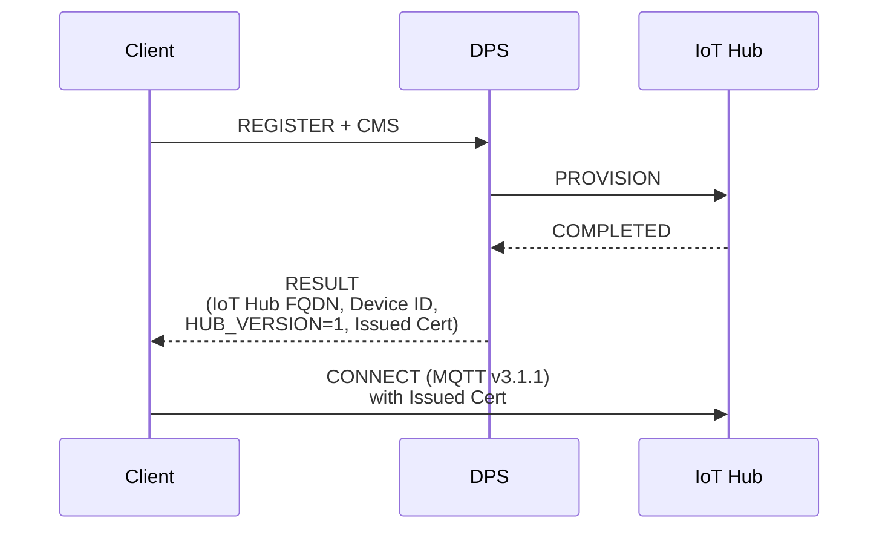
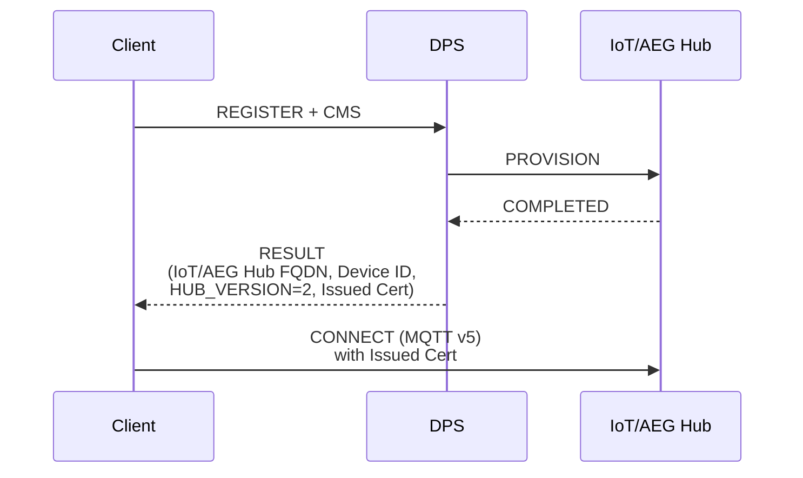

<!-- Copyright (c) Microsoft. All rights reserved.
     Licensed under the MIT license. See LICENSE file in the project root for full license information. -->

# Client Design for Supporting Integration with Device Provisioning Service 

## Abstract

This document tries bridge many needs regarding the clients for working with the new Azure IoT/AEG Hub, and yet providing an easy transition for customer from Azure IoT Hub (Classic).

> **Update (08/10/2026).** Everything below still holds: DPS remains a phase
> *inside* `az_iot_connection_client`, there is no separate provisioning client,
> and the two-adapter dance is unchanged. The one addition from
> [eng/client-separation.md](eng/client-separation.md) is that the hub version
> DPS returns is no longer consumed purely privately — it is published to the
> application as `az_iot_hub_profile.generation` via
> `az_iot_connection_client_get_hub_profile()`, so the application can pick the
> matching per-generation feature clients.

## Proposed Design

Azure IoT Hub (Classic) and Device Provisioning Service support MQTTv3.1.1.
The new Azure IoT/AEG Hub supports MQTTv5.

Key new feature: the DPS will return a new flag in the provisioning result that signals which version of IoT Hub the client must connect to (Classic Hub vs IoT/AEG Hub).

This would be the proposed design for the client to work with all these components:

### Scenario 1: Provisioning to Azure IoT Hub (Classic)

### Scenario 2: Provisioning to Azure IoT/AEG Hub

- The DPS service team must come with the considerations for how to route between hub_version=1 and hub_version=2. Likely at first only selected customers would have access to IoT/AEG Hub pools, so DPS must allow linking to those at the enrollment group-level.

- Adding a new `hub_version` (e.g.) field on the device registration result should be back-compatible with existing Azure IoT SDKs.

- The new client libraries shall have knowledge about MQTT-version capability of each hub version, and select the proper MQTT client (based on MQTT version supported) to connect to the provisioned hub.

- Abstracting it further to inform the MQTT version on the registation result is not a good design, since there will be [for the time being] just two versions of hub, and each have different MQTT-based protocol exchanges; so, for the client, knowing in separate just the MQTT version supported by the hub is not enough to communicate with it and exercise its messaging features (telemetry, c2d, direct methods, twin). 

## Version

- 05/20/2026: Created by ewertons/timtay.

