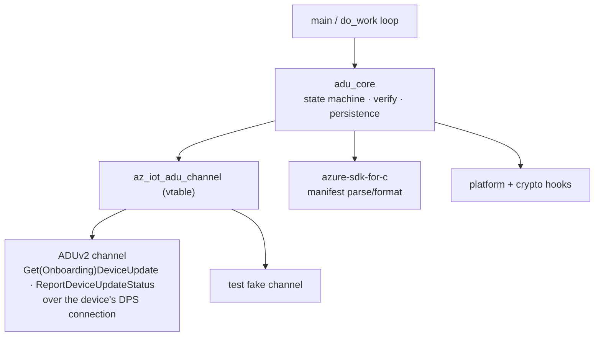
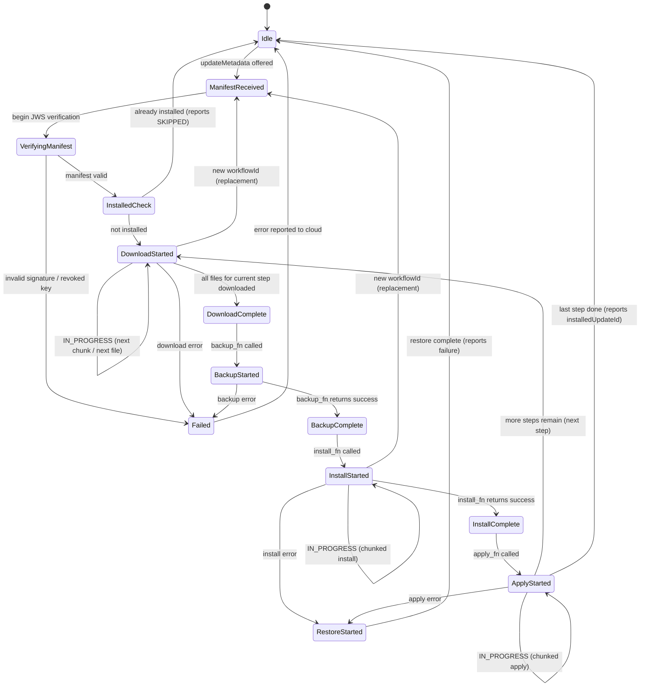
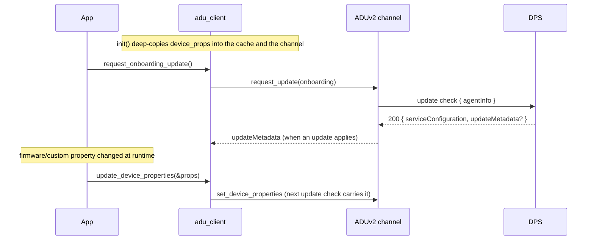
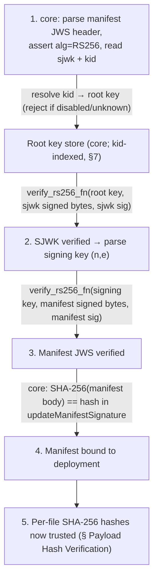
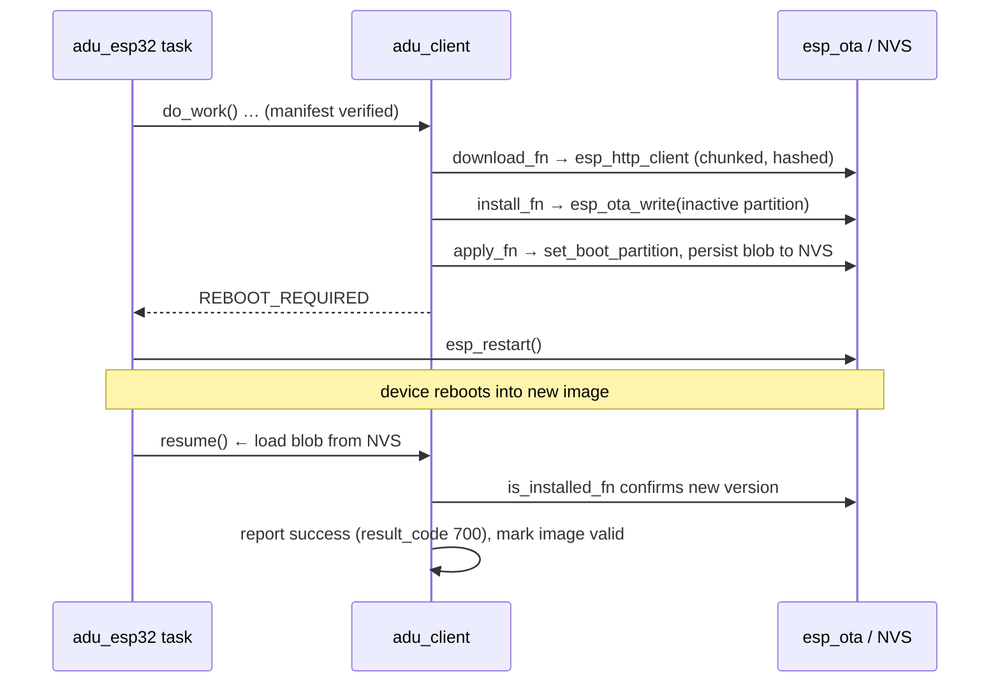
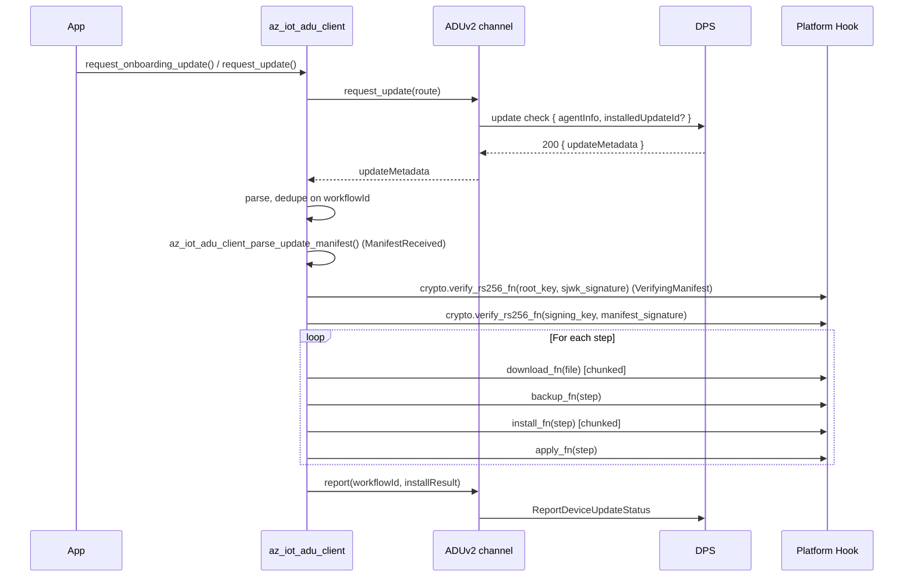
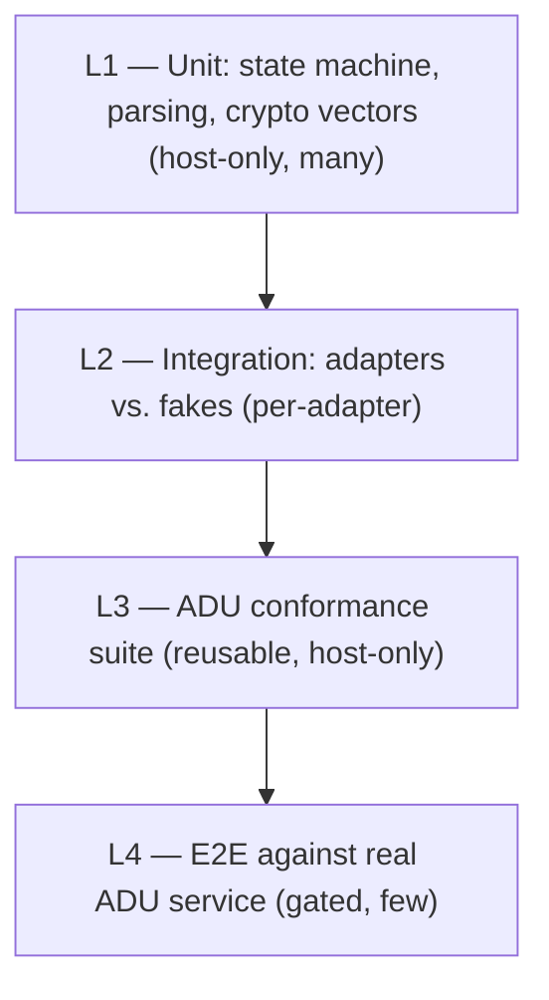

# Azure Device Update (ADU) Client — Design & Implementation Plan

The key words "MUST", "MUST NOT", "REQUIRED", "SHALL", "SHALL NOT", "SHOULD", "SHOULD NOT", "RECOMMENDED", "MAY", and "OPTIONAL" in this document are to be interpreted as described in [RFC 2119](https://datatracker.ietf.org/doc/html/rfc2119).

> **Status: ADUv2 is implemented; the ADUv1 device-twin channel has been removed.**
> Delivery and reporting go through the `az_iot_adu_channel` vtable. The only channel is ADUv2,
> over the device's DPS connection ([aduv2-spec.md](aduv2-spec.md)). See
> [adu-client-plan.md](adu-client-plan.md#what-aduv1-is-cut-means) for what the cut removed and
> [connection.md §7](../connection.md#7-aduv2-onboarding-and-renewal-planned) for the decision of
> record. Phases 0–6 (§11) are as-built history.

## 1. Overview

The `adu_client` is a **feature client** in the azure-iot-sdk SDK that implements the on-device side of the Azure Device Update protocol. It is layered into a transport-independent engine (manifest parsing, signature verification, root keys, payload integrity, the download → backup → install → apply → restore state machine, reboot/resume persistence) plus an **`az_iot_adu_channel`** vtable that carries delivery and reporting. The only channel is **ADUv2** — the device-initiated pull protocol fronted by the DPS gateway ([aduv2-spec.md](aduv2-spec.md)). The engine does not depend on `az_iot_twin_client`.

### Requirements

- The ADU client MUST implement the ADU workflow state machine (Idle → Download → Install → Apply, with Backup/Restore on failure).
- The ADU engine (`adu_core`) MUST NOT depend on any transport type. Delivery and reporting MUST be reached only through the `az_iot_adu_channel` vtable, so the engine is testable against a fake channel and the gateway is a channel parameter rather than a constant.
- The ADU client MUST verify update manifests cryptographically (JWS signature chain, SHA-256 payload hashes) before proceeding with any download.
- The ADU client MUST provide **platform abstraction hooks** so customers can plug their own download, install, apply, backup, and restore routines.
- Pre-built platform adapters SHOULD be shipped for **Linux** and **ESP32** (in `adapters/adu/`, not in core `src/`).
- The implementation MUST remain C99, single-threaded (callback-driven via `do_work()`), with no hidden allocations on the hot path — consistent with the existing SDK philosophy.
- The ADU client MUST report update state and results to the cloud. The wire shape is channel-specific: `ReportDeviceUpdateStatus` for ADUv2 (see [aduv2-spec.md](aduv2-spec.md)). The engine emits a structured result; the channel serializes it.
- The ADU client MUST support multi-step (composite) updates — the manifest MAY contain multiple instruction steps, each with its own handler type and file set.
- The SDK SHOULD be usable as an **agent core library**: in addition to the managed client, it SHOULD expose transport-free primitives to *validate + parse* a manifest into a filled struct and to *build* the result report, so consumers can implement their own ADU agent and state machine on top of the SDK's vetted trust code. (See §5.3 and [adu-client-plan.md](adu-client-plan.md) — Library / agent-core mode.)

### Non-Goals (for this phase)

- Delta/differential downloads.
- Diagnostics/log-upload interface.
- Peer-to-peer download acceleration (Delivery Optimization).
- adu-shell or privilege escalation (we assume the application has sufficient privileges).
- Component-level targeting (component enumerators).
- Proxy/nested updates (IoT Edge parent proxying updates to leaf devices).
- Reference steps with detached manifests (`"type": "reference"` + `detachedManifestFileId`).

---

## 2. Leveraging azure-sdk-for-c

The `azure-sdk-for-c` dependency (already fetched via CMake FetchContent) includes an **ADU client module** (`az_iot_adu_client`) that provides:

| Capability | Function |
|-----------|----------|
| Parse update manifest JSON | `az_iot_adu_client_parse_update_manifest()` |
| Structs for manifest, workflow, file info, step results | `az_iot_adu_client_update_manifest`, `az_iot_adu_client_update_request`, etc. |

Its device-twin helpers (service-property parsing, agent-state and acknowledgement formatting, component check) are not used by the engine. `az_iot_adu_build_report()` still emits the upstream agent-state JSON; the ADUv2 `reportStatus` body is built by the channel.

**What azure-sdk-for-c does NOT provide:**
- State machine / workflow orchestration.
- JWS signature verification.
- Any network I/O (download, MQTT).
- Platform hooks for install/apply/backup/restore.

### Strategy: Reuse, Don't Reimplement

Our `adu_client` MUST **delegate** manifest parsing to `azure-sdk-for-c`'s `az_iot_adu_client`
module. We MUST NOT reimplement JSON parsing already provided by the dependency.
The upstream reported-property formatter describes the removed ADUv1 channel, not ADUv2.
ADUv2 reporting uses the existing `az_json_writer` primitives with SDK-owned canonical result
types: the engine and serializer share `az_iot_adu_install_result` / `az_iot_adu_step_result`.
This avoids both a parallel report-result hierarchy and a dependency patch changing legacy
types consumed by the upstream twin formatter. Manifest parsing, spans and JSON primitives
remain reused; no dependency fork or patch is introduced. We own:

1. **State machine** — orchestrating the Download → Backup → Install → Apply → (Restore) lifecycle.
2. **JWS verification** — via customer-provided crypto hooks.
3. **Channel integration** — carrying an update manifest in and a structured report out, through the `az_iot_adu_channel` vtable; the ADUv2 channel serializes both.
4. **Platform hooks** — the vtable for download, install, apply, etc.

This preserves the well-tested parsing logic while allowing the ADUv2 result schema to evolve
independently of the archived dependency's ADUv1 formatter.

---

## 3. Architecture

The application drives the engine, which reaches the network only through the channel vtable and
the platform hooks.



---

## 4. State Machine



### Already-Installed Check

After verifying the manifest signature, the client MUST call `is_installed_fn`:

- If already installed: the client MUST report a `SKIPPED` outcome and return to Idle without downloading.
- Otherwise: the client MUST transition to DownloadStarted.

A customer-provided `accept_deployment_fn` hook MAY be added to allow application-level rejection (e.g., battery too low, critical operation in progress).

### Download & Verification Gating

Verification MUST be **two-staged** and MUST gate the transition into Install. A
payload MUST NOT be installed before both stages pass.

**Stage 1 — Manifest authenticity (before any download).** In
`VerifyingManifest`, the client MUST verify the update manifest's JWS signature
chain *before* it trusts any field in the manifest — including the file hashes.
Core parses the JWS and SJWK, resolves the root key by `kid`, and calls the
`verify_rs256_fn` crypto primitive for each of the two signature checks (see §6).
If verification fails (bad signature, unknown/revoked/`disabled` key, or `alg`
≠ `RS256`), the client MUST transition directly to `Failed` with source =
manifest verification (see result-code mapping below) and MUST NOT download
anything.

**Stage 2 — Payload integrity (per file, after download).** Each downloaded file
MUST be hash-verified against the `hashes[]` entry from the (now-trusted)
manifest before the file is eligible for Install:

1. The platform `download_fn` streams bytes and MUST feed them through the
   incremental crypto hooks (`sha256_init_fn` → `sha256_update_fn` →
   `sha256_final_fn`), or hash the completed file via `sha256_fn`.
2. The client MUST compare the computed SHA-256 against the manifest's
   `hash_value` (base64) for that file. The comparison MUST be constant-time.
3. On mismatch, the client MUST treat the file as a download failure: it MUST
   discard the file and transition to `Failed` (the deployment does not proceed
   to Backup/Install). It MUST NOT retry indefinitely within a single workflow.
4. `DownloadStarted → DownloadComplete` occurs only after **every** file for the
   current step has passed hash verification.

Only when Stage 1 (once per deployment) and Stage 2 (every file) both pass does
the state machine advance to `BackupStarted`/`InstallStarted`. This ordering —
authenticate the manifest, *then* trust its hashes, *then* verify payloads — is
mandatory; verifying payload hashes from an unverified manifest provides no
security.

### Device Properties on the Wire

Device properties reach the service on **every update check**: manufacturer, model and custom
properties as `agentInfo.compatibilityProperties`, and `installedUpdateId` on the regular route
(the onboarding route omits it). There is no unsolicited report: status reports are keyed on
`workflowId`, so a device with no workflow has nothing to report.

#### Device-Properties Model

The application supplies device properties as a **plain struct** that the library
**deep-copies** into its own cache. There is no callback and no shared ownership.
The design (full API in [§5.2](#52-device-properties-api)):

1. **Caller-owned struct, library-owned cache.** At `init` the application passes
   an `az_iot_adu_device_properties` (manufacturer, model, installedUpdateId,
   and an array of custom properties) plus a cache buffer. The library
   **deep-copies** every string into the cache; after `init` returns the
   application MAY mutate or free its own struct.
2. **No exposure of azure-sdk-for-c types.** The library MUST NOT expose
   `az_iot_adu_client_device_properties`.
3. **Cache reused for every request.** Every update check and status report
   reads from the cache; the application MUST NOT be invoked mid-`do_work`.
4. **Runtime update.** `az_iot_adu_client_update_device_properties()`
   deep-copies a new struct into the cache and refreshes the channel's copy; the
   **next** update check carries it. With a workflow active, its status is
   re-reported on the next `do_work()`.

**Threading.** This follows the SDK-wide single-threaded contract: `init`,
`update_device_properties`, and `do_work` MUST run on the same thread or be
externally serialized (e.g. one mutex guarding all SDK calls). The deep-copy
gives clean **ownership** (no dangling pointer into caller memory), not
cross-thread safety. SDK-wide thread-safety is a separate future effort.

### Duplicate vs. Replacement Detection

`workflowId` is the sole deployment identity; the service re-offers a workflow until it is
superseded. The client MUST distinguish:

| Condition | Meaning | Behavior |
|-----------|---------|----------|
| New `workflowId` | **Replacement** | MUST restart from ManifestReceived with the new deployment |
| Same `workflowId`, whatever the manifest bytes | **Duplicate** | MUST ignore |

### Result-Code Mapping

ADUv2 uses explicit `outcome` fields in the SDK-owned `az_iot_adu_install_result`
and `az_iot_adu_step_result` types. `result_code` is a signed 64-bit diagnostic,
not the source of the outcome; `extended_result_codes` is owned hex text.
The following table records current engine conventions, not a resolved service
mapping. Diagnostic-code conventions still require confirmation.

| Outcome | `result_code` |
|---|---|
| Step/overall success | `700` |
| Overall in progress | `1` |
| Unfinished step | `0` |
| Overall canceled/skipped | `-1` |
| Canceled/skipped unfinished step | `0` |
| Phase failure | `700 - facility`, retained for diagnostics |

**Extended diagnostics.** The engine composes a 32-bit value using the layout below,
then formats it into `extended_result_codes` as unsigned hex without `0x`.
There is no numeric `extended_result_code` member in the canonical result types.

```
 bits 31..28 : facility  (which phase/layer failed)
 bits 27..00 : code       (the hook's raw int32 result, truncated, or an SDK sub-code)
```

| Facility (bits 31..28) | Meaning | Set when |
|---|---|---|
| `0x1` | Manifest / JWS verification | `verify_rs256_fn` failed, `kid` unresolved/`disabled`, or `alg` ≠ `RS256` |
| `0x2` | Download (transport) | `download_fn` returned `AZ_IOT_ADU_RESULT_FAILURE` |
| `0x3` | Hash mismatch | computed SHA-256 ≠ manifest hash |
| `0x4` | Backup | `backup_fn` failed |
| `0x5` | Install | `install_fn` failed |
| `0x6` | Apply | `apply_fn` failed |
| `0x7` | Restore | `restore_fn` failed (rollback itself failed) |
| `0xF` | Internal / client | parser, state, or buffer error inside the ADU client |

The low 28 bits MUST carry the originating hook's raw return value (or an SDK
sub-code for internal failures) so a device-side failure can be diagnosed from
the cloud without on-device logs. When a failure has no meaningful sub-code, the
low bits MUST be `0`.

**`result_details`.** OPTIONAL free-form string. When set, it MUST be a copy into
a client-owned buffer (no pointer into hook-owned memory), consistent with the
no-shared-ownership rule used elsewhere.

### Multi-Step Support

The update manifest v5 `instructions.steps[]` array MAY contain multiple steps, each with its own handler type and file set. The state machine MUST iterate through steps sequentially:

1. For step N: the client MUST Download all files → Backup → Install → Apply.
2. If Apply succeeds and more steps remain: the client MUST advance to step N+1 and loop back to Download.
3. If any step fails: the client MUST Restore (rolling back from step N backward to step 0).
4. Per-step results MUST be reported via the SDK-owned `az_iot_adu_step_result` array.

#### Per-Step Result Accumulation

The client MUST maintain an `az_iot_adu_install_result` whose
`step_results[]` array has **one entry per manifest step**, indexed by step
number. As the machine progresses:

- On initialization, unfinished steps have outcome `IN_PROGRESS` and zero diagnostics.
- On a step completing successfully (Apply done), `step_results[N].result_code`
  MUST be set to `700`.
- On a step failing, `step_results[N]` MUST be set to the failing phase's
  `FAILED` outcome, diagnostic code and unsigned hex diagnostics, and
  no further steps MUST be started.
- The overall install result retains the first failure's diagnostic code; rollback failure
  may replace its extended diagnostics without changing the failing step's result.
- `step_results_count` matches the number of manifest steps; serialization uses
  `step_<index>` map keys. Outcomes are not inferred from diagnostic-code signs.
- On cancellation the unfinished current step is `CANCELED`; other unfinished steps
  become `SKIPPED` on termination. Completed/failed steps keep their outcomes.

Results own their text buffers and explicit byte lengths: 1024 bytes for ASCII hex diagnostics
and 4096 bytes for up to 1024 UTF-8 characters of details. A result struct copy therefore owns
all its text, independent of incoming payloads and snapshot scratch. This deliberately favors
simple lifetimes over memory usage; optimize the footprint later if needed. The report
envelope still borrows the same canonical install result rather than translating to a second
model. The default snapshot buffer accommodates the maximum text in every result.
Install results declare their overall fields directly, matching the service schema; they do
not embed a step result. The separate step-result type is used only for entries in `step_results`.

Embedded applications should keep the client out of small task stacks; the ESP32 sample uses
static client storage. Resume first validates the snapshot records and manifest without changing
the active client (except load scratch), then restores directly into the client-owned result.
It keeps only a small parsed-manifest view on the stack, not a second owned install result.
Whole-application stack and RAM usage still require validation on the target device.

#### Partial-Failure Rollback

When step N fails after steps `0..N-1` already applied, the client MUST roll back
**in reverse order** (`restore_fn` for step N-1, N-2, …, 0), so the device is
returned to its pre-deployment state:

1. Rollback MUST invoke `restore_fn` only for steps that had a successful
   `backup_fn` (steps whose Backup never ran MUST be skipped).
2. If a `restore_fn` itself fails, the client MUST record facility `0x7`
   (Restore) in the overall `extended_result_code` but MUST continue attempting
   to restore the remaining earlier steps (best-effort rollback).
3. After rollback completes (or is best-effort exhausted), the client MUST report
   the terminal `Failed` state with the accumulated step results, then return to
   `Idle`.
4. `installedUpdateId` MUST remain the **pre-deployment** value after a failed
   deployment + rollback (the new update is not installed).

### State reporting to cloud

Workflow transitions produce a status report. The engine hands the channel a structured result
(see Result-Code Mapping); the ADUv2 channel sends it as `ReportDeviceUpdateStatus`:

```json
{
  "workflowId": "<workflowId from updateMetadata>",
  "installedUpdateId": { "provider": "...", "name": "...", "version": "..." },
  "installResult": {
    "outcome": "IN_PROGRESS",
    "failureOrigin": "NOT_APPLICABLE",
    "resultCode": 1,
    "extendedResultCodes": "0"
  }
}
```

Per-step results go in `installResult.stepResults`, keyed `step_0`, `step_1`, …; field rules are
in [aduv2-spec.md](aduv2-spec.md).

### Cancellation

ADUv2 carries no cancel action. A new `workflowId` replaces the in-progress workflow: the
engine restarts at ManifestReceived when it is delivered. `az_iot_adu_is_cancelled()` remains
for hooks to poll; no ADUv2 input sets it.

### Reboot coordination

If `install_fn` or `apply_fn` returns `AZ_IOT_ADU_RESULT_REBOOT_REQUIRED`:

1. The client MUST report state to the cloud and MUST persist workflow progress to non-volatile storage via the customer-provided `persist_state_fn`.
2. The application MUST reboot the device after the client persists state.
3. On startup, the application MUST call `az_iot_adu_client_resume()`, which reads persisted state and continues the workflow from the appropriate phase.

### Persistence & Resume Blob Format

`persist_state_fn` / `load_state_fn` exchange an **opaque, self-contained byte
blob** that the core serializes and the platform merely stores verbatim (file,
NVS partition, EEPROM, …). The platform MUST NOT interpret it. This section
specifies its layout so the format is stable across firmware builds and portable
across MCU endianness.

#### Design constraints

- **Self-describing & versioned** — a magic + version prefix lets a newer agent
  detect and reject an incompatible older blob (returns "no resumable state",
  i.e. a clean restart) rather than misparsing it.
- **Fixed endianness** — all multi-byte integers MUST be **little-endian**, so a
  blob written on one core type is readable on another.
- **Integrity-checked** — a trailing CRC-32 detects torn writes / corrupted NVS;
  a bad CRC MUST be treated as "no resumable state".
- **Bounded, no dynamic allocation** — the maximum size is a compile-time
  constant so the caller can statically size the `state_blob` buffer it passes to
  `load_state_fn`.

```c
#ifndef AZ_IOT_ADU_STATE_BLOB_VERSION
#define AZ_IOT_ADU_STATE_BLOB_VERSION 1
#endif

/* Bounds the workflow id stored in the blob (and elsewhere in the client). */
#ifndef AZ_IOT_ADU_MAX_WORKFLOW_ID_LEN
#define AZ_IOT_ADU_MAX_WORKFLOW_ID_LEN 73   /* ADU service id: GUID-style, plus NUL */
#endif

/* Upper bound the caller uses to size the load_state_fn buffer. Derived from the
 * fixed header + bounded workflow-id + bounded step-result array. */
#ifndef AZ_IOT_ADU_STATE_BLOB_MAX_SIZE
#define AZ_IOT_ADU_STATE_BLOB_MAX_SIZE 512
#endif
```

#### Layout (v1)

| Offset | Field | Type | Notes |
|--------|-------|------|-------|
| 0 | `magic` | `uint8[4]` | ASCII `"ADUS"`. Mismatch ⇒ not our blob. |
| 4 | `version` | `uint8` | `AZ_IOT_ADU_STATE_BLOB_VERSION`. Mismatch ⇒ discard. |
| 5 | `flags` | `uint8` | bit0 `backup_taken` summary; reserved bits MUST be 0. |
| 6 | `state` | `uint8` | `az_iot_adu_state` to re-enter (see Resume semantics). |
| 7 | `action` | `uint8` | workflow action (ApplyDeployment/Cancel) from the request. |
| 8 | `current_step` | `uint16` | step index in progress. |
| 10 | `step_count` | `uint16` | total steps (== `step_results` entries). |
| 12 | `current_file` | `uint16` | file index within the current step. |
| 14 | `file_count` | `uint16` | files in the current step. |
| 16 | `overall_result_code` | `int32` | accumulated overall result. |
| 20 | `overall_extended_result_code` | `int32` | accumulated facility-coded value. |
| 24 | `workflow_id_len` | `uint16` | length of the UTF-8 workflow id that follows. |
| 26 | `workflow_id` | `uint8[workflow_id_len]` | bounded by `AZ_IOT_ADU_MAX_WORKFLOW_ID_LEN`. |
| … | `manifest_sha256` | `uint8[32]` | SHA-256 of the signed manifest body (replacement detection). |
| … | `step_results[step_count]` | `{ int32 result_code; int32 extended_result_code; uint8 phase; uint8 backup_done; }` | per-step accumulation + rollback eligibility. |
| … | `crc32` | `uint32` | CRC-32 (IEEE 802.3) over every byte from offset 0 up to here. |

`backup_done` per step is what the **Partial-Failure Rollback** logic consults to
decide which `restore_fn` calls are eligible after a reboot — it MUST survive the
power cycle, so it lives in the blob rather than only in RAM.

#### Resume semantics (`az_iot_adu_client_resume()`)

1. Call `load_state_fn`. If it reports no state, or `magic`/`version`/`crc32`
   fail validation, `resume()` is a **no-op** returning success — the agent
   starts clean and waits for the next update offer.
2. Otherwise core rehydrates `current_request`, `current_step`, `current_file`,
   the `step_results[]`, and `backup_done` flags from the blob.
3. **Replacement check** — when the next offer arrives, core compares its
   `workflowId` against the persisted one. A different id means the persisted
   workflow was superseded while the device was down: core MUST discard the
   resumed state and process the new deployment. The same id is a duplicate and
   is ignored.
4. **Re-entry point** — `resume()` MUST re-enter at a *phase boundary*, never
   mid-hook (hooks are not assumed re-entrant across reboot):
   - persisted `state` ∈ {`INSTALL_*`} ⇒ re-enter at the start of **Apply** for
     `current_step` (install completed before the reboot it requested).
   - persisted `state` ∈ {`APPLY_*`} ⇒ verify via `is_installed_fn`; if installed,
     advance to the next step (or finish), else treat as step failure → rollback.
   - any earlier phase (download/backup) ⇒ re-enter at the **start of that step**
     (Download), re-downloading any partially fetched file; partial download
     progress is intentionally **not** trusted across reboot.
5. After a successful resume-to-completion or a rollback, core MUST clear the
   persisted blob (a zero-length `persist_state_fn` write) so a later boot does
   not replay a finished workflow.

   This applies to **every** way a checkpoint stops being current — completion,
   rollback, cancellation, and supersession by a newer deployment — because the
   platform loaders are repeatable: `load_state_fn` keeps returning the same
   record until something overwrites it. Core tracks whether storage is believed
   to hold a record and only issues the invalidation when there is one, so a
   device that never checkpoints never pays a flash write. If the invalidation
   write fails, core keeps the record marked live and retries at the next
   terminal transition rather than leaving a replayable checkpoint behind.

   `resume()` treats a zero-length load as "nothing persisted" and returns
   success, since a cleared record is the normal steady state rather than
   corruption.

> Persisting after **every** phase is OPTIONAL; the only MUST is to persist before
> a reboot the agent itself requested (`REBOOT_REQUIRED`). Persisting at more
> boundaries only widens how much progress survives an *unexpected* power loss.

---

## 5. Public API Surface

### 5.1 Header: `inc/azure/iot/az_iot_adu.h`

> The public header is named `az_iot_adu.h` (not `az_iot_adu_client.h`) on
> purpose: azure-sdk-for-c already ships `<azure/iot/az_iot_adu_client.h>` (the
> manifest parsing/formatting structs), and since `inc/` is on the include path
> our header must not shadow it. We include the upstream header from ours.

```c
#ifndef AZ_IOT_ADU_H
#define AZ_IOT_ADU_H

#include <stdint.h>
#include <stddef.h>
#include <stdbool.h>
#include "az_iot_result.h"
#include "az_iot_connection_client.h"
#include <azure/iot/az_iot_adu_client.h>  /* azure-sdk-for-c: parsing structs */

#ifdef __cplusplus
extern "C" {
#endif

/* --- Result codes -------------------------------------------------------- */

#define AZ_IOT_ADU_RESULT_SUCCESS           0
#define AZ_IOT_ADU_RESULT_IN_PROGRESS       1
#define AZ_IOT_ADU_RESULT_REBOOT_REQUIRED   2
#define AZ_IOT_ADU_RESULT_ALREADY_INSTALLED 3
#define AZ_IOT_ADU_RESULT_CANCELLED         4
#define AZ_IOT_ADU_RESULT_FAILURE          -1

/* --- State enum ---------------------------------------------------------- */

typedef enum az_iot_adu_state
{
    AZ_IOT_ADU_STATE_IDLE = 0,
    AZ_IOT_ADU_STATE_MANIFEST_RECEIVED,
    AZ_IOT_ADU_STATE_VERIFYING_MANIFEST,
    AZ_IOT_ADU_STATE_DOWNLOAD_STARTED,
    AZ_IOT_ADU_STATE_DOWNLOAD_COMPLETE,
    AZ_IOT_ADU_STATE_BACKUP_STARTED,
    AZ_IOT_ADU_STATE_BACKUP_COMPLETE,
    AZ_IOT_ADU_STATE_INSTALL_STARTED,
    AZ_IOT_ADU_STATE_INSTALL_COMPLETE,
    AZ_IOT_ADU_STATE_APPLY_STARTED,
    AZ_IOT_ADU_STATE_RESTORE_STARTED,
    AZ_IOT_ADU_STATE_FAILED,
} az_iot_adu_state;

/* --- Platform hooks (vtable) --------------------------------------------- */

typedef struct az_iot_adu_platform_hooks
{
    /**
     * Download one file. Called once per file, once per do_work iteration.
     * MUST return AZ_IOT_ADU_RESULT_IN_PROGRESS to continue on next do_work;
     * MUST return AZ_IOT_ADU_RESULT_SUCCESS when complete.
     * The hook MUST verify the file hash (helpers provided).
     * The hook SHOULD check az_iot_adu_is_cancelled() periodically.
     */
    int32_t (*download_fn)(
        const az_iot_adu_client_update_manifest_file* file,
        const az_span download_url,
        uint32_t file_index,
        uint32_t file_count,
        void* user_ctx);

    /**
     * Install the previously-downloaded update payload for one step.
     * MAY return AZ_IOT_ADU_RESULT_IN_PROGRESS for chunked install.
     * MAY return AZ_IOT_ADU_RESULT_REBOOT_REQUIRED.
     */
    int32_t (*install_fn)(
        const az_iot_adu_client_update_manifest* manifest,
        uint32_t step_index,
        void* user_ctx);

    /**
     * Apply (activate) the installed update for one step.
     * MAY return AZ_IOT_ADU_RESULT_REBOOT_REQUIRED.
     */
    int32_t (*apply_fn)(
        const az_iot_adu_client_update_manifest* manifest,
        uint32_t step_index,
        void* user_ctx);

    /**
     * Backup current state before installing. OPTIONAL (MAY be NULL).
     */
    int32_t (*backup_fn)(
        const az_iot_adu_client_update_manifest* manifest,
        uint32_t step_index,
        void* user_ctx);

    /**
     * Restore previous state on failure. OPTIONAL (MAY be NULL).
     */
    int32_t (*restore_fn)(
        const az_iot_adu_client_update_manifest* manifest,
        uint32_t step_index,
        void* user_ctx);

    /**
     * Check if the update described by manifest is already installed.
     * MUST return AZ_IOT_ADU_RESULT_ALREADY_INSTALLED if so.
     */
    int32_t (*is_installed_fn)(
        const az_iot_adu_client_update_manifest* manifest,
        void* user_ctx);

    /**
     * Persist workflow state to non-volatile storage (for reboot survival).
     * OPTIONAL — REQUIRED only if reboot is possible during update.
     */
    int32_t (*persist_state_fn)(
        const uint8_t* state_blob,
        size_t state_blob_len,
        void* user_ctx);

    /**
     * Load previously-persisted workflow state. Returns 0 and fills
     * state_blob/len on success; returns non-zero if no state persisted.
     */
    int32_t (*load_state_fn)(
        uint8_t* state_blob,
        size_t state_blob_capacity,
        size_t* state_blob_len,
        void* user_ctx);

    void* user_ctx;
} az_iot_adu_platform_hooks;

/* --- Crypto hooks (REQUIRED) --------------------------------------------- */

/**
 * Crypto operations MUST be provided by the customer via hooks.
 * The core ADU library MUST NOT link any crypto backend.
 *
 * IMPORTANT: these hooks are PURE CRYPTOGRAPHIC PRIMITIVES only. They do NOT
 * parse JWS, decode base64url, resolve keys, or enforce revocation. All of
 * that orchestration lives in ADU core (see §6), which calls these primitives.
 * An adapter therefore only has to wire up "RSA verify + SHA-256" — nothing
 * security-sensitive beyond the math itself.
 *
 * Pre-built implementations are available in adapters/adu/ for convenience.
 */
typedef struct az_iot_adu_crypto_hooks
{
    /**
     * Verify an RSASSA-PKCS1-v1_5 signature over SHA-256 (JWS "alg":"RS256").
     * This is the ONLY asymmetric primitive ADU needs: it is used both to
     * verify the SJWK with a root key and to verify the manifest JWS with the
     * SJWK's signing key. The public key is passed as raw big-endian modulus
     * and exponent (as carried in a JWK's "n"/"e", already base64url-decoded
     * by core).
     *
     * MUST return AZ_IOT_ADU_RESULT_SUCCESS iff the signature is valid over
     * signed_data, AZ_IOT_ADU_RESULT_FAILURE otherwise. MUST NOT interpret the
     * bytes as anything but an RSA key + message + signature.
     */
    int32_t (*verify_rs256_fn)(
        const uint8_t* modulus,      size_t modulus_len,
        const uint8_t* exponent,     size_t exponent_len,
        const uint8_t* signed_data,  size_t signed_data_len,
        const uint8_t* signature,    size_t signature_len,
        void* user_ctx);

    /**
     * Compute SHA-256 hash of a buffer.
     */
    int32_t (*sha256_fn)(
        const uint8_t* data,
        size_t data_len,
        uint8_t hash_out[32],
        void* user_ctx);

    /**
     * Initialize incremental SHA-256 context (for streaming payload hash).
     * ctx_out is an opaque pointer managed by the implementation.
     */
    int32_t (*sha256_init_fn)(void** ctx_out, void* user_ctx);

    /**
     * Feed data into incremental SHA-256.
     */
    int32_t (*sha256_update_fn)(void* ctx, const uint8_t* data, size_t len, void* user_ctx);

    /**
     * Finalize incremental SHA-256, write 32-byte hash. Frees ctx.
     */
    int32_t (*sha256_final_fn)(void* ctx, uint8_t hash_out[32], void* user_ctx);

    void* user_ctx;
} az_iot_adu_crypto_hooks;

/* --- Root key store (owned and managed by ADU core) ---------------------- */

/**
 * An RSA root public key trusted to sign Signed JWKs (SJWKs). Root keys are
 * managed by ADU core — NOT by the crypto adapter — so that key resolution by
 * `kid` and revocation policy are written once, in portable code.
 *
 * All fields are caller-owned. Core stores the pointers (no deep copy of key
 * bytes); the arrays MUST outlive the client. Keys may be compiled-in
 * constants (see az_iot_adu_microsoft_root_keys()) or loaded at runtime.
 */
typedef struct az_iot_adu_root_key
{
    const char*    kid;           /* JWK key id, matched against the SJWK header `kid`. */
    const uint8_t* modulus;       /* big-endian RSA modulus (n). */
    size_t         modulus_len;
    const uint8_t* exponent;      /* big-endian RSA exponent (e). */
    size_t         exponent_len;
    bool           disabled;      /* true = revoked/disabled; rejected during resolution.
                                     Kept in the list only for auditability. */
} az_iot_adu_root_key;

/* --- Device properties (plain struct, deep-copied by the client) --------- */

typedef struct az_iot_adu_update_id_info
{
    const char* provider;
    const char* name;
    const char* version;
} az_iot_adu_update_id_info;

typedef struct az_iot_adu_custom_property
{
    const char* name;
    const char* value;
} az_iot_adu_custom_property;

/**
 * Device properties supplied by the application. All fields are caller-owned;
 * the client DEEP-COPIES them into its cache buffer at init() and on
 * update_device_properties(). After those calls return, the application MAY
 * mutate or free this struct and the arrays/strings it points to.
 */
typedef struct az_iot_adu_device_properties
{
    const char*                         manufacturer;
    const char*                         model;
    az_iot_adu_update_id_info           installed_update_id;
    const az_iot_adu_custom_property* custom_properties;       /* caller's array, MAY be NULL */
    size_t                              custom_properties_count;
} az_iot_adu_device_properties;

/* --- Client struct -------------------------------------------------------- */

typedef struct az_iot_adu_client_t
{
    struct
    {
        az_iot_adu_channel channel;   /* ADUv2 channel bound to the connection client */
        az_iot_adu_platform_hooks hooks;
        az_iot_adu_crypto_hooks crypto;
        /* Root-key store (core-owned). Pointers reference caller arrays; see §7.
         * Capacity is compile-time (AZ_IOT_ADU_MAX_ROOT_KEYS). */
        az_iot_adu_root_key root_keys[AZ_IOT_ADU_MAX_ROOT_KEYS];
        size_t root_key_count;
        az_iot_adu_state state;
        az_iot_adu_client_update_request current_request;
        az_iot_adu_client_update_manifest current_manifest;
        uint32_t current_step;
        uint32_t current_file;
        bool cancel_requested;
        /* Client-owned device-properties cache (deep copy of caller's struct). */
        uint8_t* device_props_buffer;
        size_t device_props_buffer_size;
        bool device_props_report_pending;
        /* Connection-state observer / detach safety (see §16). */
        bool detached;
    } _internal;
} az_iot_adu_client_t;

/* --- Lifecycle ----------------------------------------------------------- */

/**
 * Configuration for az_iot_adu_client_initialize(). Zero-initialize via
 * az_iot_adu_client_config_options_default() and set the required fields:
 *   hooks:   platform operations (download/install/apply/...). See §6.
 *   crypto:  pure-primitive crypto hooks (RSA verify + SHA-256). See §6.
 *   root_keys / root_key_count: caller-owned RSA root public keys that anchor
 *     manifest trust (see §7). Core copies the small descriptor array into its
 *     fixed store (the key BYTES are referenced, not copied, so they MUST
 *     outlive the client), capped at AZ_IOT_ADU_MAX_ROOT_KEYS. For
 *     Microsoft-signed updates, pass az_iot_adu_microsoft_root_keys().
 *   device_props: caller-owned device properties, DEEP-COPIED into the cache.
 *     May be mutated/freed by the caller after init returns.
 *   device_props_buffer / size: caller-owned cache the client copies into.
 *     No hidden allocation; the buffer MUST outlive the client. Size it exactly
 *     with az_iot_adu_device_props_buffer_size().
 *
 * Named az_iot_adu_client_config_options (the `config_` qualifier) to avoid
 * colliding with azure-sdk-for-c's own az_iot_adu_client_options.
 */
typedef struct az_iot_adu_client_config_options
{
    const az_iot_adu_platform_hooks*    hooks;
    const az_iot_adu_crypto_hooks*      crypto;
    const az_iot_adu_root_key*          root_keys;
    size_t                              root_key_count;
    const az_iot_adu_device_properties* device_props;
    uint8_t*                            device_props_buffer;
    size_t                              device_props_buffer_size;
} az_iot_adu_client_config_options;

az_iot_adu_client_config_options az_iot_adu_client_config_options_default(void);

/* One observer registry, discriminated by event kind, matching the connection
 * client's add/remove seam so an application learns one pattern for the whole
 * SDK. Every observer receives every event; read `kind` first.
 *
 *   WORKFLOW_STATE_CHANGED -- the deployment moved. Otherwise observable only
 *     by polling az_iot_adu_client_get_state().
 *   OPERATION_ABANDONED    -- an operation reached a verdict that stops the
 *     CLIENT re-arming it. It does NOT mean the application may not ask again;
 *     that is the intended response, which is why the event carries the route:
 *     a lost status report is not a lost update check, and the onboarding and
 *     regular fetches are asked for separately.
 *
 * Abandonment is raised from on_channel_result()'s no-re-arm branch, which IS
 * the definition of "the client will not retry this". Deriving both from one
 * condition is deliberate: a second list in the channel would be free to drift
 * away from the engine's. It covers PROCEED as well as FATAL -- PROCEED is
 * UPDATE_ACCOUNT_NOT_LINKED on a fetch, a permanent refusal that otherwise
 * reads exactly like "no update available".
 *
 * The event carries the service diagnosis (numeric `errorCode`, the
 * best-effort error TEXT from `message`, and `trackingId`), because the
 * classification alone collapses failures needing different operator
 * responses, and trackingId is what a support request needs.
 *
 * `message` is TEXT, not a stable identifier: it usually carries the
 * originating code ("INVALID_REQUEST", "UNKNOWN_WORKFLOW_ID"), which is what
 * the classifier matches on defensively, but the same field is sometimes free
 * prose ("Deserialization error."). Applications branch on `code` and on the
 * event's `reason`. */
az_iot_result az_iot_adu_client_add_observer(
    az_iot_adu_client_t* client,
    az_iot_adu_observer_callback cb,
    void* user_ctx);

az_iot_result az_iot_adu_client_remove_observer(
    az_iot_adu_client_t* client,
    az_iot_adu_observer_callback cb,
    void* user_ctx);

/**
 * Initialize the ADU client. `connection` is the connection client whose DPS
 * session carries the ADUv2 channel; `options` carries the rest (hooks,
 * crypto, trust store, device properties + caller cache). Returns
 * AZ_IOT_ERR_INVALID_ARG if a required field is NULL, or
 * AZ_IOT_ERR_NOT_ENOUGH_SPACE if root_key_count > AZ_IOT_ADU_MAX_ROOT_KEYS or
 * the buffer is too small for device_props.
 */
az_iot_result az_iot_adu_client_initialize(
    az_iot_adu_client_t* client,
    az_iot_connection_client* connection,
    const az_iot_adu_client_config_options* options);

/**
 * Return Microsoft's compiled-in ADU root public keys (const, static storage).
 * Convenience for the common case; equivalent to passing your own array to
 * az_iot_adu_client_initialize(). Pointer and count reference static data.
 */
const az_iot_adu_root_key* az_iot_adu_microsoft_root_keys(size_t* out_count);

void az_iot_adu_client_destroy(az_iot_adu_client_t* client);

/**
 * Resume a workflow after device reboot. The application MUST call this during startup.
 * If no persisted state exists, this is a no-op.
 */
az_iot_result az_iot_adu_client_resume(az_iot_adu_client_t* client);

/* --- Runtime ------------------------------------------------------------- */

/**
 * Drive the ADU state machine. The application MUST call this from its do_work loop.
 * Non-blocking: MUST process at most one chunk of work per invocation.
 */
az_iot_result az_iot_adu_client_do_work(az_iot_adu_client_t* client);

/**
 * Check if cancellation has been requested (called from within platform hooks).
 */
bool az_iot_adu_is_cancelled(const az_iot_adu_client_t* client);

/**
 * Get the current ADU agent state.
 */
az_iot_adu_state az_iot_adu_client_get_state(const az_iot_adu_client_t* client);

/**
 * Ask for an ONBOARDING update -- the day-0/pre-registration route. Needs no
 * device record and omits installedUpdateId.
 *
 * The application chooses the route: it is the only party that knows whether
 * it has a device record, because it persists its provisioning result across
 * boots. The service cannot be probed for it either -- "no device record" and
 * "malformed request" share one error code.
 *
 * Asynchronous: records the request; the NEXT do_work() issues it, retrying on
 * a later tick if the channel is not ready.
 *
 * timeout_ms bounds the whole wait in WALL-CLOCK terms;
 * AZ_IOT_ADU_REQUEST_NO_TIMEOUT (0) means no bound, and
 * AZ_IOT_ADU_REQUEST_DEFAULT_TIMEOUT_MS (60000) is the default for a caller
 * with no policy of its own -- it bounds the retries an unservable check keeps
 * issuing, not the wait. On
 * expiry the request is dropped and OPERATION_ABANDONED is raised with
 * AZ_IOT_ERR_TIMEOUT. Per call, not a compile-time constant: a boot-time
 * onboarding probe and a nightly poll do not share a deadline.
 *
 * Time spent obeying a service-requested delay COUNTS against it. Excluding it
 * would move the deadline the caller set, and the caller plans around that
 * deadline. A delay that cannot fit ends the request at once -- waiting buys
 * nothing, since the channel refuses for its whole duration -- and the event
 * carries service_error.retry_after_ms so the application can schedule its own
 * next attempt.
 */
az_iot_result az_iot_adu_client_request_onboarding_update(
    az_iot_adu_client_t* client, uint32_t timeout_ms);

/**
 * Ask for a REGULAR (software) update -- the operational route. Requires a
 * provisioned device with a device record, and sends installedUpdateId, which
 * is how the service knows what to offer next. Same asynchronous contract.
 */
az_iot_result az_iot_adu_client_request_update(az_iot_adu_client_t* client, uint32_t timeout_ms);

/**
 * Update the cached device properties and request a report. Deep-copies
 * device_props into the client cache and sets a pending flag; the NEXT
 * do_work() publishes. Multiple calls coalesce into a single report. After
 * this returns, the caller MAY mutate or free device_props. Returns
 * AZ_IOT_ERR_NOT_ENOUGH_SPACE if the cache buffer is too small.
 *
 * Single-threaded contract: MUST be called on the do_work thread or be
 * externally serialized with do_work().
 */
az_iot_result az_iot_adu_client_update_device_properties(
    az_iot_adu_client_t* client,
    const az_iot_adu_device_properties* device_props);

#ifdef __cplusplus
}
#endif
#endif /* AZ_IOT_ADU_CLIENT_H */
```

### 5.2 Device-Properties API

Device properties are supplied as a **plain struct** that the client
**deep-copies** into a caller-provided cache buffer. There is no callback and no
shared ownership: once `init` (or `update_device_properties`) returns, the
application owns its struct outright and may mutate or free it.

- At `init` the application passes `az_iot_adu_device_properties` plus a cache
  buffer. The client MUST copy every string into the cache.
- The client maps the cached values onto azure-sdk-for-c's
  `az_iot_adu_client_device_properties` internally, only when formatting the
  payload — that type never escapes to the application.
- `update_device_properties()` re-copies a new struct and flags a re-report on
  the next `do_work()`. Reconnect re-reports reuse the existing cache.

```c
/* Build the struct on the stack; strings are caller-owned. */
static const az_iot_adu_custom_property custom[] = {
    { "region", "westus2" },
};
az_iot_adu_device_properties props = {
    .manufacturer = "Contoso",
    .model        = "Thermostat-9000",
    .installed_update_id = { .provider = "Contoso", .name = "Thermostat", .version = "1.0.0" },
    .custom_properties = custom,
    .custom_properties_count = 1,
};

uint8_t props_cache[256];
size_t root_key_count;
const az_iot_adu_root_key* root_keys = az_iot_adu_microsoft_root_keys(&root_key_count);
az_iot_adu_client_config_options adu_opts = az_iot_adu_client_config_options_default();
adu_opts.hooks = &hooks;
adu_opts.crypto = &crypto;
adu_opts.root_keys = root_keys;
adu_opts.root_key_count = root_key_count;
adu_opts.device_props = &props;
adu_opts.device_props_buffer = props_cache;
adu_opts.device_props_buffer_size = sizeof(props_cache);
az_iot_adu_client_initialize(&adu, &conn, &adu_opts);
/* `props` and its strings may now be freed/reused; the client holds a deep copy. */

/* Later, when firmware version or a custom property changes at runtime: */
props.installed_update_id.version = "1.1.0";
az_iot_adu_client_update_device_properties(&adu, &props); /* carried by the next update check */
```

Device properties on the wire, end to end:



### 5.3 Agent Core-Library API (parse-only / BYO state machine)

> Rationale and gap analysis: see
> [adu-client-plan.md](adu-client-plan.md) — Library / agent-core mode. This API
> lets a consumer build their **own** ADU agent (in the spirit of
> [Azure/iot-hub-device-update](https://github.com/Azure/iot-hub-device-update))
> on top of our vetted parse + trust + report code, without adopting our state
> machine or any transport.

These functions are **transport-free**. They take spans/structs
only, perform no hidden allocation, and (where they return a struct) populate the
output **only after** trust verification passes (fail-closed). After the §10
engine extraction, the managed `az_iot_adu_client` is implemented in terms of
these same primitives so there is a single verified copy of the security-critical
path.

```c
/* --- Library mode: validate + parse → filled struct ---------------------- */

/**
 * Verify (JWS/RS256 signature + root-key trust + alg/kid) AND parse a deployment
 * payload into filled structs. Fail-closed: out_request/out_manifest are valid
 * only on AZ_IOT_OK. The manifest is unescaped in place, so spans inside the
 * outputs reference `request_json`, which the caller owns and MUST keep alive
 * (and stable) for as long as the structs are used. No heap, no network.
 *
 *   request_json: the `updateMetadata` object (workflowId, updateManifest,
 *     updateManifestSignature, fileUrls), exactly as the service sends it.
 *     Mutated in place (manifest string unescaped); pass a writable buffer.
 *   crypto / root_keys: same trust inputs as az_iot_adu_client_initialize().
 *
 * Returns AZ_IOT_OK (verified parse), AZ_IOT_ERR_NOT_FOUND
 * (no workflowId), AZ_IOT_ERR_INVALID_ARG (bad args or
 * malformed JSON), or AZ_IOT_ERR_AUTH (signature/trust verification failed).
 */
az_iot_result az_iot_adu_parse_update_request(
    az_span request_json,
    const az_iot_adu_crypto_hooks* crypto,
    const az_iot_adu_root_key* root_keys,
    size_t root_key_count,
    az_iot_adu_client_update_request* out_request,
    az_iot_adu_client_update_manifest* out_manifest);

/**
 * Streaming SHA-256 integrity check for one file, callable from the consumer's
 * own download loop (payload bytes are not present at parse time). read_chunk is
 * invoked repeatedly until it reports the end of the file.
 */
az_iot_result az_iot_adu_verify_file_hash(
    const az_iot_adu_client_update_manifest_file* file,
    const az_iot_adu_crypto_hooks* crypto,
    int32_t (*read_chunk)(size_t offset, uint8_t* buf, size_t cap, size_t* out_read, void* ctx),
    void* read_ctx);

/**
 * Serialize the canonical report as ADUv2 JSON using az_json_writer.
 * No state machine, network I/O, or diagnostic-code remapping.
 * Both structs are caller-allocated and size-stamped (docs/struct_versioning.md):
 * initialize them with AZ_IOT_ADU_REPORT_INIT / AZ_IOT_ADU_INSTALL_RESULT_INIT.
 * A zero stamp is INVALID_ARG; any other mismatch is NOT_SUPPORTED, because
 * step_results is an inline array whose stride a different header would change.
 */
az_iot_result az_iot_adu_build_report(
    const az_iot_adu_report* report,
    uint8_t* out_json,
    size_t out_size,
    size_t* out_len);
```

**Boundaries (consumer-owned in library mode).** Core provides parse, trust,
integrity, and report formatting only. Step/content-handler dispatch (switch on
the manifest `handler` string), component enumeration, delta/`relatedFiles`
download handlers, diagnostics/log upload, and privilege separation
(`adu-shell`) remain the agent author's responsibility — see
[adu-client-plan.md](adu-client-plan.md) — see "Out of scope" for the consumer/core boundary.

---

## 6. Cryptographic Verification — Hooks-Only Model

### Design Decision: No Built-in Crypto Backend

The core ADU library (`src/features/adu/`) MUST NOT link any crypto library (no mbedTLS, no OpenSSL). All cryptographic operations MUST be provided exclusively through `az_iot_adu_crypto_hooks`. Rationale:

1. **Portability** — Different platforms use different crypto stacks (mbedTLS on ESP32, OpenSSL on Linux, WolfSSL on some RTOS, hardware crypto on secure MCUs). Linking any one forces an unwanted dependency on all others.
2. **HSM support** — Customers with hardware security modules need their crypto to route through PKCS#11 or vendor APIs. A hooks-only model naturally supports this.
3. **Binary size** — Embedded targets (ESP32) cannot afford unused crypto code. The customer links only what they need.
4. **Consistency** — The same pattern used for platform hooks (download, install, etc.) applies to crypto. One abstraction model, not two.

### Design Decision: Hooks Are Pure Primitives; Core Owns the Orchestration

A naïve design would expose a single `verify_jws_fn(jws_token, len)` and make the
adapter do everything: JWS compact parsing, base64url decoding, SJWK extraction,
JWK parsing, root-key resolution by `kid`, revocation enforcement, **and** the
signature math. That is the wrong split:

- It forces **every** backend (mbedTLS, OpenSSL, HSM) to re-implement the same
  security-sensitive, non-cryptographic parsing — duplicated and error-prone.
- It scatters **root-key management and revocation policy** across adapters,
  when that logic is platform-independent.

Instead, the crypto hooks are reduced to **pure primitives** — `verify_rs256_fn`
plus one-shot and incremental SHA-256 — and **ADU core owns all orchestration**:

| Responsibility | Owner |
|----------------|-------|
| JWS compact parsing, base64url decode | **core** (uses `az::core` base64/JSON it already links) |
| SJWK extraction, JWK `n`/`e` parsing | **core** |
| Root-key store, `kid` resolution | **core** (see §7) |
| Revocation enforcement (disabled kids) | **core** |
| `alg` validation (MUST be `RS256`) | **core** |
| Root Key Package verify/apply | **core** (future; see §7) |
| RSA-PKCS1-v1_5/SHA-256 signature math | **hook** (`verify_rs256_fn`) |
| SHA-256 digest | **hook** (`sha256_*`) |

Consequences: adapters are tiny and identical in shape ("RSA verify + SHA-256");
the security-critical parsing and policy are written and reviewed once; an HSM
backend still works because verification uses only **public** keys.

#### Which algorithm? RS256, enforced from the wire

ADU manifests are signed with **RS256** (RSASSA-PKCS1-v1_5 over SHA-256). This is
established two ways, and the doc/contract reflect both:

1. **Runtime assertion** — every JWS protected header (both the SJWK header and
   the manifest JWS header) carries `"alg":"RS256"`. Core MUST read `alg` and
   **reject** any token whose `alg` is not exactly `RS256`. The algorithm is
   therefore validated from the wire, never assumed.
2. **Contract** — the hook is named and documented `verify_rs256_fn`, so an
   adapter knows precisely which primitive to implement. Supporting a future
   algorithm (e.g. ES256) would add a new hook **and** a new accepted `alg`
   value in core — existing adapters are unaffected.

### Pre-built Crypto Adapters

For convenience, we ship ready-to-use `az_iot_adu_crypto_hooks` implementations.
Because root keys now live in core, an adapter's factory takes **no key
material** — it only wires the primitives:

| Adapter | Location | Crypto Library | Target |
|---------|----------|---------------|--------|
| mbedTLS | `adapters/adu/crypto_mbedtls/` | mbedTLS 3.x | ESP32, constrained Linux |
| OpenSSL | `adapters/adu/crypto_openssl/` | OpenSSL 3.0+ | Linux, general-purpose |

```c
/* adapters/adu/crypto_mbedtls/az_iot_adu_crypto_mbedtls.h */
az_iot_adu_crypto_hooks az_iot_adu_crypto_mbedtls_hooks(void);
```

### Manifest Signature (JWS) Verification Flow

The manifest is protected by a **two-level** signature chain. Core performs every
parsing and resolution step and calls `verify_rs256_fn` only for the two
signature checks (the green "verify" edges):



Worked sequence inside core (`verify_jws` is internal, not a hook):

1. Split the manifest JWS into `header.payload.signature`; base64url-decode the
   header; parse JSON. Assert `alg == "RS256"`; read the embedded `sjwk` (a JWS
   itself) and the `kid` it references.
2. Resolve `kid` against the root-key store. If not found, or the matching key
   is `disabled`, fail with `0x1` (manifest verification).
3. Split the `sjwk` into its own `header.payload.signature`; reconstruct its
   signed bytes (`base64url(header) + "." + base64url(payload)`); call
   `verify_rs256_fn(root.modulus, root.exponent, sjwk_signed, sjwk_sig)`. On
   failure → `0x1`.
4. Parse the now-trusted SJWK payload as a JWK; base64url-decode `n` and `e` to
   get the **signing key**.
5. Reconstruct the manifest's signed bytes; call `verify_rs256_fn(signing.n,
   signing.e, manifest_signed, manifest_sig)`. On failure → `0x1`.
6. The manifest JSON is now trusted. Core computes `SHA-256` over the manifest
   body and compares it to the hash in `updateManifestSignature` from the
   `updateMetadata` offer, binding the signed manifest to *this* deployment.

Only after all six steps succeed does core trust any field in the manifest —
including the per-file `sha256` hashes used below.

### Payload Hash Verification

Each file's SHA-256 hash (from the now-trusted manifest) MUST be verified during
download. The `download_fn` hook SHOULD use the incremental SHA-256 hooks for
streaming verification:

```c
void* hash_ctx;
crypto->sha256_init_fn(&hash_ctx, crypto->user_ctx);
while (chunk = read_next_chunk()) {
    crypto->sha256_update_fn(hash_ctx, chunk.data, chunk.len, crypto->user_ctx);
}
uint8_t computed[32];
crypto->sha256_final_fn(hash_ctx, computed, crypto->user_ctx);
// core compares computed vs the manifest hash; mismatch aborts the download.
```

---

## 7. Root Key Provisioning & Rotation

### Industry Approaches

| System | Key Provisioning Strategy |
|--------|--------------------------|
| **TUF (The Update Framework)** | Offline root keys sign a `root.json` metadata file that lists trusted intermediate keys + expiry. Root rotation = publish new `root.json` signed by threshold of old keys. |
| **Android Verified Boot** | Root of trust in hardware fuses (OTP). Key rotation via chained vbmeta images (each signed by previous key). |
| **MCUboot (Zephyr)** | Signing key hash burned into bootloader image at manufacturing time. Key rotation requires bootloader update. |
| **ADU Reference Agent** | Root public keys hardcoded in agent binary. Root Key Packages (self-signed JWS) deliver new keys + revocation lists. |

### Our Approach: Compiled-in + Runtime-loadable (Both), Core-owned Store

The root-key store lives in **ADU core**, not in the crypto adapter (see §6). Its
capacity is compile-time configurable:

```c
#ifndef AZ_IOT_ADU_MAX_ROOT_KEYS
#define AZ_IOT_ADU_MAX_ROOT_KEYS 4
#endif
```

`az_iot_adu_client_initialize` accepts an `az_iot_adu_root_key[]` and copies the
descriptors into the fixed `root_keys[AZ_IOT_ADU_MAX_ROOT_KEYS]` array (key bytes
are referenced, not copied). `init` returns `AZ_IOT_ERR_NOT_ENOUGH_SPACE` if more
keys are supplied than the store can hold.

**Compiled-in keys:**
- Core ships Microsoft ADU root public keys as `const` data, returned by
  `az_iot_adu_microsoft_root_keys()`.
- These serve as the "trust on first use" baseline for new devices.

**Runtime-loadable keys:**
- The caller MAY instead pass its own `az_iot_adu_root_key[]` at `init`,
  enabling: (a) loading keys from a config file or NVS, (b) provisioning keys at
  manufacturing, (c) private deployment keys.

### Stale / Day0 Devices — Deferred to ADU Service Design

A device that sits unpowered for years may boot with root keys that have since
been rotated or revoked (the ADU "Day0" scenario). The on-device trust-bootstrap
solution for this case is **left to the ADU service team's design** and is not
specified here.

v1 ships a fixed root-key store (compiled-in Microsoft defaults or
caller-supplied keys) updated via firmware; runtime Root Key Package rotation
remains future/pending (§11).

---

## 8. Platform Adapters — In `adapters/adu/`, Not in `src/`

### Design Decision

Platform-specific code (Linux libcurl downloads, ESP32 OTA partition writes, etc.) MUST reside in `adapters/adu/`, NOT in `src/features/adu/`. The core library MUST remain maximally abstract.

**Rationale:**

1. **Consistency with existing pattern** — MQTT adapters live in `adapters/paho/` and `adapters/rust_mqtt/`, not in `src/core/`. Platform-specific ADU code MUST follow the same convention.

2. **Clean dependency graph** — `src/features/adu/` MUST depend only on `az_iot_connection_client` (through the ADUv2 channel), `azure-sdk-for-c` (for parsing), and the hooks vtable. It MUST NOT depend on libcurl, ESP-IDF, or OS-specific headers. This makes it compilable and testable on any platform including host-only unit tests.

3. **Customer freedom** — Customers who bring their own platform MUST NOT be forced to build/link our Linux or ESP32 code. They implement the hooks and never touch `adapters/adu/`.

4. **Sample code clarity** — Samples in `samples/` pick an adapter and wire it to the core. The sample IS the integration point, not the library.

5. **Build system simplicity** — Platform adapters MUST be OPTIONAL CMake targets. `add_subdirectory(adapters/adu/linux)` only when building for Linux. There MUST NOT be `#ifdef __linux__` conditionals in the core.

### What goes where

| Location | Contains | Links to |
|----------|----------|----------|
| `src/features/adu/` | State machine, ADUv2 channel, step orchestration | `az_iot_connection_client`, `azure-sdk-for-c` |
| `adapters/adu/crypto_mbedtls/` | `verify_rs256_fn`, `sha256_*` using mbedTLS | mbedTLS |
| `adapters/adu/crypto_openssl/` | `verify_rs256_fn`, `sha256_*` using OpenSSL | OpenSSL |
| `adapters/adu/linux/` | `download_fn` (libcurl), `install_fn` (exec), `persist_state_fn` (file I/O) | libcurl, POSIX |
| `adapters/adu/esp32/` | `download_fn` (esp_http_client), `install_fn` (esp_ota), `persist_state_fn` (NVS) | ESP-IDF |
| `samples/adu_linux/` | Wires Linux adapter + OpenSSL crypto + main loop | All of the above |
| `samples/adu_esp32/` | Wires ESP32 adapter + mbedTLS crypto + FreeRTOS loop | All of the above |

### 8.1 Sample Applications

Two samples demonstrate the feature client at opposite ends of the spectrum:
`adu_linux` is a **simulation** that exercises the full protocol and state machine
with *no real firmware risk*, while `adu_esp32` performs a **real OTA** on device.
Both share the same wiring shape — connection client + ADU client + crypto
hooks + platform hooks + a non-blocking `do_work` loop (§10.2) — differing only in
the platform-hook implementations they install.

#### `samples/adu_linux/` — Mock download & update (simulation)

**Goal:** run the *entire* ADU workflow end to end against a real IoT Hub / ADU
deployment, but with platform hooks that **simulate** download and install
instead of touching real firmware. This makes it safe to run on a dev box, in CI,
and as a learning/reference harness.

What is real vs. mocked:

| Concern | adu_linux behavior |
|---------|--------------------|
| Connection, update check, manifest receipt, status reporting | **Real** — talks to a real DPS/ADU instance via the Paho adapter. |
| Manifest JWS verification | **Real** — uses the OpenSSL crypto adapter and real root keys, so signature checks genuinely run. |
| `download_fn` | **Mocked** — instead of fetching the payload URL, it synthesizes bytes of the manifest-declared size and feeds them through the **real** `sha256_*` hooks. To exercise both paths it can either (a) generate bytes that hash to the manifest value (success), or (b) corrupt one byte to drive the facility-`0x3` hash-mismatch path on demand (env-selectable). |
| `install_fn` / `apply_fn` | **Mocked** — log "installing step N", optionally `sleep` to simulate work, return `SUCCESS` (or `REBOOT_REQUIRED` when `ADU_SIM_REBOOT=1`, to exercise persist/resume). |
| `backup_fn` / `restore_fn` | **Mocked** — log only; `restore` lets the rollback path be observed. |
| `is_installed_fn` | Compares against a **fake installed version** held in a local file so re-deployments and "already installed" short-circuits can be demonstrated. |
| `persist_state_fn` / `load_state_fn` | **Real-ish** — read/write the §4 resume blob to a file under a temp dir, so `resume()` can be exercised by killing and restarting the process. |

Behavior knobs (environment variables, all optional):

- `ADU_SIM_FAIL_STEP=<n>` — force `install_fn` to fail at step *n* to exercise
  per-step result accumulation + reverse-order rollback.
- `ADU_SIM_HASH_MISMATCH=1` — corrupt the synthesized payload to drive the
  download hash-verification failure path.
- `ADU_SIM_REBOOT=1` — return `REBOOT_REQUIRED` from `apply_fn`; the sample
  persists, then re-execs itself and calls `resume()` to continue.
- `ADU_SIM_DELAY_MS=<ms>` — per-chunk delay to make chunked progress observable.

```c
/* samples/adu_linux/main.c (sketch) */
int main(void)
{
    /* 1. connection (real, via Paho) */
    az_iot_connection_client_init(&conn, /* DPS/device creds from env */ ...);

    /* 2. real crypto (OpenSSL) + real Microsoft root keys */
    az_iot_adu_crypto_hooks crypto = az_iot_adu_crypto_openssl_hooks();
    size_t rk_count;
    const az_iot_adu_root_key* root_keys = az_iot_adu_microsoft_root_keys(&rk_count);

    /* 3. SIMULATED platform hooks (this sample's whole point) */
    az_iot_adu_platform_hooks hooks = adu_sim_hooks();  /* defined in this sample */

    az_iot_adu_device_properties props = { .manufacturer = "Contoso",
                                             .model = "ADU-Sim",
                                             .installed_update_id = { "Contoso", "ADU-Sim", "1.0.0" } };
    uint8_t props_cache[256];
    az_iot_adu_client_config_options adu_opts = az_iot_adu_client_config_options_default();
    adu_opts.hooks = &hooks;
    adu_opts.crypto = &crypto;
    adu_opts.root_keys = root_keys;
    adu_opts.root_key_count = rk_count;
    adu_opts.device_props = &props;
    adu_opts.device_props_buffer = props_cache;
    adu_opts.device_props_buffer_size = sizeof props_cache;
    az_iot_adu_client_initialize(&adu, &conn, &adu_opts);

    az_iot_connection_client_open(&conn);
    az_iot_adu_client_resume(&adu);   /* continue if a prior run persisted state */
    az_iot_adu_client_request_onboarding_update(&adu, 30000);

    while (running) {
        az_iot_connection_client_do_work(&conn);
        az_iot_adu_client_do_work(&adu);
        platform_sleep_ms(100);
    }
}
```

#### `samples/adu_esp32/` — Real over-the-air update

**Goal:** a production-shaped reference that performs a **real** firmware update on
ESP32 using the ESP-IDF OTA subsystem. This is the sample a customer adapts for an
actual device.

What is real:

| Concern | adu_esp32 behavior |
|---------|--------------------|
| Connection, update check, status reporting | **Real** via the device's MQTT path. |
| Manifest JWS verification | **Real** — mbedTLS crypto adapter + root keys. |
| `download_fn` | **Real** — `esp_http_client` streams the payload URL in chunks, feeding each chunk through the `sha256_*` hooks; returns `IN_PROGRESS` between chunks so the loop stays responsive and the TLS/MQTT keepalive is serviced. |
| `install_fn` | **Real** — writes the downloaded image into the inactive OTA partition via `esp_ota_begin/_write/_end`. |
| `apply_fn` | **Real** — `esp_ota_set_boot_partition()` then returns `AZ_IOT_ADU_RESULT_REBOOT_REQUIRED`. |
| `is_installed_fn` | Compares the running partition's app version (`esp_app_get_description()`) to the manifest's `installedCriteria`. |
| `backup_fn` / `restore_fn` | The A/B partition scheme **is** the backup: `restore` rolls back by marking the previous partition valid (`esp_ota_mark_app_invalid_rollback_and_reboot()` semantics). |
| `persist_state_fn` / `load_state_fn` | **Real** — the §4 resume blob is stored in **NVS**, surviving the reboot that `apply_fn` triggers. |

Update lifecycle on device:



The sample runs the same non-blocking loop (§10.2) from a FreeRTOS task, yielding
between `do_work` calls so the IDF event loop, Wi‑Fi, and TLS keepalive continue to
run. On first successful boot of the new image it MUST confirm health and mark the
OTA image valid (cancelling the automatic rollback), then report success.

---

## 9. Source Layout

> As built, `src/features/adu/` holds the engine (`adu_client.c`), the ADUv2 channel
> (`adu_channel_dps.c`), its wire codec (`adu_protocol.c`), the structured-result assembly
> (`adu_report.c`) and the Microsoft root keys; the `adu_core/` + `channels/` split was not
> taken. Unit tests live in `tests/unit/adu_*_test.c` against a fake channel.

```
inc/azure/iot/
├── az_iot_adu.h                           ← public API (our feature client)

src/features/adu/
├── adu_client.c                           ← state machine, step dispatch, persistence
├── adu_channel_dps.c                      ← ADUv2 channel over the DPS session
├── adu_protocol.c                         ← ADUv2 request/response codec
├── adu_report.c                           ← structured result for the channel
├── adu_root_keys_microsoft.c              ← compiled-in Microsoft root keys
└── internal/
    └── adu_internal.h                     ← internal structs, forward decls
    (sources are compiled into the az_iot_core target via src/CMakeLists.txt)

adapters/adu/
├── crypto_mbedtls/
│   ├── az_iot_adu_crypto_mbedtls.c
│   ├── az_iot_adu_crypto_mbedtls.h
│   └── CMakeLists.txt
├── crypto_openssl/
│   ├── az_iot_adu_crypto_openssl.c
│   ├── az_iot_adu_crypto_openssl.h
│   └── CMakeLists.txt
├── linux/
│   ├── az_iot_adu_platform_linux.c
│   ├── az_iot_adu_platform_linux.h
│   └── CMakeLists.txt
├── esp32/
│   ├── az_iot_adu_platform_esp32.c
│   ├── az_iot_adu_platform_esp32.h
│   └── CMakeLists.txt
└── CMakeLists.txt

tests/unit/adu/
├── test_adu_state_machine.c               ← state transitions, multi-step, cancel, reboot
├── test_adu_step_orchestration.c          ← multi-step iteration, partial failure, restore
├── test_adu_manifest_verify.c             ← two-level JWS chain via verify_rs256_fn (§15 L1)
├── test_adu_payload_hash.c                ← streaming sha256 verify, mismatch abort
├── test_adu_persistence.c                 ← resume blob round-trip + re-entry phases
├── test_adu_device_props.c                ← deep-copy ownership, coalesced re-report
└── CMakeLists.txt

tests/support/
├── mock_adu_platform_hooks.{c,h}          ← scriptable platform-hook double
└── mock_adu_crypto_hooks.{c,h}            ← deterministic verify_rs256_fn + sha256

tests/conformance/adu/
├── az_iot_adu_conformance.{c,h}           ← reusable host-only adapter conformance suite (§15 L3)
└── CMakeLists.txt

samples/adu_linux/
├── main.c                                 ← wires real conn/crypto + simulated platform hooks
├── adu_sim_hooks.c                        ← mock download/install/apply/backup/restore/persist
└── CMakeLists.txt

samples/adu_esp32/
├── main.c                                 ← FreeRTOS task: real esp_http_client + esp_ota OTA
├── adu_esp32_hooks.c                      ← real download/install/apply + NVS persistence
└── CMakeLists.txt
```

---

## 10. Integration with Existing SDK

### 10.1 ADUv2 Update Flow



### 10.2 do_work Integration

```c
while (running)
{
    az_iot_connection_client_do_work(&conn);   /* pumps MQTT */
    az_iot_adu_client_do_work(&adu);           /* drives ADU state machine (non-blocking) */
    /* Application can do other work here */
    platform_sleep_ms(100);
}
```

Operations MUST NOT be long-blocking. Each `do_work` invocation MUST process at most one chunk of work (one download chunk, one install step, etc.), then return control to the application. This allows the device to:
- Keep the MQTT connection alive (ping).
- Service other clients on the same connection.
- Service watchdog timers.
- Handle sensor readings or user interactions.

### 10.3 CMake Integration

```cmake
# src/features/adu/CMakeLists.txt
add_library(az_iot_adu
    adu_client.c
    adu_channel_dps.c
    adu_protocol.c
    adu_report.c
    adu_root_keys_microsoft.c
)

target_link_libraries(az_iot_adu
    PRIVATE az_iot_core        # connection_client
    PRIVATE az::iot            # azure-sdk-for-c ADU parsing
    PRIVATE az::core           # JSON, spans
)
# The core library MUST NOT link any crypto dependency — provided via hooks at runtime
```

---

## 11. Implementation Phases

> **Phases 0–6 are as-built history for the ADUv1-era client.** The forward plan is Phases 7–8
> below, sequenced in [adu-client-plan.md](adu-client-plan.md#priority--sequencing).

### Phase 0: Connection State & Error-Propagation Foundation (Prerequisite)

**Deliverables** (specified in
[docs/eng/connection-state-and-error-propagation.md](connection-state-and-error-propagation.md)):
- ~~Replace the single `set_state_callback` with the shared observer registry
  (public + internal registration, two-pass dispatch, compile-time capacity).~~
  **DONE** -- `az_iot_connection_client_add_state_observer()` (public) and
  `az_iot_connection_client__add_state_observer()` (internal) ship the registry;
  the single setter is removed.
- Extend `az_iot_connection_state_event` with `az_iot_conn_reason` +
  `az_iot_error_source`; wire `protocol_code`/`transport_code` from the MQTT
  iface.
- Lifecycle guards: `DEINITIALIZING` notification, poison-magic re-init guard,
  `AZ_IOT_ERR_DETACHED`, feature-client self-detach.
- Unit tests for dispatch ordering, reentrancy guard, and detach safety.

**Dependencies:** `az_iot_connection_client`, `az_iot_mqtt_iface`.

### Phase 1: Twin Client Multi-Subscriber & Core State Machine

> As-built history. The twin subscription, twin reporting and reported-property formatting listed
> here were removed in Phase 7.

**Deliverables:**
- Extend `az_iot_twin_client` with the desired-property subscriber registry
  (public + internal registration, two-pass dispatch, compile-time capacity,
  reentrancy guard); remove `set_desired_callback`.
- `az_iot_adu_client_t` struct, init/destroy, do_work.
- Device-properties cache (deep-copied struct + `update_device_properties()`),
  startup/reconnect/manual reporting, feature-client state observer registration.
- State machine (all transitions, cancellation, error handling, multi-step iteration).
- Integration with azure-sdk-for-c for parsing and reported-property formatting.
- Unit tests for state machine transitions (mock hooks).

**Dependencies:** Phase 0; `az_iot_twin_client` (extend), `azure-sdk-for-c` `az_iot_adu_client`.

### Phase 2: Crypto Adapters (mbedTLS + OpenSSL)

**Deliverables:**
- `adapters/adu/crypto_mbedtls/` — `verify_rs256_fn` + SHA-256
  (`sha256_fn`, `sha256_init_fn`, `sha256_update_fn`, `sha256_final_fn`).
- `adapters/adu/crypto_openssl/` — same primitive interface, OpenSSL backend.
- Unit tests with known-good/known-bad RS256 vectors and SHA-256 vectors.
- Contract tests proving hooks are primitive-only (no JWS parsing required in
  adapters).

**Dependencies:** mbedTLS, OpenSSL (build-time selection per adapter).

### Phase 3: Linux Platform Adapter

**Deliverables:**
- `adapters/adu/linux/` — libcurl download (chunked, streaming hash), configurable install command, file-based state persistence.
- Integration test (mock HTTP server, test manifest).
- Sample: `samples/adu_linux/` — **simulation** sample (real conn/crypto +
  mocked download/install) with env-selectable failure/rollback/reboot paths
  (§8.1). Safe to run in CI; does not touch real firmware.

**Dependencies:** libcurl, POSIX.

### Phase 4: ESP32 Platform Adapter

**Deliverables:**
- `adapters/adu/esp32/` — esp_http_client download (chunked), esp_ota install/apply, NVS state persistence.
- Sample: `samples/adu_esp32/` — **real OTA** sample performing an actual
  on-device firmware update (esp_http_client + esp_ota + NVS-backed resume across
  the apply reboot), run from a FreeRTOS task (§8.1).

**Dependencies:** ESP-IDF.

### Phase 5: Reboot Coordination & Resume

**Deliverables:**
- State serialization/deserialization for reboot survival (the versioned,
  CRC-checked, little-endian blob format in §4 "Persistence & Resume Blob
  Format").
- `az_iot_adu_client_resume()` logic: blob validation, state rehydration,
  replacement detection (workflow id + `manifest_sha256`), phase-boundary
  re-entry, and post-completion blob clearing.
- Integration with `persist_state_fn` / `load_state_fn`.
- Tests simulating power-cycle mid-update (each re-entry phase) and a
  superseding deployment arriving across the reboot.

### Phase 6: End-to-End Validation

**Deliverables:**
- Reusable host-only **ADU conformance suite** (`az_iot_adu_conformance`, §15 L3)
  covering all protocol states and single/multi-step manifests.
- End-to-end test against the real Azure Device Update service, gated behind
  `AZ_IOT_ADU_E2E` (§15 L4) so it never runs on the fast PR path.
- Documentation and migration guide from the reference agent.

> Testing is **not** confined to Phase 6. Per §15, L1 unit tests land **with the
> code in each phase** (state machine in Phase 1, crypto vectors in Phase 2,
> adapter integration in Phases 3–4, persistence/resume in Phase 5). Phase 6 adds
> the reusable conformance suite and the gated cloud E2E on top.

### Phase 7: `adu_core` Extraction + Channel Vtable, and the ADUv1 Cut

> Done: the channel vtable and the twin removal landed. The directory split was not taken (§9).

**Deliverables:**
- Split `src/features/adu/` into a transport-free `adu_core` (state machine, verification, root
  keys, integrity, multi-step, persistence/resume) and an `az_iot_adu_channel` vtable for delivery
  and reporting. The engine takes a manifest string and returns a structured result.
- Salvage the platform-hook halves of the two ADU samples into `adapters/adu/` **before** the
  removal, so the real install/apply/download references survive.
- Remove the twin channel: the `az_iot_twin_client*` parameter and the five twin call sites,
  desired-property deployment handling, the accept/reject acknowledgement, reported-property agent
  state and device-properties reporting, the initial twin GET and the ADU reconnect re-report.
  `adu_state_reporter.c` goes with it.
- Re-point the engine unit tests at `adu_core` + a fake channel; delete the twin wire-shape tests.

**Dependencies:** Phases 1–5. **This is a public header break, taken deliberately and without a
deprecation window** — see [adu-client-plan.md](adu-client-plan.md#what-aduv1-is-cut-means).

### Phase 8: ADUv2 Channel (DPS-fronted)

**Deliverables:**
- The three device-update operations over the device's existing DPS connection and auth
  (X.509 first): `GetOnboardingDeviceUpdate`, `GetDeviceUpdate`, `ReportDeviceUpdateStatus`.
- `agentInfo` + `installedUpdateId` on every fetch; `serviceConfiguration` + `updateMetadata`
  parsing; `agentInfoEtag` / `serviceConfigEtag` handling incl. the resend codes.
- Root-key-package fetch from `serviceConfiguration.rootKeyDownloadUrl`, verified by the existing
  chain.
- Bootstrap orchestration (update → report → re-check loop, then `Register`; advisory, never
  blocking) and the operational polling loop, with durable, idempotent reporting keyed on
  `workflowId` — including a persisted unsent report across reboot.
- Error handling driven by the machine-readable error code, `Retry-After` honoured, device as the
  sole retrier.
- ADUv2-shaped unit tests plus the conformance suite (§15 L3) written against this contract.

**Dependencies:** Phase 7; the DPS transport; [aduv2-spec.md](aduv2-spec.md) (DRAFT contract).

### Future / Pending (Not in Initial Implementation)

- Root Key Package runtime rotation (fetch + verify + apply).
- Threshold-signature continuity policy for key-rollover packages.
- Persisted runtime key store updates independent of firmware upgrades.

These are explicitly deferred. Initial implementation uses a root-key store fixed
at `init` (compiled-in Microsoft defaults or caller-supplied keys).

---

## 12. Security Considerations

| Concern | Requirement |
|---------|------------|
| Manifest tampering | Core MUST parse JWS/SJWK, enforce `alg == RS256`, and verify both signatures via `verify_rs256_fn` before any download |
| Payload corruption/MITM | The client MUST verify SHA-256 hashes (streaming) from the signed manifest |
| Key compromise | v1 MUST support per-root disable/revocation in the in-memory key store; runtime Root Key Package rotation is deferred (future/pending) |
| Privilege escalation | The SDK MUST NOT assume root; privilege management is the platform hook's responsibility |
| Rollback attacks | `is_installed_fn` MUST perform version comparison; the service controls deployment targeting |
| Memory safety | The core state machine MUST NOT perform dynamic allocation; all buffers MUST be caller-provided or static |
| Crypto side-channels | Crypto MUST be delegated to well-audited libraries via hooks; HSM support MUST be possible |
| Supply chain (compromised adapter) | The core library MUST contain zero crypto code — attack surface limited to what customer explicitly links |

---

## 13. Resolved Design Decisions

| # | Question | Decision |
|---|----------|----------|
| 1 | Chunked vs blocking download | **Both.** `download_fn` MUST return `IN_PROGRESS` for chunked (re-invoked next do_work) or `SUCCESS` for blocking completion. Adapters MAY choose their model. |
| 2 | Root key provisioning | **Both compiled-in and runtime-loadable, core-owned.** Core ships Microsoft defaults (`az_iot_adu_microsoft_root_keys()`), callers MAY override at `init`. Runtime Root Key Package rotation is tracked as future/pending (not in v1). |
| 3 | Manifest algorithm | **RS256 only (v1).** Core MUST reject any JWS with `alg != RS256`; adapters MUST implement `verify_rs256_fn`. |
| 4 | Manifest version | **v5 only.** The client MUST support manifest v5. Earlier versions MUST NOT be supported. |
| 5 | Multi-file handling | **Per-file.** `download_fn` MUST be called once per file per do_work, with `file_index`/`file_count` for progress awareness. Operations MUST NOT be long-blocking. `file_index` is the slot within *that step's* `files[]` list; because `instructions.steps[].files[]` holds file **ids** rather than indices into `updateManifest.files`, the client MUST resolve each id against the manifest file map (the two lists are ordered independently) and MUST fail the step when an id is not described by the manifest. |
| 6 | Thread safety | **Single-threaded.** The ADU client MUST NOT use internal locks or threads. Applications that need concurrency MUST wrap externally. |

---

## 14. Dependency Gap Analysis: azure-sdk-for-c

### What azure-sdk-for-c Provides (Sufficient As-Is)

| Capability | Assessment |
|-----------|------------|
| Manifest v5 JSON parsing (inline steps, files, hashes) | ✅ Sufficient |
| Reported-property JSON formatting (agent state + per-step results) | Used only by `az_iot_adu_build_report()`; the channel builds the ADUv2 report |
| Service property acknowledgement formatting (ACCEPT/REJECT) | Not used (device twin only) |
| Component name check (`az_iot_adu_client_is_component_device_update`) | Not used (device twin only) |
| Workflow struct with `action`, `id`, `retry_timestamp` | Only `id` is used (from `workflowId`) |
| File hash parsing (`hash_type` + `hash_value` as `az_span`) | ✅ Sufficient |
| `az_json_string_unescape()` for manifest string unescaping | Not used: it stops at `\u` escapes. The SDK decodes JSON strings with `az_iot_json_string_decode()` (`src/core/json_string.c`) |
| `az_iot_hub_client_properties_writer_*` for PnP component wrapping | Not used (device twin only) |

### Configurable Limits (No Source Change Needed)

The following `#ifndef`-guarded macros in `az_iot_adu_internal.h` default to `2`, which is too small for real deployments. Override via CMake compile definitions:

```cmake
target_compile_definitions(az_iot_adu PRIVATE
    _az_IOT_ADU_CLIENT_MAX_INSTRUCTIONS_STEPS=10
    _az_IOT_ADU_CLIENT_MAX_TOTAL_FILE_COUNT=10
    _az_IOT_ADU_CLIENT_MAX_FILE_COUNT_PER_STEP=5
    _az_IOT_ADU_CLIENT_MAX_FILE_HASH_COUNT=3
)
```

### Required Change: Forward-Compatible Step Parsing

**Problem:** The step-level JSON parser in `az_iot_adu_client_parse_update_manifest()` returns `AZ_ERROR_JSON_INVALID_STATE` for any unrecognized property name within `instructions.steps[]` objects and within `handlerProperties`. If the ADU service adds new fields in future manifest versions, parsing will fail.

**Impact:** Breaking change when service evolves. Violates the robustness principle.

**Fix (in azure-sdk-for-c `sdk/src/azure/iot/az_iot_adu_client.c`):**

Replace the strict rejection in the step-parsing loop:

```c
// Current (line ~658, inside steps[] object parsing):
else
{
    return AZ_ERROR_JSON_INVALID_STATE;
}

// Proposed (forward-compatible — skip unknown properties):
else
{
    _az_RETURN_IF_FAILED(az_json_reader_next_token(ref_json_reader));
    _az_RETURN_IF_FAILED(az_json_reader_skip_children(ref_json_reader));
}
```

The same pattern MUST be applied to the `handlerProperties` object parser (currently only recognizes `installedCriteria` and rejects anything else).

**Note:** The top-level manifest parser already uses this tolerant pattern (`property_parsed = false` → skip). The fix is making nested parsers consistent.

#### Delivery Mechanism — Decision

azure-sdk-for-c is consumed read-only, pinned to release tag **1.5.0** via
`FetchContent` for reproducible builds ([CMakeLists.txt](../../CMakeLists.txt)). We
do **not** edit the fetched source tree in place (it is regenerated on a clean
build and is not under our version control). The options considered:

| Option | Mechanism | Verdict |
|--------|-----------|---------|
| **A. Upstream the fix + tag bump** | Open a PR against `Azure/azure-sdk-for-c`, then bump `AZ_SDK_C_TAG` to the release that carries it. | **Chosen — the real fix.** |
| B. Local patch via `PATCH_COMMAND` | Apply a tracked `.patch` during `FetchContent_Declare`, mirroring [cmake/patch_cmocka_symlink.cmake](../../cmake/patch_cmocka_symlink.cmake). | **Short-lived bridge only**, used solely to unblock development until A lands. |
| C. Vendor/fork the file | Copy `az_iot_adu_client.c` into our tree and compile our copy. | Rejected — duplicates upstream, silently drifts from future fixes, large surface. |

**Decision: upstream the fix (A). We will not carry a patch indefinitely.**

The committed plan is to land the parser change in `Azure/azure-sdk-for-c` and
consume it via a normal `AZ_SDK_C_TAG` bump. A local patch (B) is permitted
**only** as a temporary bridge so ADU work isn't blocked on upstream release
cadence — it is explicitly not a standing strategy.

1. **Upstream the fix (the actual deliverable).** PR the nested step /
   `handlerProperties` parsers to skip unknown properties (consistent with the
   already-tolerant top-level parser). When it ships in a release, bump
   `AZ_SDK_C_TAG` and **remove any bridge patch**.
2. **Optional interim bridge (delete on merge).** If development needs the fix
   before the upstream release, add `cmake/patch_az_iot_adu_forward_compat.cmake`
   (idempotent, like the cmocka one) as the `azure_sdk_for_c` `PATCH_COMMAND`. If
   added, it MUST:
   - be **idempotent** — guard with a reverse-apply check (e.g.
     `git apply --reverse --check` / a sentinel grep) so reconfigures and warm
     `_deps` caches don't fail or double-apply;
   - patch **both** the `steps[]` loop and the `handlerProperties` loop;
   - fail configure loudly if the target lines are absent, so the tag bump that
     carries the upstream fix forces us to delete the now-obsolete patch instead
     of silently leaving a dead seam.
3. **Pin discipline.** Any bridge patch is valid only for the exact pinned tag;
   it MUST encode the tag it was authored against, and bumping `AZ_SDK_C_TAG` MUST
   re-validate or retire it. The end state has **no** patch — only the upstreamed
   fix and the bumped tag.

This keeps the dependency reproducible, avoids a vendored fork, and treats any
local patch as a self-deleting stopgap rather than a permanent maintenance
burden.

### Not Supported in azure-sdk-for-c (Matches Our Non-Goals)

| Feature | Status in azure-sdk-for-c | Our Position |
|---------|--------------------------|---------------|
| Reference steps (`"type": "reference"`) | Field name defined but not parsed | Non-Goal |
| Detached manifest file ID | Field name defined but not parsed | Non-Goal |
| Delta updates (`relatedFiles`, `downloadHandler`) | Explicitly skipped in parser | Non-Goal |
| `mimeType` field | Skipped in parser | Non-Goal |

### Additional Functionality We Build (Not in azure-sdk-for-c)

| Feature | Responsibility |
|---------|---------------|
| Workflow state machine & orchestration | Our `adu_client.c` |
| JWS signature verification | Our `adu_client.c` (parsing/orchestration) + `verify_rs256_fn` crypto hook (RSA math) |
| SHA-256 hash computation & verification | Our `adu_client.c` (compare) + `sha256_*` crypto hooks (digest) |
| Root key store, `kid` resolution & revocation | Our `adu_client.c` (core-owned; runtime rotation deferred, §7) |
| File download (HTTP/HTTPS) | Platform adapter hooks |
| Install/Apply/Backup/Restore execution | Platform adapter hooks |
| Update check, delivery & status reporting | Our `adu_channel_dps.c` (ADUv2 over the DPS session) |
| `agentInfo` / `installedUpdateId` on each update check | Our `adu_channel_dps.c` |
| Duplicate vs. replacement detection (by `workflowId`) | Our `adu_client.c` |
| Reboot coordination & state persistence | Our `adu_client.c` + platform hooks |

---

## 15. Test & Conformance Strategy

ADU's value is correctness under adversarial and failure conditions, so testing is
a first-class part of the design, not an afterthought. The strategy is **layered**:
host-only deterministic tests cover the vast majority of behavior, and only the
top layer requires real cloud/network resources. This mirrors the existing repo
conventions (cmocka via `az_iot_add_cmocka_test`, in-memory mocks in
`tests/support/`, and a reusable, broker-gated conformance library in
`tests/conformance/`).

### Test Pyramid



### L1 — Unit (host-only, no network, no real crypto)

The core (`src/features/adu/`) is fully testable on the host because every
external effect is a hook. Tests drive `do_work()` step-by-step and assert state
transitions and the structured reports handed to the channel.

Test doubles required (new, under `tests/support/`):

| Double | Purpose |
|--------|---------|
| `mock_adu_platform_hooks` | Scriptable `download/install/apply/backup/restore/is_installed/persist/load` — each returns a queued result (`SUCCESS`/`IN_PROGRESS`/`REBOOT_REQUIRED`/`FAILURE`) and records the call. Mirrors `mock_mqtt_iface`'s record-and-script model. |
| `mock_adu_crypto_hooks` | Deterministic `verify_rs256_fn` (scripted valid/invalid) + real-or-stub `sha256_*`. Lets manifest-auth tests run with **no** crypto library linked. |
| fake channel | Injects `updateMetadata` payloads through the channel's update callback and captures reports. As built in `tests/unit/adu_client_test.c`. |

Coverage targets (one cmocka exe per file, matching §9 layout):

- `test_adu_state_machine.c` — every transition in §4; happy path, already-installed skip,
  verification-gating failure (Stage 1 reject ⇒ no download), cancel at each phase
  boundary, `is_installed_fn` short-circuit (`ALREADY_INSTALLED`).
- `test_adu_step_orchestration.c` — multi-step iteration, per-step result
  accumulation, partial-failure **reverse-order** rollback (and `restore_fn`
  failure → best-effort continuation), `installedUpdateId` unchanged after
  rollback.
- `test_adu_manifest_verify.c` — two-level JWS chain via `verify_rs256_fn`: good
  chain passes; bad SJWK sig, bad manifest sig, unknown/`disabled` `kid`, and
  `alg != RS256` each fail with facility `0x1` and **no** download.
- `test_adu_payload_hash.c` — streaming `sha256_*` over chunked download; hash
  mismatch aborts with facility `0x3`; constant-time compare.
- `test_adu_persistence.c` — round-trip serialize/deserialize of the §4 blob;
  CRC/magic/version rejection ⇒ clean restart; each `resume()` re-entry phase;
  replacement detection (different workflow id / `manifest_sha256`) discards
  resumed state; blob cleared on completion.
- `test_adu_device_props.c` — deep-copy ownership (mutate/free caller struct after
  `init`), `update_device_properties()` coalescing, reconnect re-report.

Known-answer vectors (committed as test fixtures, no network):
- A signed v5 manifest + matching SJWK + root key (valid), plus tampered variants.
- File payloads with known SHA-256 digests.

### L2 — Integration (per adapter, fakes for the outside world)

Each shipped adapter is tested against a fake of its dependency, not the cloud:

- **Crypto adapters** (`crypto_mbedtls`, `crypto_openssl`) — run the *same*
  known-answer RS256/SHA-256 vectors through the real library so we prove the
  primitive wiring, independent of ADU orchestration.
- **Linux platform adapter** — `download_fn` against a **local mock HTTP server**
  serving a fixture file; `persist_state_fn`/`load_state_fn` against a temp file;
  `install_fn` against a no-op/echo command. (Already noted in Phase 3.)
- **ESP32 platform adapter** — host-buildable portions tested with esp-idf host
  mocks where available; on-target smoke left to Phase 4 hardware runs.

### L3 — ADU Conformance Suite (reusable, host-only)

Mirroring the MQTT-iface conformance library, ship a reusable
`az_iot_adu_conformance` static library that validates **any**
`az_iot_adu_platform_hooks` + `az_iot_adu_crypto_hooks` implementation a
customer provides — without a broker or the cloud.

```c
/* tests/conformance/adu/az_iot_adu_conformance.h */
typedef enum { AZ_IOT_ADU_CONF_SUITE_FULL = 0 } az_iot_adu_conformance_suite;

/* Returns 0 pass / 1 fail / 77 skip (suitable as main()'s return). The suite
 * drives a real az_iot_adu_client over a fake channel, calling the customer's
 * hooks, and asserts protocol-correct behavior across all states. */
int az_iot_adu_conformance_run(
    az_iot_adu_conformance_suite suite_kind,
    const az_iot_adu_platform_hooks* hooks,
    const az_iot_adu_crypto_hooks* crypto,
    const az_iot_adu_root_key* root_keys,
    size_t root_key_count);
```

The suite exercises: already-installed skip, single- and multi-step manifests,
download + hash verification, install/apply/reboot/`resume()`, replacement, and
rollback — asserting the structured report at each step. It is **host-only**
(fake channel) so customers can validate their adapters in
CI with no Azure dependency. Where a sub-test needs a capability the supplied
hooks declare unsupported (e.g. no `persist_state_fn`), it is compiled out rather
than skipped at run time — see the no-self-skips rule below.

### L4 — End-to-End (gated, real Azure Device Update service)

The smallest layer: a real device identity, a real ADU instance, and a real
deployment, validating the wire contract end to end. Because it consumes cloud
quota and is slow, it is **gated at build time** (mirroring
`AZ_IOT_BUILD_E2E_CSR`), e.g. `AZ_IOT_BUILD_E2E_ADU_LIVE=ON` plus hub/instance/
deployment coordinates supplied by the environment; without the option the test
is not built. It must never inspect the environment and excuse itself: a suite
that skips itself is one nobody notices has stopped running. Scope:
provision → deploy a signed test update → assert the device drives to success
(result_code 700) → assert the service marks the deployment succeeded.

### CI Integration

- L1–L3 run on **every** CI leg (host-only, deterministic, no secrets) and are the
  gate for merging — consistent with the existing unit/conformance split.
- L4 runs on a **scheduled / opt-in** leg with cloud credentials, never on the
  fast PR path, to protect cloud quota (per the project's CI-quota discipline).

---

## 16. Prerequisite: Connection State & Error Propagation

ADU depends on a shared connection **state observer registry**, **lifecycle/reuse
contract**, and **status notification** model that must land **before** the ADU
feature client. Those decisions are now specified in their own engineering doc:

> **[docs/eng/connection-state-and-error-propagation.md](connection-state-and-error-propagation.md)**

ADU touch points that rely on it:

- **Session tracking.** The ADUv2 channel registers a *feature-client* observer
  (§2 of the connection doc) to learn when a provisioning session ends, and
  retires a request lost with it. There is no reconnect re-report: device
  properties travel on each update check (see
  [§4 Device Properties on the Wire](#device-properties-on-the-wire)).
- **Detach safety.** On `AZ_IOT_CONN_STATE_DEINITIALIZING` the ADU client nulls
  its connection binding and sets `detached`; subsequent calls return
  `AZ_IOT_ERR_DETACHED` (§3.3 of the connection doc).
- **Reuse.** ADU survives a `close`→`open` cycle; `deinit`→`init` is rejected by
  the poison-magic guard (§3 of the connection doc).

---

## 17. References

- [adu-client-plan.md](adu-client-plan.md) — ADU status, cost & feature manual (supersedes the old feature-coverage matrix); the source for what the ADUv1 cut removes and keeps
- [connection.md §7](../connection.md#7-aduv2-onboarding-and-renewal-planned) — decision of record for cutting ADUv1, and where the ADUv2 bootstrap/operational checks sit in the connection lifecycle
- [client-separation.md §8](client-separation.md#8-device-update) — the `adu_core` / `az_iot_adu_channel` seam relative to the client split
- [aduv2-spec.md](aduv2-spec.md) — **ADUv2 (via DPS) design summary** + diagrams: the device-facing DPS update APIs (`GetOnboardingDeviceUpdate` / `GetDeviceUpdate` / `ReportDeviceUpdateStatus`) and how the client uses them
- **ADU device update via DPS** (DRAFT, api-version `2026-11-02-preview`) — ADUv2's device-facing delivery is now **fronted by DPS** (an authenticated pass-through to ADR → ADU); there is **no dedicated ADU endpoint** and **no separate `syncConfiguration`** (service config is returned inline in the fetch response). The manifest content and the D2C report structure are unchanged. See [aduv2-spec.md](aduv2-spec.md). Owner: ADU protocol/API team (Darko Aleksic); integration contact: Leo
- [Azure Device Update documentation](https://learn.microsoft.com/azure/iot-hub-device-update/)
- [ADU reference agent (iot-hub-device-update)](https://github.com/Azure/iot-hub-device-update) — architecture in `docs/architecture-deep-dive.md`
- [Update Manifest v5 schema](https://learn.microsoft.com/azure/iot-hub-device-update/update-manifest)
- [JWS (RFC 7515)](https://datatracker.ietf.org/doc/html/rfc7515)
- [The Update Framework (TUF)](https://theupdateframework.io/) — key rotation and trust model reference
- [azure-sdk-for-c `az_iot_adu_client`](https://github.com/Azure/azure-sdk-for-c) — parsing/formatting dependency
- [azure-iot-sdk SDK design](../design.md) — this project's overall architecture
- [ADU July/2026 Bugbash instructions](https://loop.cloud.microsoft/p/eyJ1IjoiaHR0cHM6Ly9taWNyb3NvZnQuc2hhcmVwb2ludC5jb20vY29udGVudHN0b3JhZ2UvQ1NQX2Q2NWIzMjg5LTA5MjktNGYzNy1hMTE4LTU0NzVhM2Y2ZjgxZT9uYXY9Y3owbE1rWmpiMjUwWlc1MGMzUnZjbUZuWlNVeVJrTlRVRjlrTmpWaU16STRPUzB3T1RJNUxUUm1NemN0WVRFeE9DMDFORGMxWVRObU5tWTRNV1VtWkQxaUpUSXhhVlJLWWpGcGEwcE9NQzFvUjBaU01XOWZZalJJY1VacVEwVmFaekpyUmsxeVZHOXVhSG96TW5WVE5HMTZUVlV0ZVZwWlJWTTJlQzAxTW14SWJuaGtOU1ptUFRBeFdVOHpSa2hQVmxCVVZWUldTa1ZJVFVSU1FrcElSMEkxVVVOS1ZFeE9TbEVtWXowbE1rWW1ZVDFNYjI5d1FYQndKbkE5SlRRd1pteDFhV1I0SlRKR2JHOXZjQzF3WVdkbExXTnZiblJoYVc1bGNnPT0ifQ%3D%3D?ct=1784232366230&&LOF=1) (Look for "ADU Integration")
  - [Readme](https://dev.azure.com/msazure/One/_git/azure-iot-adu-tools?path=/demos/bug-bash-scripts/README.md)
  - [Bug Bash Scripts](https://dev.azure.com/msazure/One/_git/azure-iot-adu-tools?path=/demos/bug-bash-scripts)
