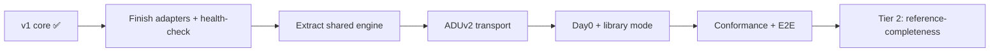
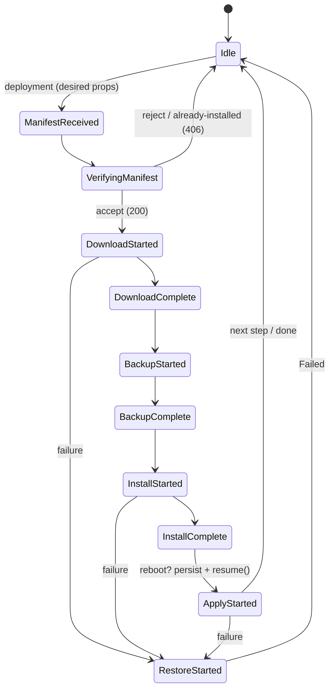
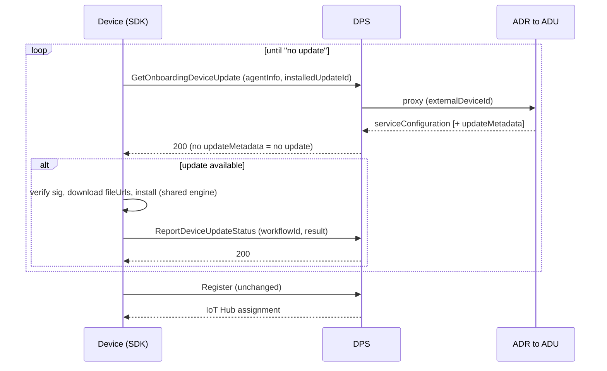
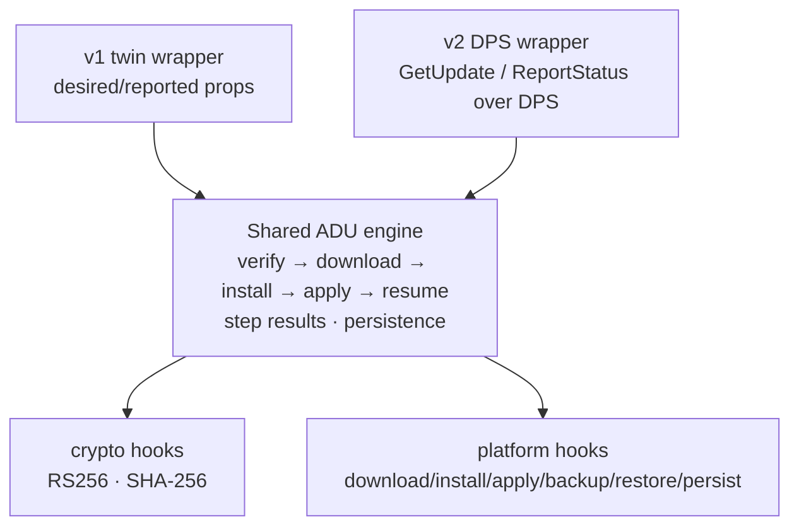

# Azure Device Update (ADU) Client — Implementation Plan, Status & Feature Manual

**One-stop doc for the ADU client in `azure-iot-sdk` (C99).** It is the source for
(a) **status** to share with other teams, (b) the **implementation / testing /
manual-action queue**, and (c) a **feature manual** with the
design detail and caveats for each capability.

> **Supersedes `adu-feature-support.md`.** This doc replaces the old
> feature-coverage matrix and folds in the ADUv2 client action plan.
> Deep internal architecture (public API surface, hook/crypto model, source
> layout, phase plan) still lives in
> [adu-client-design.md](adu-client-design.md) — cross-linked below.

## Scope and philosophy (the ADU reference implementation)

The ADU clients have a **different goal from the rest of this library**. Beyond being
usable on-device, this API is intended to become the **canonical reference implementation
of the ADU device protocol** — the source others follow to implement ADU on *non-embedded*
platforms too.

- **Completeness is mandatory.** *Every* ADU protocol feature MUST be implemented and
  supported here. There are **no "won't implement" features** — a capability is either
  ✅ done, 🟡 partial, or 🔜 coming soon.
- **Embedded usability is a hard requirement, not a filter.** A customer MUST be able to run
  these clients in a constrained/embedded application. But **"it doesn't fit embedded" is
  never a reason to omit a feature.** Where a capability is heavy or awkward for constrained
  devices, that is **noted as a caveat** and the feature is delivered as an **optional /
  opt-in module or provider** (default-off, with a portable fallback) — it is still
  implemented, so a non-embedded integrator has a complete reference.
- **Prioritization still applies:** the embedded-critical core ships first; the broader
  reference-completeness features follow (they are 🔜, not dropped).

**Two generations, one core.** Both reuse the same `az_iot_adu_client` manifest
parse/format module (from `azure-sdk-for-c`) and the same crypto core; only *how a
manifest reaches the device* and *how status is reported* differ.

| | **ADUv1** (today) | **ADUv2** (in design — [details](aduv2-spec.md)) |
|---|---|---|
| Channel | IoT Hub **device twin** (MQTT) | **DPS** device-update APIs (HTTP/MQTT), reusing the device's DPS connection |
| Model | **Push** (service writes desired props) | **Pull** (device calls DPS `GetDeviceUpdate` / `GetOnboardingDeviceUpdate`) |
| Auth | Carried by the Hub connection (SAS / X.509) | **Reuse DPS device auth** (X.509 Phase 1; SAS / TPM later) — no ADU creds |
| Device data store | Twin reported properties | **ADR → ADU**, proxied by DPS (device never calls ADU directly) |
| Coupling | Requires IoT Hub | **Provisioning-time** (update *before* `Register`); Hub fronts operational post-Ignite |
| Manifest + signing / install | v5, JWS/RS256, SHA-256, multi-step, reboot/resume | **Same** (shared core) |

**Legend.** Support: ✅ Implemented (in core) · 🟡 Partial (built but simplified /
sample-only / not factored) · 🔜 Coming soon (planned / designed, not yet built) ·
⚙️ Architectural capability (enabled by hooks, no core code). *(There is no "not planned"
state — see [Scope and philosophy](#scope-and-philosophy-the-adu-reference-implementation).)*

---

## Status at a Glance

| Category | Support | Details |
|---|:--:|---|
| Foundation | ✅ | **Connection state + error propagation** — observer registry, status/reason/source codes, lifecycle guards (Phase 0). [→](#a-foundation) |
| Foundation | ✅ | **Twin multi-subscriber + core state machine** — desired-prop subscriber registry, ADU client struct/`do_work` (Phase 1). [→](#a-foundation) |
| Core update workflow | ✅ | **Manifest v5 parsing** — delegated to `azure-sdk-for-c`; only v5 targeted. [→](#b-core-update-workflow) |
| Core update workflow | ✅ | **Agent state reporting** — internal states → protocol `0/6/255`. [→](#b-core-update-workflow) |
| Core update workflow | ✅ | **Device properties reporting** — manufacturer/model/aduVer/compat/installedUpdateId, cached at init. [→](#b-core-update-workflow) |
| Core update workflow | ✅ | **Startup + reconnect re-reporting** — first `do_work` + initial twin GET + reconnect observer. [→](#b-core-update-workflow) |
| Core update workflow | ✅ | **Accept / reject acknowledgement** — accept→download, reject/already-installed→406. [→](#b-core-update-workflow) |
| Core update workflow | ✅ | **Multi-step (composite) updates** — per-step Download→Backup→Install→Apply loop. [→](#b-core-update-workflow) |
| Core update workflow | ✅ | **Per-step result reporting** — `resultCode`/`extendedResultCode`/`stepResults`. [→](#b-core-update-workflow) |
| Core update workflow | ✅ | **Retry detection** — same `workflow.id` + newer `retryTimestamp` restarts; redelivery ignored. [→](#b-core-update-workflow) |
| Core update workflow | ✅ | **Replacement detection** — different `workflow.id` supersedes in-flight; manifest CRC fingerprint. [→](#b-core-update-workflow) |
| Core update workflow | ✅ | **Cancellation** — cooperative flag honored at phase boundaries. [→](#b-core-update-workflow) |
| Download and integrity | ✅ | **File download from manifest URLs** — resolves `fileUrls`, drives `download_fn`. [→](#c-download-and-integrity) |
| Download and integrity | ✅ | **Chunked / streaming download** — `download_fn` may return `IN_PROGRESS`. [→](#c-download-and-integrity) |
| Download and integrity | ✅ | **SHA-256 integrity (streaming, opt-in)** — runs when `read_file_fn` + incremental hooks supplied. [→](#c-download-and-integrity) |
| Download and integrity | 🔜 | **Delivery Optimization / peer cache** — offload download to a peer/CDN-cache provider behind the download seam; optional, default-off, direct-HTTPS fallback on constrained targets. [→](#c-download-and-integrity) |
| Security and trust | ✅ | **JWS manifest signature** verification (RFC 7515) — 6-stage `verify_manifest()` before any download. [→](#d-security-and-trust) |
| Security and trust | ✅ | **Two-level trust chain + `kid` resolution** — root key → SJWK → manifest → SHA-256 binding. [→](#d-security-and-trust) |
| Security and trust | ✅ | **RS256-only enforcement** — rejects any other `alg` from the wire. [→](#d-security-and-trust) |
| Security and trust | ✅ | **Root key store** (compiled-in Microsoft + runtime-loadable). [→](#d-security-and-trust) |
| Security and trust | ✅ | **Root key revocation** — `disabled` roots rejected by `kid`. [→](#d-security-and-trust) |
| Security and trust | ⚙️ | **HSM / PKCS#11 backend** — possible via `verify_rs256_fn`; no adapter ships. [→](#d-security-and-trust) |
| Security and trust | 🔜 | **Root Key Package runtime rotation** — out-of-band fetch+verify+apply, threshold continuity (deferred; firmware-delivered today). [→](#d-security-and-trust) |
| Install, apply, recovery | ✅ | **Install / Apply execution (core)** — chunkable `install_fn`/`apply_fn`, may request reboot. [→](#e-install-apply-recovery) |
| Install, apply, recovery | ✅ | **Backup / Restore (rollback)** — optional `backup_fn`; reverse-order best-effort restore. [→](#e-install-apply-recovery) |
| Install, apply, recovery | ✅ | **Partial-failure rollback (multi-step)** — mid-sequence failure rolls back applied steps. [→](#e-install-apply-recovery) |
| Install, apply, recovery | ✅ | **Reboot coordination + resume** — persist-before-reboot + `resume()`; v2 blob (CRC, step results). [→](#e-install-apply-recovery) |
| Install, apply, recovery | 🟡 | **Health-check / auto-rollback after reboot (core)** — sample-only today; promote to core. [→](#e-install-apply-recovery) |
| Platform and crypto adapters | ✅ | **`crypto_openssl` adapter** — RS256 + SHA-256, factored in `adapters/adu/`. [→](#f-platform-and-crypto-adapters) |
| Platform and crypto adapters | 🟡 | **`crypto_mbedtls` adapter** — inline in ESP32 sample; factor into `adapters/`. [→](#f-platform-and-crypto-adapters) |
| Platform and crypto adapters | 🔜 | **Linux platform adapter** — libcurl download / install cmd / file persist; factor from sample. [→](#f-platform-and-crypto-adapters) |
| Platform and crypto adapters | 🟡 | **ESP32 platform adapter** — real OTA sample exists; factor into `adapters/adu/esp32/`. [→](#f-platform-and-crypto-adapters) |
| ADUv2 transport | 🔜 | **Shared ADU engine extraction (Approach 3)** — decouple engine from twin; manifest-in / structured-report-out (transport-agnostic). [→](#g-aduv2-transport-via-dps) |
| ADUv2 transport | 🔜 | **DPS update-check binding** — `GetDeviceUpdate` / `GetOnboardingDeviceUpdate` over the device's DPS transport; send `agentInfo` + `installedUpdateId`; parse `serviceConfiguration` + `updateMetadata`. [→](#g-aduv2-transport-via-dps) |
| ADUv2 transport | 🔜 | **`ReportDeviceUpdateStatus` via DPS** — `workflowId` + install result; idempotent, durable retry. [→](#g-aduv2-transport-via-dps) |
| ADUv2 transport | 🔜 | **Reuse DPS device auth** — X.509 (P1) over the existing DPS connection; no ADU endpoint/creds/mTLS; identity headers are gateway-populated. [→](#g-aduv2-transport-via-dps) |
| ADUv2 transport | 🔜 | **Bootstrap orchestration** — update-before-`Register`: onboarding fetch → install → report → re-check loop → `Register` (advisory, never blocks). [→](#g-aduv2-transport-via-dps) |
| ADUv2 transport | 🔜 | **Root key package download** — fetch/cache from `rootKeyDownloadUrl`, verify as usual. [→](#g-aduv2-transport-via-dps) |
| ADUv2 transport | 🔜 | **ETag + api-version + agent-info resend** — `agentInfoETag`/`serviceConfigETag`; resend full `agentInfo` on `OUTDATED_`/`UNKNOWN_AGENT_INFO`; re-sync on `OUTDATED_SERVICE_CONFIG`. [→](#g-aduv2-transport-via-dps) |
| ADUv2 transport | 🔜 | **Advisory + load contracts** — drive on `error.code`; 429/`Retry-After`; 503 ⇒ proceed to `Register`; device is sole retrier. [→](#g-aduv2-transport-via-dps) |
| Day0 recovery | 🔜 | **Unauthenticated recovery transport** — plain-HTTP recovery endpoint (protocol not yet defined). [→](#h-day0-recovery) |
| Day0 recovery | 🔜 | **Account-ID binding** — validate signed manifest's ADU account ID (replay protection). [→](#h-day0-recovery) |
| Day0 recovery | 🔜 | **Compatibility-property validation** — device checks compat before applying a replayed response. [→](#h-day0-recovery) |
| Delta and handlers | 🔜 | **Static step/download-handler registry** — name→fn "filter" (field-requested); static, in-process. [→](#i-delta-and-handlers) |
| Delta and handlers | 🔜 | **Delta / differential updates** — `relatedFiles` + delta download handler; depends on registry. [→](#i-delta-and-handlers) |
| Delta and handlers | 🔜 | **Per-handler-type built-in handlers** — reference `apt`/`script`/`swupdate` handlers over the registry. [→](#i-delta-and-handlers) |
| Delta and handlers | 🔜 | **Dynamic `ContentHandler` plugin loading** — optional `dlopen`/`LoadLibrary` registrar over the static registry (non-embedded); static registry stays the portable default. [→](#i-delta-and-handlers) |
| Library / agent-core mode | ✅ | **Turnkey client** — SDK drives verify→install→report (the shipping client). [→](#j-library-and-agent-core-mode) |
| Library / agent-core mode | 🔜 | **Library mode** — hand back a verified+parsed manifest; consumer drives their own state machine. [→](#j-library-and-agent-core-mode) |
| Testing and conformance | ✅ | **Phase-1 unit tests** — cmocka state-machine coverage. [→](#k-testing-and-conformance) |
| Testing and conformance | 🟡 | **Crypto vector tests** — known-good/bad RS256 + SHA-256 vectors. [→](#k-testing-and-conformance) |
| Testing and conformance | 🔜 | **Adapter integration tests** — mock HTTP server + test manifest per adapter. [→](#k-testing-and-conformance) |
| Testing and conformance | 🔜 | **ADU conformance suite** — host-only `az_iot_adu_conformance`, all states + multi-step. [→](#k-testing-and-conformance) |
| Testing and conformance | 🔜 | **E2E vs real ADU service** — gated behind `AZ_IOT_ADU_E2E` (off the PR path). [→](#k-testing-and-conformance) |
| Advanced update model | 🔜 | **Reference steps** — `type: reference` + detached child manifest: fetch, verify, recurse. [→](#l-advanced-update-model) |
| Advanced update model | 🔜 | **Proxy / nested updates** — parent agent orchestrates leaf/component updates (gateway→leaf). [→](#l-advanced-update-model) |
| Advanced update model | 🔜 | **Component-level targeting** — component enumerator hook + `selectedComponents` matching. [→](#l-advanced-update-model) |
| Advanced update model | 🔜 | **`mimeType` handling** — parse + surface file `mimeType` to handlers. [→](#l-advanced-update-model) |
| Agent services | 🔜 | **Diagnostics / log-upload** — respond to a diagnostics request; collect + upload logs to the given SAS URL via an upload hook. [→](#m-agent-services) |
| Agent services | 🔜 | **`adu-shell` / privilege separation** — reference POSIX setuid broker so root-needing steps run out-of-process; inert on single-privilege targets. [→](#m-agent-services) |

### Priority & sequencing

Everything is committed (per [Scope and philosophy](#scope-and-philosophy-the-adu-reference-implementation)); the tiers below are about **ordering**, not scope.

- **Tier 1 — embedded-critical core (ship first):** adapters (E/F), ADUv2 transport (G), Day0 (H), library mode (J), testing (K).
- **Tier 2 — reference-completeness (coming soon):** delta + handler registry (I), per-handler-type handlers, dynamic loading, Delivery Optimization, reference steps, proxy/nested, component targeting, `mimeType`, diagnostics/log-upload, `adu-shell`, Root Key Package rotation (D).

---

# Feature Manual (design detail per category)

## A. Foundation

- **Connection state + error propagation (✅, Phase 0).** Shared observer registry
  (public + internal registration, two-pass dispatch, compile-time capacity),
  `az_iot_conn_status` / `az_iot_conn_reason` / `az_iot_error_source`, lifecycle
  guards (`DEINITIALIZING`, re-init poison guard, `AZ_IOT_ERR_DETACHED`). Detail:
  [connection-state-and-error-propagation.md](connection-state-and-error-propagation.md).
- **Twin multi-subscriber + core state machine (✅, Phase 1).** `az_iot_twin_client`
  desired-property subscriber registry; `az_iot_adu_client_t` init/destroy/`do_work`;
  device-properties cache. This is what makes the ADU client a twin subscriber today.

## B. Core update workflow

All ✅ and audited against `c/src/features/adu/`. The engine advances one phase per
`do_work()`:

- **Manifest v5 parsing** — v5 is what the service emits today; older versions can be added
  here if a deployment ever needs them (not refused on scope grounds).
- **Agent state / device properties / re-reporting** — states map to `0/6/255`;
  device props deep-copied into a client-owned cache; re-report on startup + reconnect
  and an initial twin GET catches an offline-created deployment.
- **Accept / reject** — decided in core; driven by `is_installed_fn` (already-installed
  ⇒ 406). *Caveat:* no app-level `accept_deployment_fn` veto hook yet (e.g. battery /
  critical-op deferral) — a candidate add.
- **Multi-step / per-step results** — sequential per-step loop; `step_results[]` with a
  4-bit facility + raw-code `extendedResultCode` for field debugging.
- **Retry vs. replacement vs. duplicate** — `set_active_workflow` tracks `workflow.id`
  + `retryTimestamp` + a CRC-32 fingerprint of `updateManifest`; same-id+newer-retry
  restarts, different-id supersedes, same-id+same-retry is an ignored redelivery.
- **Cancellation** — `action: Cancel` (or a replacement) sets a cooperative flag honored
  at phase boundaries; hooks poll `az_iot_adu_is_cancelled()`. Core never force-interrupts a hook.

## C. Download and integrity

- **Download / chunked** — core resolves each file's URL from the request `fileUrls`
  map and drives `download_fn`, which may return `IN_PROGRESS` to stay non-blocking.
- **SHA-256 (opt-in)** — streaming via incremental `sha256_*` hooks + `read_file_fn`,
  constant-time compare. *Caveat:* if those hooks are absent, core **skips** the hash and
  the platform owns integrity — document this clearly for integrators.
- *No mid-download resume (yet)* — a partially fetched file is re-downloaded after a reboot;
  byte-range resume is a candidate add (not refused, just unscheduled).
- **Delivery Optimization / peer cache (🔜).** Offload payload download to a
  peer-to-peer / CDN-cache provider (e.g. a Delivery-Optimization / Connected-Cache agent)
  behind the same download seam as `download_fn`, selected as an optional **download
  provider**. *Caveat:* the provider is heavy for constrained targets, so it is **default-off
  with a direct-HTTPS fallback** — but it is implemented so non-embedded integrators have the
  reference. Verification/hashing is unchanged (runs on the assembled bytes).

## D. Security and trust

- **JWS / two-level chain / RS256 / revocation (✅)** — `verify_manifest()` runs the full
  root-key → SJWK → manifest chain, enforces `alg == RS256` on both headers, binds
  SHA-256(manifest) to the deployment, and rejects `disabled` roots by `kid`. Failure ⇒
  `Failed` with facility `0x1`. This is the crown-jewel code and is already v2-ready
  (the shared engine keeps it verbatim).
- **HSM / PKCS#11 (⚙️)** — verification uses only public keys via `verify_rs256_fn`, so an
  HSM backend is a drop-in hook; none ships.
- **Root Key Package runtime rotation (🔜).** Out-of-band package (fetch,
  persistence, threshold-signature continuity) to rotate roots without a firmware update.
  *Caveat:* needs its own design pass; **not** the Day0 mechanism (Day0 keeps roots fixed).
  Today roots rotate via firmware.

## E. Install, apply, recovery

- **Install/Apply, Backup/Restore, partial rollback, reboot/resume (✅).** Persist-before-
  reboot uses a versioned, CRC-checked, little-endian blob (`ADU1`, blob **v2**) carrying
  `retryTimestamp`, a manifest CRC, and the accumulated `install_result` incl.
  `step_results[]`; `resume()` re-enters at the persisted phase boundary
  (`INSTALL_COMPLETE` → Apply). *Caveats:* the only persist point today is the
  install-requested reboot; post-reboot rollback assumes the platform retained per-step
  backups across the reboot.
- **Health-check / auto-rollback after reboot (🟡 → core).** Today only the ESP32
  A/B sample confirms/marks-valid the new image; core does not re-run `is_installed_fn` on
  resume. **To do:** add an optional post-reboot confirm step in core with an auto-rollback
  path when confirmation fails.

## F. Platform and crypto adapters

- **`crypto_openssl` (✅)** is the only fully factored adapter in `adapters/adu/`.
- **To do:** factor **`crypto_mbedtls`** (🟡 — currently inline in the ESP32 sample),
  the **Linux** adapter (🔜 — libcurl chunked/streaming-hash download, configurable
  install command, file-based persistence), and the **ESP32** adapter (🟡 —
  `esp_http_client` + `esp_ota` + NVS resume; the real-OTA sample already proves it, it
  just isn't under `adapters/adu/esp32/`). *Caveat:* install/apply/download real adapters
  currently live in **samples**, not `adapters/`.

## G. ADUv2 transport (via DPS)

**Design changed:** ADUv2 no longer has a dedicated device-facing ADU endpoint. The device calls
**three new DPS device-update APIs** — `GetOnboardingDeviceUpdate`, `GetDeviceUpdate`,
`ReportDeviceUpdateStatus` — over its **existing DPS connection and auth**; DPS is an authenticated
**pass-through** to **ADR → ADU** (the device never talks to ADU). The manifest content and the
verify → download → install → report engine are **unchanged**. Full digest:
**[aduv2-spec.md](aduv2-spec.md)**.

**Chosen architecture — Approach 3 (shared engine + thin wrappers):** extract the
protocol-free engine (verify/download/install/apply/backup/restore + resume + step
results) and let a v1 twin wrapper and a v2 **DPS-update** wrapper drive it. The engine takes a
manifest **string** and returns a **structured** report; each wrapper serializes it to its
own wire shape.

Work items (all 🔜): **engine extraction** → **DPS update-check binding** (`GetDeviceUpdate` /
`GetOnboardingDeviceUpdate`) → **`ReportDeviceUpdateStatus`** → **reuse DPS device auth**
(X.509) → **bootstrap orchestration** (update-before-`Register` + re-check loop) →
**root key package download** → **ETag/api-version + agent-info resend** → **advisory +
load contracts**.

*Key points / caveats:*
- **Reuse DPS auth & transport** (X.509 over HTTP/MQTT for Ignite) — no ADU endpoint, no mTLS to ADU,
  no ADU credentials; identity headers (`x-ms-external-device-id`, `x-ms-device-id`) are
  **gateway-populated**, so the client sets none.
- **Device selects onboarding vs regular** by which endpoint it calls (DPS doesn't infer/validate).
- **Advisory:** a failed update check MUST NOT block `Register`; the **device is the sole retrier** and
  honors `Retry-After`. `ReportDeviceUpdateStatus` is a durable write (idempotent on `workflowId`).
- **Config is inline** in the fetch response (`serviceConfiguration` + ETags) — there is **no separate
  `syncConfiguration` call** anymore.
- **Report shape** matches Gen1's structured result (`outcome`/`failureOrigin`, hex `extendedResultCodes`,
  `stepResults` map) — the engine emits structured data and each wrapper serializes it.
- **Contract is DRAFT** (api-version `2026-11-02-preview`); DPS re-syncs on ADU revs — see
  [Manual / external actions](#manual--external-actions).

## H. Day0 recovery

A device too stale to reach DPS/Hub/ADU recovers via a separate **unauthenticated,
plain-HTTP** endpoint. *No new crypto:* trust rests on the existing signed-manifest +
provisioned-root-key model, so signature verification MUST NOT be skipped on this path.
Adds a **transport + two validation checks**: (1) **account-ID binding** — validate the
signed manifest's ADU account ID against one stamped at manufacturing (replay protection);
(2) **compatibility-property validation** before applying. *Caveat:* Day0 is **out of scope of the
DPS first-time-update work** and its wire contract is **not yet defined** — provisional until protocol
owners confirm. The account-ID binding here is the same **manifest-signature-v2** binding that is
**deferred for Ignite** (base signature validation stays required).

## I. Delta and handlers

Field/customer demand exists for **delta / differential updates** (ship only the diff
between image versions and reconstruct on-device). ADU stays **content-agnostic**: the diff
is a `relatedFiles` entry processed by a swappable **download handler**, selected by name —
*not* baked into the state machine.

- **Static step/download-handler registry (🔜).** A small C99 name→function map
  ("filter") passed to the engine/sample so integrators register handlers (static,
  in-process). This is the SDK-friendly equivalent of the reference agent's extension model.
- **Delta / differential updates (🔜).** Parse `relatedFiles`, resolve the delta file,
  and route it to the registered handler (e.g. a delta reconstruct step) before install;
  fall back to full download when the prior version is absent. Depends on the registry.
- **Per-handler-type built-in handlers (🔜).** Ship reference handlers for the common
  types (`microsoft/apt`, `microsoft/script`, `microsoft/swupdate`) as optional modules that
  register into the handler registry and map the manifest `handler` string + step files to a
  concrete install action — turnkey parity with the reference agent on capable platforms.
- **Dynamic `ContentHandler` plugin loading (🔜).** An **optional** runtime registrar
  (`dlopen` / `LoadLibrary`) layered over the static registry, matching the reference agent's
  `--register-extension` model so handlers can be added without recompiling. *Caveat:* dynamic
  loading is unavailable/undesirable on many embedded targets, so it is a **build-gated
  provider** and the static registry stays the portable default — but it is implemented so the
  non-embedded reference is complete. The manifest `handler` string is always parsed and passed
  to hooks, so static in-process dispatch remains available with zero loader.

## J. Library and agent-core mode

Beyond the turnkey client, the SDK should be usable as the **vetted core** others build a
full agent on. Provide a way to **validate + parse a manifest**, then let the consumer pick:

- **Turnkey (✅):** the SDK drives the whole workflow (today's client).
- **Library mode (🔜):** hand back a **filled, already-verified** manifest struct; the
  consumer drives download/install/apply/report on their own state machine, threading and
  extension model. Reuses the same trust code so nobody re-implements JWS/RS256/SHA-256.
  Detail: [adu-client-design.md](adu-client-design.md) Part C.

## K. Testing and conformance

Per the phase plan, **L1 unit tests land with each feature** (state machine in Phase 1,
crypto vectors in Phase 2, adapter integration in Phases 3–4, persistence in Phase 5).

- **Unit tests (✅)** — cmocka state-machine coverage in `tests/unit/adu_client_test.c`.
- **Crypto vector tests (🟡)** — known-good/bad RS256 + SHA-256 vectors; prove hooks
  are primitive-only.
- **Adapter integration tests (🔜)** — mock HTTP server + test manifest per adapter.
- **Conformance suite (🔜)** — reusable host-only `az_iot_adu_conformance` over all
  protocol states + single/multi-step manifests.
- **E2E (🔜)** — against the real ADU service, gated behind `AZ_IOT_ADU_E2E` so it
  never runs on the fast PR path.

## L. Advanced update model

Full reference parity with the ADU update model. Each is 🔜 (implemented so non-embedded
integrators have the complete reference); on a single-image embedded device several are inert
at runtime, which is a **caveat, not an exclusion**.

- **Reference steps (🔜).** Parse `type: reference` steps that point to a **detached
  child manifest** (by file id): fetch it, verify its signature with the same trust chain, and
  recurse into it. Prerequisite for proxy/nested updates.
- **Proxy / nested updates (🔜).** A parent/gateway agent receives a bundle and
  orchestrates updates for **leaf** devices/components (the IoT-Edge parent→leaf topology),
  built on reference steps + component enumeration. *Caveat:* inert on a standalone device.
- **Component-level targeting (🔜).** A **component-enumerator hook** lets a device
  enumerate its updatable components; the engine matches `selectedComponents` / per-component
  compatibility and iterates the workflow per selected component.
- **`mimeType` handling (🔜).** Parse and surface the file `mimeType` to handlers for
  dispatch/validation (currently skipped by the parser).

## M. Agent services

Agent-level services from the reference agent, provided so the reference is complete; both are 🔜.

- **Diagnostics / log-upload (🔜).** Respond to a diagnostics/log-upload request:
  collect the configured logs and upload them to the service-provided (SAS) storage URL via an
  **upload hook**. Independent of the update workflow.
- **`adu-shell` / privilege separation (🔜).** A reference **POSIX setuid broker** so
  install/apply steps that need root run out-of-process while the SDK core stays unprivileged
  and calls the broker through a hook. *Caveat:* irrelevant on single-privilege RTOS targets
  (the core simply calls the hook directly); this is a POSIX reference, not a core requirement.

---

## Manual / external actions

Not code — things I (or the team) must do out-of-band:

- **Track the DPS device-update contract** (`GetDeviceUpdate` / `GetOnboardingDeviceUpdate` /
  `ReportDeviceUpdateStatus`, api-version `2026-11-02-preview`) — final op naming, per-transport payload
  caps, throttle/`Retry-After` values, and the agent-info / service-config ETag + resend semantics are
  still settling (DRAFT). See [aduv2-spec.md](aduv2-spec.md).
- **Confirm auth/transport phasing** — Ignite is **X.509 over HTTP/MQTT**; symmetric-key, TPM, and AMQP
  follow; identity headers are DPS-gateway-populated (the client sets none).
- **Stand up a dev DPS + ADR + ADU environment** and X.509 device certs to run the SDK PoC.
  *(Internal setup steps are kept in local notes, not in this repo.)*
- **`accountId`-in-signature binding (manifest-sig-v2) is deferred for Ignite** — base manifest signature
  validation stays required; plan the account binding post-Ignite.
- **Get visibility into upcoming manifest schema changes** to validate forward-compatibility.

## Assumptions

- `✅` items are **audited against `c/src/features/adu/`**, not just intent.
- ADUv2 items assume the **DPS device-update contract** (api-version `2026-11-02-preview`, **DRAFT**) stays
  stable on the points this SDK depends on; DPS re-syncs on ADU revs and open items are tracked under
  *Manual actions*. See [aduv2-spec.md](aduv2-spec.md).

## References

- [aduv2-spec.md](aduv2-spec.md) — **ADUv2 (via DPS) design summary** + diagrams (the current ADUv2 model).
- [adu-client-design.md](adu-client-design.md) — deep architecture: public API, hook/crypto
  model, state machine, source layout, phase plan, library mode (§5.3), test strategy.
- [connection-state-and-error-propagation.md](connection-state-and-error-propagation.md) —
  the Phase-0 foundation.
- [split-client.md](split-client.md) — packaging / client-split considerations.
- Superseded: `adu-feature-support.md` (folded into this doc).
- [ADUv2/DPS Specs](https://dev.azure.com/msazure/One/_git/Azure-IoT-Hub-DeviceRegistrationService?path=/specs/002-adu-first-time-update)