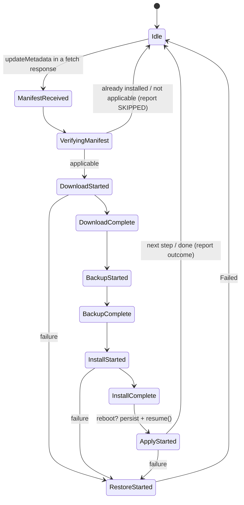
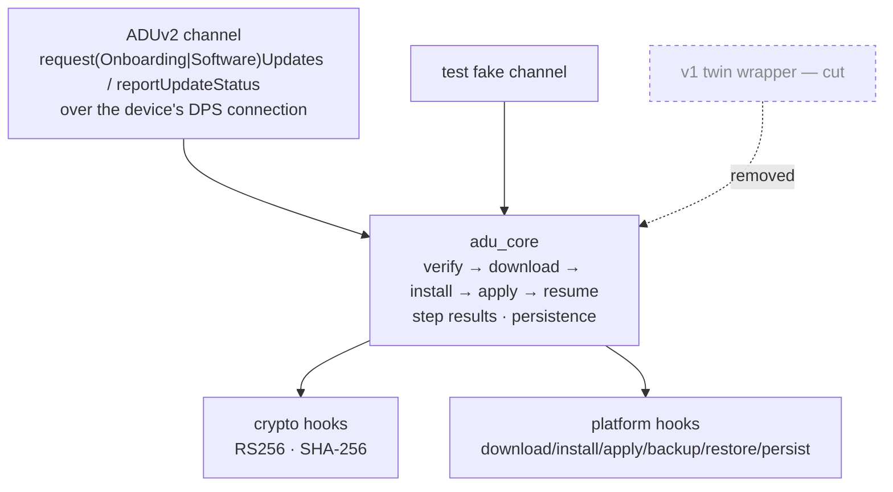

# Azure Device Update (ADU) Client — Implementation Plan, Status & Feature Manual

**One-stop doc for the ADU client in `azure-iot-sdk` (C99).** It is the source for
(a) **status** to share with other teams, (b) the **implementation / testing /
manual-action queue**, and (c) a **feature manual** with the
design detail and caveats for each capability.

> **Direction (current): ADUv2 is the implementation target. ADUv1 is cut.**
> The twin-based ADUv1 delivery channel and its public API have been **removed**,
> not deprecated-and-kept: there is no ADUv1 deployment path in the shipping SDK,
> no twin subscription for updates, and no reported-property status. Everything in
> ADUv1 that is *not* transport — manifest parsing, JWS/SJWK verification, root
> keys, SHA-256, the download/backup/install/apply state machine, reboot/resume
> persistence — is **harvested into a transport-independent `adu_core`** and reused
> verbatim by ADUv2. See [What "ADUv1 is cut" means](#what-aduv1-is-cut-means).
> Decision of record: [connection-c.md §7](connection-c.md#7-aduv2-onboarding-and-renewal-partly-implemented);
> seam: [client-separation.md §8](client-separation.md#8-device-update).

> **Supersedes `adu-feature-support.md`.** This doc replaces the old
> feature-coverage matrix and folds in the ADUv2 client action plan.
> Deep internal architecture (public API surface, hook/crypto model, source
> layout, phase plan) still lives in
> [adu-client-design.md](adu-client-design.md) — cross-linked below.

## Scope and philosophy (the ADU reference implementation)

The ADU clients have a **different goal from the rest of this library**. Beyond being
usable on-device, this API is intended to become the **canonical reference implementation
of the ADU device protocol** — the source others follow to implement ADU on *non-embedded*
platforms too.

- **Completeness is mandatory.** *Every* ADU protocol feature MUST be implemented and
  supported here. There are **no "won't implement" features** — a capability is either
  ✅ done, 🟡 partial, or 🔜 coming soon.
- **Embedded usability is a hard requirement, not a filter.** A customer MUST be able to run
  these clients in a constrained/embedded application. But **"it doesn't fit embedded" is
  never a reason to omit a feature.** Where a capability is heavy or awkward for constrained
  devices, that is **noted as a caveat** and the feature is delivered as an **optional /
  opt-in module or provider** (default-off, with a portable fallback) — it is still
  implemented, so a non-embedded integrator has a complete reference.
- **Prioritization still applies:** the embedded-critical core ships first; the broader
  reference-completeness features follow (they are 🔜, not dropped).
- **Completeness is scoped to ADUv2.** "Every ADU protocol feature" means every feature of the
  **ADUv2** device protocol. ADUv1's twin delivery is not a feature gap — it is a **removed
  channel** (below).

## What "ADUv1 is cut" means

ADUv1 delivered updates over the IoT Hub **device twin** (service pushes desired properties,
device reports status back through reported properties). That channel is **removed**. ADUv2 is a
**device-initiated pull** protocol over an updating operation on a gateway the device already
talks to (DPS for Ignite '26, IoT Hub for the operational path afterwards), which proxies to
ADR → ADU. The device never talks to ADU directly and holds no ADU-specific credential.

| | **ADUv1 — cut** | **ADUv2 — the target** ([spec](aduv2-spec.md)) |
|---|---|---|
| Channel | IoT Hub **device twin** (MQTT) | **Updating operations on the DPS gateway** (HTTP/MQTT), reusing the device's existing connection |
| Model | **Push** (service writes desired props) | **Pull** (device calls `requestSoftwareUpdates` / `requestOnboardingUpdates`) |
| Auth | Carried by the Hub connection (SAS / X.509) | **Reuse DPS device auth** (X.509 Phase 1; SAS / TPM later) — no ADU creds |
| Device data store | Twin reported properties | **ADR → ADU**, proxied by the gateway |
| Coupling | Requires IoT Hub | **Provisioning-time** (update *before* `Register`); Hub fronts operational post-Ignite |
| Manifest + signing / install | v5, JWS/RS256, SHA-256, multi-step, reboot/resume | **Same code**, harvested into `adu_core` |

**Removed** (public API break, no deprecation window):

- `az_iot_adu_client_initialize()`'s mandatory `az_iot_twin_client*` and the five twin call sites.
- Desired-property deployment parsing/dispatch, twin accept/reject acknowledgement (200/406),
  reported-property agent state (`0/6/255`) and device-properties reporting, the initial twin GET,
  and twin re-subscription on reconnect for ADU.
- The ADUv1-shaped samples and the twin-driven unit tests that assert those wire shapes.

**Kept** (moves into `adu_core`, transport-independent):

- Manifest v5 parse/format (delegated to `azure-sdk-for-c`), JWS/SJWK two-level trust chain,
  RS256-only enforcement, root-key store + revocation, SHA-256 payload integrity.
- The download → backup → install → apply → restore state machine, multi-step sequencing, per-step
  results, cancellation, retry/replacement/duplicate detection, reboot/resume persistence.
- The platform + crypto hook model and the existing adapters.

**Re-shaped, not deleted:** the concepts that had a twin-specific expression get a
transport-independent one — `workflow.id` + `retryTimestamp` become `workflowId` correlation with
idempotent reporting; accept/reject collapses into "install or report skipped"; agent state
becomes the structured `installResult` carried by `reportUpdateStatus`; device
properties become `agentInfo` (`agentSdkVersion`, `agentProfile`, 1–5 `compatibilityProperties`).

Delivery is via an **`az_iot_adu_channel`** vtable so `adu_core` never names a transport; the
ADUv2/DPS channel is the only implementation that will ship (plus an in-test fake).

**Legend.** Support: ✅ Implemented (in core) · 🟡 Partial (built but simplified /
sample-only / not factored) · 🔜 Coming soon (planned / designed, not yet built) ·
⚙️ Architectural capability (enabled by hooks, no core code) · ❌ Cut (ADUv1-only, removed).
*(Outside the cut channel there is no "not planned" state — see
[Scope and philosophy](#scope-and-philosophy-the-adu-reference-implementation).)*

> ✅ on an engine row means **the code exists and was audited**; under the cut it also means
> **it must survive the move into `adu_core` unchanged**. It does *not* mean the feature is
> reachable end-to-end today, because the only channel that will ship (ADUv2) is not built yet.

---

## Status at a Glance

| Category | Support | Details |
|---|:--:|---|
| Foundation | ✅ | **Connection state + error propagation** — observer registry, status/reason/source codes, lifecycle guards (Phase 0). [→](#a-foundation) |
| Foundation | ❌ | **ADU as a twin desired-property subscriber** — ADUv1-only wiring; removed with the twin channel. The twin client's subscriber registry itself stays (it serves the twin feature). [→](#a-foundation) |
| Foundation | ✅ | **`adu_core` extraction + `az_iot_adu_channel` vtable** — engine takes a manifest string, returns a structured report; delivery/reporting behind the vtable. Prerequisite for every ADUv2 row. [→](#g-aduv2-transport-via-the-dps-gateway) |
| Core update workflow | ✅ | **Manifest v5 parsing** — delegated to `azure-sdk-for-c`; only v5 targeted. [→](#b-core-update-workflow) |
| Core update workflow | ❌→✅ | **Agent state reporting** — twin `0/6/255` reported properties are cut; re-expressed as the structured `installResult` on `reportUpdateStatus`. [→](#b-core-update-workflow) |
| Core update workflow | ❌→✅ | **Device properties reporting** — twin `deviceProperties` cut; re-expressed as `agentInfo` (`agentSdkVersion`, `agentProfile`, compat KVPs) on each fetch. [→](#b-core-update-workflow) |
| Core update workflow | ❌ | **Startup + reconnect re-reporting / initial twin GET** — no subscription and no unsolicited offer in ADUv2; the device polls instead. [→](#b-core-update-workflow) |
| Core update workflow | ❌→✅ | **Accept / reject acknowledgement** — twin 200/406 ack is cut; already-installed becomes a `SKIPPED` outcome in the report. [→](#b-core-update-workflow) |
| Core update workflow | ✅ | **Multi-step (composite) updates** — per-step Download→Backup→Install→Apply loop. [→](#b-core-update-workflow) |
| Core update workflow | ✅ | **Per-step result reporting** — `resultCode`/`extendedResultCode`/`stepResults`, each entry carrying its own `outcome` and `failureOrigin`. [→](#b-core-update-workflow) |
| Core update workflow | ✅ | **Replacement / duplicate detection** — keyed on `workflowId` alone, the sole correlation key in ADUv2; `retryTimestamp` is gone. [→](#b-core-update-workflow) |
| Core update workflow | ✅ | **Application event notification** — `az_iot_adu_client_add_observer()` / `remove_observer()`, dispatching `WORKFLOW_STATE_CHANGED` and `OPERATION_ABANDONED`. Replaced polling `get_state()` as the way an application follows a workflow, and is the only way it learns an operation was given up on. [→](#b-core-update-workflow) |
| Core update workflow | ✅ | **Bounded requests** — `request_update()` / `request_onboarding_update()` take a `timeout_ms`; on expiry the request is abandoned and reported as `OPERATION_ABANDONED` with `AZ_IOT_ERR_TIMEOUT`. `AZ_IOT_ADU_REQUEST_NO_TIMEOUT` keeps the old unbounded behaviour. [→](#b-core-update-workflow) |
| Core update workflow | 🟡 | **Cancellation** — cooperative flag still honored at phase boundaries, but ADUv2 has no input that sets it; a new `workflowId` replaces instead. [→](#b-core-update-workflow) |
| Download and integrity | ✅ | **File download from manifest URLs** — resolves `fileUrls`, drives `download_fn`. [→](#c-download-and-integrity) |
| Download and integrity | ✅ | **Chunked / streaming download** — `download_fn` may return `IN_PROGRESS`. [→](#c-download-and-integrity) |
| Download and integrity | ✅ | **SHA-256 integrity (streaming, opt-in)** — runs when `read_file_fn` + incremental hooks supplied. [→](#c-download-and-integrity) |
| Download and integrity | 🔜 | **Delivery Optimization / peer cache** — offload download to a peer/CDN-cache provider behind the download seam; optional, default-off, direct-HTTPS fallback on constrained targets. [→](#c-download-and-integrity) |
| Security and trust | ✅ | **JWS manifest signature** verification (RFC 7515) — 6-stage `verify_manifest()` before any download. [→](#d-security-and-trust) |
| Security and trust | ✅ | **Two-level trust chain + `kid` resolution** — root key → SJWK → manifest → SHA-256 binding. [→](#d-security-and-trust) |
| Security and trust | ✅ | **RS256-only enforcement** — rejects any other `alg` from the wire. [→](#d-security-and-trust) |
| Security and trust | ✅ | **Root key store** (compiled-in Microsoft + runtime-loadable). [→](#d-security-and-trust) |
| Security and trust | ✅ | **Root key revocation** — `disabled` roots rejected by `kid`. [→](#d-security-and-trust) |
| Security and trust | ⚙️ | **HSM / PKCS#11 backend** — possible via `verify_rs256_fn`; no adapter ships. [→](#d-security-and-trust) |
| Security and trust | 🔜 | **Root Key Package runtime rotation** — fetch+verify+apply with threshold continuity; the package URL now arrives as `serviceConfiguration.rootKeyDownloadUrl` (not a twin property). [→](#d-security-and-trust) |
| Install, apply, recovery | ✅ | **Install / Apply execution (core)** — chunkable `install_fn`/`apply_fn`, may request reboot. [→](#e-install-apply-recovery) |
| Install, apply, recovery | ✅ | **Backup / Restore (rollback)** — optional `backup_fn`; reverse-order best-effort restore. [→](#e-install-apply-recovery) |
| Install, apply, recovery | ✅ | **Partial-failure rollback (multi-step)** — mid-sequence failure rolls back applied steps. [→](#e-install-apply-recovery) |
| Install, apply, recovery | ✅→🔜 | **Reboot coordination + resume** — persist-before-reboot + `resume()`; blob must additionally carry the unsent ADUv2 report + ETags. [→](#e-install-apply-recovery) |
| Install, apply, recovery | 🟡 | **Health-check / auto-rollback after reboot (core)** — sample-only today; promote to core. [→](#e-install-apply-recovery) |
| Platform and crypto adapters | ✅ | **`crypto_openssl` adapter** — RS256 + SHA-256, factored in `adapters/adu/`. [→](#f-platform-and-crypto-adapters) |
| Platform and crypto adapters | ✅ | **`crypto_mbedtls` adapter** — factored into `adapters/adu/crypto_mbedtls/`. [→](#f-platform-and-crypto-adapters) |
| Platform and crypto adapters | 🟡 | **ESP32 sample port** — `samples/adu/esp32` passes the connection client to `az_iot_adu_client_initialize()` and asks for an onboarding update; not built or run with ESP-IDF since the port, and outside the CMake build, so nothing catches a regression. [→](#f-platform-and-crypto-adapters) |
| Platform and crypto adapters | 🔜 | **Linux platform adapter** — libcurl download / install cmd / file persist; factor from sample. [→](#f-platform-and-crypto-adapters) |
| Platform and crypto adapters | ✅ | **ESP32 platform adapter** — factored into `adapters/adu/esp32/` (`esp_http_client` + `esp_ota` + NVS resume). [→](#f-platform-and-crypto-adapters) |
| ADUv2 transport | ❌ | **Twin (ADUv1) delivery + reporting** — the twin channel is removed, not kept behind a flag. [→](#what-aduv1-is-cut-means) |
| ADUv2 transport | ✅ | **DPS update-check binding** — `requestSoftwareUpdates` / `requestOnboardingUpdates` over the device's DPS transport; both send `agentInfo`, and only the regular route sends `installedUpdateId` (onboarding omits it by contract: a day-0 device has nothing installed); parse `serviceConfiguration` + `updateMetadata`. [→](#g-aduv2-transport-via-the-dps-gateway) |
| ADUv2 transport | 🟡 | **`reportUpdateStatus`** — `workflowId` + install result, idempotent, retried while the client lives. NOT durable across a reboot: the persistence blob is still v2 and does not carry an unsent report, so a device that reboots mid-install loses it. [→](#g-aduv2-transport-via-the-dps-gateway) |
| ADUv2 transport | ✅ | **Reuse DPS device auth** — X.509 (P1) over the existing DPS connection; no ADU endpoint/creds/mTLS; identity headers are gateway-populated. [→](#g-aduv2-transport-via-the-dps-gateway) |
| ADUv2 transport | 🟡 | **Bootstrap orchestration** — the pre-registration hold, the onboarding fetch and the report are in place, the hold is advisory (registration proceeds when it expires), and a queued request is bounded by `timeout_ms` so one that can never be served is abandoned rather than retried forever. The re-check **loop** is still absent: the engine issues one fetch per request. [→](#g-aduv2-transport-via-the-dps-gateway) |
| ADUv2 transport | 🟡 | **Operational polling loop** — an on-demand provisioning session after registration exists, and the application picks the route with `az_iot_adu_client_request_update()`. No cadence is owned by the SDK: the application decides when to poll. [→](#g-aduv2-transport-via-the-dps-gateway) |
| ADUv2 transport | 🔜 | **Root key package download** — fetch/cache from `rootKeyDownloadUrl`, verify as usual. [→](#g-aduv2-transport-via-the-dps-gateway) |
| ADUv2 transport | ✅ | **Channel observes connection state** — the DPS channel registers as a scoped state observer instead of polling the connection client, and stops asking for a session once EITHER scope has settled in FAULTED rather than retrying into it. [→](#g-aduv2-transport-via-the-dps-gateway) |
| ADUv2 transport | ✅ | **ETag + api-version + agent-info resend** — `agentInfoEtag`/`serviceConfigEtag`; resend full `agentInfo` on `OUTDATED_`/`UNKNOWN_AGENT_INFO`; re-sync on `OUTDATED_SERVICE_CONFIG`. [→](#g-aduv2-transport-via-the-dps-gateway) |
| ADUv2 transport | ✅ | **Advisory + load contracts** — the error classifier drives on the code, the device is the sole retrier, and `Retry-After` is honoured: it arrives as a response-topic query parameter, and the channel defers every publish until the delay elapses. [→](#g-aduv2-transport-via-the-dps-gateway) |
| Day0 recovery | 🔜 | **Unauthenticated recovery transport** — plain-HTTP recovery endpoint (protocol not yet defined). [→](#h-day0-recovery) |
| Day0 recovery | 🔜 | **Account-ID binding** — validate signed manifest's ADU account ID (replay protection). [→](#h-day0-recovery) |
| Day0 recovery | 🔜 | **Compatibility-property validation** — device checks compat before applying a replayed response. [→](#h-day0-recovery) |
| Delta and handlers | 🔜 | **Static step/download-handler registry** — name→fn "filter" (field-requested); static, in-process. [→](#i-delta-and-handlers) |
| Delta and handlers | 🔜 | **Delta / differential updates** — `relatedFiles` + delta download handler; depends on registry. [→](#i-delta-and-handlers) |
| Delta and handlers | 🔜 | **Per-handler-type built-in handlers** — reference `apt`/`script`/`swupdate` handlers over the registry. [→](#i-delta-and-handlers) |
| Delta and handlers | 🔜 | **Dynamic `ContentHandler` plugin loading** — optional `dlopen`/`LoadLibrary` registrar over the static registry (non-embedded); static registry stays the portable default. [→](#i-delta-and-handlers) |
| Library / agent-core mode | ✅ | **Turnkey client** — SDK drives verify→install→report (the shipping client). [→](#j-library-and-agent-core-mode) |
| Library / agent-core mode | 🔜 | **Library mode** — hand back a verified+parsed manifest; consumer drives their own state machine. [→](#j-library-and-agent-core-mode) |
| Testing and conformance | ✅ | **Phase-1 unit tests** — cmocka state-machine coverage. [→](#k-testing-and-conformance) |
| Testing and conformance | 🟡 | **Crypto vector tests** — known-good/bad RS256 + SHA-256 vectors. [→](#k-testing-and-conformance) |
| Testing and conformance | 🔜 | **Adapter integration tests** — mock HTTP server + test manifest per adapter. [→](#k-testing-and-conformance) |
| Testing and conformance | 🔜 | **ADU conformance suite** — host-only `az_iot_adu_conformance`, all states + multi-step. [→](#k-testing-and-conformance) |
| Testing and conformance | ✅→🔜 | **E2E vs real ADU service** — five twin-driven scenarios exist in a slow-lane workflow (off the PR path); they retire with the cut and need ADUv2 equivalents. [→](#k-testing-and-conformance) |
| Advanced update model | 🔜 | **Reference steps** — `type: reference` + detached child manifest: fetch, verify, recurse. [→](#l-advanced-update-model) |
| Advanced update model | 🔜 | **Proxy / nested updates** — parent agent orchestrates leaf/component updates (gateway→leaf). [→](#l-advanced-update-model) |
| Advanced update model | 🔜 | **Component-level targeting** — component enumerator hook + `selectedComponents` matching. [→](#l-advanced-update-model) |
| Advanced update model | 🔜 | **`mimeType` handling** — parse + surface file `mimeType` to handlers. [→](#l-advanced-update-model) |
| Agent services | 🔜 | **Diagnostics / log-upload** — respond to a diagnostics request; collect + upload logs to the given SAS URL via an upload hook. [→](#m-agent-services) |
| Agent services | 🔜 | **`adu-shell` / privilege separation** — reference POSIX setuid broker so root-needing steps run out-of-process; inert on single-privilege targets. [→](#m-agent-services) |

### Priority & sequencing

Everything is committed (per [Scope and philosophy](#scope-and-philosophy-the-adu-reference-implementation)); the tiers below are about **ordering**, not scope.

- **Tier 0 — the cut (blocks everything):** extract `adu_core` + the `az_iot_adu_channel` vtable and
  delete the twin channel, its public API and its wire-shape tests.
- **Tier 1 — embedded-critical core (ship first):** ADUv2 transport (G), adapters (E/F), Day0 (H),
  library mode (J), testing (K).
- **Tier 2 — reference-completeness (coming soon):** delta + handler registry (I), per-handler-type handlers, dynamic loading, Delivery Optimization, reference steps, proxy/nested, component targeting, `mimeType`, diagnostics/log-upload, `adu-shell`, Root Key Package rotation (D).

```mermaid
flowchart LR
    A["Engine code from v1 ✅<br/>(audited, transport-welded)"] --> B["Extract adu_core<br/>+ az_iot_adu_channel"]
    B --> C["Delete the twin channel<br/>(ADUv1 cut)"]
    C --> D["ADUv2 DPS channel<br/>fetch · report · ETags · auth"]
    D --> E["Bootstrap + operational orchestration"]
    E --> F["Adapters + health-check"]
    F --> G["Day0 + library mode"]
    G --> H["Conformance + E2E"]
    H --> I["Tier 2: reference-completeness"]
```



> **Deleting the twin channel is not a rider on the ADUv2 work.** `adu_core` must be extractable
> and testable against a fake channel *before* the DPS channel exists, so Tier 0 lands on its own
> and the ADU unit suite keeps passing across the break.

---

# Feature Manual (design detail per category)

## A. Foundation

- **Connection state + error propagation (✅, Phase 0).** Shared observer registry
  (public + internal registration, two-pass dispatch, compile-time capacity),
  rich `az_iot_connection_state_event` fields (`az_iot_conn_reason` /
  `az_iot_error_source`), lifecycle guards (`DEINITIALIZING`, re-init poison
  guard, `AZ_IOT_ERR_DETACHED`). Detail:
  [connection-state-and-error-propagation.md](connection-state-and-error-propagation.md).
- **Twin multi-subscriber (Phase 1).** The `az_iot_twin_client` desired-property subscriber
  registry stays — it is a twin-client feature with other consumers. **ADU stops being one of
  its subscribers** when the twin channel is cut. What survives on the ADU side is the client
  struct / `do_work()` pump and the device-properties cache, which move into `adu_core` (the
  cache being re-shaped as `agentInfo`).

## B. Core update workflow

All ✅ and audited against `c/src/features/adu/`. The engine advances one phase per
`do_work()`. The phases are transport-independent and survive the cut; only how a manifest
**arrives** and how a result **leaves** changes (twin properties → channel vtable).



- **Manifest v5 parsing** — v5 is what the service emits today; older versions can be added
  here if a deployment ever needs them (not refused on scope grounds).
- **Agent state / device properties / re-reporting (❌→✅ re-shaped)** — the twin `0/6/255`
  agent state, the `deviceProperties` object, the startup/reconnect re-report and the initial
  twin GET are all **cut**. ADUv2 has no subscription and no unsolicited offer: the device sends
  `agentInfo` on every fetch — plus `installedUpdateId` on the regular route only, since an
  onboarding device has nothing installed — and a structured `installResult` on
  `reportUpdateStatus`. The device-properties cache survives as the `agentInfo` cache.
- **Accept / reject (❌→🔜 re-shaped)** — the twin 200/406 acknowledgement is cut. The
  `is_installed_fn` decision stays in `adu_core`; an already-installed or non-applicable update
  becomes a `SKIPPED` outcome in the report rather than a wire-level rejection. *Caveat:* still
  no app-level `accept_deployment_fn` veto hook (e.g. battery / critical-op deferral) — a
  candidate add, now more useful because the device controls the poll.
- **Multi-step / per-step results** — sequential per-step loop; `step_results[]` with a
  4-bit facility + raw-code `extendedResultCode` for field debugging. The engine exposes the
  accumulated entries through `az_iot_adu_report.step_results` and `step_results_count`, in
  manifest-step order, including on completion or failure. These are borrowed views valid only
  during the internal channel's report call; a retaining channel must copy the entries and
  their `result_details` span contents. Existing per-step codes are preserved without conversion.
  ADUv2 serialization ships: `stepResults` is written as a map keyed by step, each entry
  carrying `outcome`, `failureOrigin`, `resultCode` and a comma-separated hex
  `extendedResultCodes`, plus `resultDetails` when the step supplied any.
- **Replacement vs. duplicate (✅)** — keyed on **`workflowId` alone**, as ADUv2 defines it: a
  new id restarts the workflow, the same id is ignored whatever the manifest bytes. The
  `retryTimestamp` input is gone.
- **Cancellation (🟡)** — the cooperative flag and `az_iot_adu_is_cancelled()` stay, but no
  ADUv2 input sets the flag and no local cancel API exists yet; a superseding `workflowId`
  restarts the workflow instead. Core never force-interrupts a hook.
- **Application notification (✅)** — `az_iot_adu_client_add_observer()` /
  `remove_observer()`, matching the connection client's registry. Two event kinds:
  `WORKFLOW_STATE_CHANGED` carries the `az_iot_adu_state`, replacing a polled
  `get_state()`; `OPERATION_ABANDONED` carries the operation and the reason, and is the
  only way an application learns the client has stopped trying. Both fetch entry points
  take a `timeout_ms` that bounds the wait, so a request that can never be served ends in
  `OPERATION_ABANDONED` with `AZ_IOT_ERR_TIMEOUT` instead of being retried for the life of
  the client.

## C. Download and integrity

- **Download / chunked** — core resolves each file's URL from the request `fileUrls`
  map and drives `download_fn`, which may return `IN_PROGRESS` to stay non-blocking.
- **SHA-256 (opt-in)** — streaming via incremental `sha256_*` hooks + `read_file_fn`,
  constant-time compare. *Caveat:* if those hooks are absent, core **skips** the hash and
  the platform owns integrity — document this clearly for integrators.
- *No mid-download resume (yet)* — a partially fetched file is re-downloaded after a reboot;
  byte-range resume is a candidate add (not refused, just unscheduled).
- **Delivery Optimization / peer cache (🔜).** Offload payload download to a
  peer-to-peer / CDN-cache provider (e.g. a Delivery-Optimization / Connected-Cache agent)
  behind the same download seam as `download_fn`, selected as an optional **download
  provider**. *Caveat:* the provider is heavy for constrained targets, so it is **default-off
  with a direct-HTTPS fallback** — but it is implemented so non-embedded integrators have the
  reference. Verification/hashing is unchanged (runs on the assembled bytes).

## D. Security and trust

- **JWS / two-level chain / RS256 / revocation (✅)** — `verify_manifest()` runs the full
  root-key → SJWK → manifest chain, enforces `alg == RS256` on both headers, binds
  SHA-256(manifest) to the deployment, and rejects `disabled` roots by `kid`. Failure ⇒
  `Failed` with facility `0x1`. This is the crown-jewel code, it is **transport-free already**,
  and the cut must move it into `adu_core` **verbatim** — no rewrite, no behavioural change.
- **HSM / PKCS#11 (⚙️)** — verification uses only public keys via `verify_rs256_fn`, so an
  HSM backend is a drop-in hook; none ships.
- **Root Key Package runtime rotation (🔜).** Fetch, persist and apply a root-key package with
  N-of-M threshold-signature continuity, to rotate roots without a firmware update. Under
  ADUv2 the package URL is **`serviceConfiguration.rootKeyDownloadUrl`**, returned inline by the
  same fetch that carries the update — the ADUv1 unsigned twin property `rootKeyPackageUrl`
  is cut. Keys from the package are **never** trusted directly; only the compiled-in anchors
  vouch for them. *Caveat:* needs its own design pass; **not** the Day0 mechanism (Day0 keeps
  roots fixed). Today roots rotate via firmware. Work items: [TODO.md](../TODO.md).
- **Account scoping (🔜, deferred).** `accountId`-in-signature binding (manifest-signature-v2)
  is deferred past Ignite '26 — the device verifies provenance-from-ADU but not account scoping.
  Base signature validation stays **required** on every path.

## E. Install, apply, recovery

- **Install/Apply, Backup/Restore, partial rollback, reboot/resume (✅).** Persist-before-
  reboot uses a versioned, CRC-checked, little-endian blob (`ADU1`, blob **v2**) carrying
  `retryTimestamp` and a manifest CRC (kept for format compatibility, unused for
  duplicate detection), and the accumulated `install_result` incl.
  `step_results[]`; `resume()` re-enters at the persisted phase boundary
  (`INSTALL_COMPLETE` → Apply). *Caveats:* the only persist point today is the
  install-requested reboot; post-reboot rollback assumes the platform retained per-step
  backups across the reboot.
- **Persistence must grow for ADUv2 (🔜).** ADUv2 makes reporting a **durable write**, so the
  blob gains a **blob v3**: the unsent `reportUpdateStatus` payload (keyed by
  `workflowId`), `installedUpdateId`, and the `agentInfoEtag` / `serviceConfigEtag` pair, so a
  device that reboots mid-install still reports its result afterwards and does not resend a full
  `agentInfo` needlessly. `retryTimestamp` leaves the blob with the twin channel.
- **Health-check / auto-rollback after reboot (🟡 → core).** Today only the ESP32
  A/B sample confirms/marks-valid the new image; core does not re-run `is_installed_fn` on
  resume. **To do:** add an optional post-reboot confirm step in core with an auto-rollback
  path when confirmation fails.

## F. Platform and crypto adapters

- **`crypto_openssl` (✅)**, **`crypto_mbedtls` (✅)** and the **ESP32 platform adapter (✅)**
  are factored under `adapters/adu/`. Crypto adapters are transport-free and were
  **unaffected by the cut**.
- **To do:** the **Linux** adapter (🔜 — libcurl chunked/streaming-hash download, configurable
  install command, file-based persistence). *Caveat:* the PC sample's download/install hooks are
  still **simulated** and live in the sample, so there is no real Linux install/apply reference
  under `adapters/`.
- **The PC sample is current** (`samples/adu/pc`): it provisions through DPS, asks for an
  onboarding update explicitly, and follows the workflow through the ADU observer rather
  than polling. It runs on a device with no IoT Hub via `dps.provision_only`.
- **The ESP32 sample is ported but unverified (🟡).** `samples/adu/esp32` passes the connection
  client to `az_iot_adu_client_initialize()` and asks for an onboarding update, like the PC
  sample. It is not part of the CMake build (it needs the ESP-IDF toolchain) and has not been
  built or run on a device since the port. Its platform hooks live in `adapters/adu/esp32/`.

## G. ADUv2 transport (via the DPS gateway)

**This is the only ADU channel the SDK will ship.** ADUv2 has no dedicated device-facing ADU
endpoint. The device calls **three device-update operations on DPS** —
`requestOnboardingUpdates`, `requestSoftwareUpdates`, `reportUpdateStatus` (spec working names:
`GetOnboardingDeviceUpdate`, `GetDeviceUpdate`, `ReportDeviceUpdateStatus`) — under its own
registration on the **existing DPS endpoint, reusing its DPS credential**; DPS is an authenticated
**pass-through** to **ADR → ADU** (the device never talks to ADU). The manifest content and the
verify → download → install → report engine are **unchanged** from ADUv1. Full digest, including
the exact URL shape and which parts are measured vs. drafted:
**[aduv2-spec.md](aduv2-spec.md)**; lifecycle placement:
[connection-c.md §7](connection-c.md#7-aduv2-onboarding-and-renewal-partly-implemented).

```mermaid
sequenceDiagram
    participant Dev as Device (SDK)
    participant DPS as DPS
    participant ADU as ADR to ADU
    %% Planned. Today the application asks for each check; the SDK runs no loop.
    loop planned: until "no update"
      Dev->>DPS: requestOnboardingUpdates (agentInfo; no installedUpdateId)
      DPS->>ADU: proxy (externalDeviceId)
      ADU-->>DPS: serviceConfiguration [+ updateMetadata]
      DPS-->>Dev: 200 (no updateMetadata = no update)
      alt update available
        Dev->>Dev: verify sig, download fileUrls, install (shared engine)
        Dev->>DPS: reportUpdateStatus (workflowId, result)
        DPS-->>Dev: 200
      end
    end
    Dev->>DPS: Register (unchanged)
    DPS-->>Dev: IoT Hub assignment
```

**Chosen architecture — `adu_core` + one channel:** extract the protocol-free engine
(verify/download/install/apply/backup/restore + resume + step results) and drive it through an
`az_iot_adu_channel` vtable. The engine takes a manifest **string** and returns a **structured**
report; the channel serializes it to the wire. The **twin wrapper is not built — it is deleted**;
the vtable exists so `adu_core` never names a transport (and so the engine is testable against a
fake channel), not to keep two generations alive.



Work items, in the order they were taken. Shipped (✅): **`adu_core` + channel extraction and
twin-channel deletion** → **DPS update-check binding** (`GetDeviceUpdate` /
`GetOnboardingDeviceUpdate`) → **reuse DPS device auth** (X.509) → **ETag/api-version +
agent-info resend** → **advisory + load contracts** → **channel observes scoped connection
state**. Partial (🟡): **`ReportDeviceUpdateStatus`** (not durable across a reboot),
**bootstrap orchestration** (requests are bounded, but there is no re-check loop),
**operational polling loop** (no SDK-owned cadence). Not started (🔜): **root key package
download**. The per-row detail is in the matrix above.

*Key points / caveats:*
- **Reuse DPS auth & transport** (X.509 over HTTP/MQTT for Ignite) — no ADU endpoint, no mTLS to ADU,
  no ADU credentials; identity headers (`x-ms-external-device-id`, `x-ms-device-id`) are
  **gateway-populated**, so the client sets none.
- **Device selects onboarding vs regular** by which endpoint it calls (DPS doesn't infer/validate).
- **Advisory:** a failed update check MUST NOT block `Register`, and the **device is the sole
  retrier**. `Retry-After` arrives as a response-topic query parameter (measured, e.g.
  `&retry-after=3`) — MQTT carries no headers — and the channel defers every publish until it
  elapses. `ReportDeviceUpdateStatus` is idempotent on `workflowId`, but the SDK's retry is
  in-memory only — see the persistence note above.
- **The agent owns the cadence.** There is no subscription and no offer to lose, so a reconnect
  replays no ADU state — that is precisely what the twin channel required and what the cut removes.
- **The gateway is a channel parameter, not a constant.** DPS fronts bootstrap **and** the interim
  operational path for Ignite '26; the operational path moves to IoT Hub afterwards with **no
  device-contract change**. The channel must not hard-code DPS in its request shapes.
- **Config is inline** in the fetch response (`serviceConfiguration` + ETags) — there is **no separate
  `syncConfiguration` call** anymore.
- **Report shape** matches Gen1's structured result (`outcome`/`failureOrigin`, hex `extendedResultCodes`,
  `stepResults` map) — the engine emits structured data and the channel serializes it.
- **Contract is DRAFT** (api-version `2026-11-02-preview`); DPS re-syncs on ADU revs — see
  [Manual / external actions](#manual--external-actions).

## H. Day0 recovery

A device too stale to reach DPS/Hub/ADU recovers via a separate **unauthenticated,
plain-HTTP** endpoint. *No new crypto:* trust rests on the existing signed-manifest +
provisioned-root-key model, so signature verification MUST NOT be skipped on this path.
Adds a **transport + two validation checks**: (1) **account-ID binding** — validate the
signed manifest's ADU account ID against one stamped at manufacturing (replay protection);
(2) **compatibility-property validation** before applying. *Caveat:* Day0 is **out of scope of the
DPS first-time-update work** and its wire contract is **not yet defined** — provisional until protocol
owners confirm. The account-ID binding here is the same **manifest-signature-v2** binding that is
**deferred for Ignite** (base signature validation stays required).

## I. Delta and handlers

Field/customer demand exists for **delta / differential updates** (ship only the diff
between image versions and reconstruct on-device). ADU stays **content-agnostic**: the diff
is a `relatedFiles` entry processed by a swappable **download handler**, selected by name —
*not* baked into the state machine.

- **Static step/download-handler registry (🔜).** A small C99 name→function map
  ("filter") passed to the engine/sample so integrators register handlers (static,
  in-process). This is the SDK-friendly equivalent of the reference agent's extension model.
- **Delta / differential updates (🔜).** Parse `relatedFiles`, resolve the delta file,
  and route it to the registered handler (e.g. a delta reconstruct step) before install;
  fall back to full download when the prior version is absent. Depends on the registry.
- **Per-handler-type built-in handlers (🔜).** Ship reference handlers for the common
  types (`microsoft/apt`, `microsoft/script`, `microsoft/swupdate`) as optional modules that
  register into the handler registry and map the manifest `handler` string + step files to a
  concrete install action — turnkey parity with the reference agent on capable platforms.
- **Dynamic `ContentHandler` plugin loading (🔜).** An **optional** runtime registrar
  (`dlopen` / `LoadLibrary`) layered over the static registry, matching the reference agent's
  `--register-extension` model so handlers can be added without recompiling. *Caveat:* dynamic
  loading is unavailable/undesirable on many embedded targets, so it is a **build-gated
  provider** and the static registry stays the portable default — but it is implemented so the
  non-embedded reference is complete. The manifest `handler` string is always parsed and passed
  to hooks, so static in-process dispatch remains available with zero loader.

## J. Library and agent-core mode

Beyond the turnkey client, the SDK should be usable as the **vetted core** others build a
full agent on. Provide a way to **validate + parse a manifest**, then let the consumer pick:

- **Turnkey (✅):** the SDK drives the whole workflow (today's client).
- **Library mode (🔜):** hand back a **filled, already-verified** manifest struct; the
  consumer drives download/install/apply/report on their own state machine, threading and
  extension model. Reuses the same trust code so nobody re-implements JWS/RS256/SHA-256.
  Detail: [adu-client-design.md](adu-client-design.md) Part C.

## K. Testing and conformance

Per the phase plan, **L1 unit tests land with each feature** (state machine in Phase 1,
crypto vectors in Phase 2, adapter integration in Phases 3–4, persistence in Phase 5).

- **Unit tests (✅, partly ❌)** — cmocka state-machine coverage in `tests/unit/adu_client_test.c`.
  The cases that assert **engine behaviour** (multi-step ordering, rollback, hash mismatch,
  cancel-during-download, resume) are kept and re-pointed at `adu_core` + a **fake channel**;
  the cases that assert **twin wire shapes** (desired-property deployment, reported agent state,
  the 200/406 acknowledgement, `retryTimestamp` redelivery) go with the cut and are replaced by
  ADUv2-shaped equivalents. Migrating this suite is part of Tier 0, not follow-up work.
- **Crypto vector tests (🟡)** — known-good/bad RS256 + SHA-256 vectors; prove hooks
  are primitive-only. Unaffected by the cut.
- **Adapter integration tests (🔜)** — mock HTTP server + test manifest per adapter.
- **Conformance suite (🔜)** — reusable host-only `az_iot_adu_conformance` over all
  protocol states + single/multi-step manifests, written against the **ADUv2** contract.
- **E2E (✅→🔜 re-target)** — `az_iot_tests_e2e_adu` runs five real scenarios against a live
  Hub + Device Update instance in a slow-lane workflow, off the fast PR path
  ([end-to-end-tests.md](end-to-end-tests.md)). They are **twin-driven, so they retire with
  the cut** and must be rewritten against the ADUv2 operations; the device fixture and the
  mocked crypto/payload hooks carry over.

## L. Advanced update model

Full reference parity with the ADU update model. Each is 🔜 (implemented so non-embedded
integrators have the complete reference); on a single-image embedded device several are inert
at runtime, which is a **caveat, not an exclusion**.

- **Reference steps (🔜).** Parse `type: reference` steps that point to a **detached
  child manifest** (by file id): fetch it, verify its signature with the same trust chain, and
  recurse into it. Prerequisite for proxy/nested updates.
- **Proxy / nested updates (🔜).** A parent/gateway agent receives a bundle and
  orchestrates updates for **leaf** devices/components (the IoT-Edge parent→leaf topology),
  built on reference steps + component enumeration. *Caveat:* inert on a standalone device.
- **Component-level targeting (🔜).** A **component-enumerator hook** lets a device
  enumerate its updatable components; the engine matches `selectedComponents` / per-component
  compatibility and iterates the workflow per selected component.
- **`mimeType` handling (🔜).** Parse and surface the file `mimeType` to handlers for
  dispatch/validation (currently skipped by the parser).

## M. Agent services

Agent-level services from the reference agent, provided so the reference is complete; both are 🔜.

- **Diagnostics / log-upload (🔜).** Respond to a diagnostics/log-upload request:
  collect the configured logs and upload them to the service-provided (SAS) storage URL via an
  **upload hook**. Independent of the update workflow.
- **`adu-shell` / privilege separation (🔜).** A reference **POSIX setuid broker** so
  install/apply steps that need root run out-of-process while the SDK core stays unprivileged
  and calls the broker through a hook. *Caveat:* irrelevant on single-privilege RTOS targets
  (the core simply calls the hook directly); this is a POSIX reference, not a core requirement.

---

## Manual / external actions

Not code — things I (or the team) must do out-of-band:

- **Announce the ADUv1 removal.** The twin-based ADU API is going away without a deprecation
  window; confirm no consumer is depending on it, and land the removal in a release whose notes
  call the header break out explicitly.
- **Track the DPS device-update contract** (api-version `2026-11-02-preview`, **confirmed deployed**)
  — the on-the-wire operation names and the request/response shapes are now measured against a live
  environment, but per-transport payload caps, throttle/`Retry-After` values and the agent-info /
  service-config ETag resend semantics are still settling (DRAFT). See
  [aduv2-spec.md](aduv2-spec.md), which separates what is measured from what is drafted.
- **Confirm auth/transport phasing** — the design phases X.509 first, then symmetric key, TPM and AMQP.
  Measured today: **SAS from the DPS enrollment-group symmetric key over HTTPS** works on this path;
  X.509 on it is not yet confirmed, and no MQTT binding for the three operations has been observed.
  Identity headers stay DPS-gateway-populated (the client sets none).
- **Use the reference ADR → ADU cloud demo to stand up DPS + ADR + ADU** rather than building an
  environment by hand. Point its config at your own resource group, namespace and update instance; it
  provisions a working environment to test against. *(Location and access details are kept in local
  notes, not in this repo.)*
- **`accountId`-in-signature binding (manifest-sig-v2) is deferred for Ignite** — base manifest signature
  validation stays required; plan the account binding post-Ignite.
- **Get visibility into upcoming manifest schema changes** to validate forward-compatibility.

## Assumptions

- `✅` items are **audited against `c/src/features/adu/`**, not just intent — but they are audited
  as *engine* code; none of them is reachable end-to-end until the ADUv2 channel exists.
- The cut assumes **no external consumer of the twin-based ADU API** needs a migration window.
- ADUv2 items assume the **DPS device-update contract** (api-version `2026-11-02-preview`, **DRAFT**) stays
  stable on the points this SDK depends on; DPS re-syncs on ADU revs and open items are tracked under
  *Manual actions*. See [aduv2-spec.md](aduv2-spec.md).

## References

- [aduv2-spec.md](aduv2-spec.md) — **ADUv2 device contract** + diagrams (request/response shapes,
  error codes, trust model).
- [connection-c.md §7](connection-c.md#7-aduv2-onboarding-and-renewal-partly-implemented) — decision of record
  for the cut, and where the bootstrap/operational checks sit in the connection lifecycle.
- [client-separation.md §8](client-separation.md#8-device-update) — where the `adu_core` /
  `az_iot_adu_channel` seam lands relative to the client split.
- [adu-client-design.md](adu-client-design.md) — deep architecture: public API, hook/crypto
  model, state machine, source layout, phase plan, library mode (§5.3), test strategy.
- [connection-state-and-error-propagation.md](connection-state-and-error-propagation.md) —
  the Phase-0 foundation.
- [split-client.md](split-client.md) — packaging / client-split considerations.
- [TODO.md](../TODO.md) — root-key-package rotation work items.
- Superseded: `adu-feature-support.md` (folded into this doc).
- [ADUv2/DPS Specs](https://dev.azure.com/msazure/One/_git/Azure-IoT-Hub-DeviceRegistrationService?path=/specs/002-adu-first-time-update)