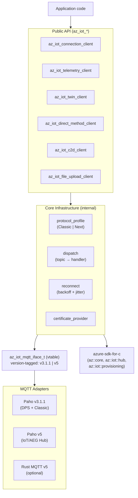
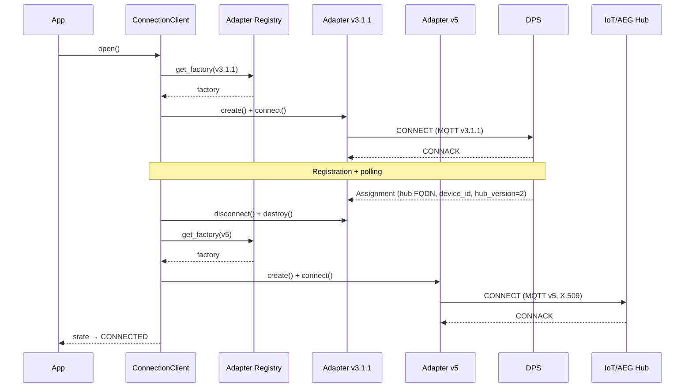
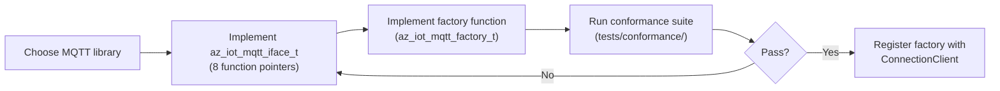
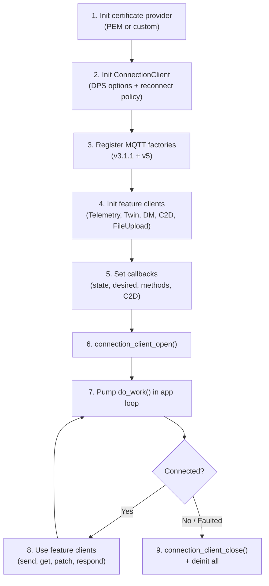

<!-- Copyright (c) Microsoft. All rights reserved.
     Licensed under the MIT license. See LICENSE file in the project root for full license information. -->

# Azure IoT C SDK — Internal API Review

**Repo:** `azure-iot-c` · **Language:** C99 · **Version:** 1.0.0

---

## 1. Context

IoT Hub is deploying a new service implementation ("IoT/AEG Hub") backed by Azure Event Grid as the MQTT broker. It uses **MQTT v5** with a different protocol exchange than Classic IoT Hub (MQTT v3.1.1). Both services expose the same device features — twin, direct methods, telemetry, C2D — but the wire format differs. File Upload is also supported when connected to Classic Azure IoT Hub.

This SDK is a **new C99 client** that:

- Works transparently with **both Classic IoT Hub and IoT/AEG Hub** from a single binary.
- Discovers the target hub flavor at **DPS provisioning time** — this is not a user-facing knob.
- Exposes a **feature-client oriented API** (`az_iot_telemetry_client`, `az_iot_twin_client`, etc.) rather than a monolithic service client.
- Provides a **pluggable MQTT abstraction** so platforms can bring their own MQTT stack (Paho-C ships as default).
- Is designed for **constrained and general-purpose** targets: single-threaded, no hidden allocations on the hot path, no internal threads.

The Azure IoT suite of APIs should feel consistent at the feature-client level. Taking into account the language-specific constructs that may differ, the APIs should feel familiar for a developer working across different programming languages.

---

## 2. Requirements

> The key words **MUST**, **MUST NOT**, **SHOULD**, **SHOULD NOT**, and **MAY** in this section are to be interpreted as described in [RFC 2119](https://datatracker.ietf.org/doc/html/rfc2119).

| # | Requirement |
|---|---|
| R1 | **Feature-client pattern** — The SDK **MUST** expose `az_iot_connection_client` for lifecycle and separate `az_iot_telemetry_client`, `az_iot_twin_client`, `az_iot_direct_method_client`, `az_iot_c2d_client`, and `az_iot_file_upload_client` for messaging/features. Users **MUST** be able to compose only the features they need; the SDK **MUST NOT** require initializing unused feature clients. |
| R2 | **Dual hub compatibility** — The SDK **MUST** work with both Classic IoT Hub (MQTT v3.1.1) and IoT/AEG Hub (MQTT v5) from a single binary. Protocol differences **MUST** be hidden from the application. |
| R3 | **DPS provisioning** — DPS **MUST** be supported as the primary entry point and the API shape **MUST** assume it. Direct-host connection **MAY** be used as a secondary path. |
| R4 | **Pluggable MQTT client** — MQTT operations **MUST** go through the `az_iot_mqtt_iface_t` vtable. The SDK **MUST NOT** call any MQTT library directly, so that platform-specific or customer-mandated MQTT libraries **MAY** be slotted in without modifying the SDK. |
| R5 | **X.509 authentication** — The SDK **MUST** provide a pluggable certificate provider interface and **MUST** ship a default PEM file-loader. Custom providers **MAY** source material from a TPM/HSM/OS keystore. |
| R6 | **TLS required** — All connections **MUST** use TLS with server certificate validation. TLS 1.3 **MUST** be used if supported by the target Azure service. The SDK **MUST** support SNI. Server certificate validation **MUST NOT** be silently disabled. |
| R7 | **Single-threaded core** — Implementation **SHOULD** stay as simple as possible, and avoid creating app-hidden threads and locks. |
| R8 | **Reconnect with backoff** — The ConnectionClient **MUST** own an exponential-backoff + jitter reconnect policy. Reconnect **SHOULD** be enabled by default, and its parameters **MUST** be configurable. |
| R9 | **Cross-language consistency** — Feature-client names, lifecycle verbs, and callback patterns **SHOULD** map naturally to the .NET (and future) SDKs. |


### Future Requirements

- **Custom topic publish** — The SDK **MAY** add an IoT/AEG-only feature for subscribing and/or publishing to arbitrary MQTT topics. This is deferred to a later phase.

---

## 3. Non-Requirements

- IoT Edge support / module client APIs.
- AMQP or HTTP communication.
- SAS token, symmetric key, or TPM-based authentication.
- Device connection strings.

---

## 4. Architecture

### 4.1 Layer Diagram



### 4.2 MQTT Adapter Registry

ConnectionClient holds an adapter registry (up to `AZ_IOT_MAX_MQTT_FACTORIES`, currently 4 — one slot per `(version, potential-future-role)` pair, leaving room for growth without a breaking change). Each factory is tagged with the MQTT version it speaks. At session-open time the SDK maps the target service to a required version and picks the matching factory:

| Service | Required MQTT version |
|---|---|
| DPS | v3.1.1 |
| IoT Hub Classic | v3.1.1 |
| IoT/AEG Hub | v5 |

> **Note:** `azure-sdk-for-c` does **not** use `az_iot_mqtt_iface_t`. It is a pure protocol-helper library (topic string construction, payload parsing) with no I/O. The MQTT adapter vtable is consumed exclusively by this SDK's ConnectionClient to perform actual network operations.

### 4.3 DPS → Hub "Two-Adapter Dance"



If DPS assigns a Classic hub, step "get_factory(v5)" becomes "get_factory(v3.1.1)" and the session continues on MQTT v3.1.1.

> **Important:** Even when the MQTT version is the same for both DPS and Hub (Classic assignment), the adapter **instance** is always destroyed and recreated. The *factory* is reused (same `create` function pointer is called again), but each call to `create()` must return a distinct client instance. This keeps lifecycle uniform and prevents state leakage between sessions.

---

## 5. API Surface

All public symbols use the `az_iot_` prefix. Headers live under `inc/azure/iot/`.

### 5.1 MQTT Adapter Interface

The pluggable MQTT contract. Adapter authors implement this vtable; the SDK never calls MQTT directly.

```c
/* Version tag carried by every adapter instance */
typedef enum {
    AZ_IOT_MQTT_VERSION_3_1_1 = 0,
    AZ_IOT_MQTT_VERSION_5     = 1
} az_iot_mqtt_version_t;

/* Vtable — all calls are non-blocking; I/O happens in process_loop() */
typedef struct az_iot_mqtt_iface_tag {
    az_iot_mqtt_version_t version;

    az_iot_result_t (*connect)(az_iot_mqtt_client_t* self, const az_iot_mqtt_connect_options_t* opts);
    az_iot_result_t (*disconnect)(az_iot_mqtt_client_t* self);
    az_iot_result_t (*subscribe)(az_iot_mqtt_client_t* self, const char* topic_filter,
                                 az_iot_mqtt_qos_t qos, uint16_t* out_packet_id);
    az_iot_result_t (*unsubscribe)(az_iot_mqtt_client_t* self, const char* topic_filter,
                                   uint16_t* out_packet_id);
    az_iot_result_t (*publish)(az_iot_mqtt_client_t* self, const az_iot_mqtt_message_t* msg,
                               uint16_t* out_packet_id);
    az_iot_result_t (*process_loop)(az_iot_mqtt_client_t* self, uint32_t timeout_ms);
    void (*set_inbound_cb)(az_iot_mqtt_client_t* self, az_iot_mqtt_event_cb cb, void* user_ctx);
    void (*destroy)(az_iot_mqtt_client_t* self);
} az_iot_mqtt_iface_t;

/* Factory — registered with ConnectionClient, produces adapter instances */
typedef struct az_iot_mqtt_factory_tag {
    az_iot_mqtt_version_t version;
    az_iot_mqtt_client_t* (*create)(void* factory_ctx);
    void* factory_ctx;
    void (*destroy)(void* factory_ctx);
} az_iot_mqtt_factory_t;
```

**Why a vtable?** — Platforms may mandate a specific MQTT library (e.g., vendor TLS stacks, RTOS-bundled clients). The vtable lets any conformant implementation plug in without rebuilding the SDK.

### 5.2 Connection Client

Owns lifecycle, DPS provisioning, reconnect, adapter selection, and inbound dispatch.

```c
/* Options — returned pre-filled by the _get_default() helper */
typedef struct {
    const char* host;              /* NULL → provision via DPS first         */
    uint16_t    port;              /* default 8883                           */
    const char* client_id;         /* device id                              */
    az_iot_certificate_provider_t* certificate_provider;
    az_iot_reconnect_policy_t reconnect;
    struct {
        const char* global_endpoint;   /* NULL → default DPS endpoint       */
        const char* id_scope;
        const char* registration_id;
    } dps;
} az_iot_connection_client_options_t;

typedef enum {
    AZ_IOT_CONN_STATE_IDLE,
    AZ_IOT_CONN_STATE_CONNECTING,
    AZ_IOT_CONN_STATE_CONNECTED,
    AZ_IOT_CONN_STATE_RECONNECTING,
    AZ_IOT_CONN_STATE_DISCONNECTING,
    AZ_IOT_CONN_STATE_FAULTED
} az_iot_connection_state_t;

/* State change callback — fires from inside do_work() */
typedef void (*az_iot_connection_state_cb)(
    az_iot_connection_state_t state, az_iot_result_t reason, void* user_ctx);

/* Lifecycle */
az_iot_connection_client_options_t az_iot_connection_client_options_get_default(
    const char* id_scope, const char* registration_id,
    az_iot_certificate_provider_t* cert_provider);

az_iot_result_t az_iot_connection_client_init(
    az_iot_connection_client_t* client,
    const az_iot_connection_client_options_t* opts);

void az_iot_connection_client_deinit(az_iot_connection_client_t* client);

az_iot_result_t az_iot_connection_client_register_mqtt_factory(
    az_iot_connection_client_t* client, const az_iot_mqtt_factory_t* factory);

az_iot_result_t az_iot_connection_client_set_state_callback(
    az_iot_connection_client_t* client, az_iot_connection_state_cb cb, void* user_ctx);

az_iot_result_t az_iot_connection_client_open(az_iot_connection_client_t* client);
az_iot_result_t az_iot_connection_client_close(az_iot_connection_client_t* client);

/* Single-threaded pump — ALL callbacks fire from inside this call */
az_iot_result_t az_iot_connection_client_do_work(
    az_iot_connection_client_t* client, uint32_t timeout_ms);
```

### 5.3 Telemetry Client (D2C)

```c
typedef struct {
    const uint8_t* payload;
    size_t payload_len;
    const az_iot_telemetry_property_t* properties;   /* e.g. content-type */
    size_t properties_count;
} az_iot_telemetry_message_t;

typedef void (*az_iot_telemetry_send_cb)(az_iot_result_t status, void* user_ctx);

az_iot_result_t az_iot_telemetry_client_init(
    az_iot_telemetry_client_t* client, az_iot_connection_client_t* conn);
void az_iot_telemetry_client_deinit(az_iot_telemetry_client_t* client);

az_iot_result_t az_iot_telemetry_client_send(
    az_iot_telemetry_client_t* client,
    const az_iot_telemetry_message_t* msg,
    az_iot_telemetry_send_cb cb, void* user_ctx);
```

### 5.4 Twin Client

```c
typedef void (*az_iot_twin_get_cb)(
    az_iot_result_t status, const uint8_t* twin, size_t twin_len, void* user_ctx);
typedef void (*az_iot_twin_patch_ack_cb)(az_iot_result_t status, void* user_ctx);
typedef void (*az_iot_twin_desired_cb)(
    const uint8_t* patch, size_t patch_len, uint64_t version, void* user_ctx);

az_iot_result_t az_iot_twin_client_init(
    az_iot_twin_client_t* client, az_iot_connection_client_t* conn);
void az_iot_twin_client_deinit(az_iot_twin_client_t* client);

az_iot_result_t az_iot_twin_client_get(
    az_iot_twin_client_t* client, az_iot_twin_get_cb cb, void* user_ctx);

az_iot_result_t az_iot_twin_client_patch_reported(
    az_iot_twin_client_t* client,
    const uint8_t* patch, size_t patch_len,
    az_iot_twin_patch_ack_cb cb, void* user_ctx);

az_iot_result_t az_iot_twin_client_set_desired_callback(
    az_iot_twin_client_t* client, az_iot_twin_desired_cb cb, void* user_ctx);
```

### 5.5 Direct Method Client

```c
/* Opaque handle — must be passed back to respond() */
typedef struct az_iot_direct_method_request_tag az_iot_direct_method_request_t;

typedef void (*az_iot_direct_method_handler_cb)(
    az_iot_direct_method_request_t* request,
    const char* method_name,
    const uint8_t* payload, size_t payload_len,
    void* user_ctx);

az_iot_result_t az_iot_direct_method_client_init(
    az_iot_direct_method_client_t* client, az_iot_connection_client_t* conn);
void az_iot_direct_method_client_deinit(az_iot_direct_method_client_t* client);

az_iot_result_t az_iot_direct_method_client_set_handler(
    az_iot_direct_method_client_t* client,
    az_iot_direct_method_handler_cb cb, void* user_ctx);

az_iot_result_t az_iot_direct_method_respond(
    az_iot_direct_method_request_t* request,
    int status_code,
    const uint8_t* payload, size_t payload_len);
```

### 5.6 C2D Client (Cloud-to-Device)

```c
typedef void (*az_iot_c2d_handler_cb)(
    const uint8_t* payload, size_t payload_len,
    const char* content_type,   /* may be NULL */
    void* user_ctx);

az_iot_result_t az_iot_c2d_client_init(
    az_iot_c2d_client_t* client, az_iot_connection_client_t* conn);
void az_iot_c2d_client_deinit(az_iot_c2d_client_t* client);

az_iot_result_t az_iot_c2d_client_set_handler(
    az_iot_c2d_client_t* client, az_iot_c2d_handler_cb cb, void* user_ctx);
```

### 5.7 File Upload Client (Classic IoT Hub only)

```c
typedef void (*az_iot_file_upload_sas_cb)(
    az_iot_result_t status,
    const char* blob_sas_uri,
    const char* correlation_id,
    void* user_ctx);

typedef void (*az_iot_file_upload_complete_cb)(az_iot_result_t status, void* user_ctx);

az_iot_result_t az_iot_file_upload_client_init(
    az_iot_file_upload_client_t* client, az_iot_connection_client_t* conn);
void az_iot_file_upload_client_deinit(az_iot_file_upload_client_t* client);

az_iot_result_t az_iot_file_upload_client_get_sas_uri(
    az_iot_file_upload_client_t* client,
    const char* blob_name,
    az_iot_file_upload_sas_cb cb, void* user_ctx);

az_iot_result_t az_iot_file_upload_client_notify_complete(
    az_iot_file_upload_client_t* client,
    const char* correlation_id,
    bool is_success,
    az_iot_file_upload_complete_cb cb, void* user_ctx);
```

> **Note:** File Upload is supported only when connected to Classic IoT Hub. The actual blob upload (HTTP PUT to Azure Storage) is performed by the application using the SAS URI returned by `get_sas_uri`. The SDK handles only the IoT Hub notification protocol.

### 5.8 Certificate Provider

The certificate provider supports three deployment scenarios:

| Scenario | Configuration |
|---|---|
| **Host with OS certificate store** | `trusted_ca_pem_path = NULL` — adapter uses the platform's system CA store for server validation. Client cert/key paths are still provided for X.509 device auth. |
| **No certificate store — file paths** | All three paths set (`trusted_ca_pem_path`, `client_cert_pem_path`, `client_key_pem_path`). Adapter loads from disk. |
| **No certificate store — in-memory PEM** | Custom provider implementation loads material from any source and populates `az_iot_certificate_material_t` with PEM strings directly (no file I/O). |

```c
/* Vtable — custom implementations can wrap TPM/HSM/OS keystore */
typedef struct {
    az_iot_result_t (*load)(az_iot_certificate_provider_t* self,
                            az_iot_certificate_material_t* out);
    void (*release)(az_iot_certificate_provider_t* self,
                    az_iot_certificate_material_t* material);
    void (*deinit)(az_iot_certificate_provider_t* self);
} az_iot_certificate_provider_vtable_t;

/* Material struct — adapters consume whichever fields are non-NULL */
typedef struct {
    const char* trusted_ca_pem;        /* NULL → use system CA store     */
    const char* client_cert_pem;       /* required for X.509 auth        */
    const char* client_key_pem;        /* required for X.509 auth        */
    const char* client_key_password;   /* may be NULL                    */
    const char* trusted_ca_path;       /* file path alternative          */
    const char* client_cert_path;      /* file path alternative          */
    const char* client_key_path;       /* file path alternative          */
} az_iot_certificate_material_t;

/* Default PEM file-loader (ships with the SDK) */
az_iot_result_t az_iot_certificate_provider_pem_init(
    az_iot_certificate_provider_pem_t* provider,
    const az_iot_certificate_provider_pem_options_t* opts);
void az_iot_certificate_provider_pem_deinit(
    az_iot_certificate_provider_pem_t* provider);
```

The provider also supports **certificate rotation**: calling `load()` again after a rotation event returns fresh material. The ConnectionClient calls `load()` on each new connection attempt (including reconnects), so rotated certificates are picked up automatically without application intervention.

### 5.9 Default Adapter (Paho-C)

```c
/* Register these with ConnectionClient; SDK picks by MQTT version at connect time */
az_iot_mqtt_factory_t* az_iot_paho_factory_create_v3_1_1(void);
az_iot_mqtt_factory_t* az_iot_paho_factory_create_v5(void);
void az_iot_paho_factory_destroy(az_iot_mqtt_factory_t* factory);
```

---

## 6. Usage Example — Send Telemetry via DPS

```c
#include "azure/iot/az_iot.h"
#include "azure/iot/adapters/az_iot_adapter_paho.h"

static az_iot_connection_state_t g_state;
static int g_send_done;

static void on_state(az_iot_connection_state_t s, az_iot_result_t r, void* ctx) {
    (void)r; (void)ctx;
    g_state = s;
}
static void on_send(az_iot_result_t status, void* ctx) {
    (void)ctx;
    g_send_done = (status == AZ_IOT_OK);
}

int main(void) {
    /* 1. Certificate provider (PEM files) */
    az_iot_certificate_provider_pem_t certs;
    az_iot_certificate_provider_pem_init(&certs, &(az_iot_certificate_provider_pem_options_t){
        .client_cert_pem_path = "device.pem",
        .client_key_pem_path  = "device.key" });

    /* 2. Connection client with DPS */
    az_iot_connection_client_t conn;
    az_iot_connection_client_options_t opts =
        az_iot_connection_client_options_get_default("0ne12345678", "my-device", &certs.base);
    az_iot_connection_client_init(&conn, &opts);
    az_iot_connection_client_set_state_callback(&conn, on_state, NULL);

    /* 3. Register MQTT adapters (v3.1.1 for DPS/Classic, v5 for IoT/AEG Hub) */
    az_iot_connection_client_register_mqtt_factory(&conn, az_iot_paho_factory_create_v3_1_1());
    az_iot_connection_client_register_mqtt_factory(&conn, az_iot_paho_factory_create_v5());

    /* 4. Telemetry client */
    az_iot_telemetry_client_t tel;
    az_iot_telemetry_client_init(&tel, &conn);

    /* 5. Open (DPS → Hub connect happens internally) */
    az_iot_connection_client_open(&conn);
    while (g_state != AZ_IOT_CONN_STATE_CONNECTED)
        az_iot_connection_client_do_work(&conn, 50);

    /* 6. Send one message */
    az_iot_telemetry_message_t msg = {
        .payload = (const uint8_t*)"{\"temp\":23}", .payload_len = 11 };
    az_iot_telemetry_client_send(&tel, &msg, on_send, NULL);
    while (!g_send_done)
        az_iot_connection_client_do_work(&conn, 50);

    /* 7. Teardown */
    az_iot_connection_client_close(&conn);
    while (g_state != AZ_IOT_CONN_STATE_IDLE)
        az_iot_connection_client_do_work(&conn, 50);

    az_iot_telemetry_client_deinit(&tel);
    az_iot_connection_client_deinit(&conn);
    az_iot_certificate_provider_pem_deinit(&certs);
}
```

---

## 7. Key Design Decisions

| Decision | Rationale |
|---|---|
| **Two-adapter dance** (DPS adapter destroyed, Hub adapter freshly created) | Keeps each adapter instance single-purpose. No v5 features smuggled through a v3.1.1 surface. Adapter authors can ship version-specific implementations without conditional logic. |
| **Single-threaded `do_work()` pump** | Embedded-friendly — no hidden threads, no allocator surprises. The application owns its event loop. Adapter internal threads (e.g., Paho I/O) marshal events into a FIFO drained only inside `process_loop()`. |
| **Hub flavor not exposed to users** | The app never decides Classic vs IoT/AEG. DPS returns the assignment; the SDK selects the right MQTT version internally. This future-proofs against service-side migration. |
| **azure-sdk-for-c as PRIVATE dependency** | Leverages proven Classic/DPS protocol logic without reimplementing it. Linked PRIVATE so `az_span`, `az_result`, etc. never appear in public headers — users see only `az_iot_*` types. |
| **Feature clients can be created before or after connection** | Feature clients register their topic handlers at `_init()` time. If the ConnectionClient is already connected, the SDK issues the MQTT SUBSCRIBE immediately. If not yet connected, subscriptions are batched and issued at connect time (including on reconnect). This allows flexible initialization order. |
| **Default reconnect policy (exponential backoff + jitter)** | Reconnect is enabled by default with sensible parameters. The policy is configurable — users can adjust delays, max attempts, or jitter percentage. Exponential backoff with jitter avoids thundering-herd on fleet reconnects. |
| **IoT/AEG Hub birth message handled transparently** | IoT/AEG Hub requires declaring feature subscriptions in a birth message at connect time. The SDK assembles this automatically from the set of initialized feature clients. If the user does not restrict features, all initialized feature clients are included by default. |
| **Pluggable certificate provider** | Decouples credential sourcing from the SDK. Default PEM-file loader ships for development; production deployments slot in TPM/HSM/keyvault implementations via the same vtable. Certificate rotation is supported: `load()` is called on each connection attempt, so rotated material is picked up on reconnect. |
| **Struct versioning via `_internal_size`** | Public structs passed by pointer include a size field stamped by an initializer macro. Library reads only up to the caller's declared size, defaulting newer fields. Enables ABI-safe struct evolution without opaque-pointer ceremony. |

---

## 8. Open Questions

1. **Feature subscription opt-out** — IoT/AEG Hub requires declaring feature subscriptions in a birth message at connect time. Currently all initialized feature clients are included automatically. Should we provide a mechanism for the user to explicitly limit which features are declared in the birth message (e.g., for bandwidth-constrained devices that only want telemetry)?
2. **Factory instance isolation** — When a factory's `create()` is called multiple times (e.g., DPS then Hub on the same v3.1.1 factory), each call must return a distinct client instance. This is validated in the conformance suite. Should we additionally guard against a misbehaving factory returning the same pointer twice (runtime assertion)?

---

## 9. MQTT Adapter — Detailed Contract

The MQTT adapter is the single integration point for platform-specific MQTT libraries. Each adapter instance is a concrete struct whose **first field** is a pointer to the `az_iot_mqtt_iface_t` vtable, allowing the SDK core to dispatch generically.

**Key constraints on adapter implementations:**

| Rule | Why |
|---|---|
| `process_loop()` is the only place that may invoke the user's inbound callback | Preserves the single-threaded guarantee |
| All other vtable calls (`connect`, `publish`, `subscribe`, ...) are **non-blocking** — they queue work | Prevents blocking `do_work()` on network I/O |
| If the underlying library has its own I/O thread (e.g., Paho), events must be marshalled into a thread-safe FIFO and drained only inside `process_loop()` | Avoids requiring the application to hold locks |
| Each adapter instance speaks exactly **one** MQTT version | Eliminates runtime version negotiation inside the adapter |
| `destroy()` must be safe to call **only outside** the inbound callback stack | The SDK never destroys an adapter from within its own callback; it defers destruction to after `process_loop()` returns |

### Development Flow — Bringing Your Own MQTT Client



1. **Choose** — Select an MQTT library available on your platform (must support TLS + the required MQTT version).
2. **Implement** — Fill in the 8 vtable slots. Wrap the library's send/receive into the non-blocking + FIFO pattern.
3. **Validate** — Link the conformance test harness (`az_iot_conformance.h`) against your factory. It runs ~40 tests covering connect/disconnect, pub/sub, QoS 0/1, event ordering, and v5 property pass-through.
4. **Integrate** — Register your factory at application startup. No SDK rebuild required.

### Usage Flow — Application Integration



All callbacks (state changes, telemetry ACKs, twin responses, method invocations, C2D messages) fire **synchronously inside step 7**. The application never needs to protect shared state with locks if all access happens within the `do_work()` call and its callbacks.

> **Note:** Feature clients may also be initialized **after** `open()` / after the connection is established. If the ConnectionClient is already in `CONNECTED` state, the feature client's `_init()` will issue the required MQTT SUBSCRIBE immediately (delivered on the next `do_work()` cycle). This allows dynamic feature composition at runtime.

---

## 10. Test Strategy

### Unit Tests (`tests/unit/`, cmocka)

| Module | Coverage |
|---|---|
| `connection_client_test.c` | State machine transitions, DPS orchestration (mocked adapter), factory registration, deferred actions |
| `reconnect_policy_test.c` | Backoff calculation, jitter bounds, max-attempts termination, zero-policy behavior |
| `protocol_profile_dispatch_test.c` | Topic-prefix routing, longest-prefix-wins, register/unregister, table overflow |
| `telemetry_client_test.c` | Message construction, property encoding, send ACK correlation (Classic + Next) |
| `twin_client_test.c` | GET/PATCH correlation, desired-push dispatch, pending-pool exhaustion |
| `direct_method_client_test.c` | Handler registration, request→respond lifecycle, status code propagation |
| `file_upload_client_test.c` | SAS URI request/response correlation, completion notification, Classic-only guard |
| `certificate_provider_pem_test.c` | File read, lazy-load caching, release/deinit lifecycle, missing-file error |
| `mqtt_iface_contract_test.c` | Vtable validation, version tag checks, NULL-pointer guards |
| `paho_adapter_smoke_test.c` | Factory creation, client instantiation, FIFO drain ordering |
| `rust_mqtt_adapter_test.c` | FFI stub install/uninstall, factory returns NULL when uninstalled |
| `smoke_test.c` | Full-stack init→deinit with mocked adapter (no network) |

### Conformance Tests (`tests/conformance/`, live broker)

- Reusable harness (`az_iot_conformance.h`) that exercises **any** `az_iot_mqtt_factory_t` against a real MQTT broker.
- Two entry points: `paho_v3_main.c` (v3.1.1 suite), `paho_v5_main.c` (v5 suite).
- CI runs against an `eclipse-mosquitto:2` service container (Linux jobs).
- Tests skip (CTest exit 77) when `AZ_IOT_MQTT_BROKER_HOST` is unset — local builds stay green without a broker.
- Validates: connect/disconnect, QoS 0+1 pub/sub, event ordering, subscription wildcards, v5 user-properties, correlation-data round-trip.
- **Factory isolation test**: calls `factory.create()` multiple times and asserts each returned pointer is distinct (prevents adapter implementations from returning the same client instance across sessions).

### E2E Tests (planned)

| Scenario | Services |
|---|---|
| DPS → Classic Hub → Telemetry send | DPS + IoT Hub Classic |
| DPS → IoT/AEG Hub → Telemetry send | DPS + IoT/AEG Hub |
| Twin GET + PATCH reported + desired push | Hub (both flavors) |
| Direct method invocation + respond | Hub (both flavors) |
| C2D message receive | Hub (both flavors) |
| Reconnect after network drop | Hub (both flavors) |
| DPS registration failure (bad scope) | DPS |
| Certificate expiry / rotation | Hub + cert provider |
| File Upload SAS URI + completion (Classic only) | DPS + IoT Hub Classic |

### CI Targets

- **Linux** (GCC + Clang), **Windows** (MSVC), **Embedded** (ARM cross-compile, build-only validation).
- Dedicated C99-strict job ensures no compiler-extension leakage.
- Conformance tests run on Linux with a Mosquitto service container.

### Manual Testing (`tests/manual/`)

PowerShell scripts for Azure resource provisioning and test execution:

- `New-TestEnv.ps1` — Creates DPS instance, IoT Hub, enrollment group, and device certificates.
- `New-TestClient.ps1` — Generates a device identity and X.509 cert for a test run.
- `Read-ServiceLogs.ps1` — Tails IoT Hub diagnostic logs during a test.
- `Remove-TestClient.ps1` / `Remove-TestEnv.ps1` — Teardown helpers.

---

## 11. Samples and Documentation

### Samples (`samples/`)

| Sample | Description |
|---|---|
| `telemetry/main.c` | Provision via DPS, send one D2C message, close. Minimal happy-path reference. |
| `twin_get_patch/main.c` | GET full twin + PATCH reported properties. Shows request/response correlation. |
| `direct_method_responder/main.c` | Subscribe for method invocations, echo payloads back with status 200. Runs ~60s. |
| `c2d_receiver/main.c` | Subscribe for C2D messages, print payloads. Runs ~60s. |
| `file_upload/main.c` | Request SAS URI, upload a file to blob storage, notify completion. Classic IoT Hub only. |

All samples share a `common/sample_utils.h` helper that loads configuration from environment variables (`AZ_IOT_ID_SCOPE`, `AZ_IOT_REGISTRATION_ID`, `AZ_IOT_CERT_PATH`, `AZ_IOT_KEY_PATH`, `AZ_IOT_CA_PATH`).

### Documentation (`docs/`)

All documentation will live in the `docs/` directory, including:

- **Quick-start guides** — Getting from zero to a working device in under 5 minutes.
- **In-depth documentation** — Architecture, protocol details, BYO-MQTT-client guide, DPS integration, struct versioning/ABI strategy.
- **API reference** — Generated from header comments (Doxygen or equivalent).

### Getting Started Target

Goal: **zero to working sample in under 5 minutes**.

1. Clone repo.
2. Run `New-TestEnv.ps1` (one-time Azure resource setup, ~2 min).
3. `cmake --preset linux-debug && cmake --build build/` (deps fetched automatically via FetchContent).
4. Set env vars from script output, run `./build/samples/telemetry/telemetry_sample`.
5. Observe telemetry in IoT Hub portal.

Future: AI-assisted onboarding prompt (Copilot / CLI) that generates a project scaffold with the user's chosen MQTT library pre-wired.

---

## 12. References

| Resource | Link / Location |
|---|---|
| This repo | `azure-iot-c` (internal, not yet public) |
| .NET SDK design notes | `azure-iot-sdk-net/design notes.md` (branch: `timtay/noodling`) |
| BYO MQTT client guide | `docs/how_to_byo_mqtt_client.md` |
| DPS integration design | `docs/dps-integration.md` |
| Internal design doc | `docs/design.md` |
| Struct versioning | `docs/struct_versioning.md` |
| azure-sdk-for-c | [github.com/Azure/azure-sdk-for-c](https://github.com/Azure/azure-sdk-for-c) (pinned tag `1.5.0`) |
| Eclipse Paho C | [github.com/eclipse/paho.mqtt.c](https://github.com/eclipse/paho.mqtt.c) (pinned tag `v1.3.13`) |

---

_Last updated: 2026-06-04_