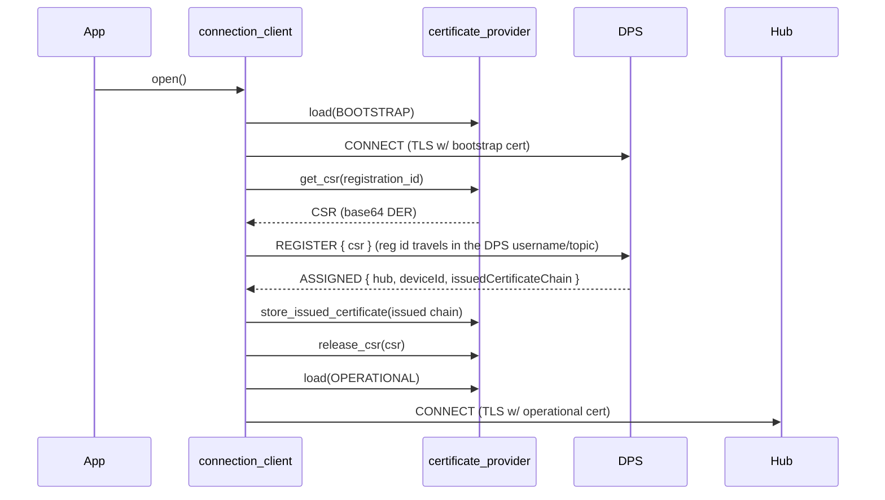

<!-- Copyright (c) Microsoft. All rights reserved.
     Licensed under the MIT license. See LICENSE file in the project root for full license information. -->

# Certificate Management — CSR-based Operational-Cert Enrollment via DPS

The key words "MUST", "MUST NOT", "REQUIRED", "SHALL", "SHALL NOT", "SHOULD", "SHOULD NOT", "RECOMMENDED", "MAY", and "OPTIONAL" in this document are to be interpreted as described in [RFC 2119](https://datatracker.ietf.org/doc/html/rfc2119).

> **Naming:** types use the current SDK convention — no `_t` suffix, struct/enum
> tags match the type name, and callbacks use the `_callback` suffix.

## Status

Implemented. The certificate-provider vtable is versioned to v2 with the
role-aware `load()`, CSR hooks (`get_csr`/`release_csr`) and issued-cert storage;
the connection client performs DPS CSR enrollment (opt-in via
`dps.request_operational_certificate`) and MQTTv3 hub runtime renewal
(`az_iot_connection_client_send_csr`). An optional OpenSSL 3.0+ "managed"
provider (`az_iot_certificate_provider_managed`), unit + E2E tests, and
`samples/authentication/` ship alongside.

Non-extractable key custody (D8) is implemented **for the Paho adapter via the
key-reference route**: `az_iot_mqtt_tls_options` carries `client_key_uri`,
`crypto_engine_id` and a `sign`/`sign_ctx` pair, the connection client
propagates them on both connect paths, and the Paho adapter resolves the URI
through the named OpenSSL 3.x provider so the TLS handshake signs inside the
hardware. The `sign()` hook is carried to the adapter but has no Paho
implementation: Paho takes its client key as a file path and exposes no
`SSL_CTX` and no key callback, so it refuses a `sign()`-only credential rather
than connecting without a client key. That route is for BYO adapters. The
`rust_mqtt` adapter has no TLS credential handling at all and is not covered.

## Abstract

This document describes **CSR-based certificate management** (operational-certificate
enrollment): the device keeps a **bootstrap identity cert** to
authenticate to DPS, sends a **CSR** in the registration request, receives an **issued
operational cert** from the DPS-linked CA, and connects to the assigned Hub with that
operational cert. The private key for the operational cert never leaves the device.

## Flow



The extensibility seam is the **certificate provider**, because the operational
private-key custody (TPM / HSM / file) and the issued-cert persistence both belong to
whatever owns key material.

## Scope

- **In scope:** X.509 bootstrap identity authenticating to DPS; CSR generation; issued
  operational cert used for the hub connection; persistence and reuse of the issued cert;
  hub-side certificate **renewal** (MQTTv3).
- **Out of scope:** TPM / symmetric-key *attestation* for the DPS leg. Renewal
  *scheduling* (when to renew before expiry) is left to the application.

---

## Public API

Declared in [az_iot_certificate_provider.h](../../inc/azure/iot/az_iot_certificate_provider.h)
and [az_iot_connection_client.h](../../inc/azure/iot/az_iot_connection_client.h); the headers
are the reference.

### Certificate provider

`az_iot_certificate_provider_vtable`, versioned (`version` =
`AZ_IOT_CERTIFICATE_PROVIDER_VTABLE_VERSION`, currently 2; D1):

| Slot | Since | Purpose |
| --- | --- | --- |
| `load(self, role, out)` | v1 | Credential material for `AZ_IOT_CRED_BOOTSTRAP` or `AZ_IOT_CRED_OPERATIONAL` (D3). |
| `release`, `deinit` | v1 | Release material; tear down the provider. |
| `get_csr(self, subject_common_name, out)` | v2, optional | Build a CSR (base64 PKCS#10 DER) with `CN` = the registration id. NULL means enrollment is not supported. |
| `release_csr` | v2, optional | Release what `get_csr` returned. |
| `store_issued_certificate(self, issued)` | v2, optional | Persist an issued chain (`az_iot_issued_certificate`: base64 DER, leaf first, valid for the call only). |
| `sign(self, digest, ...)` | v2, optional | Sign for the TLS handshake with a non-extractable key (D8). |

`az_iot_certificate_material` carries the credential as PEM strings, file paths, or a key
reference (`client_key_uri` + `crypto_engine_id`).

Providers in the tree:

- `az_iot_certificate_provider_pem` (core): a static loader. No CSR support.
- `az_iot_certificate_provider_managed` (optional OpenSSL 3.0+ adapter,
  [`adapters/cert_openssl/`](../../adapters/cert_openssl/az_iot_certificate_provider_managed.h)):
  bootstrap cert and key, optional trusted CA, operational key and operational cert paths, and
  a key type. It generates the operational key and CSR, and persists the issued chain.

### Connection client

| Item | Purpose |
| --- | --- |
| `dps.request_operational_certificate` | Send a CSR with the DPS registration (D2). `open()` returns `AZ_IOT_ERR_NOT_SUPPORTED` if the provider is below v2 or has no `get_csr`. |
| `csr_payload_buffer` | Caller buffer for the registration body; must be non-empty when enrolling. `AZ_IOT_CSR_PAYLOAD_BUFFER_MIN` is enough for any CSR the service accepts. |
| `az_iot_connection_client_set_operational_cert_callback()` | Called with a DPS-issued chain (D4): after `store_issued_certificate()` succeeds, or on its own when the provider has no storage hook. |
| `az_iot_connection_client_send_csr()` | Hub-side renewal (below). |
| `az_iot_connection_client_cancel_csr()` | Abandon an in-flight renewal. |

---

## DPS issuance

When `dps.request_operational_certificate` is set, the connection client calls `get_csr()`,
sends `{"csr":"<base64 DER>"}` in the registration body (the registration id travels in the
DPS username and topic), and on assignment extracts `issuedCertificateChain`. The chain goes to
`store_issued_certificate()` when the provider has it, then to the operational-certificate
callback when set; at least one must be present, or registration fails with
`AZ_IOT_ERR_NOT_SUPPORTED`. A failed store skips the callback and fails the registration with the
provider's result. The hub connect then
calls `load(AZ_IOT_CRED_OPERATIONAL)`, falling back to `AZ_IOT_CRED_BOOTSTRAP` when no
operational credential is held.

---

## Hub-side renewal (MQTTv3)

Renews the operational certificate without re-provisioning through DPS. MQTTv5 hubs do not
support it.

- **Topics:** publish `$iothub/credentials/POST/issueCertificate/?$rid=<id>`, subscribe
  `$iothub/credentials/res/#`.
- **Body:** `{ "id": "<deviceId>", "csr": "<base64 DER>", "replace": "*"|<request id>|null }`.
  The device id is taken from the connected client id.
- **Two-phase:** `202 Accepted` (signing in progress), then `200` with the issued chain.
- **Recovery:** pass a prior `request_id` to resubmit after a dropped connection; `replace`
  supersedes an active hub-side operation.
- **Errors:** routed on the response status (`202`/`200`/other). The JSON body's `errorCode`
  is surfaced as `service_code`, and `retryAfter` as `retry_after_s`.

  | Code | Meaning | Transient |
  |---|---|---|
  | `400040` | CSR decode / verification failed | no |
  | `409005` | Conflict — another operation active (use `replace`) | no |
  | `412001` | No pending request matches `replace` | no |
  | `429002` / `429003` | Throttled | yes |
  | `503001` | Service unavailable | yes |
  | `500001` | Server error | yes |

```c
az_iot_result az_iot_connection_client_send_csr(
    az_iot_connection_client* client,
    const az_iot_certificate_signing_request* csr, /* from the application or get_csr() */
    const char* request_id,                         /* NULL: the SDK generates one */
    const char* replace,                            /* NULL, "*" or a request id */
    az_iot_csr_callback cb,
    void* user_ctx);
```

The callback receives `az_iot_csr_event`: `AZ_IOT_CSR_ACCEPTED`, then `AZ_IOT_CSR_ISSUED` with
the chain, or `AZ_IOT_CSR_FAILED` with `status`, `service_code` and `retry_after_s`. One
renewal may be in flight (`AZ_IOT_ERR_BUSY` otherwise); with no terminal response within an
internal timeout the callback fires once with `AZ_IOT_CSR_FAILED` / `AZ_IOT_ERR_TIMEOUT`.

**The application owns the rest.** The SDK neither stores the renewed chain nor reconnects.
On `AZ_IOT_CSR_ISSUED` the application copies or persists the chain (the chain is valid only
for the callback), for example through its provider's `store_issued_certificate()`, then
calls `close()` and `open()` to connect with it. The live session is not interrupted until
then. [`samples/authentication/hub_renew`](../../samples/authentication/hub_renew/main.c)
shows the sequence.

---

## Device certificate storage methods

How device key/cert storage backends map onto the provider seam.

| Storage method | Example | Fit | Gap |
|---|---|---|---|
| **File on disk (pinned)** — PEM/PKCS#12 at a fixed path | Linux gateway | `certificate_provider_pem` + `az_iot_certificate_material.*_path`; "pinned" = fixed `trusted_ca_path` | none |
| **Compiled into firmware image** (`const` in flash) | MCU, no filesystem | `az_iot_certificate_material.*_pem` string blobs from a custom provider | none |
| **OS keystore** — Windows Cert Store, macOS Keychain | Desktop/server | Custom provider; OK if key is exportable to PEM | else → HSM row |
| **HSM / TPM / secure element** — key non-extractable | ATECC608, TPM 2.0, PKCS#11 | Custom provider; `get_csr` signs *inside* the device so the key never leaves | **key reference (below)** |
| **Remote/cloud key** — Key Vault, KMS | rare on-device | Only via a `sign()` callback model | callback (below) |

**Non-extractable keys.** An HSM key is a *handle*, not a PEM, and the **TLS handshake**
(not just the CSR) must sign with it. `az_iot_certificate_material` therefore carries a key
reference:

```c
typedef struct az_iot_certificate_material
{
    /* ... existing PEM/path fields ... */

    /* Non-extractable key backends. When set, client_key_pem/path are NULL and the
     * TLS adapter uses this reference instead. */
    const char* client_key_uri;    /* e.g. PKCS#11: "pkcs11:token=...;object=..." */
    const char* crypto_engine_id;  /* OpenSSL ENGINE/provider id: "pkcs11", "tpm2", ... */
} az_iot_certificate_material;
```

Adapter support:

- **Key reference:** `az_iot_mqtt_tls_options` carries
  `client_key_uri` / `crypto_engine_id` / `sign` / `sign_ctx`,
  `connection_client.c` fills them on both the DPS/bootstrap connect and the
  operational/reconnect connect, and
  [`az_iot_paho_key_custody.c`](../../adapters/paho/az_iot_paho_key_custody.c) loads the
  named OpenSSL 3.x provider, resolves the URI through it, and hands Paho a key
  *reference* (the provider's own PEM form, or the standard `PKCS#11 PROVIDER URI`
  block) rather than key bytes — it refuses outright to write anything that turns out to
  be extractable. `rust_mqtt` is **not** covered: it has no TLS credential handling.
- **`sign()` callback:** where no engine abstraction exists, the fallback is a **`sign()` callback** on the
  provider vtable that the TLS layer invokes. The SDK carries it end to end and any BYO
  adapter can consume it (`samples/authentication/hsm_sign_callback` shows exactly
  where). **Paho cannot**: it accepts a client key only as a file path and exposes
  neither the `SSL_CTX` nor a key hook (upstream Paho has none either), so it fails such
  a credential with `AZ_IOT_ERR_NOT_SUPPORTED` instead of connecting without a key.

Two guards stop a key-less credential from failing inside the handshake with no useful
diagnostic:

- `AZ_IOT_ERR_CREDENTIAL_INCOMPLETE` at `open()` for a client certificate with no key in
  any form, and for a key URI with nothing naming the provider that owns it.
- The Paho adapter's TLS decision counts a key reference as TLS material, so a
  URI-only credential cannot fall through to a key-less connect.

---

## Decisions

The platform matrix — **file/pinned · compiled-in image · OS keystore ·
HSM/TPM/secure-element (PKCS#11) · remote/cloud key** — drives the vtable version field (D1),
the key-reference + `sign()` hook (D8), hub-side renewal (D7), and the layered ownership
model (D9).

1. **Vtable ABI — use a `version` field (not append + NULL-check).** A `uint32_t version`
   is the first vtable member; the client gates new slots on it. Once HSM *vendors* ship
   providers compiled against a different SDK version than the app, reading past a shorter
   vtable is UB. One-time cost, every future hook safe.
2. **Opt-in — explicit `bool request_operational_certificate` + capability check.** A
   provider may support CSR yet a given connection may already hold a valid operational
   cert. Explicit flag; return `AZ_IOT_ERR_NOT_SUPPORTED` when the provider lacks
   `get_csr`.
3. **`load()` — single method with an explicit role argument (not dual-return).**
   `load(self, role, &out)` where `role` is `AZ_IOT_CRED_BOOTSTRAP` or
   `AZ_IOT_CRED_OPERATIONAL`. Hidden phase-state forces every provider (incl. simple
   file/in-image ones) to track "which identity"; an explicit role keeps one slot and is
   stateless-friendly (a file provider maps both to the same material, or returns
  `AZ_IOT_ERR_NOT_FOUND` for OPERATIONAL until one is stored).
4. **App callback — `az_iot_connection_client_set_operational_cert_callback()` (optional).** Needed where
   the *app* owns persistence (OS keystore, remote key, data-in/out per D9) or must react
   (inventory, trigger reconnect). Decoupled from provider storage.
5. **Reference provider — ship both: hooks in core, OpenSSL `managed` provider as an
   optional adapter.** The legacy SDK's lesson is that the fork-me reference is what gets
   used; ship a real one for a correctness baseline, but gate it on OpenSSL so
   BearSSL/mbedTLS/secure-element-only builds are not forced to pull it.
6. **Attestation — X.509 bootstrap for v1, architecture open for TPM/symmetric key.**
   Scope the *feature* to X.509 (matches the material struct), but route bootstrap
   auth through the provider so a future TPM/SAS provider can supply a token instead of a
   cert. Do not bake "bootstrap == X.509 cert" into the connection client.

   **SAS.** SAS is not routed through the provider. Per role, the client tries the
   provider's certificates first, then the SAS sources in `dps_auth` / `hub_auth` (primary
   key, secondary key, user-provided token), moving on when the service rejects a credential.
   The provider keeps serving X.509 roles, CSRs and issued chains; with SAS onboarding the
   managed provider runs without a bootstrap identity. TPM *attestation* is out of scope: DPS
   does not support it over MQTT.

   **Multiple certificates per role (proposed).** `load()` gains an index:
   `load(self, role, index, out_material)`. Index 0 is today's certificate; a provider returns
   `AZ_IOT_ERR_NOT_FOUND` past its last one (or for a role it has no certificate for). The
   client remembers the index that connected, so the provider stays stateless. No count()
   hook: the sentinel cannot go stale when a renewal adds a certificate. The client stops at
   `AZ_IOT_MAX_CERTS_PER_ROLE` (default 4) even without the sentinel, guarding against a
   provider that never returns it. Covers a
   `selfSigned` identity's primary and secondary thumbprints, and keeping the previous issued
   certificate as a rollback after renewal. The library is unreleased, so this changes the
   existing signature; the vtable version is not bumped.
7. **Hub-side renewal.** DPS-only issuance forces a full re-provision for
   every rotation (often disallowed by the enrollment). Certs expire; long-lived devices
   must renew. Reuses the CSR/issued-cert types and provider hooks, so incremental cost is
   low: `az_iot_connection_client_send_csr()`.
8. **HSM key reference — key-reference fields *and* a `sign()` vtable slot.**
   This is exactly where the legacy SDK fails (its X.509 key is an extractable `char*`).
   Non-extractable keys need (a) `client_key_uri` + `crypto_engine_id` for stacks with an
   engine/provider abstraction (OpenSSL + PKCS#11 / tpm2), and (b) an optional provider
   `sign()` hook the TLS layer calls for stacks without one (BearSSL/custom).

   **Adapter status.** `paho`: (a) implemented — the URI is resolved through the OpenSSL
   3.x provider named by `crypto_engine_id` and the handshake signs in hardware; (b) not
   implementable on stock Paho, which exposes no `SSL_CTX` and no key callback, so it is
   refused with a diagnostic rather than silently ignored. `rust_mqtt`: neither, and no
   TLS credential handling to add them to. A BYO adapter gets both through
   `az_iot_mqtt_tls_options` with no dependency on the certificate-provider ABI.

   The provider must also register a DECODER for its own key-reference PEM, since that is
   what `SSL_CTX_use_PrivateKey_file` resolves the file with. The adapter performs that
   decode itself before writing the file, so an installation without one is refused at
   connect time with a message naming the requirement rather than failing inside the
   handshake.

   Legacy OpenSSL `ENGINE`s are deliberately not attempted: they are deprecated in
   OpenSSL 3.0, and a key an ENGINE returns is a legacy object with no reference form, so
   it cannot be expressed as the PEM file that is the only thing Paho can be handed. An
   ENGINE-only stack gets `AZ_IOT_ERR_NOT_SUPPORTED` naming the id.
9. **Ownership — support both, layered.** Core primitive = **app-owned data-in/data-out**
   (`send_csr(csr_bytes)` → issued-cert callback; DPS accepts a caller CSR). The
   **provider-owns-crypto** hooks (`get_csr` / `store_issued_certificate`) are a thin
   custody layer on top of that primitive — best for bare-metal/HSM. DPS issuance uses the
   hooks directly; hub renewal leaves storage and reconnect to the application. One model cannot span secure-elements to cloud keys
   ergonomically; layering avoids duplicated logic.

---

## Alignment with `azure-iot-sdk-c` (legacy C HSM model)

The legacy C SDK (`azure-iot-sdk-c`) solved device-credential storage with a similar
seam — worth comparing since it shipped to a large fleet.

- **Model:** a vtable per attestation type (`HSM_CLIENT_X509_INTERFACE` with
  `create`/`destroy`/`get_cert`/`get_key`/`get_common_name`; separate TPM and
  symmetric-key interfaces). Selected as a **process-global singleton at *compile time***
  via `prov_dev_security_init(SECURE_DEVICE_TYPE_X509|_TPM|_SYMMETRIC_KEY)` + CMake
  `hsm_type_*`. The "default" is a copy-paste `custom_hsm_example.c` that returns hardcoded
  in-memory cert/key strings.

**Adopt:**

- The `create()`/`destroy()` **handle** for per-instance state — we already have it via the
  provider struct + `deinit`.
- A **`get_common_name` accessor** — let the provider (which owns the key) declare the CN
  used as the DPS registration id, rather than trusting the caller to match it.
- A shipped **in-tree reference implementation** — their `custom_hsm_example` is what people
  fork; mirrors D5.

**Reject (why ours is better for this feature):**

- **Global singleton + compile-time selection** → we use a **per-instance, runtime**
  provider (multi-identity gateways, test harnesses, runtime choice).
- **Extractable X.509 key** (`get_key` returns a `char*` PEM; no sign hook) → cannot support
  non-extractable secure-element/PKCS#11/TPM-TLS keys. Our D8 `sign()` hook + key-reference
  fixes exactly this.
- **No CSR / certificate management** → the legacy SDK has none; it is the whole point here.

Verdict: same seam, simpler contract, but strictly weaker on runtime pluggability,
non-extractable-key custody, and CSR — the three axes this feature needs.

---

## Samples

Under [`samples/authentication/`](../../samples/authentication/README.md). Each sample reuses
`samples/common/sample_utils` and differs only in the credential setup.

| Sample | Shows |
| --- | --- |
| `dps_csr_managed/` | D9 provider-owned: the `managed` provider, DPS issuance |
| `hub_renew/` | D7 hub renewal: CSR from the provider, chain persisted through it, then `close()`/`open()` |
| `custom_certificate_provider/` | D9 app-owned: the application builds the CSR (data-in/out) |
| `hsm_pkcs11/` | D8 key-reference URI (non-extractable key), Paho, either hub generation |
| `hsm_sign_callback/` | D8 provider `sign()` hook |
| `custom_provider_template/` | A starting point for a custom provider |

## E2E tests

In `tests/e2e/tests/`, run by [`ci-c-e2e.yml`](../../../.github/workflows/ci-c-e2e.yml) and
[`ci-c-e2e-csr.yml`](../../../.github/workflows/ci-c-e2e-csr.yml). See
[end-to-end-tests.md](end-to-end-tests.md).

| Group | Test | Build option |
| --- | --- | --- |
| DPS issuance and hub renewal | `e2e_csr_test.c` | `AZ_IOT_BUILD_E2E_CSR` (needs a CA-linked DPS enrollment) |
| SAS onboarding, DPS-issued certificate for the hub | `e2e_csr_sas_test.c` | `AZ_IOT_BUILD_E2E_CSR` + `AZ_IOT_BUILD_E2E_SAS` (CA-linked symmetric-key group) |
| Storage / custody: the key held in a PKCS#11 token (SoftHSM2 in CI) | `e2e_custody_test.c` | `AZ_IOT_BUILD_E2E_PKCS11` |

[`eng/setup-softhsm.sh`](../../eng/setup-softhsm.sh) initializes a SoftHSM2 token, imports the
device key, deletes the on-disk copy and prints the key URI.
[`eng/setup-pkcs11-provider.sh`](../../eng/setup-pkcs11-provider.sh) builds the pinned OpenSSL
PKCS#11 provider (0.5 or later is required; it registers a decoder for its own key-reference PEM).
