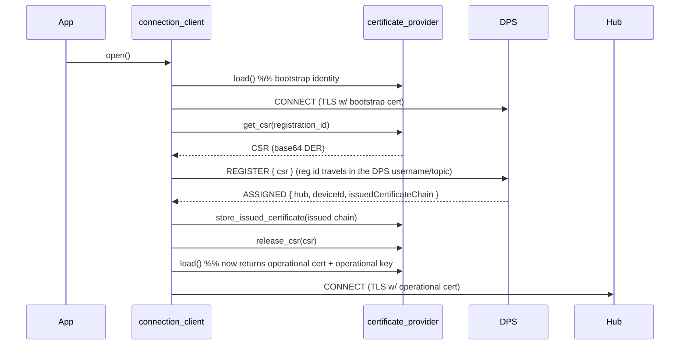

<!-- Copyright (c) Microsoft. All rights reserved.
     Licensed under the MIT license. See LICENSE file in the project root for full license information. -->

# Certificate Management — CSR-based Operational-Cert Enrollment via DPS

The key words "MUST", "MUST NOT", "REQUIRED", "SHALL", "SHALL NOT", "SHOULD", "SHOULD NOT", "RECOMMENDED", "MAY", and "OPTIONAL" in this document are to be interpreted as described in [RFC 2119](https://datatracker.ietf.org/doc/html/rfc2119).

> **Naming:** types use the current SDK convention — no `_t` suffix, struct/enum
> tags match the type name, and callbacks use the `_callback` suffix.

## Status

Implemented. The certificate-provider vtable is versioned to v2 with the
role-aware `load()`, CSR hooks (`get_csr`/`release_csr`) and issued-cert storage;
the connection client performs DPS CSR enrollment (opt-in via
`dps.request_operational_certificate`) and MQTTv3 hub runtime renewal
(`az_iot_connection_client_send_csr`). An optional OpenSSL 3.0+ "managed"
provider (`az_iot_certificate_provider_managed`), unit + E2E tests, and
`samples/authentication/` ship alongside.

Non-extractable key custody (D8) is implemented **for the Paho adapter via the
key-reference route**: `az_iot_mqtt_tls_options` carries `client_key_uri`,
`crypto_engine_id` and a `sign`/`sign_ctx` pair, the connection client
propagates them on both connect paths, and the Paho adapter resolves the URI
through the named OpenSSL 3.x provider so the TLS handshake signs inside the
hardware. The `sign()` hook is carried to the adapter but has no Paho
implementation: Paho takes its client key as a file path and exposes no
`SSL_CTX` and no key callback, so it refuses a `sign()`-only credential rather
than connecting without a client key. That route is for BYO adapters. The
`rust_mqtt` adapter has no TLS credential handling at all and is not covered.

Realizes the "cert management" open question in `docs/design.md` (§4.3) and the
flow in `docs/dps-integration.md` ("REGISTER + CMS" → "RESULT (… Issued Cert)").

## Abstract

Today the C connection client uses a single, static X.509 certificate for both the
DPS connection and the IoT Hub connection. The pluggable `az_iot_certificate_provider`
hook only *loads* pre-existing PEM material; nothing generates a certificate signing
request (CSR), sends one to DPS, or consumes an issued certificate.

This document designs the API to add **CSR-based certificate management** (a.k.a.
operational-certificate enrollment): the device keeps a **bootstrap identity cert** to
authenticate to DPS, sends a **CSR** in the registration request, receives an **issued
operational cert** from the DPS-linked CA, and connects to the assigned Hub with that
operational cert. The private key for the operational cert never leaves the device.

## Flow



The extensibility seam is the **certificate provider**, because the operational
private-key custody (TPM / HSM / file) and the issued-cert persistence both belong to
whatever owns key material.

## Scope

- **In scope:** X.509 bootstrap identity authenticating to DPS; CSR generation; issued
  operational cert used for the Hub connection; persistence/reuse of the issued cert;
  runtime Hub-side certificate **renewal** (see *Runtime Hub-side certificate renewal*).
- **Out of scope:** TPM / symmetric-key *attestation* for the DPS leg (this design assumes
  an X.509 bootstrap identity). Renewal *scheduling/policy* (when to re-enroll before
  expiry) is enabled by the hooks below but left to the provider/app.

---

## Change 1 — New value types

New in `inc/azure/iot/az_iot_certificate_provider.h`. Small value structs, wrapped for
future-proofing (expiry, key handles) and for consistency with
`az_iot_certificate_material`. **Encoding matches the service / C# contract**: the CSR
is base64-encoded PKCS#10 DER (no PEM headers/newlines), and the issued material is a
**chain** (leaf first).

```c
/* PKCS#10 certificate signing request produced by the provider.
 * Base64-encoded DER, no PEM headers/newlines — matches the DPS register "csr"
 * field and the Hub "$iothub/credentials" CSR "csr" field. */
typedef struct az_iot_certificate_signing_request
{
    const char* csr_base64;
} az_iot_certificate_signing_request;

/* Operational certificate chain issued by the DPS- or Hub-linked CA (leaf first).
   Each entry is base64 DER (as received on the wire) delivered as a zero-copy
   az_span into the client's receive buffer; a provider that persists the chain
   PEM-wraps each entry. Valid only for the store/callback call. */
typedef struct az_iot_issued_certificate
{
    const az_span* certificates;   /* base64 DER certs, leaf first */
    size_t         count;
} az_iot_issued_certificate;
```

## Change 2 — Extend the certificate-provider vtable (+ `load()` semantics)

Append three **OPTIONAL** hooks to `az_iot_certificate_provider_vtable`. Appending is
source-compatible: the in-tree PEM provider uses a positional initializer
`{ pem_load, pem_release, pem_deinit_vtable }`, and C zero-fills the trailing slots to
`NULL` — so it keeps compiling untouched and simply reports "no CSR support".

```c
typedef struct az_iot_certificate_provider_vtable
{
    /* --- v1: unchanged --- */
    az_iot_result (*load)   (az_iot_certificate_provider* self, az_iot_certificate_material* out_material);
    void            (*release)(az_iot_certificate_provider* self, az_iot_certificate_material* material);
    void            (*deinit) (az_iot_certificate_provider* self);

    /* --- v2: CSR-based enrollment (certificate management). Optional. --- */
    /* NULL get_csr => provider does not support enrollment. */
    az_iot_result (*get_csr)(
        az_iot_certificate_provider* self,
        const char* subject_common_name,          /* SDK passes registration_id; CSR CN MUST be this */
        az_iot_certificate_signing_request* out_csr);

    void            (*release_csr)(
        az_iot_certificate_provider* self,
        az_iot_certificate_signing_request* csr);

    az_iot_result (*store_issued_certificate)(
        az_iot_certificate_provider* self,
        const az_iot_issued_certificate* issued);
} az_iot_certificate_provider_vtable;
```

**Revised `load()` contract** (documented, no signature change): returns the *best
currently-available* client identity —

- if an issued operational cert has been stored (this run, or persisted from a prior
  run) → `{ trusted_ca, issued_cert, operational_key }`;
- otherwise → `{ trusted_ca, bootstrap_cert, bootstrap_key }`.

This is why the existing hub-connect path in `src/core/connection_client.c`
(`start_connect_attempt`) needs **no change** — it re-calls `load()` and transparently
gets the operational material.

## Change 3 — Connection client DPS option (opt-in)

One new field in the `dps` sub-struct of `az_iot_connection_client_options` in
`inc/azure/iot/az_iot_connection_client.h`:

```c
struct
{
    const char* global_endpoint;
    const char* id_scope;
    const char* registration_id;
    bool        request_operational_certificate;   /* NEW: CSR-based enrollment */
} dps;
```

Validation (at `open()`): if `request_operational_certificate == true` but
`provider->vtable->get_csr == NULL` → return `AZ_IOT_ERR_NOT_SUPPORTED`. Reuses existing
result codes (`AZ_IOT_ERR_DPS`, `AZ_IOT_ERR_NOT_SUPPORTED`); no additions to
`inc/azure/iot/az_iot_result.h`.

## Change 4 — Reference provider that actually does CSR

The PEM loader (`certificate_provider_pem`) stays a static loader (documented "no
generation"). Add a new provider `az_iot_certificate_provider_managed`, backed by the
existing OpenSSL crypto adapter under `adapters/su/crypto_openssl/`, built only when
OpenSSL is available. New header `inc/azure/iot/az_iot_certificate_provider_managed.h`:

```c
typedef struct az_iot_certificate_provider_managed_options
{
    /* Bootstrap identity — authenticates the DPS TLS connection. Required. */
    const char* bootstrap_cert_pem_path;
    const char* bootstrap_key_pem_path;
    const char* bootstrap_key_password;    /* may be NULL */
    const char* trusted_ca_pem_path;       /* may be NULL */

    /* Operational private key the issued cert binds to. Loaded if present,
     * else generated and written here (if the path is writable). Required. */
    const char* operational_key_pem_path;

    /* Persist the DPS-issued operational cert so it survives restarts and the
     * device can skip re-enrolling every boot. NULL = memory-only. */
    const char* issued_cert_pem_path;      /* may be NULL */
} az_iot_certificate_provider_managed_options;

typedef struct az_iot_certificate_provider_managed
{
    az_iot_certificate_provider base;    /* MUST be first (vtable pointer) */
    void* impl;                            /* internal (OpenSSL state) */
} az_iot_certificate_provider_managed;

az_iot_result az_iot_certificate_provider_managed_init(
    az_iot_certificate_provider_managed* provider,
    const az_iot_certificate_provider_managed_options* opts);

void az_iot_certificate_provider_managed_deinit(
    az_iot_certificate_provider_managed* provider);
```

Behavior: `get_csr()` builds a PKCS#10 over the operational key with
`CN=registration_id`; `store_issued_certificate()` writes to `issued_cert_pem_path` and
flips `load()` to operational material; on init, if a valid non-expired issued cert
already exists on disk it MAY present it immediately and skip enrollment (the rotation
story).

---

## Internal (non-public) changes

Not part of the public API; listed for implementation context.

- `dps_do_register_publish` (`src/core/connection_client.c`): when enrollment is on,
  call `get_csr(registration_id)` and send JSON body `{"csr":"<base64 DER>"}` (plus an
  optional `"payload"` for the model id) instead of the current `payload = NULL`. The
  registration id is **not** in the body — it travels in the DPS username/topic as today.
  Because the CSR is base64, no JSON string-escaping of PEM newlines is needed.
- ASSIGNED branch of `on_dps_mqtt_event`: extract the top-level `issuedCertificateChain`
  (matches C# `DeviceRegistrationResult.IssuedClientCertificateChain`), call
  `store_issued_certificate()`, then `release_csr()`. If the vendored
  `az_iot_provisioning_client` does not surface that field, parse it from the raw
  response payload the handler already holds.
- `dps_start()` / `start_connect_attempt()` TLS wiring: **unchanged** (the `load()`
  contract does the identity switching).

---

## Sample — before / after

Only the cert-provider setup and one option line change; the entire
connect / `do_work` / send flow stays identical (enrollment is transparent). Sketch of
the delta against the certificate setup in `samples/unified/telemetry/main.c`
(which sets the DPS fields through `sample_apply_dps_options()`):

```c
    /* --- BEFORE: static cert used for both DPS and Hub --- */
    az_iot_certificate_provider_pem certs;                         // in sample_state_t

    az_iot_certificate_provider_pem_options pem = az_iot_certificate_provider_pem_options_default();
    pem.trusted_ca_pem_path  = cfg.ca;
    pem.client_cert_pem_path = cfg.cert;
    pem.client_key_pem_path  = cfg.key;
    az_iot_certificate_provider_pem_init(&s.certs, &pem);

    az_iot_connection_client_options copts = az_iot_connection_client_options_default();
    copts.dps.id_scope = cfg.id_scope;
    copts.dps.registration_id = cfg.reg_id;
    copts.certificate_provider = &s.certs.base;
```

```c
    /* --- AFTER: CSR-based enrollment (operational cert from DPS) --- */
    az_iot_certificate_provider_managed certs;                   // in sample_state_t

    az_iot_certificate_provider_managed_options mopts = {
        .bootstrap_cert_pem_path  = cfg.cert,       /* identity cert to auth to DPS   */
        .bootstrap_key_pem_path   = cfg.key,
        .trusted_ca_pem_path      = cfg.ca,
        .operational_key_pem_path = cfg.op_key,     /* load-or-generate operational key */
        .issued_cert_pem_path     = cfg.op_cert };  /* persisted issued cert (reuse)    */
    az_iot_certificate_provider_managed_init(&s.certs, &mopts);

    az_iot_connection_client_options copts = az_iot_connection_client_options_default();
    copts.dps.id_scope = cfg.id_scope;
    copts.dps.registration_id = cfg.reg_id;
    copts.certificate_provider = &s.certs.base;
    copts.dps.request_operational_certificate = true;   /* <-- the only behavioral opt-in */
```

`sample_state_destroy()` swaps `..._pem_deinit` → `..._managed_deinit`; `sample_config_t`
gains `op_key` / `op_cert` paths. Everything else (factory registration, `open()`,
`do_work()` loop, telemetry send) is unchanged.

---

## Runtime Hub-side certificate renewal (parity with C#)

DPS-time enrollment (above) issues the *first* operational cert. To **renew** before
expiry without re-provisioning through DPS, the C# SDK exposes a device-initiated,
Hub-side CSR over MQTT — this design should mirror it.

- **Topics** (MQTTv3 Hub): publish `$iothub/credentials/POST/issueCertificate/?$rid=<id>`,
  subscribe `$iothub/credentials/res/#`.
- **Two-phase**: `202 Accepted` (Hub started signing) → `200` (issued chain delivered).
- **Body**: `{ "id": "<deviceId>", "csr": "<base64 DER>", "replace": "*"|null }`.
- **Idempotency / recovery**: caller-chosen `request_id` (reuse to resubmit after a
  dropped connection); `replace = "*"` supersedes an active request.
- **Structured errors** (pin to API version `2025-08-01-preview`): the SDK routes purely
  on the response topic's status (`202`/`200`/other) and surfaces the JSON body's
  `errorCode`, `trackingId`, `correlationId`, `retryAfter`, and (on conflict)
  `info.requestId` / `info.operationExpires`. Only the **transient** codes below drive SDK
  retry classification; all others are surfaced verbatim for the caller to act on.

  | Code | Meaning | Transient |
  |---|---|---|
  | `400040` | CSR decode / verification failed | no |
  | `409005` | Conflict — another operation active (use `replace`) | no |
  | `412001` | No pending request matches `replace` | no |
  | `429002` / `429003` | Throttled | **yes** (1s initial backoff) |
  | `503001` | Service unavailable | **yes** (5s initial) |
  | `500001` | Server error | **yes** (5min initial) |

  > **Note:** the reference implementation's spec doc (`csr-scenarions.md`, generated from
  > a 2026-01-30 test run) lists an *older* set (`400004/400006/400037/409004/412001`)
  > that disagrees with the shipping code (`400040`/`409005`). Treat the code + API
  > version above as authoritative and confirm against the service before freezing.
- **MQTTv5**: not defined yet (C# throws `NotImplementedException` for the MQTTv5
  path); MQTT v5 topic shape TBD.

Proposed C surface (callback-driven to fit the single-threaded `do_work()` model):

```c
typedef enum
{
    AZ_IOT_CSR_ACCEPTED = 0,   /* 202: Hub accepted, signing in progress */
    AZ_IOT_CSR_ISSUED,         /* 200: issued chain delivered            */
    AZ_IOT_CSR_FAILED          /* rejected/failed (see status + code)    */
} az_iot_csr_event_kind;

typedef struct
{
    az_iot_csr_event_kind kind;
    az_iot_result         status;         /* AZ_IOT_OK unless FAILED       */
    int32_t                 service_code;   /* e.g. 409005; 0 if none         */
    uint32_t                retry_after_s;  /* 0 if none                      */
    const az_iot_issued_certificate* issued;  /* non-NULL on ISSUED         */
} az_iot_csr_event;

typedef void (*az_iot_csr_callback)(const az_iot_csr_event* evt, void* user_ctx);

/* Device-initiated renewal against the connected Hub. request_id NULL => the
 * SDK generates one; pass a prior id to resubmit. replace NULL, or "*" to
 * supersede any active request. */
az_iot_result az_iot_connection_client_send_csr(
    az_iot_connection_client* client,
    const az_iot_certificate_signing_request* csr,
    const char* request_id,
    const char* replace,
    az_iot_csr_callback cb,
    void* user_ctx);
```

After `AZ_IOT_CSR_ISSUED`, the new chain is persisted and the client reconnects with it.
Two integration options, mirroring the two ownership models:

- **App-owned (C# style):** app supplies `csr` bytes, receives the chain in the callback,
  swaps certs, and calls `close()` / `open()` — explicit, no provider needed.
- **Provider-owned (this design):** the client calls `get_csr()` /
  `store_issued_certificate()` around the exchange and re-`load()`s, so renewal is
  transparent (same seam as the DPS path).

---

## Cross-SDK alignment (C# / `dotnet/`)

The C# SDK already ships a `CertificateManagement/` module
(`dotnet/src/Microsoft.Azure.Devices.Client/ConnectionClient.cs`,
`.../CertificateManagement/CertificateSigningOperation.cs`). It is broader than the v1
proposed here — it has **both** CSR paths:

1. **DPS provisioning-time CSR** — `ProvisioningSettings.ProvisioningCertificateSigningRequest`
   → register body `{ "csr": … }` → result `issuedCertificateChain` → surfaced as
   `ConnectionContext.IssuedClientCertificates`. Same flow as this doc. *(Currently only
   half-wired in C#: `ConnectionClient.ProvisionAsync` hardcodes `csr = null` — a TODO on
   their side — but the API and models exist.)*
2. **Runtime Hub-side renewal** — `SendCertificateSigningRequestAsync` (see previous
   section). This doc adds `az_iot_connection_client_send_csr()` to match.

**Ownership model differs** — the biggest divergence to decide on:

| Aspect | C# SDK (`dotnet/`) | This design (C) |
|---|---|---|
| Generates the CSR | **App** (`CertificateRequest`) | **Provider** (`get_csr`) |
| Holds the private key | App, inside `X509Certificate2` (may be HSM via CNG) | Provider (TPM/HSM/file behind vtable) |
| Persists the issued cert | App (writes files) | Provider (`store_issued_certificate`) |
| Cert swap after issuance | Explicit disconnect + rebuild auth + reconnect | Transparent (`load()` returns operational) |
| Request idempotency | `RequestId` + `Replace="*"` | `request_id` + `replace` (renewal path) |
| CSR encoding | base64 DER | base64 DER (corrected) |
| Issued shape | chain | chain (corrected) |

C# is *data-in/data-out* (app owns crypto; SDK is a transport); this design is
*provider-owns-crypto* (the vtable hides key custody), which suits C/embedded HSM/TPM.
Recommendation: **keep the provider seam** but (a) match the wire contract (done above),
(b) add the runtime-renewal API, and (c) optionally also expose the app-owned entry point
for parity (see decision 9).

### Reference implementation & lessons applied

The **most complete** implementation is the legacy `azure-iot-sdk-csharp` repo on branch
`feature/iot-csr-preview` (not the newer `dotnet/` in this repo, which is still partial):
it ships **both** DPS issuance and Hub re-issuance with full error handling, a 26-scenario
spec (`iothub/device/src/csr-scenarions.md`), and MQTT-handler unit tests. Treat it as the
behavioral reference. Concrete fixes this C design adopts where that implementation left
gaps:

1. **Cancellation + local timeout.** C# checks the token only at submit time and never
   registers it against the pending operation, so `Completed` can hang until the
   service-side `operationExpires` (~12h). Our `send_csr` MUST support cancel/timeout via
   `do_work()` and fail the callback with `AZ_IOT_ERR_TIMEOUT`.
2. **SUBACK before PUBLISH.** C# writes the `$iothub/credentials/res/#` subscribe packet
   without awaiting the SUBACK before publishing the CSR — the first response can be lost
   (its own spec flags "send before subscribe → no response"). Our flow subscribes, waits
   for SUBACK, then publishes.
3. **Client-side CSR validation.** C# only null/empty-checks; validate base64 and the
   **≤8KB** limit locally to fail fast instead of round-tripping a `400040`.
4. **Auto-populate the device id.** C# requires the app to pass `id` and rejects a
   mismatch with the authenticated identity. The C client already knows the connected
   `client_id`, so it fills the `"id"` field itself.
5. **Deterministic handler cleanup.** C# removes its inbound delegate only when
   `Completed` finishes, leaking it (and its captured state) on a stuck 202. Our single
   pending-CSR slot is cleared on ACCEPTED-timeout, ISSUED, and FAILED alike.
6. **Pinned error codes.** Use the `2025-08-01-preview` table above (not the older spec
   codes); only the transient set drives retry.

---

## Device certificate storage methods

How device key/cert storage backends map onto the provider seam. File and in-image are
already covered; HSM/TPM needs one addition.

| Storage method | Example | Fit | Gap |
|---|---|---|---|
| **File on disk (pinned)** — PEM/PKCS#12 at a fixed path | Linux gateway | `certificate_provider_pem` + `az_iot_certificate_material.*_path`; "pinned" = fixed `trusted_ca_path` | none |
| **Compiled into firmware image** (`const` in flash) | MCU, no filesystem | `az_iot_certificate_material.*_pem` string blobs from a custom provider | none |
| **OS keystore** — Windows Cert Store, macOS Keychain | Desktop/server | Custom provider; OK if key is exportable to PEM | else → HSM row |
| **HSM / TPM / secure element** — key non-extractable | ATECC608, TPM 2.0, PKCS#11 | Custom provider; `get_csr` signs *inside* the device so the key never leaves | **key reference (below)** |
| **Remote/cloud key** — Key Vault, KMS | rare on-device | Only via a `sign()` callback model | callback (below) |

**The gap (now closed for Paho):** `az_iot_certificate_material` used to express the
private key only as PEM or a file path. An HSM key is a *handle*, not a PEM — and the
**TLS handshake** (not just the CSR) must sign with it. .NET hides this inside
`X509Certificate2` (a CNG handle); C has no universal object, so the design needs an
explicit key-reference escape hatch:

```c
typedef struct az_iot_certificate_material
{
    /* ... existing PEM/path fields ... */

    /* Non-extractable key backends. When set, client_key_pem/path are NULL and the
     * TLS adapter uses this reference instead. */
    const char* client_key_uri;    /* e.g. PKCS#11: "pkcs11:token=...;object=..." */
    const char* crypto_engine_id;  /* OpenSSL ENGINE/provider id: "pkcs11", "tpm2", ... */
} az_iot_certificate_material;
```

Two implications, and where each stands:

- The **MQTT/TLS adapter must honor it**. Done for Paho. The joint
  `certificate_material` + adapter change landed: `az_iot_mqtt_tls_options` carries
  `client_key_uri` / `crypto_engine_id` / `sign` / `sign_ctx`,
  `connection_client.c` fills them on both the DPS/bootstrap connect and the
  operational/reconnect connect, and
  [`az_iot_paho_key_custody.c`](../../adapters/paho/az_iot_paho_key_custody.c) loads the
  named OpenSSL 3.x provider, resolves the URI through it, and hands Paho a key
  *reference* (the provider's own PEM form, or the standard `PKCS#11 PROVIDER URI`
  block) rather than key bytes — it refuses outright to write anything that turns out to
  be extractable. `rust_mqtt` is **not** covered: it has no TLS credential handling.
- Where no engine abstraction exists, the fallback is a **`sign()` callback** on the
  provider vtable that the TLS layer invokes. The SDK carries it end to end and any BYO
  adapter can consume it (`samples/authentication/hsm_sign_callback` shows exactly
  where). **Paho cannot**: it accepts a client key only as a file path and exposes
  neither the `SSL_CTX` nor a key hook (upstream Paho has none either), so it fails such
  a credential with `AZ_IOT_ERR_NOT_SUPPORTED` instead of connecting without a key.

Two guards were added with it, because the previous failure mode was a NULL private key
dying inside the handshake with no useful diagnostic:

- `AZ_IOT_ERR_CREDENTIAL_INCOMPLETE` at `open()` for a client certificate with no key in
  any form, and for a key URI with nothing naming the provider that owns it.
- The Paho adapter's TLS decision now counts a key reference as TLS material, so a
  URI-only credential cannot fall through to a key-less connect.

---

## Decisions

All nine open questions are resolved below (recommendations accepted 07/03/2026). The
platform matrix we must support — **file/pinned · compiled-in image · OS keystore ·
HSM/TPM/secure-element (PKCS#11) · remote/cloud key** — pushes four items from
"maybe/later" to **v1**: the vtable version field (D1), the key-reference + `sign()` hook
(D8), Hub-side renewal (D7), and the layered ownership model (D9).

1. **Vtable ABI — use a `version` field (not append + NULL-check).** A `uint32_t version`
   is the first vtable member; the client gates new slots on it. Once HSM *vendors* ship
   providers compiled against a different SDK version than the app, reading past a shorter
   vtable is UB. One-time cost, every future hook safe. *Supersedes the "append +
   NULL-check" note in Change 2.*
2. **Opt-in — explicit `bool request_operational_certificate` + capability check.** A
   provider may support CSR yet a given connection may already hold a valid operational
   cert. Explicit flag; return `AZ_IOT_ERR_NOT_SUPPORTED` when the provider lacks
   `get_csr`.
3. **`load()` — single method with an explicit role argument (not dual-return).**
   `load(self, role, &out)` where `role` is `AZ_IOT_CRED_BOOTSTRAP` or
   `AZ_IOT_CRED_OPERATIONAL`. Hidden phase-state forces every provider (incl. simple
   file/in-image ones) to track "which identity"; an explicit role keeps one slot and is
   stateless-friendly (a file provider maps both to the same material, or returns
   `AZ_IOT_ERR_NOT_FOUND` for OPERATIONAL until one is stored). *Supersedes the dual-return
   contract in Change 2.*
4. **App callback — include `on_operational_certificate_issued` (optional).** Needed where
   the *app* owns persistence (OS keystore, remote key, data-in/out per D9) or must react
   (inventory, trigger reconnect). Decoupled from provider storage.
5. **Reference provider — ship both: hooks in core, OpenSSL `managed` provider as an
   optional adapter.** The legacy SDK's lesson is that the fork-me reference is what gets
   used; ship a real one for a correctness baseline, but gate it on OpenSSL so
   BearSSL/mbedTLS/secure-element-only builds are not forced to pull it.
6. **Attestation — X.509 bootstrap for v1, architecture open for TPM/symmetric key.**
   Scope the *feature* to X.509 (matches C# + the material struct), but route bootstrap
   auth through the provider so a future TPM/SAS provider can supply a token instead of a
   cert. Do not bake "bootstrap == X.509 cert" into the connection client.
7. **Runtime Hub-side renewal — in v1.** DPS-only issuance forces a full re-provision for
   every rotation (often disallowed by the enrollment). Certs expire; long-lived devices
   must renew. Reuses the CSR/issued-cert types and provider hooks, so incremental cost is
   low. Ship `az_iot_connection_client_send_csr()`.
8. **HSM key reference — add now: key-reference fields *and* a `sign()` vtable slot.**
   This is exactly where the legacy SDK fails (its X.509 key is an extractable `char*`).
   Non-extractable keys need (a) `client_key_uri` + `crypto_engine_id` for stacks with an
   engine/provider abstraction (OpenSSL + PKCS#11 / tpm2), and (b) an optional provider
   `sign()` hook the TLS layer calls for stacks without one (BearSSL/custom). Reserve both
   in the versioned vtable now; implement per-adapter incrementally.

   **Adapter status.** `paho`: (a) implemented — the URI is resolved through the OpenSSL
   3.x provider named by `crypto_engine_id` and the handshake signs in hardware; (b) not
   implementable on stock Paho, which exposes no `SSL_CTX` and no key callback, so it is
   refused with a diagnostic rather than silently ignored. `rust_mqtt`: neither, and no
   TLS credential handling to add them to. A BYO adapter gets both through
   `az_iot_mqtt_tls_options` with no dependency on the certificate-provider ABI.

   The provider must also register a DECODER for its own key-reference PEM, since that is
   what `SSL_CTX_use_PrivateKey_file` resolves the file with. The adapter performs that
   decode itself before writing the file, so an installation without one is refused at
   connect time with a message naming the requirement rather than failing inside the
   handshake.

   Legacy OpenSSL `ENGINE`s are deliberately not attempted: they are deprecated in
   OpenSSL 3.0, and a key an ENGINE returns is a legacy object with no reference form, so
   it cannot be expressed as the PEM file that is the only thing Paho can be handed. An
   ENGINE-only stack gets `AZ_IOT_ERR_NOT_SUPPORTED` naming the id.
9. **Ownership — support both, layered.** Core primitive = **app-owned data-in/data-out**
   (`send_csr(csr_bytes)` → issued-cert callback; DPS accepts a caller CSR). The
   **provider-owns-crypto** hooks (`get_csr` / `store_issued_certificate`) are a thin
   custody layer *implemented on top of* that primitive — best for bare-metal/HSM and for
   making renewal transparent. One model cannot span secure-elements to cloud keys
   ergonomically; layering avoids duplicated logic.

### Consolidated provider interface (supersedes Change 1 & 2)

```c
/* Which identity load() should return (D3). */
typedef enum
{
    AZ_IOT_CRED_BOOTSTRAP = 0,   /* identity that authenticates to DPS         */
    AZ_IOT_CRED_OPERATIONAL      /* DPS/Hub-issued operational cert, once held  */
} az_iot_cert_role;

#define AZ_IOT_CERTIFICATE_PROVIDER_VTABLE_VERSION 2u

typedef struct az_iot_certificate_provider_vtable
{
    uint32_t version;   /* = AZ_IOT_CERTIFICATE_PROVIDER_VTABLE_VERSION (D1) */

    /* v1 core */
    az_iot_result (*load)(az_iot_certificate_provider* self,
                          az_iot_cert_role role,                 /* D3 */
                          az_iot_certificate_material* out_material);
    void          (*release)(az_iot_certificate_provider* self, az_iot_certificate_material* material);
    void          (*deinit)(az_iot_certificate_provider* self);

    /* v2 CSR enrollment (optional; NULL get_csr => not supported) */
    az_iot_result (*get_csr)(az_iot_certificate_provider* self,
                             const char* subject_common_name,
                             az_iot_certificate_signing_request* out_csr);
    void          (*release_csr)(az_iot_certificate_provider* self, az_iot_certificate_signing_request* csr);
    az_iot_result (*store_issued_certificate)(az_iot_certificate_provider* self, const az_iot_issued_certificate* issued);

    /* v2 non-extractable key custody (optional; D8). When present the TLS
     * adapter calls sign() instead of reading a private key. */
    az_iot_result (*sign)(az_iot_certificate_provider* self,
                          const uint8_t* digest, size_t digest_len,
                          uint8_t* out_sig, size_t out_sig_cap, size_t* out_sig_len);
} az_iot_certificate_provider_vtable;
```

---

## Alignment with `azure-iot-sdk-c` (legacy C HSM model)

The legacy C SDK (`azure-iot-sdk-c`) solved device-credential storage with a similar
seam — worth comparing since it shipped to a large fleet.

- **Model:** a vtable per attestation type (`HSM_CLIENT_X509_INTERFACE` with
  `create`/`destroy`/`get_cert`/`get_key`/`get_common_name`; separate TPM and
  symmetric-key interfaces). Selected as a **process-global singleton at *compile time***
  via `prov_dev_security_init(SECURE_DEVICE_TYPE_X509|_TPM|_SYMMETRIC_KEY)` + CMake
  `hsm_type_*`. The "default" is a copy-paste `custom_hsm_example.c` that returns hardcoded
  in-memory cert/key strings.

**Adopt:**

- The `create()`/`destroy()` **handle** for per-instance state — we already have it via the
  provider struct + `deinit`.
- A **`get_common_name` accessor** — let the provider (which owns the key) declare the CN
  used as the DPS registration id, rather than trusting the caller to match it.
- A shipped **in-tree reference implementation** — their `custom_hsm_example` is what people
  fork; mirrors D5.

**Reject (why ours is better for this feature):**

- **Global singleton + compile-time selection** → we use a **per-instance, runtime**
  provider (multi-identity gateways, test harnesses, runtime choice).
- **Extractable X.509 key** (`get_key` returns a `char*` PEM; no sign hook) → cannot support
  non-extractable secure-element/PKCS#11/TPM-TLS keys. Our D8 `sign()` hook + key-reference
  fixes exactly this.
- **No CSR / certificate management** → the legacy SDK has none; it is the whole point here.

Verdict: same seam, simpler contract, but strictly weaker on runtime pluggability,
non-extractable-key custody, and CSR — the three axes this feature needs.

---

## Samples

All scenarios above get a dedicated, single-purpose sample under a new cross-cutting
**`samples/authentication/`** group (auth is orthogonal to the feature clients like
`unified/telemetry`, `mqttv5/telemetry`, ...). Each sample reuses `samples/common/sample_utils` and
differs only in the credential-setup block, so they stay small and diff-able.

```
samples/authentication/
  README.md                    scenario matrix: provider x flow x platform
  dps_csr_managed/             SHIPS - D9 provider-owned: `managed` provider, DPS issuance
  hub_renew/                   SHIPS - D7 provider-owned transparent renewal
  custom_certificate_provider/ SHIPS - D9 app-owned: app builds the CSR, data-in/out
  hsm_pkcs11/                  SHIPS - D8 key-reference URI (non-extractable), Paho, either hub generation
  hsm_sign_callback/           SHIPS - D8 provider sign() hook (stack without an engine)
  custom_provider_template/    SHIPS - fork-me stub (mirrors legacy custom_hsm_example)

  x509_file/                   planned - baseline covered today by the feature samples,
                               so it has no folder of its own
  x509_in_image/               planned - static cert compiled-in as const PEM
  dps_csr_app_owned/           planned - narrower cut of custom_certificate_provider
  hub_renew_app_owned/         planned - D7 app-owned explicit disconnect/reconnect
  hub_renew_recovery/          planned - resubmit same request_id; 409005 -> replace="*"
  os_keystore/                 planned - optional, platform-gated (Windows cert store)
```

`README.md` carries a matrix mapping each folder to: credential source (file / image /
HSM / app), flow (static / DPS-issue / hub-renew), ownership model (provider / app), and
supported platforms. CI builds every sample that exists; the `planned` rows above are the
outstanding ones and none of them is a D8 scenario.

## E2E tests

Every CSR scenario needs an e2e test. The fixture is
[`iot-sdks-e2e-fx`](https://github.com/Azure/iot-sdks-e2e-fx) — `scripts/Azure.Iot.Sdk.Test.psm1`
already provides most of the scaffolding:

- **Reuse (exists):** `New-X509CertificateSigningRequest`, `New-Certificate` (CA-signing
  with a signature generator), RSA/ECDSA key gen + PEM export, `DpsX509EnrollmentGroupInfo`,
  root-CA handling (`RootCaCertificates` / `AddRootCaCertificate`), `LinkedIotHubs`.
- **Add (new):** enrollment-group config with a **linked CA enabled for operational-cert
  issuance**; provision a **MQTTv5/P-SKU hub** with cert issuance on API `2025-08-01-preview`.
- **Done:** SoftHSM2 for the PKCS#11 custody tests. The e2e legs run on GitHub-hosted
  runners rather than a Docker image, so it is provisioned per job:
  [`eng/setup-softhsm.sh`](../../eng/setup-softhsm.sh) initializes a token, imports the
  device key CI already generates, **deletes the on-disk copy**, and prints the URI.
  [`eng/setup-pkcs11-provider.sh`](../../eng/setup-pkcs11-provider.sh) builds the OpenSSL
  provider the handshake signs through — from source, and pinned, because the provider has
  to register a DECODER for its own key-reference PEM and distributions lag (Ubuntu 24.04
  packages 0.3, which does not; 0.5 is the floor). The Linux e2e leg and the coverage job
  both use the pair.

Scenario coverage (mirrors `csr-scenarions.md` where applicable):

| Group | Cases |
|---|---|
| **DPS issuance** | happy path (CSR → `issuedCertificateChain` → connect w/ operational cert); CN ≠ registration id → reject; enrollment without CSR (chain null) |
| **Hub renewal** | happy path `202`→`200` then reconnect; CSR validation (empty / >8KB / bad base64 / malformed PKCS#10); device-id mismatch; `replace=<rid>` / `replace="*"` / replace-not-found (`412001`); conflict `409005` then resolve; subscription persistence (unsub after 202, resubscribe, `clean_session`); reconnect mid-op → resubmit same `request_id`; throttling `429002/429003` transient retry |
| **Storage / custody** | run DPS-issue + hub-renew with (a) file `managed` provider, (b) app-owned data-in/out, (c) *CI-gated* PKCS#11 via SoftHSM — **(c) written, bring-up not finished**: [`e2e_custody_test.c`](../../tests/e2e/tests/e2e_custody_test.c) provisions through DPS, connects, sends telemetry the service side observes, and reconnects, all with a key that only exists inside the token. It runs on the nightly schedule and on demand, not on pull requests, until a nightly comes back green. The handshake used to end in Paho's `TCP/TLS connect failure` with no OpenSSL reason reaching the log; the reason is now logged, and it was `error:40800054:pkcs11:p11prov_GetOperationState:...:Error returned by C_GetOperationState`. The PKCS#11 provider offers digests as well as key operations, so it was servicing the TLS handshake transcript hash; TLS 1.2 duplicates that digest context, the provider duplicates it with `C_GetOperationState`, and SoftHSM2 does not support that on a digest session. TLS 1.3 does not duplicate the context, which is why the same credential worked against one endpoint and failed against another. `eng/setup-softhsm.sh` now emits an OpenSSL configuration that activates the provider alongside the default one, and exports `OPENSSL_CONF`. Verified against a **live IoT Hub** over TLS 1.2 with the device key held only in a SoftHSM2 token: a provider loaded at run time by the adapter fails with the error above, a configuration-activated provider reaches CONNECTED — 3 runs each, with a plain-PEM control connecting over the same path to show the rig itself was sound. `pkcs11-module-quirks = no-deinit` is required with it: without that line the client connects and then crashes when OpenSSL tears the provider down. Blocking the provider's digest operations is kept as a precaution for tokens that advertise digests, but is inert on SoftHSM2 and is not what fixes the handshake. The mechanism itself is pinned by the unit-level custody suite, which drives the same adapter code against a real SoftHSM2 token and feeds the result to `SSL_CTX_use_PrivateKey_file` — verbatim what Paho does. Hub-renewal with an in-token key is separately outstanding: it needs a CSR signed inside the token, which is the integrator's `get_csr()`. |

The device side exercises each via the matching `samples/authentication/*` binary (or a
dedicated e2e test app), driven by the in-process all-C e2e suite (`tests/e2e`).

## Version

- 07/01/2026: Created by ewertons.
- 07/02/2026: Added cross-SDK alignment (C# / `dotnet/`), runtime Hub-side renewal, and
  device certificate storage methods (incl. HSM/TPM key reference); corrected the DPS
  wire format (`csr` base64 DER, `issuedCertificateChain`). By ewertons.
- 07/02/2026: Reviewed the complete reference implementation (`azure-iot-sdk-csharp`
  `feature/iot-csr-preview`); pinned the Hub-renewal error-code table to API
  `2025-08-01-preview` + transient set, and added "Reference implementation & lessons
  applied". By ewertons.
- 07/03/2026: Resolved all open questions into **Decisions** (D1–D9); added the legacy
  `azure-iot-sdk-c` HSM comparison, a consolidated provider interface, and **Samples** and
  **E2E tests** plans. By ewertons.
- 07/03/2026: Rebased the cert work onto `main` (independent of the drop-`_t` rename); doc
  and code use `main`'s `_t` naming. Foundation (versioned provider vtable) verified on
  MSVC. By ewertons.
- 08/30/2026: Implemented D8 end to end for the Paho adapter: key-reference fields and the
  `sign()` hook now reach the adapter on both connect paths,
  `AZ_IOT_ERR_CREDENTIAL_INCOMPLETE` rejects a credential that cannot sign, and the
  handshake signs inside a PKCS#11 / TPM token. Added `samples/authentication/hsm_pkcs11`
  (later split into `hsm_pkcs11_mqttv3` / `hsm_pkcs11_mqttv5`) and `hsm_sign_callback`, the
  SoftHSM2 provisioning script, and unit + e2e custody suites. Corrected **Status**, the
  storage-methods gap, **D8**, **Samples** and **E2E tests** to match. By ewertons.
