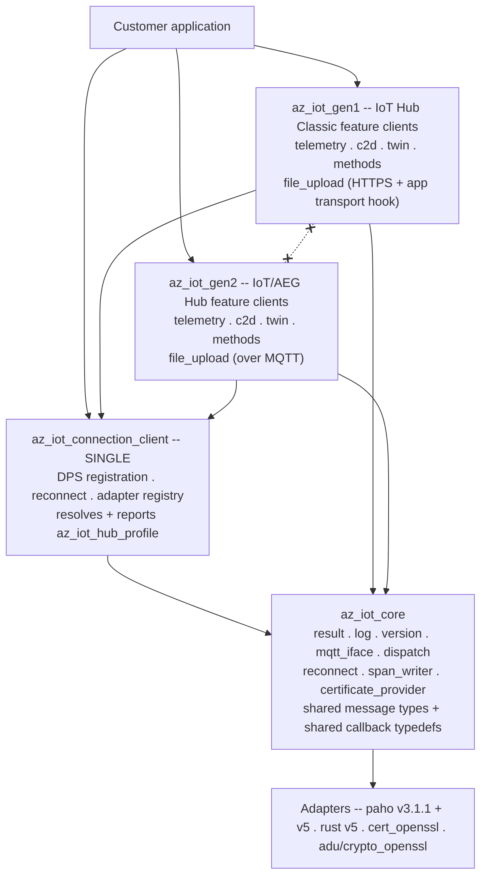
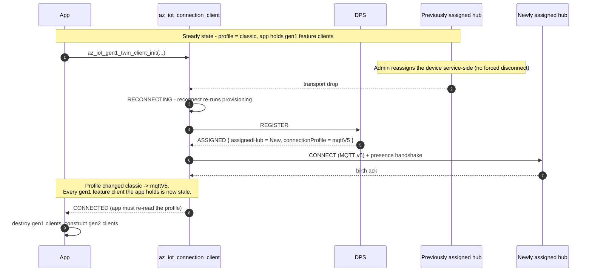

<!-- Copyright (c) Microsoft. All rights reserved.
     Licensed under the MIT license. See LICENSE file in the project root for full license information. -->

# Separating the Classic and AEG feature-client APIs

## Abstract

Today one set of feature clients serves both hub generations. `az_iot_twin_client`,
`az_iot_telemetry_client` and friends each branch internally on
`profile->flavor` — 13 comparisons across the five feature clients — resolved
through two static tables in
[`protocol_profile.c`](../../src/core/protocol_profile.c). The result is that
every public feature API is the union of what both generations can do, and the
parts that only one generation supports are discoverable only at run time.

This document specifies splitting the **feature clients** by generation —
`az_iot_gen1_*` for Azure IoT Hub Classic, `az_iot_gen2_*` for the Azure
IoT/AEG Hub — while the **connection client stays single**.

> **Supersedes [split-client.md](split-client.md).** That document evaluated
> splitting by *build target* (`AZ_IOT_FLAVOR=classic|next`), which compiles one
> generation out of the binary entirely. Its analysis of migration risk, feature
> drift and CI cost is folded in here.

---

## 1. Shape

There is **one** connection client, and it keeps ownership of registration.
Provisioning is not a separate client and not an application step.

```c
az_iot_connection_client conn;                    /* one type, both generations */

az_iot_connection_client_init(&conn, &opts);      /* opts.dps.* set as today   */
az_iot_connection_client_register_mqtt_factory(&conn, az_iot_paho_factory_create_v3_1_1());
az_iot_connection_client_register_mqtt_factory(&conn, az_iot_paho_factory_create_v5());
az_iot_connection_client_open(&conn);             /* DPS runs internally       */

/* open() is non-blocking, and it can end in FAULTED rather than CONNECTED.
 * Bound the wait and stop on a terminal state -- see samples/telemetry/main.c. */
for (int i = 0; i < 1200 && state != AZ_IOT_CONN_STATE_CONNECTED; ++i)
{
  az_iot_connection_client_do_work(&conn, 50);
  if (state == AZ_IOT_CONN_STATE_FAULTED)
  {
    break;
  }
}
if (state != AZ_IOT_CONN_STATE_CONNECTED)
{
  return 1;   /* never reached CONNECTED: there is no profile to read */
}

/* The connection now knows which hub generation it landed on. */
az_iot_hub_profile hub = AZ_IOT_HUB_PROFILE_INIT;
az_iot_connection_client_get_hub_profile(&conn, &hub);

if (hub.connection_profile == AZ_IOT_CONNECTION_PROFILE_MQTT_V5)
{
  az_iot_gen2_telemetry_client tel;
  az_iot_gen2_telemetry_client_init(&tel, &conn);   /* AEG API */
  ...
}
else
{
  az_iot_gen1_telemetry_client tel;
  az_iot_gen1_telemetry_client_init(&tel, &conn);   /* Classic API */
  ...
}
```

Falling back from AEG to Classic is **application logic**. The SDK's contribution
is to report the generation accurately and to refuse the wrong API loudly.

### What splits, and what does not

| | Disposition |
|---|---|
| `az_iot_connection_client` + DPS + reconnect + adapter registry | **single, shared** |
| MQTT abstraction, adapters, certificate provider, logging, results, dispatch | **single, shared** |
| Message types (`az_iot_telemetry_message`, `az_iot_c2d_message`, …) and callback typedefs | **single, shared** — see [§5](#5-what-stays-shared) |
| Telemetry, C2D, twin, direct methods, file upload **clients** | **split** `gen1` / `gen2` |
| ADU | split by *channel*, see [§8](#8-device-update) |

---

## 2. The connection profile

`az_iot_connection_client_get_hub_profile()` is how an application learns what it
is connected to. It is valid only once the connection reaches `CONNECTED`;
before that it returns `AZ_IOT_ERR_NOT_CONNECTED`.

### The service contract

The source of truth is the DPS data-plane spec added in
[azure-rest-api-specs#45041](https://github.com/Azure/azure-rest-api-specs/pull/45041)
(api-version `2026-11-02-preview`). `connectionProfile` is a `readOnly` property
on `DeviceRegistrationResult`, arriving in the same payload as `assignedHub`,
`deviceId` and `issuedCertificateChain`:

```json
{
  "assignedHub": "ljexps",
  "connectionProfile": "mqttV5",
  "deviceId": "hjvdlwpugzlk"
}
```

Three properties of that contract drive the C API:

| Contract | Consequence |
|---|---|
| It is a **string**, values `classic` and `mqttV5` | Not a numeric `hub_version`. There is no `1`/`2` on the wire. |
| It is an **extensible union** — *"so future hub capabilities pass through without a breaking change"* | The SDK **will** receive values it does not know. A closed C enum cannot represent that. |
| **Absent or null resolves to `classic`** | Missing is not an error. It is a documented default. |

### Shape

```c
typedef enum
{
  AZ_IOT_CONNECTION_PROFILE_CLASSIC = 0,  /* "classic" -- also the absent/null default */
  AZ_IOT_CONNECTION_PROFILE_MQTT_V5 = 1,  /* "mqttV5"                                  */
  AZ_IOT_CONNECTION_PROFILE_UNKNOWN = -1, /* a value newer than this SDK               */
} az_iot_connection_profile;

typedef struct
{
  uint32_t _internal_size;              /* stamped by AZ_IOT_HUB_PROFILE_INIT */
  az_iot_connection_profile connection_profile;
  const char* connection_profile_raw;   /* verbatim wire string, ALWAYS populated */
  /* ... to be extended ... */
} az_iot_hub_profile;

#define AZ_IOT_HUB_PROFILE_INIT { ._internal_size = sizeof(az_iot_hub_profile) }

az_iot_result az_iot_connection_client_get_hub_profile(
    const az_iot_connection_client* client,
    az_iot_hub_profile* out_profile);
```

`connection_profile_raw` is what makes the extensible union survive the trip into C. A value
this SDK has never heard of maps to `UNKNOWN` and is still reported verbatim, so
an application (or a support engineer reading a log) can see what the service
actually said. Discarding it would convert a forward-compatible wire format into
a lossy one at the library boundary — which is precisely the thing the spec
authors went out of their way to avoid.

Because the struct is caller-allocated and will grow, it uses the versioning
pattern this repo already settled on in
[struct_versioning.md](../struct_versioning.md): a size stamp as the first field,
a mandatory initializer macro, and a library-side size check so a caller compiled
against an older header is defaulted rather than misread. Doing that now, while
it has two fields and no shipped callers, is the point.

### An unknown profile fails the connection

**Decided:** if DPS returns a profile this SDK does not recognise, the connection
fails with `AZ_IOT_ERR_CONNECTION_PROFILE_UNSUPPORTED`. The profile — including
`connection_profile_raw` — remains readable so the application can log it, report it, or
trigger a firmware update.

The reasoning is worth recording, because the extensible union invites the
opposite reading. The profile is not expected to break: the service contract
treats it as forward-compatible and the value is forwarded verbatim from the hub.
But a device should be defensive about service-side hazards it cannot verify, and
an unrecognised profile means the SDK does not know which MQTT version to speak.
Connecting anyway would mean guessing the wire protocol. Failing closed turns
that into one clear error at one place, instead of a device that appears to
connect and then misbehaves in ways that surface as unrelated bugs.

### Blocker: the api-version must be raised

**`connectionProfile` is new in `2026-11-02-preview`. The SDK currently requests
`2019-03-31`, so the service will never send it.**

The version travels in the DPS **CONNECT username**
(`<id_scope>/registrations/<registration_id>/api-version=<version>`), built by
`az_iot_provisioning_client_get_user_name()` in `azure-sdk-for-c`, where it is
hardcoded:

```c
#define AZ_IOT_PROVISIONING_SERVICE_VERSION "2019-03-31"
```

Raising it is therefore not a matter of parsing more fields.

**Decision: patch `azure-sdk-for-c` in this repo.** `Azure/azure-sdk-for-c` is
**archived** (verified 08/11/2026; last push 2026-07-15). There is no upstream to
fix it, so this repo owns the dependency from here on. That reframes the task:
the api-version is the first patch, not the only one, and what is actually needed
is a **patching mechanism** rather than a one-off edit.

The seams that already exist:

- `AZ_SDK_C_REPO` and `AZ_SDK_C_TAG` are both `CACHE STRING` in
  [`CMakeLists.txt`](../../CMakeLists.txt) — repointing is a two-line change.
- There is a **registered submodule** at `c/deps/azure-sdk-for-c`
  (`.gitmodules`, gitlink `6d6e634a`), pinned to exactly the commit tag `1.5.0`
  resolves to — i.e. the same source FetchContent builds. It is uninitialised on
  a fresh clone, which makes it look dead. **It is not.** The ESP-IDF component
  at `c/samples/adu/esp32/components/azure-sdk-for-c` reads its sources straight
  out of it, and that sample's README tells the user to
  `git submodule update --init c/deps/azure-sdk-for-c`. It does contradict the
  "no git submodules" rule stated in [devnotes.md](../devnotes.md) and the
  README, but it is load-bearing: an ESP-IDF build has no FetchContent step to
  borrow from.

Candidate mechanisms:

| | Approach | Trade-off |
|---|---|---|
| ~~A~~ | ~~Fork the archived repo, carry patches as commits, repoint `AZ_SDK_C_REPO`/`_TAG`~~ | **Not available** — leadership decision; a fork is not an option |
| **B** | **Keep the pin, add `PATCH_COMMAND` with a `.patch` file in this repo** | **Chosen.** The patch is reviewable in our own PRs and the pin stays honest. `PATCH_COMMAND` re-runs on reconfigure and fails once applied, so it needs a `git apply --check ||` guard |
| C | Vendor the source into `c/deps/azure-sdk-for-c` | Hermetic and honest about ownership — archived source will never move; costs thousands of files in-tree and needs explicit coverage/style exclusions |

**Decided: B.** The re-run hazard is the one thing to get right — an unguarded
`PATCH_COMMAND` turns the second `cmake` invocation into a failure, which is a
miserable first experience for anyone who reconfigures. Guard it so applying an
already-applied patch is a no-op, and cover that with a build that configures
twice.

**The submodule stays, and will need the same patches.** An earlier draft of
this section called `c/deps/azure-sdk-for-c` a dead gitlink and planned to
delete it. That was wrong: the ESP-IDF component under `c/samples/adu/esp32`
builds its sources from it, and that sample provisions through DPS — so it needs
the api-version patch every bit as much as the CMake build does.

That makes the source **two independent copies**. A patch reaching only one of
them is worse than no patch, because the two builds would then silently speak
different api-versions. So the patch list has to be single-sourced and applied
by both consumers: FetchContent through `PATCH_COMMAND`, the ESP-IDF component
through an in-place apply at configure time.

> **Worth stating plainly:** for *this particular* change, patching is not
> strictly required. The api-version is only consumed by
> `az_iot_provisioning_client_get_user_name()`, and this SDK could build the DPS
> CONNECT username itself — it already hand-builds one for the gen2 presence
> handshake. The reason to build the patch mechanism now is the archived
> dependency in general, not this field.

**Parsing the field needs nothing new.** The connection client already walks the
raw ASSIGNED payload with `az_json_reader` to extract `issuedCertificateChain`
(`connection_client.c`, the `DPS_JSON_ISSUED_CERT_CHAIN` path) precisely because
the upstream client does not surface it. `connectionProfile` is read in the same
walk.

---

## 3. Mismatch is an error, not a surprise

Initializing a feature client against a connection of the other generation
**fails**:

```c
/* conn resolved to GEN2 */
az_iot_gen1_twin_client twin;
az_iot_result r = az_iot_gen1_twin_client_init(&twin, &conn);
/* r == AZ_IOT_ERR_CONNECTION_PROFILE_MISMATCH */
```

A dedicated result code is added rather than reusing `AZ_IOT_ERR_NOT_SUPPORTED`,
because this is the single most likely porting mistake and it deserves an
unambiguous diagnostic. The client is left uninitialized and unusable; there is
no partial-init state to unwind.

The name is **`HUB_PROFILE`**, not `HUB_GENERATION`: the profile is the thing the
service actually reports, and the generation is our own derived label for it.
Error codes should name the wire concept. The sibling code for an unrecognised
profile is therefore `AZ_IOT_ERR_CONNECTION_PROFILE_UNSUPPORTED`.

The check requires the generation to be known, which means **feature clients must
be initialized after the connection is open**. That is a change: today's samples
construct feature clients before `az_iot_connection_client_open()`, and .NET
constructs them before `ProvisionAndConnectAsync`. See
[§9](#9-consequence-init-ordering-changes).

---

## 4. No cross-generation constructs on the public surface

The point of splitting is that each generation's header describes only what that
generation can actually do. A construct that exists on one side must not appear
on the other's API, even as a stub that returns an error.

| Construct | Belongs to |
|---|---|
| MQTT v5 user properties on telemetry / C2D | gen2 |
| Correlation-data request/response matching | gen2 |
| Twin push on connect | gen2 |
| Direct-method probe / ready handshake | gen2 |
| File upload control plane over MQTT | gen2 |
| Topic property-bag encoding | gen1 |
| `$rid` correlation | gen1 |
| File upload over HTTPS + the application HTTP transport hook | gen1 |

This is the concrete reason the split is worth doing: today
[`az_iot_file_upload_client.h`](../../inc/azure/iot/az_iot_file_upload_client.h)
opens by promising "one seamless API, transport chosen by hub flavor", and then
`az_iot_file_upload_client_get_sas_uri()` returns `AZ_IOT_ERR_NOT_SUPPORTED` at
run time on gen2. Both generations pay for a surface neither fully implements.

### One documented exception: runtime CSR renewal

`az_iot_connection_client_send_csr()` is Classic-only and returns
`AZ_IOT_ERR_NOT_SUPPORTED` on gen2 — by the rule above, exactly the thing that
should not exist. It **stays** on the shared connection client anyway, as a single
function, matching what .NET does.

The rule is worth keeping where it pays: in the feature clients, where the whole
point is that each generation's header describes only what that generation can
do. Manufacturing a gen1 certificate-management client purely to satisfy the rule
would cost users an extra object to construct and wire up, for no gain in
clarity. Naming the exception is more honest than quietly widening the rule until
it accommodates it.

### File upload is redesigned, not just renamed

- **`az_iot_gen1_file_upload_client`** owns the HTTPS control plane. The
  `az_iot_file_upload_http_transport` hook, the response buffer, and the URL/body
  size macros move out of the shared header into the gen1 header. They are a
  Classic implementation detail and have no meaning on gen2.
- **`az_iot_gen2_file_upload_client`** carries the control plane over the
  existing MQTT connection and takes **no HTTP transport at all**. Its init
  signature is smaller, which is the visible payoff.

Uploading the blob bytes to Azure Storage remains the application's job on both
generations — that never was an SDK responsibility.

---

## 5. What stays shared

Message types and callback typedefs stay **single and shared**, in
`az_iot_core`:

```c
az_iot_telemetry_message msg = { .payload = body, .payload_len = len };

az_iot_gen1_telemetry_client_send(&t1, &msg, on_send_done, &ctx);
az_iot_gen2_telemetry_client_send(&t2, &msg, on_send_done, &ctx);   /* same msg, same callback */
```

Splitting the *clients* is what removes the cross-generation constructs.
Splitting the *data* as well would force a customer to rewrite every message
construction site and every handler body during migration, for no isolation
benefit. Where a generation needs extra per-message data, it goes in that
generation's `_options` argument, not in a forked message type.

---

## 6. Layering



Rules, mechanically enforced (see [§7](#7-enforcement)):

1. `az_iot_gen1` and `az_iot_gen2` MUST NOT reference each other.
2. `core` and the connection client MUST NOT reference `gen1_` or `gen2_`
   symbols. The connection client resolves the generation and publishes it as
   data; it does not call into either library.
3. Feature clients reach the transport only through the connection client's
   existing internal interface — no direct adapter access.

The connection client necessarily contains both generations' *connect* logic
(username construction, the gen2 presence/birth handshake). That is inherent in
having one connection client, and is accepted.

---

## 7. Enforcement

`c/eng/check-layering.sh`, run by the existing `conventions` CI job next to
`check-banned-constructs.sh`:

| Check | Rule |
|---|---|
| `src/gen1/**` contains `gen2_`, or `src/gen2/**` contains `gen1_` | 1 |
| `inc/azure/iot/gen1/*.h` includes `gen2/*`, or vice versa | 1 |
| `src/core/**` contains `gen1_` or `gen2_` | 2 |
| A gen1 header mentions a gen2-only construct from [§4](#4-no-cross-generation-constructs-on-the-public-surface), or vice versa | [§4](#4-no-cross-generation-constructs-on-the-public-surface) |
| A `gen1`/`gen2` symbol name contains `classic`, `next`, `aeg` or `flavor` | [§10](#10-naming) |

Negative-test the gate — reintroduce each violation in a scratch copy and confirm
it fails — before trusting it. A check that cannot fail is worse than no check,
because it is believed.

---

## 8. Device Update

ADU blocks the split in its current shape: `az_iot_adu_client_initialize()` takes
a mandatory `az_iot_twin_client*` and calls twin APIs from five sites, welding it
to Classic delivery.

Split into a transport-independent **`adu_core`** (manifest v5 parsing, JWS/SJWK
verification, root keys, SHA-256, the download/backup/install/apply state
machine, reboot/resume persistence) plus an **`az_iot_adu_channel`** vtable
carrying delivery and reporting.

| Channel | Generation | Status |
|---|---|---|
| Twin-based (ADUv1) | gen1 | Works today; **deprecated** on arrival |
| DPS-fronted RPC (ADUv2) | gen2 | **Declared, not implemented** |

> **ADUv2 is specified elsewhere; this section only states where the seam is.**
> See [aduv2-spec.md](aduv2-spec.md) for the wire contract and
> [adu-client-plan.md](adu-client-plan.md) for SDK status and cost. Both landed
> with [PR #24](https://github.com/Azure/azure-iot-sdk/pull/24), which also
> reduced `adu-feature-support.md` to a superseded stub — do not treat that file
> as current.

One consequence of the ADUv2 shape is worth pulling into this document, because
it constrains the seam: the device's update traffic goes **device → DPS → ADR →
ADU**, reusing the existing DPS endpoint and DPS device auth. The device never
talks to ADU directly and gains no new credentials. So the ADUv2 channel is not
"another hub feature" sitting beside twin and telemetry — it hangs off the
provisioning path, and for the bootstrap case it runs **before the device is
provisioned at all**. A channel vtable that assumed "there is a connected hub
session underneath me" would be the wrong shape.

ADUv1 keeps working through the split. Dropping it is a separate decision with
its own deprecation window, not a side effect of re-layering.

---

## 9. Consequence: init ordering changes

Because the generation is only known after registration completes, and because
[§3](#3-mismatch-is-an-error-not-a-surprise) makes a mismatched init fail,
feature clients must be created **after** the connection is open. Today
[`samples/telemetry/main.c`](../../samples/telemetry/main.c) does the opposite.

This is a real ergonomic cost and it is worth stating plainly rather than
discovering it in review: a feature client can no longer be a long-lived
member constructed alongside the connection at start-up. Applications that
subscribe to inbound traffic must register handlers after `CONNECTED`.

### The profile can change while the device is running

This is not hypothetical, and it is the reason init-time checking alone is not
enough. A service admin can move a device to another hub, and that hub may be a
new AEG/IoT hub. Nobody forces the client to disconnect — but the **previous hub**
may drop it, and the ordinary reconnect path re-runs provisioning, at which point
the device discovers it has been assigned somewhere else, possibly with a
different profile.



**What the application has to do** — and this must be unambiguous in the shipped
documentation, because getting it wrong is silent:

1. Re-read `az_iot_connection_client_get_hub_profile()` after **every** transition
   into `CONNECTED`, not only the first.
2. If the profile differs from the one its feature clients were built against,
   destroy them and construct the other generation's.
3. Treat in-flight operations on the old clients as lost, consistent with
   [connection.md §5.3](../connection.md), which already records that twin
   GET/PATCH, method responses and in-flight telemetry do not survive a reconnect.

What the SDK owes the application in return is **not yet decided**: whether the
profile change is signalled through a distinct connection-state reason, a
dedicated callback, or purely by the documented re-read requirement; and whether
calls on a now-stale feature client fail with a distinct result or are simply
undefined. Init-time `AZ_IOT_ERR_CONNECTION_PROFILE_MISMATCH` covers the start-up case
and does nothing for this one.

Tracked as **[AB#39350066](https://dev.azure.com/msazure/One/_workitems/edit/39350066)**
— *Define device behaviour when a hub reassignment changes the connection profile*.

> **The pattern above is not safe yet. Two connection-client defects must be
> fixed before P2 relies on it.**
>
> **1. `CONNECTED` does not mean subscriptions are live.**
> `announce_connected()` transitions to `CONNECTED` as its *first* statement and
> only then issues the persistent subscribes, discarding the result; SUBACKs are
> absorbed and never correlated. So an application that rebuilds feature clients
> from the `CONNECTED` callback — exactly what step 2 above asks for — does so
> while no subscription is established.
>
> To be precise about the mechanism, because the obvious explanation is the wrong
> one: MQTT *does* preserve ordering here. A broker processes the control packets
> of a single connection in the order it receives them, so a PUBLISH cannot
> overtake a SUBSCRIBE that was already written to that connection. The defect is
> that ours has not been written yet. `transition()` invokes the application
> callback **synchronously**, before the re-subscribe loop runs, so a request
> published from inside that callback reaches the wire *ahead of* its own
> SUBSCRIBE. Ordering then works against us rather than for us.
>
> Waiting for the SUBACK — rather than merely reordering the loop before the
> transition — is what also covers the second half: a SUBSCRIBE the broker
> *rejects* (topic filter not authorized, which is a live possibility on AEG's
> topic-space authorization) must not be reported as a live subscription either.
> Tracked as [AB#39366084](https://dev.azure.com/msazure/One/_workitems/edit/39366084).
> The gen2 presence handshake already implements the correct shape — it waits for
> its own SUBACK before publishing birth — it simply is not applied to feature
> subscriptions.
>
> **2. Persistent subscriptions cannot be removed.**
> `__add_subscription_on_connect()` has no remove counterpart, and every feature
> client's `destroy()` leaves its filter registered. Destroying the gen1 set and
> constructing the gen2 set therefore leaves the Classic filters behind, so the
> device re-subscribes to `$iothub/...` topics on a gen2 hub and consumes registry
> slots permanently — past `AZ_IOT_MAX_PERSISTENT_SUBS` (8) and past the
> service-side limit of five topics per device. Step 2 above cannot work until
> this exists. Tracked as
> [AB#39366086](https://dev.azure.com/msazure/One/_workitems/edit/39366086).
>
> **These two fixes deadlock if they are built naively — the order matters.**
> Gating `CONNECTED` on SUBACKs (defect 1) while removal is still driven by the
> application (defect 2) produces a connection that can never come up. On a
> profile change the stale gen1 `$iothub/...` filters are still in the registry,
> because the only thing that removes them is the application destroying those
> clients, and the application does not act until it observes `CONNECTED`. The
> new gate would first re-issue those filters against the gen2 hub and wait for
> their SUBACKs. AEG's topic-space authorization does not grant `$iothub/...`, so
> they are rejected, `CONNECTED` never arrives, and the application never gets
> the callback that would have removed them.
>
> So P1c cannot simply add a gate and a remove API. The registry entry must carry
> the generation it belongs to, and a reconnect must drop entries that do not
> match the newly resolved profile **before** re-subscribing — not wait for the
> application to do it. The application-facing remove path is still needed for
> ordinary feature-client teardown; it just cannot be the only thing standing
> between a profile change and a connection that comes up.
>
> **The fix differs by generation, and that is the point.** On gen1, removal
> issues an MQTT UNSUBSCRIBE — Classic supports it, and Classic genuinely has
> per-feature filters that must be withdrawn. On gen2 there is **nothing to
> unsubscribe**: the presence handshake already subscribes
> `ih/{device_id}/dev/#`, the whole device-bound topic space, before `CONNECTED`.
> Removal on gen2 is a dispatch-table unregister and no MQTT operation at all.
> This matters because on gen2 there is only ever **one** subscription, taken out
> once at connect and torn down with the session — so a shared implementation
> that issued UNSUBSCRIBE would be withdrawing the whole device's topic space to
> retire one feature client. The .NET client behaves the same way: its gen2
> connection issues a single `SubscribeAsync("ih/{deviceId}/dev/#", AtLeastOnce)`
> and nothing in the library ever calls `UnsubscribeAsync` — the capability
> exists on its MQTT interface and is unused.
>
> (An earlier revision justified this by saying AEG does not support UNSUBSCRIBE.
> That is **not** supported by the AEG RFCs — `unsubscribe` does not appear
> anywhere in them — so the claim is withdrawn. The reason above does not depend
> on it and is checkable.)
>
> **Related defect, same fix.** gen2 feature clients today *also* register their
> own filters on top of that wildcard — `dev/twin/get/response`,
> `dev/twin/reported/response`, `dev/twin/desired`, `dev/c2d`, `dev/methods/+` —
> every one a strict subset of `ih/{device_id}/dev/#`. So gen2 issues six
> subscriptions where one suffices, re-issues all six on every reconnect, and
> spends registry slots it never needed. Dropping them shrinks the removal
> problem rather than growing it.
>
> **The wildcard genuinely covers everything, including features not yet
> designed.** The AEG topic RFC (`gateway/rfcs/aeg/topics.md`) defines the
> `device-dev` topic space as the single template
> `ih/${client.authenticationName}/dev/#`, and says the `#` "covers all current
> and future `dev` features with one template". Device-bound features today are
> `c2d`, `methods`, `twin`, `files`, `session` and `notify`. So ADUv2 — whatever
> topic it lands on, provided it is under `dev/` — is already covered, and no
> escape hatch is needed for it.
>
> Two caveats worth carrying forward rather than discovering later. First, the
> RFC describes the wildcard as *authorization* coverage and expects the device
> to "subscribe to individual feature topics"; both this SDK and the .NET client
> instead subscribe to the wildcard itself. That is authorized and simpler, but
> it is a deliberate deviation from the RFC's stated device behaviour, not
> something the RFC asks for. Second, `dev/notify` is specified to be subscribed
> **at QoS 0** so it is not queued in the persistent session; a single blanket
> QoS 1 subscription cannot express a per-feature QoS, and relies on the service
> publishing notify at QoS 0 for the effective QoS to come out right.
>
> Both are pre-existing and independent of the split, but P2 is the first thing
> that depends on them, so they are sequenced ahead of it in
> [§12](#12-phases).

Open, and deliberately called out because it makes the invalidation bidirectional
rather than one-way: **can a device be rolled back to a classic IoT Hub?** Every
example above moves gen1 → gen2. If gen2 → gen1 is also reachable, then gen1
feature clients must handle being constructed *after* a gen2 session, and the
"migrate forward and delete the Classic code" story in
[§1](#1-shape) stops being a one-way door.

---

## 10. Naming

`gen1` / `gen2` matches .NET's vocabulary and is short enough to sit in every
feature-client symbol without noise. The team expects to rename once service-side
naming settles, so the scheme keeps that rename mechanical:

- Headers `inc/azure/iot/gen1/`, `inc/azure/iot/gen2/`; sources `src/gen1/`, `src/gen2/`
- Symbols `az_iot_gen1_*`, `az_iot_gen2_*` — the infix appears in exactly one
  position, immediately after `az_iot_`
- CMake targets `az_iot_gen1`, `az_iot_gen2`
- `classic`, `next`, `aeg` and `flavor` are banned from generation symbol names

### Two vocabularies, deliberately

The service contract publishes its own names: `classic` and `mqttV5`. This
document keeps **both**, mapped in exactly one place:

| API namespace | Wire value | Meaning |
|---|---|---|
| `az_iot_gen1_*` | `"classic"` | Classic MQTT 3.x capable IoT Hub |
| `az_iot_gen2_*` | `"mqttV5"` | MQTT 5 capable IoT Hub |

**Decided (for now):** `classic` maps to gen1, `mqttV5` maps to gen2.

The profile enum uses the service's spelling
(`AZ_IOT_CONNECTION_PROFILE_CLASSIC` / `_MQTT_V5`) so the wire vocabulary is not
invented twice and a log line matches the spec. The feature-client namespaces
keep `gen1`/`gen2` because they name an *API surface*, not a transport — and
because `mqttV5` would be an actively misleading name for a namespace whose
distinguishing feature is topic structure and payload shape, not merely the MQTT
version.

The mapping lives in one function so that a future third profile, or a rename,
touches one place.

The internal `az_iot_hub_flavor` and `az_iot_connection_profile` enums are replaced by
`az_iot_connection_profile`. `az_iot_mqtt_role` keeps its DPS member.

---

## 11. Samples and tests

**Per-feature dual samples.** Every feature ships two samples — the Classic route
and the AEG route — so each API is demonstrated on its own terms rather than
through a branch. Plus one sample showing the profile query and the
application-side fallback, which is the migration story in executable form.

**Test expansion.** This roughly doubles the feature-client test surface: each
generation's client needs its own unit suite against the in-memory mock, and each
needs e2e coverage against a real hub of that generation. New cases that do not
exist today:

- mismatched init returns `AZ_IOT_ERR_CONNECTION_PROFILE_MISMATCH`, per feature
- `"classic"` and `"mqttV5"` each map to the right profile and MQTT version
- **absent** `connectionProfile` resolves to `classic`, and **`null`** does too
- an **unrecognised** profile string fails the connection with
  `AZ_IOT_ERR_CONNECTION_PROFILE_UNSUPPORTED` and is still readable verbatim
  through `connection_profile_raw` — the forward-compatibility case the spec exists to
  support, and the one no current test covers
- the DPS CONNECT username carries `api-version=2026-11-02-preview`
- `get_hub_profile` before `CONNECTED` returns `AZ_IOT_ERR_NOT_CONNECTED`
- an older-header caller (smaller `_internal_size`) is defaulted, not misread
- gen1 file upload with no HTTP transport supplied fails at init
- gen2 file upload exposes no HTTP transport at all (compile-level)

e2e needs provisioned resources for **both** generations. `iot-sdks-e2e-fx` cannot
provision an AEG hub today — that arrives once gen2 is deployable through the
Azure CLI, and the same script is then used for gen2. Until then the gen2 e2e leg
cannot exist, and gen2 coverage comes from unit tests against the in-memory mock
plus the conformance suites.

---

## 12. Phases

| # | Phase | Depends on | Notes |
|---|---|---|---|
| P0a | Purge the dead "easy"/API B remnants | — | **Done** (`db074c0`) |
| P0b | This document + doc reconciliation | — | |
| P1a | Add the `azure-sdk-for-c` patch mechanism and raise the DPS api-version to `2026-11-02-preview`, for **both** consumers of that source: the FetchContent tree (`PATCH_COMMAND`) and the `c/deps/azure-sdk-for-c` submodule the ESP-IDF sample builds from | — | **Blocked on the service.** `2026-11-02-preview` is not deployed ([azure-rest-api-specs#45041](https://github.com/Azure/azure-rest-api-specs/pull/45041) is still open), and requesting it makes the DPS CONNECT fail with CONNACK rc=5. Parked until it ships. |
| P1b | `az_iot_hub_profile` + `get_hub_profile()` + `az_iot_connection_profile` + `AZ_IOT_ERR_CONNECTION_PROFILE_UNSUPPORTED`; parse `connectionProfile` in the existing ASSIGNED-payload walk | — | Additive, and deliberately **not** blocked on P1a: with the stock api-version `connectionProfile` never arrives, absent resolves to `classic`, and the result is exactly the hardcoded behaviour it replaces. Lands inert, activates when P1a ships. `AZ_IOT_ERR_CONNECTION_PROFILE_MISMATCH` is not here — it lands in P2, with the first client that can reject a mismatch. |
| P1c | Gate `CONNECTED` on subscriptions being SUBACKed ([AB#39366084](https://dev.azure.com/msazure/One/_workitems/edit/39366084)); tag each persistent-subscription entry with its generation and drop non-matching entries on reconnect *before* re-subscribing; add a remove path wired into every feature client's `destroy()`, UNSUBSCRIBE on gen1 and dispatch-only on gen2; drop the five gen2 filters already covered by `ih/{device_id}/dev/#` ([AB#39366086](https://dev.azure.com/msazure/One/_workitems/edit/39366086)) | — | Pre-existing defects, independent of the split. **P2 depends on both**: §9's rebuild pattern is unsafe without the first and impossible without the second. The generation tagging is not optional — without it the two fixes deadlock each other on a profile change. Own PR, own review. |
| P2 | Split the feature clients, one PR each: telemetry → c2d → direct methods → twin | P1a, P1b, **P1c** | Mutually parallel. Mismatch check per client. |
| P3 | File upload redesign — HTTP transport becomes gen1-only | P1 | Larger than the others; own PR. |
| P4 | Delete `protocol_profile.c`'s flavor tables and the last `profile->flavor` branches | P2, P3 | |
| P5 | Re-layer ADU onto `adu_core` + channel vtable | P4 | ADUv2 declared only. |
| P6 | Dual samples per feature, `check-layering.sh`, coverage floors for `gen1`/`gen2` | P2–P4 | |

The connection client is **not** restructured. That is the main saving versus the
earlier plan.

### Verification per phase

Linux gcc **and** clang: configure + build with `AZ_IOT_BUILD_TESTS=ON` **and
`AZ_IOT_BUILD_E2E=ON`**, `ctest`, the c99-strict build
(`-std=c99 -pedantic -Werror`), valgrind memcheck, MSVC, conformance against a
real broker, `check-banned-constructs.sh`, and `code-style.sh check` under
clang-format 18.

`AZ_IOT_BUILD_E2E=ON` is called out because it is **off by default**: the e2e
agent is not compiled by an ordinary build, and it has been broken twice by
public callback signature changes that every other job accepted.

Per-component coverage floors in
[`coverage-components.json`](../../tests/coverage-components.json) must gain
`gen1` and `gen2` entries in the same PR that creates those directories, or the
split silently drops coverage against the current 72.5% line / 49.9% branch
baseline.

---

## 13. Decided

- **The DPS exchange moves to the `2026-11-02-preview` api-version**, and
  `azure-sdk-for-c` is patched in this repo to allow it. The upstream repo is
  archived, so there is no alternative and no risk of divergence.
- **The patch mechanism is `PATCH_COMMAND`** ([§2](#blocker-the-api-version-must-be-raised)),
  with a `.patch` file in this repo and a guard so re-running configure is a
  no-op. Forking the archived repo is not available. The
  `c/deps/azure-sdk-for-c` submodule **stays** — the ESP-IDF sample builds from
  it — and must receive the same patches from the same list.
- **`classic` maps to gen1, `mqttV5` maps to gen2**, for now.
- **An unrecognised profile fails the connection.** The profile is not expected
  to break, but a device should be defensive about service-side hazards it
  cannot verify.
- **Runtime CSR renewal stays on the shared connection client** as a single
  function, matching .NET. This is a deliberate, documented exception to
  [§4](#4-no-cross-generation-constructs-on-the-public-surface): the rule buys
  more in the feature clients, where the whole point is that each generation's
  header describes only what that generation can do, than it does in forcing a
  certificate-management client into existence purely to satisfy the rule. It
  is more seamless for users this way. `§4` is amended to name this exception
  rather than pretend it does not exist.

## 14. Open questions

1. **Can a device be rolled back to a classic IoT Hub?**
   ([§9](#the-profile-can-change-while-the-device-is-running)) Decides whether
   profile invalidation is one-way or bidirectional. Tracked as
   [AB#39350066](https://dev.azure.com/msazure/One/_workitems/edit/39350066).
2. **What does the SDK owe the application when the profile changes mid-life?**
   A distinct connection-state reason, a dedicated callback, or a documented
   re-read requirement — and whether calls on a stale feature client fail with a
   distinct result. Same work item.
3. **The struct-versioning pattern for `az_iot_hub_profile`**
   ([§2](#shape)) is specified but not implemented, and the scope (this struct
   only, or every caller-allocated public struct) is undecided. Tracked as
   [AB#39350065](https://dev.azure.com/msazure/One/_workitems/edit/39350065).

---

## Version

- 08/10/2026: Created. Supersedes [split-client.md](split-client.md).
