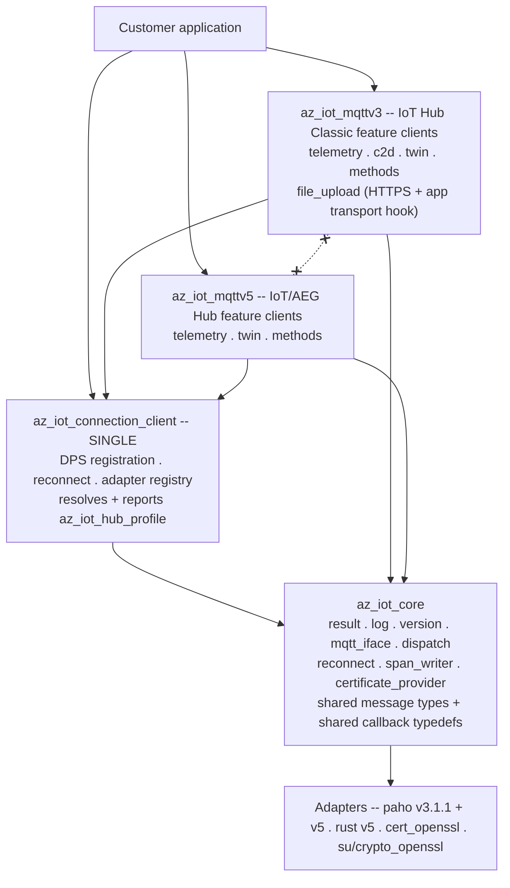
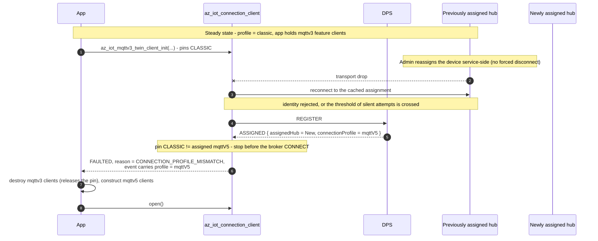

<!-- Copyright (c) Microsoft. All rights reserved.
     Licensed under the MIT license. See LICENSE file in the project root for full license information. -->

# Separating the Classic and AEG feature-client APIs

## Abstract

At the start of this work one set of feature clients served both hub generations,
with 13 `profile->flavor` comparisons across five feature clients resolved
through two static tables in `protocol_profile.c`. The result is that
every public feature API is the union of what both generations can do, and the
parts that only one generation supports are discoverable only at run time.

Telemetry is the first completed split: the unified client is gone, its shared
message/callback types live in `az_iot_message.h`, and the two wire paths now
compile in separate `az_iot_mqttv3` and `az_iot_mqttv5` libraries.

This document specifies splitting the **feature clients** by generation —
`az_iot_mqttv3_*` for Azure IoT Hub Classic, `az_iot_mqttv5_*` for the Azure
IoT/AEG Hub — while the **connection client stays single**.

> **Supersedes [split-client.md](split-client.md).** That document evaluated
> splitting by *build target* (`AZ_IOT_FLAVOR=classic|next`), which compiles one
> generation out of the binary entirely. Its analysis of migration risk, feature
> drift and CI cost is folded in here.

---

## 1. Shape

There is **one** connection client, and it keeps ownership of registration.
Provisioning is not a separate client and not an application step.

```c
az_iot_connection_client conn;                    /* one type, both generations */

az_iot_connection_client_init(&conn, &opts);      /* opts.dps.* set as today   */
az_iot_connection_client_register_mqtt_factory(&conn, az_iot_paho_factory_create_v3_1_1());
az_iot_connection_client_register_mqtt_factory(&conn, az_iot_paho_factory_create_v5());
az_iot_connection_client_open(&conn);             /* DPS runs internally       */

/* open() is non-blocking, and it can end in FAULTED rather than CONNECTED.
 * Bound the wait and stop on a terminal state -- see samples/unified/telemetry/main.c. */
for (int i = 0; i < 1200 && state != AZ_IOT_CONN_STATE_CONNECTED; ++i)
{
  az_iot_connection_client_do_work(&conn, 50);
  if (state == AZ_IOT_CONN_STATE_FAULTED)
  {
    break;
  }
}
if (state != AZ_IOT_CONN_STATE_CONNECTED)
{
  return 1;   /* never reached CONNECTED: there is no profile to read */
}

/* The connection now knows which hub generation it landed on. */
az_iot_hub_profile hub = AZ_IOT_HUB_PROFILE_INIT;
az_iot_connection_client_get_hub_profile(&conn, &hub);

if (hub.connection_profile == AZ_IOT_CONNECTION_PROFILE_MQTT_V5)
{
  az_iot_mqttv5_telemetry_client tel;
  az_iot_mqttv5_telemetry_client_init(&tel, &conn);   /* AEG API */
  ...
}
else
{
  az_iot_mqttv3_telemetry_client tel;
  az_iot_mqttv3_telemetry_client_init(&tel, &conn);   /* Classic API */
  ...
}
```

Falling back from AEG to Classic is **application logic**. The SDK's contribution
is to report the generation accurately and to refuse the wrong API loudly.

### What splits, and what does not

| | Disposition |
|---|---|
| `az_iot_connection_client` + DPS + reconnect + adapter registry | **single, shared** |
| MQTT abstraction, adapters, certificate provider, logging, results, dispatch | **single, shared** |
| Message types (`az_iot_telemetry_message`, `az_iot_c2d_message`, …) and callback typedefs | **single, shared** — see [§5](#5-what-stays-shared) |
| Telemetry, twin, direct methods **clients** | **split** `mqttv3` / `mqttv5` |
| C2D **client** | **`mqttv3` only** — not supported by AEG yet, see [§4](#c2d-is-mqttv3-only) |
| File upload **client** | **`mqttv3` only** — cut from AEG, see [§4](#file-upload-is-mqttv3-only) |
| Software updates | **not split** — one engine (`su_core`) behind a channel vtable; the twin channel is cut, see [§8](#8-device-update) |

---

## 2. The connection profile

`az_iot_connection_client_get_hub_profile()` is how an application learns what it
is connected to. It is valid only once the connection reaches `CONNECTED`;
before that it returns `AZ_IOT_ERR_NOT_CONNECTED`.

### The service contract

The source of truth is the DPS data-plane spec added in
[azure-rest-api-specs#45041](https://github.com/Azure/azure-rest-api-specs/pull/45041)
(api-version `2026-11-02-preview`). `connectionProfile` is a `readOnly` property
on `DeviceRegistrationResult`, arriving in the same payload as `assignedHub`,
`deviceId` and `issuedCertificateChain`:

```json
{
  "assignedHub": "ljexps",
  "connectionProfile": "mqttV5",
  "deviceId": "hjvdlwpugzlk"
}
```

Three properties of that contract drive the C API:

| Contract | Consequence |
|---|---|
| It is a **string**, values `classic` and `mqttV5` | Not a numeric `hub_version`. There is no `1`/`2` on the wire. |
| It is an **extensible union** — *"so future hub capabilities pass through without a breaking change"* | The SDK **will** receive values it does not know. A closed C enum cannot represent that. |
| **Absent or null resolves to `classic`** | Missing is not an error. It is a documented default. |

### Shape

```c
typedef enum
{
  AZ_IOT_CONNECTION_PROFILE_CLASSIC = 0,  /* "classic" -- also the absent/null default */
  AZ_IOT_CONNECTION_PROFILE_MQTT_V5 = 1,  /* "mqttV5"                                  */
  AZ_IOT_CONNECTION_PROFILE_UNKNOWN = -1, /* a value newer than this SDK               */
} az_iot_connection_profile;

typedef struct
{
  uint32_t _internal_size;              /* stamped by AZ_IOT_HUB_PROFILE_INIT */
  az_iot_connection_profile connection_profile;
  const char* connection_profile_raw;   /* verbatim wire string, ALWAYS populated */
  /* ... to be extended ... */
} az_iot_hub_profile;

#define AZ_IOT_HUB_PROFILE_INIT { ._internal_size = sizeof(az_iot_hub_profile) }

az_iot_result az_iot_connection_client_get_hub_profile(
    const az_iot_connection_client* client,
    az_iot_hub_profile* out_profile);
```

`connection_profile_raw` is what makes the extensible union survive the trip into C. A value
this SDK has never heard of maps to `UNKNOWN` and is still reported verbatim, so
an application (or a support engineer reading a log) can see what the service
actually said. Discarding it would convert a forward-compatible wire format into
a lossy one at the library boundary — which is precisely the thing the spec
authors went out of their way to avoid.

Because the struct is caller-allocated and will grow, it uses the versioning
pattern this repo already settled on in
[struct_versioning.md](../struct_versioning.md): a size stamp as the first field,
a mandatory initializer macro, and a library-side size check so a caller compiled
against an older header is defaulted rather than misread. Doing that now, while
it has two fields and no shipped callers, is the point.

### An unknown profile fails the connection

**Decided:** if DPS returns a profile this SDK does not recognise, the connection
fails with `AZ_IOT_ERR_CONNECTION_PROFILE_UNSUPPORTED`. The profile — including
`connection_profile_raw` — remains readable so the application can log it, report it, or
trigger a firmware update.

The reasoning is worth recording, because the extensible union invites the
opposite reading. The profile is not expected to break: the service contract
treats it as forward-compatible and the value is forwarded verbatim from the hub.
But a device should be defensive about service-side hazards it cannot verify, and
an unrecognised profile means the SDK does not know which MQTT version to speak.
Connecting anyway would mean guessing the wire protocol. Failing closed turns
that into one clear error at one place, instead of a device that appears to
connect and then misbehaves in ways that surface as unrelated bugs.

### DPS CONNECT api-version

All DPS CONNECT usernames use `2026-11-02-preview`, constructed by the shared
connection client without changing the pinned `azure-sdk-for-c` dependency.
This includes registration, CSR issuance, and device-update sessions. The
version unlocks `connectionProfile` in the assignment response; absent or null
still resolves to `classic`. The REST specification describes HTTP operations;
MQTT uses its own topics and the CONNECT username carries the api-version.

<details>
<summary>Historical plan (superseded): patching azure-sdk-for-c</summary>

### Blocker: the api-version must be raised

**Implementation update:** `connectionProfile` is new in `2026-11-02-preview`.
The SDK now requests that version on every DPS CONNECT by building the username
in the common connection client. The patching strategy and blocked-status notes
below describe the earlier plan, not the current implementation.

The version travels in the DPS **CONNECT username**
(`<id_scope>/registrations/<registration_id>/api-version=<version>`), built by
`az_iot_provisioning_client_get_user_name()` in `azure-sdk-for-c`, where it is
hardcoded:

```c
#define AZ_IOT_PROVISIONING_SERVICE_VERSION "2019-03-31"
```

Raising it is therefore not a matter of parsing more fields.

**Decision: patch `azure-sdk-for-c` in this repo.** `Azure/azure-sdk-for-c` is
**archived** (verified 08/11/2026; last push 2026-07-15). There is no upstream to
fix it, so this repo owns the dependency from here on. That reframes the task:
the api-version is the first patch, not the only one, and what is actually needed
is a **patching mechanism** rather than a one-off edit.

The seams that already exist:

- `AZ_SDK_C_REPO` and `AZ_SDK_C_TAG` are both `CACHE STRING` in
  [`CMakeLists.txt`](../../CMakeLists.txt) — repointing is a two-line change.
- There is a **registered submodule** at `c/deps/azure-sdk-for-c`
  (`.gitmodules`, gitlink `6d6e634a`), pinned to exactly the commit tag `1.5.0`
  resolves to — i.e. the same source FetchContent builds. It is uninitialised on
  a fresh clone, which makes it look dead. **It is not.** The ESP-IDF component
  at `c/samples/su/esp32/components/azure-sdk-for-c` reads its sources straight
  out of it, and that sample's README tells the user to
  `git submodule update --init c/deps/azure-sdk-for-c`. It does contradict the
  "no git submodules" rule stated in [devnotes.md](../devnotes.md) and the
  README, but it is load-bearing: an ESP-IDF build has no FetchContent step to
  borrow from.

Candidate mechanisms:

| | Approach | Trade-off |
|---|---|---|
| ~~A~~ | ~~Fork the archived repo, carry patches as commits, repoint `AZ_SDK_C_REPO`/`_TAG`~~ | **Not available** — leadership decision; a fork is not an option |
| **B** | **Keep the pin, add `PATCH_COMMAND` with a `.patch` file in this repo** | **Chosen.** The patch is reviewable in our own PRs and the pin stays honest. `PATCH_COMMAND` re-runs on reconfigure and fails once applied, so it needs a `git apply --check ||` guard |
| C | Vendor the source into `c/deps/azure-sdk-for-c` | Hermetic and honest about ownership — archived source will never move; costs thousands of files in-tree and needs explicit coverage/style exclusions |

**Decided: B.** The re-run hazard is the one thing to get right — an unguarded
`PATCH_COMMAND` turns the second `cmake` invocation into a failure, which is a
miserable first experience for anyone who reconfigures. Guard it so applying an
already-applied patch is a no-op, and cover that with a build that configures
twice.

**The submodule stays, and will need the same patches.** An earlier draft of
this section called `c/deps/azure-sdk-for-c` a dead gitlink and planned to
delete it. That was wrong: the ESP-IDF component under `c/samples/su/esp32`
builds its sources from it, and that sample provisions through DPS — so it needs
the api-version patch every bit as much as the CMake build does.

That makes the source **two independent copies**. A patch reaching only one of
them is worse than no patch, because the two builds would then silently speak
different api-versions. So the patch list has to be single-sourced and applied
by both consumers: FetchContent through `PATCH_COMMAND`, the ESP-IDF component
through an in-place apply at configure time.

> **Worth stating plainly:** for *this particular* change, patching is not
> strictly required. The api-version is only consumed by
> `az_iot_provisioning_client_get_user_name()`, and this SDK could build the DPS
> CONNECT username itself — it already hand-builds one for the MQTTv5 presence
> handshake. The reason to build the patch mechanism now is the archived
> dependency in general, not this field.

</details>

**Parsing the field needs nothing new.** The connection client already walks the
raw ASSIGNED payload with `az_json_reader` to extract `issuedCertificateChain`
(`connection_client.c`, the `DPS_JSON_ISSUED_CERT_CHAIN` path) precisely because
the upstream client does not surface it. `connectionProfile` is read in the same
walk.

### Development override when connectionProfile is absent

For a deployment that returns no `connectionProfile`, local testing can
override the `classic` default:

```text
AZ_IOT_DPS_CONNECTION_PROFILE_OVERRIDE=mqttV5
```

The override is applied at the ASSIGNED-payload parser boundary and only when
the property is absent or null. The DPS-assigned host and device id are still
used; only the contract default (`classic`) is replaced, so the connection picks
the MQTT v5 factory and runs the normal AEG presence handshake. Exact values are
`classic` and `mqttV5`; anything else fails the assignment loudly.

An explicit wire string always wins, even when the environment contains an
invalid value. This makes the bridge self-disabling when the service rollout
arrives instead of masking it. The reported `connection_profile_raw` is the
effective profile text in the absent/null case — the contract default or the
exact override — and remains verbatim wire text whenever DPS supplied one.

This is a **development override, not a deployment contract**. Production
devices must not rely on process environment to select their wire protocol.
Remove the variable when DPS supplies the profile on the wire.

---

## 3. Mismatch is an error, not a surprise

Initializing a feature client against a connection of the other generation
**fails**:

```c
/* conn resolved to MQTTV5 */
az_iot_mqttv3_twin_client twin;
az_iot_result r = az_iot_mqttv3_twin_client_init(&twin, &conn);
/* r == AZ_IOT_ERR_CONNECTION_PROFILE_MISMATCH */
```

A dedicated result code is added rather than reusing `AZ_IOT_ERR_NOT_SUPPORTED`,
because this is the single most likely porting mistake and it deserves an
unambiguous diagnostic. The client is left uninitialized and unusable; there is
no partial-init state to unwind.

The name is **`HUB_PROFILE`**, not `HUB_GENERATION`: the profile is the thing the
service actually reports, and the generation is our own derived label for it.
Error codes should name the wire concept. The sibling code for an unrecognised
profile is therefore `AZ_IOT_ERR_CONNECTION_PROFILE_UNSUPPORTED`.

The check requires the generation to be known. That does **not** force feature
clients to be constructed after the connection is open: `_init()` records the
generation the client needs and the connection verifies it once the profile is
authoritative. See [§9](#9-pinning-the-generation-at-init).

---

## 4. No cross-generation constructs on the public surface

The point of splitting is that each generation's header describes only what that
generation can actually do. A construct that exists on one side must not appear
on the other's API, even as a stub that returns an error.

| Construct | Belongs to |
|---|---|
| MQTT v5 user properties on telemetry | MQTTv5 |
| Correlation-data request/response matching | MQTTv5 |
| Twin push on connect | MQTTv5 |
| Direct-method probe / ready handshake | MQTTv5 |
| Topic property-bag encoding | MQTTv3 |
| `$rid` correlation | MQTTv3 |
| File upload over HTTPS + the application HTTP transport hook | MQTTv3 |
| C2D (`devices/{device_id}/messages/devicebound/#`) | MQTTv3 |

This is the concrete reason the split is worth doing: before it, the shared
`az_iot_file_upload_client.h` opened by promising "one seamless API, transport
chosen by hub flavor", and then `az_iot_file_upload_client_get_sas_uri()`
returned `AZ_IOT_ERR_NOT_SUPPORTED` at run time on MQTTv5. Both generations paid
for a surface neither fully implemented.

### One documented exception: runtime CSR renewal

`az_iot_connection_client_send_csr()` is Classic-only and returns
`AZ_IOT_ERR_NOT_SUPPORTED` on MQTTv5 — by the rule above, exactly the thing that
should not exist. It **stays** on the shared connection client anyway, as a single
function, matching what .NET does.

The rule is worth keeping where it pays: in the feature clients, where the whole
point is that each generation's header describes only what that generation can
do. Manufacturing an MQTTv3 certificate-management client purely to satisfy the rule
would cost users an extra object to construct and wire up, for no gain in
clarity. Naming the exception is more honest than quietly widening the rule until
it accommodates it.

### File upload is mqttv3-only

The plan of record was to split file upload like the other four, with
`az_iot_mqttv5_file_upload_client` carrying the control plane over MQTT. That is
**not what shipped**, because the feature was cut from AEG.

- **`az_iot_mqttv3_file_upload_client`** owns the HTTPS control plane. The
  `az_iot_file_upload_http_transport` hook, the response buffer, and the URL/body
  size macros moved out of the shared header into the MQTTv3 header. They are a
  Classic implementation detail and have no meaning on MQTTv5. The hook is now
  **required** at `init()` rather than optional: without it the client can never
  perform either operation, so refusing up front beats failing every later call.
- **There is no `az_iot_mqttv5_file_upload_client`.** File upload is not carried on
  the MQTT v5 hub for now, and the AEG Files message schema does not exist --
  `implementation.md` §3.5 gives the topics and a processing model, but no
  message definitions, where `dm.md` gives seven. Publishing an MQTTv5 client whose
  every entry point returned `AZ_IOT_ERR_NOT_SUPPORTED` would reintroduce
  exactly the surface-nobody-implements problem this split exists to remove.
  The MQTTv3 client pins Classic instead, so an MQTT v5 connection is refused at
  `init()` with `AZ_IOT_ERR_CONNECTION_PROFILE_MISMATCH` rather than at the first
  upload.
- When the schema lands, an MQTTv5 client is added beside the MQTTv3 one. Nothing in
  the MQTTv3 header has to move for that to happen, which is why the hook and the
  buffers live there rather than in a shared header.

Uploading the blob bytes to Azure Storage remains the application's job -- that
never was an SDK responsibility.

### C2D is mqttv3-only

C2D was split like telemetry, with an `az_iot_mqttv5_c2d_client` receiving
`ih/{device_id}/dev/c2d`. The AEG hub does not support C2D yet, so that client,
its sample (`samples/mqttv5/c2d_receiver`) and its unit suite were **removed**:
publishing an API the service cannot serve is the surface-nobody-implements
problem this split exists to remove. The .NET SDK removed the same surface.

- **`az_iot_mqttv3_c2d_client`** is unchanged, and pins Classic at `init()`. An
  MQTT v5 assignment fails with `AZ_IOT_ERR_CONNECTION_PROFILE_MISMATCH`.
- `az_iot_c2d_message`, `az_iot_c2d_property` and `az_iot_c2d_handler_callback`
  stay in the shared `az_iot_message.h` ([§5](#5-what-stays-shared)), so an MQTTv5
  client can be added back beside MQTTv3 without moving them.
- `samples/unified/c2d_receiver` is Classic-only, like
  `samples/unified/file_upload`: it reports an AEG assignment and exits non-zero.

---

## 5. What stays shared

Message types and callback typedefs stay **single and shared**, in
`az_iot_core`:

```c
az_iot_telemetry_message msg = { .payload = body, .payload_len = len };

az_iot_mqttv3_telemetry_client_send(&t1, &msg, on_send_done, &ctx);
az_iot_mqttv5_telemetry_client_send(&t2, &msg, on_send_done, &ctx);   /* same msg, same callback */
```

Splitting the *clients* is what removes the cross-generation constructs.
Splitting the *data* as well would force a customer to rewrite every message
construction site and every handler body during migration, for no isolation
benefit. Where a generation needs extra per-message data, it goes in that
generation's `_options` argument, not in a forked message type.

---

## 6. Layering



Rules, mechanically enforced (see [§7](#7-enforcement)):

1. `az_iot_mqttv3` and `az_iot_mqttv5` MUST NOT reference each other.
2. `core` and the connection client MUST NOT reference `mqttv3_` or `mqttv5_`
   symbols. The connection client resolves the generation and publishes it as
   data; it does not call into either library.
3. Feature clients reach the transport only through the connection client's
   existing internal interface — no direct adapter access.

The connection client necessarily contains both generations' *connect* logic
(username construction, the MQTTv5 presence/birth handshake). That is inherent in
having one connection client, and is accepted.

---

## 7. Enforcement

`c/eng/check-layering.sh`, run by the existing `conventions` CI job next to
`check-banned-constructs.sh`:

| Check | Rule |
|---|---|
| `src/mqttv3/**` contains `mqttv5_`, or `src/mqttv5/**` contains `mqttv3_` | 1 |
| `inc/azure/iot/mqttv3/*.h` includes `mqttv5/*`, or vice versa | 1 |
| `src/core/**` contains `mqttv3_` or `mqttv5_` | 2 |
| An MQTTv3 header mentions an mqttv5-only construct from [§4](#4-no-cross-generation-constructs-on-the-public-surface), or vice versa | [§4](#4-no-cross-generation-constructs-on-the-public-surface) |
| A `mqttv3`/`mqttv5` symbol name contains `classic`, `next`, `aeg` or `flavor` | [§10](#10-naming) |

Negative-test the gate — reintroduce each violation in a scratch copy and confirm
it fails — before trusting it. A check that cannot fail is worse than no check,
because it is believed.

---

## 8. Device Update

Software updates blocks the split in its current shape: `az_iot_su_client_initialize()` takes
a mandatory `az_iot_twin_client*` and calls twin APIs from five sites, welding it
to Classic delivery.

Split into a transport-independent **`su_core`** (manifest v5 parsing, JWS/SJWK
verification, root keys, SHA-256, the download/backup/install/apply state
machine, reboot/resume persistence) plus an **`az_iot_su_channel`** vtable
carrying delivery and reporting.

| Channel | Generation | Status |
|---|---|---|
| Twin-based (Device Update for IoT Hub) | MQTTv3 | **Cut** — the channel and its public API were removed, not kept behind a flag |
| DPS-fronted RPC (software updates) | MQTTv5 | **The only channel** — implemented in `su_channel_dps.c`; onboarding route verified against the live service |

> **Software updates is specified elsewhere; this section only states where the seam is.**
> See [su-spec.md](su-spec.md) for the wire contract and
> [su-client-plan.md](su-client-plan.md) for SDK status and cost. Both landed
> with [PR #24](https://github.com/Azure/azure-iot-sdk/pull/24), which also
> reduced `su-feature-support.md` to a superseded stub — do not treat that file
> as current.

One consequence of the software updates shape is worth pulling into this document, because
it constrains the seam: the device's update traffic goes **device → DPS → ADR →
Software updates**, reusing the existing DPS endpoint and DPS device auth. The device never
talks to Device Update directly and gains no new credentials. So the software updates channel is not
"another hub feature" sitting beside twin and telemetry — it hangs off the
provisioning path, and for the bootstrap case it runs **before the device is
provisioned at all**. A channel vtable that assumed "there is a connected hub
session underneath me" would be the wrong shape.

Device Update for IoT Hub is **cut** (decision of record: [connection-c.md §7](connection-c.md#7-software-updates-onboarding-and-renewal-partly-implemented)):
the twin channel and its public API are removed rather than carried through the split behind a
deprecation window. That changes what the split owes software updates — the re-layer stops being a way to keep
two channels alive and becomes the mechanism that lets the twin channel be deleted without taking
the engine with it.

**Ordering (was: repoint in P2, re-layer in P5).** The P2 step was to change
`az_iot_su_client_initialize()`'s parameter from `az_iot_twin_client*` to
`az_iot_mqttv3_twin_client*` and follow the five call sites. **That step is now moot: the software updates cut
landed first, so there is no twin pointer left to repoint and P2 does nothing to software updates.** software updates must
not hold a cross-generation `az_iot_twin_client`: that is precisely the construct
[§4](#4-no-cross-generation-constructs-on-the-public-surface) forbids, and it no longer does.

**The re-layer had no real dependency on P4.** `src/features/su/` referenced no
`connection_client`, no `profile` and neither generation — its whole coupling to the split was the
twin client. So the re-layer was schedulable at any point, and was taken early precisely to
*remove* work from the twin PR rather than add to it. The full re-layer onto `su_core` + the
channel vtable, and the deletion of the twin channel, are **done**; what remains under software updates is the
Software updates channel itself, which is not a rider on the twin split either. It was a **public header
break**, taken deliberately:

- Software updates' only shipping channel becomes software updates, which hangs off the provisioning path, so keeping a
  twin-shaped software updates API alive would preserve a surface no shipping channel uses.
- The break is mechanical and lands with the PR that causes it, so it is reviewed once, in context.

**Consequence for the twin split:** software updates was the only consumer of the twin desired-property
subscriber registry in `src/`. After the cut its only callers were tests, so the twin split
**removed it** rather than duplicating unused machinery into both generations: the internal
`az_iot_twin_client__subscribe_desired()` entry point, the two-pool (feature-before-app) dispatch
and its re-entrancy guard are gone. Each generation's twin client now carries a single
`set_desired_handler()`, the same shape telemetry, C2D and direct methods already use. A future
feature client that needs a slice of the desired patch gets a registry back when there is a real
consumer to justify it.

---

## 9. Pinning the generation at init

The generation is only known after registration completes, and
[§3](#3-mismatch-is-an-error-not-a-surprise) makes a mismatch an error. The
obvious reading of those two facts is that feature clients must be created
**after** the connection is open. That was the original decision, and it was
wrong — it cost more than it bought.

**Decided: `_init()` pins the generation; the connection checks it at connect.**
`_init()` records the generation the client requires and does not query the service,
so it needs no live connection and a feature client can once again be a long-lived
member constructed alongside the connection at start-up. The connection verifies
every pin at the one moment the profile becomes authoritative — at connect, after
DPS assignment, before the broker CONNECT and before `CONNECTED` is announced.
When the profile is *already* authoritative (a connection past DPS
assignment) `_init()` validates immediately instead of deferring,
so initializing after `CONNECTED` still works and still fails fast.

The reasons the earlier decision gave for checking at init still hold, and the
pin satisfies both:

- **A per-call check buys nothing.** The profile cannot change without a
  reconnect, and a reconnect that changes it invalidates the client wholesale
  ([the profile can change while the device is running](#the-profile-can-change-while-the-device-is-running)).
  The pin keeps the check off every hot path. It also makes a per-call check
  redundant: a connection can never reach `CONNECTED` carrying a pin it does not
  satisfy, so a send on a mismatched connection already fails as not connected.
- **Not every client has a subscription to reject.** Telemetry registers no
  persistent subscription — it only publishes — so nothing on its path would ever
  fail against a wrong-generation connection. A connection-level pin covers it
  exactly like the other three.

What checking at init cost, and pinning recovers:

- **`CONNECTED` stops meaning "ready".** If no feature client can exist before
  the first connect, the persistent-subscription registry is empty when the
  connection comes up, so the gate has nothing to hold `CONNECTED` for. The
  application is told it is connected and *then* the SUBSCRIBEs go out — while on
  every reconnect the registry is populated and `CONNECTED` is correctly withheld
  until the SUBACKs land. Two different meanings for one state.
- **A refused subscription arrives too late to be honest about.** On the first
  connect the refusal lands after `CONNECTED` was announced, so "a refused
  subscription takes the session down" degrades to "the session came up and then
  died". The conformance tests for this assert that `CONNECTED` is *never*
  announced; under init-time checking that assertion is not expressible.
- **Init runs inside the connection state callback**, which is where an
  application would have to call back into the connection to register its
  subscriptions.

**Topics are built at connect, not at init.** A feature client cannot build
`devices/{device_id}/...` or `ih/{device_id}/...` when it is constructed: on a
DPS connection the assigned device id is not authoritative until ASSIGNED, and an
enrollment may return a device id that differs from the registration id. Feature
clients therefore register a bind callback that the connection runs before each
connect attempt, after withdrawing that owner's previous subscriptions and
inbound handlers. Registration is idempotent by construction, and a device id or
generation that changed during re-provisioning cannot strand a filter the new hub
would refuse.

### The profile can change while the device is running

This is not hypothetical. A service admin can move a device to another hub, and
that hub may be a new AEG/IoT hub. Nobody forces the client to disconnect — but
the **previous hub** may drop it, and the device can come back assigned somewhere
else, possibly with a different profile.

An ordinary reconnect does **not** discover this: it reuses the cached assignment
and credential without a DPS round trip. Only two things send the device back to
DPS, and both are deliberate:

- a CONNACK that **rejects the identity** — the credential cannot work, so
  retrying it is pointless; and
- **`dps.max_hub_connect_attempts_before_reprovision`** consecutive failed hub
  attempts (default 50, about 23 minutes under the default backoff). A hub
  vacated service-side may simply stop answering rather than rejecting anything,
  and without this bound the device would retry a dead assignment until the
  reconnection policy gave up, never asking DPS where it now lives.



The pinned client never publishes to a classic topic on an AEG hub, and never
offers a filter that hub would refuse: the connection stops while it still knows
why. The mismatch is **terminal** rather than retried — re-provisioning would
return the same profile, so a retry cannot succeed.

**What the application has to do** — and this must be unambiguous in the shipped
documentation, because getting it wrong is silent:

1. Handle `AZ_IOT_ERR_CONNECTION_PROFILE_MISMATCH`, and read the profile the
   event carries (see the state-event struct below).
2. Destroy the feature clients built for the old generation — which releases the
   pin — construct the other generation's, and `open()` again.
3. Treat in-flight operations on the old clients as lost, consistent with
   [connection.md §5.3](../connection.md), which already records that twin
   GET/PATCH, method responses and in-flight telemetry do not survive a reconnect.

An application that wants to migrate unattended can also build its feature
clients from the profile carried by each `CONNECTED` event rather than pinning a
generation up front; it then handles both directions with no code change.

**Decided: the profile is delivered with the state change, not looked up after
it.** The connection-state callback stops taking loose arguments and takes one
caller-readable event struct instead:

```c
typedef struct
{
  uint32_t _internal_size;            /* stamped by the SDK producer */
  az_iot_connection_scope scope;      /* WHICH lifecycle: DPS or HUB. `state`
                                       * is meaningless without it. */
  az_iot_connection_state state;
  az_iot_result reason;
  const az_iot_hub_profile* profile;  /* set on CONNECTED, and on a
                                       * profile-driven failure */
  /* ... to be extended ... */
} az_iot_connection_state_event;

typedef void (*az_iot_connection_state_callback)(
    const az_iot_connection_state_event* ev,
    void* user_ctx);
```

Unlike `az_iot_hub_profile`, this struct is not caller-allocated and has no
initializer macro. The SDK constructs it, stamps `_internal_size`, and keeps the
event and `profile` alive only until the synchronous callback returns. Callers
copy values they need to retain.

Three things follow, and they are the reason this shape was chosen over adding a
distinct state, a distinct reason code, or a second callback:

- **The re-read in step 1 stops being a step the application can forget.** The
  profile is in the argument the callback already receives, so "compare against
  the one my clients were built for" is a field comparison, not a call the
  application has to remember to make on *every* transition into `CONNECTED`.
- **`profile` is non-NULL exactly when it is meaningful.** That is `CONNECTED`,
  and also a failure whose reason is `AZ_IOT_ERR_CONNECTION_PROFILE_MISMATCH` or
  `AZ_IOT_ERR_CONNECTION_PROFILE_UNSUPPORTED` — the cases where the application
  needs the assigned generation in order to rebuild. Everywhere else there is no
  resolved profile to report, and a NULL is a stronger statement than a stale
  copy of the last known value.
- **It absorbs the next field without another break.** The same size-stamp
  pattern as `az_iot_hub_profile` ([§2](#shape),
  [struct_versioning.md](../struct_versioning.md)) lets the event grow — a
  reconnect attempt count, a disconnect detail — without changing the callback
  signature again. Taking the break once, before there are shipped callers of
  the split API, is the point.

This was a **breaking change to a public callback signature**, so it landed as
its own phase ahead of P2 ([§12](#12-phases)) rather than as a side effect of a
feature-client PR. The e2e agent registers this callback, which is exactly the
class of change that has broken `AZ_IOT_BUILD_E2E=ON` twice before; see
[Verification per phase](#verification-per-phase).

**This overlaps a second design and must not fork from it.**
[connection-state-and-error-propagation.md](connection-state-and-error-propagation.md)
specified replacing `set_state_callback` with a shared observer registry and
rich failure diagnostics. The registry has SHIPPED; the rich diagnostics have
not. P1d settled their shared boundary: one size-stamped
`az_iot_connection_state_event` parameter. The registry registers callbacks of
this signature unchanged, and future status fields append to this event
rather than adding a second parameter. P1d does **not** build the registry,
teardown notification or raw-error fields; it takes only the argument shape,
which is the part feature clients depend on.

What remains undecided is narrower: whether a call on a now-stale feature client
fails with a distinct result or is simply undefined. Init-time
`AZ_IOT_ERR_CONNECTION_PROFILE_MISMATCH` covers the start-up case and does
nothing for this one.

Tracked as **[AB#39350066](https://dev.azure.com/msazure/One/_workitems/edit/39350066)**
— *Define device behaviour when a hub reassignment changes the connection profile*.

> **The pattern above is not safe yet. Two connection-client defects must be
> fixed before P2 relies on it.**
>
> **1. `CONNECTED` does not mean subscriptions are live.**
> `announce_connected()` transitions to `CONNECTED` as its *first* statement and
> only then issues the persistent subscribes, discarding the result; SUBACKs are
> absorbed and never correlated. So an application that rebuilds feature clients
> from the `CONNECTED` callback — exactly what step 2 above asks for — does so
> while no subscription is established.
>
> To be precise about the mechanism, because the obvious explanation is the wrong
> one: MQTT *does* preserve ordering here. A broker processes the control packets
> of a single connection in the order it receives them, so a PUBLISH cannot
> overtake a SUBSCRIBE that was already written to that connection. The defect is
> that ours has not been written yet. `set_state_to()` invokes the application
> callback **synchronously**, before the re-subscribe loop runs, so a request
> published from inside that callback reaches the wire *ahead of* its own
> SUBSCRIBE. Ordering then works against us rather than for us.
>
> Waiting for the SUBACK — rather than merely reordering the loop before the
> transition — is what also covers the second half: a SUBSCRIBE the broker
> *rejects* (topic filter not authorized, which is a live possibility on AEG's
> topic-space authorization) must not be reported as a live subscription either.
> Tracked as [AB#39366084](https://dev.azure.com/msazure/One/_workitems/edit/39366084).
> The MQTTv5 presence handshake already implements the correct shape — it waits for
> its own SUBACK before publishing birth — it simply is not applied to feature
> subscriptions.
>
> **What a refusal means, and what the gate does about it.** A refused SUBACK is a
> legitimate, spec-defined answer rather than a malfunction: MQTT lets a broker
> decline a filter, and on MQTTv5 that is the topic-space grant
> `ih/${client.authenticationName}/dev/#` doing its job. What the refusal *by
> itself* cannot tell you is whether the cause is permanent or a passing
> service-side fault; only the reason code separates those, and they need opposite
> responses. It says nothing about the client certificate either — X.509 is
> validated at CONNECT, so a revoked or unvalidatable cert fails the CONNACK as
> `AZ_IOT_ERR_IDENTITY_REJECTED` long before any SUBACK. A refusal means an
> already-authenticated identity asked for a filter outside what it may have.
>
> That leaves two causes with opposite correct responses, so the gate has to tell
> them apart rather than pick one:
>
> - **Deterministic** — not authorized, topic filter invalid. Re-issuing the same
>   filter cannot succeed, so retrying is a loop with no exit. The session fails
>   with a terminal result; recovering needs new configuration or a device
>   update, not another attempt.
> - **Retryable** — quota exceeded, or an unspecified/implementation-specific
>   error, which is how a genuine service-side fault presents. These reconnect
>   under the existing policy and clear when the service does.
>
> **A refusal is a failure either way — what differs is the blast radius.** Custom
> topics ship on MQTTv5 ([test-coverage.md](../test-coverage.md), D-6), which makes a
> topic filter application-supplied runtime data rather than an SDK constant, and
> a refusal an ordinary configuration error rather than a bug. Taking a whole
> device offline, telemetry included, because one custom subscription was declined
> is the wrong trade. So each registry entry records the scope of its failure:
>
> ```c
> typedef enum az_iot_subscription_failure_scope
> {
>   AZ_IOT_SUBSCRIPTION_FAILS_SESSION = 0, /* refusal ends the connection      */
>   AZ_IOT_SUBSCRIPTION_FAILS_SELF,        /* refusal is reported to the owner */
> } az_iot_subscription_failure_scope;
> ```
>
> Both values name a *failure*, deliberately. `FAILS_SELF` does not mean the
> subscription was optional or that the refusal is tolerated: that subscription is
> dead, its owner is told, and the entry is dropped from the registry so a
> reconnect cannot silently re-issue it. The only thing it does not do is take the
> rest of the device down with it. Calling it "optional" would invite precisely the
> reading this gate exists to prevent — that a filter can be quietly absent while
> the session still claims to be live.
>
> A feature client's own filter is `FAILS_SESSION`, because that client cannot work
> without it. The public API for registering custom topics is not part of this
> phase — the distinction is built now because retrofitting it after the gate ships
> would mean changing the gate's contract.
>
> **Scope decides the blast radius; the reason decides only what happens inside
> it.** These are not independent axes to be combined case by case — leaving the
> intersection unstated is how two implementations end up disagreeing about what a
> quota-exceeded custom topic should do:
>
> | | `FAILS_SESSION` | `FAILS_SELF` |
> |---|---|---|
> | **Deterministic** (not authorized, filter invalid) | session fails terminally, no retry | reported to the owner with the reason and the raw code, entry dropped, `CONNECTED` proceeds |
> | **Retryable** (quota exceeded, unspecified) | reconnect under the existing policy | identical to the cell above |
>
> A `FAILS_SELF` entry never reconnects the session, whatever the reason. Doing so
> would contradict the scope declared for it — a filter whose failure is defined as
> contained cannot be allowed to restart the transport — and a SUBSCRIBE is
> one-shot, so there is no in-session retry to fall back on either. The owner is
> told *why*, transient or not, and re-registering is its decision, through the
> same path it used to register in the first place. That costs no new mechanism.
>
> **Only `FAILS_SESSION` entries gate `CONNECTED`.** `FAILS_SELF` filters are
> issued in the same batch but are not waited on: their outcome cannot change
> whether the session is honest about being live, so holding the transition for
> them would only delay it. Their SUBACK is reported to the owner whenever it
> arrives, grant or refusal.
>
> **The reason code must survive the adapter.** None of the above is expressible
> unless the adapter stops flattening SUBACK codes to `AZ_IOT_ERR_MQTT`, which is
> what both Paho paths do today. That is the same mistake
> [how_to_byo_mqtt_client.md](../how_to_byo_mqtt_client.md) already warns about
> for CONNACK — *"An adapter that flattens the two leaves a device unable to
> follow a DPS hub reassignment"* — so the fix is the mechanism that already
> exists there: a shared `az_iot_mqtt_suback_result(version, code)` beside
> `az_iot_mqtt_connack_result()`, keeping version-specific code knowledge in the
> SDK so every adapter, in-tree or BYO, reports one vocabulary.
>
> Classification alone is still lossy, so the verbatim wire code travels with it,
> exactly as `connection_profile_raw` accompanies the parsed profile in
> [§2](#shape): a code this SDK has never seen is handled conservatively *and*
> still reaches a log. Granted-QoS values (`0x00`–`0x02`) map to success, which
> settles a non-question — neither hub downgrades a grant, and this SDK never
> requests QoS 2 — but pins it so no future adapter reads a downgrade as a
> refusal. MQTT 3.1.1 carries no reason at all (`0x80` is its only failure code);
> Classic's topic set is closed at compile time, so a refusal there is treated as
> deterministic rather than retried blindly.
>
> **A SUBACK that never arrives.** The gate needs a deadline, because nothing else
> bounds it: the adapter's connect timeout covers the CONNACK, the birth-ack
> timeout covers the MQTTv5 presence handshake, and keep-alive cannot help because
> the link is alive. A broker that accepts the connection and simply never answers
> the SUBSCRIBE would otherwise leave the client in `CONNECTING` indefinitely.
>
> The contract, stated so two implementations cannot choose differently:
>
> - **Duration** — `AZ_IOT_SUBSCRIPTION_ACK_TIMEOUT_MS`, default 60000, overridable
>   at compile time like the other footprint and timeout knobs in
>   [`az_iot_connection_client.h`](../../inc/azure/iot/az_iot_connection_client.h).
>   It matches `AZ_IOT_PRESENCE_BIRTH_ACK_TIMEOUT_MS` because it bounds the same
>   kind of wait, and having two different "the broker went quiet" windows on one
>   connect path would be arbitrary.
> - **Start** — when the gate is armed, that is, once the last SUBSCRIBE of the
>   batch has been handed to the adapter. Not per filter: they are issued together.
> - **Reset** — never. One deadline covers the whole batch, and an arriving SUBACK
>   does not extend it. A per-SUBACK reset would let a broker that acks one filter
>   just inside each window hold `CONNECTED` open indefinitely, which is the exact
>   failure the deadline exists to bound.
> - **Expiry** — retryable: reconnect under the policy, or fault when reconnect is
>   disabled, the same as any other transient connect failure. It is not
>   `AZ_IOT_ERR_SUBSCRIPTION_REFUSED`, because silence is not a refusal and the
>   broker may well grant the filter on the next attempt.
> - **Scope** — it covers the gated (`FAILS_SESSION`) set only, since that is all
>   the gate waits on.
>
> **2. Persistent subscriptions cannot be removed.**
> `__add_subscription_on_connect()` has no remove counterpart, and every feature
> client's `destroy()` leaves its filter registered. Destroying the MQTTv3 set and
> constructing the MQTTv5 set therefore leaves the Classic filters behind, so the
> device re-subscribes to `$iothub/...` topics on an MQTTv5 hub and consumes registry
> slots permanently — past `AZ_IOT_MAX_PERSISTENT_SUBS` (8) and past the
> service-side limit of five topics per device. Step 2 above cannot work until
> this exists. Tracked as
> [AB#39366086](https://dev.azure.com/msazure/One/_workitems/edit/39366086).
>
> **These two fixes deadlock if they are built naively — the order matters.**
> Gating `CONNECTED` on SUBACKs (defect 1) while removal is still driven by the
> application (defect 2) produces a connection that can never come up. On a
> profile change the stale MQTTv3 `$iothub/...` filters are still in the registry,
> because the only thing that removes them is the application destroying those
> clients, and the application does not act until it observes `CONNECTED`. The
> new gate would first re-issue those filters against the MQTTv5 hub and wait for
> their SUBACKs. AEG's topic-space authorization does not grant `$iothub/...`, so
> they are rejected, `CONNECTED` never arrives, and the application never gets
> the callback that would have removed them.
>
> So P1c cannot simply add a gate and a remove API. The registry entry must carry
> the generation it belongs to, and a reconnect must drop entries that do not
> match the newly resolved profile **before** re-subscribing — not wait for the
> application to do it. The application-facing remove path is still needed for
> ordinary feature-client teardown; it just cannot be the only thing standing
> between a profile change and a connection that comes up.
>
> **The fix differs by generation, and that is the point.** On MQTTv3, removal
> issues an MQTT UNSUBSCRIBE — Classic supports it, and Classic genuinely has
> per-feature filters that must be withdrawn. MQTTv5 feature clients have
> **nothing to unsubscribe**: the presence handshake already subscribes
> `ih/{device_id}/dev/#`, the whole device-bound topic space, before `CONNECTED`,
> so their removal is a dispatch-table unregister and no MQTT operation at all.
> This matters because on MQTTv5 there is only ever **one feature-delivery subscription**, taken
> out once at connect and torn down with the session — and withdrawing *that* one
> to retire a single feature client would take the whole device's topic space with
> it. The .NET client behaves the same way: its MQTTv5
> connection issues a single `SubscribeAsync("ih/{deviceId}/dev/#", AtLeastOnce)`
> and nothing in the library ever calls `UnsubscribeAsync` — the capability
> exists on its MQTT interface and is unused.
>
> **Removal unsubscribes on both generations.** The device-wide wildcard is never
> at risk from this: the presence handshake issues it directly rather than through
> the persistent-subscription registry, so it has no owner and a per-owner removal
> can never select it. Withdrawing a filter underneath it does not disturb it
> either — the wildcard keeps matching. On MQTTv5 this is now a registry removal in
> practice, since no feature client registers a filter there any more; it still
> issues the UNSUBSCRIBE for anything that is registered, which is what an
> application custom topic will be.
>
> (An earlier revision justified this by saying AEG does not support UNSUBSCRIBE.
> That is **not** supported by the AEG RFCs — `unsubscribe` does not appear
> anywhere in them — so the claim is withdrawn. The reason above does not depend
> on it and is checkable.)
>
> **Related defect, same fix — done.** MQTTv5 feature clients also registered their
> own filters on top of that wildcard — `dev/twin/get/response`,
> `dev/twin/reported/response`, `dev/twin/desired`, `dev/c2d`, `dev/methods/+` —
> every one a strict subset of `ih/{device_id}/dev/#`. MQTTv5 issued six
> subscriptions where one sufficed, re-issued all six on every reconnect, and
> spent registry slots it never needed. All five are gone; the dispatch handlers
> that route the messages stay, because it was never the filters that did the
> routing.
>
> **The wildcard genuinely covers everything, including features not yet
> designed.** The AEG topic RFC (`gateway/rfcs/aeg/topics.md`) defines the
> `device-dev` topic space as the single template
> `ih/${client.authenticationName}/dev/#`, and says the `#` "covers all current
> and future `dev` features with one template". Device-bound features today are
> `c2d`, `methods`, `twin`, `files`, `session` and `notify`. So software updates — whatever
> topic it lands on, provided it is under `dev/` — is already covered, and no
> escape hatch is needed for it.
>
> Two caveats worth carrying forward rather than discovering later. First, the
> RFC describes the wildcard as *authorization* coverage and expects the device
> to "subscribe to individual feature topics"; both this SDK and the .NET client
> instead subscribe to the wildcard itself. That is authorized and simpler, but
> it is a deliberate deviation from the RFC's stated device behaviour, not
> something the RFC asks for. Second, `dev/notify` is specified to be subscribed
> **at QoS 0** so it is not queued in the persistent session; a single blanket
> QoS 1 subscription cannot express a per-feature QoS, and relies on the service
> publishing notify at QoS 0 for the effective QoS to come out right.
>
> Both are pre-existing and independent of the split, but P2 is the first thing
> that depends on them, so they are sequenced ahead of it in
> [§12](#12-phases).

Open, and deliberately called out because it makes the invalidation bidirectional
rather than one-way: **can a device be rolled back to a classic IoT Hub?** Every
example above moves MQTTv3 → MQTTv5. If MQTTv5 → MQTTv3 is also reachable, then MQTTv3
feature clients must handle being constructed *after* an MQTTv5 session, and the
"migrate forward and delete the Classic code" story in
[§1](#1-shape) stops being a one-way door.

---

## 10. Naming

`mqttv3` / `mqttv5` matches .NET's vocabulary and is short enough to sit in every
feature-client symbol without noise. The team expects to rename once service-side
naming settles, so the scheme keeps that rename mechanical:

- Headers `inc/azure/iot/mqttv3/`, `inc/azure/iot/mqttv5/`; sources `src/mqttv3/`, `src/mqttv5/`
- Symbols `az_iot_mqttv3_*`, `az_iot_mqttv5_*` — the infix appears in exactly one
  position, immediately after `az_iot_`
- CMake targets `az_iot_mqttv3`, `az_iot_mqttv5`
- `classic`, `next`, `aeg` and `flavor` are banned from generation symbol names

### Two vocabularies, deliberately

The service contract publishes its own names: `classic` and `mqttV5`. This
document keeps **both**, mapped in exactly one place:

| API namespace | Wire value | Meaning |
|---|---|---|
| `az_iot_mqttv3_*` | `"classic"` | Classic MQTT 3.x capable IoT Hub |
| `az_iot_mqttv5_*` | `"mqttV5"` | MQTT 5 capable IoT Hub |

**Decided (for now):** `classic` maps to MQTTv3, `mqttV5` maps to MQTTv5.

The profile enum uses the service's spelling
(`AZ_IOT_CONNECTION_PROFILE_CLASSIC` / `_MQTT_V5`) so the wire vocabulary is not
invented twice and a log line matches the spec. The feature-client namespaces
keep `mqttv3`/`mqttv5` because they name an *API surface*, not a transport — and
because `mqttV5` would be an actively misleading name for a namespace whose
distinguishing feature is topic structure and payload shape, not merely the MQTT
version.

The mapping lives in one function so that a future third profile, or a rename,
touches one place.

The internal `az_iot_hub_protocol` enum is gone — collapsed into
`az_iot_connection_profile`, which is now both the public profile type and the
internal selector. `az_iot_hub_flavor` is gone too, deleted in [P4](#12-phases)
along with the rest of `protocol_profile`. `az_iot_mqtt_role` keeps its DPS
member, and is now the only generation selector left inside the connection
client.

---

## 11. Samples and tests

**Unified and MQTTv5 samples**, grouped like the .NET SDK's. Each dual-generation
feature ships a `samples/unified/` sample that registers both adapters, builds its
clients for an assumed generation before `open()`, and on `AZ_IOT_ERR_CONNECTION_PROFILE_MISMATCH`
rebuilds them for the profile the event carries and reopens -- the recovery of
[§9](#the-profile-can-change-while-the-device-is-running), exercised on the first
connect and on a move in either direction. `samples/unified/connect_first` shows
the conservative alternative: build once `CONNECTED`, from the profile read then.
Where AEG has the feature, a `samples/mqttv5/` sample pins MQTTv5 at `init()`.
`samples/unified/c2d_receiver` and `samples/unified/file_upload` are the
Classic-only exceptions: they report an MQTT v5 hub, with no rebuild
(`file_upload` builds after `CONNECTED`, `c2d_receiver` before `open()`). There
is no Classic-only group. See [samples/README.md](../../samples/README.md).

**Test expansion.** This roughly doubles the feature-client test surface: each
generation's client needs its own unit suite against the in-memory mock, and each
needs e2e coverage against a real hub of that generation. New cases that do not
exist today:

- mismatched init returns `AZ_IOT_ERR_CONNECTION_PROFILE_MISMATCH`, per feature
- `"classic"` and `"mqttV5"` each map to the right profile and MQTT version
- **absent** `connectionProfile` resolves to `classic`, and **`null`** does too
- an **unrecognised** profile string fails the connection with
  `AZ_IOT_ERR_CONNECTION_PROFILE_UNSUPPORTED` and is still readable verbatim
  through `connection_profile_raw` — the forward-compatibility case the spec exists to
  support, and the one no current test covers
- the DPS CONNECT username carries `api-version=2026-11-02-preview`
- `get_hub_profile` before `CONNECTED` returns `AZ_IOT_ERR_NOT_CONNECTED`
- an older-header caller (smaller `_internal_size`) is defaulted, not misread
- MQTTv3 file upload with no HTTP transport supplied fails at init
- file upload against an MQTT v5 connection fails at init with
  `AZ_IOT_ERR_CONNECTION_PROFILE_MISMATCH` (there is no MQTTv5 file upload client)
- MQTTv3 C2D against an MQTT v5 connection fails the same way (there is no MQTTv5
  C2D client)

e2e needs provisioned resources for **both** generations. `iot-sdks-e2e-fx` cannot
provision an AEG hub today — that arrives once MQTTv5 is deployable through the
Azure CLI, and the same script is then used for MQTTv5. Until then the MQTTv5 e2e leg
cannot exist, and MQTTv5 coverage comes from unit tests against the in-memory mock
plus the conformance suites.

---

## 12. Phases

| # | Phase | Depends on | Notes |
|---|---|---|---|
| P0a | Purge the dead "easy"/API B remnants | — | **Done** (`db074c0`) |
| P0b | This document + doc reconciliation | — | |
| P1a | Request `2026-11-02-preview` for all DPS CONNECT sessions in the shared connection client without patching `azure-sdk-for-c` | — | **Implemented in this PR.** The pinned dependency and ESP-IDF submodule are unchanged; verify the platform-specific sample builds separately. |
| P1b | `az_iot_hub_profile` + `get_hub_profile()` + `az_iot_connection_profile` + `AZ_IOT_ERR_CONNECTION_PROFILE_UNSUPPORTED`; parse `connectionProfile` in the existing ASSIGNED-payload walk | — | Additive: absent/null still resolves to `classic`; the `2026-11-02-preview` CONNECT version enables wire values when the service supplies them. `AZ_IOT_ERR_CONNECTION_PROFILE_MISMATCH` is not here — it lands in P2, with the first client that can reject a mismatch. |
| P1c | Gate `CONNECTED` on subscriptions being SUBACKed ([AB#39366084](https://dev.azure.com/msazure/One/_workitems/edit/39366084)); tag each persistent-subscription entry with its generation and drop non-matching entries on reconnect *before* re-subscribing; add a remove path wired into every feature client's `destroy()` and into its partial-init unwind, UNSUBSCRIBE on both generations (a no-op on MQTTv5 once its redundant filters are gone); drop the five MQTTv5 filters already covered by `ih/{device_id}/dev/#` ([AB#39366086](https://dev.azure.com/msazure/One/_workitems/edit/39366086)); preserve SUBACK reason codes through the adapters behind a shared `az_iot_mqtt_suback_result()`, and tag each entry with its failure scope (`AZ_IOT_SUBSCRIPTION_FAILS_SESSION` / `_FAILS_SELF`) so a refusal ends the connection only for a feature client's own filter — terminally when the reason is deterministic — while a refused custom topic is reported to its owner and dropped ([§9](#the-profile-can-change-while-the-device-is-running)); bound the gate with a deadline | — | **Done across four PRs:** removal + generation tagging (#116), adapter reason-code preservation (#123), the gate + failure-scope policy + deadline (#124), and redundant MQTTv5 filter removal (#128). **P2 depends on all four parts**: §9's rebuild pattern is unsafe without the gate and impossible without removal. The generation tagging is not optional — without it the first two fixes deadlock each other on a profile change. |
| P1d | Turn the connection-state callback into the extensible `az_iot_connection_state_event` struct, carrying the resolved profile on `CONNECTED` ([§9](#the-profile-can-change-while-the-device-is-running)) | — | **Implemented.** The SDK produces and size-stamps the callback-lifetime event. `profile` is set on `CONNECTED`, and also on a profile-driven failure so the application can rebuild for the newly assigned generation. All samples, unit/integration suites and e2e agents use the new signature. |
| P2 | Split the feature clients, one PR each: telemetry → c2d → direct methods → twin | P1b, **P1c**, P1d | **Done — all four clients split.** For local testing when DPS omits the profile, the absent/null development override above supplies `mqttV5` for AEG testing. Each client pins its generation at `_init()` and the connection checks the pin at connect ([§9](#9-pinning-the-generation-at-init)); topics are built through the connect-time bind callback. The direct-method split shipped the MQTTv5 client as a carry-over of the pre-split behaviour and a guard against mistaking a probe for an invocation; the AEG probe / exec / abandon handshake that [§4](#4-no-cross-generation-constructs-on-the-public-surface) assigns to MQTTv5 landed after it, and is the first place the two generations differ in protocol rather than only in topic shape. **The twin PR carried no software updates change at all:** the software updates cut landed first, so there was no `az_iot_su_client_initialize()` to repoint and software updates no longer consumes the twin desired-property registry ([§8](#8-device-update)) — which the twin split therefore deleted. Twin is also where the MQTTv5 bind callback stopped being cosmetic: the unified client resolved the device id inside `init()`, which cannot work for a DPS connection before assignment; MQTTv5 now binds its three `dev/twin/...` handlers at connect like every other MQTTv5 client. |
| P3 | File upload redesign — HTTP transport becomes mqttv3-only | P1 | **Done.** Shipped smaller than planned: file upload was **cut from AEG**, so there is no MQTTv5 client and none is manufactured. `az_iot_mqttv3_file_upload_client` owns the HTTPS control plane, the transport hook is now required at `init()`, and the client pins Classic — see [§4](#file-upload-is-mqttv3-only). This removed the last three `profile->flavor` branches in `c/src`, which is what P4 was waiting on. |
| P4 | Delete `protocol_profile.c`'s flavor tables and the last `profile->flavor` branches | P2, P3 | **Done, and larger than scoped.** Once P2 and P3 moved every topic into the feature clients, nothing in `c/src` read *any* profile field — not just the flavor tables. `az_iot_connection_client__profile()` had no production caller left, and `mqtt_version` merely duplicated `az_iot_mqtt_required_version_for_role()`. So the whole module went rather than only the flavor half: `protocol_profile.{c,h}`, the accessor, and the `az_iot_hub_flavor` enum. The `protocol_profile_dispatch_test` suite was testing a dead table alongside live dispatch routing; it is now `dispatch_test`. |
| P5 | Re-layer software updates onto `su_core` + channel vtable | — | **Done, ahead of P4.** software updates referenced neither generation nor the connection client, so the stated P4 dependency was not real; taking it early removed the software updates work from the P2 twin PR. The software updates channel itself is the remaining software updates work. |
| P6 | Dual samples per feature, `check-layering.sh`, coverage floors for `mqttv3`/`mqttv5` | P2–P4 | |

The connection client is **not** restructured. That is the main saving versus the
earlier plan.

### Verification per phase

Linux gcc **and** clang: configure + build with `AZ_IOT_BUILD_TESTS=ON` **and
`AZ_IOT_BUILD_E2E=ON`**, `ctest`, the c99-strict build
(`-std=c99 -pedantic -Werror`), valgrind memcheck, MSVC, conformance against a
real broker, `check-banned-constructs.sh`, and `code-style.sh check` under
clang-format 18.

`AZ_IOT_BUILD_E2E=ON` is called out because it is **off by default**: the e2e
agent is not compiled by an ordinary build, and it has been broken twice by
public callback signature changes that every other job accepted.

Per-component coverage floors in
[`coverage-components.json`](../../tests/coverage-components.json) must gain
`mqttv3` and `mqttv5` entries in the same PR that creates those directories, or the
split silently drops coverage against the current 72.5% line / 49.9% branch
baseline.

---

## 13. Decided

- **The DPS exchange requests `2026-11-02-preview` in the shared connection
  client**, including CSR issuance and device-update sessions. The pinned
  `azure-sdk-for-c` dependency is not patched; the ESP-IDF sample must be
  validated independently.
- **`classic` maps to MQTTv3, `mqttV5` maps to MQTTv5**, for now.
- **An unrecognised profile fails the connection.** The profile is not expected
  to break, but a device should be defensive about service-side hazards it
  cannot verify.
- **Runtime CSR renewal stays on the shared connection client** as a single
  function, matching .NET. This is a deliberate, documented exception to
  [§4](#4-no-cross-generation-constructs-on-the-public-surface): the rule buys
  more in the feature clients, where the whole point is that each generation's
  header describes only what that generation can do, than it does in forcing a
  certificate-management client into existence purely to satisfy the rule. It
  is more seamless for users this way. `§4` is amended to name this exception
  rather than pretend it does not exist.
- **The connection-state callback takes an extensible
  `az_iot_connection_state_event` struct**, carrying `state`, `reason` and the
  resolved `profile` (set on `CONNECTED`, and on a profile-driven failure so the
  application can rebuild)
  ([§9](#the-profile-can-change-while-the-device-is-running)). A public
  signature break, taken once, before the split API has callers. Own phase, P1d.
- **`_init()` pins the generation; the connection checks it at connect**
  ([§9](#9-pinning-the-generation-at-init)). Recording the requirement rather
  than reading the connection keeps feature clients constructible before
  `open()`, which is what lets `CONNECTED` keep meaning "subscriptions granted"
  on the first connect as well as on reconnects. When the profile is already
  authoritative the pin is answered at `_init()` instead of deferred. Telemetry
  has no persistent subscription to reject, so a connection-level pin is the
  only mechanism that covers all four clients alike. Supersedes the earlier
  decision to check at `_init()` and nowhere else.
- **A mismatch discovered at connect is terminal, not retried**
  ([§9](#the-profile-can-change-while-the-device-is-running)). Re-provisioning
  returns the same profile, so a retry cannot succeed; the application destroys
  its feature clients, rebuilds for the profile the event carries, and reopens.
- **Feature clients build their topics at connect, through a bind callback**
  ([§9](#9-pinning-the-generation-at-init)). The assigned device id is not
  authoritative until ASSIGNED and an enrollment may override it, so a topic
  built at `_init()` can be wrong — and a wrong feature filter is fatal to the
  session.
- **Re-provisioning is bounded, not only identity-triggered.**
  `dps.max_hub_connect_attempts_before_reprovision` (default 50) sends a device
  back to DPS after that many consecutive failed hub attempts, because a hub
  vacated service-side may stop answering rather than rejecting the identity.
- **Software updates is not repointed at a twin client at all; it was re-layered in P5**
  ([§8](#8-device-update)). The plan of record was a public header break in the
  twin PR, repointing `az_iot_su_client_initialize()` at
  `az_iot_mqttv3_twin_client`. The software updates cut landing first made that moot, and the
  twin PR touched no software updates code.
- **The shared DPS CONNECT now requests `2026-11-02-preview`.** When DPS omits
  `connectionProfile`, local tests can still use the development-only
  `AZ_IOT_DPS_CONNECTION_PROFILE_OVERRIDE`; explicit wire data always wins.
- **A refused subscription always fails; its *scope* decides whether the
  connection dies with it**
  ([§9](#the-profile-can-change-while-the-device-is-running)). Entries are tagged
  `AZ_IOT_SUBSCRIPTION_FAILS_SESSION` or `_FAILS_SELF`; both report the failure,
  and neither treats a subscription as optional. Custom topics make refusal an
  ordinary application error on MQTTv5, so one declined custom filter must not take
  a device offline — while a feature client's own filter is fatal to the session,
  because that client cannot work without it.
- **No layer swallows a result code an upper layer needs to act on.** Adapters
  report SUBACK codes through `az_iot_mqtt_suback_result()` and CONNACK codes
  through the existing `az_iot_mqtt_connack_result()`, and both carry the verbatim
  wire code alongside the classification, for the same reason
  `connection_profile_raw` exists. The classification is a decision; the raw code
  is the evidence for it, and discarding it leaves the SDK unable to say anything
  useful about a value it does not yet know.

## 14. Open questions

1. **Can a device be rolled back to a classic IoT Hub?**
   ([§9](#the-profile-can-change-while-the-device-is-running)) Decides whether
   profile invalidation is one-way or bidirectional. Tracked as
   [AB#39350066](https://dev.azure.com/msazure/One/_workitems/edit/39350066).
2. **Does a call on a stale feature client fail with a distinct result, or is it
   undefined?** ([§9](#the-profile-can-change-while-the-device-is-running)) The
   rest of this question is now decided: the profile is delivered on the
   `CONNECTED` event, so the application is told, and the check itself stays at
   `_init()`. Same work item.
3. **The struct-versioning pattern for `az_iot_hub_profile`**
   ([§2](#shape)) is specified but not implemented, and the scope (this struct
   only, or every caller-allocated public struct) is undecided. Tracked as
   [AB#39350065](https://dev.azure.com/msazure/One/_workitems/edit/39350065).

---

## Version

- 08/10/2026: Created. Supersedes [split-client.md](split-client.md).
- 08/25/2026: Record three decisions taken in review: the connection-state event
  struct (new phase P1d), init-only profile checking, and software updates repointed at the
  MQTTv3 twin client in P2.
- 08/26/2026: Scope the rest of P1c — per-entry failure scope, SUBACK and CONNACK
  reason codes preserved through the adapters, deterministic refusals terminal,
  and a deadline on the gate.
- 09/02/2026: Add the absent/null development profile bridge so P1a remains a
  production activation gate without blocking P1d and P2–P6 implementation.
- 09/02/2026: Record the telemetry client split into separate mqttv3/mqttv5
  libraries, with shared message and callback types retained in core.
- 09/11/2026: Record the twin split, which completes P2. Two decisions taken
  with it: the desired-property subscriber registry is **removed** rather than
  duplicated into both generations (its only consumer, software updates, was re-layered off
  the twin channel in P5), leaving a single `set_desired_handler()`; and the
  MQTTv5 client moves its topic construction into the connect-time bind callback,
  fixing a latent defect where the unified client read the assigned device id
  inside `init()` — before DPS could have supplied one.
- 09/11/2026: Naming, taken in review on the twin PR and intended to spread to
  the other clients: the teardown entry point is `_deinit()`, not `_destroy()`,
  because it releases registrations on a caller-allocated struct rather than
  freeing an SDK-allocated object. The reported-properties callback is
  `az_iot_twin_patch_complete_callback`, not `..._ack_callback`: it reports
  failures too, and on MQTT v5 "ack" would collide with the QoS 1 PUBACK, which
  is a different event arriving at a different time.
- 09/11/2026: **File upload is cut from AEG**, so P3 ships mqttv3-only and P4 is
  unblocked. No `az_iot_mqttv5_file_upload_client` is manufactured: the AEG Files
  message schema does not exist, and a client whose every entry point returned
  `AZ_IOT_ERR_NOT_SUPPORTED` is the surface-nobody-implements problem this
  separation exists to remove. The MQTTv3 client pins Classic and now requires the
  HTTP transport hook at `init()`.
- 09/25/2026: Samples regrouped into `samples/unified/` (either generation;
  rebuild on a profile mismatch, including after a move) and `samples/mqttv5/`;
  the Classic-only samples and `connection_profile_fallback` are folded into the
  unified ones (section 11).
- 09/26/2026: **C2D removed from AEG**, which does not support it yet:
  `az_iot_mqttv5_c2d_client`, `samples/mqttv5/c2d_receiver` and the MQTTv5 C2D unit
  suite are gone, and `samples/unified/c2d_receiver` is Classic-only. Classic
  C2D is unchanged. See [§4](#c2d-is-mqttv3-only).
