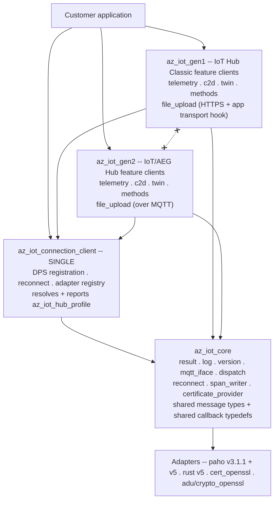

<!-- Copyright (c) Microsoft. All rights reserved.
     Licensed under the MIT license. See LICENSE file in the project root for full license information. -->

# Separating the Classic and AEG feature-client APIs

## Abstract

Today one set of feature clients serves both hub generations. `az_iot_twin_client`,
`az_iot_telemetry_client` and friends each branch internally on
`profile->flavor`, resolved through two static tables in
[`protocol_profile.c`](../../src/core/protocol_profile.c). The result is that
every public feature API is the union of what both generations can do, and the
parts that only one generation supports are discoverable only at run time.

This document specifies splitting the **feature clients** by generation —
`az_iot_gen1_*` for Azure IoT Hub Classic, `az_iot_gen2_*` for the Azure
IoT/AEG Hub — while the **connection client stays single**.

> **Supersedes [split-client.md](split-client.md).** That document evaluated
> splitting by *build target* (`AZ_IOT_FLAVOR=classic|next`), which compiles one
> generation out of the binary entirely. Its analysis of migration risk, feature
> drift and CI cost is folded in here.

---

## 1. Shape

There is **one** connection client, and it keeps ownership of registration.
Provisioning is not a separate client and not an application step.

```c
az_iot_connection_client conn;                    /* one type, both generations */

az_iot_connection_client_init(&conn, &opts);      /* opts.dps.* set as today   */
az_iot_connection_client_register_mqtt_factory(&conn, az_iot_paho_factory_create_v3_1_1());
az_iot_connection_client_register_mqtt_factory(&conn, az_iot_paho_factory_create_v5());
az_iot_connection_client_open(&conn);             /* DPS runs internally       */

while (state != AZ_IOT_CONNECTION_STATE_CONNECTED)
{
  az_iot_connection_client_do_work(&conn, 100);
}

/* The connection now knows which hub generation it landed on. */
az_iot_hub_profile profile = AZ_IOT_HUB_PROFILE_INIT;
az_iot_connection_client_get_hub_profile(&conn, &profile);

if (profile.profile == AZ_IOT_CONNECTION_PROFILE_MQTT_V5)
{
  az_iot_gen2_telemetry_client tel;
  az_iot_gen2_telemetry_client_init(&tel, &conn);   /* AEG API */
  ...
}
else
{
  az_iot_gen1_telemetry_client tel;
  az_iot_gen1_telemetry_client_init(&tel, &conn);   /* Classic API */
  ...
}
```

Falling back from AEG to Classic is **application logic**. The SDK's contribution
is to report the generation accurately and to refuse the wrong API loudly.

### What splits, and what does not

| | Disposition |
|---|---|
| `az_iot_connection_client` + DPS + reconnect + adapter registry | **single, shared** |
| MQTT abstraction, adapters, certificate provider, logging, results, dispatch | **single, shared** |
| Message types (`az_iot_telemetry_message`, `az_iot_c2d_message`, …) and callback typedefs | **single, shared** — see [§5](#5-what-stays-shared) |
| Telemetry, C2D, twin, direct methods, file upload **clients** | **split** `gen1` / `gen2` |
| ADU | split by *channel*, see [§8](#8-device-update) |

---

## 2. The connection profile

`az_iot_connection_client_get_hub_profile()` is how an application learns what it
is connected to. It is valid only once the connection reaches `CONNECTED`;
before that it returns `AZ_IOT_ERR_NOT_CONNECTED`.

### The service contract

The source of truth is the DPS data-plane spec added in
[azure-rest-api-specs#45041](https://github.com/Azure/azure-rest-api-specs/pull/45041)
(api-version `2026-11-02-preview`). `connectionProfile` is a `readOnly` property
on `DeviceRegistrationResult`, arriving in the same payload as `assignedHub`,
`deviceId` and `issuedCertificateChain`:

```json
{
  "assignedHub": "ljexps",
  "connectionProfile": "mqttV5",
  "deviceId": "hjvdlwpugzlk"
}
```

Three properties of that contract drive the C API:

| Contract | Consequence |
|---|---|
| It is a **string**, values `classic` and `mqttV5` | Not a numeric `hub_version`. There is no `1`/`2` on the wire. |
| It is an **extensible union** — *"so future hub capabilities pass through without a breaking change"* | The SDK **will** receive values it does not know. A closed C enum cannot represent that. |
| **Absent or null resolves to `classic`** | Missing is not an error. It is a documented default. |

### Shape

```c
typedef enum
{
  AZ_IOT_CONNECTION_PROFILE_CLASSIC = 0,  /* "classic" -- also the absent/null default */
  AZ_IOT_CONNECTION_PROFILE_MQTT_V5 = 1,  /* "mqttV5"                                  */
  AZ_IOT_CONNECTION_PROFILE_UNKNOWN = -1, /* a value newer than this SDK               */
} az_iot_connection_profile;

typedef struct
{
  uint32_t _internal_size;            /* stamped by AZ_IOT_HUB_PROFILE_INIT */
  az_iot_connection_profile profile;
  const char* profile_raw;            /* verbatim wire string, ALWAYS populated */
  /* ... to be extended ... */
} az_iot_hub_profile;

#define AZ_IOT_HUB_PROFILE_INIT { ._internal_size = sizeof(az_iot_hub_profile) }

az_iot_result az_iot_connection_client_get_hub_profile(
    const az_iot_connection_client* client,
    az_iot_hub_profile* out_profile);
```

`profile_raw` is what makes the extensible union survive the trip into C. A value
this SDK has never heard of maps to `UNKNOWN` and is still reported verbatim, so
an application (or a support engineer reading a log) can see what the service
actually said. Discarding it would convert a forward-compatible wire format into
a lossy one at the library boundary — which is precisely the thing the spec
authors went out of their way to avoid.

Because the struct is caller-allocated and will grow, it uses the versioning
pattern this repo already settled on in
[struct_versioning.md](../struct_versioning.md): a size stamp as the first field,
a mandatory initializer macro, and a library-side size check so a caller compiled
against an older header is defaulted rather than misread. Doing that now, while
it has two fields and no shipped callers, is the point.

### An unknown profile fails the connection

**Decided:** if DPS returns a profile this SDK does not recognise, the connection
fails with `AZ_IOT_ERR_CONNECTION_PROFILE_UNSUPPORTED`. The profile — including
`profile_raw` — remains readable so the application can log it, report it, or
trigger a firmware update.

The reasoning is worth recording, because the extensible union invites the
opposite reading. The profile is not expected to break: the service contract
treats it as forward-compatible and the value is forwarded verbatim from the hub.
But a device should be defensive about service-side hazards it cannot verify, and
an unrecognised profile means the SDK does not know which MQTT version to speak.
Connecting anyway would mean guessing the wire protocol. Failing closed turns
that into one clear error at one place, instead of a device that appears to
connect and then misbehaves in ways that surface as unrelated bugs.

### Blocker: the api-version must be raised

**`connectionProfile` is new in `2026-11-02-preview`. The SDK currently requests
`2019-03-31`, so the service will never send it.**

The version travels in the DPS **CONNECT username**
(`<id_scope>/registrations/<registration_id>/api-version=<version>`), built by
`az_iot_provisioning_client_get_user_name()` in `azure-sdk-for-c`, where it is
hardcoded:

```c
#define AZ_IOT_PROVISIONING_SERVICE_VERSION "2019-03-31"
```

Raising it is therefore not a matter of parsing more fields.

**Decision: patch `azure-sdk-for-c` in this repo.** `Azure/azure-sdk-for-c` is
**archived** (verified 08/11/2026; last push 2026-07-15). There is no upstream to
fix it, so this repo owns the dependency from here on. That reframes the task:
the api-version is the first patch, not the only one, and what is actually needed
is a **patching mechanism** rather than a one-off edit.

The seams that already exist:

- `AZ_SDK_C_REPO` and `AZ_SDK_C_TAG` are both `CACHE STRING` in
  [`CMakeLists.txt`](../../CMakeLists.txt) — repointing is a two-line change.
- There is a **registered but uninitialised submodule** at `c/deps/azure-sdk-for-c`
  (`.gitmodules`, gitlink `6d6e634a`), pinned to exactly the commit tag `1.5.0`
  resolves to — i.e. the same source FetchContent builds. Nothing consumes it.
  It also contradicts the "no git submodules" rule stated in
  [devnotes.md](../devnotes.md) and the README. It should be either adopted
  deliberately or removed; leaving a dead gitlink that shadows a real dependency
  is a trap.

Candidate mechanisms:

| | Approach | Trade-off |
|---|---|---|
| A | Fork the archived repo, carry patches as commits, repoint `AZ_SDK_C_REPO`/`_TAG` | Smallest change here; full history of what we changed and why; needs a fork under an org we control |
| B | Keep the pin, add `PATCH_COMMAND` with a `.patch` file in this repo | Patch is reviewable in our PRs; but `PATCH_COMMAND` re-runs on reconfigure and fails once applied, so it needs an `git apply --check ||` guard |
| C | Vendor the source into `c/deps/azure-sdk-for-c` | Hermetic and honest about ownership — archived source will never move; costs thousands of files in-tree and needs explicit coverage/style exclusions |

A is the recommendation: it keeps this repo's diffs about this repo, and an
archived upstream means the fork will never diverge underneath us.

> **Worth stating plainly:** for *this particular* change, patching is not
> strictly required. The api-version is only consumed by
> `az_iot_provisioning_client_get_user_name()`, and this SDK could build the DPS
> CONNECT username itself — it already hand-builds one for the gen2 presence
> handshake. The reason to build the patch mechanism now is the archived
> dependency in general, not this field.

**Parsing the field needs nothing new.** The connection client already walks the
raw ASSIGNED payload with `az_json_reader` to extract `issuedCertificateChain`
(`connection_client.c`, the `DPS_JSON_ISSUED_CERT_CHAIN` path) precisely because
the upstream client does not surface it. `connectionProfile` is read in the same
walk.

---

## 3. Mismatch is an error, not a surprise

Initializing a feature client against a connection of the other generation
**fails**:

```c
/* conn resolved to GEN2 */
az_iot_gen1_twin_client twin;
az_iot_result r = az_iot_gen1_twin_client_init(&twin, &conn);
/* r == AZ_IOT_ERR_HUB_GENERATION_MISMATCH */
```

A dedicated result code is added rather than reusing `AZ_IOT_ERR_NOT_SUPPORTED`,
because this is the single most likely porting mistake and it deserves an
unambiguous diagnostic. The client is left uninitialized and unusable; there is
no partial-init state to unwind.

The check requires the generation to be known, which means **feature clients must
be initialized after the connection is open**. That is a change: today's samples
construct feature clients before `az_iot_connection_client_open()`, and .NET
constructs them before `ProvisionAndConnectAsync`. See
[§9](#9-consequence-init-ordering-changes).

---

## 4. No cross-generation constructs on the public surface

The point of splitting is that each generation's header describes only what that
generation can actually do. A construct that exists on one side must not appear
on the other's API, even as a stub that returns an error.

| Construct | Belongs to |
|---|---|
| MQTT v5 user properties on telemetry / C2D | gen2 |
| Correlation-data request/response matching | gen2 |
| Twin push on connect | gen2 |
| Direct-method probe / ready handshake | gen2 |
| File upload control plane over MQTT | gen2 |
| Topic property-bag encoding | gen1 |
| `$rid` correlation | gen1 |
| File upload over HTTPS + the application HTTP transport hook | gen1 |

This is the concrete reason the split is worth doing: today
[`az_iot_file_upload_client.h`](../../inc/azure/iot/az_iot_file_upload_client.h)
opens by promising "one seamless API, transport chosen by hub flavor", and then
`az_iot_file_upload_client_get_sas_uri()` returns `AZ_IOT_ERR_NOT_SUPPORTED` at
run time on gen2. Both generations pay for a surface neither fully implements.

### File upload is redesigned, not just renamed

- **`az_iot_gen1_file_upload_client`** owns the HTTPS control plane. The
  `az_iot_file_upload_http_transport` hook, the response buffer, and the URL/body
  size macros move out of the shared header into the gen1 header. They are a
  Classic implementation detail and have no meaning on gen2.
- **`az_iot_gen2_file_upload_client`** carries the control plane over the
  existing MQTT connection and takes **no HTTP transport at all**. Its init
  signature is smaller, which is the visible payoff.

Uploading the blob bytes to Azure Storage remains the application's job on both
generations — that never was an SDK responsibility.

---

## 5. What stays shared

Message types and callback typedefs stay **single and shared**, in
`az_iot_core`:

```c
az_iot_telemetry_message msg = { .payload = body, .payload_len = len };

az_iot_gen1_telemetry_client_send(&t1, &msg, on_send_done, &ctx);
az_iot_gen2_telemetry_client_send(&t2, &msg, on_send_done, &ctx);   /* same msg, same callback */
```

Splitting the *clients* is what removes the cross-generation constructs.
Splitting the *data* as well would force a customer to rewrite every message
construction site and every handler body during migration, for no isolation
benefit. Where a generation needs extra per-message data, it goes in that
generation's `_options` argument, not in a forked message type.

---

## 6. Layering



Rules, mechanically enforced (see [§7](#7-enforcement)):

1. `az_iot_gen1` and `az_iot_gen2` MUST NOT reference each other.
2. `core` and the connection client MUST NOT reference `gen1_` or `gen2_`
   symbols. The connection client resolves the generation and publishes it as
   data; it does not call into either library.
3. Feature clients reach the transport only through the connection client's
   existing internal interface — no direct adapter access.

The connection client necessarily contains both generations' *connect* logic
(username construction, the gen2 presence/birth handshake). That is inherent in
having one connection client, and is accepted.

---

## 7. Enforcement

`c/eng/check-layering.sh`, run by the existing `conventions` CI job next to
`check-banned-constructs.sh`:

| Check | Rule |
|---|---|
| `src/gen1/**` contains `gen2_`, or `src/gen2/**` contains `gen1_` | 1 |
| `inc/azure/iot/gen1/*.h` includes `gen2/*`, or vice versa | 1 |
| `src/core/**` contains `gen1_` or `gen2_` | 2 |
| A gen1 header mentions a gen2-only construct from [§4](#4-no-cross-generation-constructs-on-the-public-surface), or vice versa | [§4](#4-no-cross-generation-constructs-on-the-public-surface) |
| A `gen1`/`gen2` symbol name contains `classic`, `next`, `aeg` or `flavor` | [§10](#10-naming) |

Negative-test the gate — reintroduce each violation in a scratch copy and confirm
it fails — before trusting it. A check that cannot fail is worse than no check,
because it is believed.

---

## 8. Device Update

ADU blocks the split in its current shape: `az_iot_adu_client_initialize()` takes
a mandatory `az_iot_twin_client*` and calls twin APIs from five sites, welding it
to Classic delivery.

Split into a transport-independent **`adu_core`** (manifest v5 parsing, JWS/SJWK
verification, root keys, SHA-256, the download/backup/install/apply state
machine, reboot/resume persistence) plus an **`az_iot_adu_channel`** vtable
carrying delivery and reporting.

| Channel | Generation | Status |
|---|---|---|
| Twin-based (ADUv1) | gen1 | Works today; **deprecated** on arrival |
| DPS onboarding + AEG hub (ADUv2) | gen2 | **Declared, not implemented** |

> **`adu-feature-support.md` Part B is stale.** It describes ADUv2 as a
> device-initiated HTTPS RPC protocol reporting to Azure Device Registry; the
> current direction is DPS onboarding plus the AEG hub. The channel vtable is
> shaped so either answer plugs in without touching the verify/download/install
> core, because the service contract is not final.

ADUv1 keeps working through the split. Dropping it is a separate decision with
its own deprecation window, not a side effect of re-layering.

---

## 9. Consequence: init ordering changes

Because the generation is only known after registration completes, and because
[§3](#3-mismatch-is-an-error-not-a-surprise) makes a mismatched init fail,
feature clients must be created **after** the connection is open. Today
[`samples/telemetry/main.c`](../../samples/telemetry/main.c) does the opposite.

This is a real ergonomic cost and it is worth stating plainly rather than
discovering it in review: a feature client can no longer be a long-lived
member constructed alongside the connection at start-up. Applications that
subscribe to inbound traffic must register handlers after `CONNECTED`, and
must re-establish feature clients if a reconnect could change generation.

Two things to settle:

- **Can a reconnect change the generation?** If DPS can reassign a device from
  Classic to AEG mid-life, every feature client held by the application becomes
  invalid at that moment and the application must be told. If reassignment
  requires a restart, this problem disappears. This is the single most important
  unanswered question in this document.
- **Should a mismatched feature client fail at init, or is a
  "generation changed" connection-state callback also required?** Failing at
  init handles the start-up case; it does not handle the mid-life case.

---

## 10. Naming

`gen1` / `gen2` matches .NET's vocabulary and is short enough to sit in every
feature-client symbol without noise. The team expects to rename once service-side
naming settles, so the scheme keeps that rename mechanical:

- Headers `inc/azure/iot/gen1/`, `inc/azure/iot/gen2/`; sources `src/gen1/`, `src/gen2/`
- Symbols `az_iot_gen1_*`, `az_iot_gen2_*` — the infix appears in exactly one
  position, immediately after `az_iot_`
- CMake targets `az_iot_gen1`, `az_iot_gen2`
- `classic`, `next`, `aeg` and `flavor` are banned from generation symbol names

### Two vocabularies, deliberately

The service contract publishes its own names: `classic` and `mqttV5`. This
document keeps **both**, mapped in exactly one place:

| API namespace | Wire value | Meaning |
|---|---|---|
| `az_iot_gen1_*` | `"classic"` | Classic MQTT 3.x capable IoT Hub |
| `az_iot_gen2_*` | `"mqttV5"` | MQTT 5 capable IoT Hub |

**Decided (for now):** `classic` maps to gen1, `mqttV5` maps to gen2.

The profile enum uses the service's spelling
(`AZ_IOT_CONNECTION_PROFILE_CLASSIC` / `_MQTT_V5`) so the wire vocabulary is not
invented twice and a log line matches the spec. The feature-client namespaces
keep `gen1`/`gen2` because they name an *API surface*, not a transport — and
because `mqttV5` would be an actively misleading name for a namespace whose
distinguishing feature is topic structure and payload shape, not merely the MQTT
version.

The mapping lives in one function so that a future third profile, or a rename,
touches one place.

The internal `az_iot_hub_flavor` and `az_iot_hub_protocol` enums are replaced by
`az_iot_connection_profile`. `az_iot_mqtt_role` keeps its DPS member.

---

## 11. Samples and tests

**Per-feature dual samples.** Every feature ships two samples — the Classic route
and the AEG route — so each API is demonstrated on its own terms rather than
through a branch. Plus one sample showing the profile query and the
application-side fallback, which is the migration story in executable form.

**Test expansion.** This roughly doubles the feature-client test surface: each
generation's client needs its own unit suite against the in-memory mock, and each
needs e2e coverage against a real hub of that generation. New cases that do not
exist today:

- mismatched init returns `AZ_IOT_ERR_HUB_GENERATION_MISMATCH`, per feature
- `"classic"` and `"mqttV5"` each map to the right profile and MQTT version
- **absent** `connectionProfile` resolves to `classic`, and **`null`** does too
- an **unrecognised** profile string fails the connection with
  `AZ_IOT_ERR_CONNECTION_PROFILE_UNSUPPORTED` and is still readable verbatim
  through `profile_raw` — the forward-compatibility case the spec exists to
  support, and the one no current test covers
- the DPS CONNECT username carries `api-version=2026-11-02-preview`
- `get_hub_profile` before `CONNECTED` returns `AZ_IOT_ERR_NOT_CONNECTED`
- an older-header caller (smaller `_internal_size`) is defaulted, not misread
- gen1 file upload with no HTTP transport supplied fails at init
- gen2 file upload exposes no HTTP transport at all (compile-level)

e2e needs provisioned resources for **both** generations. Whether the external
`iot-sdks-e2e-fx` provisioning module can create an AEG hub yet is unresolved,
and gates the e2e half of this.

---

## 12. Phases

| # | Phase | Depends on | Notes |
|---|---|---|---|
| P0a | Purge the dead "easy"/API B remnants | — | **Done** (`db074c0`) |
| P0b | This document + doc reconciliation | — | |
| P1a | Establish the `azure-sdk-for-c` patch mechanism and raise the DPS api-version to `2026-11-02-preview` | — | Prerequisite for everything. Without it `connectionProfile` never arrives. Also resolve the dead `c/deps/azure-sdk-for-c` gitlink. |
| P1b | `az_iot_hub_profile` + `get_hub_profile()` + `az_iot_connection_profile` + `AZ_IOT_ERR_HUB_GENERATION_MISMATCH` + `AZ_IOT_ERR_CONNECTION_PROFILE_UNSUPPORTED`; parse `connectionProfile` in the existing ASSIGNED-payload walk | P1a | Additive. No feature client moves. |
| P2 | Split the feature clients, one PR each: telemetry → c2d → direct methods → twin | P1 | Mutually parallel. Mismatch check per client. |
| P3 | File upload redesign — HTTP transport becomes gen1-only | P1 | Larger than the others; own PR. |
| P4 | Delete `protocol_profile.c`'s flavor tables and the last `profile->flavor` branches | P2, P3 | |
| P5 | Re-layer ADU onto `adu_core` + channel vtable | P4 | ADUv2 declared only. |
| P6 | Dual samples per feature, `check-layering.sh`, coverage floors for `gen1`/`gen2` | P2–P4 | |

The connection client is **not** restructured. That is the main saving versus the
earlier plan.

### Verification per phase

Linux gcc **and** clang: configure + build with `AZ_IOT_BUILD_TESTS=ON` **and
`AZ_IOT_BUILD_E2E=ON`**, `ctest`, the c99-strict build
(`-std=c99 -pedantic -Werror`), valgrind memcheck, MSVC, conformance against a
real broker, `check-banned-constructs.sh`, and `code-style.sh check` under
clang-format 18.

`AZ_IOT_BUILD_E2E=ON` is called out because it is **off by default**: the e2e
agent is not compiled by an ordinary build, and it has been broken twice by
public callback signature changes that every other job accepted.

Per-component coverage floors in
[`coverage-components.json`](../../tests/coverage-components.json) must gain
`gen1` and `gen2` entries in the same PR that creates those directories, or the
split silently drops coverage against the current 72.5% line / 49.9% branch
baseline.

---

## 13. Decided

- **The DPS exchange moves to the `2026-11-02-preview` api-version**, and
  `azure-sdk-for-c` is patched in this repo to allow it. The upstream repo is
  archived, so there is no alternative and no risk of divergence.
- **`classic` maps to gen1, `mqttV5` maps to gen2**, for now.
- **An unrecognised profile fails the connection.** The profile is not expected
  to break, but a device should be defensive about service-side hazards it
  cannot verify.

## 14. Open questions

1. **Which patch mechanism** — fork and repoint, `PATCH_COMMAND`, or vendor
   ([§2](#blocker-the-api-version-must-be-raised)). Also decides whether the dead
   `c/deps/azure-sdk-for-c` submodule is adopted or removed.
2. **Can a reconnect change the profile?** [§9](#9-consequence-init-ordering-changes).
   Determines whether feature-client invalidation needs an API.
3. **Where does runtime CSR renewal live?** `az_iot_connection_client_send_csr()`
   is Classic-only today and returns `AZ_IOT_ERR_NOT_SUPPORTED` on gen2 — exactly
   the cross-generation construct [§4](#4-no-cross-generation-constructs-on-the-public-surface)
   forbids, but it sits on the shared connection client. Move it to a gen1
   certificate-management feature client, or accept the exception? .NET keeps it
   on the connection client.
4. **Is gen1 frozen?** If new features are gen2-only, that needs stating so
   reviewers stop asking for parity.
5. **e2e for gen2** — does `iot-sdks-e2e-fx` support provisioning an AEG hub?

---

## Version

- 08/10/2026: Created. Supersedes [split-client.md](split-client.md).
