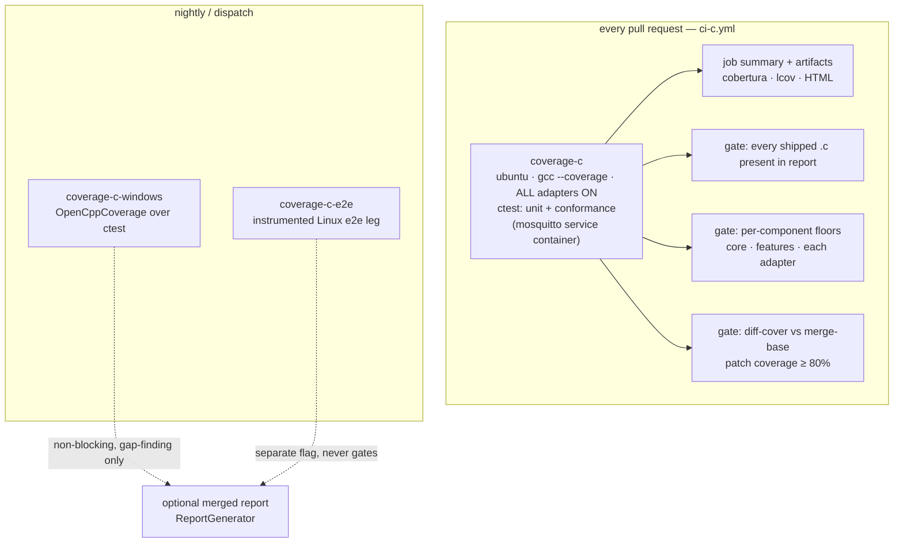

<!-- Copyright (c) Microsoft. All rights reserved.
     Licensed under the MIT license. See LICENSE file in the project root for full license information. -->

# Code coverage — C SDK

This document is the design for collecting, publishing, and gating on code
coverage metrics for the C SDK (`c/`) from CI.

**Status: Phase 1 is implemented and running.** Coverage is measured and
published on every pull request, and nothing fails on a coverage number yet.
Phases 2 to 4 — per-component floors, the patch gate, and the Windows/e2e legs
— are still design.

> Scope: the C SDK exclusively. The unit of measurement is first-party C code
> (`c/src/`, `c/adapters/`). Fetched dependencies, test code, and samples are
> deliberately outside the denominator.

---

## Current state

There is no coverage instrumentation anywhere in the C build or in
[ci-c.yml](../../../.github/workflows/ci-c.yml). The existing jobs are
`build` (three presets), `c99-strict`, `valgrind`, and `asan-windows` — all
correctness gates, none of them measuring what fraction of the SDK those tests
actually reach.

Two pre-existing facts constrain the design:

1. **`ci-c.yml` passes option names that do not exist.**
   `-DAZ_IOT_AEG_WITH_PAHO` and `-DAZ_IOT_AEG_BUILD_TESTS` are dead cache
   variables; the real names are in
   [az_iot_options.cmake](../../cmake/az_iot_options.cmake). The practical
   effect is that `c99-strict` builds with `AZ_IOT_BUILD_TESTS=OFF` and its
   `ctest` step finds no tests. A coverage job that copies that pattern would
   dutifully report ~0%. The coverage work must use the real option names, and
   ideally the existing ones get fixed in the same change.

2. **Dependencies arrive via `FetchContent`** (azure-sdk-for-c, cmocka, Paho)
   and materialize under `build/<preset>/_deps/`. They must never be
   instrumented and never appear in the report. This rules out setting coverage
   flags globally through `CMAKE_C_FLAGS`.

---

## Goals & constraints

- **Deterministic on pull requests.** The number a PR sees must not depend on
  Azure provisioning, network conditions, or a broker outside the runner. A
  coverage gate that flakes is a coverage gate that gets deleted.
- **First-party code only.** Fetched dependencies, `tests/`, and `samples/`
  are excluded from the denominator. Test code must not inflate the score.
- **Never perturb the existing correctness gates.** Coverage builds get their
  own build tree; `linux-gcc-debug`, the valgrind leg, and the ASan leg are
  untouched.
- **Locally reproducible.** An engineer must be able to produce the exact CI
  report on their own machine with one preset and one command, including
  browsable HTML.
- **Cheap enough to run on every PR.** One extra Linux job, comparable in wall
  time to the existing `linux-gcc-debug` leg.
- **Ratchet, never regress.** Thresholds only move up.

### Non-goals (v1)

- MC/DC or condition coverage (requires clang ≥ 19 `-fmcdc-coverage`; only
  relevant if a safety-critical certification story emerges).
- Coverage parity across platforms. Linux/gcc is the gate; Windows is a
  periodic gap-finder, not a blocker.
- Gating on numbers derived from e2e or conformance runs against live
  infrastructure.

---

## What is measured

| Metric | Source | Gated |
| --- | --- | --- |
| **Line coverage** | gcov counters | yes (floor + patch) |
| **Branch coverage** | gcov `-b` counters | yes (floor only) |
| **Function coverage** | gcov counters | reported, not gated |

**In the denominator:** `c/src/core/`, `c/src/features/`, `c/adapters/**`.

**Excluded:** `_deps/**` (fetched dependencies), `c/tests/**`, `c/samples/**`,
`c/deps/**`, generated headers (`VersionInfo.h`).

**Which tests contribute:** the cmocka unit suites plus the MQTT iface
conformance suites, since CI already runs an `eclipse-mosquitto:2` service
container and the conformance harnesses are the only thing exercising
`az_iot_adapter_paho` end to end. E2E-derived coverage is measured separately
and never merged into the gating number (see Phase 4).

---

## Shipped adapters — the coverage guarantee

Adapters are shipped code. They are also the part of the tree where a naive
coverage setup silently lies, for two independent reasons.

### Problem 1: the denominator can shrink

Every adapter is behind a build option, and two of them additionally require
`find_package(OpenSSL 3.0)` to have succeeded
([tests/CMakeLists.txt](../../tests/CMakeLists.txt) guards them on
`if(TARGET ...)`):

| Adapter | Option | Default | Extra condition |
| --- | --- | --- | --- |
| `az_iot_adapter_paho` | `AZ_IOT_WITH_PAHO` | ON | — |
| `az_iot_su_crypto_openssl` | `AZ_IOT_WITH_SU_CRYPTO_OPENSSL` | ON | OpenSSL ≥ 3.0 found |
| `az_iot_certificate_provider_managed` | `AZ_IOT_WITH_CERT_PROVIDER_MANAGED` | ON | OpenSSL ≥ 3.0 found |
| `az_iot_adapter_rust_mqtt` | `AZ_IOT_WITH_RUST_MQTT` | **OFF** | does not currently compile |

Coverage is computed over what was *built*. If an adapter is not built, its
lines are not in the report at all — so dropping an adapter does not register
as a coverage **drop**, it registers as a coverage **rise**, because poorly
tested code left the denominator. A global floor cannot detect this; it is
rewarded by it. An `apt` change that stops OpenSSL 3.0 from being found would
quietly delete two shipped adapters from the measurement and turn the graph
green.

Two assertions close this:

1. **Configure-time.** When `AZ_IOT_ENABLE_COVERAGE` is ON, the optional
   dependencies become mandatory — `find_package(OpenSSL 3.0 REQUIRED)`
   instead of `QUIET`, and every `AZ_IOT_WITH_*` is forced ON in the coverage
   preset. A missing dependency then fails configuration loudly instead of
   silently shrinking the denominator.
2. **Report-time.** The job asserts that every `.c` file under `src/` and
   `adapters/` appears in the gcovr report. A source file present on disk but
   absent from the report fails the job. This is the actual guarantee: *code
   we ship cannot be unmeasured.*

### Problem 2: a global floor hides a bad component

A single repo-wide number lets a well-tested core mask an untested adapter.
The gate is therefore evaluated **per component**, each with its own floor,
from a checked-in manifest that drives both the thresholds and the
presence assertion:

```jsonc
// c/tests/coverage-components.json
// `line`/`branch` are the floors; null means measured and reported but not
// gated. They are all null today (Phase 1) and get filled in for Phase 2.
[
  { "name": "core",                 "prefix": "src/core/",                     "line": null, "branch": null },
  { "name": "features",             "prefix": "src/features/",                 "line": null, "branch": null },
  { "name": "adapter-paho",         "prefix": "adapters/paho/",                "line": null, "branch": null },
  { "name": "adapter-su-crypto",   "prefix": "adapters/su/crypto_openssl/",  "line": null, "branch": null },
  { "name": "adapter-cert-managed", "prefix": "adapters/cert_openssl/",        "line": null, "branch": null }
]
```

`prefix` is a path relative to `c/`. It does double duty: it selects the
component's files out of the gcovr report (the same role gcovr's `--filter`
plays), and it is the directory walked on disk for the denominator assertion.
A prefix that does not resolve to a directory containing `.c` files is a hard
error rather than an empty row.

`tests/coverage_report.py` aggregates the gcovr `--json-summary` per component,
reports every one of them in the job summary whether it passed or not, and with
`--enforce` exits non-zero on a missed floor or an unmeasured source file.

### Which adapters are gated

**Rule: built and measured always; gated when shipped by default.**

That gates Paho, the software updates OpenSSL crypto adapter, and the managed certificate
provider.

`az_iot_adapter_rust_mqtt` is excluded from the coverage build entirely, and
not for policy reasons: **it does not compile.** Building `main` with
`AZ_IOT_WITH_RUST_MQTT=ON` fails on a C99 typedef redefinition in
[az_iot_mqtt_rust_ffi.h](../../adapters/rust_mqtt/az_iot_mqtt_rust_ffi.h)
under `-Werror=pedantic`, and
[rust_mqtt_adapter_test.c](../../tests/unit/rust_mqtt_adapter_test.c) still
references an `az_iot_mqtt_iface` API that no longer exists
(`az_iot_mqtt_role`, `supported_roles_mask`, a different `create` arity). This
is invisible today because the option defaults to `OFF` **and** the valgrind
job's attempt to enable it uses the dead `AZ_IOT_AEG_WITH_RUST_MQTT` name.

It is therefore neither built nor listed in `coverage-components.json`. When it
is repaired it gets an entry like everything else — measured immediately,
gated once it becomes default-on.

### Measured baseline (Phase 1)

First full run, Linux/gcc, unit + conformance suites, all 16 CTest suites
passing:

| Component | Files | Lines | Line % | Branch % |
| --- | ---: | ---: | ---: | ---: |
| `core` | 11 | 1221 | 77.5% | 53.7% |
| `features` | 8 | 1743 | 68.5% | 49.4% |
| `adapter-paho` | 1 | 461 | 67.0% | 38.4% |
| `adapter-su-crypto` | 1 | 91 | 80.2% | 46.5% |
| `adapter-cert-managed` | 1 | 161 | 89.4% | 57.9% |
| **total** | 22 | 3677 | **72.5%** | **49.9%** |

The prediction that the Paho adapter would sit far below the rest was **too
pessimistic**: at 67.0% line it trails `core` by ten points, not by the margin
its 68-line smoke test suggests. The conformance suites carry it, which is
exactly why the broker precondition below is mandatory — without a broker this
number collapses to roughly what the smoke test alone reaches.

Branch coverage is the weaker story everywhere (49.9% overall, 38.4% for the
Paho adapter) and is the more honest measure of how much of the error handling
is exercised. Expect the branch floors to be set well below the line floors
initially.

### The floors, and how they were chosen

Floors are now set for every component and every metric. They are **configured
but not enforced**: the report prints them and marks each component PASS or
FAIL, and the job still cannot fail the build. The report says so explicitly, so
a FAIL row is not mistaken for a broken gate.

They are derived from the **unit + conformance** numbers, not from the nightly
combined ones. The same `coverage-components.json` is read by both the per-PR
job and the nightly combined job, so a floor set from the combined figure would
be unreachable on every pull request. The e2e suites add roughly a point overall
(72.5% → 73.7% line), so the two are close, but the per-PR number is the one
that has to be satisfiable.

The rule: round down to a multiple of 5 below the measured value, keeping at
least 2 points of headroom. Round numbers because a floor is a policy decision
rather than a measurement, and headroom because an ordinary refactor moves these
figures by a point or so and a gate that fires on noise gets switched off.

| Component | line | branch | function |
| --- | ---: | ---: | ---: |
| `core` | 75 | 60 | 80 |
| `features` | 65 | 50 | 85 |
| `adapter-paho` | 60 | 35 | 75 |
| `adapter-su-crypto` | 75 | 40 | 95 |
| `adapter-cert-managed` | 75 | 55 | 80 |

Minimum headroom across all fifteen floors is 2.7 points (`features` function).
The Paho adapter carries the lowest floors deliberately: its coverage comes
almost entirely from the broker-gated conformance suites, so a broker outage
moves it further than any other component.

These are a **ratchet against regression, not the target**. The stated goal is
80% on the lower bar; `core` is the only component near it and the overall
figure is 72.5%. Raising the floors means writing tests, and each floor should
be lifted as its component clears the next multiple of 5 -- not left to drift
upward automatically, which would turn an unrelated improvement into someone
else's build failure.

### The Paho adapter's coverage depends entirely on the broker

| | Lines |
| --- | --- |
| [adapters/paho/az_iot_mqtt_paho.c](../../adapters/paho/az_iot_mqtt_paho.c) | 906 (461 executable) |
| [tests/unit/paho_adapter_smoke_test.c](../../tests/unit/paho_adapter_smoke_test.c) | 68 |

The smoke test is explicitly construction-level — its own header says it "does
not touch the network". It asserts factory version tagging, vtable
population, `disconnect` on an unconnected client, and an empty `process_loop`.
Connect, subscribe, publish, inbound dispatch, MQTT5 properties, TLS/cert
configuration, and the whole Paho-to-`az_iot_result` error mapping are
untouched by it.

Everything real in that file is reached only by the **conformance suites**
against the mosquitto service container. Two consequences fall out:

- The broker is load-bearing for the Paho number, not incidental. See the
  broker-reachability gotcha — with per-component floors, a container that
  fails to start does not merely skip tests, it collapses `adapter-paho` and
  fails the PR for an infrastructure reason.
- The Windows leg contributes no Paho coverage at all, because there is no
  broker there.

**Raising it further means writing adapter tests, not lowering the floor.** The
error mapping and configuration paths are unit-testable against a mocked Paho
surface; the protocol surface already has the conformance suite as its vehicle.

---

## Toolchain selection

| Leg | Instrumentation | Report tool | Role |
| --- | --- | --- | --- |
| **Linux / gcc** | `--coverage -O0 -g -fprofile-abs-path -fprofile-update=atomic` | gcovr ≥ 7 | **PR gate** |
| **Windows / MSVC** | none required | OpenCppCoverage | nightly, non-blocking |
| Linux / clang | — | — | rejected |

### Rationale

**gcc + gcovr** is the primary path. gcov is built into the compiler already
used by `linux-gcc-debug`; gcovr is a single `pip install`, emits Cobertura,
LCOV, HTML, and GitHub-flavored Markdown from one invocation, and has
`--fail-under-line` / `--fail-under-branch` built in — no shell arithmetic on
parsed XML.

**OpenCppCoverage** is the only realistic way to see `#ifdef _WIN32` paths
(`az_win32`, the Windows certificate/TLS branches). Its decisive property is
that it needs **zero build changes**: it attaches to the process and reads PDBs,
so it runs against the existing `windows-msvc-debug` preset unmodified. It is
also slow enough (process-attach instrumentation over `--cover_children`) that
it belongs on a schedule, not on PRs.

**clang source-based coverage** (`-fprofile-instr-generate -fcoverage-mapping`)
was rejected for v1. It produces better region-level data, but it requires
merging `.profraw` files across ~15 separate test executables via
`llvm-profdata`, then a second `llvm-cov export` step, for a line/branch number
that is materially identical to gcc's. It is the right upgrade path if
region-accurate or MC/DC data is ever needed.

**Cobertura XML is the interchange format.** gcovr and OpenCppCoverage both
emit it, so one publishing, merging, and diff-gating path serves every leg.

---

## Build & CMake wiring

### New option

`AZ_IOT_ENABLE_COVERAGE` (default `OFF`) joins the existing options in
[az_iot_options.cmake](../../cmake/az_iot_options.cmake).

### New module: `cmake/az_iot_coverage.cmake`

Coverage flags are applied **per target**, mirroring the established
`az_iot_apply_warnings()` pattern in
[compiler_warnings.cmake](../../cmake/compiler_warnings.cmake). This is the
mechanism that keeps `_deps/` clean — the same reason warnings are scoped that
way today:

```cmake
function(az_iot_apply_coverage target)
    if(NOT AZ_IOT_ENABLE_COVERAGE)
        return()
    endif()
    if(MSVC)
        return()  # Windows coverage is external (OpenCppCoverage); no flags needed.
    endif()
    target_compile_options(${target} PRIVATE
        --coverage
        -fprofile-abs-path        # absolute paths in .gcno so gcovr resolves sources
        -fprofile-update=atomic   # safe counters if a suite ever goes multithreaded
    )
    # PUBLIC so consumers (the cmocka test exes) pick up -lgcov on their link line.
    target_link_options(${target} PUBLIC --coverage)
endfunction()
```

Called from [src/CMakeLists.txt](../../src/CMakeLists.txt) for `az_iot_core`,
and from each adapter's `CMakeLists.txt` for `az_iot_adapter_paho`,
`az_iot_adapter_rust_mqtt`, `az_iot_su_crypto_openssl`, and
`az_iot_certificate_provider_managed`.

**Not** called for `az_iot_test_support`, `az_iot_conformance`, or any cmocka
test executable — instrumenting test code would put it in the denominator.

### Separate build tree

Coverage gets its own preset, `linux-gcc-coverage`, in
[CMakePresets.json](../../CMakePresets.json):

```jsonc
{
    "name": "linux-gcc-coverage",
    "inherits": "linux-base",
    "generator": "Ninja",
    "cacheVariables": {
        "CMAKE_C_COMPILER": "gcc",
        "CMAKE_BUILD_TYPE": "Debug",
        "CMAKE_C_FLAGS": "-O0",
        "AZ_IOT_BUILD_TESTS": "ON",
        "AZ_IOT_ENABLE_COVERAGE": "ON",
        // Every adapter ON, including the ones that are OFF by default.
        // Anything not built is not measured -- see "Shipped adapters".
        "AZ_IOT_WITH_PAHO": "ON",
        "AZ_IOT_WITH_RUST_MQTT": "ON",
        "AZ_IOT_WITH_SU_CRYPTO_OPENSSL": "ON",
        "AZ_IOT_WITH_CERT_PROVIDER_MANAGED": "ON"
    },
    "condition": { "type": "equals", "lhs": "${hostSystemName}", "rhs": "Linux" }
}
```

Under `AZ_IOT_ENABLE_COVERAGE`, the OpenSSL lookups that currently guard two
adapters switch from `QUIET` to `REQUIRED`, so a missing dependency fails
configuration instead of silently removing shipped code from the denominator.

Bolting `--coverage` onto `linux-gcc-debug` was considered and rejected:
forcing `-O0` and gcov instrumentation into the shared debug tree changes the
code the valgrind leg analyzes, roughly doubles test wall time for jobs that
gain nothing from it, and leaves `.gcda` files scattered through a tree other
jobs reuse.

### Local workflow

A `coverage` custom target makes the local invocation identical to CI:

```sh
cmake --preset linux-gcc-coverage
cmake --build --preset linux-gcc-coverage
ctest --preset linux-gcc-coverage --output-on-failure
cmake --build --preset linux-gcc-coverage --target coverage
# → build/linux-gcc-coverage/coverage/html/index.html
```

The generated `lcov.info` is consumable by the VS Code Coverage Gutters
extension for inline annotation while writing tests.

### gcovr invocation

One gcovr pass produces every artifact and carries **no** threshold:

```sh
gcovr --root "$PWD" "$PWD/build/linux-gcc-coverage" \
      --filter "$PWD/src/" --filter "$PWD/adapters/" \
      --exclude '.*/_deps/.*' \
      --exclude '.*/tests/.*' \
      --exclude '.*/samples/.*' \
      --cobertura coverage/cobertura.xml --cobertura-pretty \
      --lcov coverage/lcov.info \
      --json-summary coverage/summary.json --json-summary-pretty \
      --html-details coverage/html/index.html \
      --txt --print-summary
```

Two details that are easy to get wrong:

- The build tree must be given as an **explicit positional search path**.
  `--root` only declares where sources live; gcovr otherwise searches the root
  for `.gcda` files, finds none, and cheerfully reports `0.0% (0 out of 0)`.
- Branch counters need no extra flag. gcovr's `--branches` (now
  `--txt-metric branch`) only selects which metric the *text* report displays;
  `--json-summary` and the Cobertura output carry `branch_total` /
  `branch_covered` unconditionally.

Aggregation and gating are then a single pass over that summary:

```sh
python3 tests/coverage_report.py \
  --summary build/linux-gcc-coverage/coverage/summary.json \
  --components tests/coverage-components.json \
  --source-root "$PWD" \
  --output build/linux-gcc-coverage/coverage/summary.md \
  [--enforce]
```

Doing it in one script rather than one gcovr invocation per component means
every component is evaluated before the job fails, so a single run reports the
full picture instead of one problem per push. `--enforce` is what turns a missed
floor or an unmeasured source file into a non-zero exit; Phase 1 omits it.

### .gitignore

Add `*.gcda`, `*.gcno`, and `coverage/`.

---

## CI workflow



### `coverage-c` — the PR gate

Lives in [ci-c.yml](../../../.github/workflows/ci-c.yml) alongside the other C
jobs. Shape:

- `runs-on: ubuntu-latest`, with the same `eclipse-mosquitto:2` service
  container the `build` and `valgrind` jobs already declare.
- **Broker precondition:** assert the broker is actually reachable and fail if
  not. The conformance suites are where nearly all Paho adapter coverage comes
  from, and they now fail rather than skip when the broker is missing — so
  probing first turns an infrastructure outage into an obvious error instead of
  a wall of connection failures.
- `actions/checkout@v4` with `fetch-depth: 0` — `diff-cover` needs the
  merge-base.
- Install `ninja-build`, `libssl-dev` (the OpenSSL adapters are mandatory
  here), plus `gcovr` and `diff-cover` (pip, version-pinned).
- Configure/build with the `linux-gcc-coverage` preset — every adapter ON.
- **Sentinel:** assert `ctest --show-only=json-v1` discovered ≥ `MIN_TESTS`
  suites *before* running anything.
- `ctest --output-on-failure` — the full suite except `e2e`.
- **Denominator assertion:** every `.c` under `src/` and `adapters/` must
  appear in the gcovr report.
- Run gcovr once over the whole tree, then `tests/coverage_report.py` to
  aggregate per component and apply the floors; run `diff-cover` with the patch
  floor.
- Write the per-component table and the `diff-cover` markdown into
  `$GITHUB_STEP_SUMMARY`.
- Upload `coverage/` as an artifact (Cobertura, LCOV, HTML, text), with
  `if: always()` so a *failing* gate still publishes the report that explains
  why.

`$GITHUB_STEP_SUMMARY` is the primary reporting surface deliberately: it
requires no token permissions and works on every run, including fork PRs. A
sticky PR comment is a secondary nicety, not load-bearing.

### `coverage-c-windows` — nightly gap-finder

Scheduled + `workflow_dispatch`, never blocking:

```pwsh
OpenCppCoverage.exe --sources c\src --sources c\adapters `
    --excluded_sources _deps --excluded_sources c\tests --excluded_sources c\samples `
    --export_type cobertura:coverage\windows-cobertura.xml `
    --export_type html:coverage\html `
    --cover_children -- ctest --preset windows-msvc-debug -C Debug -E "e2e|conformance"
```

No CMake changes are required for this leg — it consumes the existing
`windows-msvc-debug` build. Its value is answering "what Windows-only code has
no test at all", which the Linux gate structurally cannot see.

### Workflow trigger hygiene

Per the repo convention, any workflow touched here must list **its own path**
and every composite action it consumes in its path filter, otherwise a
coverage-only change to the workflow produces a green PR that never ran the
job it changed.

Once the coverage check becomes a *required* check, that filter has to move out
of the `on:` block entirely — see [Enforcement §3](#3-the-check-must-actually-be-reported-on-every-pr--needs-a-structural-fix).

---

## Gating policy

Four distinct failures get conflated under "the minimum bar". Each needs its
own gate, and all four are in scope:

| Question | Gate | Catches |
| --- | --- | --- |
| **"Is the code this PR adds tested?"** | **Patch gate** — `diff-cover` ≥ 80% of changed lines | A PR that ships code with no tests. This is the *tests must be present* gate. |
| **"Did any component regress?"** | **Per-component floors** — `gcovr --fail-under-line` / `--fail-under-branch`, once per component | Deleted tests, disabled suites, and a bad adapter hiding behind a well-tested core. |
| **"Is all shipped code still being measured?"** | **Denominator assertion** — every `.c` in `src/` and `adapters/` must appear in the report | An adapter dropping out of the build and *raising* the coverage number. |
| **"Did the suite silently stop running?"** | **Test-count sentinel** — `ctest` must discover ≥ N tests | A misconfigured build where zero tests run and everything passes trivially. |

The floors alone do **not** guarantee new code is tested: adding 200 uncovered
lines to a component of any size moves its percentage by a fraction of a point,
so under any floor with realistic slack that PR passes. The patch gate is what
makes "no tests → no merge" true; the floors are a backstop against bulk
regression, and the denominator assertion is what stops the floors from being
gamed by deletion.

The sentinel exists because this repo has already been bitten by it: `ci-c.yml`
passes `-DAZ_IOT_AEG_BUILD_TESTS`, a name that does not exist, so `c99-strict`
finds no tests and its `ctest` step passes green. Without a sentinel, the same
class of typo in the coverage job would produce a 0-test run — and gcovr would
report a coverage number computed over nothing.

```sh
# Fails the job if the build silently discovered fewer suites than expected.
discovered=$(ctest --preset linux-gcc-coverage --show-only=json-v1 | jq '.tests | length')
[ "$discovered" -ge "${MIN_TESTS}" ] \
  || { echo "::error::only $discovered tests discovered, expected >= ${MIN_TESTS}"; exit 1; }
```

Patch gate invocation:

```sh
diff-cover coverage/cobertura.xml \
           --compare-branch=origin/main \
           --markdown-report coverage/patch.md \
           --fail-under=80
```

`MIN_TESTS` and the patch percentage live as `env:` in the workflow; the
per-component floors live in `coverage-components.json`. Both are owner-gated
(see §4 below).

### Phasing

Because the ruleset references a single stable check name, thresholds can
tighten without ever touching the ruleset again:

| Phase | Gate | Ruleset |
| --- | --- | --- |
| **1** | none — measure and publish, per component | Created in `evaluate` (dry-run) mode. One `workflow_dispatch` run on `main` yields the per-component baselines. Hours, not weeks. |
| **2** | Per-component floors + denominator assertion + test-count sentinel | Flipped to `active`. |
| **3** | Patch coverage ≥ 80% | **No ruleset change** — the required check already covers it. |

The denominator assertion is deliberately in Phase 2 rather than Phase 3: it
has no calibration to do (a file is either in the report or it is not), so
there is no reason to defer it.

---

## Enforcement — what actually makes a PR fail

A failing check and a blocked merge are different things. Four pieces have to
be in place for a merge block to follow from a threshold violation.

### 1. The job must exit non-zero — covered by this design

`gcovr --fail-under-line` / `--fail-under-branch`, `diff-cover --fail-under`,
and the sentinel all exit non-zero below threshold, which fails the step and
the job. If `ctest` fails first, the job fails anyway and no number is
published.

### 2. The check must be *required* — a ruleset on `main`

Today `Azure/azure-iot-sdk` has **no branch protection rule and no ruleset** —
`GET /branches/main/protection` returns 404 and `GET /rulesets` returns `[]`.
Every check in this repo is currently advisory: a red job is visible on the PR
and the merge button still works.

Create the ruleset from a file rather than the web UI, so it is reviewable and
reproducible:

```jsonc
// ruleset.json
{
  "name": "main — required checks",
  "target": "branch",
  "enforcement": "evaluate",          // Phase 1 dry-run; "active" from Phase 2
  "conditions": { "ref_name": { "include": ["~DEFAULT_BRANCH"], "exclude": [] } },
  "bypass_actors": [],                // nobody bypasses, admins included
  "rules": [
    { "type": "deletion" },
    { "type": "non_fast_forward" },
    { "type": "pull_request",
      "parameters": {
        "required_approving_review_count": 1,
        "require_code_owner_review": true,
        "dismiss_stale_reviews_on_push": false,
        "require_last_push_approval": false,
        "required_review_thread_resolution": false
      } },
    { "type": "required_status_checks",
      "parameters": {
        "strict_required_status_checks_policy": true,
        "required_status_checks": [
          { "context": "coverage-gate", "integration_id": 15368 }
        ]
      } }
  ]
}
```

```sh
gh api --method POST repos/Azure/azure-iot-sdk/rulesets --input ruleset.json

# Phase 1: watch what WOULD have been blocked, without blocking anything.
gh api repos/Azure/azure-iot-sdk/rulesets/rule-suites

# Phase 2: turn it on.
gh api --method PUT repos/Azure/azure-iot-sdk/rulesets/<id> -f enforcement=active
```

Four parameters carry the weight:

- **`integration_id: 15368`** pins the `coverage-gate` context to the GitHub
  Actions app, so no other installed app can satisfy the check by posting a
  green status of the same name. Omitting it accepts a status from any source.
- **`strict_required_status_checks_policy: true`** requires the branch to be
  up to date before merging. This matters specifically for coverage: a number
  computed against a stale base can pass while the merged result would fail.
  The cost is that every push to `main` invalidates open PRs; if that becomes
  painful, a merge queue is the scaling answer, not disabling the flag.
- **`bypass_actors: []`** means admins cannot merge past a red gate. An admin
  can still edit or delete the ruleset itself — that is irreducible, and the
  mitigation is that ruleset changes are recorded in the org audit log.
- **`enforcement: "evaluate"`** is a dry-run mode (GitHub Enterprise Cloud) that
  records what would have been blocked. If unavailable, simply create the
  ruleset at Phase 2 instead of Phase 1.

### 3. The check must actually be reported on every PR — needs a structural fix

[ci-c.yml](../../../.github/workflows/ci-c.yml) filters at the *workflow*
level (`pull_request.paths: c/**, common/**`). A required status check combined
with a workflow-level path filter **deadlocks**: on a PR touching no matching
path the workflow never starts, the check is never reported, and GitHub blocks
the PR forever on "Expected — waiting for status to be reported".

The fix is to move path filtering from the workflow to the jobs. The workflow
triggers on all pull requests; a cheap `changes` job computes what was touched;
the expensive jobs are gated on its output:

```yaml
jobs:
  changes:
    runs-on: ubuntu-latest
    outputs:
      c: ${{ steps.filter.outputs.c }}
    steps:
      - uses: actions/checkout@v4
      - uses: dorny/paths-filter@v3
        id: filter
        with:
          filters: |
            c:
              - 'c/**'
              - 'common/**'
              - '.github/workflows/ci-c.yml'

  coverage-c:
    needs: changes
    if: needs.changes.outputs.c == 'true'
    # ...
```

A job skipped by a job-level `if:` still produces a check run, and GitHub
treats a skipped required check as satisfied — so a docs-only PR passes
instead of hanging. A workflow that never triggers produces nothing at all,
which is the deadlock.

The aggregate job is what the ruleset actually names. It makes the "skipped
means pass" decision explicit instead of relying on that platform semantic, and
gives one stable check name that survives renaming or splitting the real jobs:

```yaml
  coverage-gate:
    name: coverage-gate        # <- the context in ruleset.json
    needs: [coverage-c]
    if: always()
    runs-on: ubuntu-latest
    steps:
      - run: |
          r='${{ needs.coverage-c.result }}'
          [ "$r" = success ] || [ "$r" = skipped ] || { echo "::error::coverage gate: $r"; exit 1; }
```

`if: always()` is what lets it run despite a failed dependency; without it the
gate would itself be skipped and report success.

Note this supersedes part of the existing workflow path-filter convention for
`ci-c.yml`: the "list your own file and every composite action you consume"
rule moves from the `on:` block into the `dorny/paths-filter` filter set.

### 4. The thresholds must not be trivially editable

The floor, the patch percentage, and `MIN_TESTS` all live in workflow YAML, so
nothing stops a PR from lowering them to make itself pass — except review.
[CODEOWNERS](../../../.github/CODEOWNERS) already assigns `*` to the four
maintainers, so `.github/workflows/**` is covered without any change to that
file; what turns it into a gate is `require_code_owner_review: true` in the
ruleset above. With that set, a threshold reduction cannot merge without an
owner explicitly approving it.

### Fork pull requests

The coverage job needs no secrets *by design*, so it runs normally on fork PRs
and the gate holds there too. That is a reason to keep the gating number free
of cloud dependencies, not merely a convenience.

---

## Rollout plan

### Phase 1 — instrument, publish, and wire enforcement in dry-run

New files:

- cmake/az_iot_coverage.cmake — `az_iot_apply_coverage()` + the `coverage` custom target
- tests/coverage-components.json — per-component prefixes and floors; also the
  source of truth for the denominator assertion

Modified:

- [cmake/az_iot_options.cmake](../../cmake/az_iot_options.cmake) — add `AZ_IOT_ENABLE_COVERAGE`
- [CMakeLists.txt](../../CMakeLists.txt) — `include(az_iot_coverage)`
- [src/CMakeLists.txt](../../src/CMakeLists.txt) and each adapter `CMakeLists.txt` — call the helper
- [tests/CMakeLists.txt](../../tests/CMakeLists.txt) — under coverage, promote the
  OpenSSL lookups from `QUIET` to `REQUIRED` so the two OpenSSL adapters cannot
  silently drop out of the build
- [CMakePresets.json](../../CMakePresets.json) — `linux-gcc-coverage` presets with every adapter ON
- [ci-c.yml](../../../.github/workflows/ci-c.yml) — add `coverage-c` and
  `coverage-gate`; move path filtering to a `changes` job (Enforcement §3);
  fix the `AZ_IOT_AEG_*` option names while in the file
- [.gitignore](../../../.gitignore) — `*.gcda`, `*.gcno`, `coverage/`

Admin action:

- Create the ruleset with `"enforcement": "evaluate"`. It blocks nothing, but
  `GET /rulesets/rule-suites` shows exactly which PRs *would* have been
  blocked — so the gate is validated against real traffic before it can
  inconvenience anyone.

Then one `workflow_dispatch` run on `main` produces the per-component baselines
and the true suite count for `MIN_TESTS`.

### Phase 2 — turn the gates on

- Workflow: populate the floors in `coverage-components.json` two points below
  each observed per-component baseline, and set `MIN_TESTS` to the observed
  suite count.
- Workflow: enable the denominator assertion. It needs no calibration.
- Admin: `PUT /rulesets/<id>` with `enforcement=active`.

From this point a per-component regression, a shipped adapter dropping out of
the measurement, or a zero-test build all block the merge. No CODEOWNERS change
is needed — the existing `*` rule already assigns the four maintainers;
`require_code_owner_review: true` in the ruleset is what makes it binding for
threshold edits.

### Phase 3 — patch gate ("tests must be present")

Add `diff-cover --fail-under=80` to `coverage-c`. **No ruleset change** —
`coverage-gate` is already the required check, so tightening happens entirely
in the workflow diff.

Kept separate from Phase 2 by decision, so the first failure of each gate is
unambiguously attributable to one of them.
the merge-base is available.

### Phase 4 — platform and e2e visibility

- Nightly `coverage-c-windows` job (non-blocking).
- Optionally, an instrumented Linux leg of
  [ci-c-e2e.yml](../../../.github/workflows/ci-c-e2e.yml), published under a
  separate flag. Its purpose is answering "what does e2e reach that unit tests
  do not" — it must never feed the PR gate, because a cloud-dependent number
  makes the gate non-deterministic and unrunnable without secrets.
- If a single cross-platform number is wanted, a `coverage-report` job merging
  Cobertura inputs via ReportGenerator. Not worth the artifact round-trip while
  there is only one input.

---

## Conventions & gotchas

- **cmocka forking vs `.gcda` flush.** cmocka may run each test in a forked
  child; a child that terminates via `_exit()` or an uncaught signal never
  writes its `.gcda`, silently deflating the report. Before trusting any
  number, the first implementation step must assert that a known-executed
  function reports non-zero hits. Mitigations if it bites:
  `-fprofile-update=atomic`, an explicit `__gcov_dump()`, or running the
  suites without cmocka's fork mode.
- **`--coverage` interacts with `-Werror`.** No conflict is expected, but gcc
  is the strict leg. Verify a coverage build in the Docker ground-truth
  container before pushing, per the standing rule that MSVC-clean does not
  imply gcc-clean.
- **Never set coverage flags globally.** `-DCMAKE_C_FLAGS=--coverage` leaks
  into `FetchContent` dependencies, instrumenting azure-sdk-for-c and cmocka.
  Same failure mode that made warnings target-scoped.
- **A missing conformance suite is a false gate failure — and it is the Paho
  adapter's whole coverage story.** Historically the harnesses self-skipped via
  CTest exit 77 when no broker was reachable, so if the mosquitto service
  container failed to start the suite "passed" while `az_iot_mqtt_paho.c` went
  almost entirely uncovered, and the `adapter-paho` floor then failed the PR
  for an infrastructure reason with no bearing on the change. The self-skip is
  gone — the suites are registered only when built with
  `AZ_IOT_BUILD_CONFORMANCE_TESTS`, and once registered they fail on a missing
  broker. Asserting broker reachability in the coverage job remains mandatory,
  not advisory — the
  same "missing resources fail loudly, never a silent skip" rule the e2e suite
  already follows.
- **Exclusion lists are reviewed, not ad-hoc.** Excluding `tests/` and
  `samples/` is correct. Excluding an awkward error path because it drags the
  number down is not. Keep the filter list in one reviewable place.
- **The number is a floor, not a target.** 100% line coverage of
  `az_iot_core` says nothing about whether the reconnect backoff is correct.
  Coverage identifies untested code; it does not certify tested code.

---

## Decisions taken

### Codecov is not part of the gate

Codecov (or Coveralls) would add three things: coverage trend history across
commits, inline PR annotations on uncovered lines, and a hosted `patch` status
check. All three are conveniences layered on data this design already produces
locally.

Against that: it is a third-party GitHub App requesting read access to an
`Azure/*` repository, so it needs organization-owner approval, and it puts an
external service on the critical path of a *merge-blocking* check — when
Codecov has an outage, PRs stop merging for a reason unrelated to their
content.

**Decision: build the gate self-contained** — `gcovr` for the floor,
`diff-cover` for patch coverage, `$GITHUB_STEP_SUMMARY` plus artifacts for
reporting. Every threshold is evaluated on the runner by a pinned pip package.
Codecov can be added later as a purely additive, non-required check if trend
history proves worth the dependency; nothing in this design would have to
change to accommodate it. This is the only reason it was ever an open question
— it is not a prerequisite for anything.

### Patch floor is 80%, provisionally

Accepted as the Phase 3 value. It is high enough to force tests on new code and
low enough to tolerate genuinely unreachable defensive branches, but it is a
starting point rather than a principle.

Revisit it when there is evidence, not opinion — specifically if either of
these shows up in practice:

- PRs are routinely and legitimately blocked by uncoverable code (defensive
  `default:` arms, allocation-failure paths), which argues for lowering it or
  excluding those constructs explicitly rather than case-by-case.
- PRs pass at 80% while shipping meaningfully untested behaviour, which argues
  for raising it.

Changing it is a one-line workflow diff requiring an owner review; no ruleset
change.

### Phases 2 and 3 stay separate

The per-component floors (Phase 2) and the patch gate (Phase 3) land in separate
changes. The reason is attribution: the first time each gate fails, it should
be unambiguous *which* gate failed and whether the failure is real or a
threshold-calibration problem. Landing them together conflates two new failure
modes on their riskiest day.

There is no technical coupling — `coverage-gate` is already the required check
by Phase 2 — so this is purely about keeping the blast radius legible.

---

## Open questions

1. **Phase 2 floor values.** The Phase 1 baseline is measured (see above). The
   remaining call is how much slack to leave: two points below baseline is the
   proposal, but branch coverage is low enough (49.9% overall) that its floors
   need to start lower than the line floors rather than tracking them.
2. **How much Paho adapter test investment, and when?** `adapter-paho` sits at
   67.0% line / 38.4% branch. Flooring it at baseline in Phase 2 stops further
   regression; raising it is separate work that should not block the coverage
   rollout.
3. **When does `az_iot_adapter_rust_mqtt` get fixed?** It does not compile, so
   it is neither built nor measured. Repairing it is a prerequisite to it ever
   being shipped, and is tracked separately from this work.

---

## Related documents

- [end-to-end-tests.md](end-to-end-tests.md) — the e2e suite whose coverage is
  measured separately in Phase 4
- [../design.md](../design.md) — overall SDK architecture
