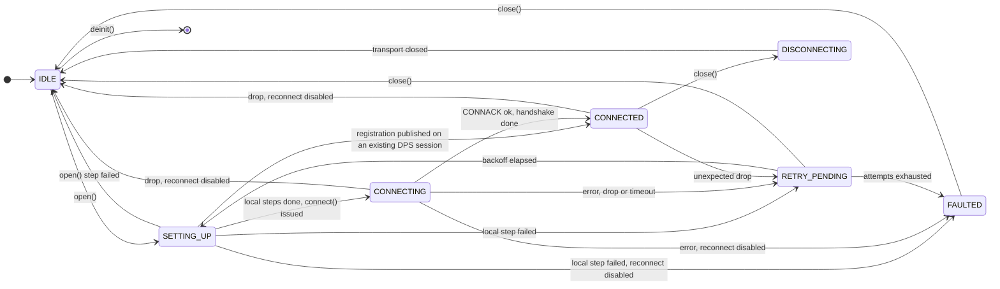
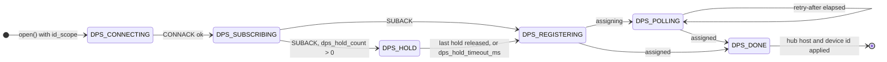
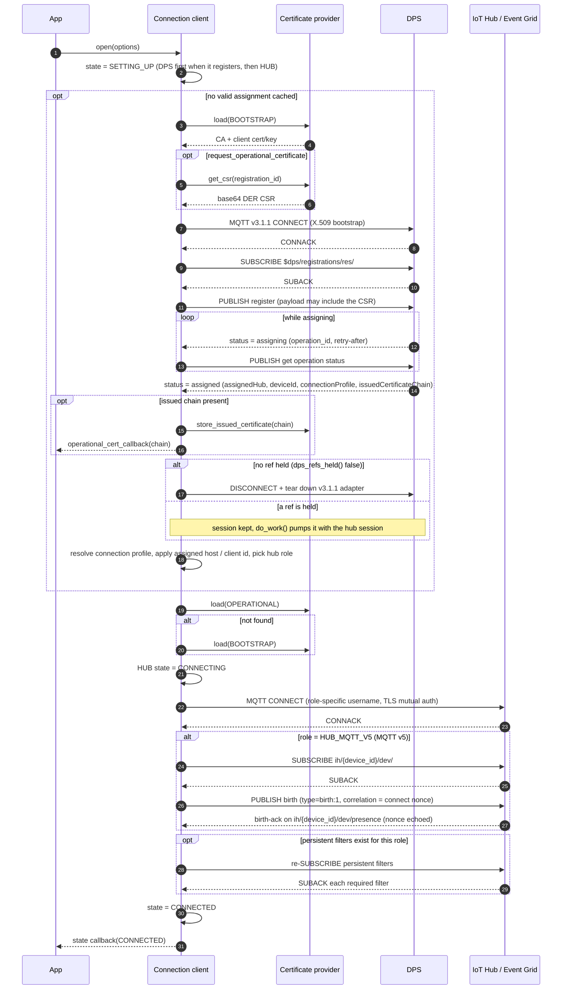
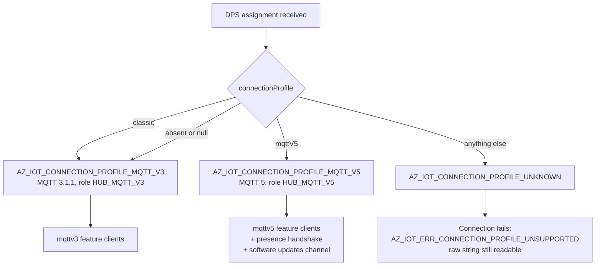
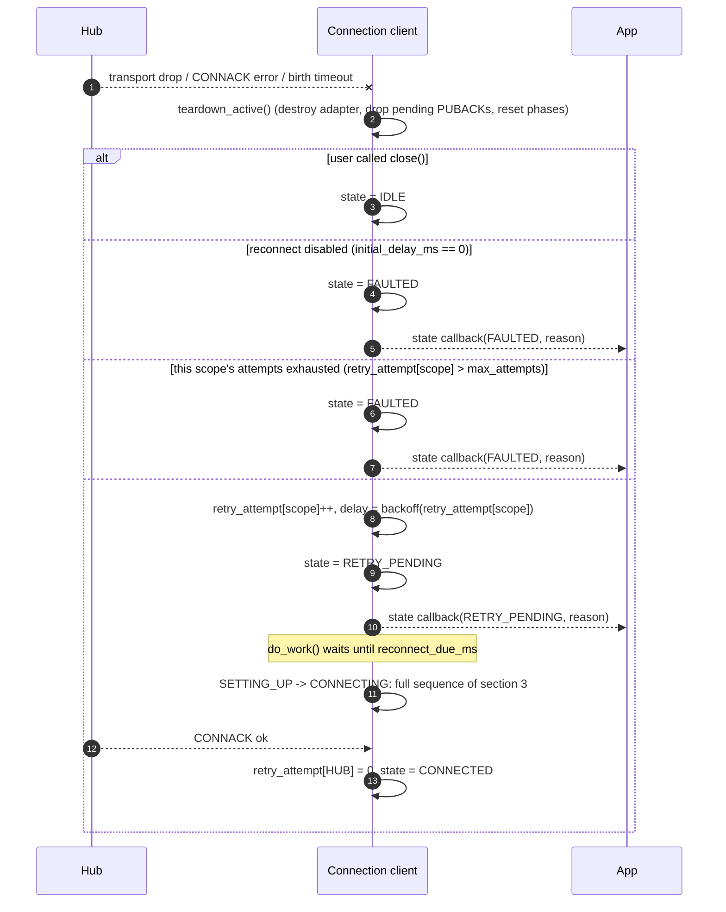
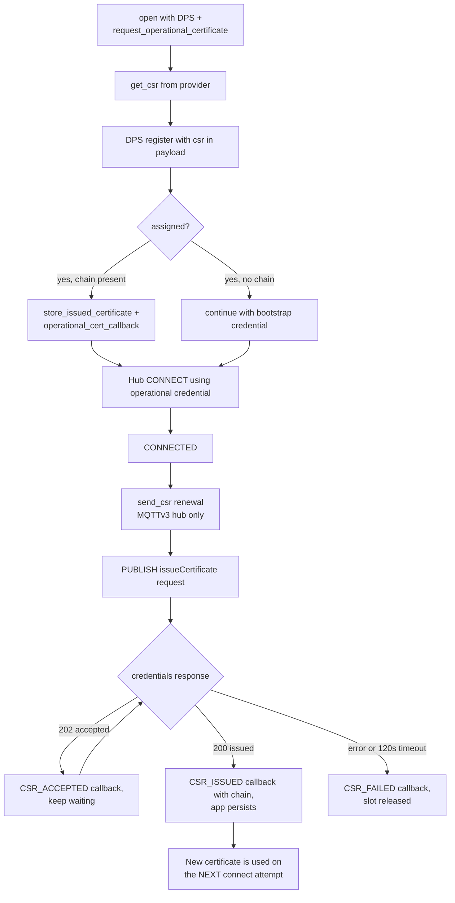
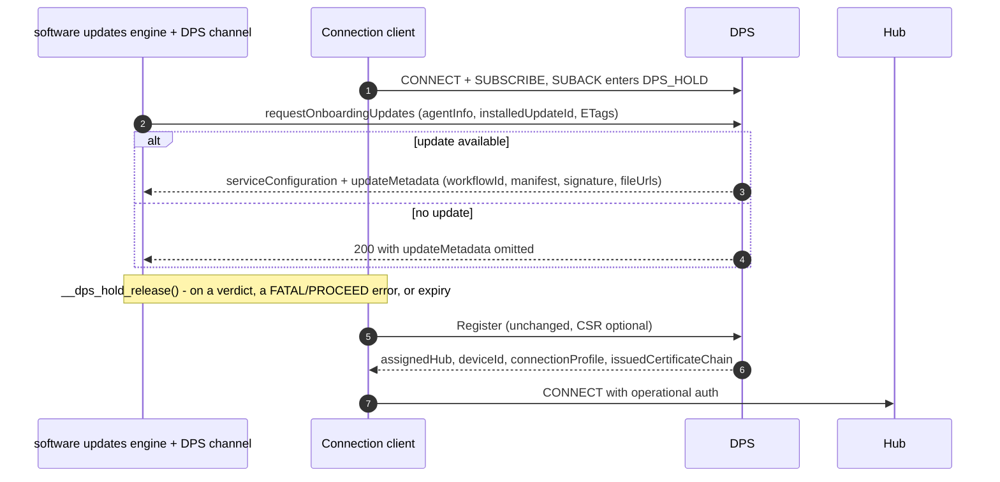
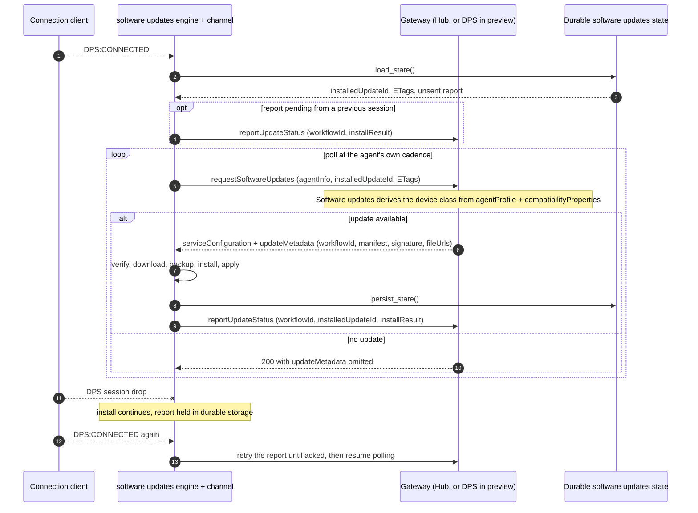
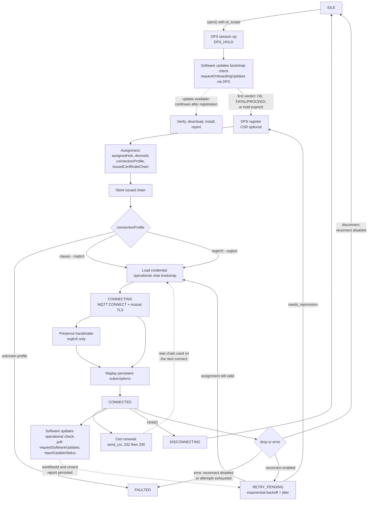

# Connection and Reconnection Lifecycle — C client

C-specific reference for the connection lifecycle: identifiers, file locations, enum values and
defaults as implemented in [c/src/core/connection_client.c](../../src/core/connection_client.c),
which is the current source of truth for the design.

The language-neutral contract is [connection.md](connection.md). Read that first for the
contract; read this one for the C implementation of it. Known gaps are listed in
[§11](#11-known-gaps). The customer-facing summary is [connecting.md](../connecting.md).

Related documents:

- [architecture.md](../architecture.md) — overall layering and adapter model.
- [certificate-management.md](certificate-management.md) — CSR / operational certificate design.
- [connection-state-and-error-propagation.md](connection-state-and-error-propagation.md) — observer registry and status codes.
- [software-updates.md](software-updates.md) — the software updates device contract (the source for §7)
  and the client design.

### Status legend

This document describes the target lifecycle. Not all of it is coded yet, so every section is marked:

| Mark | Meaning |
| --- | --- |
| **[implemented]** | Present in `c/src` today and covered by tests. |
| **[partly implemented]** | Some of the section is in `c/src`; the rest is called out inline as a gap or as planned. |
| **[planned]** | Designed and agreed, not yet in code. |

---

## 1. Vocabulary

| Term | Meaning |
| --- | --- |
| **State** | User-visible connection lifecycle value (`az_iot_connection_state`). Reported through the state callback. |
| **Connection profile** | What the device is connected to, as declared by DPS: `classic` or `mqttV5` (`az_iot_connection_profile`). Not caller-settable. |
| **Generation** | The feature-client family selected by the profile: `mqttv3` (`classic`) or `mqttv5` (mqttV5). |
| **Role** | Which endpoint/protocol the current MQTT session targets (`az_iot_mqtt_role`): `DPS` (v3.1.1), `HUB_MQTT_V3` (v3.1.1), `HUB_MQTT_V5` (v5). |
| **Phase** | Internal sub-step inside a state — DPS phases and presence (birth) phases. Not user-visible. |
| **Provisioning** | Obtaining a hub assignment from DPS. |
| **Onboarding** | Everything that happens against the DPS gateway under *onboarding auth*: the bootstrap update check, the CSR, and registration itself. |
| **Renewal** | The recurring, post-provisioning counterpart under *operational auth*: certificate re-issuance and the periodic software update check. |
| **Bootstrap credential** | Initial device identity (`AZ_IOT_CRED_BOOTSTRAP`). |
| **Operational credential** | Certificate issued to the device via CSR (`AZ_IOT_CRED_OPERATIONAL`). |
| **Software updates channel** | The `az_iot_su_channel` vtable that carries update delivery and reporting, keeping the software updates engine transport-independent. |

---

## 2. Top-level state machine **[implemented]**

States are defined in
[az_iot_connection_client.h](../../inc/azure/iot/az_iot_connection_client.h); transitions are all funneled
through the internal `set_state_to()` helper, which is also what raises the user state callback.



`FAULTED` is settled, not a dead end. The SDK never leaves it on its own -- `do_work()` does not
retry from there -- but `close()` is legal from it and returns the client to `IDLE`, from which
`open()` starts a fresh attempt with the configuration and the attached feature clients intact.
`open()` itself remains `IDLE`-only.

State is kept and reported **per scope**: `state[AZ_IOT_CONN_SCOPE_COUNT]`, and every
`az_iot_connection_state_event` carries `scope`. `AZ_IOT_CONN_SCOPE_DPS` reports `CONNECTED` at the
provisioning SUBACK (announced from the pump via `dps_pending_ready_announce`), then
`DISCONNECTING` and `IDLE` when `dps_apply_deferred()` releases the session.
`az_iot_connection_client_get_state(client, scope)` is the getter; there is no unscoped state.

Within the DPS scope, progress is tracked as `dps_phase`:



Every failure in a DPS phase is handled by the same backoff path as a hub failure, and a retry
restarts provisioning from `DPS_CONNECTING` — a rejected registration included. What does not retry
is an assignment the client cannot use: `reject_assignment()` faults on an unsupported
`connectionProfile` or one that contradicts the attached feature clients. See §5.2 for the split.

---

## 3. Full connect sequence **[implemented]**



Key ordering guarantees that both clients must honour:

1. `CONNECTED` is announced **after** the birth handshake (MQTTv5) and **after** every required
  persistent subscription has been SUBACKed, so a feature client never observes `CONNECTED` while
  its topic filters are missing. MQTTv5 feature delivery uses the single
  `ih/{device_id}/dev/#` presence wildcard; MQTTv3 feature filters and application custom topics
  use the persistent-subscription registry.

2. `dps_apply_deferred()` keeps the DPS session after a successful assignment while
   `dps_refs_held()` — a feature client's `__dps_user_acquire()` ref, or `provision_only`'s standing
   ref — and tears it down otherwise. A kept session runs alongside the hub session and `do_work()`
   pumps both. DPS always uses MQTT 3.1.1, even when the hub session uses v5.
3. The operational certificate is preferred over the bootstrap certificate on every connect attempt,
   including reconnects.
4. **The software updates bootstrap update check runs inside `open()`, ahead of registration**, once the
   application calls `az_iot_su_client_request_onboarding_update()`; nothing queues it
   automatically. The DPS channel takes `__dps_hold_acquire()` when it binds and again on each
   `DPS:CONNECTING` until its exchange is done, so the SUBACK enters `DPS_HOLD` instead of
   registering.
   The hold is released at the first check verdict that will not immediately repeat, or on close;
   `dps_hold_timeout_ms` (default `AZ_IOT_DPS_HOLD_TIMEOUT_MS`, 60 s) bounds it, and on expiry the
   device registers anyway — so a bound channel with no request delays registration by that timeout.
   See [§7](#7-software-updates-onboarding-and-renewal-partly-implemented).
5. The DPS assignment is the single delivery point for everything the device learns about its
   placement: hub, device id, connection profile and issued certificate chain.
6. **`opts.dps.provision_only`** keeps the DPS session up, never registers and never connects to a
   hub, settling at `DPS:CONNECTED` + `HUB:IDLE`. `open()` refuses it with `AZ_IOT_ERR_INVALID_ARG`
   without `dps.id_scope` and `dps.registration_id`, or combined with
   `dps.request_operational_certificate`. The session is re-established under
   `opts.reconnection_policy`.

### 3.1 Egress: transport and proxy **[implemented]**

Both connects above — the DPS bootstrap connect and the hub connect — use the same egress
configuration, because a device that needs a proxy or WebSockets to reach the hub needs them to
reach DPS first.

| Option | Effect |
| --- | --- |
| `transport` | `TCP` (default) or `WEBSOCKET`. WebSockets carries MQTT inside a WebSocket on 443, for a network that passes only HTTP(S) ports. |
| `websocket_path` | Defaults to `/$iothub/websocket`, which is what IoT Hub and DPS expect. |
| `proxy` | Host, port and optional Basic credentials of an HTTP proxy. The connection is made with HTTP `CONNECT`, for both transports. |
| `port` | `0` derives the port from the transport: 8883 for TCP, 443 for WebSockets. An explicit value always wins. |

Two rules:

- **The proxy is a transport detail only.** TLS is negotiated with the broker *inside* the tunnel,
  so the proxy sees ciphertext, and chain and hostname validation are unchanged. The MQTT session,
  the identity and the reconnection policy are all unaffected.
- **An adapter that cannot honour the request must refuse it** with `AZ_IOT_ERR_NOT_SUPPORTED`.
  Connecting directly when a proxy was configured would bypass the egress control the caller
  selected, and connecting over TCP when WebSockets were selected would be blocked by the firewall
  the caller was working around; either would fail later and for the wrong reason.

Note for the Paho adapter: when `proxy` is left unset, Paho still falls back to the lowercase
`http_proxy` / `https_proxy` environment variables on its own (the uppercase spellings are ignored).
Set `proxy` to be explicit and independent of the environment.

Worked examples: [samples/unified/websockets](../../samples/unified/websockets/main.c) and
[samples/unified/proxy](../../samples/unified/proxy/main.c). Each is the `unified/telemetry` sample
with one of these options set, so the diff against it is exactly the feature.

### 3.2 Session terms per role **[implemented]**

Every CONNECT also carries the terms of the session it is opening. They are decided per session
role, in `resolve_session_options()` in `src/core/connection_client.c`, and the three roles do not
want the same thing.

| Role | MQTT | Clean Start / Clean Session | Session Expiry | Will | DISCONNECT reason |
| --- | --- | --- | --- | --- | --- |
| `DPS` | 3.1.1 | clean (`1`), not overridable | n/a | never | n/a |
| `HUB_MQTT_V3` | 3.1.1 | resume (`0`) by default | n/a | `opts.lwt`, if set | n/a |
| `HUB_MQTT_V5` | 5 | resume by default | `opts.session_expiry_seconds`, default 1 h | `opts.lwt`, if set | `0x04` when a Will is set, else `0x00` |

Both hub roles honour `opts.session_continuity` (`DEFAULT` / `RESUME` / `CLEAN`). DPS does not: the
provisioning service does not implement session persistence at all, so honouring a request for it
would promise something the service does not do.

Why each one:

- **DPS starts clean.** Provisioning does not support persistent sessions — it treats every session
  as non-persistent whatever the flag says — and the response filter is re-subscribed on every
  attempt. That reason is a property of the *service*, not of how long the session lives, so it is
  unaffected by any change to when the provisioning session is torn down: `clean_start` is only
  read at CONNECT, and it is inert at this service whenever it is read. A provisioning session that
  outlived registration, or ran alongside a hub session, would still take the same terms.
- **MQTTv3 resumes.** An MQTTv3 hub holds the device's *subscription* and its in-flight QoS 1 only
  for a session that is not clean. Connecting clean does not lose the hub's server-side C2D queue —
  that is delivered once the device re-subscribes — but it does discard the subscription and any
  in-flight delivery, so resuming is the cheaper default. This is also the behaviour the role
  already had before the terms were set explicitly.
- **MQTTv5 resumes, with an expiry.** Session continuity on this generation is a **transport
  efficiency choice, not a correctness one**: the backend never reads `clean_start` or
  `session_present`, the device publishes birth on every connection, and every feature protocol is
  correct even if each connect started a fresh session. What resuming buys is the broker's QoS 1
  redelivery across a transient drop and a re-subscribe saved. Both halves are required — a session
  asked to expire the instant the connection closes is gone before any reconnect could resume it —
  which is why the expiry is set rather than left at 0.

Four rules that hold everywhere:

- **A v3.1.1 broker never receives a v5-only property.** Session Expiry and Will Delay are MQTT 5
  CONNECT properties; a v3.1.1 CONNECT has no field to carry them, and the DISCONNECT reason code
  does not exist in 3.1.1 either.
- **The SDK sets no Will of its own.** `opts.lwt` is the application's, and defaults to none. The
  platform deliberately leaves the Will slot to the application: MQTT 5 allows exactly one Will per
  CONNECT, device presence is derived from broker-emitted connection lifecycle events rather than
  from a device-authored will message, and taking the slot would deny the application its own
  "device went away" signal. It is never put on a provisioning session, whatever that session's
  lifetime: nothing consumes a will published there.
- **`Session Present` drives no decision.** It is not exposed to the application; on `HUB_MQTT_V5` it
  is carried on the birth message as a diagnostic. No feature client tears down state because of it.
- A Will Delay only means something while the session is alive, so on `HUB_MQTT_V5` the session expiry
  is raised to cover a delay longer than it; MQTT 5 ends the delay at whichever comes first.

Session Expiry is an operational tuning knob. A long expiry suits a rarely-connected, low-traffic
device; a shorter one suits an always-connected device receiving heavy traffic, whose disconnected
session queue (bounded at 100 messages / 1 MB, and destroyed entirely on overflow) would otherwise
fill. The default is one hour, which matches the broker namespace default; the namespace maximum is
eight hours and the broker clamps anything above it.

---

## 4. Connection profile selection **[implemented]**

The profile is what DPS says the device landed on. It is **reported, never selected** — there is no
caller-facing knob, and falling back from one profile to another is application logic, not SDK
behaviour.



| Wire value | Enum | MQTT | Generation |
| --- | --- | --- | --- |
| `"classic"`, absent, or `null` | `AZ_IOT_CONNECTION_PROFILE_MQTT_V3` | 3.1.1 | MQTTv3 |
| `"mqttV5"` | `AZ_IOT_CONNECTION_PROFILE_MQTT_V5` | 5 | MQTTv5 |
| anything else | `AZ_IOT_CONNECTION_PROFILE_UNKNOWN` | — | connection fails |

Rules both clients must implement:

- `connectionProfile` is a `readOnly` **string** on `DeviceRegistrationResult`, delivered alongside
  `assignedHub`, `deviceId` and `issuedCertificateChain`. There is no numeric `hub_version` on the wire.
- It is an **extensible union**, so the raw string is kept (`az_iot_hub_profile.connection_profile_raw`)
  rather than collapsed into a closed enum, and a value newer than the SDK stays loggable. The buffer
  holds 63 bytes plus NUL: a longer value is truncated, `connection_profile_raw_truncated` is set,
  and the profile resolves to `UNKNOWN`.
- An unrecognised profile **fails the connection** with `AZ_IOT_ERR_CONNECTION_PROFILE_UNSUPPORTED`.
  The SDK will not guess which MQTT version to speak.
- `az_iot_connection_client_get_hub_profile()` returns `AZ_IOT_ERR_NOT_CONNECTED` until `HUB:CONNECTED`,
  with one exception: when the profile is `UNKNOWN` it answers `AZ_IOT_OK` whatever the state, so the
  raw value of an unsupported assignment stays readable in `FAULTED`.
- **A feature client may be created before or after `open()`.** `__require_profile()` records the
  generation it needs and refuses a second client of the other generation immediately with
  `AZ_IOT_ERR_CONNECTION_PROFILE_MISMATCH`. When the profile is not yet resolved the requirement is
  held; `dps_apply_deferred()` compares it with the assigned profile and rejects the assignment if
  they differ.
- **A generation mismatch on an assignment is terminal, not retried.** `reject_assignment()` faults
  and forces the next `open()` back through DPS, so the stale cached host cannot be reused. The
  application destroys and rebuilds its feature clients for the assigned profile, then `close()`
  (legal from `FAULTED`) and `open()`. The connection client survives.

> The SDK sends DPS `2026-11-02-preview` in the CONNECT username for every DPS session, including CSR
> and provision-only update sessions, so DPS can return `connectionProfile`; absent or null still
> resolves to `classic`.


---

## 5. Reconnection **[implemented]**



**The retry ladder is per scope.** `retry_attempt[]` is indexed by
`az_iot_connection_scope` (`DPS`, `HUB`), and `max_attempts` is a budget for **each** ladder rather
than one shared across both. So a device may spend its whole hub budget and still get a full set of
registration attempts, and a registration that follows an exhausted hub ladder starts again at
`initial_delay_ms` instead of inheriting the hub's capped backoff.

Which ladder a retry climbs is the scope of the **next attempt**, which is not always the scope of
the failure: a hub failure retried as a re-registration (threshold crossed, or a CONNACK refusal in
`AZ_IOT_IDENTITY_RECOVERY_REPROVISION` mode) climbs a DPS ladder.

A hub identity refusal (`AZ_IOT_ERR_IDENTITY_REJECTED` at CONNACK, `AZ_IOT_ERR_AUTH` from an mqttv5
DISCONNECT) climbs a third ladder, `identity_retry_attempt`, on `opts.identity_recovery.policy`
(`reconnection_policy` when that is zeroed). `identity_recovery.max_duration_seconds` bounds every
retry, on any ladder, from the first refusal until `HUB:CONNECTED`.

Reset points differ per ladder:

| Event | Effect |
| --- | --- |
| DPS registration succeeds | `DPS` and `HUB` reset; identity ladder untouched |
| Hub CONNACK succeeds (before the MQTTv5 birth handshake) | `HUB` resets; `DPS` untouched |
| `HUB:CONNECTED` (after the birth-ack on MQTTv5) | identity ladder resets |
| `dps.max_hub_connect_attempts_before_reprovision` crossed | `DPS` resets, so the first registration attempt waits `initial_delay_ms` |
| `open()` / `close()` | all ladders reset |

### 5.1 Backoff policy

`az_iot_retry_policy` in
[az_iot_retry_policy.h](../../inc/azure/iot/az_iot_retry_policy.h), computed by
`az_iot_retry_policy__delay_ms()` in [retry_policy.c](../../src/core/retry_policy.c):

```text
base   = min(max_delay_ms, initial_delay_ms << min(attempt - 1, 30))
jitter = uniform(-jitter_pct%, +jitter_pct%) * base
delay  = clamp(base + jitter, 1, UINT32_MAX)
```

| Field | Default | Notes |
| --- | --- | --- |
| `initial_delay_ms` | 1000 | `0` disables automatic reconnect entirely. |
| `max_delay_ms` | 60000 | Cap for the exponential term only. Jitter varies around it, so a delay may exceed it by up to `jitter_pct`; clamping the jittered result would put half of all retries on exactly this value once the ladder reached the cap. |
| `max_attempts` | 0 | `0` means retry forever. |
| `jitter_pct` | 20 | Symmetric randomization, seeded from the monotonic clock. |

The shift is clamped at 30 to avoid 32-bit overflow. The `HUB` counter resets on every successful hub
CONNACK; the `DPS` counter only when registration succeeds.

### 5.2 What triggers a reconnect

- CONNACK with a non-success status.
- Unexpected transport disconnect or adapter error while `CONNECTING` or `CONNECTED`.
- A reconnect attempt that cannot even start the session: `start_connect_attempt()` (or `dps_start()`
  when re-provisioning) returning non-OK schedules another reconnect rather than faulting.
- Any failure in the MQTTv5 presence handshake, not only its timeout: `presence_start()` failing
  after CONNACK, the presence SUBACK arriving with a failure status, and `presence_publish_birth()`
  failing all clear the phase and reconnect.
- An MQTTv5 presence step that does not complete in time. `presence.deadline_ms` is armed at CONNACK
  for the SUBACK and re-armed after the birth PUBLISH for the birth-ack, each
  `AZ_IOT_PRESENCE_BIRTH_ACK_TIMEOUT_MS` (60 s), and checked in `do_work()`.

- **A failed registration, or one with no assignment.** `dps_apply_deferred()` sets
  `needs_reprovision` and calls `schedule_reconnect(AZ_IOT_CONN_SCOPE_DPS, status)`, so the retry is
  a re-registration on the DPS ladder rather than an ordinary connect — which would have no host on
  a DPS client. It faults only when no policy is configured or the application has closed.
  `dps_pending_retry_after_secs`, when the service supplied one, raises `reconnect_due_ms` to at
  least that far out: the two are a floor, not alternatives, and `max_delay_ms` deliberately does
  **not** cap it — the cap bounds how long the SDK waits of its own accord, not how long the service
  asked to be left alone.

Not triggers, because they fault instead:

- **An assignment the client cannot use.** `reject_assignment()` faults with
  `AZ_IOT_ERR_CONNECTION_PROFILE_UNSUPPORTED` for a profile the SDK does not speak, or
  `AZ_IOT_ERR_CONNECTION_PROFILE_MISMATCH` when the assigned generation contradicts the attached
  feature clients, rather than guessing a protocol (§4). Terminal even with a policy configured, and
  it also forces the next `open()` back through DPS so the stale cached host cannot be reused. When
  the registration was a retry after a hub failure, the waiting HUB scope faults with the same
  reason (`fault_retry_scopes()`).

A hub identity refusal is a special case. `schedule_reconnect()` hands it to
`schedule_identity_recovery()`, which schedules the next attempt on the identity ladder. The refusal
does not say whether the device is disabled, its credential revoked or its assignment moved.
`identity_recovery.mode` decides the attempt:

- `RETRY_HUB` (`options_default()`): the cached hub. No DPS registration, no certificate request.
- `REPROVISION` (zero, the earlier behaviour): `note_identity_refusal()` sets `needs_reprovision`
  for a CONNACK refusal, whatever the reconnection policy, so the retry, or the next `open()`,
  registers through DPS. An mqttv5 DISCONNECT refusal retries the hub.
- `NONE`: the refusal faults.

The refusal resets `consecutive_hub_connect_failures`, because the hub answered. The identity
ladder is not reset by a registration, so DPS-accept / hub-reject cycles stay bounded. The hub
faults with the refusal as the reason when the ladder is spent, when `max_duration_seconds` passes,
or when `reconnection_policy` is disabled. The duration is also enforced outside the identity
ladder, so nothing in the episode starts at or past it: no retry is scheduled to land there (the
fault comes when the retry would have been scheduled); a due retry that `do_work()` reaches past it is
not started; a DPS retry-after that lands past it stops recovery; the DPS pump abandons a registration
still running (held, registering or polling); and an assignment adopted after it does not start a
hub connect. Every give-up of the single pending retry goes through `fault_retry_scopes()`, which
faults the failing scope and the other one if it is still `RETRY_PENDING`: a hub waiting on a
re-registration is not left there with no retry.
`az_iot_connection_client_request_reprovision()` sets
`needs_reprovision` on demand and brings a pending hub retry forward. On the retry path the flag is
cleared before the attempt **only when a cached assignment exists**, so a failing registration falls
back to an ordinary hub retry rather than looping through provisioning; with no cached assignment
the demand survives and the next retry provisions again.

Every trigger above is conditional on `reconnect_enabled()`. With no retry policy, CONNACK, presence
and adapter failures transition to `FAULTED`; a transport disconnect transitions to `IDLE`.

§9 classifies every failure this client can see, including the ones that are retried here but
cannot succeed on retry.

A user-initiated `close()` never triggers a reconnect: it sets an internal `user_close` flag that is
checked before backoff is scheduled.

### 5.3 What is preserved across a reconnect

| Item | Preserved | Behaviour |
| --- | --- | --- |
| Persistent subscriptions | Yes | Re-issued on reconnect. Every required filter must be SUBACKed before `CONNECTED`; a missing SUBACK expires on the configured deadline and retries as a transient failure. |
| Assigned hub host / device id | Yes | Cached after the first DPS assignment. |
| Connection profile | Yes | Re-resolved from the new assignment. A change of generation faults with `AZ_IOT_ERR_CONNECTION_PROFILE_MISMATCH`; the application rebuilds its feature clients (§4). |
| Operational certificate | Yes | Owned by the certificate provider, reloaded on each attempt. |
| Software updates workflow state | Yes | Owned by the software updates engine and persisted, so an install survives a reconnect and a reboot. |
| Reconnect attempt counter | Reset on success | Incremented per failed attempt. |
| In-flight QoS 1 PUBACKs | No | Packet ids belong to the destroyed adapter; callers must re-send. |
| Twin GET/PATCH, method responses, telemetry in flight | No | Feature clients must re-issue. |
| MQTTv3 desired-property patches sent while disconnected | No | IoT Hub does not queue them, and the SDK does not fetch the twin on reconnect. The application calls `az_iot_mqttv3_twin_client_get()` if it needs the current desired state. |
| Software updates status report not yet acked | Yes | Held in durable storage and retried until acked; idempotent on `workflowId`. |
| Presence (birth) phase | No | Restarted with a freshly generated nonce. |
| DPS phase | No | Not re-run on an ordinary reconnect: the cached assignment is reused. It is re-run only when `needs_reprovision` is set — a CONNACK identity rejection in `REPROVISION` mode, `az_iot_connection_client_request_reprovision()`, the `max_hub_connect_attempts_before_reprovision` threshold, or `reject_assignment()`. When it does re-run it restarts from `DPS_CONNECTING`. |
| In-flight CSR operation | Yes | `teardown_active()` does not touch `csr_op`, so a response on the next session completes it. `AZ_IOT_ERR_TIMEOUT` fires only at `CSR_OP_TIMEOUT_MS` (120 s, re-armed on each `202`); `az_iot_connection_client_cancel_csr()` ends it early. The request is published from a reserved PUBACK slot; a rejected PUBACK fails the operation at once, a session end before the PUBACK does not. |

### 5.4 The first attempt

`open()` calls `start_connect_attempt()` (or `dps_start()`) inline. A non-OK return from it
transitions back to `IDLE` and is **returned from `open()`** — no backoff is scheduled. Everything
that fails after that point, from the refused socket to the CONNACK, runs through
`schedule_reconnect()` like any later attempt.

So the synchronous half of the first attempt is never retried and the asynchronous half is. One
exception: when the hub attempt follows a DPS assignment, `dps_apply_deferred()` runs it from the
pump, and a synchronous `start_connect_attempt()` failure there settles at `HUB:FAULTED` without
backoff.
That is the split [connection.md §5.5](connection.md)
specifies, and it holds here without a separate option.

---

## 6. Certificate management: onboarding and renewal **[implemented]**

Two distinct issuance paths exist; both end with the certificate provider owning the operational
credential, and neither forces an immediate reconnect.



Renewal topics (MQTTv3 hub):

| Direction | Topic |
| --- | --- |
| Publish | `$iothub/credentials/POST/issueCertificate/?$rid={request_id}` |
| Subscribe | `$iothub/credentials/res/#` |
| Response | `$iothub/credentials/res/{status}/{request_id}` |

Rules every client must implement. The C client meets all of them.

- Only one CSR operation may be in flight; a second request fails fast with a *busy* result.
- The issued chain is delivered leaf-first as base64 DER and is only valid for the duration of the
  callback — the application must copy or persist it.
- A successful renewal does **not** tear down the live session. The new credential takes effect on
  the next connect, whether that is a reconnect or an explicit reopen.
- At connect time the provider is asked for `OPERATIONAL` first and falls back to `BOOTSTRAP` when
  the operational credential is absent or uninitialized.
- Every DPS and hub connection uses TLS. `open()` refuses a client with no `certificate_provider`
  (`AZ_IOT_ERR_CREDENTIAL_INCOMPLETE`), and a connect attempt whose `load()` fails fails with the
  provider's error instead of connecting in plaintext. From `open()`, `open()` returns that error;
  on a reconnect, the attempt is retried under the reconnection policy whatever the error (its
  classification is reported, not acted on).
- CSR-based DPS enrollment uses the `2026-11-02-preview` DPS API version and a caller-provided,
  non-empty `csr_payload_buffer`. `AZ_IOT_CSR_PAYLOAD_BUFFER_MIN` (8448) is the recommended size, enough
  for the largest CSR the service accepts; small keys fit in less, and a buffer too small for the
  CSR fails with `AZ_IOT_ERR_NOT_ENOUGH_SPACE` when the request is built.

---

## 7. Software updates: onboarding and renewal **[partly implemented]**

Software updates is layered into a transport-independent **Software updates engine** —
manifest v5 parsing, JWS/SJWK verification, root keys, SHA-256 integrity, the
download/backup/install/apply state machine, and reboot/resume persistence — plus an
**`az_iot_su_channel`** vtable carrying delivery and reporting.

Software updates is a **device-initiated pull protocol**. The agent calls an updating operation on a
gateway it already talks to, reusing the credential it already has; the gateway is an authenticated
pass-through to the update service. The device needs no update-specific credential, and there is no
subscription and no unsolicited offer.

| Phase | Gateway | Operation (on the wire) |
| --- | --- | --- |
| First-time / bootstrap (**before** provisioning) | DPS | `requestOnboardingUpdates` |
| Regular / operational (**after** provisioning) | DPS | `requestSoftwareUpdates` |
| Reporting, either phase | same gateway as the fetch | `reportUpdateStatus` |

All three are requests under the device's own registration on the gateway's device endpoint; see
[software-updates.md](software-updates.md#2-device-contract) for the request and response shapes.

The device selects onboarding vs regular **by which operation it calls**; the gateway does not infer
or validate the choice.

> In preview, DPS fronts both the bootstrap and the operational flow, using the existing DPS device
> credential (X.509). The device contract does not depend on the gateway. Treat the gateway as a
> channel parameter, not a constant.

### 7.1 Onboarding — bootstrap update, before provisioning

The critical ordering fact for this document: **the bootstrap update check happens before the device
registers.** It runs inside `open()`, on the DPS session, while the DPS channel holds registration.

The check is **advisory and must never block provisioning.** `emit_result()` releases the hold at the
first verdict that will not immediately repeat — success, or an error action of `FATAL` or `PROCEED`.
A retryable failure keeps the hold, and `dps_hold_timeout_ms` bounds it: on expiry the device
registers anyway (`"dps: pre-registration hold timed out; registering anyway"`).



- **Registration is held for the check, not for the install.** A check that finds an update releases
  the hold like any other verdict; the install, its report and any re-check run afterwards on the DPS
  session, which the channel's `__dps_user_acquire()` ref keeps up. A bootstrap deployment can
  chain, so the agent re-checks after installing.
- Bootstrap progress is stored **in the bootstrap update job**, not on the device's ADR attributes —
  the device resource does not exist yet.
- Trust comes from the **root-key package** at `serviceConfiguration.rootKeyDownloadUrl` returned by
  the same call. Account scoping (`accountId` bound into the manifest signature) is **not yet
  supported** — DPS returns no `accountId`, so the device verifies provenance-from-Device-Update but not
  account scoping. Base signature validation stays required.
- `fileUrls` are **not** covered by the signed manifest; payloads are downloaded straight from blob
  storage and integrity comes from the per-file hashes inside the manifest.
- Bootstrap orchestration is entirely the agent's responsibility. DPS does **not**
  enforce that a device is on a given update version before provisioning it.

### 7.2 Renewal — operational update check, after `CONNECTED`



`installResult` carries the outcome, its failure origin and the hex
`extendedResultCodes` list. In-progress reports omit `stepResults`; terminal
reports include complete per-step outcomes when steps are available — see
[software-updates.md](software-updates.md#2-device-contract) for the field-level shape.

### 7.3 Rules both clients must implement

- **Poll, never wait.** The agent owns the cadence. A missed poll is not an error and there is no
  offer to lose, which is why a reconnect needs no replay of software updates subscriptions — there are none.
- **`workflowId` is the correlation key.** It arrives in `updateMetadata` and is echoed on the
  report. Reporting is **idempotent on `workflowId` alone**; a conflicting terminal result for the
  same id is rejected as a conflict.
- **The device is the sole retrier.** The gateway fails fast with one attempt per hop. The agent
  honours `Retry-After` on throttling and retries `reportUpdateStatus` until it is acked — a
  report is a durable write and must not be lost.
- **Drive behaviour from the machine-readable error code, never the HTTP status.** A stale
  `agentInfoEtag` means resend the full `agentInfo`; a stale `serviceConfigEtag` means re-ask without
  it; an unlinked update account means "no update service configured", which is not a failure.
- **"No update" is a success.** It is a 200 with the update metadata omitted, not an error.
- **Software updates follows the DPS scope, not the hub one.** The channel records both scopes but acts only on
  `AZ_IOT_CONN_SCOPE_DPS`, so it works whatever the hub state and under `provision_only`. It never opens, closes or reconnects
  the hub session. It holds registration for the bootstrap check (§7.1), and opens a DPS session
  after provisioning through `__dps_session_ensure()`. While either scope has settled in
  `FAULTED`, no new session is opened until `close()`.
- **Compatibility properties are opaque key/value pairs** (1–5) reported by the agent alongside an
  opaque `agentProfile`; the service combines them into a device class. The agent assigns them no
  meaning.
- **The gateway is a channel parameter.** Bootstrap always uses DPS; operational currently uses DPS
  too. The service contract binds software updates to the updating operations, not to a connection
  profile.

---

## 8. Combined reference diagram

One picture of the whole device lifecycle: connection and reconnection, connection-profile selection,
certificate management (onboarding + renewal) and software updates (onboarding + renewal). Dotted edges are
deferred effects — they do not happen inline.



Reading it as four overlapping concerns:

| Concern | Onboarding (DPS gateway, onboarding auth) | Renewal (post-`CONNECTED`, operational auth) |
| --- | --- | --- |
| **Certificates** | CSR in the registration, issued chain in the assignment | `send_csr` over the hub; new chain applies on the next connect |
| **Software updates** | `requestOnboardingUpdates` loop **before** registration, advisory | Polled `requestSoftwareUpdates` / `reportUpdateStatus` (currently over DPS) |
| **Connection profile** | Declared in the assignment; selects MQTT version and generation | Re-resolved on every reconnect that goes through DPS |
| **Connection** | DPS scope, with registration held in `DPS_HOLD` for the bootstrap check | Backoff-driven reconnect reuses the cached assignment; DPS again only on `needs_reprovision` |

The two onboarding concerns are **not** symmetric, and that asymmetry is the thing to remember:
the CSR travels *inside* registration, while the software updates bootstrap check happens *before* it, with
registration held for it.

---

## 9. Connection failure realization (C) **[partly implemented]**

The C realization of the taxonomy in [connection.md](connection.md) §9.
That section says what *any* client must do; this one says what the C client **actually does today**,
which result value it produces, and which component decides.

Read the two together. Where a row's class in the generic table and the SDK action here disagree,
that is a gap, and it is called out in the notes rather than smoothed over.

### 9.1 Result vocabulary

The full set is in [az_iot_result.h](../../inc/azure/iot/az_iot_result.h). The values that appear on a
connection failure path:

| Value | Meaning on the connection path |
| --- | --- |
| `AZ_IOT_OK` | Success. |
| `AZ_IOT_ERR_INVALID_ARG` | A caller argument was rejected at the SDK boundary, or a bound was exceeded that is a caller error. |
| `AZ_IOT_ERR_NOT_INITIALIZED` | The operation needs a live adapter and there is none. |
| `AZ_IOT_ERR_NOT_CONNECTED` | Substituted as the reason when a disconnect carries no status of its own. |
| `AZ_IOT_ERR_TIMEOUT` | A deadline expired — birth-ack, CSR operation. |
| `AZ_IOT_ERR_PROTOCOL` | A service payload could not be parsed. |
| `AZ_IOT_ERR_MQTT` | The catch-all for transport and broker failures. **The great majority of wire failures land here**, including every CONNACK code that is not an identity refusal, every SUBACK refusal the broker may not repeat, and every PUBACK failure that is not `AZ_IOT_ERR_PUBLISH_REFUSED` or quota exceeded. |
| `AZ_IOT_ERR_DPS` | Registration returned a failed or disabled status. |
| `AZ_IOT_ERR_NOT_SUPPORTED` | No adapter factory for the required protocol version; a fixed-size registry is full; a service-supplied string is longer than its buffer. |
| `AZ_IOT_ERR_BUSY` | A single-slot operation is already in flight, or the service is throttling. |
| `AZ_IOT_ERR_NOT_ENOUGH_SPACE` | A compile-time buffer bound was exceeded. |
| `AZ_IOT_ERR_NOT_FOUND` | A required field was absent from a service payload. |
| `AZ_IOT_ERR_INTERNAL` | A dependency call failed in a way the SDK cannot attribute. |
| `AZ_IOT_ERR_IDENTITY_REJECTED` | The broker refused *who the device claims to be*. From the hub, retried on `identity_recovery` (§5.2). |
| `AZ_IOT_ERR_SUBSCRIPTION_REFUSED` | A SUBACK carried a code the broker will repeat. Terminal even when a reconnection policy is configured on a `FAILS_SESSION` persistent subscription; the DPS and presence paths retry it ([§9.5](#95-the-realization-table)). |
| `AZ_IOT_ERR_CREDENTIAL_INCOMPLETE` | The certificate provider returned material the adapter cannot use — a certificate with no key, or a key URI with no engine or provider to resolve it. Caught before the connect, so the device gets this instead of an opaque TLS failure seconds later. |
| `AZ_IOT_ERR_CONNECTION_PROFILE_UNSUPPORTED` | DPS assigned a `connectionProfile` this build does not know. |
| `AZ_IOT_ERR_CONNECTION_PROFILE_MISMATCH` | A feature client of one generation was attached to a connection of the other. |
| `AZ_IOT_ERR_PUBLISH_REFUSED` | A PUBACK carried a code the broker will repeat (`az_iot_mqtt_puback_result()`). Delivered to the publish callback; the connection is unaffected. |

`AZ_IOT_ERR_TLS` is produced only by the Paho adapter's key-custody path, for key material that
cannot be expressed to the TLS stack — not by a handshake, certificate, chain or cipher failure.
Those all reach the core as `AZ_IOT_ERR_MQTT`, because the adapter signals its own failures with
negative codes and [`az_iot_mqtt_connack_result()`](../../src/core/mqtt_iface.c) maps every negative
code to `AZ_IOT_ERR_MQTT` by design (a failure that never reached a broker carries no verdict about
the identity). `AZ_IOT_ERR_AUTH` is produced by `az_iot_mqtt_disconnect_result()` for a server DISCONNECT
carrying `0x87 Not authorized` — authorization revoked mid-session — and is classified
non-retriable.

### 9.2 CONNACK mapping

`az_iot_mqtt_connack_result(version, connack_code)` in
[mqtt_iface.c](../../src/core/mqtt_iface.c) is the single decision point. Adapters are **required** to
call it rather than reporting a blanket `AZ_IOT_ERR_MQTT` — the rule is normative in
[how_to_byo_mqtt_client.md](../how_to_byo_mqtt_client.md).

| Input | Result | Why |
| --- | --- | --- |
| `0` (either version) | `AZ_IOT_OK` | Accepted. |
| Any **negative** code | `AZ_IOT_ERR_MQTT` | The adapter's own failure — refused socket, TLS handshake, client-library error. It never reached a broker, so it says nothing about the identity. |
| v3.1.1 `2 identifier rejected`, `4 bad user name or password`, `5 not authorized` | `AZ_IOT_ERR_IDENTITY_REJECTED` | The broker refused the identity. |
| v3.1.1 `1 unacceptable protocol version` | `AZ_IOT_ERR_MQTT` | **Deliberately excluded** from the identity set: it says nothing about who the device claims to be. |
| v3.1.1 `3 Connection Refused, Server unavailable` | `AZ_IOT_ERR_MQTT` | **Deliberately excluded**: the canonical transient failure. |
| v5 `0x85 Client Identifier not valid`, `0x86 Bad User Name or Password`, `0x87 Not authorized`, `0x8C Bad authentication method` | `AZ_IOT_ERR_IDENTITY_REJECTED` | `0x86` is included alongside the three the core strictly needs because it is the v5 spelling of v3.1.1's `4`; treating the same refusal differently per protocol version would make the re-provisioning trigger depend on the hub flavour. |
| Every other non-zero v5 code | `AZ_IOT_ERR_MQTT` | Not an identity verdict. |
| Any code, with a version the function does not know | `AZ_IOT_ERR_MQTT` | The two schemes overlap numerically — `2`, `4` and `5` are identity refusals in v3.1.1 and mean something else entirely in v5 — so guessing a scheme would be guessing whether to abandon a credential. This is a public entry point that adapters call with a version they supply, so the value is genuinely untrusted. |

`AZ_IOT_ERR_IDENTITY_REJECTED` from the hub, like `AZ_IOT_ERR_AUTH` from an mqttv5 DISCONNECT, is
retried on the identity ladder. A CONNACK refusal sends the next attempt (or the next `open()`) to
DPS only in `AZ_IOT_IDENTITY_RECOVERY_REPROVISION` mode (§5.2). Everything else retries against the
same endpoint on `reconnection_policy`.

### 9.3 SUBACK mapping

`az_iot_mqtt_suback_result(version, suback_code)`, in the same file, is the SUBACK counterpart and
is subject to the same "do not flatten codes" rule.

| Input | Result | Why |
| --- | --- | --- |
| `0x00`–`0x02` (either version) | `AZ_IOT_OK` | A grant, including one below the QoS requested: the subscription exists and delivery is `min(publish QoS, granted QoS)`. Reading a downgrade as a refusal would fail a session no broker objected to. |
| Any **negative** code | `AZ_IOT_ERR_MQTT` | The adapter's own failure. It never reached a broker, so it carries no verdict about the filter and stays retryable. |
| v5 `0x87 Not authorized`, `0x8F Topic Filter invalid`, `0x9E Shared Subscriptions not supported`, `0xA1 Subscription Identifiers not supported`, `0xA2 Wildcard Subscriptions not supported` | `AZ_IOT_ERR_SUBSCRIPTION_REFUSED` | The broker will repeat this answer to the same filter. |
| v5 `0x91 Packet Identifier in use` | `AZ_IOT_ERR_MQTT` | Not in the refusal set, so it takes the retryable path. |
| v5 `0x80 Unspecified error`, `0x83 Implementation specific error`, `0x97 Quota exceeded` | `AZ_IOT_ERR_MQTT` | **Deliberately excluded** from the refusal set: this is how a transient service-side fault presents, and re-subscribing is the right response. |
| v3.1.1 `0x80 Failure` | `AZ_IOT_ERR_SUBSCRIPTION_REFUSED` | No reason code exists to consult. The classification comes from what an MQTTv3 device can subscribe to — a topic set fixed at compile time — which makes a refusal a property of the filter rather than of the moment. |
| Any code, with a version the function does not know | `AZ_IOT_ERR_MQTT` | Same reasoning as the CONNACK mapper. |

`AZ_IOT_ERR_SUBSCRIPTION_REFUSED` on a `FAILS_SESSION` persistent subscription is the only failure
that is **terminal even when a reconnection policy is configured** (`fail_subscription_restore()`): reconnecting would re-issue the same filter,
be refused again, and leave the device cycling forever without saying why.

### 9.4 Compile-time bounds

Buffers are fixed-size struct members, not allocations, so exceeding one is a hard failure rather than
a slow path. Constants are `#ifndef`-guarded and can be raised at build time, except
`AZ_IOT_CSR_PAYLOAD_BUFFER_MIN` (a sizing recommendation) and `CSR_MAX_BASE64` / `CSR_OP_TIMEOUT_MS`
(fixed in `connection_client.c`). From
[az_iot_connection_client.h](../../inc/azure/iot/az_iot_connection_client.h) unless noted.

| Constant | Value | What it bounds | Result when exceeded |
| --- | --- | --- | --- |
| `AZ_IOT_MAX_MQTT_FACTORIES` | 4 | Registered adapter factories | `AZ_IOT_ERR_NOT_SUPPORTED` |
| `AZ_IOT_MAX_PENDING_PUBACKS` | 16 | QoS-1 publishes awaiting a PUBACK **with an ack callback**: per-feature-client reservations plus a shared pool | `AZ_IOT_ERR_BUSY` when the caller's pool is full — nothing is sent; a reservation that does not fit fails with `AZ_IOT_ERR_NOT_ENOUGH_SPACE`, one whose slots publishes in flight occupy with `AZ_IOT_ERR_BUSY` |
| `AZ_IOT_MAX_PERSISTENT_SUBS` | 8 | Persistent subscription registry | `AZ_IOT_ERR_NOT_ENOUGH_SPACE` |
| `AZ_IOT_PERSISTENT_SUB_TOPIC_MAX` | 128 | Persistent topic-filter string | `AZ_IOT_ERR_INVALID_ARG` |
| `AZ_IOT_MAX_SESSION_HANDLERS` | 4 | Session-end handlers (re-registering the same context upserts) | `AZ_IOT_ERR_NOT_SUPPORTED` |
| `AZ_IOT_MAX_INBOUND_HANDLERS` | 8 | Inbound dispatch table ([az_iot_dispatch.h](../../inc/azure/iot/az_iot_dispatch.h)) | `AZ_IOT_ERR_NOT_SUPPORTED` |
| `AZ_IOT_DISPATCH_PREFIX_MAX` | 128 | Dispatch topic prefix | `AZ_IOT_ERR_NOT_SUPPORTED` |
| `AZ_IOT_DPS_HOST_BUF` | 128 | Assigned hub hostname | `AZ_IOT_ERR_NOT_SUPPORTED` |
| `AZ_IOT_DPS_DEVICE_ID_BUF` | 128 | Assigned device id | as above |
| `AZ_IOT_DPS_TOPIC_BUF` | 256 | DPS register / query publish topic | `AZ_IOT_ERR_INTERNAL` |
| `AZ_IOT_MQTT_USERNAME_BUF` | 256 | Hub username | MQTTv5: `AZ_IOT_ERR_NOT_ENOUGH_SPACE`. MQTTv3: no error — the connect proceeds without a username. |
| `AZ_IOT_PRESENCE_TOPIC_BUF` | 256 | Presence topics | `AZ_IOT_ERR_NOT_ENOUGH_SPACE` |
| `AZ_IOT_CONNECTION_PROFILE_RAW_BUF` | 64 | Raw `connectionProfile` string, NUL included (63 bytes of payload) | Truncated, resolves to UNKNOWN, then `AZ_IOT_ERR_CONNECTION_PROFILE_UNSUPPORTED` |
| `AZ_IOT_CSR_PAYLOAD_BUFFER_MIN` | 8448 | Recommended size for the caller-supplied CSR payload buffer; smaller works for small keys | `AZ_IOT_ERR_NOT_ENOUGH_SPACE` when the CSR does not fit; an empty buffer is refused at `open()` |
| `CSR_MAX_BASE64` | 8192 | Base64 CSR body ([connection_client.c](../../src/core/connection_client.c)) | `AZ_IOT_ERR_INVALID_ARG` |
| `AZ_IOT_MAX_FEATURE_CLIENT_BINDS` | 8 | Feature clients bound to one connection | `AZ_IOT_ERR_NOT_ENOUGH_SPACE` |
| `AZ_IOT_MAX_PUBACK_RESERVATIONS` | 2 | Feature clients holding a pending-PUBACK reservation | `AZ_IOT_ERR_NOT_ENOUGH_SPACE` |
| `AZ_IOT_DPS_OPERATION_ID_MAX` | 64 | DPS `operation_id` from the assigning response | `AZ_IOT_ERR_NOT_SUPPORTED` |
| `AZ_IOT_DPS_REGISTRATION_PAYLOAD_MAX` | 512 | Caller-supplied DPS registration payload | `AZ_IOT_ERR_NOT_ENOUGH_SPACE` |
| `AZ_IOT_TWIN_MAX_PENDING` | 8 | Pending twin requests, per generation ([MQTTv3](../../inc/azure/iot/mqttv3/az_iot_twin_client.h), [MQTTv5](../../inc/azure/iot/mqttv5/az_iot_twin_client.h)) | `AZ_IOT_ERR_NOT_SUPPORTED` |
| `AZ_IOT_DM_MAX_INFLIGHT` | 4 | In-flight direct-method requests ([MQTTv3](../../inc/azure/iot/mqttv3/az_iot_direct_method_client.h); MQTTv5 derives `AZ_IOT_MQTTV5_DM_MAX_CONCURRENT` from it) | No result — the invocation is dropped and a warning is logged. |
| `AZ_IOT_MQTTV5_DM_MAX_METHODS` | 8 | Registered MQTTv5 direct-method handlers | `AZ_IOT_ERR_NOT_ENOUGH_SPACE` |
| CSR slot | 1 | In-flight hub CSR renewals | `AZ_IOT_ERR_BUSY` |
| `AZ_IOT_DEFAULT_CONNECT_TIMEOUT_SECONDS` | 30 | Connect attempt, hub and DPS alike | Adapter-reported failure → `AZ_IOT_ERR_MQTT` |
| `AZ_IOT_DEFAULT_KEEP_ALIVE_SECONDS` | 30 | MQTT keep-alive in CONNECT | — |
| `AZ_IOT_DEFAULT_SUBSCRIPTION_ACK_TIMEOUT_SECONDS` | 60 | The subscription gate: how long the SUBACKs of one batch may take | `AZ_IOT_ERR_TIMEOUT` |
| `AZ_IOT_PRESENCE_BIRTH_ACK_TIMEOUT_MS` | 60000 | Each presence handshake step | `AZ_IOT_ERR_TIMEOUT` |
| `AZ_IOT_DPS_HOLD_TIMEOUT_MS` | 60000 | How long registration may be held for a pre-registration exchange | the hold expires and registration proceeds |
| `AZ_IOT_DEFAULT_MAX_HUB_CONNECT_ATTEMPTS_BEFORE_REPROVISION` | 50 | Consecutive hub connect failures before the client re-provisions | `needs_reprovision` set; not an error |
| `CSR_OP_TIMEOUT_MS` | 120000 | Hub CSR renewal, re-armed on each `202 Accepted` | `AZ_IOT_ERR_TIMEOUT` |

Every one of these is a *silent* limit until it is crossed, and the result that surfaces is the
result of whatever call happened to be last — `AZ_IOT_ERR_NOT_ENOUGH_SPACE` does not say which pool
ran out. On an unattended device that is a hard failure to diagnose from the field.

### 9.5 The realization table

**Mapped by** names the component that decides the result: the adapter, the CONNACK mapper, the
connection client itself, or a feature client.

#### 9.5.1 Phase 1 — host, network and OS

| Phase | Trigger | Surfaced as | Mapped by | SDK action | Notes / limits |
| --- | --- | --- | --- | --- | --- |
| Name resolution | Hostname does not resolve | `AZ_IOT_ERR_MQTT` | Paho → negative code → `az_iot_mqtt_connack_result()` | `DEFER_RECONNECT` if a policy is configured, else `DEFER_FAULT` | Indistinguishable from every other adapter-side failure. The Paho code is logged but not carried. |
| Address selection | Dual-stack / IPv6-only failure | `AZ_IOT_ERR_MQTT` | as above | as above | Address iteration is Paho's, not the SDK's. |
| Socket connect | Connection refused, unreachable, or connect timeout | `AZ_IOT_ERR_MQTT` | as above | as above | The 30 s connect timeout is passed to the adapter; expiry arrives as an ordinary connect failure. |
| Established session | Reset by peer, or write to a half-closed socket | `AZ_IOT_ERR_NOT_CONNECTED` (substituted when the event carries no status) | Paho `connectionLost` → `AZ_IOT_MQTT_EVT_DISCONNECTED` | `DEFER_RECONNECT` unless `user_close` or no policy, in which case `DEFER_IDLE` | `teardown_active()` drops pending PUBACKs and resets the presence phase. |
| Session bytes | Captive portal returns non-MQTT bytes | `AZ_IOT_ERR_MQTT` | Paho | reconnect | Paho rejects the bytes; the SDK sees an ordinary connect failure. |
| Host clock | Certificate outside its validity window because the clock is wrong | `AZ_IOT_ERR_MQTT` | Paho → negative code | reconnect until the policy is exhausted | The OpenSSL reason is in the trace log via `ssl_error_cb`, not in the result. |
| Host clock | Wall clock steps backwards | none | — | none | Correct today: every deadline uses `az_iot_time_mono_ms()`, a monotonic source. Backoff jitter is seeded from it, never driven by wall time. |

#### 9.5.2 Phase 2 — TLS

| Phase | Trigger | Surfaced as | Mapped by | SDK action | Notes / limits |
| --- | --- | --- | --- | --- | --- |
| Handshake | Any TLS failure — expired, untrusted CA, hostname mismatch, revoked, version or cipher mismatch | `AZ_IOT_ERR_MQTT` | Paho negative code → `az_iot_mqtt_connack_result()` | reconnect if a policy is configured, else fault | **All five collapse to one value.** `AZ_IOT_ERR_TLS` is produced only for local key material the stack cannot be given (next row), never for a handshake outcome. The adapter's own negative code now reaches the application as `error->code` with `source` naming the layer, so the detail is recoverable even though the result is not specific. |
| Credential | Certificate material the adapter cannot use — a certificate with no key, a key URI with no engine or provider, a key reference nothing can express | `AZ_IOT_ERR_CREDENTIAL_INCOMPLETE` (core) or `AZ_IOT_ERR_TLS` (key custody) | `connection_client.c` validation before the connect, and `az_iot_paho_key_custody.c` | the attempt fails before any socket is opened | Deliberate: caught up front so the device gets a specific result instead of an opaque TLS failure several seconds later. This is the one place a TLS-flavoured result is produced. |
| Handshake | TLS alert detail | not in the result | `paho_ssl_error_callback` | logged only | The OpenSSL error queue is drained line by line to the trace log when `AZ_IOT_PAHO_SSL` is built and tracing is enabled. It is the only place the concrete reason appears. |
| Handshake | **Client certificate rejected during the handshake** | `AZ_IOT_ERR_MQTT` | Paho negative code | reconnect | No MQTT session exists, so no CONNACK code is available. Correctly **not** treated as an identity rejection: the negative-code rule exists for exactly this. Consequence: a device whose operational certificate has been revoked retries forever instead of re-provisioning. |
| CONNACK | **Client certificate accepted by TLS, identity refused at CONNACK** (`rc=5` / `0x87 Not authorized`) | `AZ_IOT_ERR_IDENTITY_REJECTED` | `az_iot_mqtt_connack_result()` | identity ladder; `dps_start()` in `REPROVISION` mode, the cached hub in `RETRY_HUB` | The distinction between this row and the previous one is exactly the distinction the negative-code rule encodes, and it is the reason adapters must not flatten codes. |
| Configuration | TLS is selected by any of: a client certificate, a trusted CA, key custody, or the explicit `use_tls` flag | — | `paho_factory_create` | scheme selected as `ssl://` or `tcp://` | There is deliberately **no** option to disable server-certificate validation: whenever a TLS session is established, the chain **and** the hostname are validated unconditionally. `use_tls` exists for a connection carrying no other TLS material, such as server-authentication-only; it replaced `verify_server`, which could switch validation off and did so for any caller who left a zero-initialised struct alone. |

#### 9.5.3 Phase 3 — CONNECT / CONNACK

| Phase | Trigger | Surfaced as | Mapped by | SDK action | Notes / limits |
| --- | --- | --- | --- | --- | --- |
| CONNACK | Accepted | `AZ_IOT_OK` | adapter | MQTTv5: start the presence handshake, then the subscription gate. MQTTv3: straight to the subscription gate. `CONNECTED` once the gate settles. Attempt counter reset. | |
| CONNACK | Identity refused — v3 `2`/`4`/`5`, v5 `0x85`/`0x86`/`0x87`/`0x8C` | `AZ_IOT_ERR_IDENTITY_REJECTED` | `az_iot_mqtt_connack_result()` | `schedule_identity_recovery()`: per `identity_recovery.mode`, the cached hub (`RETRY_HUB`), `dps_start()` (`REPROVISION`, zero; `needs_reprovision` is set whatever the policy, so the next `open()` registers too) or `FAULTED` (`NONE`). `FAULTED` when the ladder or `max_duration_seconds` is spent, or a policy is disabled. | The identity ladder survives registrations, so DPS-accept / hub-reject cycles stay bounded. No certificate is requested in `RETRY_HUB` mode. |
| CONNACK | v3 `1 unacceptable protocol version` | `AZ_IOT_ERR_MQTT` | `az_iot_mqtt_connack_result()` | **retried** under policy | Excluded from the identity set: `1` says nothing about the identity. |
| CONNACK | v3 `3 Server unavailable` | `AZ_IOT_ERR_MQTT` | `az_iot_mqtt_connack_result()` | retried | Correct: the canonical transient refusal. |
| CONNACK | v5 deterministic refusals — `0x81`, `0x82`, `0x84`, `0x95`, `0x8A`, `0x90`, `0x99`, `0x9A`, `0x9B` | `AZ_IOT_ERR_MQTT` | `az_iot_mqtt_connack_result()` | **retried** | Same defect as v3 `1`. The four Will-related codes arise only when `opts.lwt` is set; the SDK sets no Will of its own. |
| CONNACK | v5 transient refusals — `0x88`, `0x89`, `0x97`, `0x9F`, `0x80`, `0x83` | `AZ_IOT_ERR_MQTT` | `az_iot_mqtt_connack_result()` | retried with jitter | Correct. |
| CONNACK | v5 redirection — `0x9C Use another server`, `0x9D Server moved` | `AZ_IOT_ERR_MQTT` | `az_iot_mqtt_connack_result()` | **retried against the same host** | The Server Reference property is not read. |
| CONNECT | No CONNACK within the connect timeout | `AZ_IOT_ERR_MQTT` | Paho | ordinary failed attempt | 30 s by default, configurable; the same value is used for the DPS bootstrap connect. |
| CONNACK | Arrives after `close()` | ignored | connection client | logged at debug, `break` — the pending DISCONNECTED event settles the session to `IDLE` | Guarded on `user_close || state == DISCONNECTING`. Correct. |
| CONNECT | No factory registered for the version the role requires | `AZ_IOT_ERR_NOT_SUPPORTED` | `find_factory()` | `open()` transitions back to `IDLE` and returns the error | Role → version: DPS and the MQTTv3 hub are v3.1.1, the MQTTv5 hub is v5. |

#### 9.5.4 Phase 4 — DPS provisioning

| Phase | Trigger | Surfaced as | Mapped by | SDK action | Notes / limits |
| --- | --- | --- | --- | --- | --- |
| Registering | Registration status is failed or disabled | `AZ_IOT_ERR_DPS` | connection client | `needs_reprovision = true`, `schedule_reconnect(SCOPE_DPS)`; `FAULTED` only with no policy or after `close()` | A service-supplied `retry-after` raises the deadline as a floor over the policy's backoff, uncapped by `max_delay_ms`. Error detail: source `DPS`, `code` = `errorCode`, `message` = `errorMessage`; `operationId` is logged. A body the dependency parser rejects only for `deviceId` without `assignedHub` (a failed reprovisioning) is read by `dps_parse_operation_refusal()`. |
| Registering | Response payload empty | `AZ_IOT_ERR_PROTOCOL` | connection client | `dps_finalize()`, then the registration-failure path: retried on the DPS ladder; `FAULTED` only with no policy or after `close()` | Checked **before** calling the parser: the dependency's precondition on an empty span would spin, because this build ships with precondition checking on and no handler installed. |
| Registering | Response payload unparsable | `AZ_IOT_ERR_PROTOCOL` | dependency parser | as above | The body is logged. `reason_is_retriable()` classifies `AZ_IOT_ERR_PROTOCOL` non-retriable, so the event reports `is_retriable = false` while the SDK retries. |
| Registering | Assigned hostname or device id longer than its 128-byte buffer | `AZ_IOT_ERR_NOT_SUPPORTED` | connection client | `dps_finalize(..., false)`, then the registration-failure path: retried on the DPS ladder; `FAULTED` only with no policy or after `close()` | Reported non-retriable by `reason_is_retriable()`. |
| Polling | `operation_id` longer than its buffer | `AZ_IOT_ERR_NOT_SUPPORTED` | connection client | `dps_finalize(..., false)`, then the registration-failure path: retried on the DPS ladder; `FAULTED` only with no policy or after `close()` | Reported non-retriable by `reason_is_retriable()`. |
| Assignment | `issuedCertificateChain` absent when a CSR was sent | `AZ_IOT_ERR_NOT_FOUND` | connection client | `dps_finalize(..., false)`, then the registration-failure path: retried on the DPS ladder; `FAULTED` only with no policy or after `close()` | Reported non-retriable by `reason_is_retriable()`. |
| Assignment | No handler to store the issued chain | `AZ_IOT_ERR_NOT_SUPPORTED` | connection client | `dps_finalize(..., false)`, then the registration-failure path: retried on the DPS ladder; `FAULTED` only with no policy or after `close()` | Neither the provider vtable hook nor the callback was supplied. Reported non-retriable by `reason_is_retriable()`. |
| Assignment | `registrationState.connectionProfile` absent or null (or no `registrationState`) | none | `dps_read_connection_profile()` | continues, profile stays classic unless the development override applies | Deliberate: the service contract defines absence as `classic`. |
| Polling | `assigning` with a `retry-after` | `AZ_IOT_OK` | connection client | `dps_poll_due_ms = now + retry_after_seconds * 1000`; the pump re-publishes the query when it elapses | The service-supplied delay is honoured verbatim, with no reconnect backoff on top and no SDK-side cap on the number of polls. |
| Assignment | Unrecognised `connectionProfile`, or one that does not fit the 64-byte buffer (63 bytes plus NUL) | `AZ_IOT_ERR_CONNECTION_PROFILE_UNSUPPORTED` | `connection_profile_set()`, detected in `dps_apply_deferred()` | `FAULTED` | The raw string stays readable through the profile getter even in `FAULTED`; `connection_profile_raw_truncated` says when it was cut. Terminal regardless of policy, via `reject_assignment()`. Implemented; depends on the service returning the field. |
| Registration SUBACK | The `$dps/registrations/res/#` subscription is refused | `AZ_IOT_ERR_SUBSCRIPTION_REFUSED` or `AZ_IOT_ERR_MQTT` | `az_iot_mqtt_suback_result()` | `dps_finalize(status, false)`, then the registration-failure path above — **retried under the policy** | `dps_apply_deferred()` branches on `status != AZ_IOT_OK`; `AZ_IOT_ERR_SUBSCRIPTION_REFUSED` is not treated as terminal here. |
| Any DPS phase | DPS message arrives in the wrong phase | ignored | connection client | dropped | Guarded on `dps_phase` being REGISTERING or POLLING. |
| Hub CONNACK | Identity rejected | `AZ_IOT_ERR_IDENTITY_REJECTED` | `az_iot_mqtt_connack_result()` | identity ladder; DPS in `REPROVISION` mode, the cached hub in `RETRY_HUB` | See [§5.2](#52-what-triggers-a-reconnect). |

#### 9.5.5 Phase 5 — presence handshake (MQTTv5)

| Phase | Trigger | Surfaced as | Mapped by | SDK action | Notes / limits |
| --- | --- | --- | --- | --- | --- |
| Subscribing | Presence SUBACK carries a failure | `AZ_IOT_ERR_SUBSCRIPTION_REFUSED` or `AZ_IOT_ERR_MQTT` | `az_iot_mqtt_suback_result()` | clear the phase, then `DEFER_RECONNECT` if a policy is configured, else `DEFER_FAULT` | The presence path branches on `reconnect_enabled()`; `AZ_IOT_ERR_SUBSCRIPTION_REFUSED` is not treated as terminal here. |
| Subscribing | `presence_start()` fails after CONNACK | its own result | connection client | clear the phase, reconnect | |
| Birth | `presence_publish_birth()` fails | its own result | connection client | clear the phase, reconnect | |
| Birth | No birth-ack within 60 s | `AZ_IOT_ERR_TIMEOUT` | `_do_work()` | reconnect, or `FAULTED` with no policy | The deadline is armed at CONNACK and re-armed after the birth publish, so each step gets its own 60 s. |
| Birth | Birth-ack arrives while still subscribing | ignored as a birth-ack | connection client | falls through to `az_iot_dispatch_route()`, and is dropped if no prefix matches | The interception is guarded on `presence.phase == PRESENCE_PHASE_BIRTH`. Correct. |
| Birth | Birth-ack carries a correlation value from an earlier attempt | ignored as a birth-ack | `presence_is_birth_ack()` | routed to dispatch, then dropped | A fresh 16-byte nonce is generated per attempt and compared with `memcmp`. This is the epoch guard; there is no separate generation counter. |
| Birth | Birth-ack arrives after `close()` | ignored | connection client | logged at debug, `break` | Same guard as the late CONNACK. |
| SUBACK | A SUBACK whose packet id is not the presence subscribe | handed to the gate | connection client | `subscription_gate_settle()` | The presence SUBACK is matched first by packet id; everything else goes to the subscription gate of [§9.5.6](#956-phase-6--subscription-gate). |

#### 9.5.6 Phase 6 — subscription gate

The gate is **implemented**. `begin_feature_subscriptions()` issues every persistent filter, tracks
the packet ids of the ones scoped `AZ_IOT_SUBSCRIPTION_FAILS_SESSION`, and `announce_connected()`
runs only once none are outstanding. Each entry declares its own blast radius at registration:

| Scope | Meaning | On refusal |
| --- | --- | --- |
| `AZ_IOT_SUBSCRIPTION_FAILS_SESSION` | The session cannot function without this filter — a feature client's own control-plane topic. | The connect fails. |
| `AZ_IOT_SUBSCRIPTION_FAILS_SELF` | Only the owner is affected — an application-supplied topic. | The entry is dropped, its owner is told through `on_failed`, the connection stays up. |

On MQTTv5 there is usually nothing to gate: the five per-feature filters were dropped in favour of the
single `ih/{device_id}/dev/#` presence wildcard, which the birth handshake already waits for. The
registry carries MQTTv3 feature filters and application custom topics.

| Phase | Trigger | Surfaced as | Mapped by | SDK action | Notes / limits |
| --- | --- | --- | --- | --- | --- |
| SUBACK | Granted, at or below the requested QoS | `AZ_IOT_OK` | `az_iot_mqtt_suback_result()` | the gate entry settles; `CONNECTED` once none are outstanding | `0x00`–`0x02` is a grant in both versions. This SDK never requests QoS 2, so a downgrade does not arise. |
| SUBACK | Refused on a `FAILS_SESSION` filter, code the broker will repeat | `AZ_IOT_ERR_SUBSCRIPTION_REFUSED` | `az_iot_mqtt_suback_result()` | `fail_subscription_restore()` → **`DEFER_FAULT`, even with a policy configured** | The one failure that is terminal regardless of policy. Reconnecting would re-issue the same filter and be refused again. |
| SUBACK | Refused on a `FAILS_SESSION` filter, transient code (`0x80`, `0x83`, `0x97`) | `AZ_IOT_ERR_MQTT` | `az_iot_mqtt_suback_result()` | `DEFER_RECONNECT`, or `DEFER_FAULT` with no policy | Correctly separated from the row above. |
| SUBACK | Refused on a `FAILS_SELF` filter | `AZ_IOT_ERR_SUBSCRIPTION_REFUSED` or `AZ_IOT_ERR_MQTT` | `report_and_drop_subscription()` | the entry is dropped, `on_failed(topic, reason, protocol_code, owner)` fires, the connection stays up | The entry is released *before* the callback, so a callback that re-registers immediately claims the slot and goes live in the same session. |
| SUBSCRIBE | The subscribe call fails synchronously | the adapter's result | connection client | scoped the same way its refusal would be | A SUBSCRIBE that could not be written is not treated more leniently than one the broker refused. |
| SUBACK | No SUBACK within `subscription_ack_timeout_seconds` (default 60) | `AZ_IOT_ERR_TIMEOUT` | connection client | `DEFER_RECONNECT` — transient, so a policy retries it | The gate is cleared first, so the next attempt starts a fresh batch. |
| Registry | Persistent-subscription registry full (9th filter) | `AZ_IOT_ERR_NOT_ENOUGH_SPACE` | connection client | the registration call fails; the connection is unaffected | Correctly Contained. |
| Registry | Topic filter longer than 127 bytes | `AZ_IOT_ERR_INVALID_ARG` | connection client | as above | Rejected before the transport is touched; never truncated. |
| SUBACK | Packet id the gate never tracked | ignored | `subscription_gate_settle()` | logged at debug | An ack for a SUBSCRIBE this connection never issued, or one left over from a session that has gone. There is no owner to tell and nothing to release. |

#### 9.5.7 Phase 7 — steady state

| Phase | Trigger | Surfaced as | Mapped by | SDK action | Notes / limits |
| --- | --- | --- | --- | --- | --- |
| PUBACK | v5 PUBACK `< 0x80`, including `0x10 No matching subscribers` | `AZ_IOT_OK` | `paho_publish_success5` | the ack callback fires with success | Correct — `0x10` is a success. Paho routes reason codes `>= 0x80` to the failure callback, so success5 only sees grants. |
| PUBACK | v5 PUBACK `>= 0x80` — `0x87 Not authorized`, `0x90 Topic Name invalid`, `0x97 Quota exceeded`, `0x99 Payload format invalid` | `AZ_IOT_ERR_MQTT` | `paho_publish_failure5` | the ack callback fires with the failure; the connection survives | Correctly **Contained**, but the reason code is **flattened**: `response->reasonCode` is not inspected, so a caller cannot tell a deterministic refusal from a quota it should back off on. |
| PUBACK | v3.1.1 PUBACK | `AZ_IOT_OK` / `AZ_IOT_ERR_MQTT` | `paho_publish_success` / `_failure` | as above | v3.1.1 PUBACK carries no reason code; there is nothing to flatten. |
| PUBACK | az_mqtt adapter, any PUBACK | `AZ_IOT_OK` below `0x80`; `AZ_IOT_ERR_PUBLISH_REFUSED` for `0x87`, `0x90`, `0x99`, and `0x95` (reported by az_mqtt for a publish over the server's Maximum Packet Size, not a wire PUBACK code); `AZ_IOT_ERR_BUSY` for `0x97`; else `AZ_IOT_ERR_MQTT` | `az_iot_mqtt_puback_result()` | the ack callback fires with that status; the connection logs `protocol_code` and survives | Correct. |
| PUBACK | Unknown packet id | dropped | connection client | nothing | Deliberate: a publish issued without an ack callback has no table entry. |
| DISCONNECT | Server-initiated v5 DISCONNECT | `az_iot_mqtt_disconnect_result()`: `AZ_IOT_OK` for `0x00`, `AZ_IOT_ERR_AUTH` for `0x87`, `AZ_IOT_ERR_MQTT` otherwise; the wire code is carried as `error->code` | `paho_disconnected` | `DEFER_RECONNECT` for every code while a policy is configured, `DEFER_IDLE` otherwise (`DEFER_FAULT` for `0x87`); `0x87` (`AZ_IOT_ERR_AUTH`) climbs the identity ladder | `0x87` is reported non-retriable and retries the same hub on `identity_recovery`; `0x8E Session taken over` is not named, so it reconnects like a routine drop. |
| Keep-alive | Local keep-alive expiry | DISCONNECTED with no status: reported as `AZ_IOT_ERR_NOT_CONNECTED` on `RETRY_PENDING`, `AZ_IOT_OK` on `IDLE` | Paho `connectionLost` | `DEFER_RECONNECT` while a policy is configured, `DEFER_IDLE` otherwise | Keep-alive is 30 s by default. |
| Transport | Adapter raises `AZ_IOT_MQTT_EVT_ERROR` | the event's status, or `AZ_IOT_ERR_MQTT` | adapter | `DEFER_RECONNECT` or `DEFER_FAULT` | |
| Inbound | Message matching no dispatch prefix | dropped | `az_iot_dispatch_route()` | nothing; the return value is explicitly discarded | Correct and deliberate — the behaviour brokers rely on for filters that outlive their subscriber. |
| Twin | Service status `400` | `AZ_IOT_ERR_INVALID_ARG` | `status_to_result()` in the twin client | that request completes with the failure | Contained. |
| Twin | Service status `404` | `AZ_IOT_ERR_NOT_FOUND` | as above | as above | Contained. |
| Twin | Service status `429` | `AZ_IOT_ERR_BUSY` | as above | as above | Deliberately **not** `AZ_IOT_ERR_NOT_SUPPORTED`, which is what a full pending table returns: a caller must be able to tell "the service is throttling me" from "I have too many requests in flight locally". |
| Twin | `5xx` or an unrecognised status | `AZ_IOT_ERR_MQTT` | as above | as above | |
| Any feature | The MQTT session ends with requests pending | the session-end result | session-end handlers | every pending request is completed with an error and its slot released | Without this the slots would leak one per outage until the pool is exhausted and every later request is refused. |

#### 9.5.8 Phase 8 — framework, resource and programming errors

| Phase | Trigger | Surfaced as | Mapped by | SDK action | Notes / limits |
| --- | --- | --- | --- | --- | --- |
| Any | Runtime allocation failure | the PEM provider's `load()` returns `AZ_IOT_ERR_OUT_OF_MEMORY` | `certificate_provider_pem.c`; `start_connect_attempt()` / `dps_start()` | the connect attempt fails with that error and does not connect (the hub path first retries `NOT_FOUND` / `NOT_INITIALIZED` with the bootstrap identity) | The connection-client state machine does not allocate: every buffer is an in-struct fixed array, apart from a Windows-only environment read used by the mock endpoints in dev and test builds. The PEM certificate provider allocates to read PEM files; the Paho adapter allocates for the server URI and duplicated option strings. |
| Publish / subscribe | A bound in [§9.4](#94-compile-time-bounds) is exceeded | see that table | connection client | the call fails before the transport is touched | Never truncated. |
| Publish | Pending-PUBACK table full (17th unacknowledged publish with a callback) | `AZ_IOT_ERR_BUSY` | connection client | nothing is sent | The slot is reserved before the publish and released if the publish fails. |
| Twin | Pending-request pool full (9th) | `AZ_IOT_ERR_NOT_SUPPORTED` | twin client | the request is rejected | Contained. Distinct from the `429` row above, which is the point. |
| Direct methods | In-flight pool full (5th) | **none** | direct-method client | **the invocation is dropped**, with a warning logged | A slot is released by responding, or reclaimed by `requests_expire_stale()` after `response_timeout_seconds`. |
| Connect | No factory for the required version | `AZ_IOT_ERR_NOT_SUPPORTED` | `find_factory()` | back to `IDLE`, error returned from `open()` | |
| Registry | Session-end handler registry full (5th distinct context) | `AZ_IOT_ERR_NOT_SUPPORTED` | connection client | the registration fails | Re-registering the same context upserts rather than consuming a slot. |
| Registry | Inbound dispatch table full (9th) | `AZ_IOT_ERR_NOT_SUPPORTED` | dispatch | the registration fails | |
| Init | Invalid or missing arguments | `AZ_IOT_ERR_INVALID_ARG` | explicit guards at each public entry point | the call returns | No layer aborts. Every public entry point checks its arguments explicitly. |
| Init | An invalid value reaches a dependency's precondition | undefined | — | would spin | This build ships with precondition checking enabled and **no handler installed**, so the default handler is an infinite loop: a misconfigured device would hang inside `open()` rather than get an error back. The SDK therefore pre-validates everything it passes in — the empty-identity-scope and empty-payload guards above exist for exactly this reason. Any path that misses a check is a hang, not an error. |
| CSR | A second CSR while one is in flight | `AZ_IOT_ERR_BUSY` | connection client | rejected | Single slot. |
| CSR | No response within 120 s, re-armed on each `202 Accepted` | `AZ_IOT_ERR_TIMEOUT` | `_do_work()` | the slot is released and the callback fires with a failure | |
| Threading | An adapter delivers a callback off the pump thread | undefined | — | none | The single-threaded contract is normative in [how_to_byo_mqtt_client.md](../how_to_byo_mqtt_client.md) and **not enforced**: nothing detects a violation. The Paho adapter honours it by pushing events onto a small FIFO from the Paho I/O thread and draining it inside `process_loop()`. A byo adapter that skips this corrupts state with no error at the point of corruption. |

#### 9.5.9 Phase 9 — teardown

| Phase | Trigger | Surfaced as | Mapped by | SDK action | Notes / limits |
| --- | --- | --- | --- | --- | --- |
| `close()` while `IDLE` | — | `AZ_IOT_OK` | connection client | idempotent no-op | |
| `close()` while `SETTING_UP` (from its state callback) | — | `AZ_IOT_OK` | connection client | no adapter exists yet: the scope settles to `IDLE` (a live hub still goes through `DISCONNECTING`); the attempt is abandoned, not reported as a failure, and no retry is scheduled | Same for a `close()` from the `CONNECTING` announcement. |
| `close()` while `CONNECTING`, hub attempt in flight | — | `AZ_IOT_OK` | connection client | sets `user_close`, `DISCONNECTING`, calls `disconnect()` | `active_client` is assigned at the end of `start_connect_attempt()`, after `HUB:CONNECTING` has been raised. A `close()` from a state observer during that transition sees no adapter and takes the no-adapter path. |
| `close()` while `CONNECTING`, provisioning in flight | — | `AZ_IOT_OK` | connection client | disconnects and tears down the DPS session, drops `dps_pending_finalize`, resets the attempt counter, goes to `IDLE` | The pending finalize is dropped on purpose: it describes the outcome of a session being abandoned, and acting on it in the next pump tick would move a client the application has just closed. `needs_reprovision` survives. |
| `close()` while `CONNECTED` | — | `AZ_IOT_OK`, or the adapter's disconnect error | connection client | sets `user_close`, transitions to `DISCONNECTING`, calls the adapter's `disconnect()` | |
| `close()` while `DISCONNECTING` | — | `AZ_IOT_OK`, or the adapter's error | connection client | sets `user_close` again and re-issues `disconnect()` | Harmless, but not a no-op. |
| `close()` while `RETRY_PENDING` | — | `AZ_IOT_OK` | connection client | cancels the schedule (`retry_attempt[]` both scopes and `reconnect_due_ms` to 0), clears `user_close`, transitions straight to `IDLE` | No adapter exists to disconnect. |
| `close()` while `FAULTED` | — | `AZ_IOT_OK` | connection client | resets the attempt counter, defensively calls `teardown_active()`, goes to `IDLE` | Handled **before** the `active_client` check, or it would report `NOT_INITIALIZED` and leave the client in a state no API could leave. `needs_reprovision` survives on purpose: it says the cached assignment is no good, which a `close()` does not change. |
| `deinit()` with PUBACKs pending | — | none | connection client | the table is zeroed **without** invoking the callbacks | Deliberate: on deinit the context those callbacks close over may already be gone, and calling into it would turn cleanup into a use-after-free. Contrast session teardown, where the callbacks **do** fire. |
| `deinit()` with session handlers registered | — | none | connection client | cleared without invoking them | Same reasoning. |
| `deinit()` with a CSR in flight | — | none | connection client | no callback fires | The slot is irrelevant after destruction. |
| `deinit()` mid-handshake | — | none | `teardown_active()` | the presence phase is reset; the hub and DPS adapters are destroyed; each registered factory's `destroy` hook runs | |

---

## 10. Connection topology (C)

The C realization of [connection.md §10](connection.md).

The advertised path is provisioning: `opts.dps.id_scope` set, and the role settled from the
ASSIGNED payload in `dps_apply_deferred()`. Every connecting sample uses it.

`connection_profile_set()` resolves the reported string; anything it does not recognise, including
a value of `AZ_IOT_CONNECTION_PROFILE_RAW_BUF` bytes or more (63 fit, plus the NUL), becomes `UNKNOWN` and faults the connection
with `AZ_IOT_ERR_CONNECTION_PROFILE_UNSUPPORTED`. `az_iot_connection_client_get_hub_profile()`
reports the result, and the raw string stays readable.

`dps_apply_connection_profile_override()` lets a development build replace the `classic` default
when the assignment carries no `connectionProfile`. It applies **only** when the property is absent
or null, so an actual wire value always wins.

---

## 11. Known gaps

- **Fatal-failure classification is reported, not acted on.** Every failure carries
  `is_retriable`, but the retry decision is `reconnect_enabled()`. Only one family is terminal
  under a reconnection policy: a SUBACK refusal the broker will repeat, on a `FAILS_SESSION` hub
  subscription. Everything else — CONNACK `1 unacceptable protocol version`, the deterministic v5
  CONNACK codes, deterministic TLS failures, and refused presence or provisioning filters — is
  retried until the policy is exhausted.
- **Reason-code fidelity.** CONNACK and SUBACK have mappers that keep the wire code. A server
  DISCONNECT keeps its wire code in `error->code`, but only `0x87` maps to its own result
  (`AZ_IOT_ERR_AUTH`); `0x8E Session taken over` is not distinguished. The Paho adapter
  collapses PUBACK failures to one result, so a caller cannot tell a refusal it must not retry
  from a quota it should back off on; the az_mqtt adapter uses `az_iot_mqtt_puback_result()`.
- **No mqttv5 file-upload or cloud-to-device client.** Both features are mqttv3 only.
- **One software updates channel.** `su_channel_dps.c` carries both the onboarding and the
  operational flow over DPS; there is no hub channel.
- **The reconnection policy is parameters only.** A caller cannot supply its own backoff
  function.

---

## 12. Implementation index (C SDK)

| Topic | Location | Status |
| --- | --- | --- |
| State enum, policy, options | [az_iot_connection_client.h](../../inc/azure/iot/az_iot_connection_client.h) | implemented |
| State transitions, connect attempt, event handling | [connection_client.c](../../src/core/connection_client.c) | implemented |
| Backoff computation and defaults | [retry_policy.c](../../src/core/retry_policy.c) | implemented |
| Certificate provider contract | [az_iot_certificate_provider.h](../../inc/azure/iot/az_iot_certificate_provider.h) | implemented |
| Managed OpenSSL provider | [az_iot_certificate_provider_managed.c](../../adapters/cert_openssl/az_iot_certificate_provider_managed.c) | implemented |
| Connection profile enum, `az_iot_hub_profile`, `get_hub_profile()` | [az_iot_connection_client.h](../../inc/azure/iot/az_iot_connection_client.h) | implemented — the DPS-reported value still needs the raised api-version to arrive, so it resolves to `classic` until then |
| `az_iot_su_channel` vtable, DPS channel | [az_iot_su.h](../../inc/azure/iot/az_iot_su.h), [su_channel_dps.c](../../src/features/su/su_channel_dps.c) | implemented — the MQTTv5 hub channel is not written |
| Software updates engine internals reused by software updates | [c/src/features/su](../../src/features/su) | implemented |
| Software updates device contract | [software-updates.md](software-updates.md#2-device-contract), [su_protocol.c](../../src/features/su/su_protocol.c) | implemented over the DPS gateway — DPS fronts both flows |
| CONNACK code mapping | [mqtt_iface.c](../../src/core/mqtt_iface.c) | implemented |
| Paho adapter event and code mapping | [az_iot_mqtt_paho.c](../../adapters/paho/az_iot_mqtt_paho.c) | implemented |
| Inbound dispatch table | [dispatch.c](../../src/core/dispatch.c) | implemented |
| SUBACK code mapping | [mqtt_iface.c](../../src/core/mqtt_iface.c) | implemented |
| Subscription gate and failure scope | [connection_client.c](../../src/core/connection_client.c) | implemented |
| Egress: WebSockets, HTTP proxy | [az_iot_mqtt_paho.c](../../adapters/paho/az_iot_mqtt_paho.c) | implemented |
| Key custody (engine / PKCS#11 / sign hook) | [az_iot_paho_key_custody.c](../../adapters/paho/az_iot_paho_key_custody.c) | implemented |
| MQTTv5 file-upload client | — | **absent** — `src/mqttv5/` has no `file_upload_client.c`, so the feature is mqttv3-only |
