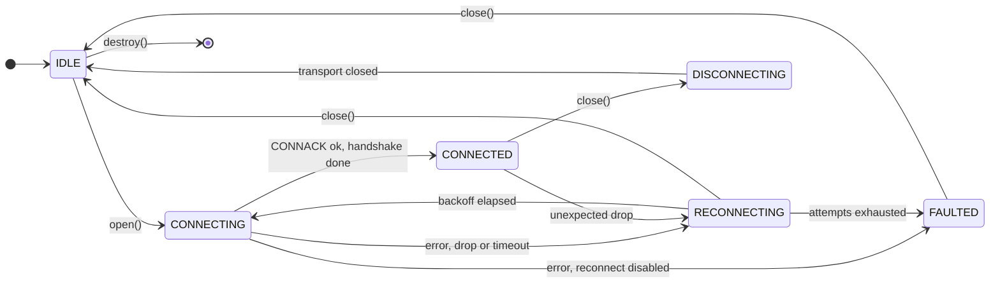
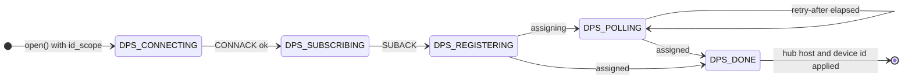
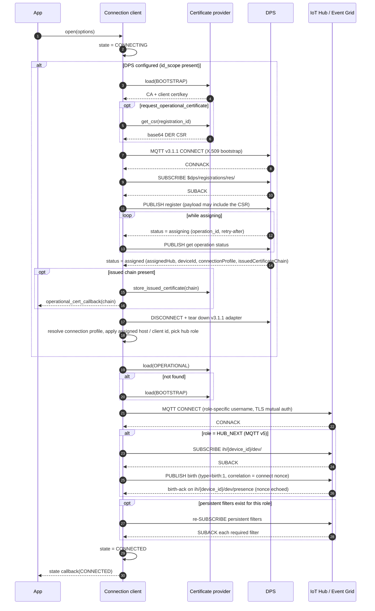
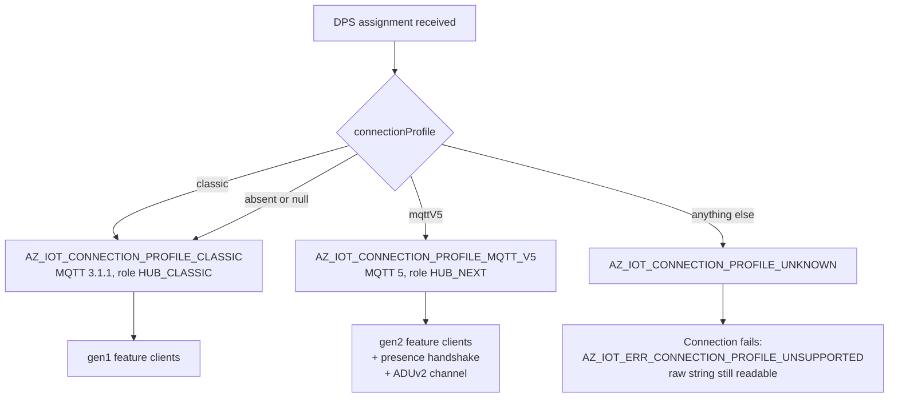
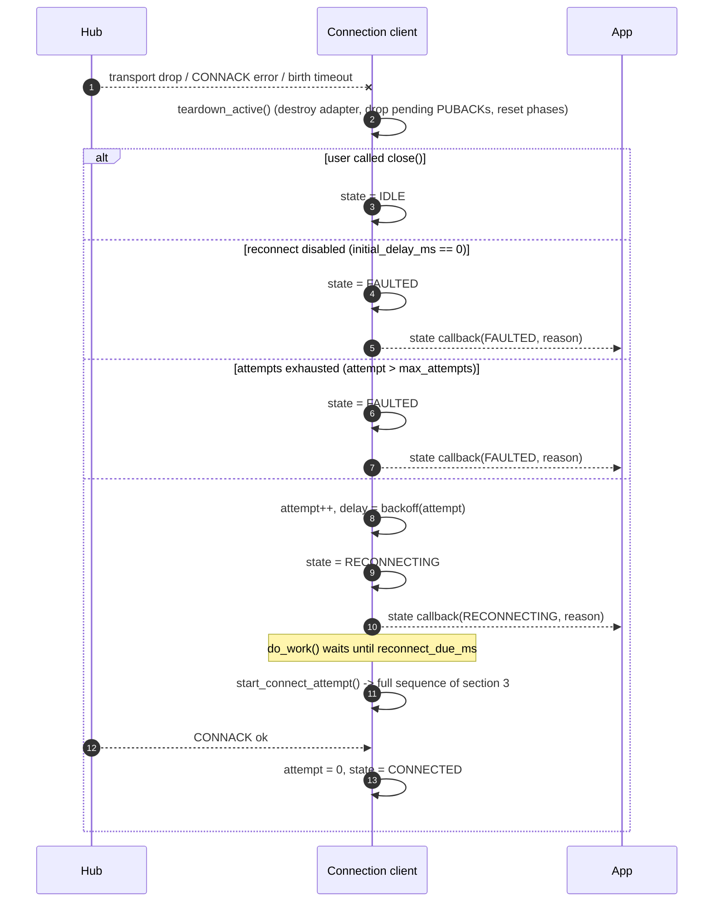
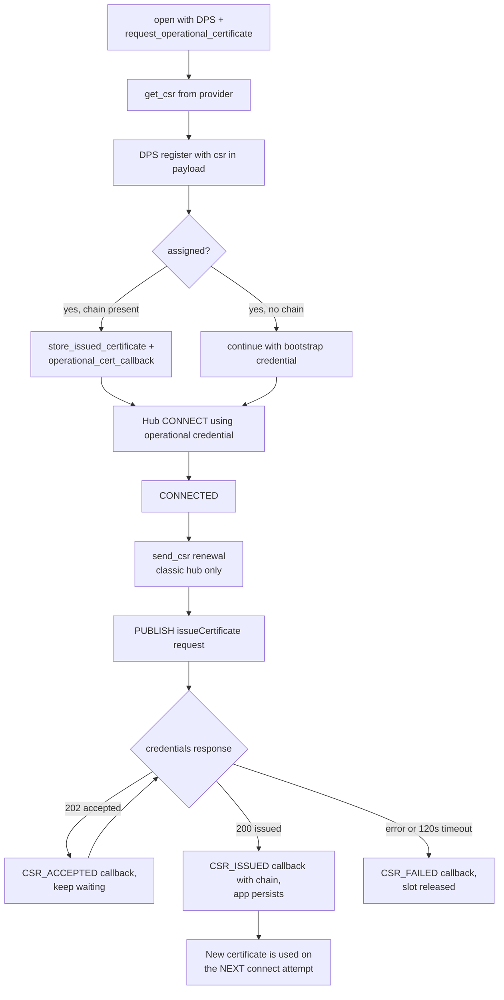
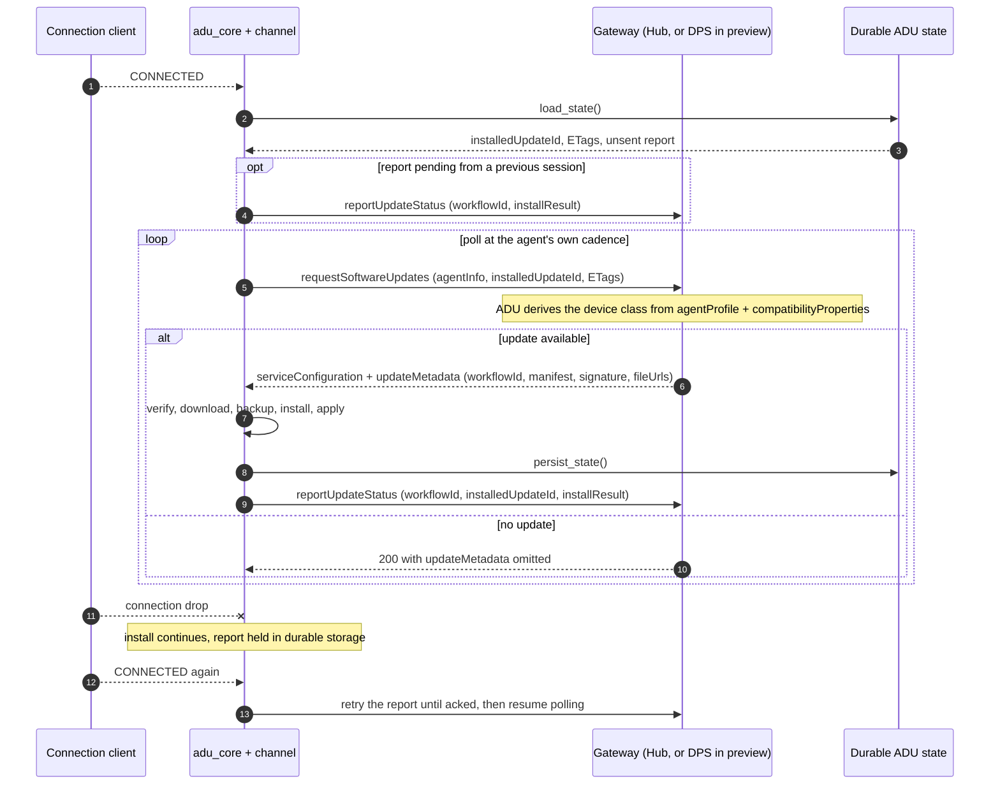
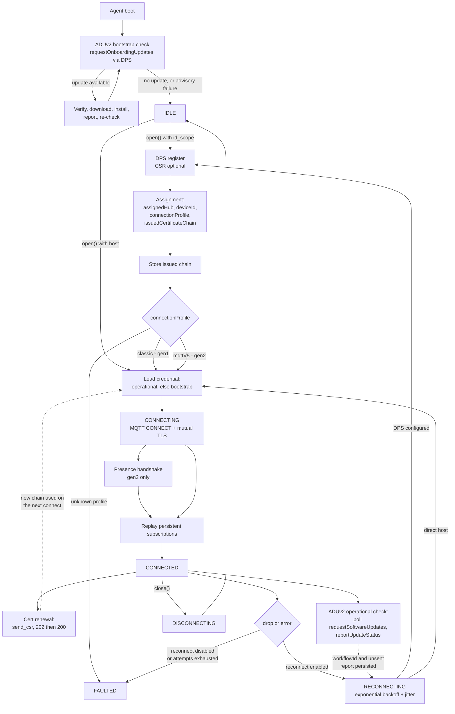

# Connection and Reconnection Lifecycle — C client

C-specific reference for the connection lifecycle: identifiers, file locations, enum values and
defaults as implemented in [c/src/core/connection_client.c](../../src/core/connection_client.c),
which is the current source of truth for the design.

The language-neutral version of this design, which both the C and .NET clients are held to, is
[connection.md](../connection.md). Read that first for the contract; read this one for the C
implementation of it.

Related documents:

- [design.md](../design.md) — overall layering and adapter model.
- [connection-impl-status.md](connection-impl-status.md) — per-client coverage of the contract.
- [certificate-management.md](certificate-management.md) — CSR / operational certificate design.
- [client-separation.md](client-separation.md) — connection profile (§2) and the ADU channel split (§8).
- [connection-state-and-error-propagation.md](connection-state-and-error-propagation.md) — observer registry and status codes.
- [dps-integration.md](../dps-integration.md), [devnotes.md](../devnotes.md) — DPS contract and the running requirements log.
- **ADUv2** — [aduv2-spec.md](aduv2-spec.md) is the device contract and the source for §7
  below; it owns the request/response shapes, error codes and trust model, which are deliberately not
  restated here. [adu-client-plan.md](adu-client-plan.md) carries the SDK status and the work
  queue for the ADUv1 cut. [adu-client-design.md](adu-client-design.md) covers the shared verify/download/install
  engine, which is unchanged from ADUv1.

### Status legend

This document describes the target lifecycle. Not all of it is coded yet, so every section is marked:

| Mark | Meaning |
| --- | --- |
| **[implemented]** | Present in `c/src` today and covered by tests. |
| **[planned]** | Designed and agreed, not yet in code. |

---

## 1. Vocabulary

| Term | Meaning |
| --- | --- |
| **State** | User-visible connection lifecycle value (`az_iot_connection_state`). Reported through the state callback. |
| **Connection profile** | What the device is connected to, as declared by DPS: `classic` or `mqttV5` (`az_iot_connection_profile`). Not caller-settable. |
| **Generation** | The feature-client family selected by the profile: `gen1` (classic) or `gen2` (mqttV5). |
| **Role** | Which endpoint/protocol the current MQTT session targets (`az_iot_mqtt_role`): `DPS` (v3.1.1), `HUB_CLASSIC` (v3.1.1), `HUB_NEXT` (v5). |
| **Phase** | Internal sub-step inside a state — DPS phases and presence (birth) phases. Not user-visible. |
| **Provisioning** | Obtaining a hub assignment from DPS. |
| **Onboarding** | Everything that happens against the DPS gateway under *onboarding auth*: the bootstrap update check, the CSR, and registration itself. |
| **Renewal** | The recurring, post-provisioning counterpart under *operational auth*: certificate re-issuance and the periodic ADUv2 update check. |
| **Bootstrap credential** | Initial device identity (`AZ_IOT_CRED_BOOTSTRAP`). |
| **Operational credential** | Certificate issued to the device via CSR (`AZ_IOT_CRED_OPERATIONAL`). |
| **ADU channel** | The `az_iot_adu_channel` vtable that carries update delivery and reporting, keeping `adu_core` transport-independent. |

---

## 2. Top-level state machine **[implemented]**

States are defined in
[az_iot_connection_client.h](../../inc/azure/iot/az_iot_connection_client.h); transitions are all funneled
through the internal `set_state_to()` helper, which is also what raises the user state callback.



`FAULTED` is settled, not a dead end. The SDK never leaves it on its own -- `do_work()` does not
retry from there -- but `close()` is legal from it and returns the client to `IDLE`, from which
`open()` starts a fresh attempt with the configuration and the attached feature clients intact.
`open()` itself remains `IDLE`-only.

When DPS is configured the whole provisioning exchange happens **inside** the `CONNECTING` state, so
the application never sees an intermediate `CONNECTED` for the DPS session. The DPS progress is
tracked separately as a phase:



A transport drop or transient session failure during a DPS phase is handled by the same backoff path
as a hub failure, and a retry restarts provisioning from `DPS_CONNECTING`. A *registration* failure
is not: `dps_apply_deferred()` transitions to `FAULTED`. See §5.2 for the split.

---

## 3. Full connect sequence **[implemented]**



Key ordering guarantees that both clients must honour:

1. `CONNECTED` is announced **after** the birth handshake (Hub-Next) and **after** every required
  persistent subscription has been SUBACKed, so a feature client never observes `CONNECTED` while
  its topic filters are missing. Hub-Next feature delivery uses the single
  `ih/{device_id}/dev/#` presence wildcard; Classic feature filters and application custom topics
  use the persistent-subscription registry.

2. The DPS session is fully torn down before the hub session is created — they are never concurrent,
   and DPS always uses MQTT 3.1.1 even when the hub session uses v5.
3. The operational certificate is preferred over the bootstrap certificate on every connect attempt,
   including reconnects.
4. **The ADUv2 bootstrap update check runs before `open()`, not inside it.** The agent drives the
   onboarding update call against the DPS gateway until the service reports no update, and only then
   does the connection client register. The check is **advisory**: if it fails, the device proceeds
   to register anyway. See [§7](#7-aduv2-onboarding-and-renewal-partly-implemented).
5. The DPS assignment is the single delivery point for everything the device learns about its
   placement: hub, device id, connection profile and issued certificate chain.

### 3.1 Egress: transport and proxy **[implemented]**

Both connects above — the DPS bootstrap connect and the hub connect — use the same egress
configuration, because a device that needs a proxy or WebSockets to reach the hub needs them to
reach DPS first.

| Option | Effect |
| --- | --- |
| `transport` | `TCP` (default) or `WEBSOCKET`. WebSockets carries MQTT inside a WebSocket on 443, for a network that passes only HTTP(S) ports. |
| `websocket_path` | Defaults to `/$iothub/websocket`, which is what IoT Hub and DPS expect. |
| `proxy` | Host, port and optional Basic credentials of an HTTP proxy. The connection is made with HTTP `CONNECT`, for both transports. |
| `port` | `0` derives the port from the transport: 8883 for TCP, 443 for WebSockets. An explicit value always wins. |

Two rules:

- **The proxy is a transport detail only.** TLS is negotiated with the broker *inside* the tunnel,
  so the proxy sees ciphertext, and chain and hostname validation are unchanged. The MQTT session,
  the identity and the reconnection policy are all unaffected.
- **An adapter that cannot honour the request must refuse it** with `AZ_IOT_ERR_NOT_SUPPORTED`.
  Connecting directly when a proxy was configured would bypass the egress control the caller
  selected, and connecting over TCP when WebSockets were selected would be blocked by the firewall
  the caller was working around; either would fail later and for the wrong reason.

Note for the Paho adapter: when `proxy` is left unset, Paho still falls back to the lowercase
`http_proxy` / `https_proxy` environment variables on its own (the uppercase spellings are ignored).
Set `proxy` to be explicit and independent of the environment.

Worked examples: [samples/websockets](../../samples/websockets/main.c) and
[samples/proxy](../../samples/proxy/main.c). Each is the `telemetry_gen1` sample with
one of these options set, so the diff against it is exactly the feature.

---

## 4. Connection profile selection **[implemented]**

The profile is what DPS says the device landed on. It is **reported, never selected** — there is no
caller-facing knob, and falling back from one profile to another is application logic, not SDK
behaviour. See [client-separation.md §2](client-separation.md) for the full rationale.



| Wire value | Enum | MQTT | Generation |
| --- | --- | --- | --- |
| `"classic"`, absent, or `null` | `AZ_IOT_CONNECTION_PROFILE_CLASSIC` | 3.1.1 | gen1 |
| `"mqttV5"` | `AZ_IOT_CONNECTION_PROFILE_MQTT_V5` | 5 | gen2 |
| anything else | `AZ_IOT_CONNECTION_PROFILE_UNKNOWN` | — | connection fails |

Rules both clients must implement:

- `connectionProfile` is a `readOnly` **string** on `DeviceRegistrationResult`, delivered alongside
  `assignedHub`, `deviceId` and `issuedCertificateChain`. There is no numeric `hub_version` on the wire.
- It is an **extensible union**, so the raw string must be preserved verbatim
  (`az_iot_hub_profile.connection_profile_raw`) and not collapsed into a closed enum. A value newer
  than the SDK still has to be loggable.
- An unrecognised profile **fails the connection** with `AZ_IOT_ERR_CONNECTION_PROFILE_UNSUPPORTED`.
  The SDK will not guess which MQTT version to speak.
- The profile is readable only once `CONNECTED`; before that
  `az_iot_connection_client_get_hub_profile()` returns `AZ_IOT_ERR_NOT_CONNECTED`.
- A feature client from the wrong generation is refused with `AZ_IOT_ERR_HUB_GENERATION_MISMATCH`.
  Because of this, feature clients must be created **after** the connection is open.

> **Blocked on the api-version.** `connectionProfile` is new in DPS `2026-11-02-preview`; the SDK
> still requests `2019-03-31` via the vendored `azure-sdk-for-c`, so the field never arrives today.
> Raising it is a prerequisite for this entire section.
>
> **Open:** whether a reconnect can change the generation. If DPS can reassign a device mid-life,
> every feature client the application holds becomes invalid at that moment and it must be told.

---

## 5. Reconnection **[implemented]**



### 5.1 Backoff policy

`az_iot_reconnection_policy` in
[az_iot_connection_client.h](../../inc/azure/iot/az_iot_connection_client.h), computed by
`az_iot_reconnect_delay_ms()` in [reconnect.c](../../src/core/reconnect.c):

```text
base   = min(max_delay_ms, initial_delay_ms << min(attempt - 1, 30))
jitter = uniform(-jitter_pct%, +jitter_pct%) * base
delay  = clamp(base + jitter, 1, max_delay_ms)
```

| Field | Default | Notes |
| --- | --- | --- |
| `initial_delay_ms` | 1000 | `0` disables automatic reconnect entirely. |
| `max_delay_ms` | 30000 | Cap for the exponential term and for the jittered result. |
| `max_attempts` | 0 | `0` means retry forever. |
| `jitter_pct` | 20 | Symmetric randomization, seeded from the monotonic clock. |

The shift is clamped at 30 to avoid 32-bit overflow. The attempt counter resets to zero on every
successful CONNACK.

### 5.2 What triggers a reconnect

- CONNACK with a non-success status.
- Unexpected transport disconnect or adapter error while `CONNECTING` or `CONNECTED`.
- A reconnect attempt that cannot even start the session: `start_connect_attempt()` (or `dps_start()`
  when re-provisioning) returning non-OK schedules another reconnect rather than faulting.
- Any failure in the Hub-Next presence handshake, not only its timeout: `presence_start()` failing
  after CONNACK, the presence SUBACK arriving with a failure status, and `presence_publish_birth()`
  failing all clear the phase and reconnect.
- Hub-Next birth-ack timeout (60 s per handshake step), checked in `_do_work()`.

Not triggers, because they fault instead:

- **DPS registration failure.** `dps_apply_deferred()` transitions to `FAULTED` when the register
  status is non-OK or no assignment arrived, and again if applying the assigned host or device id
  fails. Provisioning is re-run on a reconnect only via the re-provision path below.
- **An unsupported `connectionProfile`.** Faults with
  `AZ_IOT_ERR_CONNECTION_PROFILE_UNSUPPORTED` rather than guessing a protocol (§4).

`AZ_IOT_ERR_IDENTITY_REJECTED` on CONNACK is a special case: when DPS is configured and reconnection
is enabled, it sets `reprovision_pending`, so the next attempt runs `dps_start()` for a fresh
assignment instead of reconnecting to the same rejected credential. The flag is cleared before the
attempt, so a failure there falls back to an ordinary retry rather than looping through provisioning.

Every trigger above is conditional on `reconnect_enabled()`: with no retry policy the same conditions
transition to `FAULTED`.

§9 classifies every failure this client can see, including the ones that are retried here but
cannot succeed on retry.

A user-initiated `close()` never triggers a reconnect: it sets an internal `user_close` flag that is
checked before backoff is scheduled.

### 5.3 What is preserved across a reconnect

| Item | Preserved | Behaviour |
| --- | --- | --- |
| Persistent subscriptions | Yes | Re-issued on reconnect. Every required filter must be SUBACKed before `CONNECTED`; a missing SUBACK expires on the configured deadline and retries as a transient failure. |
| Assigned hub host / device id | Yes | Cached after the first DPS assignment. |
| Connection profile | Yes | Re-resolved from the new assignment; a change invalidates held feature clients (open question, §4). |
| Operational certificate | Yes | Owned by the certificate provider, reloaded on each attempt. |
| ADU workflow state | Yes | Owned by `adu_core` and persisted, so an install survives a reconnect and a reboot. |
| Reconnect attempt counter | Reset on success | Incremented per failed attempt. |
| In-flight QoS 1 PUBACKs | No | Packet ids belong to the destroyed adapter; callers must re-send. |
| Twin GET/PATCH, method responses, telemetry in flight | No | Feature clients must re-issue. |
| ADU status report not yet acked | Yes | Held in durable storage and retried until acked; idempotent on `workflowId`. |
| Presence (birth) phase | No | Restarted with a freshly generated nonce. |
| DPS phase | No | Restarted from `CONNECTING` if DPS is configured. |
| In-flight CSR operation | No | Abandoned; the callback fires with a failure/timeout result. |

---

## 6. Certificate management: onboarding and renewal **[implemented]**

Two distinct issuance paths exist; both end with the certificate provider owning the operational
credential, and neither forces an immediate reconnect.



Renewal topics (classic hub):

| Direction | Topic |
| --- | --- |
| Publish | `$iothub/credentials/POST/issueCertificate/?$rid={request_id}` |
| Subscribe | `$iothub/credentials/res/#` |
| Response | `$iothub/credentials/res/{status}/{request_id}` |

Rules that apply to both clients:

- Only one CSR operation may be in flight; a second request fails fast with a *busy* result.
- The issued chain is delivered leaf-first as base64 DER and is only valid for the duration of the
  callback — the application must copy or persist it.
- A successful renewal does **not** tear down the live session. The new credential takes effect on
  the next connect, whether that is a reconnect or an explicit reopen.
- At connect time the provider is asked for `OPERATIONAL` first and falls back to `BOOTSTRAP` when
  the operational credential is absent or uninitialized.
- CSR-based DPS enrollment uses the `2025-07-01-preview` DPS API version and requires a
  caller-provided CSR payload buffer of at least `AZ_IOT_CSR_PAYLOAD_BUFFER_MIN` bytes.

---

## 7. ADUv2: onboarding and renewal **[partly implemented]**

**ADUv1 is cut.** Its Twin-based public API is being removed; what survives is everything that has
nothing to do with transport. ADU is re-layered into a transport-independent **`adu_core`** —
manifest v5 parsing, JWS/SJWK verification, root keys, SHA-256 integrity, the
download/backup/install/apply state machine, and reboot/resume persistence — plus an
**`az_iot_adu_channel`** vtable carrying delivery and reporting.

ADUv2 is a **device-initiated pull protocol**, and its device-facing delivery moved **off** a
dedicated ADU HTTPS endpoint. The agent calls an updating operation on a gateway it already talks to,
reusing the credential it already has; the gateway is an authenticated pass-through to ADR and then
ADU. The device never talks to ADU directly, needs no ADU-specific credential, and there is no twin,
no subscription and no unsolicited offer.

| Phase | Gateway | Operation (on the wire) | Spec working name |
| --- | --- | --- | --- |
| First-time / bootstrap (**before** provisioning) | DPS | `requestOnboardingUpdates` | `GetOnboardingDeviceUpdate` |
| Regular / operational (**after** provisioning) | DPS *(Ignite '26 interim)*, IoT Hub *(post-Ignite)* | `requestSoftwareUpdates` | `GetDeviceUpdate` |
| Reporting, either phase | same gateway as the fetch | `reportUpdateStatus` | `ReportDeviceUpdateStatus` |

All three are POSTs under the device's own registration on the gateway's device endpoint; see
[eng/aduv2-spec.md](aduv2-spec.md) for the exact URL, headers and payloads, and for which parts
of the contract are measured rather than drafted.

The device selects onboarding vs regular **by which operation it calls**; the gateway does not infer
or validate the choice.

> **The Hub updating API is not ready for Ignite '26.** In preview, DPS fronts both the bootstrap and
> the operational flow, using the existing DPS device credential (X.509 in phase 1). The operational
> path moves to IoT Hub afterwards **with no device-contract change** — same request and response, a
> different gateway. Treat the gateway as a channel parameter, not a constant.

### 7.1 Onboarding — bootstrap update, before provisioning

The critical ordering fact for this document: **the bootstrap update check happens before the device
registers.** The agent, not the connection client, drives it. On the happy path `open()` waits until
the check reports no update, so several updates can chain before provisioning.

The check is **advisory and must never block provisioning.** If it errors, times out, or the account
is not linked, the device proceeds to register anyway.


- The loop is genuine: after installing a bootstrap update the agent re-checks, because a bootstrap
  deployment can chain.
- Bootstrap progress is stored **in the bootstrap update job**, not on the device's ADR attributes —
  the device resource does not exist yet.
- Trust comes from the **root-key package** at `serviceConfiguration.rootKeyDownloadUrl` returned by
  the same call. Account scoping (`accountId` bound into the manifest signature) is **deferred past
  Ignite '26** — DPS returns no `accountId`, so the device verifies provenance-from-ADU but not
  account scoping. Base signature validation stays required.
- `fileUrls` are **not** covered by the signed manifest; payloads are downloaded straight from blob
  storage and integrity comes from the per-file hashes inside the manifest.
- Bootstrap orchestration is entirely the agent's responsibility for Ignite '26. DPS does **not**
  enforce that a device is on a given update version before provisioning it.

### 7.2 Renewal — operational update check, after `CONNECTED`



`installResult` carries the terminal outcome, its failure origin, the hex `extendedResultCodes`
list and a per-step `stepResults` map — see [aduv2-spec.md](aduv2-spec.md) for the field-level
shape.

### 7.3 Rules both clients must implement

- **Poll, never wait.** The agent owns the cadence. A missed poll is not an error and there is no
  offer to lose, which is why a reconnect needs no replay of ADU subscriptions — there are none.
- **`workflowId` is the correlation key.** It arrives in `updateMetadata` and is echoed on the
  report. Reporting is **idempotent on `workflowId` alone**; a conflicting terminal result for the
  same id is rejected as a conflict.
- **The device is the sole retrier.** The gateway fails fast with one attempt per hop. The agent
  honours `Retry-After` on throttling and retries `reportUpdateStatus` until it is acked — a
  report is a durable write and must not be lost.
- **Drive behaviour from the machine-readable error code, never the HTTP status.** A stale
  `agentInfoEtag` means resend the full `agentInfo`; a stale `serviceConfigEtag` means re-ask without
  it; an unlinked update account means "no update service configured", which is not a failure.
- **"No update" is a success.** It is a 200 with the update metadata omitted, not an error.
- **ADU never drives the connection.** It does not open, close, or force a reconnect. It does
  sequence ahead of the *first* `open()`, via the advisory bootstrap check in §7.1.
- **Compatibility properties are opaque key/value pairs** (1–5) reported by the agent alongside an
  opaque `agentProfile`; the service combines them into a device class. The agent assigns them no
  meaning.
- **The gateway is a channel parameter.** Bootstrap always uses DPS; operational uses DPS in the
  Ignite '26 preview and IoT Hub afterwards, with no device-contract change. This SDK plans to
  expose the operational channel as a gen2 feature client
  ([client-separation.md](client-separation.md) §8), but the service contract binds ADU to
  the updating operations, not to a connection profile.

---

## 8. Combined reference diagram

One picture of the whole device lifecycle: connection and reconnection, connection-profile selection,
certificate management (onboarding + renewal) and ADUv2 (onboarding + renewal). Dotted edges are
deferred effects — they do not happen inline.



Reading it as four overlapping concerns:

| Concern | Onboarding (DPS gateway, onboarding auth) | Renewal (post-`CONNECTED`, operational auth) |
| --- | --- | --- |
| **Certificates** | CSR in the registration, issued chain in the assignment | `send_csr` over the hub; new chain applies on the next connect |
| **ADUv2** | `requestOnboardingUpdates` loop **before** registration, advisory | Polled `requestSoftwareUpdates` / `reportUpdateStatus` (DPS in preview, Hub afterwards) |
| **Connection profile** | Declared in the assignment; selects MQTT version and generation | Re-resolved on every reconnect that goes through DPS |
| **Connection** | DPS phases inside `CONNECTING` | Backoff-driven reconnect replays the whole path |

The two onboarding concerns are **not** symmetric, and that asymmetry is the thing to remember:
the CSR travels *inside* registration, while the ADU bootstrap check happens *before* it and must
complete first.

---

## 9. Connection failure realization (C) **[partly implemented]**

The C realization of the taxonomy in [connection.md §9](../connection.md#9-connection-failure-taxonomy).
That section says what *any* client must do; this one says what the C client **actually does today**,
which result value it produces, and which component decides.

Read the two together. Where a row's class in the generic table and the SDK action here disagree,
that is a gap, and it is called out in the notes rather than smoothed over.

Per-client status — what C does versus what .NET does — is not repeated here; it lives in
[connection-impl-status.md](connection-impl-status.md).

### 9.1 Result vocabulary

The full set is in [az_iot_result.h](../../inc/azure/iot/az_iot_result.h). The values that appear on a
connection failure path:

| Value | Meaning on the connection path |
| --- | --- |
| `AZ_IOT_OK` | Success. |
| `AZ_IOT_ERR_INVALID_ARG` | A caller argument was rejected at the SDK boundary, or a bound was exceeded that is a caller error. |
| `AZ_IOT_ERR_NOT_INITIALIZED` | The operation needs a live adapter and there is none. |
| `AZ_IOT_ERR_NOT_CONNECTED` | Substituted as the reason when a disconnect carries no status of its own. |
| `AZ_IOT_ERR_TIMEOUT` | A deadline expired — birth-ack, CSR operation. |
| `AZ_IOT_ERR_PROTOCOL` | A service payload could not be parsed. |
| `AZ_IOT_ERR_MQTT` | The catch-all for transport and broker failures. **The great majority of wire failures land here**, including every CONNACK code that is not an identity refusal, every SUBACK refusal the broker may not repeat, and every failed PUBACK. |
| `AZ_IOT_ERR_DPS` | Registration returned a failed or disabled status. |
| `AZ_IOT_ERR_NOT_SUPPORTED` | No adapter factory for the required protocol version; a fixed-size registry is full; a service-supplied string is longer than its buffer. |
| `AZ_IOT_ERR_BUSY` | A single-slot operation is already in flight, or the service is throttling. |
| `AZ_IOT_ERR_NOT_ENOUGH_SPACE` | A compile-time buffer bound was exceeded. |
| `AZ_IOT_ERR_NOT_FOUND` | A required field was absent from a service payload. |
| `AZ_IOT_ERR_INTERNAL` | A dependency call failed in a way the SDK cannot attribute. |
| `AZ_IOT_ERR_IDENTITY_REJECTED` | The broker refused *who the device claims to be*. The only result that drives re-provisioning. |
| `AZ_IOT_ERR_SUBSCRIPTION_REFUSED` | A SUBACK carried a code the broker will repeat. Terminal even when a reconnection policy is configured. |
| `AZ_IOT_ERR_CREDENTIAL_INCOMPLETE` | The certificate provider returned material the adapter cannot use — a certificate with no key, or a key URI with no engine or provider to resolve it. Caught before the connect, so the device gets this instead of an opaque TLS failure seconds later. |
| `AZ_IOT_ERR_CONNECTION_PROFILE_UNSUPPORTED` | DPS assigned a `connectionProfile` this build does not know. |
| `AZ_IOT_ERR_CONNECTION_PROFILE_MISMATCH` | A feature client of one generation was attached to a connection of the other. |

`AZ_IOT_ERR_TLS` is produced only by the Paho adapter's key-custody path, for key material that
cannot be expressed to the TLS stack — not by a handshake, certificate, chain or cipher failure.
Those all reach the core as `AZ_IOT_ERR_MQTT`, because the adapter signals its own failures with
negative codes and [`az_iot_mqtt_connack_result()`](../../src/core/mqtt_iface.c) maps every negative
code to `AZ_IOT_ERR_MQTT` by design (a failure that never reached a broker carries no verdict about
the identity). `AZ_IOT_ERR_AUTH` is never produced on the connection path at all. The consequence is
recorded in [§9.6](#96-known-gaps).

### 9.2 CONNACK mapping

`az_iot_mqtt_connack_result(version, connack_code)` in
[mqtt_iface.c](../../src/core/mqtt_iface.c) is the single decision point. Adapters are **required** to
call it rather than reporting a blanket `AZ_IOT_ERR_MQTT` — the rule is normative in
[how_to_byo_mqtt_client.md](../how_to_byo_mqtt_client.md).

| Input | Result | Why |
| --- | --- | --- |
| `0` (either version) | `AZ_IOT_OK` | Accepted. |
| Any **negative** code | `AZ_IOT_ERR_MQTT` | The adapter's own failure — refused socket, TLS handshake, client-library error. It never reached a broker, so it says nothing about the identity. |
| v3.1.1 `2 identifier rejected`, `4 bad user name or password`, `5 not authorized` | `AZ_IOT_ERR_IDENTITY_REJECTED` | The broker refused the identity. |
| v3.1.1 `1 unacceptable protocol version` | `AZ_IOT_ERR_MQTT` | **Deliberately excluded** from the identity set: it says nothing about who the device claims to be. |
| v3.1.1 `3 Connection Refused, Server unavailable` | `AZ_IOT_ERR_MQTT` | **Deliberately excluded**: the canonical transient failure. |
| v5 `0x85 Client Identifier not valid`, `0x86 Bad User Name or Password`, `0x87 Not authorized`, `0x8C Bad authentication method` | `AZ_IOT_ERR_IDENTITY_REJECTED` | `0x86` is included alongside the three the core strictly needs because it is the v5 spelling of v3.1.1's `4`; treating the same refusal differently per protocol version would make the re-provisioning trigger depend on the hub flavour. |
| Every other non-zero v5 code | `AZ_IOT_ERR_MQTT` | Not an identity verdict. |
| Any code, with a version the function does not know | `AZ_IOT_ERR_MQTT` | The two schemes overlap numerically — `2`, `4` and `5` are identity refusals in v3.1.1 and mean something else entirely in v5 — so guessing a scheme would be guessing whether to abandon a credential. This is a public entry point that adapters call with a version they supply, so the value is genuinely untrusted. |

`AZ_IOT_ERR_IDENTITY_REJECTED` is the **only** result that changes where the next attempt goes: with
DPS configured and reconnection enabled it sets `needs_reprovision`, so the retry runs `dps_start()`
for a fresh assignment (§5.2). Everything else retries against the same endpoint.

### 9.3 SUBACK mapping

`az_iot_mqtt_suback_result(version, suback_code)`, in the same file, is the SUBACK counterpart and
is subject to the same "do not flatten codes" rule.

| Input | Result | Why |
| --- | --- | --- |
| `0x00`–`0x02` (either version) | `AZ_IOT_OK` | A grant, including one below the QoS requested: the subscription exists and delivery is `min(publish QoS, granted QoS)`. Reading a downgrade as a refusal would fail a session no broker objected to. |
| Any **negative** code | `AZ_IOT_ERR_MQTT` | The adapter's own failure. It never reached a broker, so it carries no verdict about the filter and stays retryable. |
| v5 `0x87 Not authorized`, `0x8F Topic Filter invalid`, `0x9E Shared Subscriptions not supported`, `0xA1 Subscription Identifiers not supported`, `0xA2 Wildcard Subscriptions not supported` | `AZ_IOT_ERR_SUBSCRIPTION_REFUSED` | The broker will repeat this answer to the same filter. |
| v5 `0x80 Unspecified error`, `0x83 Implementation specific error`, `0x97 Quota exceeded` | `AZ_IOT_ERR_MQTT` | **Deliberately excluded** from the refusal set: this is how a transient service-side fault presents, and re-subscribing is the right response. |
| v3.1.1 `0x80 Failure` | `AZ_IOT_ERR_SUBSCRIPTION_REFUSED` | No reason code exists to consult. The classification comes from what a Classic device can subscribe to — a topic set fixed at compile time — which makes a refusal a property of the filter rather than of the moment. |
| Any code, with a version the function does not know | `AZ_IOT_ERR_MQTT` | Same reasoning as the CONNACK mapper. |

`AZ_IOT_ERR_SUBSCRIPTION_REFUSED` is the only failure that is **terminal even when a reconnection
policy is configured** (`fail_subscription_restore()`): reconnecting would re-issue the same filter,
be refused again, and leave the device cycling forever without saying why.

### 9.4 Compile-time bounds

Buffers are fixed-size struct members, not allocations, so exceeding one is a hard failure rather than
a slow path. Every constant is `#ifndef`-guarded and can be raised at build time. From
[az_iot_connection_client.h](../../inc/azure/iot/az_iot_connection_client.h) unless noted.

| Constant | Value | What it bounds | Result when exceeded |
| --- | --- | --- | --- |
| `AZ_IOT_MAX_MQTT_FACTORIES` | 4 | Registered adapter factories | `AZ_IOT_ERR_NOT_SUPPORTED` |
| `AZ_IOT_MAX_PENDING_PUBACKS` | 16 | QoS-1 publishes awaiting a PUBACK **with an ack callback** | `AZ_IOT_ERR_NOT_SUPPORTED` — the publish itself already succeeded |
| `AZ_IOT_MAX_PERSISTENT_SUBS` | 8 | Persistent subscription registry | `AZ_IOT_ERR_NOT_ENOUGH_SPACE` |
| `AZ_IOT_PERSISTENT_SUB_TOPIC_MAX` | 128 | Persistent topic-filter string | `AZ_IOT_ERR_INVALID_ARG` |
| `AZ_IOT_MAX_SESSION_HANDLERS` | 4 | Session-end handlers (re-registering the same context upserts) | `AZ_IOT_ERR_NOT_SUPPORTED` |
| `AZ_IOT_MAX_INBOUND_HANDLERS` | 8 | Inbound dispatch table ([az_iot_dispatch.h](../../inc/azure/iot/az_iot_dispatch.h)) | `AZ_IOT_ERR_NOT_SUPPORTED` |
| `AZ_IOT_DISPATCH_PREFIX_MAX` | 128 | Dispatch topic prefix | `AZ_IOT_ERR_NOT_SUPPORTED` |
| `AZ_IOT_DPS_HOST_BUF` | 128 | Assigned hub hostname | `AZ_IOT_ERR_NOT_SUPPORTED` on the DPS path; `AZ_IOT_ERR_NOT_ENOUGH_SPACE` from `__set_host()` |
| `AZ_IOT_DPS_DEVICE_ID_BUF` | 128 | Assigned device id | as above |
| `AZ_IOT_DPS_TOPIC_BUF` | 256 | DPS register / query publish topic | `AZ_IOT_ERR_INTERNAL` |
| `AZ_IOT_MQTT_USERNAME_BUF` | 256 | Hub username | Hub-Next: `AZ_IOT_ERR_NOT_ENOUGH_SPACE`. Classic: **no explicit error** — the connect proceeds without a username. See [§9.6](#96-known-gaps). |
| `AZ_IOT_PRESENCE_TOPIC_BUF` | 256 | Presence topics | `AZ_IOT_ERR_NOT_ENOUGH_SPACE` |
| `AZ_IOT_CONNECTION_PROFILE_RAW_BUF` | 64 | Raw `connectionProfile` string | Truncated, resolves to UNKNOWN, then `AZ_IOT_ERR_CONNECTION_PROFILE_UNSUPPORTED` |
| `AZ_IOT_CSR_PAYLOAD_BUFFER_MIN` | 8448 | Minimum caller-supplied CSR payload buffer | `AZ_IOT_ERR_NOT_ENOUGH_SPACE` |
| `CSR_MAX_BASE64` | 8192 | Base64 CSR body ([connection_client.c](../../src/core/connection_client.c)) | `AZ_IOT_ERR_INVALID_ARG` |
| `AZ_IOT_MAX_FEATURE_CLIENT_BINDS` | 8 | Feature clients bound to one connection | `AZ_IOT_ERR_NOT_ENOUGH_SPACE` |
| `AZ_IOT_DPS_OPERATION_ID_MAX` | 64 | DPS `operation_id` from the assigning response | `AZ_IOT_ERR_NOT_SUPPORTED` |
| `AZ_IOT_DPS_REGISTRATION_PAYLOAD_MAX` | 512 | Caller-supplied DPS registration payload | `AZ_IOT_ERR_NOT_ENOUGH_SPACE` |
| `AZ_IOT_TWIN_MAX_PENDING` | 8 | Pending twin requests, per generation ([gen1](../../inc/azure/iot/gen1/az_iot_twin_client.h), [gen2](../../inc/azure/iot/gen2/az_iot_twin_client.h)) | `AZ_IOT_ERR_NOT_SUPPORTED` |
| `AZ_IOT_DM_MAX_INFLIGHT` | 4 | In-flight direct-method requests ([gen1](../../inc/azure/iot/gen1/az_iot_direct_method_client.h); gen2 derives `AZ_IOT_GEN2_DM_MAX_CONCURRENT` from it) | **No result** — the invocation is dropped and a warning is logged. See [§9.6](#96-known-gaps). |
| `AZ_IOT_GEN2_DM_MAX_METHODS` | 8 | Registered gen2 direct-method handlers | `AZ_IOT_ERR_NOT_ENOUGH_SPACE` |
| CSR slot | 1 | In-flight hub CSR renewals | `AZ_IOT_ERR_BUSY` |
| `AZ_IOT_DEFAULT_CONNECT_TIMEOUT_SECONDS` | 30 | Connect attempt, hub and DPS alike | Adapter-reported failure → `AZ_IOT_ERR_MQTT` |
| `AZ_IOT_DEFAULT_KEEP_ALIVE_SECONDS` | 30 | MQTT keep-alive in CONNECT | — |
| `AZ_IOT_DEFAULT_SUBSCRIPTION_ACK_TIMEOUT_SECONDS` | 60 | The subscription gate: how long the SUBACKs of one batch may take | `AZ_IOT_ERR_TIMEOUT` |
| `AZ_IOT_PRESENCE_BIRTH_ACK_TIMEOUT_MS` | 60000 | Each presence handshake step | `AZ_IOT_ERR_TIMEOUT` |
| `AZ_IOT_DPS_HOLD_TIMEOUT_MS` | 60000 | How long registration may be held for a pre-registration exchange | the hold expires and registration proceeds |
| `AZ_IOT_DPS_AUX_IDLE_TIMEOUT_MS` | 5000 | Idle linger on an auxiliary DPS session before it is dropped | session closed, no error |
| `AZ_IOT_DEFAULT_MAX_HUB_CONNECT_ATTEMPTS_BEFORE_REPROVISION` | 50 | Consecutive hub connect failures before the client re-provisions | `needs_reprovision` set; not an error |
| `CSR_OP_TIMEOUT_MS` | 120000 | Hub CSR renewal, re-armed on each `202 Accepted` | `AZ_IOT_ERR_TIMEOUT` |

Every one of these is a *silent* limit until it is crossed, and the result that surfaces is the
result of whatever call happened to be last — `AZ_IOT_ERR_NOT_ENOUGH_SPACE` does not say which pool
ran out. On an unattended device that is a hard failure to diagnose from the field.

### 9.5 The realization table

**Mapped by** names the component that decides the result: the adapter, the CONNACK mapper, the
connection client itself, or a feature client. Rows marked **[P1c]** describe scoped-but-unmerged
behaviour; rows marked **unverified** are ones where current C behaviour was not established, and are
left as gaps rather than guesses.

#### 9.5.1 Phase 1 — host, network and OS

| Phase | Trigger | Surfaced as | Mapped by | SDK action | Notes / limits |
| --- | --- | --- | --- | --- | --- |
| Name resolution | Hostname does not resolve | `AZ_IOT_ERR_MQTT` | Paho → negative code → `az_iot_mqtt_connack_result()` | `DEFER_RECONNECT` if a policy is configured, else `DEFER_FAULT` | Indistinguishable from every other adapter-side failure. The Paho code is logged but not carried. |
| Address selection | Dual-stack / IPv6-only failure | `AZ_IOT_ERR_MQTT` | as above | as above | Address iteration is Paho's, not the SDK's. |
| Socket connect | Connection refused, unreachable, or connect timeout | `AZ_IOT_ERR_MQTT` | as above | as above | The 30 s connect timeout is passed to the adapter; expiry arrives as an ordinary connect failure. |
| Established session | Reset by peer, or write to a half-closed socket | `AZ_IOT_ERR_NOT_CONNECTED` (substituted when the event carries no status) | Paho `connectionLost` → `AZ_IOT_MQTT_EVT_DISCONNECTED` | `DEFER_RECONNECT` unless `user_close` or no policy, in which case `DEFER_IDLE` | `teardown_active()` drops pending PUBACKs and resets the presence phase. |
| Session bytes | Captive portal returns non-MQTT bytes | `AZ_IOT_ERR_MQTT` | Paho | reconnect | Paho rejects the bytes; the SDK sees an ordinary connect failure. |
| Host clock | Certificate outside its validity window because the clock is wrong | `AZ_IOT_ERR_MQTT` | Paho → negative code | reconnect until the policy is exhausted | **Gap:** classified Terminal generically, retried here. The OpenSSL reason is available in the trace log via `ssl_error_cb`, but not in the result. |
| Host clock | Wall clock steps backwards | none | — | none | Correct today: every deadline uses `az_iot_time_mono_ms()`, a monotonic source. Backoff jitter is seeded from it, never driven by wall time. |

#### 9.5.2 Phase 2 — TLS

| Phase | Trigger | Surfaced as | Mapped by | SDK action | Notes / limits |
| --- | --- | --- | --- | --- | --- |
| Handshake | Any TLS failure — expired, untrusted CA, hostname mismatch, revoked, version or cipher mismatch | `AZ_IOT_ERR_MQTT` | Paho negative code → `az_iot_mqtt_connack_result()` | reconnect if a policy is configured, else fault | **All five collapse to one value.** `AZ_IOT_ERR_TLS` is produced only for local key material the stack cannot be given (next row), never for a handshake outcome. |
| Credential | Certificate material the adapter cannot use — a certificate with no key, a key URI with no engine or provider, a key reference nothing can express | `AZ_IOT_ERR_CREDENTIAL_INCOMPLETE` (core) or `AZ_IOT_ERR_TLS` (key custody) | `connection_client.c` validation before the connect, and `az_iot_paho_key_custody.c` | the attempt fails before any socket is opened | Deliberate: caught up front so the device gets a specific result instead of an opaque TLS failure several seconds later. This is the one place a TLS-flavoured result is produced. |
| Handshake | TLS alert detail | not in the result | `paho_ssl_error_callback` | logged only | The OpenSSL error queue is drained line by line to the trace log when `AZ_IOT_PAHO_SSL` is built and tracing is enabled. It is the only place the concrete reason appears. |
| Handshake | **Client certificate rejected during the handshake** | `AZ_IOT_ERR_MQTT` | Paho negative code | reconnect | No MQTT session exists, so no CONNACK code is available. Correctly **not** treated as an identity rejection: the negative-code rule exists for exactly this. Consequence: a device whose operational certificate has been revoked retries forever instead of re-provisioning. |
| CONNACK | **Client certificate accepted by TLS, identity refused at CONNACK** (`rc=5` / `0x87 Not authorized`) | `AZ_IOT_ERR_IDENTITY_REJECTED` | `az_iot_mqtt_connack_result()` | sets `needs_reprovision`; the next attempt runs `dps_start()` | The distinction between this row and the previous one is exactly the distinction the negative-code rule encodes, and it is the reason adapters must not flatten codes. |
| Configuration | TLS is only enabled when a client certificate, key or `verify_server` is set | — | `paho_iface_create` | scheme selected as `ssl://` or `tcp://` | Keying off the credential means an unconfigured device connects in the clear rather than failing. |

#### 9.5.3 Phase 3 — CONNECT / CONNACK

| Phase | Trigger | Surfaced as | Mapped by | SDK action | Notes / limits |
| --- | --- | --- | --- | --- | --- |
| CONNACK | Accepted | `AZ_IOT_OK` | adapter | gen2: start the presence handshake, then the subscription gate. Classic: straight to the subscription gate. `CONNECTED` once the gate settles. Attempt counter reset. | |
| CONNACK | Identity refused — v3 `2`/`4`/`5`, v5 `0x85`/`0x86`/`0x87`/`0x8C` | `AZ_IOT_ERR_IDENTITY_REJECTED` | `az_iot_mqtt_connack_result()` | DPS configured and reconnection enabled → `needs_reprovision`, retry via `dps_start()`. Otherwise an ordinary retry or fault. | The retry is still scheduled through the reconnection policy, so backoff and `max_attempts` bound it — a device whose enrollment has been deleted must not hammer DPS either. **The flag is only set when a policy is configured**, so with retries disabled the intent to re-provision is dropped rather than carried to the next `open()`. |
| CONNACK | v3 `1 unacceptable protocol version` | `AZ_IOT_ERR_MQTT` | `az_iot_mqtt_connack_result()` | **retried** under policy | **Known defect.** Deterministic and can never succeed on retry; the generic table classes it Terminal. The exclusion from the identity set is correct — `1` says nothing about the identity — but the result should be a fatal classification, not a retry. Fixing it needs the fatal-failure classification that is `planned` for C. |
| CONNACK | v3 `3 Server unavailable` | `AZ_IOT_ERR_MQTT` | `az_iot_mqtt_connack_result()` | retried | Correct: the canonical transient refusal. |
| CONNACK | v5 deterministic refusals — `0x81`, `0x82`, `0x84`, `0x95`, `0x8A`, `0x90`, `0x99`, `0x9A`, `0x9B` | `AZ_IOT_ERR_MQTT` | `az_iot_mqtt_connack_result()` | **retried** | Same defect as v3 `1`. The four Will-related codes cannot arise: no client here sends a Will. |
| CONNACK | v5 transient refusals — `0x88`, `0x89`, `0x97`, `0x9F`, `0x80`, `0x83` | `AZ_IOT_ERR_MQTT` | `az_iot_mqtt_connack_result()` | retried with jitter | Correct. |
| CONNACK | v5 redirection — `0x9C Use another server`, `0x9D Server moved` | `AZ_IOT_ERR_MQTT` | `az_iot_mqtt_connack_result()` | **retried against the same host** | **Known gap.** The Server Reference property is not read. Retrying the same endpoint repeats the redirection until the policy is exhausted. |
| CONNECT | No CONNACK within the connect timeout | `AZ_IOT_ERR_MQTT` | Paho | ordinary failed attempt | 30 s by default, configurable; the same value is used for the DPS bootstrap connect. |
| CONNACK | Arrives after `close()` | ignored | connection client | logged at debug, `break` — the pending DISCONNECTED event settles the session to `IDLE` | Guarded on `user_close || state == DISCONNECTING`. Correct. |
| CONNECT | No factory registered for the version the role requires | `AZ_IOT_ERR_NOT_SUPPORTED` | `find_factory()` | `open()` transitions back to `IDLE` and returns the error | Role → version: DPS and Hub-Classic are v3.1.1, Hub-Next is v5. |

#### 9.5.4 Phase 4 — DPS provisioning

| Phase | Trigger | Surfaced as | Mapped by | SDK action | Notes / limits |
| --- | --- | --- | --- | --- | --- |
| Registering | Registration status is failed or disabled | `AZ_IOT_ERR_DPS` | connection client | `dps_finalize()` → `FAULTED` | Not a reconnect trigger, by design (§5.2). |
| Registering | Response payload empty | `AZ_IOT_ERR_PROTOCOL` | connection client | `FAULTED` | Checked **before** calling the parser: the dependency's precondition on an empty span would spin, because this build ships with precondition checking on and no handler installed. |
| Registering | Response payload unparsable | `AZ_IOT_ERR_PROTOCOL` | dependency parser | `FAULTED` | The body is logged. |
| Registering | Assigned hostname or device id longer than its 128-byte buffer | `AZ_IOT_ERR_NOT_SUPPORTED` | connection client | `FAULTED` | |
| Polling | `operation_id` longer than its buffer | `AZ_IOT_ERR_NOT_SUPPORTED` | connection client | `FAULTED` | |
| Assignment | `issuedCertificateChain` absent when a CSR was sent | `AZ_IOT_ERR_NOT_FOUND` | connection client | `FAULTED` | |
| Assignment | No handler to store the issued chain | `AZ_IOT_ERR_NOT_SUPPORTED` | connection client | `FAULTED` | Neither the provider vtable hook nor the callback was supplied. |
| Assignment | `registrationState` key absent | `AZ_IOT_ERR_NOT_FOUND`, treated as OK | connection client | continues, profile stays classic | Deliberate: the stock api-version does not carry the key. |
| Polling | `assigning` with a `retry-after` | `AZ_IOT_OK` | connection client | `dps_poll_due_ms = now + retry_after_seconds * 1000`; the pump re-publishes the query when it elapses | The service-supplied delay is honoured verbatim, with no reconnect backoff on top and no SDK-side cap on the number of polls. |
| Assignment | Unrecognised `connectionProfile`, or one longer than 64 bytes | `AZ_IOT_ERR_CONNECTION_PROFILE_UNSUPPORTED` | `connection_profile_set()`, detected in `dps_apply_deferred()` | `FAULTED` | The raw string stays readable through the profile getter even in `FAULTED`. **[planned]** — the field never arrives at the current api-version. |
| Registration SUBACK | The `$dps/registrations/res/#` subscription is refused | the SUBACK mapper's result — `AZ_IOT_ERR_SUBSCRIPTION_REFUSED` or `AZ_IOT_ERR_MQTT` | `az_iot_mqtt_suback_result()` | `dps_finalize(status, false)` → `FAULTED` | Handled in the DPS event path, guarded on `dps_phase == DPS_PHASE_SUBSCRIBING`. The assignment is delivered on that filter, so there is no point retrying the register publish without it. |
| Any DPS phase | DPS message arrives in the wrong phase | ignored | connection client | dropped | Guarded on `dps_phase` being REGISTERING or POLLING. |
| Hub CONNACK | Identity rejected on a DPS-provisioned device | `AZ_IOT_ERR_IDENTITY_REJECTED` | `az_iot_mqtt_connack_result()` | `reprovision_pending` → `dps_start()` on the next attempt | See [§9.2](#92-connack-mapping). |

#### 9.5.5 Phase 5 — presence handshake (gen2)

| Phase | Trigger | Surfaced as | Mapped by | SDK action | Notes / limits |
| --- | --- | --- | --- | --- | --- |
| Subscribing | Presence SUBACK carries a failure | `AZ_IOT_ERR_MQTT` | adapter (reason code flattened, see [§9.6](#96-known-gaps)) | clear the phase, `DEFER_RECONNECT` or `DEFER_FAULT` | A deterministic refusal — `0x87`, `0x8F`, `0xA2` — is retried until the policy is exhausted. |
| Subscribing | `presence_start()` fails after CONNACK | its own result | connection client | clear the phase, reconnect | |
| Birth | `presence_publish_birth()` fails | its own result | connection client | clear the phase, reconnect | |
| Birth | No birth-ack within 60 s | `AZ_IOT_ERR_TIMEOUT` | `_do_work()` | reconnect, or `FAULTED` with no policy | The deadline is armed at CONNACK and re-armed after the birth publish, so each step gets its own 60 s. |
| Birth | Birth-ack arrives while still subscribing | ignored as a birth-ack | connection client | falls through to `az_iot_dispatch_route()`, and is dropped if no prefix matches | The interception is guarded on `presence.phase == PRESENCE_PHASE_BIRTH`. Correct. |
| Birth | Birth-ack carries a correlation value from an earlier attempt | ignored as a birth-ack | `presence_is_birth_ack()` | routed to dispatch, then dropped | A fresh 16-byte nonce is generated per attempt and compared with `memcmp`. This is the epoch guard; there is no separate generation counter. |
| Birth | Birth-ack arrives after `close()` | ignored | connection client | logged at debug, `break` | Same guard as the late CONNACK. |
| SUBACK | A SUBACK whose packet id is not the presence subscribe | handed to the gate | connection client | `subscription_gate_settle()` | The presence SUBACK is matched first by packet id; everything else goes to the subscription gate of [§9.5.6](#956-phase-6--subscription-gate). |

#### 9.5.6 Phase 6 — subscription gate

The gate is **implemented**. `begin_feature_subscriptions()` issues every persistent filter, tracks
the packet ids of the ones scoped `AZ_IOT_SUBSCRIPTION_FAILS_SESSION`, and `announce_connected()`
runs only once none are outstanding. Each entry declares its own blast radius at registration:

| Scope | Meaning | On refusal |
| --- | --- | --- |
| `AZ_IOT_SUBSCRIPTION_FAILS_SESSION` | The session cannot function without this filter — a feature client's own control-plane topic. | The connect fails. |
| `AZ_IOT_SUBSCRIPTION_FAILS_SELF` | Only the owner is affected — an application-supplied topic. | The entry is dropped, its owner is told through `on_failed`, the connection stays up. |

On gen2 there is usually nothing to gate: the five per-feature filters were dropped in favour of the
single `ih/{device_id}/dev/#` presence wildcard, which the birth handshake already waits for. The
registry carries Classic feature filters and application custom topics.

| Phase | Trigger | Surfaced as | Mapped by | SDK action | Notes / limits |
| --- | --- | --- | --- | --- | --- |
| SUBACK | Granted, at or below the requested QoS | `AZ_IOT_OK` | `az_iot_mqtt_suback_result()` | the gate entry settles; `CONNECTED` once none are outstanding | `0x00`–`0x02` is a grant in both versions. This SDK never requests QoS 2, so a downgrade does not arise. |
| SUBACK | Refused on a `FAILS_SESSION` filter, code the broker will repeat | `AZ_IOT_ERR_SUBSCRIPTION_REFUSED` | `az_iot_mqtt_suback_result()` | `fail_subscription_restore()` → **`DEFER_FAULT`, even with a policy configured** | The one failure that is terminal regardless of policy. Reconnecting would re-issue the same filter and be refused again. |
| SUBACK | Refused on a `FAILS_SESSION` filter, transient code (`0x80`, `0x83`, `0x97`) | `AZ_IOT_ERR_MQTT` | `az_iot_mqtt_suback_result()` | `DEFER_RECONNECT`, or `DEFER_FAULT` with no policy | Correctly separated from the row above. |
| SUBACK | Refused on a `FAILS_SELF` filter | `AZ_IOT_ERR_SUBSCRIPTION_REFUSED` or `AZ_IOT_ERR_MQTT` | `report_and_drop_subscription()` | the entry is dropped, `on_failed(topic, reason, protocol_code, owner)` fires, the connection stays up | The entry is released *before* the callback, so a callback that re-registers immediately claims the slot and goes live in the same session. |
| SUBSCRIBE | The subscribe call fails synchronously | the adapter's result | connection client | scoped the same way its refusal would be | A SUBSCRIBE that could not be written is not treated more leniently than one the broker refused. |
| SUBACK | No SUBACK within `subscription_ack_timeout_seconds` (default 60) | `AZ_IOT_ERR_TIMEOUT` | connection client | `DEFER_RECONNECT` — transient, so a policy retries it | The gate is cleared first, so the next attempt starts a fresh batch. |
| Registry | Persistent-subscription registry full (9th filter) | `AZ_IOT_ERR_NOT_ENOUGH_SPACE` | connection client | the registration call fails; the connection is unaffected | Correctly Contained. |
| Registry | Topic filter longer than 127 bytes | `AZ_IOT_ERR_INVALID_ARG` | connection client | as above | Rejected before the transport is touched; never truncated. |
| SUBACK | Packet id the gate never tracked | ignored | `subscription_gate_settle()` | logged at debug | An ack for a SUBSCRIBE this connection never issued, or one left over from a session that has gone. There is no owner to tell and nothing to release. |

#### 9.5.7 Phase 7 — steady state

| Phase | Trigger | Surfaced as | Mapped by | SDK action | Notes / limits |
| --- | --- | --- | --- | --- | --- |
| PUBACK | v5 PUBACK `< 0x80`, including `0x10 No matching subscribers` | `AZ_IOT_OK` | `paho_publish_success5` | the ack callback fires with success | Correct — `0x10` is a success. Paho routes reason codes `>= 0x80` to the failure callback, so success5 only sees grants. |
| PUBACK | v5 PUBACK `>= 0x80` — `0x87 Not authorized`, `0x90 Topic Name invalid`, `0x97 Quota exceeded`, `0x99 Payload format invalid` | `AZ_IOT_ERR_MQTT` | `paho_publish_failure5` | the ack callback fires with the failure; the connection survives | Correctly **Contained**, but the reason code is **flattened**: `response->reasonCode` is not inspected, so a caller cannot tell a deterministic refusal from a quota it should back off on. |
| PUBACK | v3.1.1 PUBACK | `AZ_IOT_OK` / `AZ_IOT_ERR_MQTT` | `paho_publish_success` / `_failure` | as above | v3.1.1 PUBACK carries no reason code; there is nothing to flatten. |
| PUBACK | Unknown packet id | dropped | connection client | nothing | Deliberate: a publish issued without an ack callback has no table entry. |
| DISCONNECT | Server-initiated v5 DISCONNECT, any reason code | `AZ_IOT_OK` on `AZ_IOT_MQTT_EVT_DISCONNECTED` | `paho_disconnected` | `DEFER_RECONNECT` — the substituted reason is `AZ_IOT_ERR_NOT_CONNECTED` | **The reason code is logged and then discarded.** `0x8E Session taken over` and `0x9D Server moved` are indistinguishable from a routine drop, and all three reconnect. Wiring these up is the single highest-value fix in this table. |
| Keep-alive | Local keep-alive expiry | `AZ_IOT_OK` on DISCONNECTED | Paho `connectionLost` | reconnect | Keep-alive is 30 s by default. |
| Transport | Adapter raises `AZ_IOT_MQTT_EVT_ERROR` | the event's status, or `AZ_IOT_ERR_MQTT` | adapter | `DEFER_RECONNECT` or `DEFER_FAULT` | |
| Inbound | Message matching no dispatch prefix | dropped | `az_iot_dispatch_route()` | nothing; the return value is explicitly discarded | Correct and deliberate — the behaviour brokers rely on for filters that outlive their subscriber. |
| Twin | Service status `400` | `AZ_IOT_ERR_INVALID_ARG` | `status_to_result()` in the twin client | that request completes with the failure | Contained. |
| Twin | Service status `404` | `AZ_IOT_ERR_NOT_FOUND` | as above | as above | Contained. |
| Twin | Service status `429` | `AZ_IOT_ERR_BUSY` | as above | as above | Deliberately **not** `AZ_IOT_ERR_NOT_SUPPORTED`, which is what a full pending table returns: a caller must be able to tell "the service is throttling me" from "I have too many requests in flight locally". |
| Twin | `5xx` or an unrecognised status | `AZ_IOT_ERR_MQTT` | as above | as above | |
| Any feature | The MQTT session ends with requests pending | the session-end result | session-end handlers | every pending request is completed with an error and its slot released | Without this the slots would leak one per outage until the pool is exhausted and every later request is refused. |

#### 9.5.8 Phase 8 — framework, resource and programming errors

| Phase | Trigger | Surfaced as | Mapped by | SDK action | Notes / limits |
| --- | --- | --- | --- | --- | --- |
| Any | Runtime allocation failure | not applicable to the core | — | — | The core state machine performs **no** allocation: every buffer is an in-struct fixed array. The only `malloc` on any core path is a Windows-only environment-variable read used by the mock endpoints in dev and test builds; on failure it returns `AZ_IOT_ERR_INTERNAL` or `AZ_IOT_ERR_INVALID_ARG`, not an out-of-memory value. The adapter does allocate, for the server URI and duplicated option strings. |
| Publish / subscribe | A bound in [§9.4](#94-compile-time-bounds) is exceeded | see that table | connection client | the call fails before the transport is touched | Never truncated. |
| Publish | Pending-PUBACK table full (17th unacknowledged publish with a callback) | `AZ_IOT_ERR_NOT_SUPPORTED` | connection client | the publish already succeeded; the error exists so the caller can apply backpressure | Contained. The value overlaps "no factory registered", which is a poor fit for a capacity condition. |
| Twin | Pending-request pool full (9th) | `AZ_IOT_ERR_NOT_SUPPORTED` | twin client | the request is rejected | Contained. Distinct from the `429` row above, which is the point. |
| Direct methods | In-flight pool full (5th) | **none** | direct-method client | **the invocation is dropped**, with a warning logged | **Known gap.** A slot is released only by responding; a handler that returns without responding leaks one permanently, and after four leaks every invocation disappears. The generic contract requires this to be visible, not silent — a warning in a log is the weakest form of visible there is. |
| Connect | No factory for the required version | `AZ_IOT_ERR_NOT_SUPPORTED` | `find_factory()` | back to `IDLE`, error returned from `open()` | |
| Registry | Session-end handler registry full (5th distinct context) | `AZ_IOT_ERR_NOT_SUPPORTED` | connection client | the registration fails | Re-registering the same context upserts rather than consuming a slot. |
| Registry | Inbound dispatch table full (9th) | `AZ_IOT_ERR_NOT_SUPPORTED` | dispatch | the registration fails | |
| Init | Invalid or missing arguments | `AZ_IOT_ERR_INVALID_ARG` | explicit guards at each public entry point | the call returns | No layer aborts. Every public entry point checks its arguments explicitly. |
| Init | An invalid value reaches a dependency's precondition | undefined | — | would spin | This build ships with precondition checking enabled and **no handler installed**, so the default handler is an infinite loop: a misconfigured device would hang inside `open()` rather than get an error back. The SDK therefore pre-validates everything it passes in — the empty-identity-scope and empty-payload guards above exist for exactly this reason. Any path that misses a check is a hang, not an error. |
| CSR | A second CSR while one is in flight | `AZ_IOT_ERR_BUSY` | connection client | rejected | Single slot. |
| CSR | No response within 120 s, re-armed on each `202 Accepted` | `AZ_IOT_ERR_TIMEOUT` | `_do_work()` | the slot is released and the callback fires with a failure | |
| Threading | An adapter delivers a callback off the pump thread | undefined | — | none | The single-threaded contract is normative in [how_to_byo_mqtt_client.md](../how_to_byo_mqtt_client.md) and **not enforced**: nothing detects a violation. The Paho adapter honours it by pushing events onto a small FIFO from the Paho I/O thread and draining it inside `process_loop()`. A byo adapter that skips this corrupts state with no error at the point of corruption. |

#### 9.5.9 Phase 9 — teardown

| Phase | Trigger | Surfaced as | Mapped by | SDK action | Notes / limits |
| --- | --- | --- | --- | --- | --- |
| `close()` while `IDLE` | — | `AZ_IOT_OK` | connection client | idempotent no-op | |
| `close()` while `CONNECTING`, hub attempt in flight | — | `AZ_IOT_OK` | connection client | sets `user_close`, `DISCONNECTING`, calls `disconnect()` | `active_client` is assigned synchronously at the end of `start_connect_attempt()`, so it is already set by the time `open()` returns. The late-CONNACK guard arms correctly. |
| `close()` while `CONNECTING`, provisioning in flight | — | `AZ_IOT_OK` | connection client | disconnects and tears down the DPS session, drops `dps_pending_finalize`, resets the attempt counter, goes to `IDLE` | The pending finalize is dropped on purpose: it describes the outcome of a session being abandoned, and acting on it in the next pump tick would move a client the application has just closed. `needs_reprovision` survives. |
| `close()` while `CONNECTED` | — | `AZ_IOT_OK`, or the adapter's disconnect error | connection client | sets `user_close`, transitions to `DISCONNECTING`, calls the adapter's `disconnect()` | |
| `close()` while `DISCONNECTING` | — | `AZ_IOT_OK`, or the adapter's error | connection client | sets `user_close` again and re-issues `disconnect()` | Harmless, but not a no-op. |
| `close()` while `RECONNECTING` | — | `AZ_IOT_OK` | connection client | cancels the schedule (`reconnect_attempt = 0`, `reconnect_due_ms = 0`), clears `user_close`, transitions straight to `IDLE` | No adapter exists to disconnect. |
| `close()` while `FAULTED` | — | `AZ_IOT_OK` | connection client | resets the attempt counter, defensively calls `teardown_active()`, goes to `IDLE` | Handled **before** the `active_client` check, or it would report `NOT_INITIALIZED` and leave the client in a state no API could leave. `needs_reprovision` survives on purpose: it says the cached assignment is no good, which a `close()` does not change. |
| `destroy()` with PUBACKs pending | — | none | connection client | the table is zeroed **without** invoking the callbacks | Deliberate: on destroy the context those callbacks close over may already be gone, and calling into it would turn cleanup into a use-after-free. Contrast session teardown, where the callbacks **do** fire. |
| `destroy()` with session handlers registered | — | none | connection client | cleared without invoking them | Same reasoning. |
| `destroy()` with a CSR in flight | — | none | connection client | no callback fires | The slot is irrelevant after destruction. |
| `destroy()` mid-handshake | — | none | `teardown_active()` | the presence phase is reset; the hub and DPS adapters are destroyed; each registered factory's `destroy` hook runs | |

### 9.6 Known gaps

Filling the table above surfaced these, re-verified against `main`. They are recorded here rather
than smoothed over, because an honest gap is the point of the exercise. Four entries from the first
version of this table have since been **closed** and are listed at the end, so the delta is legible.

1. **A deterministic CONNACK refusal is retried.** `1 Connection Refused, unacceptable protocol
   version` is the clearest case — it can never succeed on retry — and so are v5 `0x81`, `0x82`,
   `0x84`, `0x8A` and `0x95`. All become `AZ_IOT_ERR_MQTT` and are retried until the policy is
   exhausted. The CONNACK mapper is right to exclude them from the identity set; what is missing is
   the fatal classification alongside it. The SUBACK path now has exactly that
   (`AZ_IOT_ERR_SUBSCRIPTION_REFUSED` is terminal regardless of policy), which is the shape the
   CONNACK path still needs. Tracked as the fatal-failure classification in
   [connection-impl-status.md](connection-impl-status.md).
2. **The server DISCONNECT reason code is discarded.** `paho_disconnected` logs it and enqueues
   `AZ_IOT_OK`, so `0x8E Session taken over` — where reconnecting makes things actively worse — is
   indistinguishable from a routine drop. The highest-value remaining fix in this table.
3. **The PUBACK reason code is flattened.** `paho_publish_failure5` ignores `response->reasonCode`,
   so a caller cannot separate `0x87 Not authorized` (do not retry) from `0x97 Quota exceeded` (back
   off and retry). The same rule the CONNACK and SUBACK mappers now enforce; PUBACK is the one ack
   still without a mapper.
4. **No TLS-specific result for a handshake outcome.** `AZ_IOT_ERR_TLS` is produced only for local
   key material that cannot be handed to the stack; every certificate, chain, hostname and cipher
   failure still arrives as `AZ_IOT_ERR_MQTT`, with the concrete reason only in the trace log.
   `AZ_IOT_ERR_AUTH` is never produced at all.
5. **A v5 redirection is retried against the same host.** `0x9C Use another server` and
   `0x9D Server moved` carry a Server Reference property that is not read.
6. **A dropped direct-method invocation is silent to the application.** Only a log warning marks it.
   A slot is released by responding; a handler that returns without responding leaks one permanently.
7. **The classic-hub username is not bounds-checked.** Exceeding `AZ_IOT_MQTT_USERNAME_BUF` on the
   gen2 path returns `AZ_IOT_ERR_NOT_ENOUGH_SPACE`; on the Classic path the username is simply
   omitted and the connect proceeds.
8. **The single-threaded contract is unenforced.** Nothing detects an adapter callback delivered off
   the pump thread.
9. **The default reconnection policy is not applied.** `az_iot_reconnection_policy_default()` exists
   and `az_iot_connection_client_options_default()` does not call it, so a caller taking the stock
   options gets `initial_delay_ms == 0`, which means reconnect disabled. Every retryable row above
   then faults on its first occurrence. The shipped default should not be read as intended
   behaviour.
10. **Re-provisioning intent is gated on retries being enabled.** `needs_reprovision` is only set
    when a reconnection policy is configured, so a device with retries disabled that is refused on
    identity drops the intent instead of carrying it to the next `open()`.
11. **A capacity failure does not say which pool ran out.** Every bound in
    [§9.4](#94-compile-time-bounds) surfaces as `AZ_IOT_ERR_NOT_ENOUGH_SPACE` or
    `AZ_IOT_ERR_NOT_SUPPORTED` from whatever call was last, with no indication of the pool. On an
    unattended device that is expensive to diagnose.

**Closed since this table was first written:**

| Gap | How it closed |
| --- | --- |
| The SUBACK reason code is flattened | `az_iot_mqtt_suback_result()` now classifies it, and the adapter calls it on every SUBACK path ([§9.3](#93-suback-mapping)). |
| The subscription gate, `AZ_IOT_ERR_SUBSCRIPTION_REFUSED` and the failure scope are planned | All shipped, with the gate deadline ([§9.5.6](#956-phase-6--subscription-gate)). |
| `close()` returns an error in `CONNECTING` and in `FAULTED` | `close()` is a legal exit from both. The `CONNECTING` half of that claim was **wrong when written**: `active_client` is assigned synchronously inside `start_connect_attempt()`, so it was never NULL to a caller. Recorded rather than quietly dropped. |
| Unverified: a refused DPS registration SUBACK | Verified: it is handled in the DPS event path and faults with the mapper's result ([§9.5.4](#954-phase-4--dps-provisioning)). |

---

## 10. Connection topology (C)

The C realization of [connection.md §10](../connection.md#10-connection-topology).

### 10.1 The three connect paths

| Path | Selected by | Role settled | Notes |
| --- | --- | --- | --- |
| Provisioned | `opts.dps.id_scope` set, `opts.host` NULL | after the ASSIGNED payload, in `dps_apply_deferred()` | The advertised path. Nearly every sample uses it. |
| Direct | `opts.host` set | at `init()`, from `opts.connection_profile` | `samples/authentication/direct-hub` and `samples/authentication/hsm_sign_callback` use it so the credential stays the subject. |
| **Mock bypass** | the `AZ_IOT_HUB_NEXT_MOCK_ENDPOINT` environment variable | at `init()`, forced to `HUB_NEXT` | **A third path, not a variant of the two.** It skips DPS entirely and goes straight to the hub. It is dev/test-only and env-driven, so it appears in no header and no sample, and a stray environment variable can select it. Worth an explicit statement that it is unsupported in production, and worth a compile-time guard rather than a runtime environment check. |

### 10.2 Declaring a profile on a direct connect

`az_iot_connection_client_init()` rejects anything other than
`AZ_IOT_CONNECTION_PROFILE_CLASSIC` or `AZ_IOT_CONNECTION_PROFILE_MQTT_V5` with
`AZ_IOT_ERR_INVALID_ARG` — `UNKNOWN` is service-produced only. A zero-initialised options struct
therefore declares `CLASSIC`, which is the enum's zero value and the contract default.

On the provisioned path `opts.connection_profile` is ignored and
`connection_profile_set()` resolves the reported string; anything it does not recognise, including a
value longer than `AZ_IOT_CONNECTION_PROFILE_RAW_BUF`, becomes `UNKNOWN` and faults the connection
with `AZ_IOT_ERR_CONNECTION_PROFILE_UNSUPPORTED`. `az_iot_connection_client_get_hub_profile()`
reports the result either way, and the raw string stays readable.

While the api-version that carries `connectionProfile` is not deployed,
`dps_apply_connection_profile_override()` is a development bridge: it applies **only** when the
property is absent or null, so an actual wire value always wins and enabling it cannot mask the
service rollout.

### 10.3 Gaps this section surfaced

- **`__dps_user_acquire()` does not check `dps_configured()`.** On a direct-connect client the
  acquire succeeds, and the update client then fails every operation with `NOT_SUPPORTED` or
  `NOT_CONNECTED`. [connection.md §10.2](../connection.md#102-direct-connect-is-supported-and-the-profile-is-declared-rather-than-learned)
  requires an attach-time refusal instead.
- **There is no gen2 file-upload client.** `src/gen2/` has no `file_upload_client.c` and `az_iot.h`
  includes only `gen1/az_iot_file_upload_client.h`. This is the one feature a Classic sunset would
  remove rather than migrate.
- **The update hub channel is unwritten**, by design. `adu_channel_dps.c` is the only channel. The
  acceptance criterion for adding a hub one is that `connection_client.c` does not change.

---

## 11. Other observations

Found while writing §9 and §10, none of them a failure the taxonomy covers, all of them cheaper to
decide now than later.

- **Teardown runs application code.** `teardown_active()` completes pending PUBACKs with
  `AZ_IOT_ERR_NOT_CONNECTED` and then runs every session-end handler — both from inside a teardown,
  and a handler that republishes immediately is explicitly anticipated. One ordering rule covers it:
  **the transport teardown completes, then notifications run, and nothing in a notification may
  re-enter the adapter.** Worth stating once rather than per call site.
- **A profile change under a live feature client is expressible but not observable.**
  `drop_subscriptions_from_other_generations()` exists because a re-provision can return a different
  generation; the client drops the stale filters and faults with
  `AZ_IOT_ERR_CONNECTION_PROFILE_MISMATCH`. The application is told to rebuild its feature clients
  through an error code and a log line, which is the weakest channel available for an instruction
  that invalidates every handle it holds.
- **`needs_reprovision` is one bit doing policy work.** It is set from three unrelated places —
  identity rejection, the unreachable-hub threshold, a rejected assignment — and consumed in two.
  It deliberately survives `close()`, which is correct and subtle, and is documented only in code
  comments. What it actually means is "the next provisioning attempt must re-register".
- **The subscription gate and the presence handshake have separate deadlines and identical failure
  handling.** `subscription_ack_timeout_seconds` and `AZ_IOT_PRESENCE_BIRTH_ACK_TIMEOUT_MS` both end
  in "reconnect if a policy is configured, else fault", written out separately in `do_work()`.
- **The assignment is observable only through a callback.**
  `az_iot_connection_client_get_iothub_address()` returns the assigned hub, but there is no getter
  for the assigned device id, and the registration payload is delivered through a zero-copy callback
  valid only for the duration of the call. A device that wants to log or persist what it was
  assigned has to copy it out of that callback or not at all.
- **`max_attempts` is misnamed.** `reconnect_attempt` resets on every successful CONNACK, so the
  field bounds *consecutive* failures, not attempts over the client's life.
  `max_consecutive_attempts` would say what it does.

---

## 12. Implementation index (C SDK)

| Topic | Location | Status |
| --- | --- | --- |
| State enum, policy, options | [az_iot_connection_client.h](../../inc/azure/iot/az_iot_connection_client.h) | implemented |
| State transitions, connect attempt, event handling | [connection_client.c](../../src/core/connection_client.c) | implemented |
| Backoff computation and defaults | [reconnect.c](../../src/core/reconnect.c) | implemented |
| Certificate provider contract | [az_iot_certificate_provider.h](../../inc/azure/iot/az_iot_certificate_provider.h) | implemented |
| Managed OpenSSL provider | [az_iot_certificate_provider_managed.c](../../adapters/cert_openssl/az_iot_certificate_provider_managed.c) | implemented |
| Connection profile enum, `az_iot_hub_profile`, `get_hub_profile()` | [az_iot_connection_client.h](../../inc/azure/iot/az_iot_connection_client.h) | implemented — the DPS-reported value still needs the raised api-version to arrive, so it resolves to `classic` until then |
| `az_iot_adu_channel` vtable, DPS channel | [az_iot_adu.h](../../inc/azure/iot/az_iot_adu.h), [adu_channel_dps.c](../../src/features/adu/adu_channel_dps.c) | implemented — the gen2 hub channel is not written |
| ADU engine internals reused by ADUv2 | [c/src/features/adu](../../src/features/adu) | implemented (ADUv1 API to be removed) |
| ADUv2 device contract | [aduv2-spec.md](aduv2-spec.md), [adu_protocol.c](../../src/features/adu/adu_protocol.c) | implemented over the DPS gateway — DPS fronts both flows for Ignite '26 |
| CONNACK code mapping | [mqtt_iface.c](../../src/core/mqtt_iface.c) | implemented |
| Paho adapter event and code mapping | [az_iot_mqtt_paho.c](../../adapters/paho/az_iot_mqtt_paho.c) | implemented — PUBACK and server-DISCONNECT codes still flattened ([§9.6](#96-known-gaps)) |
| Inbound dispatch table | [dispatch.c](../../src/core/dispatch.c) | implemented |
| SUBACK code mapping | [mqtt_iface.c](../../src/core/mqtt_iface.c) | implemented |
| Subscription gate and failure scope | [connection_client.c](../../src/core/connection_client.c) | implemented |
| Egress: WebSockets, HTTP proxy | [az_iot_mqtt_paho.c](../../adapters/paho/az_iot_mqtt_paho.c) | implemented |
| Key custody (engine / PKCS#11 / sign hook) | [az_iot_paho_key_custody.c](../../adapters/paho/az_iot_paho_key_custody.c) | implemented |
| gen2 file-upload client | — | **absent** — `src/gen2/` has no `file_upload_client.c`, so the feature is gen1-only |
