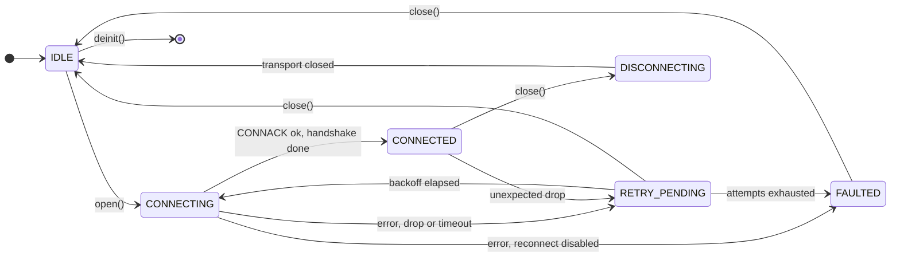
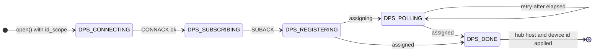
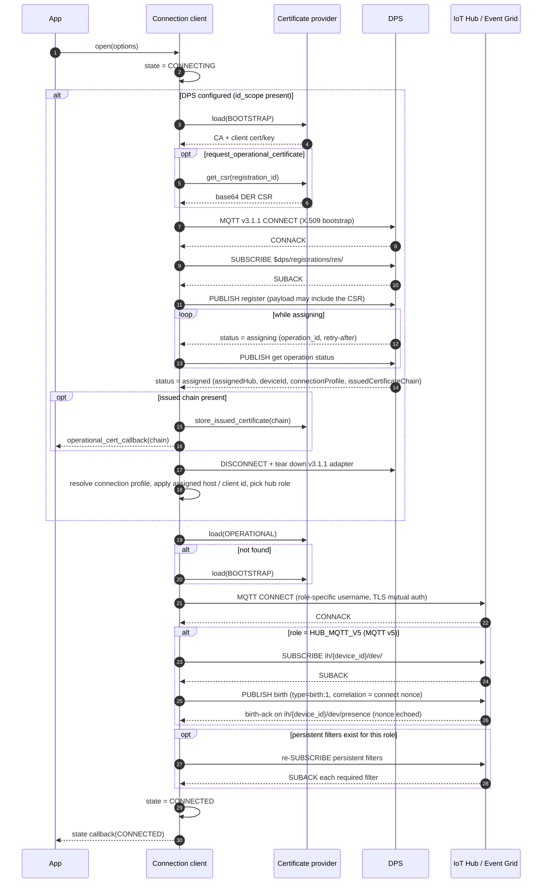
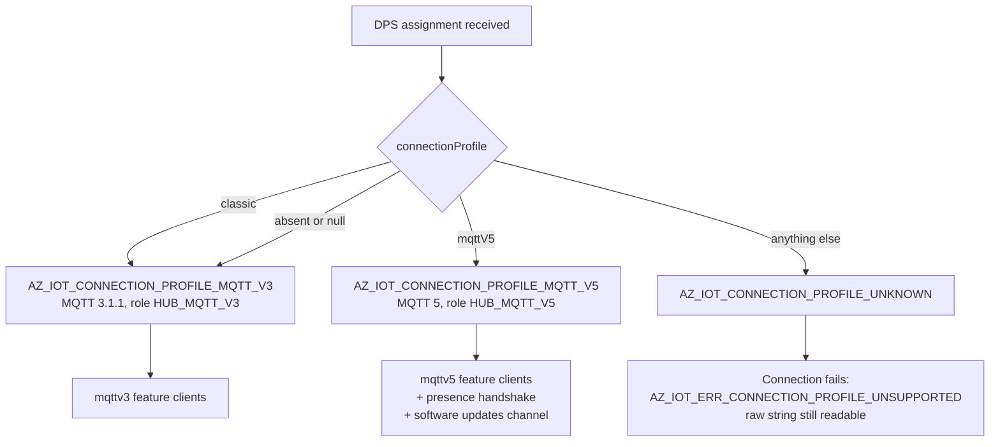
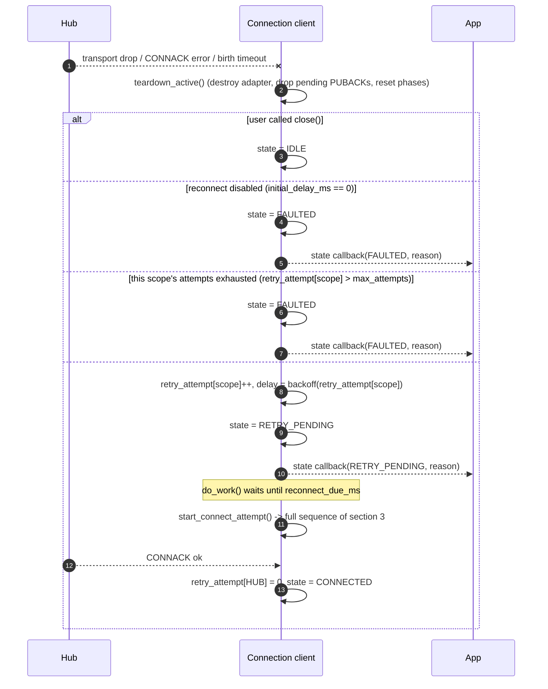
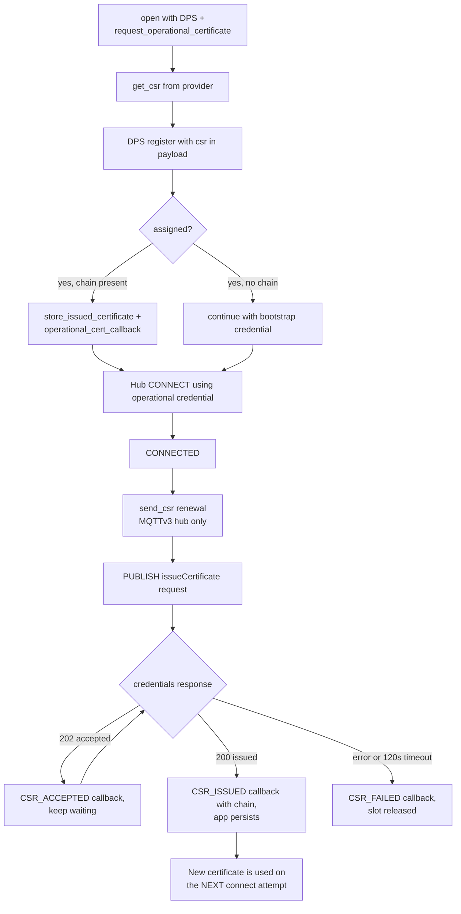
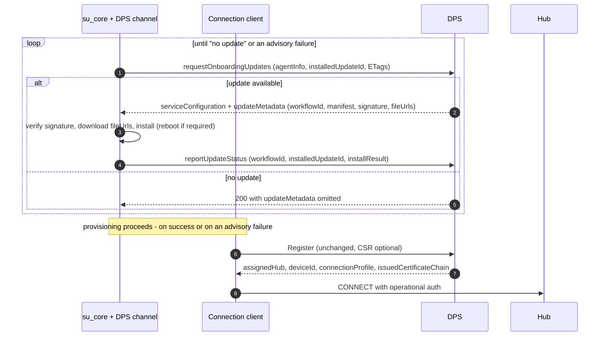
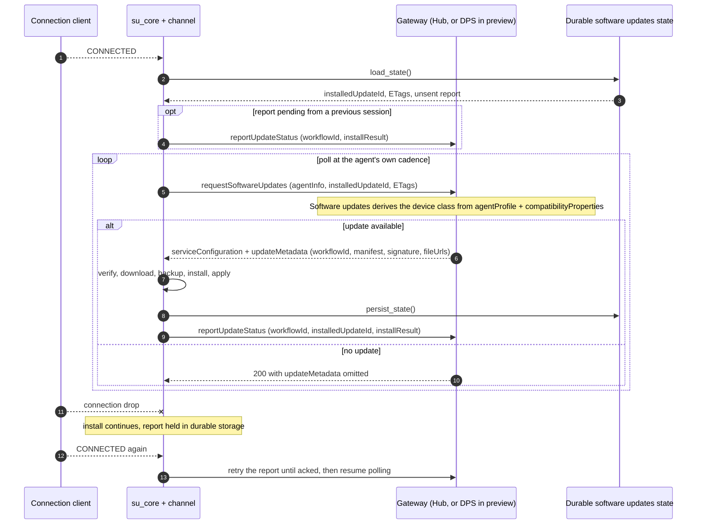
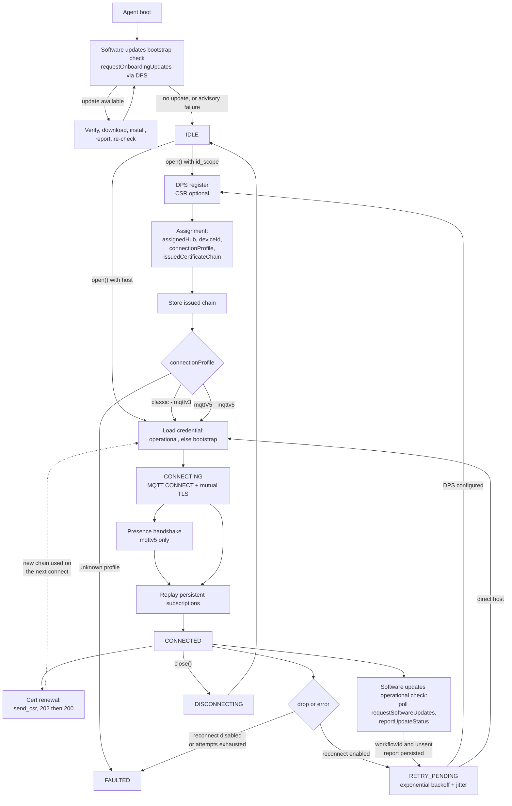

# Connection and Reconnection Lifecycle

Reference document for the connection lifecycle shared by the **C99** and **.NET** Azure IoT device
clients. The C SDK implementation in [c/src/core/connection_client.c](../../src/core/connection_client.c)
is the current source of truth; the .NET client is expected to expose the same observable states,
the same ordering guarantees, and the same retry semantics, even where the internal structure
differs.

Related documents:

- [architecture.md](../architecture.md) — overall layering and adapter model.
- [connection-c.md](connection-c.md) — the C realization, with its known gaps.
- [certificate-management.md](certificate-management.md) — CSR / operational certificate design.
- [connection-state-and-error-propagation.md](connection-state-and-error-propagation.md) — observer registry and status codes.
- [software-updates.md](software-updates.md) — the software updates device contract (the source for §7)
  and the client design.

### Status legend

This document describes the target lifecycle. Not all of it is coded yet, so every section is marked:

| Mark | Meaning |
| --- | --- |
| **[implemented]** | Present in `c/src` today and covered by tests. |
| **[partly implemented]** | Some of the section is in `c/src`; the gaps are listed in [connection-c.md](connection-c.md). |

---

## 1. Vocabulary

| Term | Meaning |
| --- | --- |
| **State** | User-visible connection lifecycle value (`az_iot_connection_state`). Reported through the state callback. |
| **Connection profile** | What the device is connected to, as declared by DPS: `classic` or `mqttV5` (`az_iot_connection_profile`). Not caller-settable. |
| **Generation** | The feature-client family selected by the profile: `mqttv3` (`classic`) or `mqttv5` (mqttV5). |
| **Role** | Which endpoint/protocol the current MQTT session targets (`az_iot_mqtt_role`): `DPS` (v3.1.1), `HUB_MQTT_V3` (v3.1.1), `HUB_MQTT_V5` (v5). |
| **Phase** | Internal sub-step inside a state — DPS phases and presence (birth) phases. Not user-visible. |
| **Provisioning** | Obtaining a hub assignment from DPS. |
| **Onboarding** | Everything that happens against the DPS gateway under *onboarding auth*: the bootstrap update check, the CSR, and registration itself. |
| **Renewal** | The recurring, post-provisioning counterpart under *operational auth*: certificate re-issuance and the periodic software update check. |
| **Bootstrap credential** | Initial device identity (`AZ_IOT_CRED_BOOTSTRAP`). |
| **Operational credential** | Certificate issued to the device via CSR (`AZ_IOT_CRED_OPERATIONAL`). |
| **Software updates channel** | The `az_iot_su_channel` vtable that carries update delivery and reporting, keeping `su_core` transport-independent. |

---

## 2. Top-level state machine **[implemented]**

States are defined in
[az_iot_connection_client.h](../../inc/azure/iot/az_iot_connection_client.h); transitions are all funneled
through the internal `set_state_to()` helper, which is also what raises the user state callback.



`FAULTED` is settled, not a dead end. The SDK never leaves it on its own -- `do_work()` does not
retry from there -- but `close()` is legal from it and returns the client to `IDLE`, from which
`open()` starts a fresh attempt with the configuration and the attached feature clients intact.
`open()` itself remains `IDLE`-only.

When DPS is configured the whole provisioning exchange happens **inside** the `CONNECTING` state, so
the application never sees an intermediate `CONNECTED` for the DPS session. The DPS progress is
tracked separately as a phase:



Any failure or drop in a DPS phase is handled by the same backoff path as a hub failure, and a
retry restarts provisioning from `DPS_CONNECTING`.

---

## 3. Full connect sequence **[implemented]**



Key ordering guarantees that both clients must honour:

1. `CONNECTED` is announced **after** the birth handshake (MQTTv5) and **after** every required
  persistent subscription has been SUBACKed, so a feature client never observes `CONNECTED` while
  its topic filters are missing. MQTTv5 feature delivery uses the single
  `ih/{device_id}/dev/#` presence wildcard; MQTTv3 feature filters and application custom topics
  use the persistent-subscription registry.

2. The DPS session is fully torn down before the hub session is created — they are never concurrent,
   and DPS always uses MQTT 3.1.1 even when the hub session uses v5.
3. The operational certificate is preferred over the bootstrap certificate on every connect attempt,
   including reconnects.
4. **The software updates bootstrap update check runs before `open()`, not inside it.** The agent drives the
   onboarding update call against the DPS gateway until the service reports no update, and only then
   does the connection client register. The check is **advisory**: if it fails, the device proceeds
   to register anyway. See [§7](#7-software-updates-onboarding-and-renewal-partly-implemented).
5. The DPS assignment is the single delivery point for everything the device learns about its
   placement: hub, device id, connection profile and issued certificate chain.

### 3.1 Egress: transport and proxy **[implemented]**

Both connects above — the DPS bootstrap connect and the hub connect — use the same egress
configuration, because a device that needs a proxy or WebSockets to reach the hub needs them to
reach DPS first.

| Option | Effect |
| --- | --- |
| `transport` | `TCP` (default) or `WEBSOCKET`. WebSockets carries MQTT inside a WebSocket on 443, for a network that passes only HTTP(S) ports. |
| `websocket_path` | Defaults to `/$iothub/websocket`, which is what IoT Hub and DPS expect. |
| `proxy` | Host, port and optional Basic credentials of an HTTP proxy. The connection is made with HTTP `CONNECT`, for both transports. |
| `port` | `0` derives the port from the transport: 8883 for TCP, 443 for WebSockets. An explicit value always wins. |

Two rules:

- **The proxy is a transport detail only.** TLS is negotiated with the broker *inside* the tunnel,
  so the proxy sees ciphertext, and chain and hostname validation are unchanged. The MQTT session,
  the identity and the reconnection policy are all unaffected.
- **An adapter that cannot honour the request must refuse it** with `AZ_IOT_ERR_NOT_SUPPORTED`.
  Connecting directly when a proxy was configured would bypass the egress control the caller
  selected, and connecting over TCP when WebSockets were selected would be blocked by the firewall
  the caller was working around; either would fail later and for the wrong reason.

Note for the Paho adapter: when `proxy` is left unset, Paho still falls back to the lowercase
`http_proxy` / `https_proxy` environment variables on its own (the uppercase spellings are ignored).
Set `proxy` to be explicit and independent of the environment.

Worked examples: [samples/unified/websockets](../../samples/unified/websockets/main.c) and
[samples/unified/proxy](../../samples/unified/proxy/main.c). Each is the `unified/telemetry` sample with
one of these options set, so the diff against it is exactly the feature.

### 3.2 Session terms per role **[implemented]**

Every CONNECT also carries the terms of the session it is opening. They are decided per session
role, in `resolve_session_options()` in `src/core/connection_client.c`, and the three roles do not
want the same thing.

| Role | MQTT | Clean Start / Clean Session | Session Expiry | Will | DISCONNECT reason |
| --- | --- | --- | --- | --- | --- |
| `DPS` | 3.1.1 | clean (`1`), not overridable | n/a | never | n/a |
| `HUB_MQTT_V3` | 3.1.1 | resume (`0`) by default | n/a | `opts.lwt`, if set | n/a |
| `HUB_MQTT_V5` | 5 | resume by default | `opts.session_expiry_seconds`, default 1 h | `opts.lwt`, if set | `0x04` when a Will is set, else `0x00` |

Both hub roles honour `opts.session_continuity` (`DEFAULT` / `RESUME` / `CLEAN`). DPS does not: the
provisioning service does not implement session persistence at all, so honouring a request for it
would promise something the service does not do.

Why each one:

- **DPS starts clean.** Provisioning does not support persistent sessions — it treats every session
  as non-persistent whatever the flag says — and the response filter is re-subscribed on every
  attempt. That reason is a property of the *service*, not of how long the session lives, so it is
  unaffected by any change to when the provisioning session is torn down: `clean_start` is only
  read at CONNECT, and it is inert at this service whenever it is read. A provisioning session that
  outlived registration, or ran alongside a hub session, would still take the same terms.
- **MQTTv3 resumes.** An MQTTv3 hub holds the device's *subscription* and its in-flight QoS 1 only
  for a session that is not clean. Connecting clean does not lose the hub's server-side C2D queue —
  that is delivered once the device re-subscribes — but it does discard the subscription and any
  in-flight delivery, so resuming is the cheaper default. This is also the behaviour the role
  already had before the terms were set explicitly.
- **MQTTv5 resumes, with an expiry.** Session continuity on this generation is a **transport
  efficiency choice, not a correctness one**: the backend never reads `clean_start` or
  `session_present`, the device publishes birth on every connection, and every feature protocol is
  correct even if each connect started a fresh session. What resuming buys is the broker's QoS 1
  redelivery across a transient drop and a re-subscribe saved. Both halves are required — a session
  asked to expire the instant the connection closes is gone before any reconnect could resume it —
  which is why the expiry is set rather than left at 0.

Four rules that hold everywhere:

- **A v3.1.1 broker never receives a v5-only property.** Session Expiry and Will Delay are MQTT 5
  CONNECT properties; a v3.1.1 CONNECT has no field to carry them, and the DISCONNECT reason code
  does not exist in 3.1.1 either.
- **The SDK sets no Will of its own.** `opts.lwt` is the application's, and defaults to none. The
  platform deliberately leaves the Will slot to the application: MQTT 5 allows exactly one Will per
  CONNECT, device presence is derived from broker-emitted connection lifecycle events rather than
  from a device-authored will message, and taking the slot would deny the application its own
  "device went away" signal. It is never put on a provisioning session, whatever that session's
  lifetime: nothing consumes a will published there.
- **`Session Present` drives no application decision.** It is reported to the application and
  carried on the birth message as a diagnostic. No feature client tears down state because of it.
  It is reported on both MQTT versions — an MQTTv3 session connects with Clean Session 0, so this
  is the only place the application learns whether the broker resumed it.
- A Will Delay only means something while the session is alive, so on `HUB_MQTT_V5` the session expiry
  is raised to cover a delay longer than it; MQTT 5 ends the delay at whichever comes first.

Session Expiry is an operational tuning knob. A long expiry suits a rarely-connected, low-traffic
device; a shorter one suits an always-connected device receiving heavy traffic, whose disconnected
session queue (bounded at 100 messages / 1 MB, and destroyed entirely on overflow) would otherwise
fill. The default is one hour, which matches the broker namespace default; the namespace maximum is
eight hours and the broker clamps anything above it.

---

## 4. Connection profile selection **[implemented]**

The profile is what DPS says the device landed on. It is **reported, never selected** — there is no
caller-facing knob, and falling back from one profile to another is application logic, not SDK
behaviour.



| Wire value | Enum | MQTT | Generation |
| --- | --- | --- | --- |
| `"classic"`, absent, or `null` | `AZ_IOT_CONNECTION_PROFILE_MQTT_V3` | 3.1.1 | MQTTv3 |
| `"mqttV5"` | `AZ_IOT_CONNECTION_PROFILE_MQTT_V5` | 5 | MQTTv5 |
| anything else | `AZ_IOT_CONNECTION_PROFILE_UNKNOWN` | — | connection fails |

Rules both clients must implement:

- `connectionProfile` is a `readOnly` **string** on `DeviceRegistrationResult`, delivered alongside
  `assignedHub`, `deviceId` and `issuedCertificateChain`. There is no numeric `hub_version` on the wire.
- It is an **extensible union**, so the raw string must be preserved verbatim
  (`az_iot_hub_profile.connection_profile_raw`) and not collapsed into a closed enum. A value newer
  than the SDK still has to be loggable.
- An unrecognised profile **fails the connection** with `AZ_IOT_ERR_CONNECTION_PROFILE_UNSUPPORTED`.
  The SDK will not guess which MQTT version to speak.
- The profile is readable only once `CONNECTED`; before that
  `az_iot_connection_client_get_hub_profile()` returns `AZ_IOT_ERR_NOT_CONNECTED`.
- A feature client from the wrong generation is refused with `AZ_IOT_ERR_HUB_GENERATION_MISMATCH`.
  Because of this, feature clients must be created **after** the connection is open.

> The SDK now sends DPS `2026-11-02-preview` in the CONNECT username for every DPS session,
> including CSR and provision-only update sessions. This allows DPS to return `connectionProfile`;
> absent/null values still resolve to `classic`.
>
> **Open:** whether a reconnect can change the generation. If DPS can reassign a device mid-life,
> every feature client the application holds becomes invalid at that moment and it must be told.

---

## 5. Reconnection **[implemented]**



**The retry ladder is per scope.** `retry_attempt[]` is indexed by
`az_iot_connection_scope` (`DPS`, `HUB`), and `max_attempts` is a budget for **each** ladder rather
than one shared across both. So a device may spend its whole hub budget and still get a full set of
registration attempts, and a registration that follows an exhausted hub ladder starts again at
`initial_delay_ms` instead of inheriting the hub's capped backoff.

Which ladder a retry climbs is the scope of the **next attempt**, which is not always the scope of
the failure: a hub failure retried as a re-registration (threshold crossed, or
a CONNACK refusal in `REPROVISION` mode) climbs a DPS ladder. A hub identity refusal climbs a third,
identity ladder on `opts.identity_recovery` (see [connection-c.md §5.2](connection-c.md#52-what-triggers-a-reconnect)).

Reset points differ per ladder:

| Event | Effect |
| --- | --- |
| DPS registration succeeds | `DPS` and `HUB` reset; identity ladder untouched |
| Hub CONNACK succeeds (birth-ack on MQTTv5) | `HUB` resets; `DPS` untouched |
| `HUB:CONNECTED` | identity ladder resets |
| `dps.max_hub_connect_attempts_before_reprovision` crossed | `DPS` resets, so the first registration attempt waits `initial_delay_ms` |
| `open()` / `close()` | all ladders reset |

### 5.1 Backoff policy

`az_iot_retry_policy` in
[az_iot_retry_policy.h](../../inc/azure/iot/az_iot_retry_policy.h), computed by
`az_iot_retry_policy__delay_ms()` in [retry_policy.c](../../src/core/retry_policy.c):

```text
base   = min(max_delay_ms, initial_delay_ms << min(attempt - 1, 30))
jitter = uniform(-jitter_pct%, +jitter_pct%) * base
delay  = clamp(base + jitter, 1, UINT32_MAX)
```

| Field | Default | Notes |
| --- | --- | --- |
| `initial_delay_ms` | 1000 | `0` disables automatic reconnect entirely. |
| `max_delay_ms` | 60000 | Cap for the exponential term only. Jitter varies around it, so a delay may exceed it by up to `jitter_pct`; clamping the jittered result would put half of all retries on exactly this value once the ladder reached the cap. |
| `max_attempts` | 0 | `0` means retry forever. |
| `jitter_pct` | 20 | Symmetric randomization, seeded from the monotonic clock. |

The shift is clamped at 30 to avoid 32-bit overflow. The attempt counter resets to zero on every
successful CONNACK.

### 5.2 What triggers a reconnect

- CONNACK with a non-success status.
- Unexpected transport disconnect or adapter error while `CONNECTING` or `CONNECTED`.
- Any failure during a DPS phase (a reconnect restarts provisioning from the beginning).
- MQTTv5 birth-ack timeout (60 s per handshake step).

A user-initiated `close()` never triggers a reconnect: it sets an internal `user_close` flag that is
checked before backoff is scheduled.

### 5.3 What is preserved across a reconnect

| Item | Preserved | Behaviour |
| --- | --- | --- |
| Persistent subscriptions | Yes | Re-issued on reconnect. Every required filter must be SUBACKed before `CONNECTED`; a missing SUBACK expires on the configured deadline and retries as a transient failure. |
| Assigned hub host / device id | Yes | Cached after the first DPS assignment. |
| Connection profile | Yes | Re-resolved from the new assignment; a change invalidates held feature clients (open question, §4). |
| Operational certificate | Yes | Owned by the certificate provider, reloaded on each attempt. |
| Software updates workflow state | Yes | Owned by `su_core` and persisted, so an install survives a reconnect and a reboot. |
| Reconnect attempt counter | Reset on success | Incremented per failed attempt. |
| In-flight QoS 1 PUBACKs | No | Packet ids belong to the destroyed adapter; callers must re-send. |
| Twin GET/PATCH, method responses, telemetry in flight | No | Feature clients must re-issue. |
| MQTTv3 desired-property patches sent while disconnected | No | IoT Hub does not queue them, and the SDK does not fetch the twin on reconnect. The application calls `az_iot_mqttv3_twin_client_get()` if it needs the current desired state. |
| Software updates status report not yet acked | Yes | Held in durable storage and retried until acked; idempotent on `workflowId`. |
| Presence (birth) phase | No | Restarted with a freshly generated nonce. |
| DPS phase | No | Restarted from `CONNECTING` if DPS is configured. |
| In-flight CSR operation | No | Abandoned; the callback fires with a failure/timeout result. |

---

## 6. Certificate management: onboarding and renewal **[implemented]**

Two distinct issuance paths exist; both end with the certificate provider owning the operational
credential, and neither forces an immediate reconnect.



Renewal topics (MQTTv3 hub):

| Direction | Topic |
| --- | --- |
| Publish | `$iothub/credentials/POST/issueCertificate/?$rid={request_id}` |
| Subscribe | `$iothub/credentials/res/#` |
| Response | `$iothub/credentials/res/{status}/{request_id}` |

Rules that apply to both clients:

- Only one CSR operation may be in flight; a second request fails fast with a *busy* result.
- The issued chain is delivered leaf-first as base64 DER and is only valid for the duration of the
  callback — the application must copy or persist it.
- A successful renewal does **not** tear down the live session. The new credential takes effect on
  the next connect, whether that is a reconnect or an explicit reopen.
- At connect time the provider is asked for `OPERATIONAL` first and falls back to `BOOTSTRAP` when
  the operational credential is absent or uninitialized.
- Every DPS and hub connection uses TLS. `open()` refuses a client with no `certificate_provider`
  (`AZ_IOT_ERR_CREDENTIAL_INCOMPLETE`), and a connect attempt whose `load()` fails fails with the
  provider's error instead of connecting in plaintext. From `open()`, `open()` returns that error;
  on a reconnect, the attempt is retried under the reconnection policy whatever the error (its
  classification is reported, not acted on).
- CSR-based DPS enrollment uses the `2026-11-02-preview` DPS API version and requires a
  caller-provided CSR payload buffer of at least `AZ_IOT_CSR_PAYLOAD_BUFFER_MIN` bytes.

---

## 7. Software updates: onboarding and renewal **[partly implemented]**

Software updates is layered into a transport-independent **`su_core`** —
manifest v5 parsing, JWS/SJWK verification, root keys, SHA-256 integrity, the
download/backup/install/apply state machine, and reboot/resume persistence — plus an
**`az_iot_su_channel`** vtable carrying delivery and reporting.

Software updates is a **device-initiated pull protocol**. The agent calls an updating operation on a
gateway it already talks to, reusing the credential it already has; the gateway is an authenticated
pass-through to the update service. The device needs no update-specific credential, and there is no
subscription and no unsolicited offer.

| Phase | Gateway | Operation (on the wire) |
| --- | --- | --- |
| First-time / bootstrap (**before** provisioning) | DPS | `requestOnboardingUpdates` |
| Regular / operational (**after** provisioning) | DPS | `requestSoftwareUpdates` |
| Reporting, either phase | same gateway as the fetch | `reportUpdateStatus` |

All three are requests under the device's own registration on the gateway's device endpoint; see
[software-updates.md](software-updates.md#2-device-contract) for the request and response shapes.

The device selects onboarding vs regular **by which operation it calls**; the gateway does not infer
or validate the choice.

> In preview, DPS fronts both the bootstrap and the operational flow, using the existing DPS device
> credential (X.509). The device contract does not depend on the gateway. Treat the gateway as a
> channel parameter, not a constant.

### 7.1 Onboarding — bootstrap update, before provisioning

The critical ordering fact for this document: **the bootstrap update check happens before the device
registers.** The agent, not the connection client, drives it. On the happy path `open()` waits until
the check reports no update, so several updates can chain before provisioning.

The check is **advisory and must never block provisioning.** If it errors, times out, or the account
is not linked, the device proceeds to register anyway.



- The loop is genuine: after installing a bootstrap update the agent re-checks, because a bootstrap
  deployment can chain.
- Bootstrap progress is stored **in the bootstrap update job**, not on the device's ADR attributes —
  the device resource does not exist yet.
- Trust comes from the **root-key package** at `serviceConfiguration.rootKeyDownloadUrl` returned by
  the same call. Account scoping (`accountId` bound into the manifest signature) is **not yet
  supported** — DPS returns no `accountId`, so the device verifies provenance-from-Device-Update but not
  account scoping. Base signature validation stays required.
- `fileUrls` are **not** covered by the signed manifest; payloads are downloaded straight from blob
  storage and integrity comes from the per-file hashes inside the manifest.
- Bootstrap orchestration is entirely the agent's responsibility. DPS does **not**
  enforce that a device is on a given update version before provisioning it.

### 7.2 Renewal — operational update check, after `CONNECTED`



`installResult` carries the outcome, its failure origin and the hex
`extendedResultCodes` list. In-progress reports omit `stepResults`; terminal
reports include complete per-step outcomes when steps are available — see
[software-updates.md](software-updates.md#2-device-contract) for the field-level shape.

### 7.3 Rules both clients must implement

- **Poll, never wait.** The agent owns the cadence. A missed poll is not an error and there is no
  offer to lose, which is why a reconnect needs no replay of software updates subscriptions — there are none.
- **`workflowId` is the correlation key.** It arrives in `updateMetadata` and is echoed on the
  report. Reporting is **idempotent on `workflowId` alone**; a conflicting terminal result for the
  same id is rejected as a conflict.
- **The device is the sole retrier.** The gateway fails fast with one attempt per hop. The agent
  honours `Retry-After` on throttling and retries `reportUpdateStatus` until it is acked — a
  report is a durable write and must not be lost.
- **Drive behaviour from the machine-readable error code, never the HTTP status.** A stale
  `agentInfoEtag` means resend the full `agentInfo`; a stale `serviceConfigEtag` means re-ask without
  it; an unlinked update account means "no update service configured", which is not a failure.
- **"No update" is a success.** It is a 200 with the update metadata omitted, not an error.
- **Software updates never drives the connection.** It does not open, close, or force a reconnect. It does
  sequence ahead of the *first* `open()`, via the advisory bootstrap check in §7.1.
- **Compatibility properties are opaque key/value pairs** (1–5) reported by the agent alongside an
  opaque `agentProfile`; the service combines them into a device class. The agent assigns them no
  meaning.
- **The gateway is a channel parameter.** Bootstrap always uses DPS; operational currently uses DPS
  too. The service contract binds software updates to the updating operations, not to a connection
  profile.

---

## 8. Combined reference diagram

One picture of the whole device lifecycle: connection and reconnection, connection-profile selection,
certificate management (onboarding + renewal) and software updates (onboarding + renewal). Dotted edges are
deferred effects — they do not happen inline.



Reading it as four overlapping concerns:

| Concern | Onboarding (DPS gateway, onboarding auth) | Renewal (post-`CONNECTED`, operational auth) |
| --- | --- | --- |
| **Certificates** | CSR in the registration, issued chain in the assignment | `send_csr` over the hub; new chain applies on the next connect |
| **Software updates** | `requestOnboardingUpdates` loop **before** registration, advisory | Polled `requestSoftwareUpdates` / `reportUpdateStatus` (currently over DPS) |
| **Connection profile** | Declared in the assignment; selects MQTT version and generation | Re-resolved on every reconnect that goes through DPS |
| **Connection** | DPS phases inside `CONNECTING` | Backoff-driven reconnect replays the whole path |

The two onboarding concerns are **not** symmetric, and that asymmetry is the thing to remember:
the CSR travels *inside* registration, while the software updates bootstrap check happens *before* it and must
complete first.

---

## 9. Implementation index (C SDK)

| Topic | Location | Status |
| --- | --- | --- |
| State enum, policy, options | [az_iot_connection_client.h](../../inc/azure/iot/az_iot_connection_client.h) | implemented |
| State transitions, connect attempt, event handling | [connection_client.c](../../src/core/connection_client.c) | implemented |
| Backoff computation and defaults | [retry_policy.c](../../src/core/retry_policy.c) | implemented |
| Certificate provider contract | [az_iot_certificate_provider.h](../../inc/azure/iot/az_iot_certificate_provider.h) | implemented |
| Managed OpenSSL provider | [az_iot_certificate_provider_managed.c](../../adapters/cert_openssl/az_iot_certificate_provider_managed.c) | implemented |
| Connection profile enum, `az_iot_hub_profile`, `get_hub_profile()` | [az_iot_connection_client.h](../../inc/azure/iot/az_iot_connection_client.h) | implemented |
| `az_iot_su_channel` vtable, DPS channel | [az_iot_su.h](../../inc/azure/iot/az_iot_su.h), [su_channel_dps.c](../../src/features/su/su_channel_dps.c) | implemented |
| Software updates engine internals reused by software updates | [c/src/features/su](../../src/features/su) | implemented |
| Software updates device contract | [software-updates.md](software-updates.md#2-device-contract), [su_protocol.c](../../src/features/su/su_protocol.c) | implemented over the DPS gateway — DPS fronts both flows |
