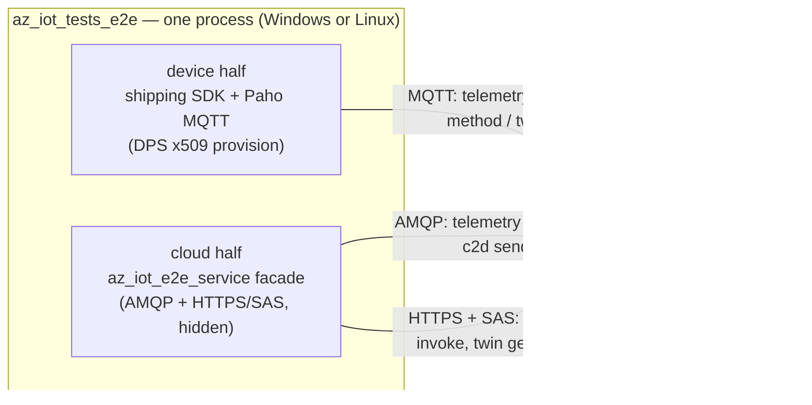

# End-to-end (e2e) tests — C SDK

This document describes the end-to-end test infrastructure for the C SDK
(`c/`). E2E tests validate real scenarios against a **live Azure IoT Hub / DPS**
instance, complementing the in-memory unit tests and the broker-gated
conformance suite.

> Scope: this infrastructure covers the C SDK only. It deliberately reuses the
> same Azure provisioning script that the dotnet CI uses. The service (cloud)
> side of each scenario is a small **in-process C facade** — there is no dotnet
> harness and no subprocess.

---

## Goals & constraints

The infrastructure was designed to satisfy these requirements:

- **SOLID — no flaky tests.** The suite is a real gate (missing cloud resources
  fail loudly, never a silent skip), uses unique per-run correlation markers,
  starts the telemetry watcher *before* the send, and always tears down its
  resource group.
- **As parallel as possible.** The OS matrix legs run concurrently, each in its
  own isolated resource group.
- **Long-running suites out of PRs.** Software updates e2e needs a DPS, ADR namespace and
  Device Update instance linked together, so it runs in its own workflow, not on PRs.
- **Cross-platform.** Every scenario runs on both Windows and Linux hosts (software updates e2e: Linux only).

---

## Architecture

Every scenario runs **in a single process**: one native cmocka test executable
(`az_iot_tests_e2e`) plays *both* halves and drives them cooperatively. There is
no dotnet, no subprocess, and no cross-process handshake.



The test loop interleaves `az_iot_connection_client_do_work` (device) with the
service facade's pump/poll so neither side blocks the other. Everything is
single-threaded and non-blocking.

### Device half — the shipping SDK

The device is the public SDK over the Paho adapter, connected exactly like a
real device: **DPS provisioning with an X.509 individual enrollment**
(`dps.id_scope` set → the connection client provisions internally, then connects to the assigned hub). Both Paho MQTT v3.1.1 and v5
factories are registered. The connect flow + all four scenarios live in
[`e2e_scenarios_test.c`](../../tests/e2e/tests/e2e_scenarios_test.c); the connect
is done once for the whole suite via cmocka's group setup.

Device configuration is environment-driven (materialized to files by CI):

| Env var | Meaning |
| --- | --- |
| `AZ_IOT_DPS_ID_SCOPE` | DPS id scope (required) |
| `AZ_IOT_DPS_REGISTRATION_ID` | registration id; also the **device id** the cloud half targets (required) |
| `AZ_IOT_CLIENT_CERT` | path to the device X.509 cert PEM (required) |
| `AZ_IOT_CLIENT_KEY` | path to the device X.509 private key PEM (required) |
| `AZ_IOT_TRUSTED_CA` | path to a CA bundle PEM for TLS server auth (required) |
| `AZ_IOT_DPS_GLOBAL_ENDPOINT` | DPS global endpoint override (optional) |

### Cloud half — the `az_iot_e2e_service` facade

[`az_iot_e2e_service.h`](../../tests/e2e/service/az_iot_e2e_service.h) is a
plain-C facade that lets the test act as the cloud side **without exposing the
transport it uses**. All of the vendored AMQP (`az_amqp`) and HTTPS/SAS machinery
is confined to its implementation and linked **PRIVATE**, so a test translation
unit can never include an AMQP header. This keeps the SDK's MQTT-only device
charter intact: AMQP lives strictly behind this test boundary.

- **Telemetry** (AMQP receive): watches the Event Hub-compatible endpoint.
- **C2D** (AMQP send): sends a cloud-to-device message and awaits acceptance.
- **Direct method / twin** (HTTPS + SAS): a small pumpable HTTP/1.1 client drives
  the IoT Hub REST API so it interleaves with the device's pump.

Service configuration (set by the provisioning config script):

| Env var | Meaning |
| --- | --- |
| `IOTHUB_CONNECTION_STRING` | IoT Hub service policy connection string (c2d / method / twin) |
| `IOTHUB_EVENTHUB_CONNECTION_STRING` | Event Hub-compatible endpoint connection string (telemetry) |
| `IOTHUB_EVENTHUB_LISTEN_NAME` | Event Hub entity name (optional; else from the connection string) |
| `IOTHUB_EVENTHUB_PARTITION_COUNT` | partitions to watch (optional; default 4) |
| `IOTHUB_EVENTHUB_CONSUMER_GROUP` | consumer group to read (optional; default `$Default`) |

The telemetry watcher only receives messages enqueued from 5 minutes before it
starts (an Event Hubs enqueued-time filter), so a reused hub's backlog is skipped.

SAS tokens are built with OpenSSL (HMAC-SHA256 + base64) on both platforms. Note
the two key conventions the facade handles: Event Hubs signs with the **raw** key
string, while IoT Hub **base64-decodes** the key first.

### Scenarios

The suite runs four scenarios in one process, each with a unique per-run
correlation marker so a fresh hub never confuses stale data:

1. **telemetry** — the device publishes a marked message; the cloud half observes
   it on the Event Hub endpoint. The watcher starts *before* the send (so nothing
   is missed) and is released afterwards.
2. **c2d** — the cloud sends a marked message; the device's C2D handler receives
   and matches it.
3. **direct method** — the cloud invokes `echo`; the device echoes the payload
   back with `200`; the cloud asserts the status and body.
4. **twin** — the cloud patches a desired property (the device observes it), then
   the device reports a property (the cloud reads it back via a twin GET).

> The Windows reference transport keeps a single TLS connection at a time, so the
> telemetry watcher is closed before the c2d/method/twin scenarios open theirs.
> The device uses Paho's own independent TLS stack, so the two never collide.

---

## Build & CMake wiring

- CMake option `AZ_IOT_BUILD_E2E` (default **OFF**) in
  [`c/cmake/az_iot_options.cmake`](../../cmake/az_iot_options.cmake).
- [`c/tests/CMakeLists.txt`](../../tests/CMakeLists.txt) adds the `e2e`
  subdirectory only when `AZ_IOT_BUILD_E2E` **and** `AZ_IOT_WITH_PAHO` are ON
  (the device half needs a real MQTT adapter).
- [`c/tests/e2e/CMakeLists.txt`](../../tests/e2e/CMakeLists.txt) builds the
  vendored `az_amqp` (under `c/tests/deps/amqp`, test-only), the
  `az_iot_e2e_service` facade, and the `az_iot_tests_e2e` cmocka executable
  (registered with CTest as `az_iot_tests_e2e`, so `ctest -R e2e` selects it).

Build & run locally (needs provisioned Azure + the env vars above):

```pwsh
# from c/  (Windows needs a VS dev shell; Linux needs ninja)
cmake --preset windows-msvc-debug -DAZ_IOT_BUILD_E2E=ON -DAZ_IOT_WITH_PAHO=ON
cmake --build --preset windows-msvc-debug --config Debug --target az_iot_tests_e2e
ctest --test-dir build/windows-msvc-debug -C Debug -R e2e --output-on-failure
```

---

## CI workflow

[`.github/workflows/ci-c-e2e.yml`](../../../.github/workflows/ci-c-e2e.yml)

### Triggers

- `pull_request` touching `c/**` or `common/**` (fast scenarios)
- `push` to `main`
- nightly `schedule` (cron `0 11 * * *`, 4am PST)
- `workflow_dispatch`

### Authentication

OIDC via `azure/login@v2`, using repo secrets `AZURE_CLIENT_ID`,
`AZURE_TENANT_ID`, `AZURE_SUBSCRIPTION_ID` (same secrets as the dotnet CI). The
job grants `permissions: id-token: write`.

### Provisioning (and guaranteed teardown)

Each job downloads the shared
[`iot-sdks-e2e-fx`](https://github.com/Azure/iot-sdks-e2e-fx) script and:

1. The workflow computes the RG name from the run itself
   (`CSDKE2E<Flavor>-<run_id>-<run_attempt>`, a workflow-level `env`) and passes
   it to the provision action as `rg-name`.
2. `New-AzIotTestEnvironment` → provisions IoT Hub + DPS + enrollments.
3. `New-AzIotCSDKE2ETestConfig -Target powershell` → emits an env-var script
   that is dot-sourced.
4. Materializes the device X.509 material to files (decodes the base64 PEMs and
   builds a CA bundle), maps the DPS config onto the `AZ_IOT_*` vars, then runs
   `ctest -R e2e`.
5. **Always** (`if: always()`) deletes the resource group (`az group delete
   --no-wait`).

The RG name is deliberately *derived from the run* rather than published as a
setup job output: **a cancelled job does not propagate its `outputs`**, so a
teardown reading `needs.setup.outputs.rg` would receive an empty string and
delete nothing while the group stayed behind — which is how superseded
(`cancel-in-progress`) runs used to leak `CSDKE2E*` groups. Because teardown
recomputes the same name, it cleans up even when `setup` is cancelled or times
out; `destroy-e2e-resources` no-ops when the group was never created.

[`cleanup-e2e-resources.yml`](../../../.github/workflows/cleanup-e2e-resources.yml)
is the nightly backstop: it reaps any `CSDKE2E*` (C) or `DotnetE2ETestPipeline-*`
(dotnet) group older than 6 h (via `Remove-LeftoverAzureResourceGroups`),
covering what teardown structurally cannot — an asynchronous `--no-wait` delete
failure, or a runner that dies before teardown.

### Jobs

| Job | Runs on | Purpose |
| --- | --- | --- |
| `setup` | ubuntu | provisions one resource group (IoT Hub + DPS) via the shared `provision-e2e-resources` action and publishes the test-config artifact |
| `test` | ubuntu + windows (matrix) | builds `az_iot_tests_e2e`, materializes the device X.509 material, and runs `ctest -R e2e` |
| `teardown` | ubuntu | `always()` deletes the resource group via `destroy-e2e-resources`, using the run-derived name (not a `setup` output) |

The two `test` legs share the one resource group provisioned by `setup`, and
`teardown` runs even if a leg fails — or if the run is cancelled — so resources
are never leaked.

**Shared environment (temporary, opt-in).** When repository variable
`E2E_SHARED_ID_SCOPE` is set, pull request runs skip `setup`/`teardown` and use a
long-lived IoT Hub + DPS. Each leg issues its own device certificate from the DPS
X.509 enrollment group's CA ([`c/eng/e2e-shared-device.ps1`](../../eng/e2e-shared-device.ps1)),
so there is nothing to clean up. Inputs are repository secrets
`E2E_SHARED_GROUP_CA`, `E2E_SHARED_IOTHUB_CS` and `E2E_SHARED_EVENTHUB_CS`
(`service` policy only). The hub needs consumer groups `e2e-0`..`e2e-9` and file
upload with notifications. Push and nightly runs always provision.

[`ci-c-e2e-csr.yml`](../../../.github/workflows/ci-c-e2e-csr.yml) has the same opt-in,
keyed on `E2E_CSR_SHARED_ID_SCOPE`. It needs its own certificate-management environment
(ADR-linked hub and DPS; a DPS without a managed identity cannot be linked), so it
cannot reuse the one above. Each run issues a bootstrap device with
`e2e-shared-device.ps1 -Csr` from secret `E2E_CSR_SHARED_GROUP_CA` (the group's issuing
CA certificate and key, then its root). `E2E_CSR_SHARED_DPS_HOST` optionally sets the DPS
device endpoint.

> **Software updates e2e** runs in its own workflow
> ([`ci-c-e2e-adu.yml`](../../../.github/workflows/ci-c-e2e-adu.yml), Linux, manual dispatch
> until its environment exists). See [Software updates e2e](#software-updates-e2e).

---

## Software updates e2e

Two suites, built with `-DAZ_IOT_BUILD_E2E_SU=ON` (not on Windows) and selected by
`ctest -R e2e_su`. Both run the shipping SDK over Paho and X.509 against the real service.

| Suite | What it drives |
| --- | --- |
| `az_iot_tests_e2e_su` (`e2e_su_test.c`) | The DPS channel with no update offered: onboarding check, hold release and registration, ETag storage, unknown-workflow report. |
| `az_iot_tests_e2e_su_offer` (`e2e_su_offer_test.c`) | Offered updates through `az_iot_su_client`: OpenSSL crypto, Microsoft plus test root keys, real download (libcurl) and hash; install/apply recorded, failures injected. A spy around the channel records each report and the service's verdict. |

Offered-update scenarios:

| Scenario | Offer |
| --- | --- |
| real update downloaded, verified, installed, reported SUCCEEDED | `AZ_IOT_E2E_SU_OFFER_MODEL` |
| identical terminal report accepted; conflicting one gets 409000 `REPORT_CONFLICT` | same |
| workflow offered again after its terminal report; identical re-report accepted | same |
| incompatible device offered nothing | none |
| install failure rolled back, reported FAILED | `AZ_IOT_E2E_SU_OFFER_MODEL_INSTALL_FAILURE` |
| already installed, reported SKIPPED | `AZ_IOT_E2E_SU_OFFER_MODEL_ALREADY_INSTALLED` |
| manifest verified against the wrong keys, reported FAILED | `AZ_IOT_E2E_SU_OFFER_MODEL_UNTRUSTED` |

The device identity is fixed by its certificate, so offers are told apart by compatibility:
each is an update compatible only with `AZ_IOT_E2E_SU_OFFER_MANUFACTURER` and its model, with
its own Azure Device Registry `OnboardingUpdate` job.
[`scripts/SuE2E.psm1`](../../tests/e2e/scripts/SuE2E.psm1) stages them (`New-SuE2EOffers`),
checks each job's per-device result (`Test-SuE2EOffers`) and deletes them
(`Remove-SuE2EOffers`).

Every variable is required; a missing one fails the suite or the scenario that needs it.

| Env var | Meaning |
| --- | --- |
| `AZ_IOT_E2E_SU_DPS_HOST` | DPS global endpoint |
| `AZ_IOT_E2E_SU_ID_SCOPE` | DPS id scope |
| `AZ_IOT_E2E_SU_REG_ID` | registration id the certificate carries |
| `AZ_IOT_E2E_SU_CERT` / `_KEY` | device certificate and key PEM paths |
| `AZ_IOT_E2E_SU_TRUSTED_CA` | CA bundle PEM path |
| `AZ_IOT_E2E_SU_OFFER_*` | offers, as above (set by `New-SuE2EOffers`) |

`https_proxy`, when set, is used for the MQTT connection; libcurl reads it as well.

Measured against the service:

- A workflow is offered again after its terminal report.
- Re-sending the identical terminal report is accepted.
- A different terminal outcome for the same workflow is rejected with 409000 `REPORT_CONFLICT`.
  A SKIPPED report after SUCCEEDED was accepted, and a later SUCCEEDED was still accepted.

Placeholders (`E2E-PLACEHOLDER`) mark what is not done: the workflow's environment and
triggers, test root keys pinned in `e2e_su_test_roots.c` instead of fetched at run time, the job
status expected for a SKIPPED report, the run lookup for a continuous onboarding job, and
scenarios for the operational route, multi-step updates and reboot/resume.

---

## Conventions & gotchas

- **Always a real gate, never a skip.** The suite connects the device and
  creates the service facade in cmocka's group setup; if any prerequisite (env
  var, cloud resource, device connect) is missing, group setup returns non-zero
  and the whole suite **fails** with an actionable message. These tests run only
  against real Azure resources (the ci-c-e2e pipeline, or a deliberate local run
  with the e2e-fx config dot-sourced), so there is no "skipped but green" path to
  hide a broken setup.
- **CA bundle without downloads.** Linux uses the OpenSSL system bundle; Windows
  exports the machine `Root` store. Avoid fetching roots over the network.
- **One TLS connection at a time (Windows).** The vendored reference transport
  keeps a single Schannel TLS slot, so the service facade closes the telemetry
  watcher before opening the c2d/method/twin connections.
- **Resource quotas are hard limits.** Provisioning per matrix leg keeps tests
  isolated but multiplies resource usage; keep the matrix lean and always delete
  the RG. Software updates is intentionally kept off PRs for this reason.

---

## Adding a new scenario

1. **Device side:** in [`e2e_scenarios_test.c`](../../tests/e2e/tests/e2e_scenarios_test.c)
   add a `test_*` function (and register it in the cmocka table). Reuse the
   already-connected device from the shared fixture; interleave
   `az_iot_connection_client_do_work` with the service pump until the assertion
   holds or a bounded deadline expires.
2. **Service side:** if the scenario needs a new cloud operation, add it to the
   [`az_iot_e2e_service`](../../tests/e2e/service/az_iot_e2e_service.h) facade
   (keep all `az_amqp` / HTTP usage inside the `service/*.c` files so tests stay
   transport-agnostic).
3. **Distinct devices for parallelism:** the config generator currently emits a
   single DPS x509 individual enrollment. To run scenarios against different
   devices, provision more via
   `New-AzIotTestEnvironment -DpsX509IndividualEnrollments <N>` and thread the
   extra registration ids/material through.
