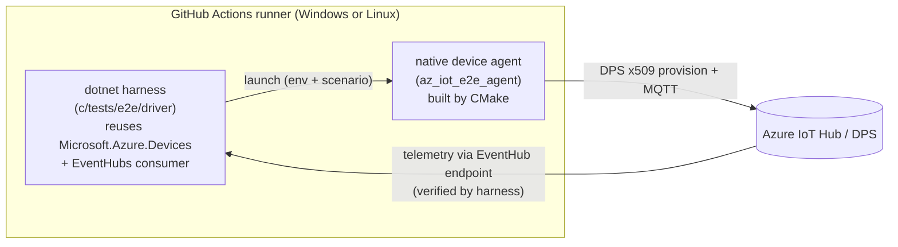

# End-to-end (e2e) tests — C SDK

This document describes the end-to-end test infrastructure for the C SDK
(`c/`). E2E tests validate real scenarios against a **live Azure IoT Hub / DPS**
instance, complementing the in-memory unit tests and the broker-gated
conformance suite.

> Scope: this infrastructure covers the C SDK only. It deliberately reuses the
> same Azure provisioning script that the dotnet CI uses, and the dotnet IoT Hub
> **service** client for the service side of each scenario.

---

## Goals & constraints

The infrastructure was designed to satisfy these requirements:

- **SOLID — no flaky tests.** Tests skip (never false-fail) when cloud
  resources are absent, use unique per-run correlation ids, attach event
  consumers *before* the slow device connect, and always tear down their
  resource group.
- **As parallel as possible.** The OS matrix legs run concurrently, each in its
  own isolated resource group.
- **Long-running suites out of PRs.** The Device Update (ADU) service takes
  ~25 minutes to provision, so ADU e2e is excluded from normal PRs and runs on a
  fixed nightly schedule / manual dispatch — *unless* a PR changes ADU code
  paths, in which case it is opted in automatically.
- **Cross-platform.** Every scenario runs on both Windows and Linux hosts.

---

## Architecture

An e2e scenario has two halves that run as separate processes and coordinate
through the device's environment and the cloud:



### Device side — native agent

[`c/tests/e2e/agent/e2e_agent.c`](../../tests/e2e/agent/e2e_agent.c) is a small
CLI built on the public SDK + the Paho adapter. It performs **one** scriptable
scenario and exits `0` on success, non-zero on failure.

- **Auth / connect flow:** DPS provisioning with an **X.509 individual
  enrollment** — exactly the SDK's real connect path (`host == NULL` +
  `dps.id_scope` set → the connection client provisions internally, then
  connects to the assigned hub). Both Paho MQTT v3.1.1 and v5 factories are
  registered.
- **Configuration** is entirely environment-driven (set by the harness):

  | Env var | Meaning |
  | --- | --- |
  | `AZ_IOT_DPS_ID_SCOPE` | DPS id scope (required) |
  | `AZ_IOT_DPS_REGISTRATION_ID` | individual enrollment registration id (required) |
  | `AZ_IOT_CLIENT_CERT` | path to the device X.509 cert PEM (required) |
  | `AZ_IOT_CLIENT_KEY` | path to the device X.509 private key PEM (required) |
  | `AZ_IOT_TRUSTED_CA` | path to a CA bundle PEM for TLS server auth (required) |
  | `AZ_IOT_DPS_GLOBAL_ENDPOINT` | DPS global endpoint override (optional) |
  | `AZ_IOT_E2E_PAYLOAD` | telemetry payload for the `telemetry` scenario (optional) |

- **Usage:** `az_iot_e2e_agent <scenario>` (currently `telemetry`).

The agent is *not* a CTest case — the dotnet harness owns orchestration so it
can reuse the IoT Hub service client for verification.

### Service side — dotnet harness

[`c/tests/e2e/driver/Azure.Iot.Sdk.C.E2E.csproj`](../../tests/e2e/driver/Azure.Iot.Sdk.C.E2E.csproj)
is an xUnit v3 project that drives and verifies each scenario.

- **Reuses** `Microsoft.Azure.Devices` (IoT Hub service client — for future
  C2D / direct method / twin / registry operations) and
  `Azure.Messaging.EventHubs` (telemetry verification via the hub's
  EventHub-compatible endpoint).
- [`E2ETestEnvironment.cs`](../../tests/e2e/driver/E2ETestEnvironment.cs)
  prepares the device:
  - Base64-decodes `IOT_DPS_INDIVIDUAL_X509_CERTIFICATE` / `..._KEY` into temp
    PEM files.
  - Builds a CA trust bundle with **no network download** — the Linux system
    bundle (`/etc/ssl/certs/ca-certificates.crt`) or, on Windows, an export of
    the machine `Root` store. (Network downloads are a classic flakiness
    source.)
  - Locates and launches the agent with a bounded timeout, capturing
    stdout/stderr.
- It is **not** part of `dotnet/Project.slnx`; it lives under `c/` (it validates
  the C SDK) and is run directly by the e2e workflow, never by the dotnet CI.

### Reference scenario — telemetry round-trip

[`TelemetryE2ETests.cs`](../../tests/e2e/driver/TelemetryE2ETests.cs)
(`Category=Fast`):

1. Skip cleanly if the DPS device env or EventHub config is missing.
2. Generate a unique GUID correlation id and embed it in the telemetry payload.
3. Start an EventHub consumer reading from the tail, then wait briefly so it
   attaches to every partition **before** the (slow) device connect.
4. Launch the agent (`telemetry` scenario) and require exit code `0`.
5. Assert the message carrying the correlation id is observed on the EventHub
   endpoint within the timeout.

The unique id makes the test isolation-safe and parallel-safe.

---

## Build & CMake wiring

- New CMake option `AZ_IOT_BUILD_E2E` (default **OFF**) in
  [`c/cmake/az_iot_options.cmake`](../../cmake/az_iot_options.cmake).
- [`c/tests/CMakeLists.txt`](../../tests/CMakeLists.txt) adds the `e2e`
  subdirectory only when `AZ_IOT_BUILD_E2E` **and** `AZ_IOT_WITH_PAHO` are ON
  (the agent needs a real MQTT adapter).
- The canonical option prefix is `AZ_IOT_*` (e.g. `AZ_IOT_BUILD_TESTS`,
  `AZ_IOT_WITH_PAHO`). The presets set `AZ_IOT_BUILD_TESTS=ON`; the build tree is
  `c/build/<preset>`.

Build the agent locally:

```pwsh
# from c/  (Windows needs a VS dev shell; Linux needs ninja)
cmake --preset windows-msvc-debug -DAZ_IOT_BUILD_E2E=ON -DAZ_IOT_WITH_PAHO=ON
cmake --build --preset windows-msvc-debug --config Debug --target az_iot_e2e_agent
```

Resulting agent binary:

| Host | Path |
| --- | --- |
| Linux | `c/build/linux-gcc-debug/tests/e2e/az_iot_e2e_agent` |
| Windows | `c/build/windows-msvc-debug/tests/e2e/Debug/az_iot_e2e_agent.exe` |

---

## CI workflow

[`.github/workflows/ci-c-e2e.yml`](../../../.github/workflows/ci-c-e2e.yml)

### Triggers

- `pull_request` touching `c/**` or `common/**` (fast scenarios)
- `push` to `main`
- nightly `schedule` (cron `0 11 * * *`, 4am PST — runs fast **and** ADU)
- `workflow_dispatch`

### Authentication

OIDC via `azure/login@v2`, using repo secrets `AZURE_CLIENT_ID`,
`AZURE_TENANT_ID`, `AZURE_SUBSCRIPTION_ID` (same secrets as the dotnet CI). The
job grants `permissions: id-token: write`.

### Provisioning (and guaranteed teardown)

Each job downloads the shared
[`iot-sdks-e2e-fx`](https://github.com/Azure/iot-sdks-e2e-fx) script and:

1. `New-AzureResourceGroupName` → writes the RG name to a file.
2. `New-AzIotTestEnvironment` → provisions IoT Hub + DPS + enrollments.
3. `New-AzIotCSDKE2ETestConfig -Target powershell` → emits an env-var script
   that is dot-sourced.
4. Runs `dotnet test` with the appropriate `--filter`.
5. **Always** (`if: always()`) deletes the resource group (`az group delete
   --no-wait`).

### Jobs

| Job | OS matrix | Category | When it runs |
| --- | --- | --- | --- |
| `detect` | ubuntu | — | computes ADU path changes on PRs only |
| `e2e-fast` | ubuntu + windows | `Fast` | every trigger |
| `e2e-adu` | ubuntu + windows | `Adu` | schedule / dispatch / push / ADU paths changed |

- Each matrix leg provisions its **own** resource group, so legs run fully in
  parallel and are isolated.
- `e2e-fast` deliberately does **not** `need` the `detect` job — that keeps
  nightly runs from ever being blocked by path detection.

### ADU gating

`e2e-adu` runs only when:

```yaml
if: >-
  github.event_name == 'schedule' ||
  github.event_name == 'workflow_dispatch' ||
  github.event_name == 'push' ||
  needs.detect.outputs.adu == 'true'
```

The `detect` job uses `dorny/paths-filter` (filter step runs on `pull_request`
only; other events fall through to the `if`). ADU paths:

- `c/src/features/adu/**`
- `c/adapters/adu/**`
- `c/inc/azure/iot/az_iot_adu.h`
- `c/samples/adu/**`

---

## Conventions & gotchas

- **Skip, don't fail, when uncloud.** Use `Assert.SkipUnless(...)` for missing
  env / missing agent binary so the suite never produces false failures when run
  outside the provisioned pipeline (it returns *Skipped*, not *Failed*).
- **CA bundle without downloads.** Linux uses the OpenSSL system bundle; Windows
  exports the machine `Root` store. Avoid fetching roots over the network.
- **EventHub API:** `EventHubConsumerClient.ReadEventsAsync` takes
  `startReadingAtEarliestEvent` (not `startReadingAtEarliest`); the options type
  is `ReadEventOptions`.
- **Resource quotas are hard limits.** Provisioning per matrix leg keeps tests
  isolated but multiplies resource usage; keep the matrix lean and always delete
  the RG. ADU is intentionally kept off PRs for this reason.

---

## Adding a new scenario

1. **Device side:** add a `scenario` branch to
   [`e2e_agent.c`](../../tests/e2e/agent/e2e_agent.c) (e.g. wait for a C2D
   message, respond to a direct method, report a twin patch). Keep it a single,
   deterministic action that exits `0` on success.
2. **Service side:** clone
   [`TelemetryE2ETests.cs`](../../tests/e2e/driver/TelemetryE2ETests.cs),
   reusing `Microsoft.Azure.Devices` for the service operation, and tag it
   `[Trait("Category", "Fast")]` (or `"Adu"` for long-running suites).
3. **Distinct devices for parallelism:** the config generator currently emits a
   single DPS x509 individual enrollment. To run scenarios against different
   devices in parallel, provision more via
   `New-AzIotTestEnvironment -DpsX509IndividualEnrollments <N>` and thread the
   extra registration ids/material through the harness.

### Future work

- Implement C2D, direct method, and twin scenarios (`Category=Fast`).
- Add real ADU provisioning (Device Update account/instance, ~25 min) in the
  `e2e-adu` job's provision step; today the ADU test is a skipped placeholder
  that exercises the gating and pipeline only.
