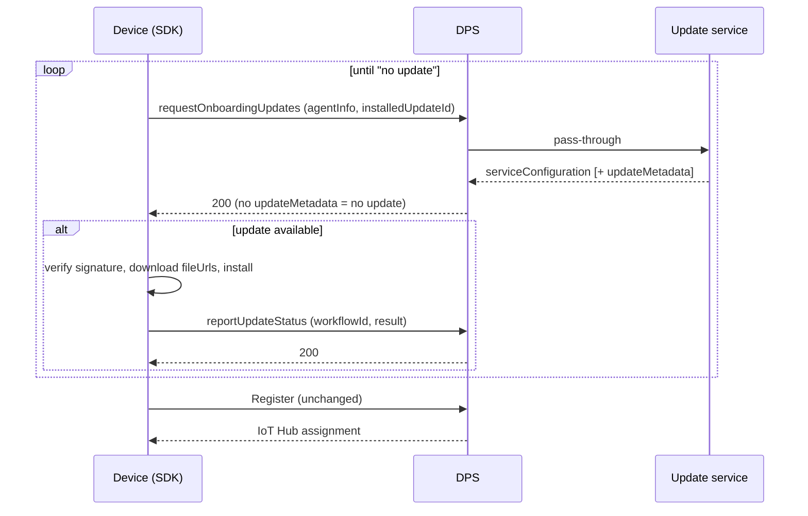
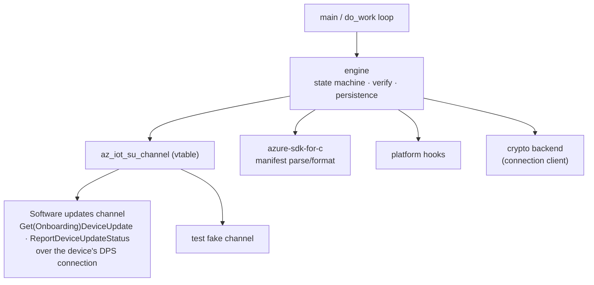
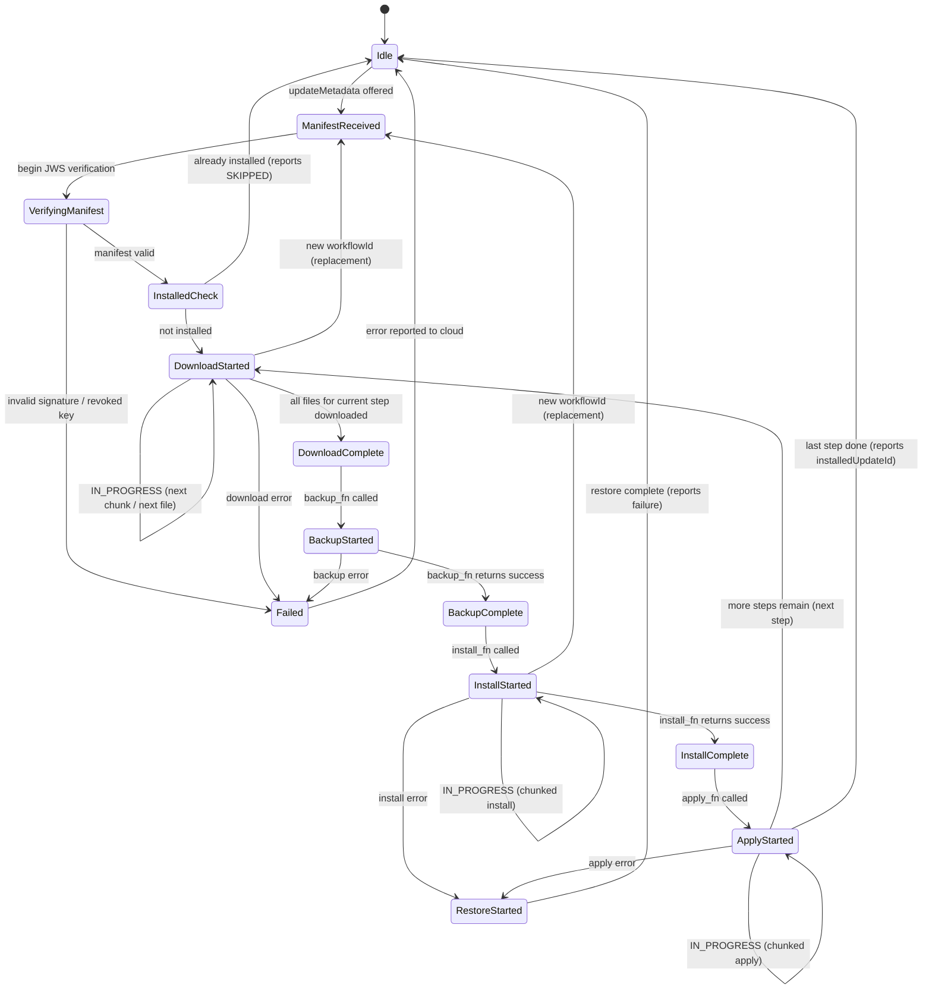
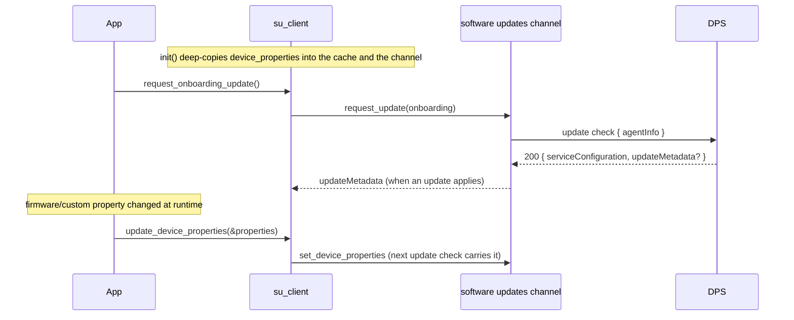
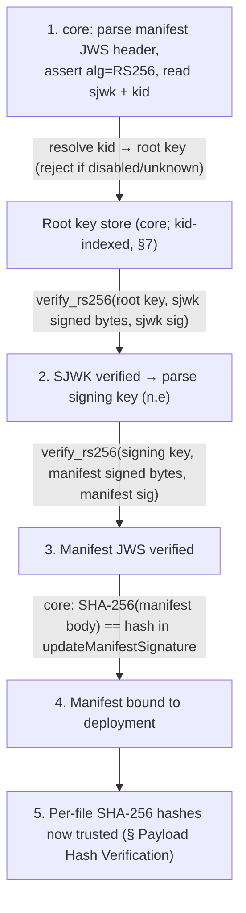
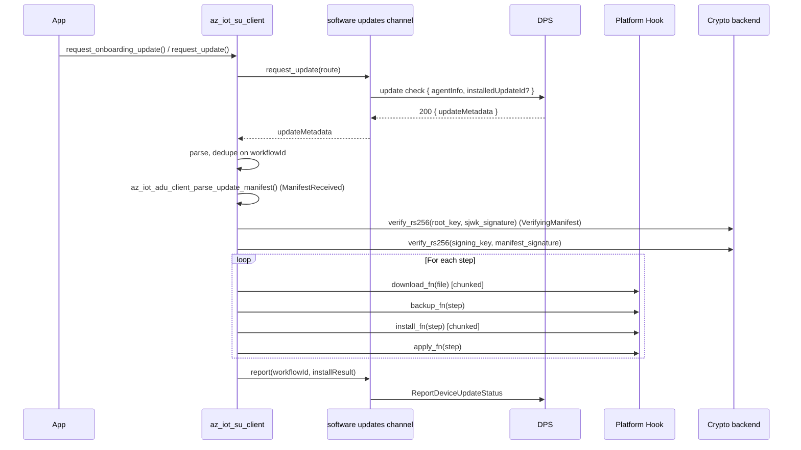

# Software updates client

Design of the software updates feature client (`az_iot_su.h`): the device contract it speaks, the
engine, the public API, the crypto and platform hooks, and how it is tested.

The key words "MUST", "MUST NOT", "REQUIRED", "SHALL", "SHALL NOT", "SHOULD", "SHOULD NOT", "RECOMMENDED", "MAY", and "OPTIONAL" in this document are to be interpreted as described in [RFC 2119](https://datatracker.ietf.org/doc/html/rfc2119).

> **Status:** implemented. Delivery and reporting go through the `az_iot_su_channel` vtable; the
> only channel runs over the device's DPS session (§2). Gaps are listed in §11. Where the update
> checks sit in the connection lifecycle is in
> [connection-c.md §7](connection-c.md#7-software-updates-onboarding-and-renewal-partly-implemented).

## 1. Overview

The `su_client` is a **feature client** in the azure-iot-sdk SDK that implements the on-device side of the Azure Device Update protocol. It is layered into a transport-independent engine (manifest parsing, signature verification, root keys, payload integrity, the download → backup → install → apply → restore state machine, reboot/resume persistence) plus an **`az_iot_su_channel`** vtable that carries delivery and reporting. The only channel is **Software updates** — the device-initiated pull protocol fronted by the DPS gateway (§2).

### Requirements

- The software updates client MUST implement the software updates workflow state machine (Idle → Download → Install → Apply, with Backup/Restore on failure).
- The software updates engine MUST NOT depend on any transport type. Delivery and reporting MUST be reached only through the `az_iot_su_channel` vtable, so the engine is testable against a fake channel and the gateway is a channel parameter rather than a constant.
- The software updates client MUST verify update manifests cryptographically (JWS signature chain, SHA-256 payload hashes) before proceeding with any download.
- The software updates client MUST provide **platform abstraction hooks** so customers can plug their own download, install, apply, backup, and restore routines.
- Pre-built platform adapters live in `adapters/su/`, not in core `src/` (ESP32 today).
- The implementation MUST remain C99, single-threaded (callback-driven via `do_work()`), with no hidden allocations on the hot path — consistent with the existing SDK philosophy.
- The software updates client MUST report update state and results to the cloud. The wire shape is channel-specific: `reportUpdateStatus` (§2). The engine emits a structured result; the channel serializes it.
- The software updates client MUST support multi-step (composite) updates — the manifest MAY contain multiple instruction steps, each with its own handler type and file set.
- The SDK SHOULD be usable as an **agent core library**: in addition to the managed client, it SHOULD expose transport-free primitives to *validate + parse* a manifest into a filled struct and to *build* the result report, so consumers can implement their own software updates agent and state machine on top of the SDK's vetted trust code. (See §5.3.)

### Non-goals

- Delta/differential downloads.
- Diagnostics/log-upload interface.
- Peer-to-peer download acceleration (Delivery Optimization).
- adu-shell or privilege escalation (we assume the application has sufficient privileges).
- Component-level targeting (component enumerators).
- Proxy/nested updates (IoT Edge parent proxying updates to leaf devices).
- Reference steps with detached manifests (`"type": "reference"` + `detachedManifestFileId`).

---

## 2. Device contract

The device checks for updates and reports results through **DPS**, reusing its DPS credential
(X.509) and session. DPS passes each request through to the update service and returns its answer;
it keeps no per-device state. The device never talks to the update service directly, and there is
no subscription and no unsolicited offer: the agent polls.

API version: `2026-11-02-preview`. Public REST definition:
[Azure/azure-rest-api-specs#44617](https://github.com/Azure/azure-rest-api-specs/pull/44617).

### Operations

| Operation | When |
| --- | --- |
| `requestOnboardingUpdates` | **Before** registration: a day-zero device that has no device record yet. |
| `requestSoftwareUpdates` | **After** registration (operational). |
| `reportUpdateStatus` | After an install attempt, on either route. Required. |

The device selects the route by which operation it calls. The SDK sends them over the device's DPS
MQTT session:

```
PUBLISH   $dps/registrations/POST/{operation}/?$rid={request_id}
SUBSCRIBE $dps/registrations/res/#
```

The same operations exist as HTTPS POSTs on the DPS device endpoint
(`/{idScope}/registrations/{registrationId}/{operation}?api-version=...`); the SDK does not use them.

### Onboarding flow



- The check is **advisory**: if it fails, the device registers anyway.
- The agent re-checks after each successful install, so updates can chain before registration.
- Onboarding progress is recorded on the onboarding update job, not on a device record, since the
  device has none yet.

The operational route polls `requestSoftwareUpdates` with the same shapes.

### Request (both fetches)

- `agentInfo`: `{ agentSdkVersion, agentProfile, compatibilityProperties }`. `agentProfile` is an
  opaque capability id; `compatibilityProperties` is 1–5 key/value pairs. The service combines
  them into the device class. Required unless a still-current `agentInfoEtag` is sent; onboarding
  always requires it.
- `installedUpdateId`: `{ provider, name, version }` of the installed update, or `null`.
- `agentInfoEtag`, `serviceConfigEtag`: optional; let the service skip unchanged data.

### Response

- `serviceConfiguration.rootKeyDownloadUrl`: the root-key package for signature verification.
  Omitted when the sent `serviceConfigEtag` is still current.
- `serviceConfigEtag`, `agentInfoEtag`: always present.
- `updateMetadata`: `{ workflowId, updateManifest, updateManifestSignature, fileUrls }`, present
  only when an update applies. **Omitted means "no update"** (HTTP 200, not an error).

### Report

`{ workflowId, installedUpdateId, installResult }`, where `installResult` is
`{ outcome, failureOrigin, resultCode, extendedResultCodes, resultDetails, stepResults }`:

- `outcome`: `IN_PROGRESS`, `SUCCEEDED`, `FAILED`, `CANCELED` or `SKIPPED`.
- `extendedResultCodes`: comma-separated hex.
- `stepResults`: `{ step_0, step_1, … }`, each with `outcome`, `failureOrigin`, `resultCode`,
  `extendedResultCodes` and optional `resultDetails`. Omitted from in-progress reports; complete in
  terminal reports when the manifest has steps.

Reporting is **idempotent on `workflowId`**. A different terminal outcome for the same workflow is
rejected with `409 REPORT_CONFLICT`.

### Trust

- `updateManifestSignature` is a nested JWS (RS256), verified against the root-key package: root
  key → SJWK signing key → manifest hash. Root-key rotation and `disabledSigningKeys` revocation
  are part of the package format.
- `fileUrls` are **not** covered by the signature. Payload integrity comes from the per-file hashes
  inside the signed manifest.
- Binding the account id into the signature is not supported: the service returns no `accountId`.

### Errors

Act on the machine-readable `error.code`, never on the HTTP status. Exception: a failure whose body
carries no code (empty or unparseable) is classified by its status alone -- 429 throttled,
500/502/503/504 retryable, anything else fatal -- and the missing code is reported as 0.

| Case | Code / status | Device action |
| --- | --- | --- |
| No update | 200, `updateMetadata` omitted | Nothing to apply. Not an error. |
| Update service not linked | 409 `UPDATE_ACCOUNT_NOT_LINKED` | Treat as "no update service configured". Do not retry. |
| Agent info stale or unknown | 400 `OUTDATED_AGENT_INFO` / `UNKNOWN_AGENT_INFO_VERSION` | Resend the full `agentInfo` and retry. |
| Service configuration stale | 400 `OUTDATED_SERVICE_CONFIG` | Retry without `serviceConfigEtag`. |
| Throttled | 429 + `Retry-After` | Wait, then retry. |
| Transient upstream failure | 503 `UPSTREAM_UNAVAILABLE` / `INTERNAL_SERVER_ERROR` | Fetch: proceed (advisory) and retry later. Report: retry; it must not be lost. |
| Bad request, auth, disabled | 400 / 401 / 403 | Fix the request or credentials; do not retry unchanged. |

**The device is the only retrier**: DPS makes one attempt per hop. A retryable failure with no
`Retry-After` is retried after a jittered exponential backoff (1 s doubling to 60 s, ±20%), reset by
any accepted operation; it counts against the request timeout. Reports are durable writes,
retried until acknowledged.

---

## 3. Architecture

The application drives the engine, which reaches the network only through the channel vtable and
the platform hooks.



---

## 4. State Machine



### Already-Installed Check

After verifying the manifest signature, the client MUST call `is_installed_fn`:

- If already installed: the client MUST report a `SKIPPED` outcome and return to Idle without downloading.
- Otherwise: the client MUST transition to DownloadStarted.

A customer-provided `accept_deployment_fn` hook MAY be added to allow application-level rejection (e.g., battery too low, critical operation in progress).

### Download & Verification Gating

Verification MUST be **two-staged** and MUST gate the transition into Install. A
payload MUST NOT be installed before both stages pass.

**Stage 1 — Manifest authenticity (before any download).** In
`VerifyingManifest`, the client MUST verify the update manifest's JWS signature
chain *before* it trusts any field in the manifest — including the file hashes.
Core parses the JWS and SJWK, resolves the root key by `kid`, and calls the
`verify_rs256` crypto primitive for each of the two signature checks (see §6).
If verification fails (bad signature, unknown/revoked/`disabled` key, or `alg`
≠ `RS256`), the client MUST transition directly to `Failed` with source =
manifest verification (see result-code mapping below) and MUST NOT download
anything.

**Stage 2 — Payload integrity (per file, after download).** Each downloaded file
MUST be hash-verified against the `hashes[]` entry from the (now-trusted)
manifest before the file is eligible for Install:

1. After `download_fn`, core streams the file back through `read_file_fn` and
   the backend's SHA-256 (`sha256_init` → `sha256_update` → `sha256_final`).
2. The client MUST compare the computed SHA-256 against the manifest's
   `hash_value` (base64) for that file. The comparison MUST be constant-time.
3. On mismatch, the client MUST treat the file as a download failure: it MUST
   discard the file and transition to `Failed` (the deployment does not proceed
   to Backup/Install). It MUST NOT retry indefinitely within a single workflow.
4. `DownloadStarted → DownloadComplete` occurs only after **every** file for the
   current step has passed hash verification.

Only when Stage 1 (once per deployment) and Stage 2 (every file) both pass does
the state machine advance to `BackupStarted`/`InstallStarted`. This ordering —
authenticate the manifest, *then* trust its hashes, *then* verify payloads — is
mandatory; verifying payload hashes from an unverified manifest provides no
security.

### Device Properties on the Wire

Device properties reach the service on **every update check**: manufacturer, model and custom
properties as `agentInfo.compatibilityProperties`, and `installedUpdateId` on the regular route
(the onboarding route omits it). There is no unsolicited report: status reports are keyed on
`workflowId`, so a device with no workflow has nothing to report.

#### Device-Properties Model

The application supplies device properties as a **plain struct** that the library
**deep-copies** into its own cache. There is no callback and no shared ownership.
The design (full API in [§5.2](#52-device-properties-api)):

1. **Caller-owned struct, library-owned cache.** At `init` the application passes
   an `az_iot_su_device_properties` (manufacturer, model, installedUpdateId,
   and an array of custom properties) plus a cache buffer. The library
   **deep-copies** every string into the cache; after `init` returns the
   application MAY mutate or free its own struct.
2. **No exposure of azure-sdk-for-c types.** The library MUST NOT expose
   `az_iot_su_client_device_properties`.
3. **Cache reused for every request.** Every update check and status report
   reads from the cache; the application MUST NOT be invoked mid-`do_work`.
4. **Runtime update.** `az_iot_su_client_update_device_properties()`
   deep-copies a new struct into the cache and refreshes the channel's copy; the
   **next** update check carries it. With a workflow active, its status is
   re-reported on the next `do_work()`.

**Threading.** This follows the SDK-wide single-threaded contract: `init`,
`update_device_properties`, and `do_work` MUST run on the same thread or be
externally serialized (e.g. one mutex guarding all SDK calls). The deep-copy
gives clean **ownership** (no dangling pointer into caller memory), not
cross-thread safety. The SDK is single-threaded; callers serialize access.

### Duplicate vs. Replacement Detection

`workflowId` is the sole deployment identity; the service re-offers a workflow until it is
superseded. The client MUST distinguish:

| Condition | Meaning | Behavior |
|-----------|---------|----------|
| New `workflowId` | **Replacement** | MUST restart from ManifestReceived with the new deployment |
| Same `workflowId`, whatever the manifest bytes | **Duplicate** | MUST ignore |
| `workflowId` longer than `AZ_IOT_SU_WORKFLOW_ID_SIZE` | **Refused** | MUST NOT process; raises `AZ_IOT_SU_EVENT_UPDATE_REFUSED` (`AZ_IOT_ERR_NOT_ENOUGH_SPACE`). Not truncated: reports correlate on the exact id |

### Result-Code Mapping

The state mapping above tells the service *what phase* the agent is in; the
**result codes** tell it *how the last action ended*. Every report carries an
`az_iot_su_client_install_result` (and per-step `step_results[]`), each with a
`result_code` (high-level) and `extended_result_code` (diagnostic). The client
MUST populate them as follows.

**`result_code`.** Follows software updates agent convention: the success value reported by
the agent is **`700`** (the value used throughout azure-sdk-for-c examples). The
client MUST report:

| Outcome | `result_code` |
|---|---|
| Step/overall success | `700` |
| Any failure | A non-success software updates code (`< 700`) indicating the failing phase |

**`extended_result_code`.** A 32-bit diagnostic value the client MUST compose so
the failing layer and raw cause are recoverable from the cloud report. The SDK
defines a structured layout:

```
 bits 31..28 : facility  (which phase/layer failed)
 bits 27..00 : code       (the hook's raw int32 result, truncated, or an SDK sub-code)
```

| Facility (bits 31..28) | Meaning | Set when |
|---|---|---|
| `0x1` | Manifest / JWS verification | `verify_rs256` failed, `kid` unresolved/`disabled`, or `alg` ≠ `RS256` |
| `0x2` | Download (transport) | `download_fn` returned `AZ_IOT_SU_RESULT_FAILURE` |
| `0x3` | Hash mismatch | computed SHA-256 ≠ manifest hash |
| `0x4` | Backup | `backup_fn` failed |
| `0x5` | Install | `install_fn` failed |
| `0x6` | Apply | `apply_fn` failed |
| `0x7` | Restore | `restore_fn` failed (rollback itself failed) |
| `0x8` | Persist | `persist_state_fn` kept failing at a reboot boundary (`AZ_IOT_SU_PERSIST_MAX_ATTEMPTS`); low bits carry its last return value |
| `0xF` | Internal / client | parser, state, or buffer error inside the software updates client |

The low 28 bits MUST carry the originating hook's raw return value (or an SDK
sub-code for internal failures) so a device-side failure can be diagnosed from
the cloud without on-device logs. When a failure has no meaningful sub-code, the
low bits MUST be `0`.

**`result_details`.** OPTIONAL free-form string. When set, it MUST be a copy into
a client-owned buffer (no pointer into hook-owned memory), consistent with the
no-shared-ownership rule used elsewhere.

### Multi-Step Support

The update manifest v5 `instructions.steps[]` array MAY contain multiple steps, each with its own handler type and file set. The state machine MUST iterate through steps sequentially:

1. For step N: the client MUST Download all files → Backup → Install → Apply.
2. If Apply succeeds and more steps remain: the client MUST advance to step N+1 and loop back to Download.
3. If any step fails: the client MUST Restore (rolling back from step N backward to step 0).
4. Terminal per-step results MUST be reported via `az_iot_su_step_result`.

#### Per-Step Result Accumulation

The client MUST maintain an `az_iot_su_step_result` for every manifest step,
indexed by step number. As the machine progresses:

- Before execution, a step is `SKIPPED` / `NOT_APPLICABLE` with zero result
  codes. This becomes the terminal state for steps not reached after a failure.
- On successful Apply, the step becomes `SUCCEEDED` / `NOT_APPLICABLE`, result
  code `700`, extended result code `0`.
- On failure, the step becomes `FAILED` / `AGENT_CORE` with the failing phase's
  `result_code` + composed `extended_result_code` (see Result-Code Mapping), and
  no further steps MUST be started.
- On cancellation, the active unfinished step becomes `CANCELED` /
  `NOT_APPLICABLE`, result code `-1`, extended result code `0`; later steps stay
  `SKIPPED`.
- The **overall** `result_code`/`extended_result_code` MUST mirror the *first*
  failing step (the root cause), not a later rollback outcome.
- `step_results_count` MUST equal the number of manifest steps for terminal
  reports.

#### Partial-Failure Rollback

When step N fails after steps `0..N-1` already applied, the client MUST roll back
**in reverse order** (`restore_fn` for step N-1, N-2, …, 0), so the device is
returned to its pre-deployment state:

1. Rollback MUST invoke `restore_fn` only for steps that had a successful
   `backup_fn` (steps whose Backup never ran MUST be skipped).
2. If a `restore_fn` itself fails, the client MUST record facility `0x7`
   (Restore) in the overall `extended_result_code` but MUST continue attempting
   to restore the remaining earlier steps (best-effort rollback).
3. After rollback completes (or is best-effort exhausted), the client MUST report
   the terminal `Failed` state with the accumulated step results, then return to
   `Idle`.
4. `installedUpdateId` MUST remain the **pre-deployment** value after a failed
   deployment + rollback (the new update is not installed).

### State reporting to cloud

Workflow transitions produce a status report. The engine hands the channel a structured result
(see Result-Code Mapping); the software updates channel sends it as `ReportDeviceUpdateStatus`:

```json
{
  "workflowId": "<workflowId from updateMetadata>",
  "installedUpdateId": { "provider": "...", "name": "...", "version": "..." },
  "installResult": {
    "outcome": "IN_PROGRESS",
    "failureOrigin": "NOT_APPLICABLE",
    "resultCode": 1,
    "extendedResultCodes": "0"
  }
}
```

In-progress reports omit `installResult.stepResults`, even after some steps
have completed. Terminal reports include the map when the manifest has steps,
keyed `step_0`, `step_1`, …; every entry carries `outcome`, `failureOrigin`,
`resultCode`, and `extendedResultCodes` (plus optional `resultDetails`). Field
rules are in §2.

### Cancellation

Software updates carries no cancel action. A new `workflowId` replaces the in-progress workflow: the
engine restarts at ManifestReceived when it is delivered. `az_iot_su_is_cancelled()` remains
for hooks to poll; no software updates input sets it.

### Reboot coordination

If `install_fn` or `apply_fn` returns `AZ_IOT_SU_RESULT_REBOOT_REQUIRED`:

1. The client MUST report state to the cloud and MUST persist workflow progress to non-volatile storage via the customer-provided `persist_state_fn`: after `install_fn`, the step's Apply; after `apply_fn`, the next step's start (after the last step, the terminal record below).
2. The application MUST reboot the device after the client persists state.
3. On startup, the application MUST call `az_iot_su_client_resume()`, which reads persisted state and continues the workflow from the appropriate phase.

When a workflow ends (succeeded, failed, canceled, skipped), the client stores a
**terminal record** holding the unsent terminal report before sending it, and
retires it once the channel's verdict is final: accepted, `ALREADY_REPORTED`,
or refused by the service. A report abandoned for want of a session is kept, so
it is re-sent after the next boot. A new `workflowId` replaces it.

### Persistence & Resume Blob Format

`persist_state_fn` / `load_state_fn` exchange an **opaque, self-contained byte
blob** that the core serializes and the platform merely stores verbatim (file,
NVS partition, EEPROM, …). The platform MUST NOT interpret it; the format is
internal and may change between SDK versions.

- **Size** — at most `AZ_IOT_SU_STATE_BLOB_MAX_SIZE` bytes; size storage for it.
- **Versioned** — magic `"SUCP"` and a `u16` format version (currently 1). A
  record of any other magic or version is ignored. All integers are
  little-endian.
- **Integrity-checked** — a CRC-32 over the rest of the blob, stored in its last four bytes; a record with extra bytes after it is ignored.
- **Contents** — workflow state, step/file position, flags (cancel,
  have-request, report-owed), the raw request buffer (manifest, workflow id),
  the latched outcome, the overall and per-step results, the download URLs, the
  active workflow id, the applied update id, and opaque channel state (the DPS
  channel's `agentInfoEtag` / `serviceConfigEtag`).
- **Terminal record** — report-owed set, state Idle, no request: only what the
  terminal report needs.

The byte layout is documented next to the serializer in
`src/features/su/su_client.c`; it is not a public contract.

#### Resume semantics (`az_iot_su_client_resume()`)

1. Call `load_state_fn`. If it reports no state (including an empty record), or
   `magic`/`version`/`crc32` fail validation, `resume()` is a **no-op** returning
   success — the agent starts clean and waits for the next update offer. A
   valid record is refused with `AZ_IOT_ERR_NOT_SUPPORTED` when
   `persist_state_fn` is NULL (it could never be cleared), and with
   `AZ_IOT_ERR_INVALID_ARG` when its URLs do not cover the remaining steps; the
   latter is cleared.
2. A terminal record restores the workflow id, outcome, results, applied update
   id and channel state; the client stays Idle and re-sends the report from
   `do_work()`. Otherwise core rehydrates `current_request`, `current_step`,
   `current_file`, the overall and per-step results and channel state.
3. **Replacement check** — when the next offer arrives, core compares its
   `workflowId` against the persisted one. A different id means the persisted
   workflow was superseded while the device was down: core MUST discard the
   resumed state and process the new deployment. The same id is a duplicate and
   is ignored.
4. **Re-entry point** — `resume()` MUST re-enter at a *phase boundary*, never
   mid-hook (hooks are not assumed re-entrant across reboot):
   - persisted `state` ∈ {`INSTALL_*`} ⇒ re-enter at the start of **Apply** for
     `current_step` (install completed before the reboot it requested).
   - persisted `state` ∈ {`APPLY_*`} ⇒ verify via `is_installed_fn`; if installed,
     advance to the next step (or finish), else treat as step failure → rollback.
   - any earlier phase (download/backup) ⇒ re-enter at the **start of that step**
     (Download), re-downloading any partially fetched file; partial download
     progress is intentionally **not** trusted across reboot.
5. When the workflow returns to Idle, core replaces the stored blob with the
   terminal record; it clears it (a zero-length `persist_state_fn` write) once
   the report is final and when a new workflow supersedes it, so a later boot
   does not replay a finished workflow. If the terminal record cannot be
   written, the stale blob is cleared instead. A failed checkpoint write before
   a requested reboot holds the workflow at that boundary (`INSTALL_COMPLETE`,
   or the next step's `DOWNLOAD_STARTED`); if the clear on supersede fails, the
   new workflow waits. Moving past a step whose checkpoint is stored refreshes
   it to the next step.
6. **Write failures.** A failed `persist_state_fn` write raises
   `AZ_IOT_SU_EVENT_PERSIST_FAILED` (first failure, `persist_retrying` true) and
   is retried from `do_work()` after 1 s, 2 s, 4 s, … (at most 60 s). A tracked
   success raises `AZ_IOT_SU_EVENT_PERSIST_RECOVERED` and resets the count; the
   best-effort erase of a stale record after a failed terminal-record write is
   not tracked (no event, no count). After
   `AZ_IOT_SU_PERSIST_MAX_ATTEMPTS` (default 5) consecutive failures the event
   is raised again with `persist_retrying` false and retries stop (with a
   limit of 1, the first event already carries `persist_retrying` false):
   - a held reboot boundary fails the workflow: `restore_fn` rolls it back and
     it is reported FAILED with facility `0x8` on the step. With no
     `restore_fn`, the overall extended result is facility `0x7` sub-code 0:
     nothing was undone. When a restore fails, it carries facility `0x7` with
     that hook's return value; earlier steps are still restored, so the
     rollback may be partial. Either way the device may still boot the
     installed update;
   - an unsent terminal report is no longer stored (it is still sent);
   - a held new workflow proceeds.

   A write needed later is still attempted once; a tracked success resets the count.
   While a workflow is held at a reboot boundary, a new `workflowId` is ignored
   (the service offers it again on a later check) and a cancel waits. A cancel
   that reaches an installed step not yet applied (`INSTALL_COMPLETE` /
   `APPLY_STARTED`) rolls it back first, reported like the give-up above when
   there is no `restore_fn`; completed steps are kept.
   While a failure is outstanding the application MUST NOT reboot for
   `REBOOT_REQUIRED`: nothing would resume.

> Persisting after **every** phase is OPTIONAL; the only MUST is to persist before
> a reboot the agent itself requested (`REBOOT_REQUIRED`). Persisting at more
> boundaries only widens how much progress survives an *unexpected* power loss.

---

## 5. Public API Surface

### 5.1 Header: `inc/azure/iot/az_iot_su.h`

> The header includes azure-sdk-for-c's manifest parsing/formatting header and
> re-exports the upstream types it uses under `az_iot_su_*` names.

```c
#ifndef AZ_IOT_SU_H
#define AZ_IOT_SU_H

#include <stdint.h>
#include <stddef.h>
#include <stdbool.h>
#include "az_iot_result.h"
#include "az_iot_connection_client.h"
#include <azure/iot/az_iot_adu_client.h>  /* azure-sdk-for-c: parsing structs */

#ifdef __cplusplus
extern "C" {
#endif

/* --- Result codes -------------------------------------------------------- */

#define AZ_IOT_SU_RESULT_SUCCESS           0
#define AZ_IOT_SU_RESULT_IN_PROGRESS       1
#define AZ_IOT_SU_RESULT_REBOOT_REQUIRED   2
#define AZ_IOT_SU_RESULT_ALREADY_INSTALLED 3
#define AZ_IOT_SU_RESULT_CANCELLED         4
#define AZ_IOT_SU_RESULT_FAILURE          -1

/* --- State enum ---------------------------------------------------------- */

typedef enum az_iot_su_state
{
    AZ_IOT_SU_STATE_IDLE = 0,
    AZ_IOT_SU_STATE_MANIFEST_RECEIVED,
    AZ_IOT_SU_STATE_VERIFYING_MANIFEST,
    AZ_IOT_SU_STATE_DOWNLOAD_STARTED,
    AZ_IOT_SU_STATE_DOWNLOAD_COMPLETE,
    AZ_IOT_SU_STATE_BACKUP_STARTED,
    AZ_IOT_SU_STATE_BACKUP_COMPLETE,
    AZ_IOT_SU_STATE_INSTALL_STARTED,
    AZ_IOT_SU_STATE_INSTALL_COMPLETE,
    AZ_IOT_SU_STATE_APPLY_STARTED,
    AZ_IOT_SU_STATE_RESTORE_STARTED,
    AZ_IOT_SU_STATE_FAILED,
} az_iot_su_state;

/* --- Platform hooks (vtable) --------------------------------------------- */

typedef struct az_iot_su_platform_hooks
{
    /**
     * Download one file. Called once per file, once per do_work iteration.
     * MUST return AZ_IOT_SU_RESULT_IN_PROGRESS to continue on next do_work;
     * MUST return AZ_IOT_SU_RESULT_SUCCESS when complete.
     * The hook MUST verify the file hash (helpers provided).
     * The hook SHOULD check az_iot_su_is_cancelled() periodically.
     */
    int32_t (*download_fn)(
        const az_iot_su_client_update_manifest_file* file,
        const az_span download_url,
        uint32_t file_index,
        uint32_t file_count,
        void* user_ctx);

    /**
     * Install the previously-downloaded update payload for one step.
     * MAY return AZ_IOT_SU_RESULT_IN_PROGRESS for chunked install.
     * MAY return AZ_IOT_SU_RESULT_REBOOT_REQUIRED.
     */
    int32_t (*install_fn)(
        const az_iot_su_client_update_manifest* manifest,
        uint32_t step_index,
        void* user_ctx);

    /**
     * Apply (activate) the installed update for one step.
     * MAY return AZ_IOT_SU_RESULT_REBOOT_REQUIRED.
     */
    int32_t (*apply_fn)(
        const az_iot_su_client_update_manifest* manifest,
        uint32_t step_index,
        void* user_ctx);

    /**
     * Backup current state before installing. OPTIONAL (MAY be NULL).
     */
    int32_t (*backup_fn)(
        const az_iot_su_client_update_manifest* manifest,
        uint32_t step_index,
        void* user_ctx);

    /**
     * Restore previous state on failure. OPTIONAL (MAY be NULL).
     */
    int32_t (*restore_fn)(
        const az_iot_su_client_update_manifest* manifest,
        uint32_t step_index,
        void* user_ctx);

    /**
     * Check if the update described by manifest is already installed.
     * MUST return AZ_IOT_SU_RESULT_ALREADY_INSTALLED if so.
     */
    int32_t (*is_installed_fn)(
        const az_iot_su_client_update_manifest* manifest,
        void* user_ctx);

    /**
     * Persist workflow state to non-volatile storage (for reboot survival).
     * OPTIONAL — REQUIRED only if reboot is possible during update.
     * state_blob_len == 0 means erase the stored record.
     */
    int32_t (*persist_state_fn)(
        const uint8_t* state_blob,
        size_t state_blob_len,
        void* user_ctx);

    /**
     * Load previously-persisted workflow state. Returns 0 and fills
     * state_blob/len on success; returns non-zero if no state persisted.
     */
    int32_t (*load_state_fn)(
        uint8_t* state_blob,
        size_t state_blob_capacity,
        size_t* state_blob_len,
        void* user_ctx);

    void* user_ctx;
} az_iot_su_platform_hooks;

/* --- Crypto (REQUIRED, from the connection client) ----------------------- */

/**
 * Software updates take SHA-256 and RS256 verification from the connection
 * client's crypto backend (az_iot_connection_client_options::crypto, declared
 * in az_iot_crypto.h). The core links no crypto library.
 *
 * The backend is PURE CRYPTOGRAPHIC PRIMITIVES only: SHA-256 (init / update /
 * final) and verify_rs256. It does not parse JWS, decode base64url, resolve
 * keys, or enforce revocation; core does all of that (see §6). Software updates
 * need verify_rs256, which is optional for other features.
 *
 * Shipped backends: az_iot_crypto_openssl(), az_iot_crypto_mbedtls().
 */

/* --- Root key store (owned and managed by software updates core) ---------------------- */

/**
 * An RSA root public key trusted to sign Signed JWKs (SJWKs). Root keys are
 * managed by software updates core — NOT by the crypto backend — so that key resolution by
 * `kid` and revocation policy are written once, in portable code.
 *
 * All fields are caller-owned. Core stores the pointers (no deep copy of key
 * bytes); the arrays MUST outlive the client. Keys may be compiled-in
 * constants (see az_iot_su_microsoft_root_keys()) or loaded at runtime.
 */
typedef struct az_iot_su_root_key
{
    const char*    kid;           /* JWK key id, matched against the SJWK header `kid`. */
    const uint8_t* modulus;       /* big-endian RSA modulus (n). */
    size_t         modulus_len;
    const uint8_t* exponent;      /* big-endian RSA exponent (e). */
    size_t         exponent_len;
    bool           disabled;      /* true = revoked/disabled; rejected during resolution.
                                     Kept in the list only for auditability. */
} az_iot_su_root_key;

/* --- Device properties (plain struct, deep-copied by the client) --------- */

typedef struct az_iot_su_update_id_info
{
    const char* provider;
    const char* name;
    const char* version;
} az_iot_su_update_id_info;

typedef struct az_iot_su_custom_property
{
    const char* name;
    const char* value;
} az_iot_su_custom_property;

/**
 * Device properties supplied by the application. All fields are caller-owned;
 * the client DEEP-COPIES them into its cache buffer at init() and on
 * update_device_properties(). After those calls return, the application MAY
 * mutate or free this struct and the arrays/strings it points to.
 */
typedef struct az_iot_su_device_properties
{
    const char*                         manufacturer;
    const char*                         model;
    az_iot_su_update_id_info           installed_update_id;
    const az_iot_su_custom_property* custom_properties;       /* caller's array, MAY be NULL */
    size_t                              custom_properties_count;
} az_iot_su_device_properties;

/* --- Client struct -------------------------------------------------------- */

typedef struct az_iot_su_client
{
    struct
    {
        az_iot_su_channel channel;   /* software updates channel bound to the connection client */
        az_iot_su_platform_hooks hooks;
        const az_iot_crypto* crypto; /* the connection client's backend */
        /* Root-key store (core-owned). Pointers reference caller arrays; see §7.
         * Capacity is compile-time (AZ_IOT_SU_MAX_ROOT_KEYS). */
        az_iot_su_root_key root_keys[AZ_IOT_SU_MAX_ROOT_KEYS];
        size_t root_key_count;
        az_iot_su_state state;
        az_iot_su_client_update_request current_request;
        az_iot_su_client_update_manifest current_manifest;
        uint32_t current_step;
        uint32_t current_file;
        bool cancel_requested;
        /* Client-owned device-properties cache (deep copy of caller's struct). */
        uint8_t* device_properties_buffer;
        size_t device_properties_buffer_size;
        bool device_properties_report_pending;
        /* Connection-state observer / detach safety (see §16). */
        bool detached;
    } _internal;
} az_iot_su_client;

/* --- Lifecycle ----------------------------------------------------------- */

/**
 * Configuration for az_iot_su_client_init(). Zero-initialize via
 * az_iot_su_client_config_options_default() and set the required fields:
 *   hooks:   platform operations (download/install/apply/...). See §6.
 *   root_keys / root_key_count: caller-owned RSA root public keys that anchor
 *     manifest trust (see §7). Core copies the small descriptor array into its
 *     fixed store (the key BYTES are referenced, not copied, so they MUST
 *     outlive the client), capped at AZ_IOT_SU_MAX_ROOT_KEYS. For
 *     Microsoft-signed updates, pass az_iot_su_microsoft_root_keys().
 *   device_properties: caller-owned device properties, DEEP-COPIED into the cache.
 *     May be mutated/freed by the caller after init returns.
 *   device_properties_buffer / size: caller-owned cache the client copies into.
 *     No hidden allocation; the buffer MUST outlive the client. Size it exactly
 *     with az_iot_su_device_properties_buffer_size().
 */
typedef struct az_iot_su_client_config_options
{
    const az_iot_su_platform_hooks*    hooks;
    const az_iot_su_root_key*          root_keys;
    size_t                              root_key_count;
    const az_iot_su_device_properties* device_properties;
    uint8_t*                            device_properties_buffer;
    size_t                              device_properties_buffer_size;
} az_iot_su_client_config_options;

az_iot_su_client_config_options az_iot_su_client_config_options_default(void);

/* One observer registry, discriminated by event kind, matching the connection
 * client's add/remove seam so an application learns one pattern for the whole
 * SDK. Every observer receives every event; read `kind` first.
 *
 *   WORKFLOW_STATE_CHANGED -- the deployment moved. Otherwise observable only
 *     by polling az_iot_su_client_get_state().
 *   OPERATION_ABANDONED    -- an operation reached a verdict that stops the
 *     CLIENT re-arming it. It does NOT mean the application may not ask again;
 *     that is the intended response, which is why the event carries the route:
 *     a lost status report is not a lost update check, and the onboarding and
 *     regular fetches are asked for separately.
 *   PERSIST_FAILED / PERSIST_RECOVERED -- persist_state_fn started / stopped
 *     failing; PERSIST_FAILED again when the client gives up (see
 *     AZ_IOT_SU_PERSIST_MAX_ATTEMPTS).
 *   UPDATE_REFUSED         -- a delivered update was not processed because it
 *     does not fit a compile-time limit (workflow id or request buffer).
 *
 * Abandonment is raised from on_channel_result()'s no-re-arm branch, which IS
 * the definition of "the client will not retry this". Deriving both from one
 * condition is deliberate: a second list in the channel would be free to drift
 * away from the engine's. It covers PROCEED as well as FATAL -- PROCEED is
 * UPDATE_ACCOUNT_NOT_LINKED on a fetch, a permanent refusal that otherwise
 * reads exactly like "no update available".
 *
 * The event carries the service diagnosis (numeric `errorCode`, the
 * best-effort error TEXT from `message`, and `trackingId`), because the
 * classification alone collapses failures needing different operator
 * responses, and trackingId is what a support request needs.
 *
 * `message` is TEXT, not a stable identifier: it usually carries the
 * originating code ("INVALID_REQUEST", "UNKNOWN_WORKFLOW_ID"), which is what
 * the classifier matches on defensively, but the same field is sometimes free
 * prose ("Deserialization error."). Applications branch on `code` and on the
 * event's `reason`. */
az_iot_result az_iot_su_client_add_observer(
    az_iot_su_client* client,
    az_iot_su_observer_callback cb,
    void* user_ctx);

az_iot_result az_iot_su_client_remove_observer(
    az_iot_su_client* client,
    az_iot_su_observer_callback cb,
    void* user_ctx);

/**
 * Initialize the software updates client. `connection` is the connection client whose DPS
 * session carries the software updates channel; `options` carries the rest (hooks,
 * crypto, trust store, device properties + caller cache). Returns
 * AZ_IOT_ERR_INVALID_ARG if a required field is NULL, or
 * AZ_IOT_ERR_NOT_ENOUGH_SPACE if root_key_count > AZ_IOT_SU_MAX_ROOT_KEYS or
 * the buffer is too small for device_properties.
 */
az_iot_result az_iot_su_client_init(
    az_iot_su_client* client,
    az_iot_connection_client* connection,
    const az_iot_su_client_config_options* options);

/**
 * Return Microsoft's compiled-in software updates root public keys (const, static storage).
 * Convenience for the common case; equivalent to passing your own array to
 * az_iot_su_client_init(). Pointer and count reference static data.
 */
const az_iot_su_root_key* az_iot_su_microsoft_root_keys(size_t* out_count);

void az_iot_su_client_deinit(az_iot_su_client* client);

/**
 * Resume a workflow after device reboot. The application MUST call this during startup.
 * If no persisted state exists, this is a no-op.
 */
az_iot_result az_iot_su_client_resume(az_iot_su_client* client);

/* --- Runtime ------------------------------------------------------------- */

/**
 * Drive the software updates state machine. The application MUST call this from its do_work loop.
 * Non-blocking: MUST process at most one chunk of work per invocation.
 */
az_iot_result az_iot_su_client_do_work(az_iot_su_client* client);

/**
 * Check if cancellation has been requested (called from within platform hooks).
 */
bool az_iot_su_is_cancelled(const az_iot_su_client* client);

/**
 * Get the current software updates agent state.
 */
az_iot_su_state az_iot_su_client_get_state(const az_iot_su_client* client);

/**
 * Ask for an ONBOARDING update -- the day-0/pre-registration route. Needs no
 * device record and omits installedUpdateId.
 *
 * The application chooses the route: it is the only party that knows whether
 * it has a device record, because it persists its provisioning result across
 * boots. The service cannot be probed for it either -- "no device record" and
 * "malformed request" share one error code.
 *
 * Asynchronous: records the request; the NEXT do_work() issues it, retrying on
 * a later tick if the channel is not ready.
 *
 * timeout_ms bounds the whole wait in WALL-CLOCK terms;
 * AZ_IOT_SU_REQUEST_NO_TIMEOUT (0) means no bound, and
 * AZ_IOT_SU_REQUEST_DEFAULT_TIMEOUT_MS (60000) is the default for a caller
 * with no policy of its own. The bound covers the retries before the channel
 * accepts the check AND the wait for its answer after. On expiry the request
 * is dropped (the channel stops waiting, so a late answer is ignored) and
 * OPERATION_ABANDONED is raised with AZ_IOT_ERR_TIMEOUT. Per call, not a compile-time constant: a boot-time
 * onboarding probe and a nightly poll do not share a deadline.
 *
 * Time spent obeying a service-requested delay COUNTS against it. Excluding it
 * would move the deadline the caller set, and the caller plans around that
 * deadline. A delay that cannot fit ends the request at once -- waiting buys
 * nothing, since the channel refuses for its whole duration -- and the event
 * carries service_error.retry_after_ms so the application can schedule its own
 * next attempt.
 */
az_iot_result az_iot_su_client_request_onboarding_update(
    az_iot_su_client* client, uint32_t timeout_ms);

/**
 * Ask for a REGULAR (software) update -- the operational route. Requires a
 * provisioned device with a device record, and sends installedUpdateId, which
 * is how the service knows what to offer next. Same asynchronous contract.
 */
az_iot_result az_iot_su_client_request_update(az_iot_su_client* client, uint32_t timeout_ms);

/**
 * Replace the cached device properties; after success the caller MAY mutate or
 * free device_properties. No I/O or update check is scheduled. The application explicitly
 * requests an onboarding or regular check to transmit compatibility properties.
 * Also marks a workflow-status report pending; without a recorded workflow it
 * sends nothing. Status reports do not carry compatibility properties. Returns
 * AZ_IOT_ERR_NOT_ENOUGH_SPACE if the cache buffer is too small.
 *
 * Single-threaded contract: MUST be called on the do_work thread or be
 * externally serialized with do_work().
 */
az_iot_result az_iot_su_client_update_device_properties(
    az_iot_su_client* client,
    const az_iot_su_device_properties* device_properties);

#ifdef __cplusplus
}
#endif
#endif /* AZ_IOT_SU_CLIENT_H */
```

### 5.2 Device-Properties API

> **Current managed software updates cache:** strings are deep-copied into the caller's byte
> buffer; typed property/custom-property descriptors live in the client, so the
> buffer has no alignment requirement. Replacement validates the entire snapshot
> and the channel's escaped request before committing either cache. Failure preserves
> the previous accepted properties. The specified 1-5 compatibility KVP limit includes
> supplied manufacturer/model keys, not `agentProfile`; an installed ID must be absent
> or a complete nonempty triple.
> The application explicitly requests each check and chooses its route. The
> property setter refreshes the caches, but does not itself queue a fetch.

Device properties are supplied as a **plain struct** that the client
**deep-copies** into a caller-provided cache buffer. There is no callback and no
shared ownership: once `init` (or `update_device_properties`) returns, the
application owns its struct outright and may mutate or free it.

- At `init` the application passes `az_iot_su_device_properties` plus a cache
  buffer. The client MUST copy every string into the cache.
- The channel serializes compatibility properties into `agentInfo` on an explicit
  update check; the regular route also carries the cached installed ID.
- `update_device_properties()` re-copies a new struct. To publish its compatibility
  properties, the application calls `request_onboarding_update()` or `request_update()`.
  The setter's pending workflow-status report is distinct and cannot replace that
  fetch. Property-revision freshness and installed-ID promotion remain follow-ups.

```c
/* Build the struct on the stack; strings are caller-owned. */
static const az_iot_su_custom_property custom[] = {
    { "region", "westus2" },
};
az_iot_su_device_properties properties = {
    .manufacturer = "Contoso",
    .model        = "Thermostat-9000",
    .installed_update_id = { .provider = "Contoso", .name = "Thermostat", .version = "1.0.0" },
    .custom_properties = custom,
    .custom_properties_count = 1,
};

uint8_t properties_cache[256];
size_t root_key_count;
const az_iot_su_root_key* root_keys = az_iot_su_microsoft_root_keys(&root_key_count);
az_iot_su_client_config_options su_opts = az_iot_su_client_config_options_default();
su_opts.hooks = &hooks;
su_opts.root_keys = root_keys;
su_opts.root_key_count = root_key_count;
su_opts.device_properties = &properties;
su_opts.device_properties_buffer = properties_cache;
su_opts.device_properties_buffer_size = sizeof(properties_cache);
az_iot_su_client_init(&su, &conn, &su_opts);
/* `properties` and its strings may now be freed/reused; the client holds a deep copy. */

/* Later, when firmware version or a custom property changes at runtime: */
properties.installed_update_id.version = "1.1.0";
az_iot_su_client_update_device_properties(&su, &properties); /* carried by the next update check */
```

Device properties on the wire, end to end:



### 5.3 Agent Core-Library API (parse-only / BYO state machine)

> This API lets a consumer build their **own** software updates agent (in the spirit of
> [Azure/iot-hub-device-update](https://github.com/Azure/iot-hub-device-update))
> on top of our vetted parse + trust + report code, without adopting our state
> machine or any transport.

These functions are **transport-free**. They take spans/structs
only, perform no hidden allocation, and (where they return a struct) populate the
output **only after** trust verification passes (fail-closed). After the §10
engine extraction, the managed `az_iot_su_client` is implemented in terms of
these same primitives so there is a single verified copy of the security-critical
path.

```c
/* --- Library mode: validate + parse → filled struct ---------------------- */

/**
 * Verify (JWS/RS256 signature + root-key trust + alg/kid) AND parse a deployment
 * payload into filled structs. Fail-closed: out_request/out_manifest are valid
 * only on AZ_IOT_OK. The manifest is unescaped in place, so spans inside the
 * outputs reference `request_json`, which the caller owns and MUST keep alive
 * (and stable) for as long as the structs are used. No heap, no network.
 *
 *   request_json: the `updateMetadata` object (workflowId, updateManifest,
 *     updateManifestSignature, fileUrls), exactly as the service sends it.
 *     Mutated in place (manifest string unescaped); pass a writable buffer.
 *   crypto: a backend with verify_rs256 (az_iot_su_client_init() takes the
 *     connection client's). root_keys: as az_iot_su_client_init().
 *
 * Returns AZ_IOT_OK (verified parse), AZ_IOT_ERR_NOT_FOUND
 * (no workflowId), AZ_IOT_ERR_INVALID_ARG (bad args or
 * malformed JSON), or AZ_IOT_ERR_AUTH (signature/trust verification failed).
 */
az_iot_result az_iot_su_parse_update_request(
    az_span request_json,
    const az_iot_crypto* crypto,
    const az_iot_su_root_key* root_keys,
    size_t root_key_count,
    az_iot_su_client_update_request* out_request,
    az_iot_su_client_update_manifest* out_manifest);

/**
 * Streaming SHA-256 integrity check for one file, callable from the consumer's
 * own download loop (payload bytes are not present at parse time). read_chunk is
 * invoked repeatedly until it reports the end of the file.
 */
az_iot_result az_iot_su_verify_file_hash(
    const az_iot_su_client_update_manifest_file* file,
    const az_iot_crypto* crypto,
    int32_t (*read_chunk)(size_t offset, uint8_t* buf, size_t cap, size_t* out_read, void* ctx),
    void* read_ctx);

/**
 * Build the report payload from the consumer's own outcome data, without the
 * state machine. Emits the upstream agent-state JSON today; the software updates
 * reportUpdateStatus body is built by the channel (see §2).
 */
az_iot_result az_iot_su_build_report(
    const az_iot_su_device_properties* device_properties,
    const az_iot_su_client_install_result* result,
    const az_iot_su_client_update_request* request,
    az_iot_su_state state,
    uint8_t* out_json,
    size_t out_size,
    size_t* out_len);
```

**Boundaries (consumer-owned in library mode).** Core provides parse, trust,
integrity, and report formatting only. Step/content-handler dispatch (switch on
the manifest `handler` string), component enumeration, delta/`relatedFiles`
download handlers, diagnostics/log upload, and privilege separation
(`adu-shell`) remain the agent author's responsibility.

---

## 6. Cryptographic Verification — Pluggable Backend

### Design Decision: No Built-in Crypto Backend

The core software updates library (`src/features/su/`) MUST NOT link any crypto library (no mbedTLS, no OpenSSL). All cryptographic operations MUST go through the connection client's `az_iot_crypto` backend (`az_iot_connection_client_options::crypto`), which every feature that needs crypto shares. Rationale:

1. **Portability** — Different platforms use different crypto stacks (mbedTLS on ESP32, OpenSSL on Linux, WolfSSL on some RTOS, hardware crypto on secure MCUs). Linking any one forces an unwanted dependency on all others.
2. **HSM support** — Customers with hardware security modules need their crypto to route through PKCS#11 or vendor APIs. A hooks-only model naturally supports this.
3. **Binary size** — Embedded targets (ESP32) cannot afford unused crypto code. The customer links only what they need.
4. **One backend per device** — The backend is set once on the connection client and shared, so a device cannot end up with two crypto libraries for two features.

### Design Decision: The Backend Is Pure Primitives; Core Owns the Orchestration

A naïve design would expose a single `verify_jws_fn(jws_token, len)` and make the
adapter do everything: JWS compact parsing, base64url decoding, SJWK extraction,
JWK parsing, root-key resolution by `kid`, revocation enforcement, **and** the
signature math. That is the wrong split:

- It forces **every** backend (mbedTLS, OpenSSL, HSM) to re-implement the same
  security-sensitive, non-cryptographic parsing — duplicated and error-prone.
- It scatters **root-key management and revocation policy** across adapters,
  when that logic is platform-independent.

Instead, the backend is reduced to **pure primitives** — `verify_rs256` plus
incremental SHA-256 (the SDK composes one-shot SHA-256 from it) — and **Software
updates core owns all orchestration**:

| Responsibility | Owner |
|----------------|-------|
| JWS compact parsing, base64url decode | **core** (uses `az::core` base64/JSON it already links) |
| SJWK extraction, JWK `n`/`e` parsing | **core** |
| Root-key store, `kid` resolution | **core** (see §7) |
| Revocation enforcement (disabled kids) | **core** |
| `alg` validation (MUST be `RS256`) | **core** |
| Root Key Package verify/apply | **core** (not implemented; see §11) |
| RSA-PKCS1-v1_5/SHA-256 signature math | **backend** (`verify_rs256`) |
| SHA-256 digest | **backend** (`sha256_*`) |

Consequences: backends are tiny and identical in shape ("RSA verify + SHA-256");
the security-critical parsing and policy are written and reviewed once; an HSM
backend still works because verification uses only **public** keys.

#### Which algorithm? RS256, enforced from the wire

Software updates manifests are signed with **RS256** (RSASSA-PKCS1-v1_5 over SHA-256). This is
established two ways, and the doc/contract reflect both:

1. **Runtime assertion** — every JWS protected header (both the SJWK header and
   the manifest JWS header) carries `"alg":"RS256"`. Core MUST read `alg` and
   **reject** any token whose `alg` is not exactly `RS256`. The algorithm is
   therefore validated from the wire, never assumed.
2. **Contract** — the function is named and documented `verify_rs256`, so a
   backend knows precisely which primitive to implement. Supporting a future
   algorithm (e.g. ES256) would add a new optional function **and** a new
   accepted `alg` value in core — existing backends are unaffected.

### Pre-built Crypto Backends

We ship ready-to-use `az_iot_crypto` backends. Because root keys live in core, a
backend takes **no key material** — it only provides the primitives:

| Backend | Location | Crypto Library | Target |
|---------|----------|---------------|--------|
| mbedTLS | `adapters/crypto_mbedtls/` | mbedTLS 3.6 LTS or 4.1+ (PSA Crypto) | ESP32, constrained Linux |
| OpenSSL | `adapters/crypto_openssl/` | OpenSSL 3.0+ | Linux, general-purpose |

```c
copts.crypto = az_iot_crypto_mbedtls(); /* adapters/crypto_mbedtls/az_iot_crypto_mbedtls.h */
```

### Manifest Signature (JWS) Verification Flow

The manifest is protected by a **two-level** signature chain. Core performs every
parsing and resolution step and calls `verify_rs256` only for the two
signature checks (the green "verify" edges):



Worked sequence inside core (`verify_jws` is internal, not a hook):

1. Split the manifest JWS into `header.payload.signature`; base64url-decode the
   header; parse JSON. Assert `alg == "RS256"`; read the embedded `sjwk` (a JWS
   itself) and the `kid` it references.
2. Resolve `kid` against the root-key store. If not found, or the matching key
   is `disabled`, fail with `0x1` (manifest verification).
3. Split the `sjwk` into its own `header.payload.signature`; reconstruct its
   signed bytes (`base64url(header) + "." + base64url(payload)`); call
   `verify_rs256(root.modulus, root.exponent, sjwk_signed, sjwk_sig)`. On
   failure → `0x1`.
4. Parse the now-trusted SJWK payload as a JWK; base64url-decode `n` and `e` to
   get the **signing key**.
5. Reconstruct the manifest's signed bytes; call `verify_rs256(signing.n,
   signing.e, manifest_signed, manifest_sig)`. On failure → `0x1`.
6. The manifest JSON is now trusted. Core computes `SHA-256` over the manifest
   body and compares it to the hash in `updateManifestSignature` from the
   `updateMetadata` offer, binding the signed manifest to *this* deployment.

Only after all six steps succeed does core trust any field in the manifest —
including the per-file `sha256` hashes used below.

### Payload Hash Verification

Each file's SHA-256 hash (from the now-trusted manifest) MUST be verified after
download. Core streams the file back through `read_file_fn` and the backend's
SHA-256, with the state in a caller-owned context (no allocation):

```c
az_iot_sha256_ctx hash_ctx;
crypto->sha256_init(crypto, &hash_ctx);
while (chunk = read_next_chunk()) {
    crypto->sha256_update(crypto, &hash_ctx, chunk.data, chunk.len);
}
uint8_t computed[AZ_IOT_SHA256_SIZE];
crypto->sha256_final(crypto, &hash_ctx, computed); /* also releases hash_ctx */
// core compares computed vs the manifest hash; mismatch aborts the download.
```

---

## 7. Root Key Provisioning & Rotation

### Industry Approaches

| System | Key Provisioning Strategy |
|--------|--------------------------|
| **TUF (The Update Framework)** | Offline root keys sign a `root.json` metadata file that lists trusted intermediate keys + expiry. Root rotation = publish new `root.json` signed by threshold of old keys. |
| **Android Verified Boot** | Root of trust in hardware fuses (OTP). Key rotation via chained vbmeta images (each signed by previous key). |
| **MCUboot (Zephyr)** | Signing key hash burned into bootloader image at manufacturing time. Key rotation requires bootloader update. |
| **Software updates Reference Agent** | Root public keys hardcoded in agent binary. Root Key Packages (self-signed JWS) deliver new keys + revocation lists. |

### Our Approach: Compiled-in + Runtime-loadable (Both), Core-owned Store

The root-key store lives in **Software updates core**, not in the crypto backend (see §6). Its
capacity is compile-time configurable:

```c
#ifndef AZ_IOT_SU_MAX_ROOT_KEYS
#define AZ_IOT_SU_MAX_ROOT_KEYS 4
#endif
```

`az_iot_su_client_init` accepts an `az_iot_su_root_key[]` and copies the
descriptors into the fixed `root_keys[AZ_IOT_SU_MAX_ROOT_KEYS]` array (key bytes
are referenced, not copied). `init` returns `AZ_IOT_ERR_NOT_ENOUGH_SPACE` if more
keys are supplied than the store can hold.

**Compiled-in keys:**
- Core ships Microsoft software updates root public keys as `const` data, returned by
  `az_iot_su_microsoft_root_keys()`.
- These serve as the "trust on first use" baseline for new devices.

**Runtime-loadable keys:**
- The caller MAY instead pass its own `az_iot_su_root_key[]` at `init`,
  enabling: (a) loading keys from a config file or NVS, (b) provisioning keys at
  manufacturing, (c) private deployment keys.

### Stale devices

A device that sits unpowered for a long time may boot with root keys that have since been rotated
or revoked. The root-key store is fixed at `init` and changes only with firmware; runtime root-key
package rotation is not implemented (§11).

---

## 8. Platform Adapters — In `adapters/su/`, Not in `src/`

### Design Decision

Platform-specific code (Linux libcurl downloads, ESP32 OTA partition writes, etc.) MUST reside in `adapters/su/`, NOT in `src/features/su/`. The core library MUST remain maximally abstract.

**Rationale:**

1. **Consistency with existing pattern** — MQTT adapters live in `adapters/paho/` and `adapters/rust_mqtt/`, not in `src/core/`. Platform-specific software updates code MUST follow the same convention.

2. **Clean dependency graph** — `src/features/su/` MUST depend only on `az_iot_connection_client` (through the software updates channel), `azure-sdk-for-c` (for parsing), and the hooks vtable. It MUST NOT depend on libcurl, ESP-IDF, or OS-specific headers. This makes it compilable and testable on any platform including host-only unit tests.

3. **Customer freedom** — Customers who bring their own platform MUST NOT be forced to build/link our Linux or ESP32 code. They implement the hooks and never touch `adapters/su/`.

4. **Sample code clarity** — Samples in `samples/` pick an adapter and wire it to the core. The sample IS the integration point, not the library.

5. **Build system simplicity** — Platform adapters MUST be OPTIONAL CMake targets. There MUST NOT be platform `#ifdef` conditionals in the core.

### What goes where

| Location | Contains | Links to |
|----------|----------|----------|
| `src/features/su/` | Engine, software updates channel, wire codec, report assembly, Microsoft root keys | `az_iot_connection_client`, `azure-sdk-for-c` |
| `adapters/crypto_mbedtls/` | `az_iot_crypto`: `verify_rs256`, `sha256_*` using mbedTLS | mbedTLS |
| `adapters/crypto_openssl/` | `az_iot_crypto`: `verify_rs256`, `sha256_*` using OpenSSL | OpenSSL |
| `adapters/su/esp32/` | ESP32 platform hooks (download, OTA install, persistence) | ESP-IDF |
| `samples/software_update/` | Samples that wire a crypto backend, platform hooks and the main loop | All of the above |

There is no Linux platform adapter; the PC samples implement their own hooks.

### 8.1 Samples

| Sample | Shows |
|--------|-------|
| [`pc/simulated_onboarding`](../../samples/software_update/pc/simulated_onboarding/README.md) | The onboarding route on a device with no IoT Hub (`dps.provision_only`), with simulated install. |
| [`pc/simulated_regular`](../../samples/software_update/pc/simulated_regular/README.md) | The operational route, polled, on a registered device, with simulated install. |
| [`esp32`](../../samples/software_update/esp32/README.md) | A real OTA install on ESP32: onboarding route until registered, operational after. |

The PC samples verify manifests for real (OpenSSL, Microsoft root keys) and simulate download and
install; their READMEs list the simulation knobs.

---

## 9. Source Layout

```
inc/azure/iot/az_iot_su.h        public API
src/features/su/
├── su_client.c                  engine: state machine, step dispatch, persistence
├── su_channel_dps.c             software updates channel over the DPS session
├── su_protocol.c                request/response codec
├── su_report.c                  structured result for the channel
├── su_root_keys_microsoft.c     compiled-in Microsoft root keys
└── internal/                    internal headers
adapters/su/{crypto_mbedtls,crypto_openssl,esp32}/
tests/unit/su_*_test.c           unit tests against a fake channel
tests/e2e/                       software updates e2e suites (see §15)
```

The sources compile into the `az_iot_core` target.

---

## 10. Integration with Existing SDK

### 10.1 software updates Update Flow



### 10.2 do_work Integration

```c
while (running)
{
    az_iot_connection_client_do_work(&conn);   /* pumps MQTT */
    az_iot_su_client_do_work(&su);           /* drives software updates state machine (non-blocking) */
    /* Application can do other work here */
    platform_sleep_ms(100);
}
```

Operations MUST NOT be long-blocking. Each `do_work` invocation MUST process at most one chunk of work (one download chunk, one install step, etc.), then return control to the application. This allows the device to:
- Keep the MQTT connection alive (ping).
- Service other clients on the same connection.
- Service watchdog timers.
- Handle sensor readings or user interactions.

## 11. Not yet implemented

- **Root-key package download.** `rootKeyDownloadUrl` is parsed but not fetched. The root-key store
  is fixed at `init` (compiled-in Microsoft defaults or caller-supplied keys) and changes only with
  firmware.
- **Runtime root-key rotation**, threshold-signature continuity across key rollover, and a
  persisted runtime key store.
- **SDK-driven checks.** The application requests every update check and picks its route; the SDK
  runs no polling cadence or post-install re-check of its own.
- **An operational channel over the IoT Hub connection.** Both routes run over DPS.
- **A reusable conformance suite** for customer platform hooks and crypto backends.

---

## 12. Security Considerations

| Concern | Requirement |
|---------|------------|
| Manifest tampering | Core MUST parse JWS/SJWK, enforce `alg == RS256`, and verify both signatures via `verify_rs256` before any download |
| Payload corruption/MITM | The client MUST verify SHA-256 hashes (streaming) from the signed manifest |
| Key compromise | v1 MUST support per-root disable/revocation in the in-memory key store; runtime Root Key Package rotation is not implemented (§11) |
| Privilege escalation | The SDK MUST NOT assume root; privilege management is the platform hook's responsibility |
| Rollback attacks | `is_installed_fn` MUST perform version comparison; the service controls deployment targeting |
| Memory safety | The core state machine MUST NOT perform dynamic allocation; all buffers MUST be caller-provided or static |
| Crypto side-channels | Crypto MUST be delegated to well-audited libraries through the crypto backend; HSM support MUST be possible |
| Supply chain (compromised adapter) | The core library MUST contain no cryptographic primitive (it only composes HMAC from the backend's SHA-256) — attack surface limited to what customer explicitly links |

---

## 13. Resolved Design Decisions

| # | Question | Decision |
|---|----------|----------|
| 1 | Chunked vs blocking download | **Both.** `download_fn` MUST return `IN_PROGRESS` for chunked (re-invoked next do_work) or `SUCCESS` for blocking completion. Adapters MAY choose their model. |
| 2 | Root key provisioning | **Both compiled-in and runtime-loadable, core-owned.** Core ships Microsoft defaults (`az_iot_su_microsoft_root_keys()`), callers MAY override at `init`. Runtime Root Key Package rotation is not implemented (§11). |
| 3 | Manifest algorithm | **RS256 only (v1).** Core MUST reject any JWS with `alg != RS256`; the crypto backend MUST implement `verify_rs256`. |
| 4 | Manifest version | **v5 only.** The client MUST support manifest v5. Earlier versions MUST NOT be supported. |
| 5 | Multi-file handling | **Per-file.** `download_fn` MUST be called once per file per do_work, with `file_index`/`file_count` for progress awareness. Operations MUST NOT be long-blocking. |
| 6 | Thread safety | **Single-threaded.** The software updates client MUST NOT use internal locks or threads. Applications that need concurrency MUST wrap externally. |

---

## 14. The azure-sdk-for-c dependency

`azure-sdk-for-c` (fetched at a pinned tag) includes a Device Update client module that provides:

| Capability | Function |
|-----------|----------|
| Parse update manifest JSON | `az_iot_adu_client_parse_update_manifest()` |
| Structs for manifest, workflow, file info, step results | `az_iot_su_client_update_manifest`, `az_iot_su_client_update_request`, etc. |

Its device-twin helpers (service-property parsing, agent-state and acknowledgement formatting, component check) are not used by the engine. `az_iot_su_build_report()` still emits the upstream agent-state JSON; the software updates `reportStatus` body is built by the channel.

**What azure-sdk-for-c does NOT provide:**
- State machine / workflow orchestration.
- JWS signature verification.
- Any network I/O (download, MQTT).
- Platform hooks for install/apply/backup/restore.

### Strategy: Reuse, Don't Reimplement

Our `su_client` MUST **delegate** manifest parsing to `azure-sdk-for-c`'s `az_iot_su_client` module. We MUST NOT reimplement JSON parsing already provided by the upstream dependency. We own:

1. **State machine** — orchestrating the Download → Backup → Install → Apply → (Restore) lifecycle.
2. **JWS verification** — via the connection client's crypto backend.
3. **Channel integration** — carrying an update manifest in and a structured report out, through the `az_iot_su_channel` vtable; the software updates channel serializes both.
4. **Platform hooks** — the vtable for download, install, apply, etc.

This avoids duplicating the well-tested JSON parsing logic and keeps us aligned with the protocol schema as it evolves in the upstream dependency.


### What azure-sdk-for-c Provides (Sufficient As-Is)

| Capability | Assessment |
|-----------|------------|
| Manifest v5 JSON parsing (inline steps, files, hashes) | ✅ Sufficient |
| Reported-property JSON formatting (agent state + per-step results) | Used only by `az_iot_su_build_report()`; the channel builds the software updates report |
| Service property acknowledgement formatting (ACCEPT/REJECT) | Not used (device twin only) |
| Component name check (`az_iot_adu_client_is_component_device_update`) | Not used (device twin only) |
| Workflow struct with `action`, `id`, `retry_timestamp` | Only `id` is used (from `workflowId`) |
| File hash parsing (`hash_type` + `hash_value` as `az_span`) | ✅ Sufficient |
| `az_json_string_unescape()` for manifest string unescaping | Not used: it stops at `\u` escapes. The SDK decodes JSON strings with `az_iot_json_string_decode()` (`src/core/json_string.c`) |
| `az_iot_hub_client_properties_writer_*` for PnP component wrapping | Not used (device twin only) |

### Configurable Limits (No Source Change Needed)

The following `#ifndef`-guarded macros in `az_iot_adu_internal.h` default to `2`, which is too small for real deployments. Override via CMake compile definitions:

```cmake
target_compile_definitions(az_iot_su PRIVATE
    _az_IOT_ADU_CLIENT_MAX_INSTRUCTIONS_STEPS=10
    _az_IOT_ADU_CLIENT_MAX_TOTAL_FILE_COUNT=10
    _az_IOT_ADU_CLIENT_MAX_FILE_COUNT_PER_STEP=5
    _az_IOT_ADU_CLIENT_MAX_FILE_HASH_COUNT=3
)
```

### Known limitation: strict step parsing

`az_iot_adu_client_parse_update_manifest()` rejects any unrecognized property inside
`instructions.steps[]` and inside `handlerProperties` with `AZ_ERROR_JSON_INVALID_STATE`, while the
top-level parser skips unknown properties. A service-side addition to a step would therefore fail
manifest parsing. The fix belongs upstream (skip unknown properties, as the top-level parser does),
consumed through a normal `AZ_SDK_C_TAG` bump; this repo carries no patch of the dependency.

### Not Supported in azure-sdk-for-c (Matches Our Non-Goals)

| Feature | Status in azure-sdk-for-c | Our Position |
|---------|--------------------------|---------------|
| Reference steps (`"type": "reference"`) | Field name defined but not parsed | Non-Goal |
| Detached manifest file ID | Field name defined but not parsed | Non-Goal |
| Delta updates (`relatedFiles`, `downloadHandler`) | Explicitly skipped in parser | Non-Goal |
| `mimeType` field | Skipped in parser | Non-Goal |

### Additional Functionality We Build (Not in azure-sdk-for-c)

| Feature | Responsibility |
|---------|---------------|
| Workflow state machine & orchestration | Our `su_client.c` |
| JWS signature verification | Our `su_client.c` (parsing/orchestration) + the backend's `verify_rs256` (RSA math) |
| SHA-256 hash computation & verification | Our `su_client.c` (compare) + the backend's `sha256_*` (digest) |
| Root key store, `kid` resolution & revocation | Our `su_client.c` (core-owned; runtime rotation not implemented, §11) |
| File download (HTTP/HTTPS) | Platform adapter hooks |
| Install/Apply/Backup/Restore execution | Platform adapter hooks |
| Update check, delivery & status reporting | Our `su_channel_dps.c` (software updates over the DPS session) |
| `agentInfo` / `installedUpdateId` on each update check | Our `su_channel_dps.c` |
| Duplicate vs. replacement detection (by `workflowId`) | Our `su_client.c` |
| Reboot coordination & state persistence | Our `su_client.c` + platform hooks |

---

## 15. Tests

Every external effect is a hook, so the engine is tested on the host with no network.

| Layer | Where | What |
| --- | --- | --- |
| Unit | `tests/unit/su_client_test.c` | The engine against a fake channel, scripted platform hooks and a mock crypto backend: state transitions, multi-step updates, rollback, signature and hash failures, persistence and resume, device properties. |
| Unit | `tests/unit/su_channel_dps_test.c`, `tests/unit/su_protocol_test.c` | The DPS channel against the connection client, and the wire codec. |
| Crypto backends | `tests/unit/crypto_mbedtls_test.c`, `tests/unit/crypto_openssl_test.c` | Known-answer RS256, SHA-256 and HMAC-SHA256 vectors through the real library (`tests/support/crypto_contract.c`). |
| End to end | `tests/e2e/tests/e2e_su_test.c`, `tests/e2e/tests/e2e_su_offer_test.c` | The DPS channel and offered updates against the real service. Built with `-DAZ_IOT_BUILD_E2E_SU=ON`. See [end-to-end-tests.md](end-to-end-tests.md#software-updates-e2e). |

Unit and crypto-adapter tests run on every CI build. The end-to-end suites run in their own
workflow ([`ci-c-e2e-adu.yml`](../../../.github/workflows/ci-c-e2e-adu.yml)), started manually.

Suites never skip themselves at run time: a missing prerequisite fails the suite, and an optional
suite is excluded at build time.

---

## 16. Connection integration

The client relies on the connection client's observer registry, scopes and shared provisioning
sessions ([connection-state-and-error-propagation.md](connection-state-and-error-propagation.md)):

- The channel registers a feature-client state observer and acts only on the `DPS` scope, so it
  works whatever the hub state and under `dps.provision_only`.
- It holds registration for the onboarding check and holds the provisioning session open while it
  needs it. The connection client paces re-establishing a failed session.
- It survives `close()` → `open()`. Device properties travel on each update check, so there is no
  re-report on reconnect.

---

## 17. References

- [connection-c.md §7](connection-c.md#7-software-updates-onboarding-and-renewal-partly-implemented) — where the update checks sit in the connection lifecycle
- [Azure Device Update documentation](https://learn.microsoft.com/azure/iot-hub-device-update/)
- [Device Update reference agent (iot-hub-device-update)](https://github.com/Azure/iot-hub-device-update)
- [Update Manifest v5 schema](https://learn.microsoft.com/azure/iot-hub-device-update/update-manifest)
- [JWS (RFC 7515)](https://datatracker.ietf.org/doc/html/rfc7515)
- [The Update Framework (TUF)](https://theupdateframework.io/) — key rotation and trust model reference
- [architecture.md](../architecture.md) — this SDK's overall architecture
