<!-- Copyright (c) Microsoft. All rights reserved.
     Licensed under the MIT license. See LICENSE file in the project root for full license information. -->

# Splitting the SDK by IoT Hub Flavor

> **SUPERSEDED (08/10/2026) by [client-separation.md](client-separation.md).**
> This document evaluated splitting the whole SDK by **build target**
> (`AZ_IOT_FLAVOR=classic|next|universal`). That is not what was adopted, on two
> counts. A configure-time flag compiles one flavor out, so a single binary
> cannot connect and then adapt to whichever hub DPS assigned it. And the split
> turned out not to need to reach that far: the **connection client stays
> single** and keeps DPS internal, and only the **feature clients** divide by
> generation.
>
> The considerations below — migration risk, DPS duplication, feature drift,
> doubled CI — were written against the larger split. Several are reduced or
> moot at feature-client scope (DPS is never duplicated; the connection state
> machine is never forked). Read them as the risk analysis of the maximal
> version. Kept for the record.

## Abstract

There is a growing desire to split `azure-iot-sdk` into **two separate client
SDKs**, one per IoT Hub flavor:

- **Classic SDK** — talks to **Azure IoT Hub (Classic)** over **MQTT v3.1.1**,
  reusing `az::iot::hub` topic helpers from `azure-sdk-for-c`.
- **Next SDK** — talks to the new **Azure IoT/AEG Hub** over **MQTT v5**, using
  the Next protocol profile owned in this repo.

Provisioning would still go through **DPS** (MQTT v3.1.1) in both products.

This document captures the considerations of that move and, for each, the
mitigations that keep the split from regressing customer experience. The single
biggest risk is that the split **breaks the "service-side-only" hub migration
story**: today DPS can reassign a device from a Classic hub to a Next hub (via
`hub_version` in the registration result) and a single binary handles it. Two
separate SDKs turn that into a **synchronized device + service change**.

> **Context.** The current design is a *single* SDK with a runtime
> `protocol_profile` (`Classic | Next`) switch, an MQTT **adapter registry**
> keyed by MQTT version, and a DPS exchange that returns the target
> `hub_version`. See [design.md](../design.md) and
> [dps-integration.md](../dps-integration.md) for the baseline architecture.

---

## TL;DR — Considerations & Mitigations

| # | Consideration | Severity | Primary mitigation |
|---|---|:---:|---|
| 1 | Seamless hub migration (Classic ↔ Next) becomes a device + service change | 🔴 High | Ship a thin **migration shim** / "universal provisioning" package; keep DPS bootstrap shared; OTA the new binary *before* DPS reassignment |
| 2 | DPS provisioning logic must exist in **both** SDKs | 🟠 Medium | Factor DPS into a **shared `provisioning` library** consumed by both SDKs |
| 3 | Large shared core duplicated across two repos/packages | 🟠 Medium | Keep a shared **`core` library** (connection, dispatch, reconnect, cert, platform); split only the protocol-profile + feature topic layer |
| 4 | DPS must know which SDK the device runs before it can route | 🔴 High | Make `hub_version` advisory only for the *split* build; have DPS **fail closed** if the device can't honor the assigned flavor |
| 5 | Customer decision/packaging burden (which SDK do I pick?) | 🟠 Medium | Clear naming, a decision matrix, and a meta-package that pulls the right one |
| 6 | Feature drift between the two SDKs (twin, methods, ADU…) | 🟠 Medium | Shared feature-client interfaces + conformance suite run against both |
| 7 | 2× build/CI/test matrix and release cadence | 🟡 Low | Monorepo with two build targets; shared CI templates |
| 8 | Versioning & support-policy divergence | 🟡 Low | Lockstep semver for the shared core; independent minor versions per flavor |
| 9 | Documentation, samples, and support channels fork | 🟡 Low | Single docs site with per-flavor tabs; shared sample skeleton |
| 10 | Footprint win is the main upside — don't lose it | 🟢 Gain | Per-flavor builds drop the unused profile + unused MQTT adapter |

---

## 1. Seamless hub migration (the core problem)

**Consideration.** Today a single binary registers both a v3.1.1 and a v5 MQTT
factory and selects the right one from the DPS `hub_version` result. The service
can move a device from a Classic hub to a Next hub purely by re-pointing the DPS
enrollment — **no device firmware change**. After a split, a Classic-only binary
physically cannot speak MQTT v5 to a Next hub (and vice versa). Migration now
requires **both** a DPS/service change **and** an OTA firmware update that swaps
the SDK — and those two changes must be coordinated, or the device bricks its
connectivity.

This is a regression in the exact scenario the `hub_version` flag was designed to
enable (see [dps-integration.md](../dps-integration.md)).

**Mitigations.**

- **Keep a "universal" provisioning + bootstrap path shared.** Even in a split
  world, the *provisioning* code (DPS, v3.1.1) is identical. Ship it as a shared
  package so a device can always reach DPS regardless of which Hub SDK it links.
- **Offer a `migration` / `universal` meta-package** for customers who need
  in-field hub migration: it links *both* protocol profiles (effectively today's
  combined SDK). Customers who never migrate link only one flavor and keep the
  footprint win. The split becomes an *opt-in size optimization*, not a hard
  fork.
- **Sequence the migration: OTA first, then DPS reassignment.** Document the
  supported flow as (1) push firmware that contains the target flavor (or the
  universal package), (2) confirm the device is running it, (3) flip the DPS
  enrollment. Provide a device-reported capability (e.g. a twin/property
  advertising "supported hub versions") so the service can **gate reassignment**
  on device readiness.
- **Fail closed on mismatch.** If a split binary is reassigned to a hub flavor it
  cannot speak, the SDK must surface a distinct, non-fatal error
  (`AZ_IOT_ERROR_HUB_VERSION_UNSUPPORTED`) and fall back to the previous
  assignment / re-provision loop instead of hard-failing — buying time for the
  OTA to land.

**Flow — issue vs. solution.**

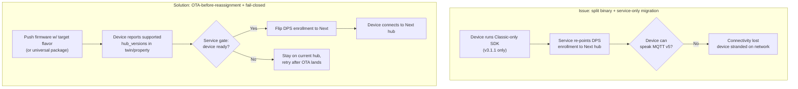

**Protocol — issue vs. solution.**

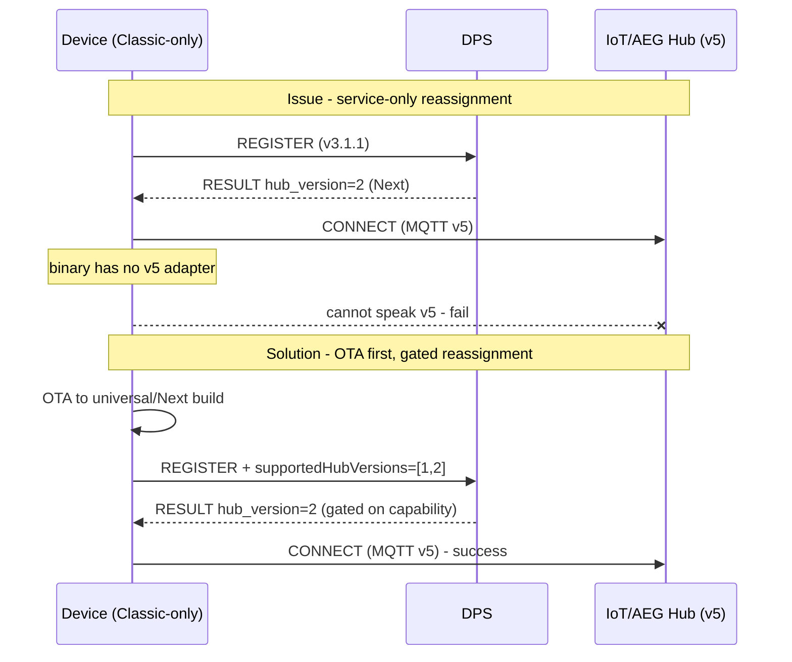

---

## 2. DPS logic duplicated across both SDKs

**Consideration.** Provisioning is always MQTT v3.1.1 and is **identical**
regardless of the destination hub flavor. A naive split copies the DPS exchange,
topic build/parse, and registration-result handling into both products.

**Mitigations.**

- Factor DPS into a **standalone `provisioning` library** (wrapping
  `az::iot::provisioning`) that both Hub SDKs depend on.
- The provisioning library returns the `hub_version` and assignment details; the
  Hub SDK decides whether it *can* honor them (see consideration 1 / 4).
- This also keeps the v3.1.1 MQTT adapter requirement in one place — the Next SDK
  still needs a v3.1.1 adapter *for DPS only*, even though its Hub session is v5.

**Flow — issue vs. solution.**

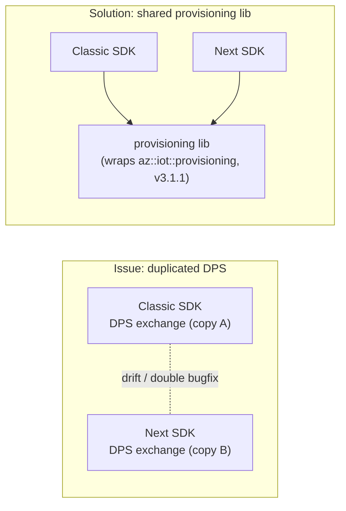

**Protocol — issue vs. solution.**

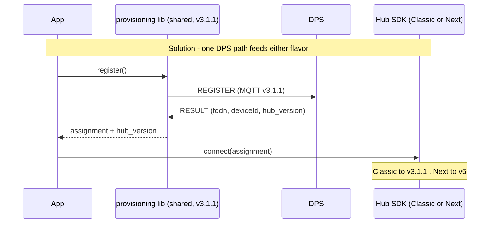

---

## 3. Large shared core duplicated

**Consideration.** Most of the SDK is flavor-agnostic. Looking at the current
`src/core` layout — `connection_client`, `dispatch`, `reconnect`,
`certificate_provider_pem`, `mqtt_iface`, `log`, `result`, `version` — only
`protocol_profile.c` and the feature-client *topic templates* actually differ
between Classic and Next. Splitting the whole tree duplicates ~80% of the code.

**Mitigations.**

- Keep a single **`core` library** (connection lifecycle, TLS/cert config,
  dispatch table, reconnect/backoff, platform abstraction, MQTT vtable). Both
  SDKs link it.
- Split only the thin layer that genuinely diverges:
  - `protocol_profile` rows (topics, response timeouts, error-code maps).
  - Feature-client topic templates / payload schemas.
  - The MQTT-version requirement (v3.1.1 vs v5 adapter selection).
- Express the split as **two build targets over one source tree** (CMake
  options, e.g. `AZ_IOT_FLAVOR=classic|next`) rather than two repos. This is the
  cheapest way to get per-flavor binaries while keeping one place to fix bugs.

**Flow — issue vs. solution.**

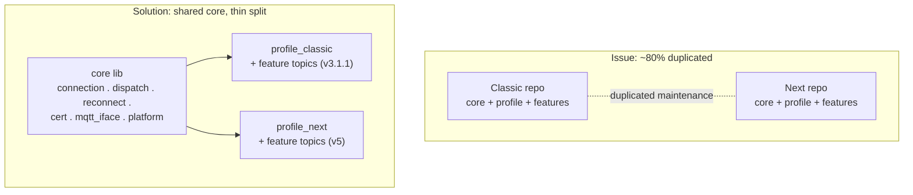

**Protocol — issue vs. solution.**

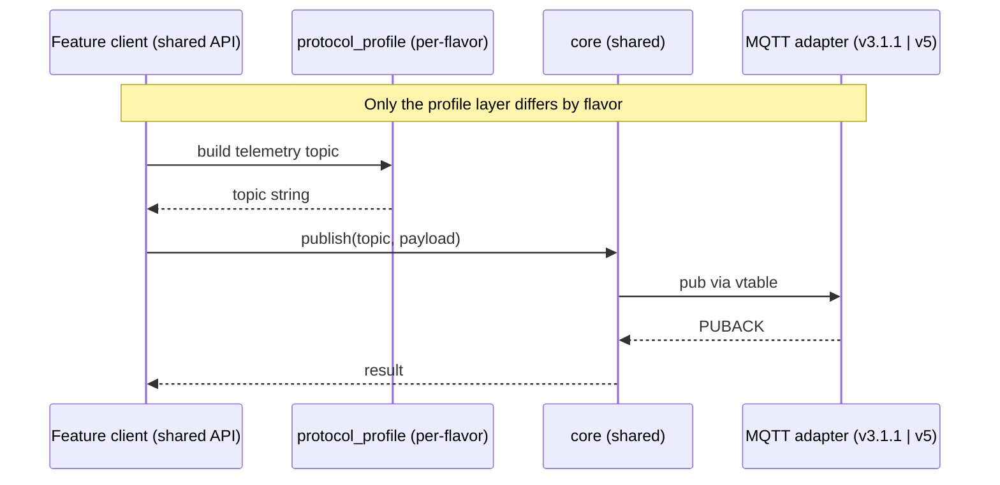

---

## 4. DPS routing vs. device capability

**Consideration.** With one universal binary, DPS can route freely because the
device can honor either answer. With split binaries, DPS may assign a flavor the
device's binary doesn't support. DPS has no inherent knowledge of which SDK a
given device runs.

**Mitigations.**

- Have the device **advertise its supported hub version(s)** during registration
  (DPS payload / custom registration data) so DPS enrollment policy can route
  only to a compatible flavor.
- Treat `hub_version` as **advisory** for split builds: the SDK validates it
  against its own capability and, on mismatch, reports
  `HUB_VERSION_UNSUPPORTED` instead of attempting an impossible connection.
- Coordinate with the **DPS service team** on enrollment-group-level policy so
  that flavor routing is explicit and gated, not implicit. (The DPS team already
  owns how `hub_version=1` vs `=2` is decided — see
  [dps-integration.md](../dps-integration.md).)

**Flow — issue vs. solution.**

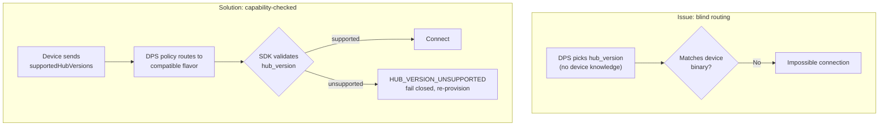

**Protocol — issue vs. solution.**

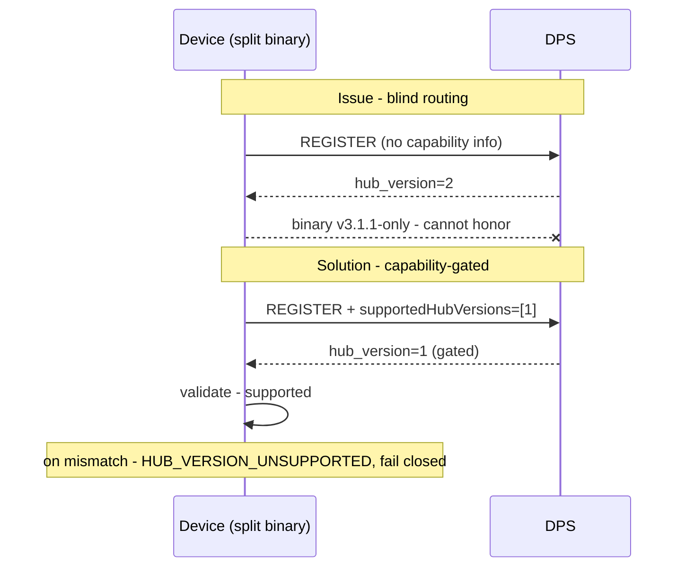

---

## 5. Customer decision & packaging burden

**Consideration.** Customers now have to *choose* an SDK up front, often before
they know which hub flavor they'll be assigned. Wrong choice = rework.

**Mitigations.**

- Unambiguous package names (e.g. `azure-iot-classic`, `azure-iot-next`) plus a
  **decision matrix** in the README (footprint vs. migration flexibility vs.
  feature set).
- A **meta/umbrella package** (`azure-iot`) that, by default, pulls the universal
  build; advanced users override to a single flavor for size.
- Document the default recommendation: *if you might migrate, or you don't know
  your hub flavor, use the universal package.*

**Flow — issue vs. solution.**

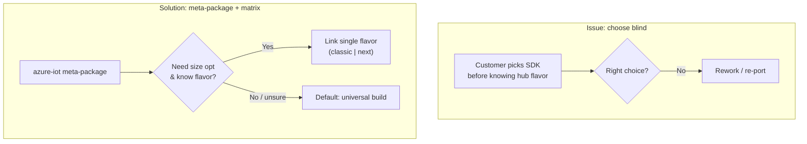

**Protocol — issue vs. solution.**

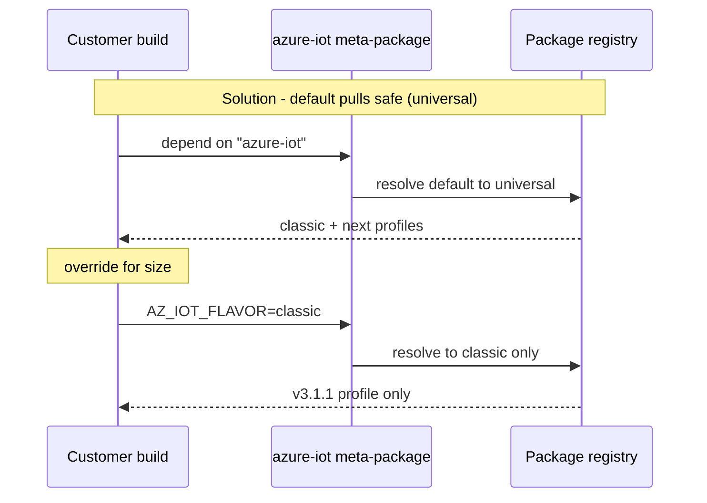

---

## 6. Feature drift between SDKs

**Consideration.** Two codebases (or two build targets maintained by different
people) drift: twin, direct methods, C2D, telemetry, and especially **ADU** can
diverge in behavior, error mapping, or API shape. ADU keeps this bounded by having
**one** channel: the twin channel (ADUv1) is cut, and the ADUv2 pull protocol,
fronted by the DPS gateway, is the only channel that will ship — it is the
implementation target, not yet built. See
[adu-client-plan.md](adu-client-plan.md). Drift would therefore be drift in the
shared engine, which is exactly what the conformance suite has to catch.

**Mitigations.**

- Define **shared feature-client interfaces** (the public `az_iot_twin_client`,
  `az_iot_direct_method_client`, etc. headers) and implement the per-flavor
  differences only behind the protocol profile.
- Run the **conformance suite** (`tests/conformance`) against *both* build
  flavors in CI, asserting identical public behavior where the protocols allow.
- Keep ADU's verify→download→install→report core shared (`adu_core`); the
  only variation is the channel implementation behind `az_iot_adu_channel`, and for now
  there is exactly one.

**Flow — issue vs. solution.**

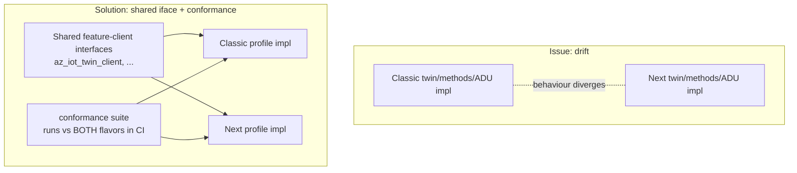

**Protocol — issue vs. solution.**

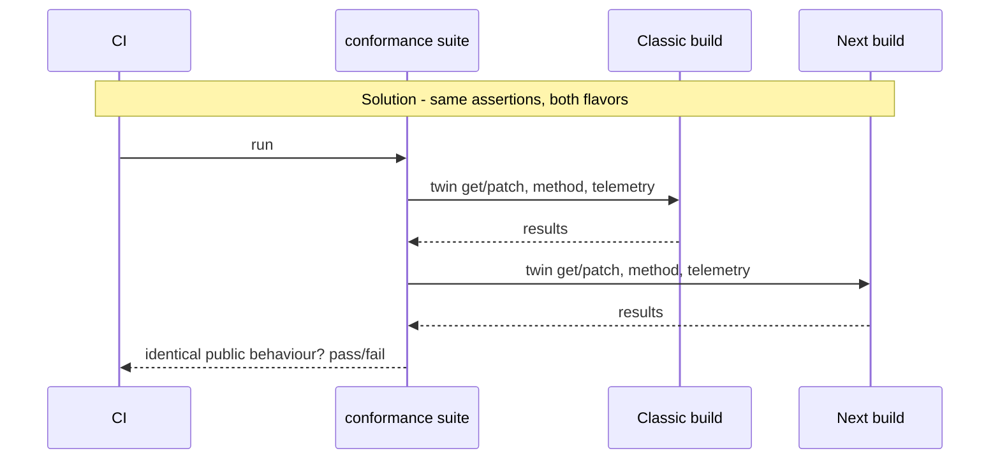

---

## 7. Doubled build / CI / test matrix

**Consideration.** Two products mean ~2× the CI permutations (adapters, TLS
stacks, OSes) and the risk of one flavor's pipeline rotting.

**Mitigations.**

- **Monorepo, two targets.** A single repo with `AZ_IOT_FLAVOR` build option
  reuses the existing CI templates and adapter matrix; the only new axis is the
  flavor flag.
- Share CI YAML templates; parameterize the flavor. Gate PRs on both flavors
  building + the shared conformance suite passing.

**Flow — issue vs. solution.**

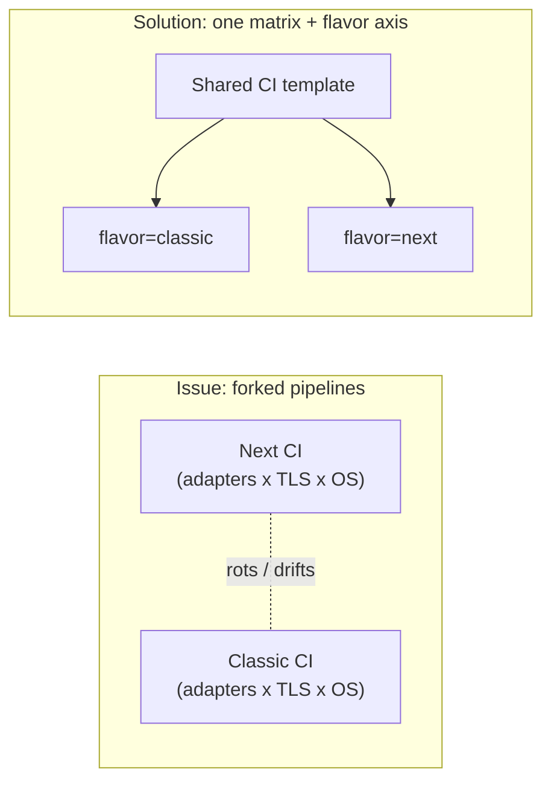

**Protocol — issue vs. solution.**

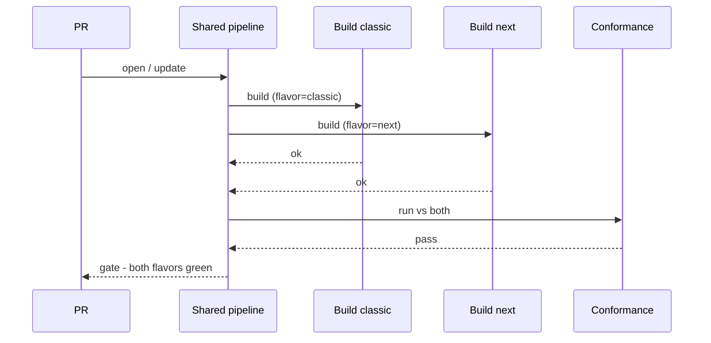

---

## 8. Versioning & support policy

**Consideration.** Two independently versioned SDKs can develop incompatible
shared-core expectations and confusing support windows.

**Mitigations.**

- **Lockstep semver for the shared `core` and `provisioning` libraries.** Both
  flavors pin the same core version.
- Allow independent **minor** versions per flavor for flavor-specific features,
  but keep a published compatibility table.
- One support/lifecycle policy document covering both flavors.

**Flow — issue vs. solution.**

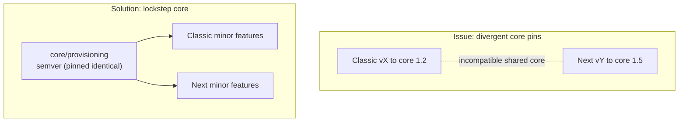

**Protocol — issue vs. solution.**

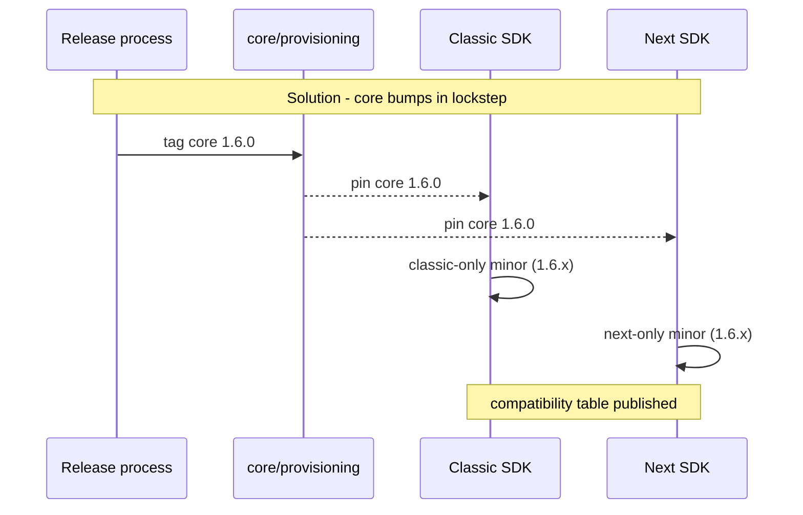

---

## 9. Documentation, samples & support fork

**Consideration.** Docs, samples (`samples/`), and support channels tend to fork
per product, doubling maintenance and confusing users.

**Mitigations.**

- One documentation site with **per-flavor tabs/sections** rather than two sites.
- A **shared sample skeleton** (connection + provisioning) with flavor-specific
  deltas highlighted, mirroring the current `samples/common` layout.
- Single issue tracker with a `flavor:classic` / `flavor:next` label taxonomy.

**Flow — issue vs. solution.**

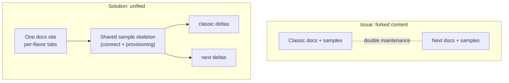

**Protocol — issue vs. solution.**

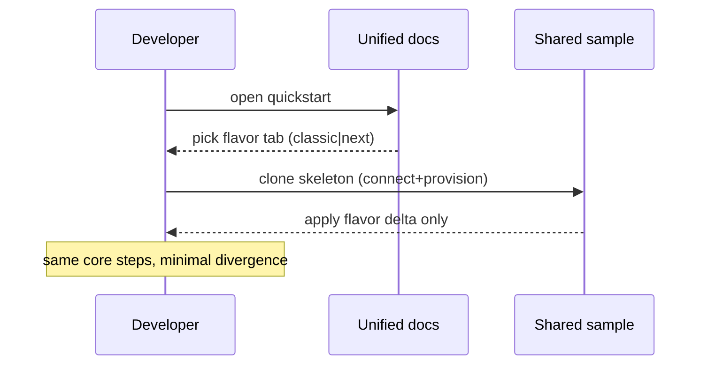

---

## 10. Footprint — the upside to preserve

**Consideration / Gain.** The legitimate motivation for splitting is **binary
size and attack surface**: a Classic-only device drops the v5 adapter and the
Next protocol profile; a Next-only device drops the v3.1.1 Hub topic tables (it
still needs v3.1.1 *for DPS*). For deeply constrained MCUs this is real flash/RAM
savings.

**Mitigations / how to keep the win without the downsides.**

- Achieve the footprint reduction via **build-time flavor selection over a shared
  tree** (consideration 3), *not* a source-level fork. You get the small binary
  and a single maintenance point.
- Use **dead-code elimination / `--gc-sections`** so the unused profile and
  unused MQTT adapter are stripped automatically when a customer links only one
  flavor — potentially delivering most of the size win even from the universal
  package, reducing the pressure to hard-split at all.

**Flow — issue vs. solution.**

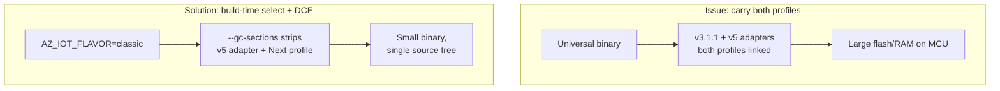

**Protocol — issue vs. solution.**

```mermaid
sequenceDiagram
    participant Build
    participant CMake
    participant Link as Linker

    Note over Build,Link: Solution - strip unused flavor at link time
    Build->>CMake: AZ_IOT_FLAVOR=classic
    CMake->>Link: compile core + classic profile
    Link->>Link: --gc-sections drop v5 adapter & Next profile
    Link-->>Build: minimal classic image
```

---

## Recommendation

Prefer a **"split by build target, not by source"** strategy:

1. One repo, one shared `core` + `provisioning`, two thin protocol-profile/feature
   layers selected by `AZ_IOT_FLAVOR`.
2. Ship three artifacts: `classic`, `next`, and a `universal` (both profiles) for
   customers who need in-field hub migration.
3. Make `hub_version` capability-checked, with the device advertising supported
   versions so DPS can gate reassignment.
4. Document the **OTA-before-reassignment** migration flow and provide a
   `HUB_VERSION_UNSUPPORTED` fail-closed path.

This captures the footprint benefit that motivates the split while preserving the
service-side migration story that the single binary gives us today.

## Version

- 06/29/2026: Created.
