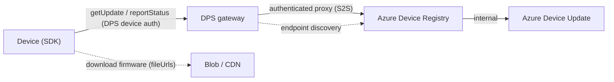
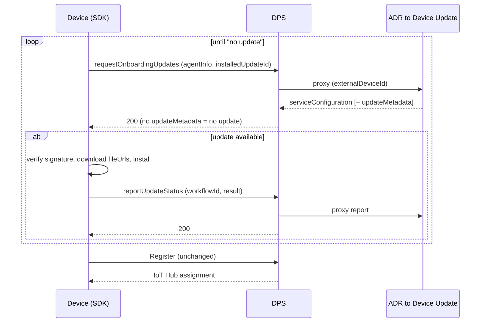

# Software updates via DPS (design summary)

> **Status: design summary of a DRAFT, Microsoft-internal spec** (api-version `2026-11-02-preview`).
> Device-SDK-oriented digest of the DPS *"ADU first-time update"* design. Contract details are still
> settling and DPS re-syncs on Device Update revisions — treat field-level specifics as provisional.
> **This is the only device-facing software updates channel the SDK will implement — Device Update for IoT Hub (twin) is cut**
> ([su-client-plan.md](su-client-plan.md#what-device-update-for-iot-hub-is-cut-means)).
> For SDK status/cost, see [su-client-plan.md](su-client-plan.md); for the shared engine/crypto core,
> see [su-client-design.md](su-client-design.md).

## What changed

Software updates' **device-facing delivery moved off a dedicated Device Update HTTPS endpoint**. Instead, **DPS** exposes three
new device-facing update APIs and acts as an **authenticated pass-through** to Azure Device Registry (ADR) →
Device Update. The device **reuses its existing DPS auth and endpoint** and **never talks to Device Update directly**. (Post-Ignite,
IoT Hub will front the *operational* flow the same way; for Ignite '26 **DPS fronts both** bootstrap and
operational as an interim.)

| | Previous software updates sketch | **Now (DPS-fronted)** |
|---|---|---|
| Device endpoint | Dedicated Device Update HTTPS data-plane endpoint (discovered) | **The device's existing DPS endpoint** (already provisioned) |
| Auth | mTLS with a customer Device Update cert | **Reuse DPS device auth** — X.509 (Phase 1); SAS / TPM later |
| Credentials on device | Device Update endpoint + creds burned in | **None new** — DPS discovers the Device Update endpoint from ADR (late binding) |
| Who talks to Device Update | Device → Device Update directly | **Device → DPS → ADR → Device Update** (DPS proxies; ADR resolves the device) |
| Primary scenario | Operational polling | **Update *before* first Register** (bootstrap), plus operational (interim) |

## Service-side shape (why DPS fronts it)

Software updates re-homes the device registry: **Azure Device Registry (ADR)** replaces IoT Hub as the entry point,
with Device Update powering updating behind it. A working deployment needs four linked resources — an ADR
**Namespace**, a Device Update **UpdateInstance**, an **IoT Hub**, and a **DPS** instance.

| Service | Owns |
|---|---|
| **ADR** | Device identities, grouping (device-query `Group` resources), deployments (`Jobs` / `Runs`), and the stored device updating state |
| **Device Update** | Uploading, hosting and distributing update files; the backend APIs that power ADR's updating capabilities |
| **IoT Hub** | The operational device gateway, and — post-Ignite — the operational updating API |
| **DPS** | The onboarding device gateway, the bootstrap updating API, and the Hub binding returned by `Register` |

Neither gateway stores update state. Where the device's reported state lands depends on the flow:

| Flow | Reported state lands in | Because |
|---|---|---|
| Operational | The device's ADR **Attributes (Update)** resource — `installedUpdateId`, last install result, agent info | The device exists in ADR |
| Bootstrap | The bootstrap **update job** | The device is not provisioned yet, so it has no ADR device resource |

Consequence for a device author: **bootstrap progress is observable only through the first-time update
job**, never on a per-device resource.

Against Device Update for IoT Hub: the registry moves from IoT Hub to ADR, grouping and deployment management move from Device Update
to ADR, and the device gateway moves from the **twin** to an **RPC** fronted by DPS (Ignite '26) and
later IoT Hub.

## The three device-facing DPS operations

The device **selects** onboarding vs regular by *which endpoint it calls* — DPS does not infer or validate the
choice; it passes the ADR/Device Update response (or error) straight through.

All three are **HTTPS POSTs on the DPS device endpoint**, under the device's own registration:

```
POST https://{dps-device-endpoint}/{idScope}/registrations/{registrationId}/{operation}?api-version=2026-11-02-preview
```

| Operation (on the wire) | Spec working name | When the device uses it |
|---|---|---|
| `requestOnboardingUpdates` | `GetOnboardingDeviceUpdate` | **Before provisioning** (not yet in ADR) — bootstrap / day-zero |
| `requestSoftwareUpdates` | `GetDeviceUpdate` | **Operational** (already provisioned) — interim, until Hub ships its API |
| `reportUpdateStatus` | `ReportDeviceUpdateStatus` | After an install attempt (**required** so the service can reconcile) |

> **The left column is what the deployed preview answers to** — verified against a live environment
> (see [Verified vs. drafted](#verified-vs-drafted)). The spec package uses the right-column names and
> writes the routes as `/devices/requestUpdates` etc.; those are service-side working names, not the
> device-facing URLs. Build against the left column.

## Architecture



- **DPS is a synchronous pass-through** — no orchestration, no per-device state, `Register` untouched.
- **Advisory, never blocking:** if an update check fails, the device just proceeds to `Register`.
- **Firmware is downloaded directly from blob** (`fileUrls`), outside the signed manifest.

## Flows

### Bootstrap — update before first Register



The device **re-checks after each successful install** and only proceeds to `Register` once it gets
*"no update"* — so multiple updates can chain before provisioning completes.

### Operational (interim)

An already-provisioned device polls `requestSoftwareUpdates` on the same shape. This DPS-fronted operational path is a
**time-boxed interim**; post-Ignite it moves to **IoT Hub's** own updating API (no device-contract change —
same request/response, different gateway).

## Contract summary

**Request** (`RequestUpdatesRequest`, both fetches):

- `agentInfo` — `{ agentSdkVersion, agentProfile (opaque capability id), compatibilityProperties (1–5 KVPs) }`;
  the service combines `agentProfile` + compat props into the **device class**. Required unless a still-current
  `agentInfoEtag` is supplied (onboarding always requires it).
- `installedUpdateId` — currently installed `{ provider, name, version }`, or `null`.
- `agentInfoEtag`, `serviceConfigEtag` — optional; let the service skip re-processing / omit unchanged config.

**Response** (`RequestUpdatesResponse`):

- `serviceConfiguration.rootKeyDownloadUrl` — root-key package URL for signature verification (omitted when the
  supplied `serviceConfigEtag` still matches).
- `serviceConfigEtag`, `agentInfoEtag` — always present.
- `updateMetadata` — **present only when an update applies**: `{ workflowId, updateManifest (opaque JSON string),
  updateManifestSignature (JWS), fileUrls (fileId → URL) }`. **Omitted ⇒ "no update" (HTTP 200, not an error).**

**Report** (`ReportStatusRequest`): `{ workflowId, installedUpdateId, installResult }` where
`installResult` = `{ outcome ∈ IN_PROGRESS|SUCCEEDED|FAILED|CANCELED|SKIPPED, failureOrigin, resultCode,
extendedResultCodes (comma-sep hex), resultDetails, stepResults{ step_0, step_1, … } }`. Each step
value has the same required `outcome`, `failureOrigin`, `resultCode`, and `extendedResultCodes`
fields plus optional `resultDetails`. In-progress reports omit `stepResults`; terminal reports
include complete entries when the manifest has steps. **Idempotent on `workflowId` alone**; a
conflicting terminal for the same id ⇒ `409 REPORT_CONFLICT`.

> Identity headers (`x-ms-external-device-id` = registrationId; `x-ms-device-id` = ADR UUID on the regular path)
> are **gateway-populated — the device sets none of them**.

## Auth & transport

- **Auth:** reuse the existing DPS device credential — no software-updates-specific credentials. The design phases
  X.509 first, with symmetric key and TPM to follow (TPM is a two-phase 401-challenge, individual-only).
  **Measured:** the deployed preview accepts a **SAS token** derived from the DPS enrollment group's
  symmetric key — `Authorization: SharedAccessSignature sr={idScope}%2Fregistrations%2F{registrationId}&sig=…&se=…&skn=registration`
  — so symmetric-key auth works today, ahead of the documented phasing. **X.509** (DPS individual
  enrollment certificate) is measured too, over HTTPS and over MQTT.
- **Transport:** **Phase 1 HTTP + MQTT**; Phase 2 AMQP. (TPM works on HTTP/AMQP only, not MQTT.)
  **Measured:** the operations work as **HTTPS REST** on the DPS device endpoint and on the device's
  DPS **MQTT** session (`$dps/registrations/...`), which is what the SDK uses.
- **api-version:** `2026-11-02-preview` — **confirmed deployed**; it is the value the reference
  environment runs with.
- **Request headers:** `Authorization` plus `x-ms-client-request-id` (a per-call GUID, for correlation).
  The device sets no identity headers.

## Verified vs. drafted

Some of this document is measured against a live environment running the deployed preview; the rest is
read off a DRAFT spec. Treat them differently.

| Measured | Still drafted / unconfirmed |
|---|---|
| api-version `2026-11-02-preview` | TPM; AMQP |
| Device-facing URL shape and the three operation names; the same operations over the DPS MQTT session | Payload caps, throttle / `Retry-After` values |
| SAS (enrollment-group symmetric key) and X.509 auth | Per-step `resultDetails`; reports with more than one step |
| `agentInfo` = `{ agentSdkVersion, agentProfile, compatibilityProperties }`; `agentProfile` sent as an integer; compatibility values match case-insensitively | Root-key-package verification end to end |
| Response `agentInfoEtag` / `serviceConfigEtag` / `updateMetadata` (null ⇒ no update); a test environment's `rootKeyDownloadUrl` is plain `http://` and its manifests are signed under test roots (`ADU.200703.R.T`) | Job-result status recorded for a SKIPPED report |
| Report `{ workflowId, installedUpdateId, installResult{ outcome, failureOrigin, resultCode, extendedResultCodes, resultDetails } }`; `resultCode` 700 = success; `failureOrigin` `AGENT_CORE` / `NOT_APPLICABLE` | The error-code table below (drawn from the spec, not exercised) |
| `stepResults` entries `{ outcome, failureOrigin, resultCode, extendedResultCodes }` accepted (single-step update); without `outcome`/`failureOrigin` the report was rejected with `400012` | |
| Re-sending the identical terminal report is accepted; a different terminal outcome for the same workflow is `409000 REPORT_CONFLICT`; SKIPPED after SUCCEEDED was accepted | |
| An onboarding job keeps offering a workflow to a device after its terminal report | |
| No separate `syncConfiguration` call | |

## Trust model

- The device **validates `updateManifestSignature`** (nested JWS / RS256) against the **root-key package** at
  `rootKeyDownloadUrl` (hardcoded Microsoft root key → SJWK signing key → manifest hash). Root-key rotation +
  `disabledSigningKeys` revocation are supported. `fileUrls` are **not** in the signed manifest.
- **Ignite defers the `accountId`-in-signature binding** (manifest-signature-v2): DPS returns **no** `accountId`,
  so the device verifies *provenance-from-Device-Update* but not *account scoping*. **Base signature validation stays
  required.**

## Error handling (device / SDK)

Drive behavior from the machine-readable **`error.code`** (`x-ms-error-code` header), never the HTTP status.

| Case | Code / status | SDK action |
|---|---|---|
| No update | 200, `updateMetadata` omitted | Nothing to apply; proceed to `Register`. **Not an error.** |
| Software updates not linked | 409 `UPDATE_ACCOUNT_NOT_LINKED` | Treat as "no update service configured" (distinct from *no update*); proceed. Don't retry. |
| Agent-info stale/unknown | 400 `OUTDATED_AGENT_INFO` / `UNKNOWN_AGENT_INFO_VERSION` | **Resend the full `agentInfo`** and retry (handle **both** codes). |
| Service-config stale | 400 `OUTDATED_SERVICE_CONFIG` | Re-check **without** the stale `serviceConfigEtag`; response returns fresh config. |
| Throttled | 429 + `Retry-After` | Wait `Retry-After`, then retry. |
| Transient upstream | 503 `UPSTREAM_UNAVAILABLE` / `INTERNAL_SERVER_ERROR` | **Get:** proceed to `Register` (advisory), retry later. **Report:** retry (must not be lost). |
| Bad request / auth / disabled | 400 / 401 / 403 | Fix request or credentials; don't retry unchanged. |

**The device is the sole retrier** (DPS fails fast, one attempt per hop) and honors `Retry-After`. `reportStatus`
is a durable write — retry until acked; safe because the service is idempotent on `workflowId`.

## Ignite '26 scope

- **In:** the 3 device APIs · X.509 auth · HTTP + MQTT · DPS fronts **bootstrap + operational (interim)** ·
  advisory pass-through · stateless.
- **Deferred (post-Ignite):** `accountId` delivery + signature binding (manifest-sig-v2) · symmetric-key & TPM
  auth · AMQP · per-enrollment-group enablement toggle · operational path moving to IoT Hub.

### Known gaps to design around

*Operational flow:*

- The interim DPS operational path supports **onboarding auth only**.
- It carries a **non-obvious dependency on the DPS enrollment group** — delete the enrollment group and
  operational updating breaks.

*Bootstrap flow:*

- Orchestration is **entirely the customer's and the agent's** responsibility. `Register` does **not**
  enforce that a device is on a given update version before provisioning it.
- A bootstrap update job **cannot be targeted at specific enrollment groups** — the update is offered to
  every compatible device across all of them.

*Deployment behaviour (what a device sees on a retry):*

- **No per-device retry.** Once a device reaches a terminal failure the only recovery is to cancel and
  reschedule the run, and devices that already installed successfully do not rejoin.
- Measured on an onboarding job: a device keeps being offered a workflow after reporting it
  SUCCEEDED; a different terminal outcome is then refused with `409000 REPORT_CONFLICT`.
- Offline devices do not appear in the job's progress metrics.

## What this means for the software updates client SDK

The **verify → download → install → report engine is unchanged** from Device Update for IoT Hub (it becomes the
transport-free `su_core`), but **Device Update for IoT Hub's twin delivery is cut** — there is no second channel to
keep working. New client work is the **transport binding + orchestration**:

1. Call the three DPS ops over the device's **existing DPS transport/auth** (X.509, HTTP/MQTT) — no Device Update endpoint,
   no mTLS, no identity headers to set.
2. **Onboarding-vs-regular endpoint selection** by provisioning state.
3. **Bootstrap orchestration:** update-check → install → report → **re-check loop** → then `Register` (advisory).
4. **ETag + agent-info/service-config handling**, including the *resend* codes.
5. **Root-key-package fetch** from `rootKeyDownloadUrl`; keep the existing JWS/RS256 verification.
6. **Advisory/retry rules:** never block `Register`; device is the sole retrier; honor `Retry-After`.

## References

- **Public REST API (TypeSpec, draft):** [Azure/azure-rest-api-specs#44617](https://github.com/Azure/azure-rest-api-specs/pull/44617) — the three device-update operations, api-version `2026-11-02-preview`.
- **Service architecture (Microsoft-internal):** *Azure Device Update v2 — Public Preview (Ignite 2026)*,
  Leo Lie / Joe Heiniger / Darko Aleksic, 7/6/2026 — ADR resource model, division of responsibilities
  across ADR / Device Update / Hub / DPS, and the Ignite '26 gap list.
- **Design spec (Microsoft-internal):** DPS *"ADU first-time update"* spec package — [Azure-IoT-Hub-DeviceRegistrationService `/specs/002-adu-first-time-update`](https://dev.azure.com/msazure/One/_git/Azure-IoT-Hub-DeviceRegistrationService?path=/specs/002-adu-first-time-update).
- Related SDK docs: [su-client-plan.md](su-client-plan.md), [su-client-design.md](su-client-design.md).
