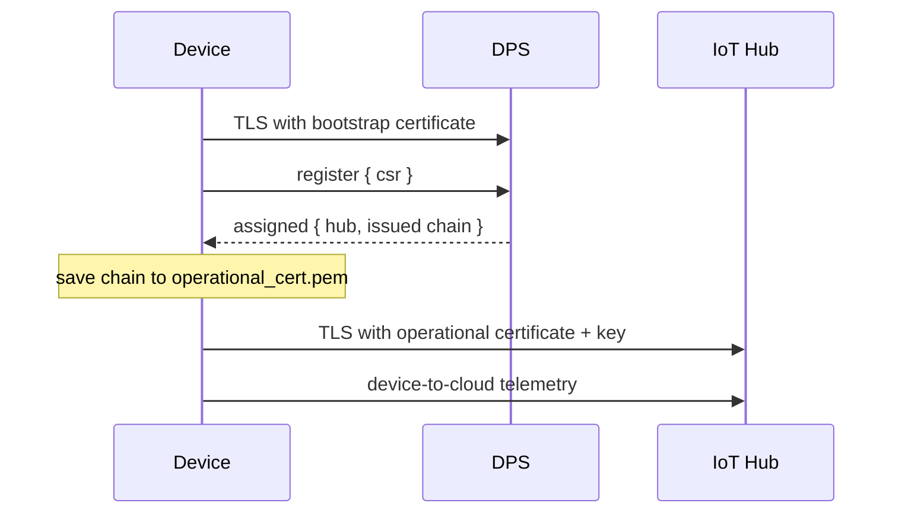

<!-- Copyright (c) Microsoft. All rights reserved.
     Licensed under the MIT license. See LICENSE file in the project root for full license information. -->

# DPS certificate issuance from a CSR (`dps_csr_managed`)

The device proves itself to DPS with a **bootstrap** X.509 certificate, sends a
certificate signing request (CSR) with its registration, and connects to IoT Hub
with the **operational** certificate that DPS issues. The operational private key
is generated on the device and never leaves it.



The SDK's OpenSSL-backed managed certificate provider does the key, CSR and file
handling; the sample only configures it. See [`main.c`](main.c).

## End-to-end sample contract

On `2026-11-02-preview` DPS MQTT sessions, the sample registers with its
bootstrap identity, persists the issued operational chain, connects to the
assigned **MQTTv3** IoT Hub with that chain, and sends one telemetry message
on the same connection. Exit code 0 requires the telemetry send callback to
report success; connection alone is not sufficient. A send rejection or a
missing callback within the bounded send window returns a nonzero exit code.
This sample does not exercise device updates or MQTT v5 hubs; it does not
confirm delivery to downstream telemetry consumers.

> Certificate management in IoT Hub and DPS is in **preview**. Service setup
> steps and CLI flags may change; the
> [Azure setup guide](https://learn.microsoft.com/azure/iot-hub/iot-hub-device-registry-setup)
> is authoritative.

## Prerequisites

- **Azure:** a DPS instance with certificate management (Azure Device Registry
  namespace + credential policy) and a linked **MQTTv3** IoT Hub. Follow the
  [setup guide](https://learn.microsoft.com/azure/iot-hub/iot-hub-device-registry-setup)
  up to, but not including, "Create an enrollment in DPS" – this sample needs an
  X.509 enrollment group (step 2 below).
- **Device:** CMake 3.21+, Ninja, a C99 compiler, OpenSSL 3.0+ (headers and
  libraries). Paho MQTT C is fetched at configure time.

## 1. Create a bootstrap identity (test only)

A test CA, and a device certificate it signs whose common name is the
registration ID. Use your own PKI in production.

```sh
REG_ID=my-device

openssl req -x509 -newkey ec -pkeyopt ec_paramgen_curve:P-256 -nodes -days 30 \
  -subj "/CN=csr-sample-bootstrap-ca" \
  -addext "basicConstraints=critical,CA:TRUE" -addext "keyUsage=critical,keyCertSign,cRLSign" \
  -keyout bootstrap-ca.key -out bootstrap-ca.pem

openssl req -new -newkey ec -pkeyopt ec_paramgen_curve:P-256 -nodes \
  -subj "/CN=$REG_ID" -keyout bootstrap.key -out bootstrap.csr

printf "basicConstraints=critical,CA:FALSE\nkeyUsage=critical,digitalSignature\nextendedKeyUsage=clientAuth\n" > leaf.ext
openssl x509 -req -in bootstrap.csr -CA bootstrap-ca.pem -CAkey bootstrap-ca.key -CAcreateserial \
  -days 30 -extfile leaf.ext -out bootstrap-leaf.pem

cat bootstrap-leaf.pem bootstrap-ca.pem > bootstrap.pem   # leaf first, then its issuers
```

## 2. Create the X.509 enrollment group

Attach the CA from step 1 and the credential policy that issues operational
certificates:

```sh
az iot dps enrollment-group create -g <RESOURCE_GROUP> --dps-name <DPS_NAME> \
  --enrollment-id <GROUP_ID> --certificate-path bootstrap-ca.pem \
  --credential-policy-name <POLICY_NAME>
```

`--credential-policy-name` is the flag in the `azure-iot` CLI extension
0.32.0b1+ (install with `--allow-preview`). The setup guide shows it as
`--credential-policy`; check `az iot dps enrollment-group create -h`. Without a
credential policy, DPS assigns the device but issues no certificate, and the
sample fails (see [Troubleshooting](#troubleshooting)).

## 3. Build

From `c/`:

```sh
cmake --preset linux-gcc-debug
cmake --build --preset linux-gcc-debug --target az_iot_sample_auth_dps_csr_managed
```

On Windows, use the `windows-msvc-debug` preset and make OpenSSL 3 visible to CMake
(for example through vcpkg; see [`c/CMakePresets.json`](../../../CMakePresets.json)).

The target exists only when OpenSSL 3.0+ is found and the Paho adapter is enabled
(`AZ_IOT_WITH_CERT_PROVIDER_MANAGED`, `AZ_IOT_WITH_PAHO`). Otherwise `--target`
fails with `unknown target`; the configure output must include
`building managed certificate provider`.

## 4. Run

```sh
export AZ_IOT_DPS_ID_SCOPE=<ID_SCOPE>
export AZ_IOT_DPS_REGISTRATION_ID=$REG_ID
export AZ_IOT_CLIENT_CERT=$PWD/bootstrap.pem
export AZ_IOT_CLIENT_KEY=$PWD/bootstrap.key
export AZ_IOT_TRUSTED_CA=/etc/ssl/certs/ca-certificates.crt

./build/linux-gcc-debug/samples/authentication/az_iot_sample_auth_dps_csr_managed
```

Exit code is 0 only when the hub connection succeeds with an issued certificate
and the telemetry send callback reports success.
Expected output (SDK log lines omitted):

```
[dps_csr] dps: Connecting (AZ_IOT_OK)
[dps_csr] dps: Connected (AZ_IOT_OK)
[dps_csr] operational certificate issued (2 cert(s) in chain), saved to operational_cert.pem
...
[dps_csr] hub: Connected (AZ_IOT_OK)
[dps_csr] connected to <hub>.azure-devices.net with the operational certificate
[dps_csr] telemetry sent with operational certificate
```

The chain length depends on the credential policy.

### Environment variables

| Variable | Required | Meaning |
|----------|----------|---------|
| `AZ_IOT_DPS_ID_SCOPE` | yes | DPS ID scope. |
| `AZ_IOT_DPS_REGISTRATION_ID` | yes | Registration ID; must equal the bootstrap certificate's CN. |
| `AZ_IOT_CLIENT_CERT` | yes | Bootstrap certificate chain (PEM, leaf first). |
| `AZ_IOT_CLIENT_KEY` | yes | Bootstrap private key (PEM). |
| `AZ_IOT_TRUSTED_CA` | yes | CA bundle (PEM) that validates the DPS and IoT Hub **server** certificates, e.g. the system bundle or DigiCert Global Root G2. Not the bootstrap CA. |
| `AZ_IOT_DPS_GLOBAL_ENDPOINT` | no | Provisioning host. Default `global.azure-devices-provisioning.net`. |
| `AZ_IOT_OPERATIONAL_KEY` | no | Operational key file. Default `operational_key.pem`. |
| `AZ_IOT_OPERATIONAL_CERT` | no | Issued chain file. Default `operational_cert.pem`. |
| `AZ_IOT_DPS_REGISTRATION_PAYLOAD` | no | JSON object sent with the CSR, e.g. `{"modelId":"dtmi:com:example:Thermostat;1"}`. A payload returned by the allocation policy is printed. |

## Later runs

- The operational key is loaded from `AZ_IOT_OPERATIONAL_KEY`. If the file is
  missing, unreadable or not a PEM private key, a new EC P-256 key is generated and
  **overwrites** it.
- Every run registers again with a CSR over a new key. When DPS issues its
  certificate, both `AZ_IOT_OPERATIONAL_KEY` and `AZ_IOT_OPERATIONAL_CERT` are
  replaced; if storing them fails, the previous pair stays in use. A run
  stopped mid-update is completed or undone on the next start.

## Security notes

- `operational_key.pem` is written **unencrypted**, with permissions from the
  process umask (world-readable under the common `022`). Run with `umask 077` or
  keep the files in a directory only the device user can read.
- For keys that must not exist as files, see
  [`hsm_pkcs11`](../README.md#hsm_pkcs11) and
  [`custom_certificate_provider`](../README.md#custom_certificate_provider).
- The step 1 certificates are for testing only.

## Troubleshooting

| Symptom | Likely cause |
|---------|--------------|
| `provisioning failed: AZ_IOT_ERR_NOT_FOUND` | DPS assigned the device but returned no certificate: the enrollment group has no credential policy. |
| `provisioning failed: AZ_IOT_ERR_AUTH` | DPS refused the bootstrap certificate: it does not chain to the group's CA. |
| Repeated `DPS code 401...` lines, then `timed out` (last dps error `AZ_IOT_ERR_DPS`) | DPS rejected the registration, e.g. the certificate CN differs from `AZ_IOT_DPS_REGISTRATION_ID` or no enrollment matches. DPS verdicts are retried, so the sample runs into the timeout. |
| `hub connection failed: AZ_IOT_ERR_AUTH` | IoT Hub refused the operational certificate: the policy CA is not synced to the hub (`az iot adr ns credential sync`). |
| `hub connection failed: AZ_IOT_ERR_NOT_SUPPORTED` | DPS assigned an MQTT v5 hub. This sample connects to MQTTv3 hubs only (MQTT 3.1.1). |
| `open failed` immediately, after an SDK error `registration_payload must be a single well-formed JSON object` | `AZ_IOT_DPS_REGISTRATION_PAYLOAD` is not a single JSON object. |
| `timed out` (last dps error `AZ_IOT_ERR_MQTT` or `AZ_IOT_ERR_TLS`) | DPS unreachable (network, proxy, `AZ_IOT_DPS_GLOBAL_ENDPOINT`) or server TLS failing (`AZ_IOT_TRUSTED_CA`). |
| `telemetry send failed` or `timed out waiting for telemetry send completion` | Hub rejected the publish, the connection dropped, or no send callback arrived within 30 s. |

The sample stops at the first failure the SDK marks as not retriable, or when the SDK faults; anything else is retried until the 60 s timeout, which prints the last error per scope.

The SDK logs at `INFO` to stderr; change the level in `main()` for more detail.

## Where to look in `main.c`

| What | Code |
|------|------|
| Provider setup (bootstrap + operational files, key type) | `az_iot_certificate_provider_managed_init()` |
| Opt in to issuance | `opts.dps.request_operational_certificate = true` and `opts.csr_payload_buffer` |
| Custom registration payload | `opts.dps.registration_payload`, `opts.dps.registration_body_buffer` |
| Issuance notification | `az_iot_connection_client_set_operational_cert_callback()` |
| Progress and failure reasons | `az_iot_connection_client_add_state_observer()` |
| Send one telemetry message over the issued identity | `az_iot_mqttv3_telemetry_client_send()` and `on_send_done()` |

Design background: [certificate-management.md](../../../docs/eng/certificate-management.md).
