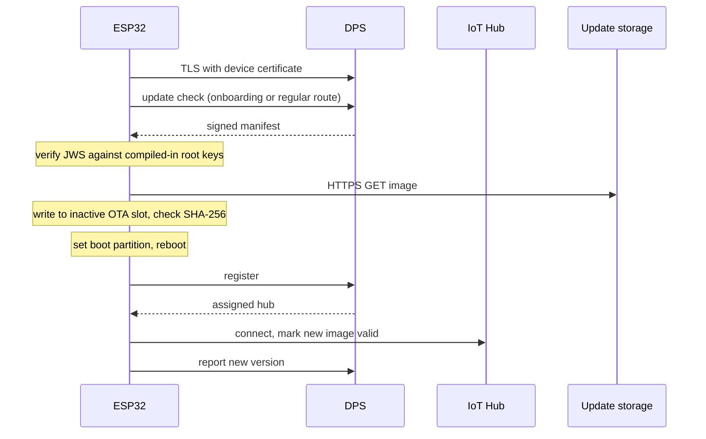

<!--
Copyright (c) Microsoft. All rights reserved.
Licensed under the MIT license. See LICENSE file in the project root for full license information.
-->

# Software Updates Sample - Real OTA Firmware Update on ESP32

This sample performs a **genuine over-the-air firmware update** on an ESP32 using
Azure software updates. Unlike the [PC samples](../pc/simulated_onboarding/README.md),
nothing is simulated: the payload is a real ESP32 app image, flashed into the
inactive OTA slot and booted.



## Sample features
- Target platform: **ESP32** (ESP-IDF v6.0), any chip revision.
- Real download, install, reboot and automatic rollback; nothing simulated.
- Asks on the onboarding route until it has connected to its hub, then on the
  regular route every `SU_POLL_INTERVAL_S`. See [Update-check route](#update-check-route).
- Native ESP-IDF components: `esp-mqtt` (transport), mbedTLS PSA Crypto (manifest
  verification), `esp_http_client` + `app_update` (OTA).
- Optional [production security profile](#production-security-profile-optional),
  off by default.

## Service Requirements
- Azure Device Provisioning service, with an X.509 enrollment for the device and a
  linked Azure IoT Hub.
- Azure Device Update, in the DPS-fronted model the [PC samples](../pc/simulated_onboarding/README.md)
  use.

## Sample Termination

It runs until powered off, like the agent it stands in for. It reboots
(`esp_restart()`) when:

| Cause | Log line |
|---|---|
| An update was installed; boots the new image | `rebooting into the new firmware to apply the update` |
| Wi-Fi fails after 10 retries | `Wi-Fi connect failed; rebooting` |
| No hub connection within about 120 s (twice `AZ_IOT_DPS_HOLD_TIMEOUT_MS`), or provisioning faulted | `could not connect; rebooting` |
| The connection faults while no update is in flight | `connection faulted; rebooting` |
| An SDK call fails at startup | `<call> failed` |

---

## Configure the sample

### Device identity

The build embeds these files into the firmware (`EMBED_TXTFILES`). The committed
files are placeholders.

| File | Required | Content |
|---|---|---|
| `main/certs/device_cert.pem` | yes | Device certificate (PEM). CN must equal `SU_DPS_REGISTRATION_ID`. |
| `main/certs/device_key.pem` | yes | Unencrypted device private key (PEM). |
| `main/certs/trusted_ca.pem` | no | CA bundle for the DPS and hub **server** certificates. Leave the placeholder to use the ESP-IDF certificate bundle, which trusts the Azure roots. |

> The device key is compiled into the image. Use a per-device key and treat the
> binary as a secret. The [security profile](#production-security-profile-optional)
> encrypts flash, but does not move the key into hardware.

### Settings

Set with `idf.py menuconfig` → *Software Updates ESP32 Sample Configuration*
([`main/Kconfig.projbuild`](main/Kconfig.projbuild)). Values land in the git-ignored
`sdkconfig`.

| Setting | Required | Meaning |
|---|---|---|
| `SU_WIFI_SSID` | yes | Wi-Fi network (WPA2). |
| `SU_WIFI_PASSWORD` | yes | Wi-Fi password. |
| `SU_DPS_ID_SCOPE` | yes | DPS ID scope. |
| `SU_DPS_REGISTRATION_ID` | yes | Registration id / device id; must equal the certificate CN. |
| `SU_POLL_INTERVAL_S` | no | Seconds between update checks once connected. Default `60`, range 10–86400. |

**Matched against a deployed update.** A value that does not match the imported
update is answered "nothing for me", which looks exactly like "nothing deployed".
Change them in [`main/app_main.c`](main/app_main.c).

| Property | Value |
|---|---|
| Manufacturer | `Espressif` |
| Model | `ESP32-WROOM` |

**Reported, not matched.** The installed update id comes from
[`main/su_version.h`](main/su_version.h) and says what the firmware is.

| Property | Default |
|---|---|
| `SU_UPDATE_PROVIDER` | `Contoso` |
| `SU_UPDATE_NAME` | `ESP32-SU` |
| `SU_UPDATE_VERSION` | `1.0.0` |

<details>
<summary>Shortcut: configure with <code>Set-SuEsp32Config.ps1</code></summary>

[`Set-SuEsp32Config.ps1`](../../common/scripts/Set-SuEsp32Config.ps1) copies the
certificate and key from `AZ_IOT_CLIENT_CERT` / `AZ_IOT_CLIENT_KEY` (and the CA from
`AZ_IOT_TRUSTED_CA` if it is a real certificate), prompts for Wi-Fi, and writes the
four required settings into `sdkconfig`.

```powershell
../../common/scripts/Set-SuEsp32Config.ps1 -IdfExportScript <ESP-IDF>/export.bat
```

</details>

---

## Build and run

### Prerequisites

- **[ESP-IDF v6.0](https://docs.espressif.com/projects/esp-idf/en/v6.0/esp32/get-started/index.html)**,
  with its environment exported in the shell (`export.sh`, `export.ps1` or `export.bat`).
- An **ESP32 board with 4 MB flash** (for example ESP32-DevKitC with an
  ESP32-WROOM-32 module) and its USB serial port.
- The `azure-sdk-for-c` submodule, which the ESP-IDF build compiles from source:

  ```sh
  git submodule update --init c/deps/azure-sdk-for-c
  ```

`esp-mqtt` is fetched from the ESP Component Registry (`espressif/mqtt`) on the
first build.

### Build and flash

From `c/samples/software_update/esp32`:

```sh
idf.py set-target esp32
idf.py menuconfig        # settings above
idf.py build flash monitor
```

Add `-p <PORT>` to `flash` / `monitor` when more than one serial port is present.
Leave the monitor running. Expected output (other log lines omitted):

```
I (...) su_esp32: Software updates ESP32 sample starting (firmware version 1.0.0)
I (...) wifi: connecting to SSID 'my-ssid'
I (...) wifi: got IP: 192.168.1.23
I (...) su_esp32: checking for updates on the onboarding route
I (...) su_esp32: connection: AZ_IOT_CONN_STATE_IDLE -> AZ_IOT_CONN_STATE_CONNECTING (reason=0x00000000)
I (...) su_esp32: connection: AZ_IOT_CONN_STATE_CONNECTING -> AZ_IOT_CONN_STATE_CONNECTED (reason=0x00000000)
I (...) su_esp32: connected; reporting Espressif/ESP32-WROOM installedUpdateId=1.0.0
I (...) su_esp32: checking for updates every 60 s
```

---

## Deploy an update

1. Raise `SU_UPDATE_VERSION` in [`main/su_version.h`](main/su_version.h).
2. `idf.py build`, producing `build/su_esp32.bin`.
3. Import `build/su_esp32.bin` into Device Update as update
   `SU_UPDATE_PROVIDER` / `SU_UPDATE_NAME` / `SU_UPDATE_VERSION`, with compatibility
   `manufacturer=Espressif`, `model=ESP32-WROOM`, and deploy it to the device.
4. Do not flash this image. The device finds the deployment at its next check
   (within `SU_POLL_INTERVAL_S`), downloads and installs it, reboots, and reports
   the new version:

```
I (...) su_ota: downloading <size> bytes -> partition 'ota_1' @0x001f0000
I (...) su_ota: download complete: <size> bytes written
I (...) su_ota: install step 0 complete; reboot required to apply
I (...) su_esp32: rebooting into the new firmware to apply the update
...
I (...) su_esp32: Software updates ESP32 sample starting (firmware version 1.0.1)
I (...) su_esp32: resumed persisted workflow at state: <state>
I (...) su_ota: image confirmed valid; rollback cancelled
```

> [`New-SuEsp32Image.ps1`](../../common/scripts/New-SuEsp32Image.ps1) builds the
> image, then imports and deploys it through the IoT-Hub-based Device Update model.
> That deployment is not offered to this sample; import the `.bin` yourself.

---

## Production security profile (optional)

The default build enables no eFuse-burning feature and runs on any ESP32 chip
revision. For production, layer these opt-in overlays on top of
`sdkconfig.defaults`:

| Feature | Setting |
|---|---|
| Secure Boot | v2 (RSA-3072); v1 (ECDSA P-256) on ESP32 below rev v3.0 |
| Flash encryption | Release mode |
| NVS encryption | Keys in the encrypted `nvs_keys` partition (ESP32, and every chip in the rehearsal); HMAC-derived on ESP32-S3/C3/C6 (eFuse key block 2) |
| Partition table | [`partitions_secure.csv`](partitions_secure.csv) at 0xD000, for the larger bootloader; same A/B app slots |

> **Irreversible.** The first boot of such an image burns eFuses. Download mode,
> JTAG and reflashing become restricted, and a lost signing key means the device
> can no longer be updated. Rehearse with virtual eFuses first, then use a spare
> board.

1. Generate a signing key in this directory, once. Keep it private; it is
   git-ignored. For production, ESP-IDF recommends generating it with OpenSSL or
   an HSM.

   ```sh
   # Secure Boot v2 (ESP32 rev >= v3.0, ESP32-S3/C3/C6)
   espsecure generate-signing-key --version 2 --scheme rsa3072 secure_boot_signing_key.pem
   # Secure Boot v1 (ESP32 below rev v3.0)
   espsecure generate-signing-key --version 1 secure_boot_signing_key.pem
   ```

2. Read the chip revision: `idf.py -p <PORT> efuse-summary`, or the
   `Chip is ... (revision vX.Y)` line printed by `esptool`.

3. Select the overlays for the chip.

   | Chip | `SDKCONFIG_DEFAULTS` |
   |---|---|
   | ESP32 rev >= v3.0, ESP32-S3/C3/C6 | `sdkconfig.defaults;sdkconfig.secure` |
   | ESP32 below rev v3.0 | `sdkconfig.defaults;sdkconfig.secure;sdkconfig.secure_esp32_legacy` |
   | Rehearsal (any of the above) | append `;sdkconfig.secure_virtual_efuse` |

4. Build with its own `sdkconfig` and build directory. An existing `sdkconfig`
   takes precedence over the overlays, so reusing the one from
   [Build and flash](#build-and-flash) can silently build without them.
   `set-target` creates `sdkconfig.production` from the overlays; enter the
   [settings](#settings) again, then check the profile is active before flashing.
   Erase the flash before the first flash of a profile: the partition table moves,
   and leftover data in the new NVS range can make `nvs_flash_init()` fail.

   ```sh
   SECURE=(-B build-secure -D SDKCONFIG=sdkconfig.production \
           -D "SDKCONFIG_DEFAULTS=sdkconfig.defaults;sdkconfig.secure;sdkconfig.secure_virtual_efuse")
   idf.py "${SECURE[@]}" set-target esp32
   idf.py "${SECURE[@]}" menuconfig
   grep -E '^CONFIG_(SECURE_BOOT|SECURE_FLASH_ENC_ENABLED|NVS_ENCRYPTION)=y' sdkconfig.production   # 3 lines
   idf.py "${SECURE[@]}" -p <PORT> erase-flash
   idf.py "${SECURE[@]}" -p <PORT> build flash monitor
   ```

   PowerShell:

   ```powershell
   $secure = '-B', 'build-secure', '-D', 'SDKCONFIG=sdkconfig.production',
             '-D', 'SDKCONFIG_DEFAULTS=sdkconfig.defaults;sdkconfig.secure;sdkconfig.secure_virtual_efuse'
   idf.py @secure set-target esp32
   idf.py @secure menuconfig
   Select-String '^CONFIG_(SECURE_BOOT|SECURE_FLASH_ENC_ENABLED|NVS_ENCRYPTION)=y' sdkconfig.production   # 3 lines
   idf.py @secure -p <PORT> erase-flash
   idf.py @secure -p <PORT> build flash monitor
   ```

   To switch overlays, for example from the rehearsal to the real profile, delete
   `build-secure` and `sdkconfig.production` and repeat this step, including the
   erase. Both are git-ignored. Do not erase a device the real profile has booted
   on: Secure Boot and flash encryption stay enabled in eFuse, so it would no
   longer boot, and serial flashing is restricted.

   The rehearsal writes eFuse changes to the `efuse_em` partition instead of the
   chip, and does not protect flash contents. Never ship it.

5. Build update images with the same arguments and signing key. Unsigned or
   wrongly signed images fail the OTA and boot checks.

With Secure Boot v1, `idf.py flash` does not flash the bootloader: run
`idf.py bootloader`, then the `esptool write-flash` command it prints, once. It is
a one-time flash; the bootloader can never be changed afterwards. With Secure Boot
v2, `idf.py flash` includes the bootloader (`CONFIG_SECURE_BOOT_FLASH_BOOTLOADER_DEFAULT`).

The profile follows ESP-IDF's
[security guide](https://docs.espressif.com/projects/esp-idf/en/v6.0/esp32/security/security.html).

---

## Additional Details

### Layout

```
samples/software_update/esp32/
├── CMakeLists.txt                   ESP-IDF project
├── partitions.csv                   A/B OTA partition table (4 MB flash)
├── partitions_secure.csv            same, plus nvs_keys / efuse_em (security profile)
├── sdkconfig.defaults               target, flash size, rollback, MQTT v5, mbedTLS
├── sdkconfig.secure[.<target>]      security profile (opt-in)
├── sdkconfig.secure_esp32_legacy    ESP32 below rev v3.0: Secure Boot v1
├── sdkconfig.secure_virtual_efuse   rehearse the profile without burning eFuses
├── components/
│   ├── azure-iot-sdk/               this repo's src/ as an ESP-IDF component
│   └── azure-sdk-for-c/             az_core + az_iot from the submodule
└── main/
    ├── app_main.c                   Wi-Fi → DPS → software updates loop
    ├── az_iot_mqtt_esp.[ch]         esp-mqtt adapter (MQTT 3.1.1 + 5)
    ├── az_iot_cert_embedded.[ch]    in-memory X.509 certificate provider
    ├── wifi_connect.[ch]            station-mode Wi-Fi
    ├── su_version.h                 firmware version
    ├── Kconfig.projbuild            settings
    └── certs/                       embedded PEM files
```

`main/CMakeLists.txt` also compiles two adapters from outside the sample:
[`adapters/su/crypto_mbedtls`](../../../adapters/su/crypto_mbedtls/) (RS256 /
SHA-256 over PSA Crypto) and [`adapters/su/esp32`](../../../adapters/su/esp32/)
(OTA platform hooks).

### How the OTA flow works

| Platform hook | ESP32 implementation |
|---|---|
| `download` | `esp_http_client` GET → `esp_ota_write` into the next OTA partition |
| `read_file` | `esp_partition_read`, so core can run the SHA-256 check on the written image |
| `is_installed` | Compares the manifest version with `SU_UPDATE_VERSION` |
| `install` | `esp_ota_end` + `esp_ota_set_boot_partition`; returns `REBOOT_REQUIRED` |
| `apply` | No-op; the new image is already running |
| `restore` | Rollback to the running partition |
| `persist` / `load` state | NVS namespace `su_sample`, key `wf_state` (resume across the reboot) |

Once connected to its hub, the new image calls `su_esp32_ota_mark_valid()`
(`esp_ota_mark_app_valid_cancel_rollback`). If it crashes or never connects, the
bootloader returns to the previous slot (`CONFIG_BOOTLOADER_APP_ROLLBACK_ENABLE`).

### Update-check route

A device that has never connected to its hub has no device record, so it asks on
the onboarding route (`az_iot_su_client_request_onboarding_update()`). After its
first hub connection it records that in NVS (namespace `su_app`, key `registered`)
and asks on the regular route (`az_iot_su_client_request_update()`) from then on.
`idf.py erase-flash` returns it to the onboarding route.

An update is offered only on the route matching its job type. A check not
answered within half the poll interval (at most 60 s) is abandoned and asked again
at the next poll. No check is made while a deployment is in flight.

### Root keys

Manifests are verified against `az_iot_su_microsoft_root_keys()`, Microsoft's
production software updates roots compiled into the SDK. See
[Root keys](../pc/simulated_onboarding/README.md#root-keys) in the PC sample.

### Troubleshooting

| Symptom | Likely cause |
|---------|--------------|
| `retrying Wi-Fi connect (n/10)`, then `Wi-Fi connect failed; rebooting` | Wrong `SU_WIFI_SSID` / `SU_WIFI_PASSWORD`, or not a WPA2 network. |
| `could not connect; rebooting` | DPS refused the device: certificate CN differs from `SU_DPS_REGISTRATION_ID`, no matching enrollment, or the placeholder certificate is still embedded. |
| Connected, but no update is ever offered | Compatibility mismatch (`Espressif` / `ESP32-WROOM`), wrong route for the job type, or the update was deployed through the IoT-Hub-based model. |
| `su_ota: http status ...` or `http open failed` | Download URL unreachable, or TLS to the storage host failed. |
| `su_ota: esp_ota_write failed` | Image larger than the 1856 KB OTA slot. |
| `NVS write failing; update reboot deferred` | NVS full or failing; the reboot waits until the workflow state is stored. |
| New image boots, then the old version comes back | The new image crashed or never connected, so the bootloader rolled back. |

The SDK logs at `INFO`; change the level in `app_main()` for more detail.

### Where to look in `main/app_main.c`

| What | Code |
|------|------|
| Embedded certificates | `az_iot_cert_embedded_init()` |
| esp-mqtt transports (3.1.1 + 5) | `az_iot_esp_mqtt_factory_create_v3_1_1()`, `az_iot_esp_mqtt_factory_create_v5()` |
| OTA hooks, crypto, root keys | `su_esp32_ota_hooks()`, `az_iot_su_crypto_mbedtls_hooks()`, `az_iot_su_microsoft_root_keys()` |
| Compatibility properties | `dp.manufacturer`, `dp.model` |
| Resume after the OTA reboot | `az_iot_su_client_resume()` |
| Route selection | `app_request_check()`, `app_is_registered()` |
| Poll loop and reboot | the `for (;;)` loop at the end of `app_main()` |
