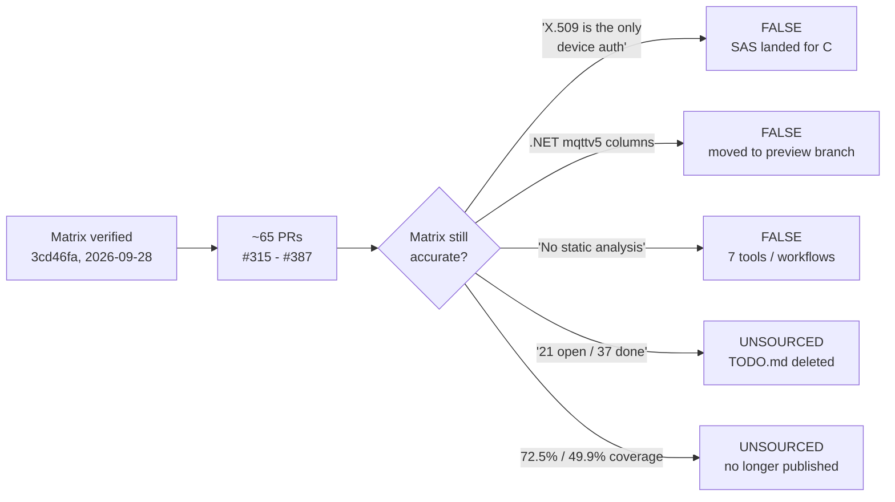
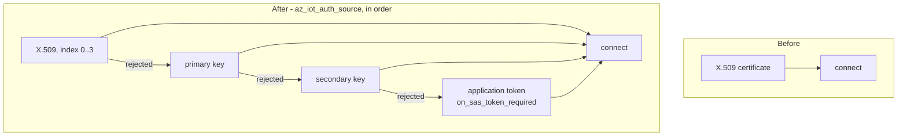
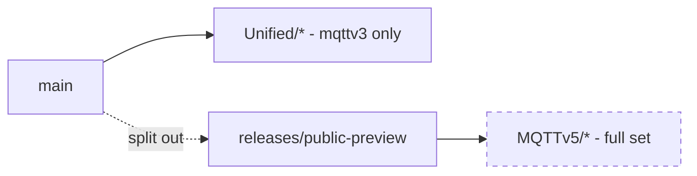

# PR 393 — refresh the client feature matrix to `a453698`

## The problem

`docs/eng/azure-iot-sdk-feature-matrix.md` was last verified against `3cd46fa` (2026-09-28). Roughly 65 pull requests merged in the ten days that followed. Two of its load-bearing statements had become false, and two of its figures had lost their source.

A feature matrix is read to decide what is safe to depend on. A stale "No" against a feature that now exists is worse than no entry at all, because it is acted upon.

## What changed, and why those rows

### 1. SAS authentication — the headline correction

Earlier revisions led with "X.509 is the **only** device auth in either library". Eight merged PRs made that wrong for C.

Scope matters and is recorded per role: SAS works for **DPS and the mqttv3 hub**; the **mqttv5 hub still refuses it**. A single "Yes" would have been as misleading as the old "No", so the row reads Partial with the boundary named.

### 2. The .NET mqttv5 column

The mqttv5 API set moved from `main` to `releases/public-preview`. `dotnet/src` has no `MQTTv5/` directory and `DoesClientSupportHubType` accepts Classic only.

Those cells became `N/A`, not `No`. `No` would assert the feature does not exist; it exists on a branch this matrix does not track. The preamble states that explicitly so a reader is not left inferring it from a blank.

### 3. Withdrawn rather than updated

`c/docs/TODO.md` was deleted upstream. Every "21 open / 37 done" count and the bullets derived from it lost their source.

The honest options were:

| Option | Why not |
|---|---|
| Keep the old counts | States as current a number whose source no longer exists |
| Re-derive a count from code | Invents a denominator the project never agreed |
| **Withdraw, rebuild §11 from code markers, say so** | **Chosen** — the reader learns the basis changed |

The same reasoning applies to coverage: `code-coverage.md` now defines per-component floors and patch coverage instead of an overall figure, so 72.5 % / 49.9 % is withdrawn and the absence is stated.

## Why not other approaches

- **Patch only the rows the new PRs touch.** This is what the previous revision did, and it is how the merged-PR-recorded-as-draft error survived two revisions. Every pre-existing row was re-verified against code this time.
- **Trust PR titles and descriptions.** They say what a change intends, not what landed. Each claim here cites a file and line read from the tree.
- **Drop the .NET mqttv5 columns entirely.** That would lose the fact that the work exists and where. Marking them `N/A` with a reason keeps it.

## Verification

Two independent read-only passes over `/c` and `/dotnet` at `a453698`, each required to cite file:line and to flag anything it could not settle. Both reported `unverified` items, which are carried into the caveats rather than guessed: whether the pipeline SBOM is published as an artifact, and .NET coverage percentages.

Nothing was built or executed, so "Yes" means a code path exists and is wired — not that it was run. The matrix says so.
